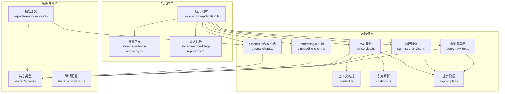
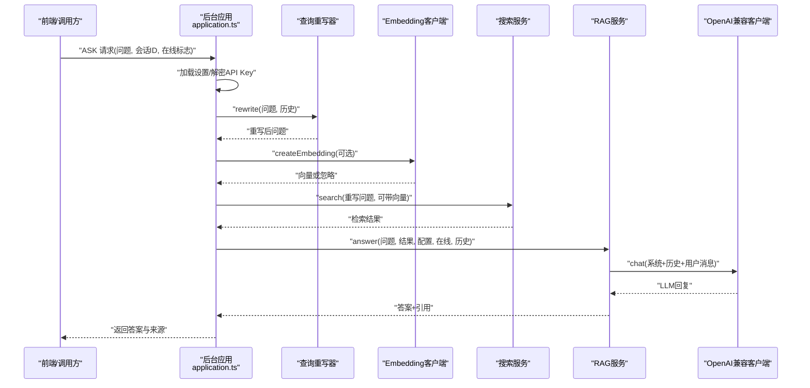
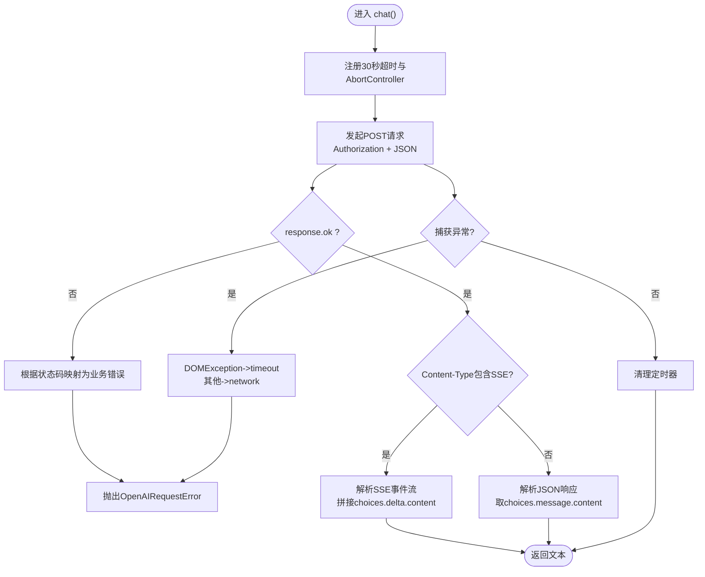
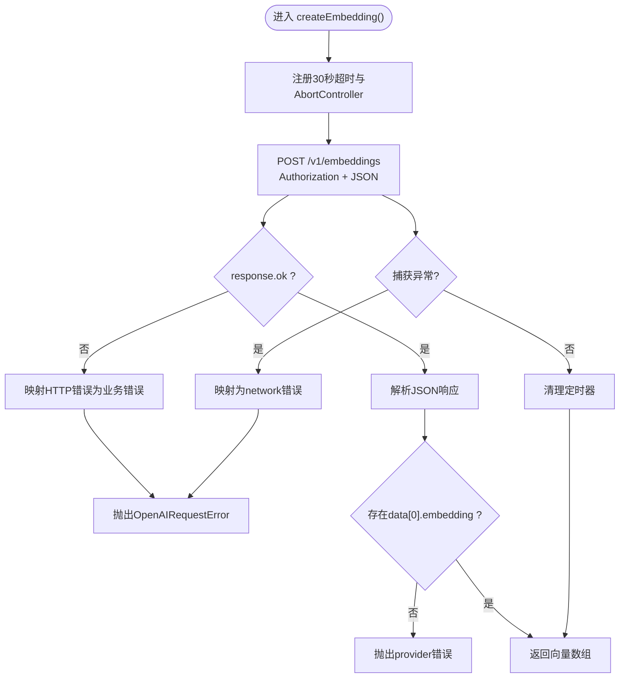
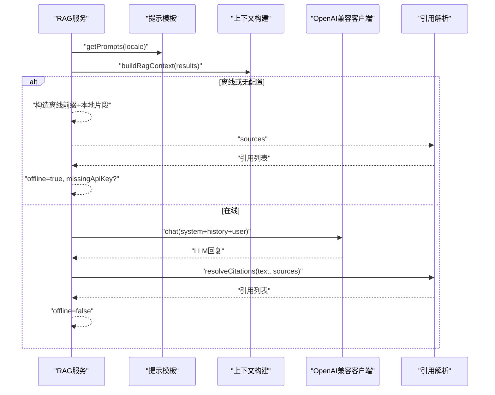
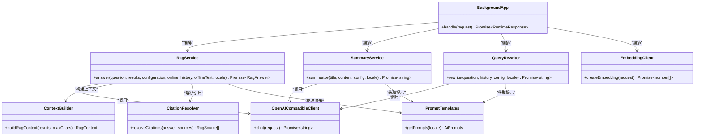

# AI服务集成

<cite>
**本文引用的文件**
- [src/ai/openai-client.ts](file://src/ai/openai-client.ts)
- [src/ai/rag-service.ts](file://src/ai/rag-service.ts)
- [src/ai/embedding-client.ts](file://src/ai/embedding-client.ts)
- [src/ai/summary-service.ts](file://src/ai/summary-service.ts)
- [src/ai/query-rewriter.ts](file://src/ai/query-rewriter.ts)
- [src/ai/context.ts](file://src/ai/context.ts)
- [src/ai/citations.ts](file://src/ai/citations.ts)
- [src/ai/ai-prompts.ts](file://src/ai/ai-prompts.ts)
- [src/background/application.ts](file://src/background/application.ts)
- [src/shared/types.ts](file://src/shared/types.ts)
- [src/shared/constants.ts](file://src/shared/constants.ts)
- [src/storage/settings-repository.ts](file://src/storage/settings-repository.ts)
- [src/storage/embedding-repository.ts](file://src/storage/embedding-repository.ts)
- [src/reports/report-service.ts](file://src/reports/report-service.ts)
- [tests/ai/openai-client.test.ts](file://tests/ai/openai-client.test.ts)
- [tests/ai/rag-service.test.ts](file://tests/ai/rag-service.test.ts)
- [tests/ai/embedding-client.test.ts](file://tests/ai/embedding-client.test.ts)
</cite>

## 目录
1. [简介](#简介)
2. [项目结构](#项目结构)
3. [核心组件](#核心组件)
4. [架构总览](#架构总览)
5. [详细组件分析](#详细组件分析)
6. [依赖关系分析](#依赖关系分析)
7. [性能与成本优化](#性能与成本优化)
8. [故障排查指南](#故障排查指南)
9. [结论](#结论)
10. [附录](#附录)

## 简介
本文件面向BrowseMemory的AI服务集成，系统性阐述OpenAI兼容客户端、检索增强生成（RAG）服务、向量嵌入服务、页面摘要生成、查询重写以及报告生成等模块的设计与实现。文档同时覆盖错误处理与降级策略、配置管理、性能优化与成本控制，并提供扩展与定制化建议，帮助开发者快速理解与迭代AI能力。

## 项目结构
AI相关代码主要位于src/ai目录，配合后台应用入口、设置存储、嵌入向量持久化与报告生成服务，形成从“输入—检索—生成—落库”的闭环。

图示来源
- [src/ai/openai-client.ts:56-125](file://src/ai/openai-client.ts#L56-L125)
- [src/ai/embedding-client.ts:16-87](file://src/ai/embedding-client.ts#L16-L87)
- [src/ai/rag-service.ts:15-66](file://src/ai/rag-service.ts#L15-L66)
- [src/ai/summary-service.ts:7-35](file://src/ai/summary-service.ts#L7-L35)
- [src/ai/query-rewriter.ts:5-52](file://src/ai/query-rewriter.ts#L5-L52)
- [src/ai/context.ts:17-37](file://src/ai/context.ts#L17-L37)
- [src/ai/citations.ts:3-12](file://src/ai/citations.ts#L3-L12)
- [src/ai/ai-prompts.ts:29-200](file://src/ai/ai-prompts.ts#L29-L200)
- [src/background/application.ts:29-63](file://src/background/application.ts#L29-L63)
- [src/storage/settings-repository.ts:8-24](file://src/storage/settings-repository.ts#L8-L24)
- [src/storage/embedding-repository.ts:4-36](file://src/storage/embedding-repository.ts#L4-L36)
- [src/shared/types.ts:6-22](file://src/shared/types.ts#L6-L22)
- [src/shared/constants.ts:12-24](file://src/shared/constants.ts#L12-L24)
- [src/reports/report-service.ts:157-354](file://src/reports/report-service.ts#L157-L354)

章节来源
- [src/ai/openai-client.ts:1-125](file://src/ai/openai-client.ts#L1-L125)
- [src/ai/rag-service.ts:1-66](file://src/ai/rag-service.ts#L1-L66)
- [src/ai/embedding-client.ts:1-87](file://src/ai/embedding-client.ts#L1-L87)
- [src/ai/summary-service.ts:1-35](file://src/ai/summary-service.ts#L1-L35)
- [src/ai/query-rewriter.ts:1-52](file://src/ai/query-rewriter.ts#L1-L52)
- [src/ai/context.ts:1-37](file://src/ai/context.ts#L1-L37)
- [src/ai/citations.ts:1-12](file://src/ai/citations.ts#L1-L12)
- [src/ai/ai-prompts.ts:1-200](file://src/ai/ai-prompts.ts#L1-L200)
- [src/background/application.ts:1-388](file://src/background/application.ts#L1-L388)
- [src/shared/types.ts:1-139](file://src/shared/types.ts#L1-L139)
- [src/shared/constants.ts:1-33](file://src/shared/constants.ts#L1-L33)
- [src/storage/settings-repository.ts:1-57](file://src/storage/settings-repository.ts#L1-L57)
- [src/storage/embedding-repository.ts:1-36](file://src/storage/embedding-repository.ts#L1-L36)
- [src/reports/report-service.ts:1-363](file://src/reports/report-service.ts#L1-L363)

## 核心组件
- OpenAI兼容客户端：统一封装聊天与流式SSE响应、错误码归一化、超时控制与网络异常处理。
- Embedding客户端：封装Embedding API调用，支持鉴权、限流、超时与空向量校验。
- RAG服务：整合上下文构建、提示工程、消息构造与引用解析，支持在线/离线双模。
- 摘要服务：基于提示模板对页面内容进行摘要生成，限制输入长度并裁剪输出。
- 查询重写器：利用最近对话历史重构独立完整的问题，提升后续检索质量。
- 上下文与引用：构建RAG上下文块与引用解析，确保答案可溯源。
- 提示模板：集中管理多语言提示，便于扩展与维护。
- 后台应用编排：聚合各服务，负责设置加载、密钥解密、任务队列与降级策略。
- 报告服务：按日/周/月生成知识型报告，结合摘要与统计信息。

章节来源
- [src/ai/openai-client.ts:56-125](file://src/ai/openai-client.ts#L56-L125)
- [src/ai/embedding-client.ts:16-87](file://src/ai/embedding-client.ts#L16-L87)
- [src/ai/rag-service.ts:15-66](file://src/ai/rag-service.ts#L15-L66)
- [src/ai/summary-service.ts:7-35](file://src/ai/summary-service.ts#L7-L35)
- [src/ai/query-rewriter.ts:5-52](file://src/ai/query-rewriter.ts#L5-L52)
- [src/ai/context.ts:17-37](file://src/ai/context.ts#L17-L37)
- [src/ai/citations.ts:3-12](file://src/ai/citations.ts#L3-L12)
- [src/ai/ai-prompts.ts:29-200](file://src/ai/ai-prompts.ts#L29-L200)
- [src/background/application.ts:29-63](file://src/background/application.ts#L29-L63)
- [src/reports/report-service.ts:157-354](file://src/reports/report-service.ts#L157-L354)

## 架构总览
AI服务通过后台应用统一编排，结合设置仓库与安全存储，实现“在线优先、离线兜底”的稳健策略。RAG流程在多轮对话中引入查询重写，结合可选的向量检索，最终由OpenAI兼容客户端完成推理与流式解析。

图示来源
- [src/background/application.ts:178-251](file://src/background/application.ts#L178-L251)
- [src/ai/query-rewriter.ts:8-50](file://src/ai/query-rewriter.ts#L8-L50)
- [src/ai/embedding-client.ts:23-85](file://src/ai/embedding-client.ts#L23-L85)
- [src/ai/rag-service.ts:18-64](file://src/ai/rag-service.ts#L18-L64)
- [src/ai/openai-client.ts:64-123](file://src/ai/openai-client.ts#L64-L123)

## 详细组件分析

### OpenAI兼容客户端
- 职责：封装聊天接口调用，支持JSON与SSE两种响应格式；统一HTTP状态码到业务错误码的映射；内置30秒超时与AbortController中断。
- 错误处理：认证失败、速率限制、网络异常、超时、未知提供商错误，均以统一错误对象抛出，便于上层捕获与降级。
- 兼容性：自动拼接/v1/chat/completions端点，支持自定义fetcher以适配Service Worker环境。

图示来源
- [src/ai/openai-client.ts:64-123](file://src/ai/openai-client.ts#L64-L123)

章节来源
- [src/ai/openai-client.ts:1-125](file://src/ai/openai-client.ts#L1-L125)
- [tests/ai/openai-client.test.ts:1-116](file://tests/ai/openai-client.test.ts#L1-L116)

### Embedding客户端
- 职责：调用/v1/embeddings端点生成向量；校验响应中是否存在向量数组；对鉴权、限流、网络与超时进行统一错误归一化。
- 优化：自动去除baseUrl尾部斜杠，保证端点拼接正确。

图示来源
- [src/ai/embedding-client.ts:23-85](file://src/ai/embedding-client.ts#L23-L85)

章节来源
- [src/ai/embedding-client.ts:1-87](file://src/ai/embedding-client.ts#L1-L87)
- [tests/ai/embedding-client.test.ts:1-97](file://tests/ai/embedding-client.test.ts#L1-L97)

### RAG服务
- 职责：构建RAG上下文、拼装系统/用户消息、调用LLM生成答案、解析引用。
- 降级策略：当未提供配置或离线时，返回本地片段与离线标记，不调用外部API。
- 多语言：通过提示模板按locale动态选择指令与前缀。

图示来源
- [src/ai/rag-service.ts:18-64](file://src/ai/rag-service.ts#L18-L64)
- [src/ai/context.ts:17-37](file://src/ai/context.ts#L17-L37)
- [src/ai/citations.ts:3-12](file://src/ai/citations.ts#L3-L12)
- [src/ai/ai-prompts.ts:29-60](file://src/ai/ai-prompts.ts#L29-L60)

章节来源
- [src/ai/rag-service.ts:1-66](file://src/ai/rag-service.ts#L1-L66)
- [src/ai/context.ts:1-37](file://src/ai/context.ts#L1-L37)
- [src/ai/citations.ts:1-12](file://src/ai/citations.ts#L1-L12)
- [src/ai/ai-prompts.ts:1-200](file://src/ai/ai-prompts.ts#L1-L200)
- [tests/ai/rag-service.test.ts:1-103](file://tests/ai/rag-service.test.ts#L1-L103)

### 摘要服务
- 职责：对页面标题与内容进行摘要生成，限制输入字符数并裁剪输出长度，确保成本与性能平衡。
- 多语言：复用提示模板，按locale生成摘要指令。

章节来源
- [src/ai/summary-service.ts:1-35](file://src/ai/summary-service.ts#L1-L35)
- [src/ai/ai-prompts.ts:46-60](file://src/ai/ai-prompts.ts#L46-L60)

### 查询重写器
- 职责：基于最近对话历史将用户问题改写为独立、完整的查询，减少代词歧义，提升检索效果。
- 限制：仅保留最近4条消息，避免上下文过长影响性能。

章节来源
- [src/ai/query-rewriter.ts:1-52](file://src/ai/query-rewriter.ts#L1-L52)

### 上下文与引用
- 上下文构建：截取最多5条结果，每条限定最大片段长度，拼接标题、URL、访问时间与阅读时长，形成结构化上下文。
- 引用解析：从答案中提取引用编号，映射到对应来源。

章节来源
- [src/ai/context.ts:17-37](file://src/ai/context.ts#L17-L37)
- [src/ai/citations.ts:3-12](file://src/ai/citations.ts#L3-L12)

### 后台应用编排
- 设置与密钥：从设置仓库读取配置，必要时解密API Key；提供连接测试接口。
- 任务队列：在启用嵌入与摘要时，将新抓取页面加入队列异步处理。
- 查询重写：在多轮对话场景中优先使用重写后的独立问题。
- 向量检索：可选地生成查询向量并与BM25混合检索。
- 报告生成：按日/周/月生成报告，支持强制重算与多语言。

章节来源
- [src/background/application.ts:69-351](file://src/background/application.ts#L69-L351)
- [src/storage/settings-repository.ts:8-24](file://src/storage/settings-repository.ts#L8-L24)
- [src/shared/types.ts:6-22](file://src/shared/types.ts#L6-L22)
- [src/shared/constants.ts:12-24](file://src/shared/constants.ts#L12-L24)

### 报告服务
- 职责：收集指定时间维度内的页面记录，构建提示并调用LLM生成报告；抽取主题标签，保存至报告仓库。
- 多语言：根据locale注入语言指令与本地化文案。

章节来源
- [src/reports/report-service.ts:157-354](file://src/reports/report-service.ts#L157-L354)

## 依赖关系分析
- 组件内聚：AI服务各自职责清晰，提示模板集中管理，便于扩展与维护。
- 组件耦合：RAG服务依赖上下文与引用模块；后台应用编排多个服务并协调设置与密钥。
- 外部依赖：OpenAI兼容API、向量服务、数据库与任务队列；错误处理与降级策略降低对外部依赖的强耦合。

图示来源
- [src/ai/openai-client.ts:56-125](file://src/ai/openai-client.ts#L56-L125)
- [src/ai/embedding-client.ts:16-87](file://src/ai/embedding-client.ts#L16-L87)
- [src/ai/rag-service.ts:15-66](file://src/ai/rag-service.ts#L15-L66)
- [src/ai/summary-service.ts:7-35](file://src/ai/summary-service.ts#L7-L35)
- [src/ai/query-rewriter.ts:5-52](file://src/ai/query-rewriter.ts#L5-L52)
- [src/ai/context.ts:17-37](file://src/ai/context.ts#L17-L37)
- [src/ai/citations.ts:3-12](file://src/ai/citations.ts#L3-L12)
- [src/ai/ai-prompts.ts:197-200](file://src/ai/ai-prompts.ts#L197-L200)
- [src/background/application.ts:29-63](file://src/background/application.ts#L29-L63)

## 性能与成本优化
- 输入裁剪
  - RAG上下文：限制最多5条结果与单条最大片段长度，控制上下文长度。
  - 摘要输入：限制最大字符数，避免超长输入导致延迟与费用上升。
  - 输出裁剪：摘要输出限制最大长度，确保响应轻量。
- 降级策略
  - 离线回退：无配置或离线时返回本地片段与离线标记，避免外部调用。
  - 非致命异常：嵌入失败或重写失败时不阻断主流程，回退到BM25检索或原问题。
- 连接测试与配置
  - 提供在线连通性测试接口，提前发现配置问题，减少无效调用。
- 任务队列与异步处理
  - 将嵌入与摘要放入队列异步执行，避免主线程阻塞。
- 缓存与复用
  - 系统提示先行发送以利用模型前缀缓存，提高重复查询效率。
- 成本控制
  - 严格限制上下文与输出长度；在离线或低频场景优先使用本地能力。
  - 对高频调用设置合理的速率限制与重试退避策略。

章节来源
- [src/ai/context.ts:17-37](file://src/ai/context.ts#L17-L37)
- [src/ai/summary-service.ts:5-35](file://src/ai/summary-service.ts#L5-L35)
- [src/background/application.ts:130-177](file://src/background/application.ts#L130-L177)
- [src/shared/constants.ts:31-33](file://src/shared/constants.ts#L31-L33)

## 故障排查指南
- 认证失败
  - 现象：返回认证错误码。
  - 排查：确认API Key是否正确、域名与模型配置是否匹配。
- 速率限制
  - 现象：返回速率限制错误码。
  - 排查：降低请求频率，或在应用层增加退避策略。
- 超时
  - 现象：返回超时错误码。
  - 排查：检查网络状况与上游服务可用性；考虑增大超时阈值或启用重试。
- 网络异常
  - 现象：返回网络错误码。
  - 排查：检查代理、防火墙与跨域配置；确保fetcher可用。
- 提供商错误
  - 现象：返回未知提供商错误。
  - 排查：查看上游返回体与状态码，定位服务端问题。
- 嵌入向量缺失
  - 现象：返回提供商错误（未返回向量）。
  - 排查：确认模型支持Embedding且输入格式正确。
- 离线不可用
  - 现象：返回离线标记与本地片段。
  - 排查：确认设置中AI配置是否为空；若需在线，请补充配置。

章节来源
- [src/ai/openai-client.ts:81-120](file://src/ai/openai-client.ts#L81-L120)
- [src/ai/embedding-client.ts:40-82](file://src/ai/embedding-client.ts#L40-L82)
- [tests/ai/openai-client.test.ts:50-114](file://tests/ai/openai-client.test.ts#L50-L114)
- [tests/ai/embedding-client.test.ts:32-76](file://tests/ai/embedding-client.test.ts#L32-L76)
- [tests/ai/rag-service.test.ts:58-84](file://tests/ai/rag-service.test.ts#L58-L84)

## 结论
BrowseMemory的AI服务集成以OpenAI兼容客户端为核心，围绕RAG、摘要、查询重写与报告生成构建了完整的知识问答与总结体系。通过严格的错误归一化、离线降级与任务队列异步化，系统在稳定性与成本控制方面具备良好表现。提示模板集中化设计便于国际化扩展，后台应用编排则提供了灵活的配置与运行时控制能力。

## 附录

### AI服务配置指南
- 必填项
  - 聊天API地址与模型：用于RAG与摘要生成。
  - 聊天API Key：用于鉴权。
- 可选项
  - 嵌入启用开关、嵌入API地址与模型、嵌入API Key或复用聊天Key。
  - 语言偏好：决定提示模板与报告语言。
- 存储与安全
  - API Key采用加密存储，后台应用负责解密与测试连通性。
- 默认值参考
  - 聊天API地址与模型、嵌入默认地址与模型、是否复用聊天Key、默认语言等。

章节来源
- [src/shared/types.ts:6-22](file://src/shared/types.ts#L6-L22)
- [src/shared/constants.ts:12-24](file://src/shared/constants.ts#L12-L24)
- [src/storage/settings-repository.ts:8-24](file://src/storage/settings-repository.ts#L8-L24)
- [src/background/application.ts:115-177](file://src/background/application.ts#L115-L177)

### 扩展与定制化建议
- 新增语言
  - 在提示模板中新增语言键值对，无需修改服务逻辑。
- 自定义提示
  - 调整系统提示与用户模板，以适配特定领域或风格。
- 增强检索
  - 在查询重写后引入更多上下文特征（如时间窗口、领域标签），进一步提升检索质量。
- 优化缓存
  - 对热点问题与常见片段建立本地缓存，减少重复计算与外部调用。
- 监控与可观测性
  - 记录调用耗时、错误分布与成本指标，辅助容量规划与优化。

章节来源
- [src/ai/ai-prompts.ts:29-200](file://src/ai/ai-prompts.ts#L29-L200)
- [src/background/application.ts:217-237](file://src/background/application.ts#L217-L237)