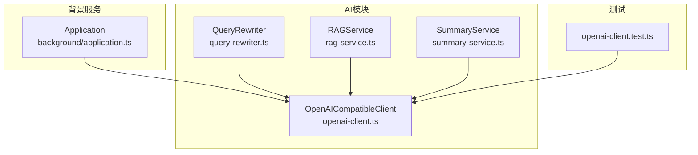
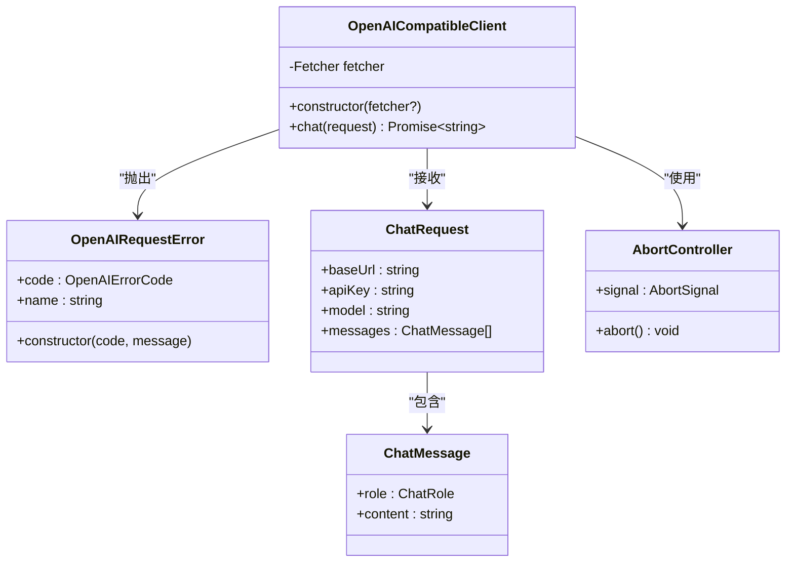
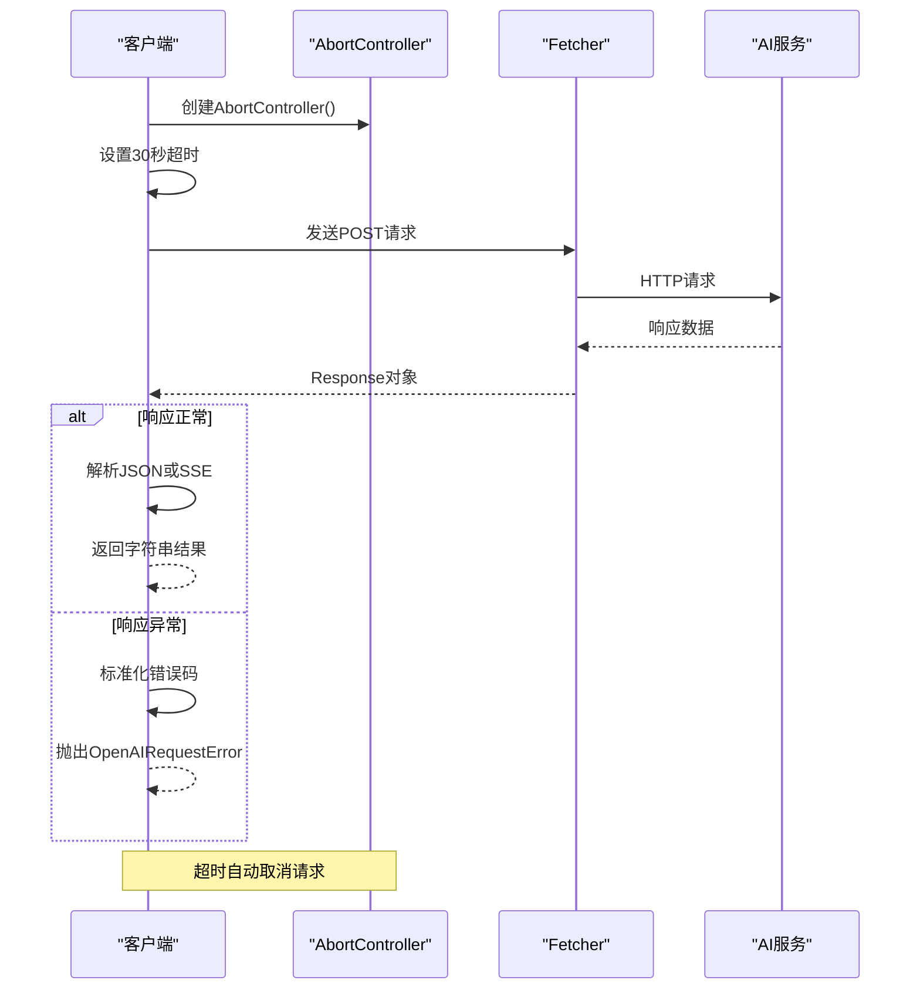
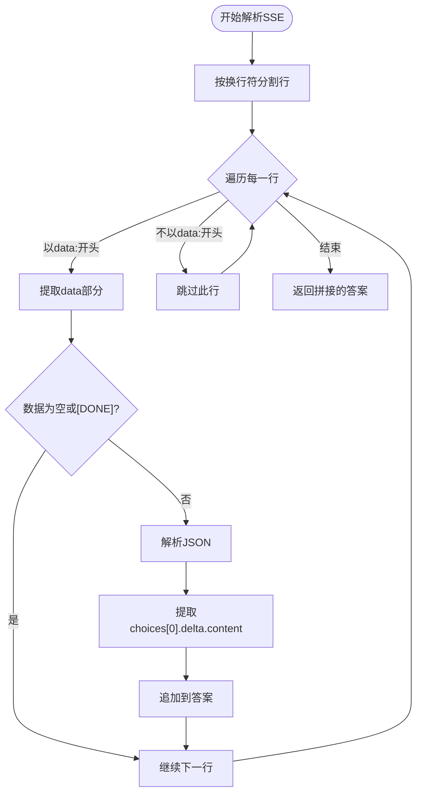
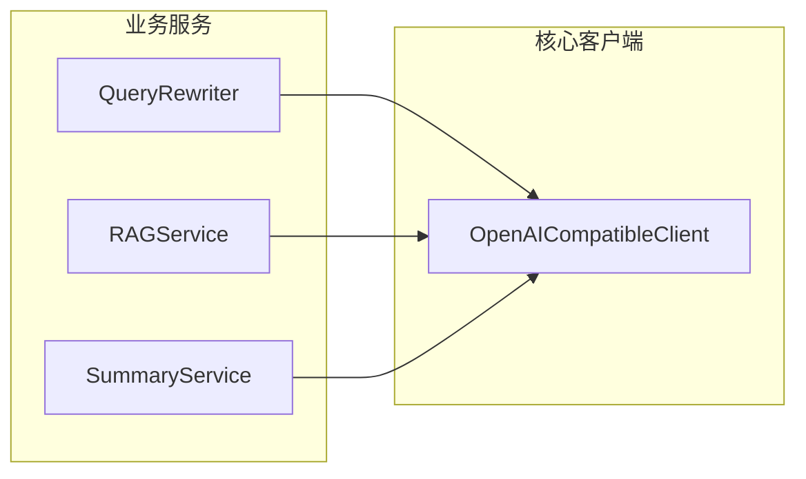
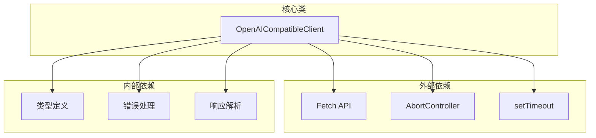

# OpenAI兼容客户端

<cite>
**本文档引用的文件**
- [src/ai/openai-client.ts](file://src/ai/openai-client.ts)
- [tests/ai/openai-client.test.ts](file://tests/ai/openai-client.test.ts)
- [src/background/application.ts](file://src/background/application.ts)
- [src/ai/query-rewriter.ts](file://src/ai/query-rewriter.ts)
- [src/ai/rag-service.ts](file://src/ai/rag-service.ts)
- [src/ai/summary-service.ts](file://src/ai/summary-service.ts)
</cite>

## 目录
1. [简介](#简介)
2. [项目结构](#项目结构)
3. [核心组件](#核心组件)
4. [架构概览](#架构概览)
5. [详细组件分析](#详细组件分析)
6. [依赖关系分析](#依赖关系分析)
7. [性能考虑](#性能考虑)
8. [故障排除指南](#故障排除指南)
9. [结论](#结论)
10. [附录](#附录)

## 简介
本文件为OpenAI兼容客户端的技术文档，重点介绍OpenAICompatibleClient类的实现细节，包括ChatRequest接口、ChatMessage类型定义和ChatRole枚举。文档详细解释了API端点构建、HTTP请求封装和响应解析机制，涵盖错误处理策略（认证失败、速率限制、网络超时和提供方错误的分类处理）、Server-Sent Events(SSE)流式响应的解析逻辑、AbortController的超时控制机制与内存泄漏防护，以及API配置示例（基础URL、API密钥和模型参数设置）。此外，还说明了Service Worker环境下fetch函数绑定和跨域处理，并提供客户端使用的最佳实践和性能优化建议。

## 项目结构
OpenAI兼容客户端位于src/ai目录下，核心实现集中在openai-client.ts文件中，配套测试位于tests/ai目录。该客户端被多个业务模块复用，包括查询重写器、RAG服务和摘要服务等。



**图表来源**
- [src/ai/openai-client.ts:56-98](file://src/ai/openai-client.ts#L56-L98)
- [src/background/application.ts:1-50](file://src/background/application.ts#L1-L50)
- [src/ai/query-rewriter.ts:1-20](file://src/ai/query-rewriter.ts#L1-L20)
- [src/ai/rag-service.ts:1-30](file://src/ai/rag-service.ts#L1-L30)
- [src/ai/summary-service.ts:1-20](file://src/ai/summary-service.ts#L1-L20)
- [tests/ai/openai-client.test.ts:1-115](file://tests/ai/openai-client.test.ts#L1-L115)

**章节来源**
- [src/ai/openai-client.ts:1-120](file://src/ai/openai-client.ts#L1-L120)
- [src/background/application.ts:1-60](file://src/background/application.ts#L1-L60)

## 核心组件
OpenAICompatibleClient是本项目的AI通信核心，负责与兼容OpenAI格式的第三方服务进行交互。其主要职责包括：
- 构建API端点URL并发送HTTP请求
- 处理JSON和SSE两种响应格式
- 将底层错误标准化为统一的错误码
- 提供超时控制和资源清理能力

客户端支持以下关键类型：
- ChatRole：系统角色枚举，支持"system"、"user"、"assistant"
- ChatMessage：消息对象，包含角色和内容字段
- ChatRequest：聊天请求对象，包含基础URL、API密钥、模型名称和消息数组

错误处理体系采用OpenAIRequestError异常类，配合OpenAIErrorCode枚举，将HTTP状态码映射到统一的错误类别：
- authentication：认证失败（401/403）
- rate_limit：速率限制（429）
- timeout：超时（AbortController触发）
- network：网络错误（TypeError）
- provider：其他提供方错误

**章节来源**
- [src/ai/openai-client.ts:1-30](file://src/ai/openai-client.ts#L1-L30)

## 架构概览
OpenAI兼容客户端采用简洁的单类架构，通过依赖注入的方式支持不同运行环境（浏览器、Service Worker）。



**图表来源**
- [src/ai/openai-client.ts:56-98](file://src/ai/openai-client.ts#L56-L98)
- [src/ai/openai-client.ts:15-30](file://src/ai/openai-client.ts#L15-L30)

## 详细组件分析

### OpenAICompatibleClient类详解
OpenAICompatibleClient是整个系统的中心类，实现了与兼容OpenAI格式的服务通信功能。

#### 构造函数与依赖注入
构造函数支持可选的fetcher参数，默认使用self.fetch确保在Service Worker环境中正确工作。这种设计避免了"非法调用"问题，保证在不同执行上下文中的一致性。

#### 聊天请求流程
chat方法执行完整的请求生命周期：



**图表来源**
- [src/ai/openai-client.ts:64-98](file://src/ai/openai-client.ts#L64-L98)

#### API端点构建
endpoint函数负责构建标准的OpenAI v1/chat/completions端点，自动去除尾部斜杠并添加版本路径，确保与OpenAI兼容的URL格式。

#### HTTP请求封装
请求封装包含以下关键要素：
- Authorization头部使用Bearer模式携带API密钥
- Content-Type设置为application/json
- 请求体包含model、messages和stream=false参数
- 使用AbortController的signal进行超时控制

#### 响应解析机制
客户端支持两种响应格式的智能解析：

**JSON响应解析**
- 直接从choices数组提取message.content字段
- 适用于非流式响应

**SSE响应解析**
parseSse函数专门处理Server-Sent Events格式：
- 按行解析响应体
- 过滤非data:行
- 跳过空数据和[DONE]标记
- 从delta.content提取增量内容
- 累加所有增量片段形成完整回答



**图表来源**
- [src/ai/openai-client.ts:38-54](file://src/ai/openai-client.ts#L38-L54)

#### 错误处理策略
错误处理采用分层分类机制：

**HTTP状态码标准化**
- 401/403 → authentication
- 429 → rate_limit  
- 其他错误 → provider

**异常类型处理**
- AbortError → timeout
- TypeError → network
- 其他异常 → provider

**章节来源**
- [src/ai/openai-client.ts:56-98](file://src/ai/openai-client.ts#L56-L98)
- [tests/ai/openai-client.test.ts:50-99](file://tests/ai/openai-client.test.ts#L50-L99)

### 类型系统设计
类型系统采用TypeScript原生类型，确保编译时安全和良好的开发体验。

#### ChatRole枚举
定义了三种标准角色：
- system：系统消息，用于设定对话行为
- user：用户消息，代表用户输入
- assistant：助手消息，代表AI回复

#### ChatMessage接口
包含两个必需字段：
- role：消息角色（ChatRole类型）
- content：消息内容（字符串）

#### ChatRequest接口
包含四个必需字段：
- baseUrl：服务基础URL
- apiKey：API访问密钥
- model：模型名称
- messages：消息数组（ChatMessage[]）

**章节来源**
- [src/ai/openai-client.ts:1-13](file://src/ai/openai-client.ts#L1-L13)

### 服务集成示例
多个业务服务通过依赖注入方式使用OpenAICompatibleClient：



**图表来源**
- [src/ai/query-rewriter.ts:1-20](file://src/ai/query-rewriter.ts#L1-L20)
- [src/ai/rag-service.ts:1-30](file://src/ai/rag-service.ts#L1-L30)
- [src/ai/summary-service.ts:1-20](file://src/ai/summary-service.ts#L1-L20)

**章节来源**
- [src/ai/query-rewriter.ts:1-20](file://src/ai/query-rewriter.ts#L1-L20)
- [src/ai/rag-service.ts:1-30](file://src/ai/rag-service.ts#L1-L30)
- [src/ai/summary-service.ts:1-20](file://src/ai/summary-service.ts#L1-L20)

## 依赖关系分析
OpenAI兼容客户端与其他模块的依赖关系清晰明确，遵循单一职责原则。



**图表来源**
- [src/ai/openai-client.ts:56-98](file://src/ai/openai-client.ts#L56-L98)

**章节来源**
- [src/ai/openai-client.ts:56-98](file://src/ai/openai-client.ts#L56-L98)

## 性能考虑
基于代码实现分析，以下是关键的性能优化建议：

### 超时控制与资源管理
- 默认30秒超时时间平衡了响应速度与长时间计算需求
- AbortController确保超时后及时释放网络连接
- 建议根据具体场景调整超时阈值

### 内存使用优化
- SSE解析采用增量拼接，避免一次性加载大文本
- 及时清理定时器和信号处理器防止内存泄漏
- 建议在长会话中定期清理未使用的资源

### 网络效率
- 单次请求包含完整消息历史，减少往返次数
- 流式响应支持实时显示，提升用户体验
- 建议合理控制消息历史长度避免请求过大

## 故障排除指南
基于测试覆盖的错误场景，提供针对性的故障排除建议：

### 认证失败排查
**症状**：收到authentication错误
**可能原因**：
- API密钥无效或已过期
- 权限不足或账户未激活
- 基础URL配置错误

**解决步骤**：
1. 验证API密钥格式和有效期
2. 确认账户状态正常
3. 检查baseUrl末尾是否有多余斜杠

### 速率限制处理
**症状**：收到rate_limit错误
**应对策略**：
- 实现指数退避重试机制
- 合理控制请求频率
- 考虑使用队列管理系统

### 网络超时诊断
**症状**：收到timeout错误
**排查要点**：
- 检查网络连接稳定性
- 验证服务器可达性
- 调整超时阈值适应慢速网络

### 提供方错误分析
**症状**：收到provider错误
**处理方案**：
- 记录详细的HTTP状态码和响应体
- 实现重试逻辑和降级策略
- 监控服务可用性和性能指标

**章节来源**
- [tests/ai/openai-client.test.ts:50-115](file://tests/ai/openai-client.test.ts#L50-L115)

## 结论
OpenAI兼容客户端提供了简洁而强大的AI服务集成能力。其设计特点包括：

- **类型安全**：完整的TypeScript类型定义确保编译时安全
- **环境适配**：支持浏览器和Service Worker等多种运行环境
- **错误标准化**：统一的错误分类便于上层处理
- **响应灵活**：同时支持JSON和SSE两种响应格式
- **资源管理**：完善的超时控制和内存泄漏防护

该客户端为后续扩展（如支持流式响应、批量请求、缓存机制等）奠定了良好基础。

## 附录

### API配置示例
```typescript
// 基础配置
const config = {
  baseUrl: "https://api.openai.com",
  apiKey: "your-api-key-here",
  model: "gpt-3.5-turbo"
};

// 聊天请求示例
const request: ChatRequest = {
  ...config,
  messages: [
    { role: "system", content: "你是专业的助手" },
    { role: "user", content: "你好" }
  ]
};
```

### Service Worker环境注意事项
- 使用self.fetch确保正确的执行上下文
- 注意跨域请求的CORS配置
- 合理处理离线状态和缓存策略

### 最佳实践建议
1. **错误处理**：始终捕获OpenAIRequestError并根据code类型处理
2. **资源清理**：在组件卸载时调用controller.abort()清理资源
3. **性能监控**：记录请求耗时和成功率指标
4. **安全考虑**：避免在前端暴露敏感的API密钥
5. **用户体验**：实现适当的加载状态和错误提示