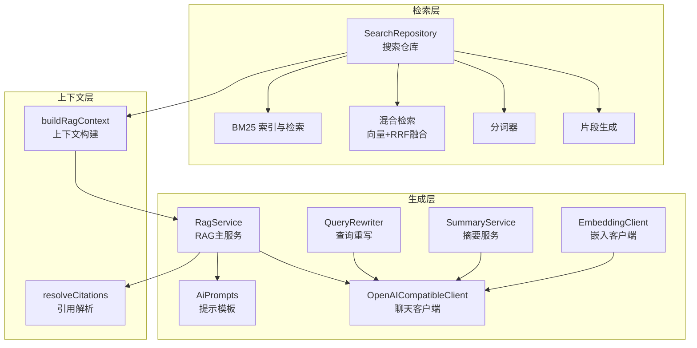
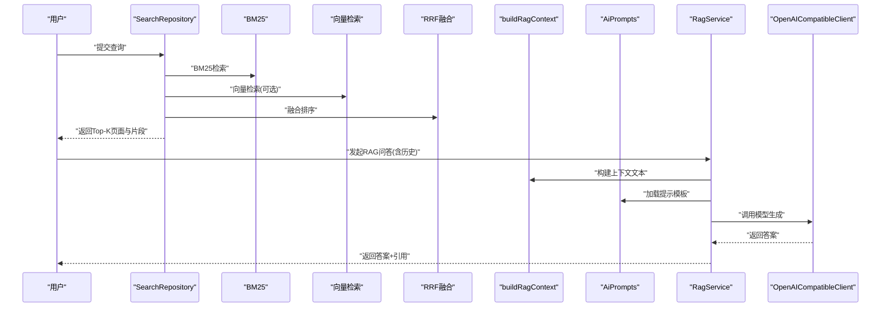
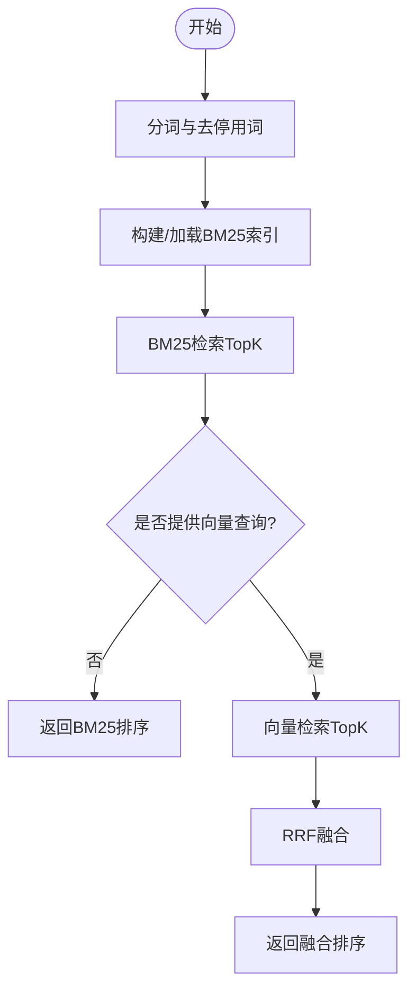
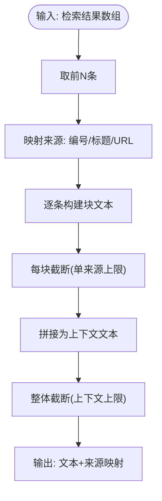
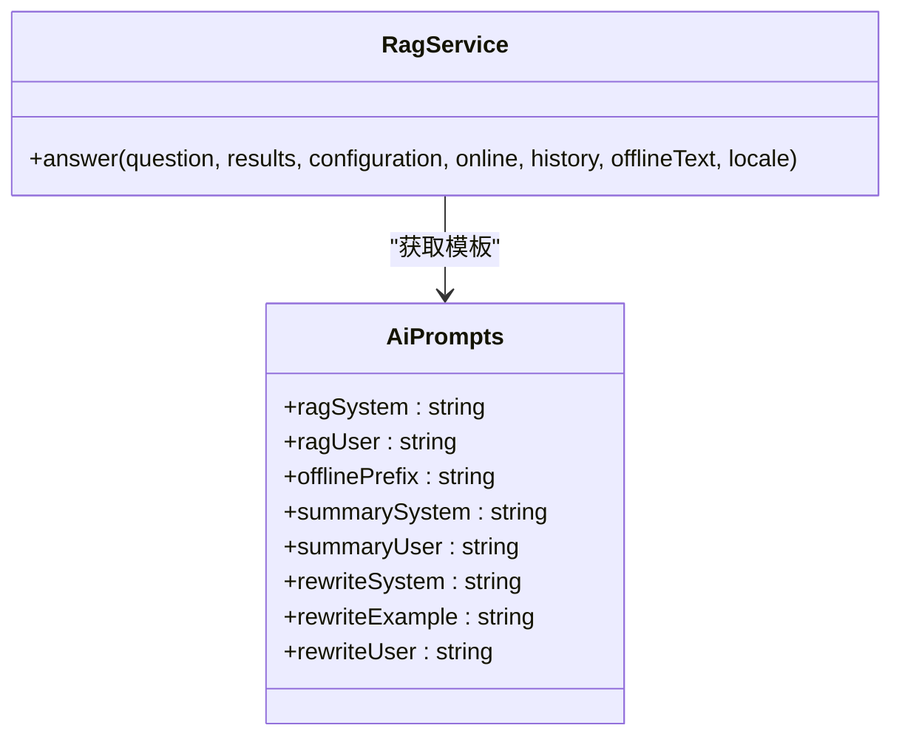
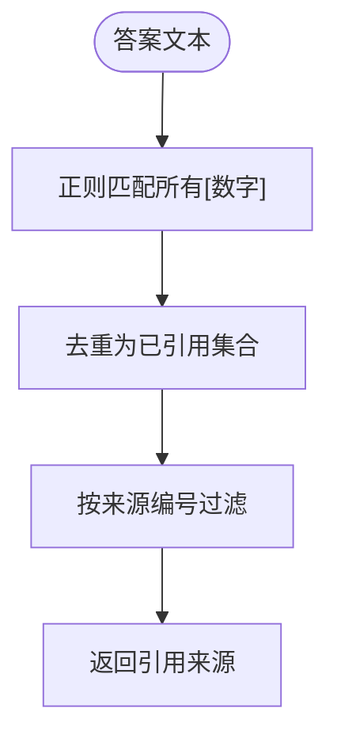
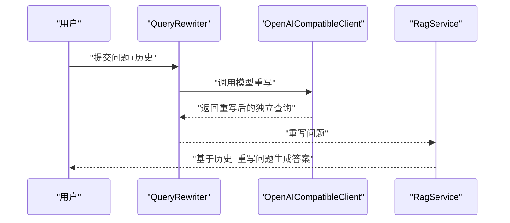
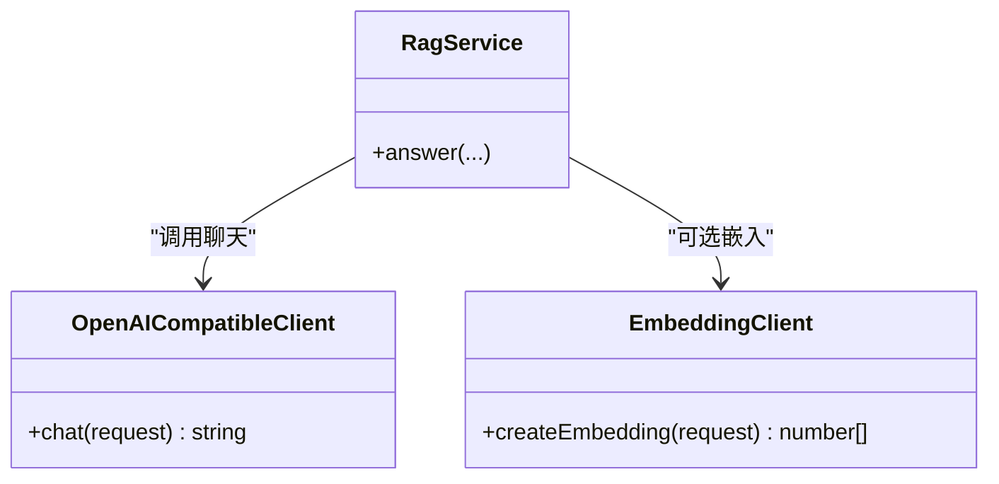
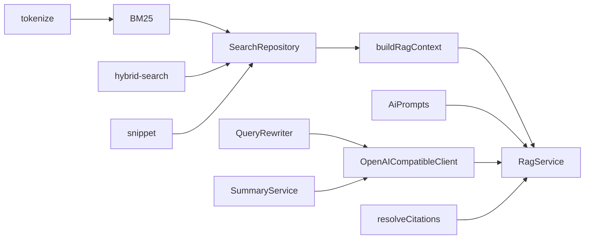

# RAG检索增强生成服务

<cite>
**本文档引用的文件**
- [src/ai/rag-service.ts](file://src/ai/rag-service.ts)
- [src/ai/context.ts](file://src/ai/context.ts)
- [src/ai/citations.ts](file://src/ai/citations.ts)
- [src/ai/ai-prompts.ts](file://src/ai/ai-prompts.ts)
- [src/ai/openai-client.ts](file://src/ai/openai-client.ts)
- [src/ai/embedding-client.ts](file://src/ai/embedding-client.ts)
- [src/ai/query-rewriter.ts](file://src/ai/query-rewriter.ts)
- [src/ai/summary-service.ts](file://src/ai/summary-service.ts)
- [src/search/bm25.ts](file://src/search/bm25.ts)
- [src/search/hybrid-search.ts](file://src/search/hybrid-search.ts)
- [src/search/tokenize.ts](file://src/search/tokenize.ts)
- [src/search/snippet.ts](file://src/search/snippet.ts)
- [src/storage/search-repository.ts](file://src/storage/search-repository.ts)
- [src/shared/types.ts](file://src/shared/types.ts)
</cite>

## 目录
1. [引言](#引言)
2. [项目结构](#项目结构)
3. [核心组件](#核心组件)
4. [架构总览](#架构总览)
5. [详细组件分析](#详细组件分析)
6. [依赖关系分析](#依赖关系分析)
7. [性能考虑](#性能考虑)
8. [故障排除指南](#故障排除指南)
9. [结论](#结论)
10. [附录](#附录)

## 引言
本文件面向RAG（检索增强生成）服务的技术文档，系统性阐述从“检索—上下文构建—生成”三阶段的整体架构与实现细节。重点覆盖：
- 检索机制：BM25相似度计算与向量嵌入匹配策略，以及混合检索融合方法
- 上下文构建：如何将检索结果组织为可注入LLM的上下文文本，并进行截断与来源映射
- 提示工程：系统提示、用户问题与检索上下文的组合方式及多语言模板
- 引用生成：基于答案中标注的引用解析与来源过滤
- 多轮对话：历史消息管理与查询重写以提升上下文一致性
- 配置参数：检索窗口、相似度阈值、生成参数等
- 性能优化：缓存、批量处理与流式响应解析
- 实际使用示例与故障排除

## 项目结构
RAG服务由“检索层—上下文层—生成层”三层构成，配合提示模板与工具客户端完成端到端流程。

图表来源
- [src/storage/search-repository.ts:15-110](file://src/storage/search-repository.ts#L15-L110)
- [src/search/bm25.ts:38-166](file://src/search/bm25.ts#L38-L166)
- [src/search/hybrid-search.ts:57-78](file://src/search/hybrid-search.ts#L57-L78)
- [src/search/tokenize.ts:37-50](file://src/search/tokenize.ts#L37-L50)
- [src/search/snippet.ts:8-52](file://src/search/snippet.ts#L8-L52)
- [src/ai/context.ts:17-37](file://src/ai/context.ts#L17-L37)
- [src/ai/citations.ts:3-12](file://src/ai/citations.ts#L3-L12)
- [src/ai/ai-prompts.ts:197-200](file://src/ai/ai-prompts.ts#L197-L200)
- [src/ai/rag-service.ts:15-66](file://src/ai/rag-service.ts#L15-L66)
- [src/ai/query-rewriter.ts:5-52](file://src/ai/query-rewriter.ts#L5-L52)
- [src/ai/summary-service.ts:7-35](file://src/ai/summary-service.ts#L7-L35)
- [src/ai/openai-client.ts:56-125](file://src/ai/openai-client.ts#L56-L125)
- [src/ai/embedding-client.ts:16-87](file://src/ai/embedding-client.ts#L16-L87)

章节来源
- [src/storage/search-repository.ts:15-110](file://src/storage/search-repository.ts#L15-L110)
- [src/ai/rag-service.ts:15-66](file://src/ai/rag-service.ts#L15-L66)

## 核心组件
- 检索与排序
  - BM25索引构建、更新与检索，支持标题与正文加权、停用词过滤与分词
  - 向量相似度计算（余弦相似度），暴力检索（适用于小规模）
  - Reciprocal Rank Fusion（RRF）融合BM25与向量结果，统一排序
- 上下文构建
  - 截断策略与块拼接，限制最大字符数与每来源最大片段长度
  - 来源编号映射，便于引用解析
- 提示工程
  - 多语言模板集中管理，按区域设置动态选择
  - RAG系统提示、用户模板、离线模式前缀
- 引用生成
  - 基于答案中出现的数字引用标记，筛选对应来源
- 生成与客户端
  - 兼容OpenAI协议的聊天与嵌入客户端，支持SSE流式解析与错误码映射
- 查询重写与摘要
  - 基于历史消息重写独立查询，减少代词歧义
  - 页面摘要生成，限制输入长度与输出长度

章节来源
- [src/search/bm25.ts:38-166](file://src/search/bm25.ts#L38-L166)
- [src/search/hybrid-search.ts:17-78](file://src/search/hybrid-search.ts#L17-L78)
- [src/search/tokenize.ts:37-50](file://src/search/tokenize.ts#L37-L50)
- [src/search/snippet.ts:8-52](file://src/search/snippet.ts#L8-L52)
- [src/ai/context.ts:17-37](file://src/ai/context.ts#L17-L37)
- [src/ai/citations.ts:3-12](file://src/ai/citations.ts#L3-L12)
- [src/ai/ai-prompts.ts:197-200](file://src/ai/ai-prompts.ts#L197-L200)
- [src/ai/openai-client.ts:56-125](file://src/ai/openai-client.ts#L56-L125)
- [src/ai/embedding-client.ts:16-87](file://src/ai/embedding-client.ts#L16-L87)
- [src/ai/query-rewriter.ts:5-52](file://src/ai/query-rewriter.ts#L5-L52)
- [src/ai/summary-service.ts:7-35](file://src/ai/summary-service.ts#L7-L35)

## 架构总览
RAG服务的端到端流程如下：

图表来源
- [src/storage/search-repository.ts:35-108](file://src/storage/search-repository.ts#L35-L108)
- [src/search/bm25.ts:125-166](file://src/search/bm25.ts#L125-L166)
- [src/search/hybrid-search.ts:35-78](file://src/search/hybrid-search.ts#L35-L78)
- [src/ai/context.ts:17-37](file://src/ai/context.ts#L17-L37)
- [src/ai/ai-prompts.ts:197-200](file://src/ai/ai-prompts.ts#L197-L200)
- [src/ai/rag-service.ts:18-64](file://src/ai/rag-service.ts#L18-L64)
- [src/ai/openai-client.ts:64-125](file://src/ai/openai-client.ts#L64-L125)

## 详细组件分析

### 检索与排序（BM25与向量）
- BM25
  - 输入文档包含pageId、标题与正文；标题权重高于正文
  - 文档频率与逆文档频率用于计算TF-IDF分数，结合平均文档长度与饱和因子
  - 支持插入/删除文档，增量维护索引
- 向量检索
  - 余弦相似度评分，暴力搜索适用于小规模向量集
- 融合策略
  - RRF将两个列表的排名位置融合，k常量控制衰减速度

图表来源
- [src/search/bm25.ts:71-166](file://src/search/bm25.ts#L71-L166)
- [src/search/hybrid-search.ts:57-78](file://src/search/hybrid-search.ts#L57-L78)
- [src/search/tokenize.ts:37-50](file://src/search/tokenize.ts#L37-L50)

章节来源
- [src/search/bm25.ts:38-166](file://src/search/bm25.ts#L38-L166)
- [src/search/hybrid-search.ts:17-78](file://src/search/hybrid-search.ts#L17-L78)
- [src/search/tokenize.ts:1-50](file://src/search/tokenize.ts#L1-L50)

### 上下文构建与截断
- 选取Top-N结果，构建带编号的块，包含标题、URL、访问日期与阅读时长
- 对每个片段进行长度截断，限制单来源最大长度
- 整体上下文文本按最大字符数截断，确保不超出模型上下文

图表来源
- [src/ai/context.ts:17-37](file://src/ai/context.ts#L17-L37)

章节来源
- [src/ai/context.ts:17-37](file://src/ai/context.ts#L17-L37)

### 提示工程与模板
- 多语言模板集中管理，按区域设置动态选择
- RAG系统提示约束仅基于检索证据回答，并要求引用格式
- 用户模板包含占位符{context}与{question}
- 离线模式前缀用于无API时的降级展示

图表来源
- [src/ai/ai-prompts.ts:10-27](file://src/ai/ai-prompts.ts#L10-L27)
- [src/ai/rag-service.ts:27-51](file://src/ai/rag-service.ts#L27-L51)

章节来源
- [src/ai/ai-prompts.ts:197-200](file://src/ai/ai-prompts.ts#L197-L200)
- [src/ai/rag-service.ts:27-51](file://src/ai/rag-service.ts#L27-L51)

### 引用生成（Citations）
- 从答案文本中提取所有数字引用标记
- 过滤出被引用的来源，形成最终引用列表

图表来源
- [src/ai/citations.ts:3-12](file://src/ai/citations.ts#L3-L12)

章节来源
- [src/ai/citations.ts:3-12](file://src/ai/citations.ts#L3-L12)

### 多轮对话与历史管理
- 历史消息作为系统提示的一部分注入，保留最近若干轮
- 查询重写模块将最新问题改写为独立完整查询，减少代词歧义
- 重写后的问题与历史共同构成更稳定的上下文

图表来源
- [src/ai/query-rewriter.ts:8-50](file://src/ai/query-rewriter.ts#L8-L50)
- [src/ai/rag-service.ts:47-51](file://src/ai/rag-service.ts#L47-L51)

章节来源
- [src/ai/query-rewriter.ts:5-52](file://src/ai/query-rewriter.ts#L5-L52)
- [src/ai/rag-service.ts:18-64](file://src/ai/rag-service.ts#L18-L64)

### 生成与客户端
- 兼容OpenAI协议的聊天客户端，支持SSE流式解析与多种错误码映射
- 嵌入客户端负责向量生成，提供认证、限流与网络异常处理
- RAG服务在在线模式下将系统提示、历史消息与用户内容合并后调用模型

图表来源
- [src/ai/openai-client.ts:56-125](file://src/ai/openai-client.ts#L56-L125)
- [src/ai/embedding-client.ts:16-87](file://src/ai/embedding-client.ts#L16-L87)
- [src/ai/rag-service.ts:15-66](file://src/ai/rag-service.ts#L15-L66)

章节来源
- [src/ai/openai-client.ts:56-125](file://src/ai/openai-client.ts#L56-L125)
- [src/ai/embedding-client.ts:16-87](file://src/ai/embedding-client.ts#L16-L87)
- [src/ai/rag-service.ts:15-66](file://src/ai/rag-service.ts#L15-L66)

### 摘要与片段高亮
- 摘要服务限制输入长度与输出长度，确保高效与可控
- 片段生成根据查询词首次出现位置为中心，构造固定长度窗口并高亮关键词

章节来源
- [src/ai/summary-service.ts:7-35](file://src/ai/summary-service.ts#L7-L35)
- [src/search/snippet.ts:8-52](file://src/search/snippet.ts#L8-L52)

## 依赖关系分析
- 检索层依赖分词器与片段生成，输出为页面记录与片段
- 上下文层依赖检索结果，输出为可注入LLM的文本与来源映射
- 生成层依赖提示模板与聊天客户端，输出为答案与引用
- 查询重写与摘要服务复用聊天客户端与提示模板

图表来源
- [src/search/tokenize.ts:37-50](file://src/search/tokenize.ts#L37-L50)
- [src/search/bm25.ts:125-166](file://src/search/bm25.ts#L125-L166)
- [src/search/hybrid-search.ts:57-78](file://src/search/hybrid-search.ts#L57-L78)
- [src/search/snippet.ts:8-52](file://src/search/snippet.ts#L8-L52)
- [src/storage/search-repository.ts:35-108](file://src/storage/search-repository.ts#L35-L108)
- [src/ai/context.ts:17-37](file://src/ai/context.ts#L17-L37)
- [src/ai/rag-service.ts:18-64](file://src/ai/rag-service.ts#L18-L64)
- [src/ai/ai-prompts.ts:197-200](file://src/ai/ai-prompts.ts#L197-L200)
- [src/ai/openai-client.ts:56-125](file://src/ai/openai-client.ts#L56-L125)
- [src/ai/citations.ts:3-12](file://src/ai/citations.ts#L3-L12)
- [src/ai/query-rewriter.ts:5-52](file://src/ai/query-rewriter.ts#L5-L52)
- [src/ai/summary-service.ts:7-35](file://src/ai/summary-service.ts#L7-L35)

章节来源
- [src/storage/search-repository.ts:35-108](file://src/storage/search-repository.ts#L35-L108)
- [src/ai/rag-service.ts:15-66](file://src/ai/rag-service.ts#L15-L66)

## 性能考虑
- 检索性能
  - BM25采用预构建索引与文档频率表，查询时O(D·T)复杂度（D为文档数，T为查询词数）
  - 向量检索为暴力搜索，适合小规模数据集；大规模需引入近似检索
  - RRF融合降低二次排序成本，且可调k参数平衡不同来源权重
- 上下文构建
  - 单来源与整体截断双重限制，避免超长上下文导致的性能与成本问题
- 生成性能
  - 客户端默认关闭流式，减少解析开销；如启用SSE需注意内存累积
  - 历史消息截断与重写减少上下文冗余，提高稳定性
- 缓存与批处理
  - 检索层通过数据库缓存BM25文档与术语，避免重复构建索引
  - 可在应用层对高频查询结果进行缓存，减少重复检索
- 错误与超时
  - 客户端内置超时与错误码映射，快速失败并返回可读错误信息

[本节为通用性能建议，不直接分析具体文件]

## 故障排除指南
- 认证失败
  - 现象：返回认证错误码
  - 排查：确认API Key有效、服务地址正确、网络可达
- 速率限制
  - 现象：频繁触发限流错误
  - 排查：降低请求频率、增加退避策略、检查配额
- 超时
  - 现象：AI服务响应超时
  - 排查：检查网络状况、服务端负载、调整超时阈值
- 网络异常
  - 现象：无法连接服务
  - 排查：验证代理设置、防火墙规则、DNS解析
- 无可用证据
  - 现象：RAG回答“无相关证据”
  - 排查：扩大检索范围、优化查询词、启用向量检索
- 引用缺失
  - 现象：答案未标注来源
  - 排查：确认系统提示要求引用格式、检查答案中是否包含引用标记

章节来源
- [src/ai/openai-client.ts:82-120](file://src/ai/openai-client.ts#L82-L120)
- [src/ai/embedding-client.ts:40-84](file://src/ai/embedding-client.ts#L40-L84)
- [src/ai/rag-service.ts:29-42](file://src/ai/rag-service.ts#L29-L42)

## 结论
本RAG服务以清晰的三层架构实现“检索—上下文—生成”的闭环：检索层提供高质量候选，上下文层保证可解释性与可控长度，生成层通过多语言提示模板与严格的引用解析保障输出质量。结合查询重写与摘要能力，系统在多轮对话与知识管理场景具备良好扩展性与稳定性。

[本节为总结性内容，不直接分析具体文件]

## 附录

### RAG配置参数说明
- 生成参数
  - 模型名称与基础URL：用于指定推理后端
  - API Key：鉴权凭据
- 检索参数
  - 检索窗口大小：控制返回Top-K数量
  - 向量模型与嵌入开关：决定是否启用向量检索与融合
- 上下文参数
  - 上下文最大字符数：整体上下文长度限制
  - 单来源最大片段长度：防止某条来源过长
- 其他
  - 离线模式前缀：无API时的降级文案
  - 区域设置：影响提示模板语言

章节来源
- [src/ai/rag-service.ts:9-13](file://src/ai/rag-service.ts#L9-L13)
- [src/ai/context.ts:8-20](file://src/ai/context.ts#L8-L20)
- [src/ai/ai-prompts.ts:197-200](file://src/ai/ai-prompts.ts#L197-L200)
- [src/shared/types.ts:6-22](file://src/shared/types.ts#L6-L22)

### 实际使用示例
- 在线问答
  - 准备检索结果与历史消息，调用RAG服务生成答案与引用
- 离线问答
  - 当配置不可用时，自动降级为本地片段拼接
- 混合检索
  - 提供向量查询时，启用BM25与向量融合，提升召回质量

章节来源
- [src/ai/rag-service.ts:18-64](file://src/ai/rag-service.ts#L18-L64)
- [src/storage/search-repository.ts:35-108](file://src/storage/search-repository.ts#L35-L108)