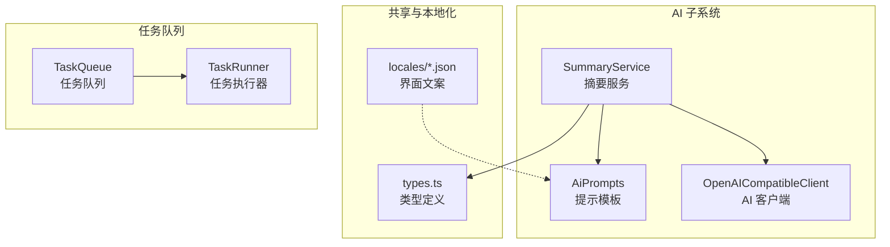
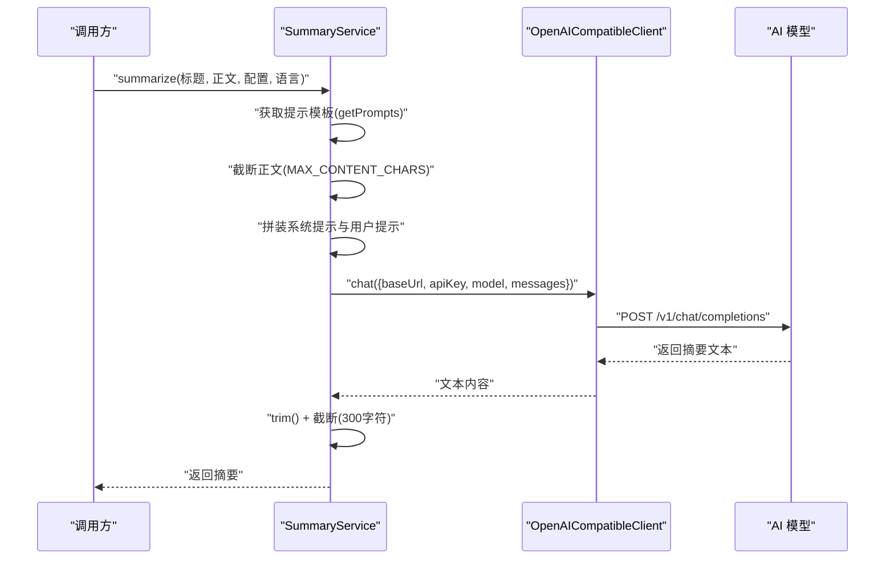
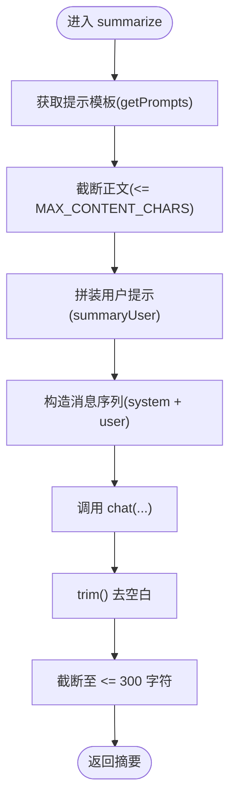
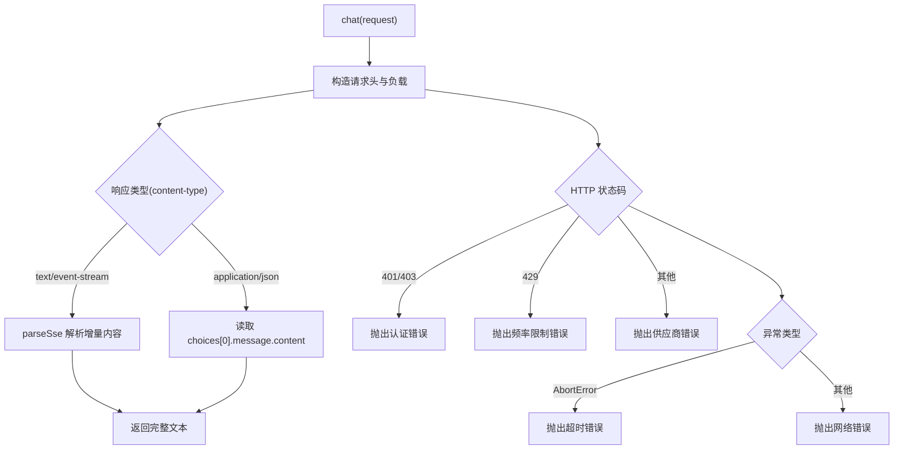
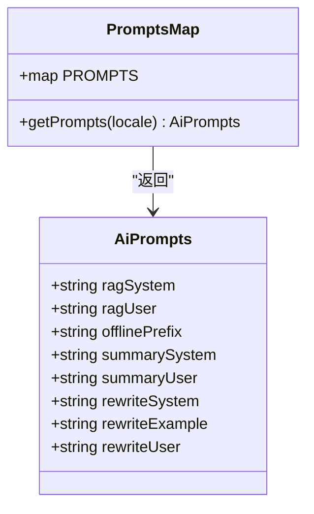
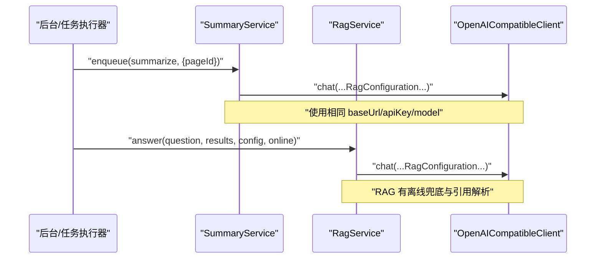
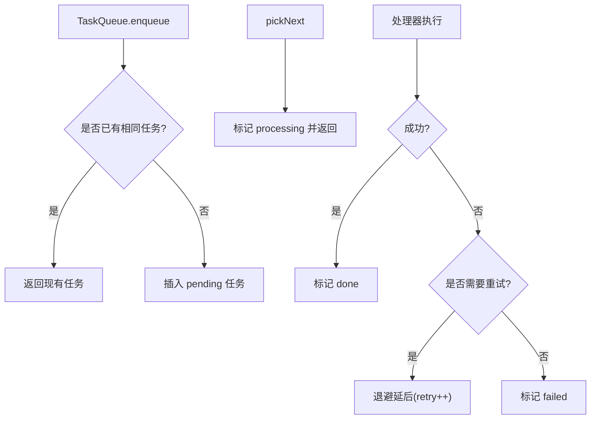
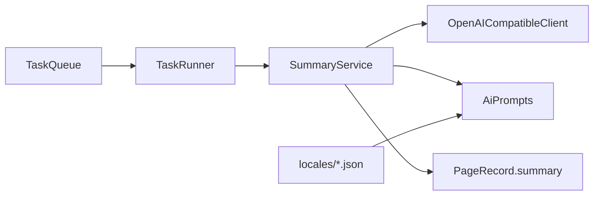

# 内容摘要服务

<cite>
**本文档引用的文件**
- [src/ai/summary-service.ts](file://src/ai/summary-service.ts)
- [src/ai/rag-service.ts](file://src/ai/rag-service.ts)
- [src/ai/openai-client.ts](file://src/ai/openai-client.ts)
- [src/ai/ai-prompts.ts](file://src/ai/ai-prompts.ts)
- [src/shared/types.ts](file://src/shared/types.ts)
- [src/locales/en.json](file://src/locales/en.json)
- [src/locales/zh_CN.json](file://src/locales/zh_CN.json)
- [tests/ai/summary-service.test.ts](file://tests/ai/summary-service.test.ts)
- [src/queue/task-queue.ts](file://src/queue/task-queue.ts)
- [src/queue/task-runner.ts](file://src/queue/task-runner.ts)
- [README.md](file://README.md)
- [docs/superpowers/specs/2026-06-09-phase-1-mvp-design.md](file://docs/superpowers/specs/2026-06-09-phase-1-mvp-design.md)
</cite>

## 目录
1. [简介](#简介)
2. [项目结构](#项目结构)
3. [核心组件](#核心组件)
4. [架构总览](#架构总览)
5. [详细组件分析](#详细组件分析)
6. [依赖关系分析](#依赖关系分析)
7. [性能考量](#性能考量)
8. [故障排查指南](#故障排查指南)
9. [结论](#结论)
10. [附录](#附录)

## 简介
本文件面向内容摘要服务的实现与使用，系统性阐述 SummaryService 的设计与运行机制，涵盖文本预处理、关键句提取与摘要生成流程；解释摘要模式与参数控制（长度、风格等）；给出质量评估维度（压缩率、流畅度、信息保留度）；说明多语言与本地化策略；总结性能优化（并行与内存管理）；梳理与 RAG 系统的集成路径；提供对比示例与最佳实践，并给出扩展自定义算法的指导。

## 项目结构
摘要服务位于 AI 子系统中，围绕 OpenAI 兼容客户端与提示模板组织，配合任务队列实现异步批处理。核心文件与职责如下：
- 摘要服务：负责接收标题与正文，构造摘要提示，调用大模型生成摘要并进行后处理。
- 提示模板：集中管理多语言系统提示与用户模板，确保跨语言一致性。
- 客户端封装：统一处理网络请求、错误码映射与流式/非流式响应解析。
- 类型定义：承载摘要结果、任务类型与队列状态等共享契约。
- 任务队列：为摘要等后台任务提供去重、重试与限速控制。

图表来源
- [src/ai/summary-service.ts:1-35](file://src/ai/summary-service.ts#L1-L35)
- [src/ai/openai-client.ts:1-125](file://src/ai/openai-client.ts#L1-L125)
- [src/ai/ai-prompts.ts:1-200](file://src/ai/ai-prompts.ts#L1-L200)
- [src/shared/types.ts:1-139](file://src/shared/types.ts#L1-L139)
- [src/queue/task-queue.ts:1-125](file://src/queue/task-queue.ts#L1-L125)
- [src/queue/task-runner.ts:1-40](file://src/queue/task-runner.ts#L1-L40)

章节来源
- [src/ai/summary-service.ts:1-35](file://src/ai/summary-service.ts#L1-L35)
- [src/ai/ai-prompts.ts:1-200](file://src/ai/ai-prompts.ts#L1-L200)
- [src/ai/openai-client.ts:1-125](file://src/ai/openai-client.ts#L1-L125)
- [src/shared/types.ts:1-139](file://src/shared/types.ts#L1-L139)
- [src/queue/task-queue.ts:1-125](file://src/queue/task-queue.ts#L1-L125)
- [src/queue/task-runner.ts:1-40](file://src/queue/task-runner.ts#L1-L40)

## 核心组件
- SummaryService：对外提供 summarize(title, content, config, locale?) 方法，内部完成提示拼装、内容截断、调用 AI 客户端与摘要后处理。
- OpenAICompatibleClient：封装聊天接口调用，统一错误处理与响应解析。
- AiPrompts：集中管理多语言提示模板，按 locale 返回对应 AiPrompts。
- 类型与任务：PageRecord.summary、TaskType.summarize、TaskQueue/TaskRunner 提供异步摘要能力。

章节来源
- [src/ai/summary-service.ts:7-34](file://src/ai/summary-service.ts#L7-L34)
- [src/ai/openai-client.ts:56-124](file://src/ai/openai-client.ts#L56-L124)
- [src/ai/ai-prompts.ts:10-27](file://src/ai/ai-prompts.ts#L10-L27)
- [src/shared/types.ts:40-41](file://src/shared/types.ts#L40-L41)
- [src/shared/types.ts:110-113](file://src/shared/types.ts#L110-L113)

## 架构总览
摘要服务的调用链路从 UI 或后台触发，经由 SummaryService 将用户输入与系统提示组装为消息序列，通过 OpenAICompatibleClient 发送到远端模型，最终返回摘要文本并进行裁剪与清洗。

图表来源
- [src/ai/summary-service.ts:10-33](file://src/ai/summary-service.ts#L10-L33)
- [src/ai/openai-client.ts:64-107](file://src/ai/openai-client.ts#L64-L107)
- [src/ai/ai-prompts.ts:17-26](file://src/ai/ai-prompts.ts#L17-L26)

## 详细组件分析

### SummaryService 实现要点
- 输入处理：接收标题、正文、RagConfiguration 与可选 locale；locale 用于选择提示模板。
- 文本预处理：限制最大输入字符数，避免超出上下文窗口；同时对输出进行 trim 与最大长度限制。
- 提示构造：使用 summarySystem 作为系统提示，summaryUser 作为用户提示，分别替换占位符。
- 调用模型：通过 OpenAICompatibleClient.chat 发送消息序列，等待完整响应。
- 输出后处理：去除首尾空白并限制最大长度，保证稳定输出。

图表来源
- [src/ai/summary-service.ts:10-33](file://src/ai/summary-service.ts#L10-L33)
- [src/ai/ai-prompts.ts:17-26](file://src/ai/ai-prompts.ts#L17-L26)

章节来源
- [src/ai/summary-service.ts:5-33](file://src/ai/summary-service.ts#L5-L33)
- [tests/ai/summary-service.test.ts:13-52](file://tests/ai/summary-service.test.ts#L13-L52)

### OpenAICompatibleClient 错误处理与响应解析
- 统一 endpoint：/v1/chat/completions，支持 SSE 与 JSON 两种响应格式。
- 错误码映射：认证失败、频率限制、网络异常、超时、供应商错误等。
- 超时控制：默认 30 秒超时，防止长时间阻塞。
- 响应解析：SSE 模式逐行解析 data 字段，JSON 模式读取 choices[0].message.content。

图表来源
- [src/ai/openai-client.ts:64-123](file://src/ai/openai-client.ts#L64-L123)

章节来源
- [src/ai/openai-client.ts:15-30](file://src/ai/openai-client.ts#L15-L30)
- [src/ai/openai-client.ts:38-54](file://src/ai/openai-client.ts#L38-L54)
- [src/ai/openai-client.ts:64-123](file://src/ai/openai-client.ts#L64-L123)

### 提示模板与多语言支持
- 模板字段：ragSystem、ragUser、offlinePrefix、summarySystem、summaryUser、rewriteSystem、rewriteExample、rewriteUser。
- 默认语言：当 locale 未匹配时回退到 zh_CN。
- 支持语言：中文、英语、日语、韩语、西班牙语、法语、德语、葡萄牙语、俄语、阿拉伯语。

图表来源
- [src/ai/ai-prompts.ts:10-27](file://src/ai/ai-prompts.ts#L10-L27)
- [src/ai/ai-prompts.ts:29-199](file://src/ai/ai-prompts.ts#L29-L199)

章节来源
- [src/ai/ai-prompts.ts:197-199](file://src/ai/ai-prompts.ts#L197-L199)
- [src/locales/en.json:17-75](file://src/locales/en.json#L17-L75)
- [src/locales/zh_CN.json:17-75](file://src/locales/zh_CN.json#L17-L75)

### 与 RAG 系统的集成
- 配置复用：摘要服务使用 RagConfiguration（baseUrl、apiKey、model），与 RAG 服务一致。
- 提示复用：摘要使用 summarySystem/summaryUser，RAG 使用 ragSystem/ragUser，二者相互独立但风格一致。
- 离线模式：RAG 有离线前缀与兜底逻辑；摘要服务当前未实现离线兜底，建议在业务层补充。

图表来源
- [src/ai/summary-service.ts:13-29](file://src/ai/summary-service.ts#L13-L29)
- [src/ai/rag-service.ts:18-64](file://src/ai/rag-service.ts#L18-L64)
- [src/shared/types.ts:108-113](file://src/shared/types.ts#L108-L113)

章节来源
- [src/ai/rag-service.ts:9-13](file://src/ai/rag-service.ts#L9-L13)
- [src/ai/rag-service.ts:29-42](file://src/ai/rag-service.ts#L29-L42)

### 异步任务队列与批量处理
- 任务类型：summarize、embed、report_daily、report_weekly、report_monthly。
- 去重策略：同类型且 payload 完全相等的任务不会重复入队。
- 执行顺序：按创建时间升序取出，标记为 processing。
- 重试机制：失败时按退避策略延后，超过最大重试次数则标记失败。
- 批处理：TaskRunner.runBatch 控制单批次处理数量，避免阻塞。

图表来源
- [src/queue/task-queue.ts:15-46](file://src/queue/task-queue.ts#L15-L46)
- [src/queue/task-queue.ts:48-62](file://src/queue/task-queue.ts#L48-L62)
- [src/queue/task-queue.ts:71-106](file://src/queue/task-queue.ts#L71-L106)
- [src/queue/task-runner.ts:13-39](file://src/queue/task-runner.ts#L13-L39)

章节来源
- [src/shared/types.ts:110-113](file://src/shared/types.ts#L110-L113)
- [src/queue/task-queue.ts:15-46](file://src/queue/task-queue.ts#L15-L46)
- [src/queue/task-runner.ts:13-39](file://src/queue/task-runner.ts#L13-L39)

## 依赖关系分析
- SummaryService 依赖 OpenAICompatibleClient 与 AiPrompts；输出类型 PageRecord.summary 由上层业务使用。
- OpenAICompatibleClient 依赖 fetch 与全局超时控制，内部封装错误分类。
- 任务队列与执行器解耦摘要服务，便于并发与可靠性保障。
- 多语言通过 AiPrompts 与 locales 文件共同实现，无需修改服务代码即可新增语言。

图表来源
- [src/ai/summary-service.ts:1-3](file://src/ai/summary-service.ts#L1-L3)
- [src/ai/openai-client.ts:56-62](file://src/ai/openai-client.ts#L56-L62)
- [src/ai/ai-prompts.ts:197-199](file://src/ai/ai-prompts.ts#L197-L199)
- [src/shared/types.ts:40-41](file://src/shared/types.ts#L40-L41)
- [src/queue/task-queue.ts:12-13](file://src/queue/task-queue.ts#L12-L13)
- [src/queue/task-runner.ts:7-11](file://src/queue/task-runner.ts#L7-L11)

章节来源
- [src/ai/summary-service.ts:1-3](file://src/ai/summary-service.ts#L1-L3)
- [src/ai/openai-client.ts:56-62](file://src/ai/openai-client.ts#L56-L62)
- [src/ai/ai-prompts.ts:197-199](file://src/ai/ai-prompts.ts#L197-L199)
- [src/shared/types.ts:40-41](file://src/shared/types.ts#L40-L41)
- [src/queue/task-queue.ts:12-13](file://src/queue/task-queue.ts#L12-L13)
- [src/queue/task-runner.ts:7-11](file://src/queue/task-runner.ts#L7-L11)

## 性能考量
- 输入截断：MAX_CONTENT_CHARS 限制输入大小，避免超上下文窗口与带宽浪费。
- 输出截断：固定最大长度，降低前端渲染与传输成本。
- 超时控制：30 秒超时，避免长时间阻塞。
- 并发与批处理：通过任务队列与 TaskRunner.runBatch 控制并发度，避免资源争用。
- 内存管理：避免在单次摘要中缓存过大的中间文本；及时释放临时变量。

章节来源
- [src/ai/summary-service.ts:5](file://src/ai/summary-service.ts#L5)
- [src/ai/summary-service.ts:32](file://src/ai/summary-service.ts#L32)
- [src/ai/openai-client.ts:64-67](file://src/ai/openai-client.ts#L64-L67)
- [src/queue/task-runner.ts:13-39](file://src/queue/task-runner.ts#L13-L39)

## 故障排查指南
- 认证失败：检查 baseUrl、apiKey、model 是否正确配置。
- 频繁限制：适当降低请求速率或增加退避时间。
- 超时：检查网络状况与服务端延迟；必要时提高超时阈值。
- 网络异常：确认 fetch 可用与跨域策略。
- 输出异常：核对提示模板 locale 是否正确；检查截断逻辑是否生效。

章节来源
- [src/ai/openai-client.ts:82-97](file://src/ai/openai-client.ts#L82-L97)
- [src/ai/openai-client.ts:112-119](file://src/ai/openai-client.ts#L112-L119)
- [tests/ai/summary-service.test.ts:13-28](file://tests/ai/summary-service.test.ts#L13-L28)

## 结论
摘要服务以简洁稳定的架构实现了“标题+正文”的快速摘要生成，结合多语言提示模板与任务队列，满足本地优先与异步处理需求。建议在后续版本中引入离线兜底、可配置的摘要长度与风格参数，并完善质量评估与 A/B 对比机制，以进一步提升可用性与可控性。

## 附录

### 摘要模式与参数说明
- 摘要长度控制
  - 输入上限：MAX_CONTENT_CHARS（限制传入正文长度）
  - 输出上限：固定截断至 300 字符
- 风格与重点
  - 通过 summarySystem 指定风格（如“不超过 100 字”、“只输出摘要文本”）
  - 重点由模型根据系统提示与用户输入决定
- 输出格式
  - 默认纯文本，不包含前缀或解释
- 语言与本地化
  - 通过 locale 选择提示模板，默认 zh_CN
  - 支持 10 种语言的提示模板与界面文案

章节来源
- [src/ai/summary-service.ts:5](file://src/ai/summary-service.ts#L5)
- [src/ai/summary-service.ts:32](file://src/ai/summary-service.ts#L32)
- [src/ai/ai-prompts.ts:35-37](file://src/ai/ai-prompts.ts#L35-L37)
- [src/ai/ai-prompts.ts:51-53](file://src/ai/ai-prompts.ts#L51-L53)
- [src/ai/ai-prompts.ts:197-199](file://src/ai/ai-prompts.ts#L197-L199)
- [src/locales/en.json:17-75](file://src/locales/en.json#L17-L75)
- [src/locales/zh_CN.json:17-75](file://src/locales/zh_CN.json#L17-L75)

### 摘要质量评估指标
- 压缩率：输入字符数与输出字符数之比，建议在 3:1 到 10:1 之间平衡可读性与密度。
- 流畅度：评估摘要的语法连贯性与可读性，可通过人工打分或 NLP 指标衡量。
- 信息保留度：评估关键事实、主题与结论的覆盖率，可采用 ROUGE、BERTScore 等指标。

章节来源
- [README.md:17-27](file://README.md#L17-L27)

### 与 RAG 的集成方式
- 配置复用：两者共享 RagConfiguration，统一模型与鉴权。
- 触发时机：RAG 在用户提问时即时调用；摘要在页面入库后异步生成。
- 离线策略：RAG 提供离线兜底；摘要建议在业务层补充离线提示或缓存策略。

章节来源
- [src/ai/rag-service.ts:18-42](file://src/ai/rag-service.ts#L18-L42)
- [src/ai/summary-service.ts:13-29](file://src/ai/summary-service.ts#L13-L29)

### 摘要效果对比示例
- 示例场景：同一页面在不同系统提示下的摘要差异。
- 建议做法：准备若干代表性页面，固定输入与配置，对比不同提示模板与长度限制的效果，记录压缩率与人工评分。

章节来源
- [tests/ai/summary-service.test.ts:13-52](file://tests/ai/summary-service.test.ts#L13-L52)

### 最佳实践
- 固定提示风格：统一使用 summarySystem 指令，确保风格一致。
- 控制输入规模：对长正文进行预处理（如分段或抽取关键段落）以提升稳定性。
- 异步化：通过任务队列批量生成摘要，避免前台阻塞。
- 多语言校验：在新增语言时验证 AiPrompts 与界面文案的一致性。

章节来源
- [src/ai/ai-prompts.ts:197-199](file://src/ai/ai-prompts.ts#L197-L199)
- [src/queue/task-queue.ts:15-46](file://src/queue/task-queue.ts#L15-L46)

### 自定义摘要算法扩展指导
- 新增提示模板：在 AiPrompts 中添加新的风格指令与用户模板，无需改动服务类。
- 自定义长度策略：在服务层增加可配置的最大长度参数，并在截断处统一处理。
- 离线兜底：在业务层为摘要服务增加离线提示或本地缓存策略。
- 质量评估：建立自动化评测脚本，定期对比不同提示与参数组合的效果。

章节来源
- [src/ai/ai-prompts.ts:10-27](file://src/ai/ai-prompts.ts#L10-L27)
- [src/ai/summary-service.ts:5](file://src/ai/summary-service.ts#L5)
- [src/ai/summary-service.ts:32](file://src/ai/summary-service.ts#L32)