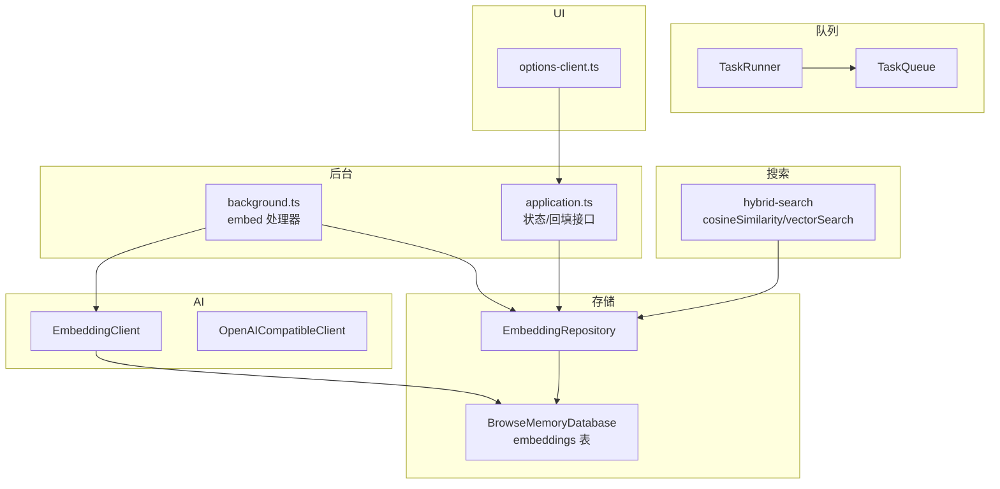
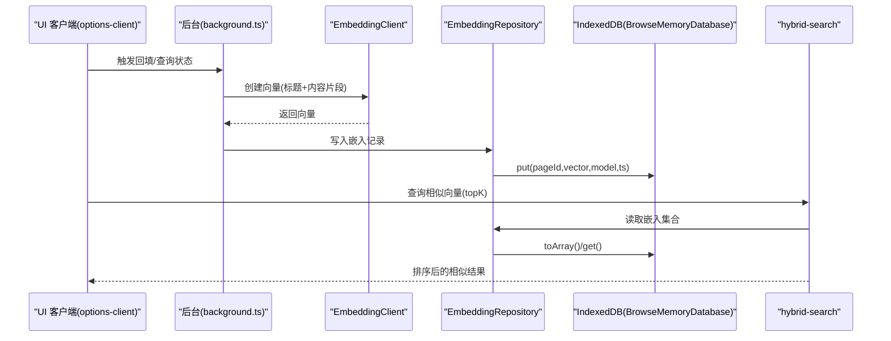
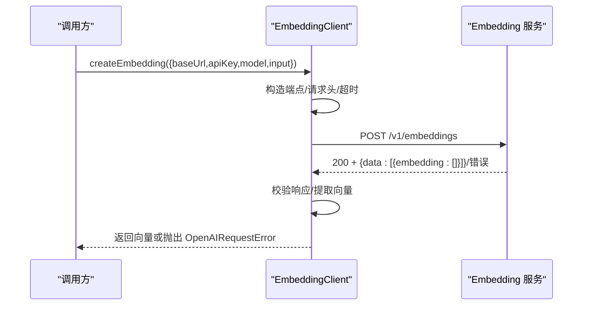
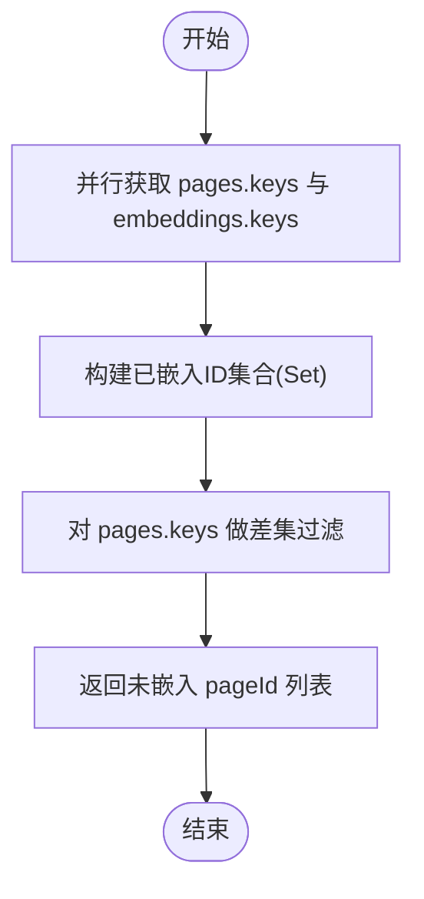
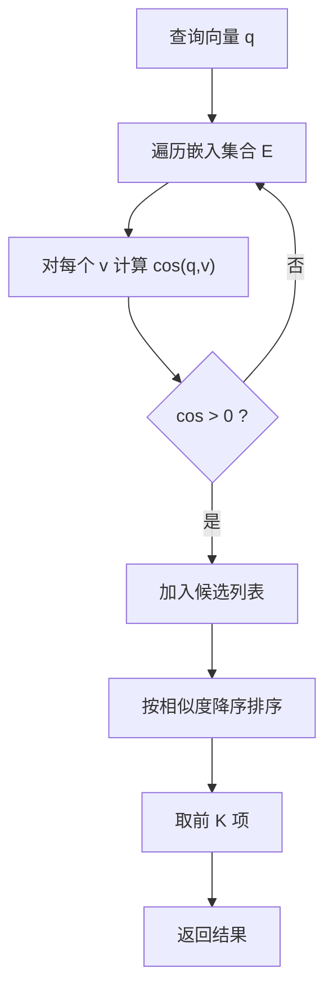
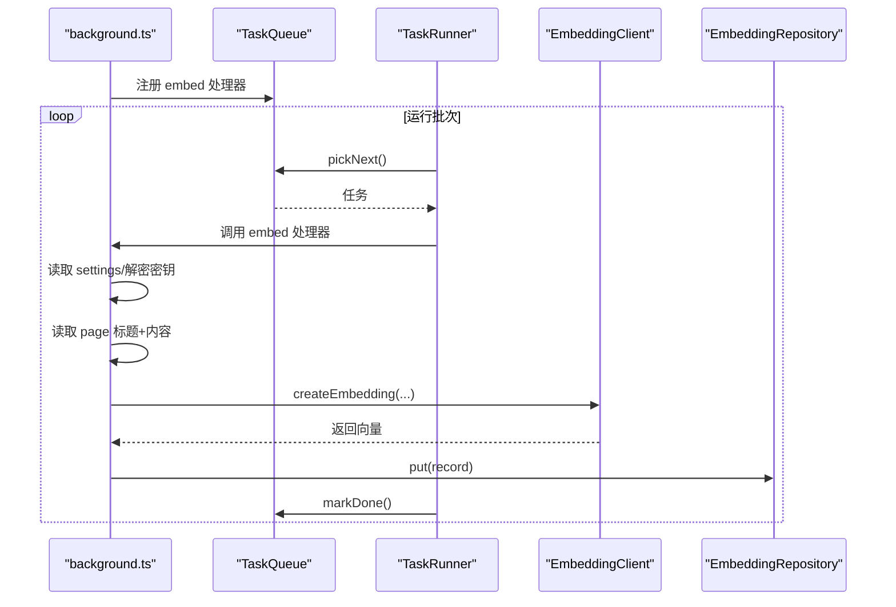
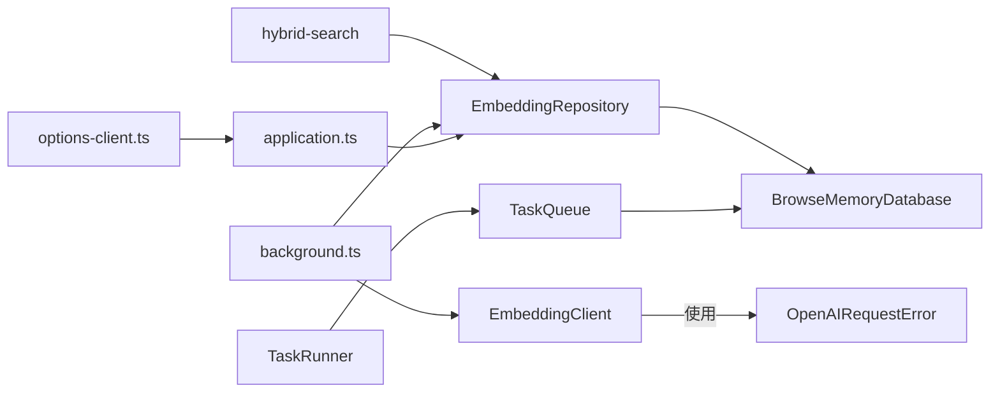

# 向量嵌入服务

<cite>
**本文引用的文件**
- [embedding-client.ts](file://src/ai/embedding-client.ts)
- [openai-client.ts](file://src/ai/openai-client.ts)
- [embedding-repository.ts](file://src/storage/embedding-repository.ts)
- [database.ts](file://src/storage/database.ts)
- [types.ts](file://src/shared/types.ts)
- [hybrid-search.ts](file://src/search/hybrid-search.ts)
- [task-queue.ts](file://src/queue/task-queue.ts)
- [task-runner.ts](file://src/queue/task-runner.ts)
- [background.ts](file://entrypoints/background.ts)
- [application.ts](file://src/background/application.ts)
- [options-client.ts](file://src/ui/options-client.ts)
- [embedding-client.test.ts](file://tests/ai/embedding-client.test.ts)
- [embedding-repository.test.ts](file://tests/storage/embedding-repository.test.ts)
- [hybrid-search.test.ts](file://tests/search/hybrid-search.test.ts)
- [task-queue.test.ts](file://tests/queue/task-queue.test.ts)
</cite>

## 目录
1. [简介](#简介)
2. [项目结构](#项目结构)
3. [核心组件](#核心组件)
4. [架构总览](#架构总览)
5. [详细组件分析](#详细组件分析)
6. [依赖关系分析](#依赖关系分析)
7. [性能与优化](#性能与优化)
8. [故障排查指南](#故障排查指南)
9. [结论](#结论)
10. [附录：配置与扩展](#附录配置与扩展)

## 简介
本技术文档围绕向量嵌入服务展开，系统性阐述 EmbeddingClient 的实现（Embedding API 调用封装与错误处理）、EmbeddingRepository 的数据持久化策略（IndexedDB 存储与查询优化）、向量相似度计算（余弦相似度与向量检索）、以及嵌入任务的后台处理流程（任务队列与运行器）。文档同时给出配置项说明、质量评估与错误处理机制，并提供性能优化建议与自定义嵌入模型的集成指导。

## 项目结构
向量嵌入服务横跨 AI、存储、搜索、队列与后台入口等模块，关键文件如下：
- AI 层：EmbeddingClient 封装 Embedding API 调用；OpenAI 兼容客户端用于统一错误模型
- 存储层：EmbeddingRepository 提供嵌入记录的 CRUD 与统计；BrowseMemoryDatabase 定义 IndexedDB 表结构
- 搜索层：余弦相似度与向量检索算法
- 队列层：任务队列与运行器，支持去重、重试与限流
- 后台入口：后台脚本注册 embed 任务处理器，按设置拉取密钥与执行嵌入
- UI：选项页客户端提供嵌入状态查询与回填触发

图表来源
- [embedding-client.ts:16-86](file://src/ai/embedding-client.ts#L16-L86)
- [embedding-repository.ts:4-35](file://src/storage/embedding-repository.ts#L4-L35)
- [database.ts:34-79](file://src/storage/database.ts#L34-L79)
- [hybrid-search.ts:17-48](file://src/search/hybrid-search.ts#L17-L48)
- [task-queue.ts:12-126](file://src/queue/task-queue.ts#L12-L126)
- [task-runner.ts:7-41](file://src/queue/task-runner.ts#L7-L41)
- [background.ts:78-102](file://entrypoints/background.ts#L78-L102)
- [application.ts:317-342](file://src/background/application.ts#L317-L342)
- [options-client.ts:62-86](file://src/ui/options-client.ts#L62-L86)

章节来源
- [embedding-client.ts:16-86](file://src/ai/embedding-client.ts#L16-L86)
- [embedding-repository.ts:4-35](file://src/storage/embedding-repository.ts#L4-L35)
- [database.ts:34-79](file://src/storage/database.ts#L34-L79)
- [hybrid-search.ts:17-48](file://src/search/hybrid-search.ts#L17-L48)
- [task-queue.ts:12-126](file://src/queue/task-queue.ts#L12-L126)
- [task-runner.ts:7-41](file://src/queue/task-runner.ts#L7-L41)
- [background.ts:78-102](file://entrypoints/background.ts#L78-L102)
- [application.ts:317-342](file://src/background/application.ts#L317-L342)
- [options-client.ts:62-86](file://src/ui/options-client.ts#L62-L86)

## 核心组件
- EmbeddingClient：封装 Embedding API 调用，负责请求构造、鉴权、超时控制、错误分类与向量提取
- EmbeddingRepository：基于 IndexedDB 的嵌入记录管理，提供增删查改、计数与“未嵌入页面”筛选
- BrowseMemoryDatabase：定义数据库版本与表结构，含 embeddings 表
- hybrid-search：提供余弦相似度与向量检索算法
- TaskQueue/TaskRunner：任务队列与运行器，支持去重、重试与限流
- 后台处理器：从队列取出 embed 任务，生成向量并写入存储
- UI 客户端：提供嵌入状态查询、回填触发与连接测试

章节来源
- [embedding-client.ts:16-86](file://src/ai/embedding-client.ts#L16-L86)
- [embedding-repository.ts:4-35](file://src/storage/embedding-repository.ts#L4-L35)
- [database.ts:34-79](file://src/storage/database.ts#L34-L79)
- [hybrid-search.ts:17-48](file://src/search/hybrid-search.ts#L17-L48)
- [task-queue.ts:12-126](file://src/queue/task-queue.ts#L12-L126)
- [task-runner.ts:7-41](file://src/queue/task-runner.ts#L7-L41)
- [background.ts:78-102](file://entrypoints/background.ts#L78-L102)
- [options-client.ts:62-86](file://src/ui/options-client.ts#L62-L86)

## 架构总览
下图展示从用户操作到后台任务执行、再到向量检索的整体流程。

图表来源
- [options-client.ts:62-86](file://src/ui/options-client.ts#L62-L86)
- [background.ts:78-102](file://entrypoints/background.ts#L78-L102)
- [embedding-client.ts:23-86](file://src/ai/embedding-client.ts#L23-L86)
- [embedding-repository.ts:7-21](file://src/storage/embedding-repository.ts#L7-L21)
- [database.ts:42-75](file://src/storage/database.ts#L42-L75)
- [hybrid-search.ts:35-48](file://src/search/hybrid-search.ts#L35-L48)

## 详细组件分析

### EmbeddingClient：Embedding API 调用封装
- 功能要点
  - 自动拼接 /v1/embeddings 端点，去除尾部斜杠
  - 构造 Authorization Bearer 与 JSON 请求体
  - 超时控制（AbortController + setTimeout）
  - 错误分类：鉴权失败、频率限制、网络异常、超时、服务端错误
  - 解析响应并校验向量存在性
- 关键行为
  - 成功路径返回数字数组向量
  - 失败路径抛出 OpenAIRequestError，包含错误码与消息
- 批量处理
  - 当前实现为单条输入生成单个向量，未内置批量发送逻辑
  - 可通过上层循环调用实现批量；注意并发与速率限制

图表来源
- [embedding-client.ts:23-86](file://src/ai/embedding-client.ts#L23-L86)
- [openai-client.ts:22-30](file://src/ai/openai-client.ts#L22-L30)

章节来源
- [embedding-client.ts:16-86](file://src/ai/embedding-client.ts#L16-L86)
- [openai-client.ts:15-30](file://src/ai/openai-client.ts#L15-L30)

### EmbeddingRepository：嵌入数据持久化与查询优化
- 数据模型
  - EmbeddingRecord：pageId、vector、model、createdAt
- 主要能力
  - get/put/delete：单条读写删
  - getAll/count：全量导出与计数
  - getUnembeddedPageIds：基于 pages 与 embeddings 的 keys 差集，找出未嵌入页面 ID 列表
- 查询优化
  - 基于 IndexedDB 的异步迭代与集合操作
  - getUnembeddedPageIds 并行获取两个集合 keys，再用 Set 进行差集过滤

图表来源
- [embedding-repository.ts:27-34](file://src/storage/embedding-repository.ts#L27-L34)
- [database.ts:34-79](file://src/storage/database.ts#L34-L79)

章节来源
- [embedding-repository.ts:4-35](file://src/storage/embedding-repository.ts#L4-L35)
- [database.ts:42-75](file://src/storage/database.ts#L42-L75)

### 数据模型与存储格式
- EmbeddingRecord 字段
  - pageId：页面标识
  - vector：数值数组，表示向量
  - model：所用模型名称
  - createdAt：时间戳
- 存储位置
  - IndexedDB 表 embeddings，主键为 pageId
- 向量维度
  - 由上游 Embedding API 返回决定，当前实现不强制固定维度
  - 若需统一维度，可在入库前进行裁剪或补零

章节来源
- [types.ts:100-105](file://src/shared/types.ts#L100-L105)
- [database.ts:42-75](file://src/storage/database.ts#L42-L75)

### 相似度计算与检索
- 余弦相似度
  - 输入两同维向量，输出 [-1,1] 区间值，1 表示完全一致
  - 零向量或长度为 0 的情况返回 0
- 向量检索
  - 对所有嵌入记录计算相似度，过滤正分数后按降序取前 K
  - 适用于中小规模文档（官方注释提示小于 10K 文档较合适）

图表来源
- [hybrid-search.ts:17-48](file://src/search/hybrid-search.ts#L17-L48)

章节来源
- [hybrid-search.ts:17-48](file://src/search/hybrid-search.ts#L17-L48)

### 任务队列与后台处理
- 任务类型
  - embed：对单页内容生成向量并写入存储
- 任务队列特性
  - 去重：相同 type+payload 的任务不会重复入队
  - 优先级：按创建时间升序取出
  - 重试：指数退避，超过最大重试次数标记失败
  - 清理：完成任务保留 7 天后清理
- 后台处理器
  - 从 settings 读取 API 密钥与模型配置（可复用聊天密钥）
  - 从 pages 读取标题与内容片段，截断至 2000 字符
  - 调用 EmbeddingClient 生成向量，写入 EmbeddingRepository

图表来源
- [task-queue.ts:15-106](file://src/queue/task-queue.ts#L15-L106)
- [task-runner.ts:13-39](file://src/queue/task-runner.ts#L13-L39)
- [background.ts:78-102](file://entrypoints/background.ts#L78-L102)
- [application.ts:354-370](file://src/background/application.ts#L354-L370)

章节来源
- [task-queue.ts:12-126](file://src/queue/task-queue.ts#L12-L126)
- [task-runner.ts:7-41](file://src/queue/task-runner.ts#L7-L41)
- [background.ts:78-102](file://entrypoints/background.ts#L78-L102)
- [application.ts:354-370](file://src/background/application.ts#L354-L370)

### UI 交互与状态管理
- 状态查询
  - GET_EMBEDDING_STATUS：返回是否启用、已索引数量、总页数
- 回填触发
  - TRIGGER_EMBEDDING_BACKFILL：在启用状态下，将未嵌入页面的任务入队
- 连接测试
  - TEST_EMBEDDING_CONNECTION：用于验证配置连通性

章节来源
- [application.ts:317-342](file://src/background/application.ts#L317-L342)
- [options-client.ts:62-86](file://src/ui/options-client.ts#L62-L86)

## 依赖关系分析
- 组件耦合
  - EmbeddingClient 依赖 fetcher（便于测试替换），无外部框架耦合
  - EmbeddingRepository 仅依赖 BrowseMemoryDatabase，职责单一
  - hybrid-search 与存储解耦，仅依赖 EmbeddingRecord 类型
  - TaskRunner 通过 Map 映射任务类型到处理器，便于扩展
- 外部依赖
  - IndexedDB（Dexie）用于本地持久化
  - 浏览器/Worker 环境下的 fetch 与 AbortController

图表来源
- [embedding-client.ts:16-86](file://src/ai/embedding-client.ts#L16-L86)
- [openai-client.ts:22-30](file://src/ai/openai-client.ts#L22-L30)
- [embedding-repository.ts:4-35](file://src/storage/embedding-repository.ts#L4-L35)
- [database.ts:34-79](file://src/storage/database.ts#L34-L79)
- [hybrid-search.ts:17-48](file://src/search/hybrid-search.ts#L17-L48)
- [task-queue.ts:12-126](file://src/queue/task-queue.ts#L12-L126)
- [task-runner.ts:7-41](file://src/queue/task-runner.ts#L7-L41)
- [background.ts:78-102](file://entrypoints/background.ts#L78-L102)
- [application.ts:317-342](file://src/background/application.ts#L317-L342)
- [options-client.ts:62-86](file://src/ui/options-client.ts#L62-L86)

## 性能与优化
- 向量检索
  - 当前为暴力检索，适合中小规模文档；大规模场景建议引入近似最近邻（ANN）索引或分片
  - 可考虑对向量做单位化（L2 归一化）以加速余弦相似度计算
- 任务处理
  - TaskRunner 默认每批最多处理 5 个任务，可根据资源调整
  - TaskQueue 支持指数退避与最大重试次数，避免雪崩
- I/O 与序列化
  - IndexedDB 的批量写入与事务可减少锁竞争；注意 payload 的 JSON 序列化成本
- 网络与超时
  - EmbeddingClient 已内置 30 秒超时与 AbortController，建议结合后端速率限制合理配置

[本节为通用性能讨论，无需列出章节来源]

## 故障排查指南
- 常见错误与定位
  - 鉴权失败/权限不足：检查 settings 中的 embedding API Key 是否正确
  - 频率限制：后端返回 429，需降低并发或等待冷却
  - 网络异常/超时：检查 baseUrl 与网络连通性
  - 服务端未返回向量：确认模型与输入格式
- 单元测试参考
  - EmbeddingClient：覆盖成功返回、401/429、响应体缺失向量、fetch 失败、baseUrl 尾斜杠处理
  - EmbeddingRepository：覆盖增删改查、计数、未嵌入页面筛选
  - hybrid-search：覆盖余弦相似度边界条件与向量检索排序
  - TaskQueue：覆盖去重、优先级、重试与清理

章节来源
- [embedding-client.test.ts:6-96](file://tests/ai/embedding-client.test.ts#L6-L96)
- [embedding-repository.test.ts:7-77](file://tests/storage/embedding-repository.test.ts#L7-L77)
- [hybrid-search.test.ts:10-96](file://tests/search/hybrid-search.test.ts#L10-L96)
- [task-queue.test.ts:6-41](file://tests/queue/task-queue.test.ts#L6-L41)

## 结论
该向量嵌入服务以简洁清晰的模块划分实现了从“生成向量 → 持久化 → 检索融合”的完整链路。EmbeddingClient 提供稳健的 API 封装与错误分类；EmbeddingRepository 与 IndexedDB 保证了本地可扩展的存储；hybrid-search 提供高效的余弦相似度与向量检索；TaskQueue/TaskRunner 实现了可靠的后台批处理。整体设计易于扩展与维护，适合在浏览器侧实现知识检索增强（RAG）与混合搜索。

[本节为总结性内容，无需列出章节来源]

## 附录：配置与扩展

### 配置项说明
- 设置模型（AppSettings）
  - embeddingEnabled：是否启用嵌入功能
  - embeddingBaseUrl：Embedding 服务地址
  - encryptedEmbeddingApiKey / encryptedApiKey：加密后的 API Key（可复用聊天密钥）
  - embeddingModel：模型名称
  - embeddingReuseChatKey：是否复用聊天密钥
- 运行参数
  - 批处理大小：由 TaskRunner 的 maxTasks 参数控制（默认 5）
  - 并发限制：受浏览器/Worker 环境与后端速率限制约束

章节来源
- [types.ts:6-22](file://src/shared/types.ts#L6-L22)
- [application.ts:354-370](file://src/background/application.ts#L354-L370)
- [task-runner.ts:13](file://src/queue/task-runner.ts#L13)

### 嵌入质量评估与错误处理
- 质量评估
  - 可通过检索命中与人工标注的相关性进行评估
  - 对比不同模型与输入预处理（如标题权重、截断策略）的效果
- 错误处理
  - 统一的 OpenAIRequestError 错误码：authentication、rate_limit、timeout、network、provider
  - UI 层可通过 TEST_EMBEDDING_CONNECTION 快速验证配置

章节来源
- [openai-client.ts:15-30](file://src/ai/openai-client.ts#L15-L30)
- [options-client.ts:62-66](file://src/ui/options-client.ts#L62-L66)

### 自定义嵌入模型的集成指导
- 替换或新增模型
  - 在 settings 中选择目标 embeddingModel
  - 确保上游 Embedding API 支持该模型
- 输入预处理
  - 可在后台处理器中调整标题与内容的拼接方式与截断长度
- 向量归一化
  - 如需单位化向量，可在入库前进行 L2 归一化，提升余弦相似度稳定性

章节来源
- [background.ts:89-101](file://entrypoints/background.ts#L89-L101)
- [types.ts:100-105](file://src/shared/types.ts#L100-L105)