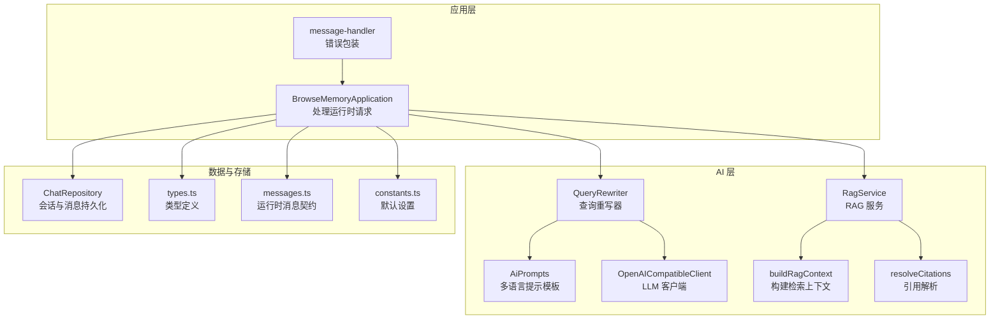
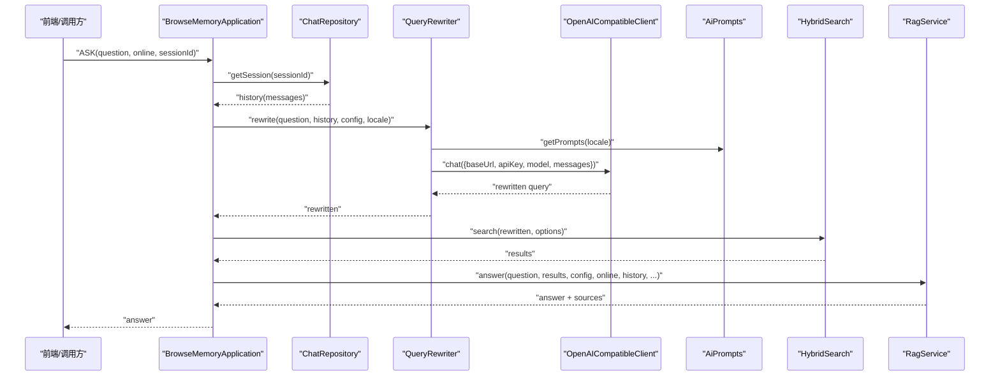
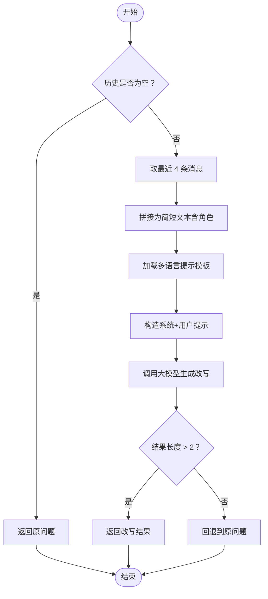
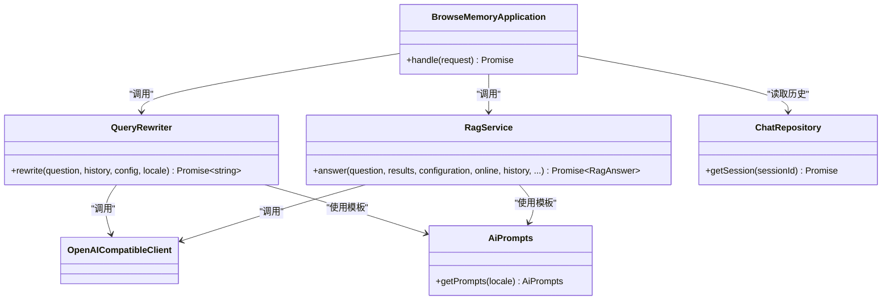

# 查询重写服务

<cite>
**本文引用的文件**
- [src/ai/query-rewriter.ts](file://src/ai/query-rewriter.ts)
- [src/ai/ai-prompts.ts](file://src/ai/ai-prompts.ts)
- [src/ai/openai-client.ts](file://src/ai/openai-client.ts)
- [src/ai/rag-service.ts](file://src/ai/rag-service.ts)
- [src/ai/context.ts](file://src/ai/context.ts)
- [src/ai/citations.ts](file://src/ai/citations.ts)
- [src/background/application.ts](file://src/background/application.ts)
- [src/background/message-handler.ts](file://src/background/message-handler.ts)
- [src/shared/types.ts](file://src/shared/types.ts)
- [src/shared/messages.ts](file://src/shared/messages.ts)
- [src/shared/constants.ts](file://src/shared/constants.ts)
- [src/storage/chat-repository.ts](file://src/storage/chat-repository.ts)
- [src/search/hybrid-search.ts](file://src/search/hybrid-search.ts)
- [tests/ai/query-rewriter.test.ts](file://tests/ai/query-rewriter.test.ts)
</cite>

## 目录
1. [简介](#简介)
2. [项目结构](#项目结构)
3. [核心组件](#核心组件)
4. [架构总览](#架构总览)
5. [详细组件分析](#详细组件分析)
6. [依赖关系分析](#依赖关系分析)
7. [性能考量](#性能考量)
8. [故障排查指南](#故障排查指南)
9. [结论](#结论)
10. [附录](#附录)

## 简介
本文件系统性阐述“查询重写服务”的设计与实现，重点覆盖以下方面：
- 多轮对话上下文理解与代词消解
- 查询优化策略（语义扩展、关键词抽取、上下文关联）
- 触发条件与重写规则（系统提示、示例模板、安全回退）
- 实现原理（自然语言处理思想与大模型调用）
- 性能与可用性（实时处理、失败降级、长度截断）
- 与 RAG 的协作（上下文传递、状态管理、引用解析）
- 配置项（重写强度、规则优先级、输出格式）
- 质量评估与人工校验流程
- 效果示例与使用场景
- 自定义重写规则的开发指引

## 项目结构
查询重写服务位于 AI 子系统中，围绕 OpenAI 兼容客户端进行对话式调用，并通过统一的提示模板驱动多语言支持。其在应用层被集成到“问答”流程中，作为检索前的预处理步骤。

图表来源
- [src/background/application.ts:1-388](file://src/background/application.ts#L1-L388)
- [src/ai/query-rewriter.ts:1-52](file://src/ai/query-rewriter.ts#L1-L52)
- [src/ai/ai-prompts.ts:1-200](file://src/ai/ai-prompts.ts#L1-L200)
- [src/ai/openai-client.ts:1-125](file://src/ai/openai-client.ts#L1-L125)
- [src/ai/rag-service.ts:1-66](file://src/ai/rag-service.ts#L1-L66)
- [src/ai/context.ts:1-37](file://src/ai/context.ts#L1-L37)
- [src/ai/citations.ts:1-12](file://src/ai/citations.ts#L1-L12)
- [src/storage/chat-repository.ts:1-102](file://src/storage/chat-repository.ts#L1-L102)
- [src/shared/messages.ts:1-71](file://src/shared/messages.ts#L1-L71)
- [src/shared/types.ts:1-139](file://src/shared/types.ts#L1-L139)
- [src/shared/constants.ts:1-33](file://src/shared/constants.ts#L1-L33)

章节来源
- [src/background/application.ts:178-251](file://src/background/application.ts#L178-L251)
- [src/ai/query-rewriter.ts:1-52](file://src/ai/query-rewriter.ts#L1-L52)
- [src/ai/ai-prompts.ts:1-200](file://src/ai/ai-prompts.ts#L1-L200)
- [src/ai/openai-client.ts:1-125](file://src/ai/openai-client.ts#L1-L125)
- [src/ai/rag-service.ts:1-66](file://src/ai/rag-service.ts#L1-L66)
- [src/ai/context.ts:1-37](file://src/ai/context.ts#L1-L37)
- [src/ai/citations.ts:1-12](file://src/ai/citations.ts#L1-L12)
- [src/storage/chat-repository.ts:1-102](file://src/storage/chat-repository.ts#L1-L102)
- [src/shared/messages.ts:1-71](file://src/shared/messages.ts#L1-L71)
- [src/shared/types.ts:1-139](file://src/shared/types.ts#L1-L139)
- [src/shared/constants.ts:1-33](file://src/shared/constants.ts#L1-L33)

## 核心组件
- QueryRewriter：基于最近对话历史与提示模板，将用户最新问题改写为可直接检索的独立查询。
- AiPrompts：集中管理多语言提示模板，包含 RAG、摘要与查询重写三类模板。
- OpenAICompatibleClient：封装通用聊天接口，支持 SSE 流式与非流式响应，内置错误码与超时控制。
- RagService：整合检索结果与对话历史，生成最终回答并解析引用。
- ChatRepository：维护会话与消息，为重写提供上下文来源。
- Application：编排“查询重写 → 搜索 → RAG 回答”的完整链路。

章节来源
- [src/ai/query-rewriter.ts:5-51](file://src/ai/query-rewriter.ts#L5-L51)
- [src/ai/ai-prompts.ts:10-27](file://src/ai/ai-prompts.ts#L10-L27)
- [src/ai/openai-client.ts:56-124](file://src/ai/openai-client.ts#L56-L124)
- [src/ai/rag-service.ts:15-65](file://src/ai/rag-service.ts#L15-L65)
- [src/storage/chat-repository.ts:73-86](file://src/storage/chat-repository.ts#L73-L86)
- [src/background/application.ts:29-63](file://src/background/application.ts#L29-L63)

## 架构总览
查询重写服务在“应用层”被触发，从“会话存储”读取历史消息，构造“重写提示”，调用“大模型客户端”，得到改写后的查询，再进入“混合检索与 RAG 回答”流程。

图表来源
- [src/background/application.ts:178-251](file://src/background/application.ts#L178-L251)
- [src/storage/chat-repository.ts:73-86](file://src/storage/chat-repository.ts#L73-L86)
- [src/ai/query-rewriter.ts:8-50](file://src/ai/query-rewriter.ts#L8-L50)
- [src/ai/ai-prompts.ts:197-199](file://src/ai/ai-prompts.ts#L197-L199)
- [src/ai/openai-client.ts:64-123](file://src/ai/openai-client.ts#L64-L123)
- [src/search/hybrid-search.ts:57-77](file://src/search/hybrid-search.ts#L57-L77)
- [src/ai/rag-service.ts:18-64](file://src/ai/rag-service.ts#L18-L64)

## 详细组件分析

### QueryRewriter 组件
职责与行为
- 当历史为空时，直接返回原问题（无需改写）。
- 仅使用最近 4 条消息（约 2 轮对话）作为上下文，避免上下文过长导致截断与性能问题。
- 基于多语言提示模板构造系统提示与用户提示，调用大模型生成改写后的查询。
- 对空结果或过短结果进行安全回退，确保健壮性。

关键实现要点
- 上下文截断与角色映射，保证输入长度可控。
- 提示模板中的示例有助于约束输出格式与风格。
- 返回值长度阈值保护，防止空字符串污染后续流程。

图表来源
- [src/ai/query-rewriter.ts:8-50](file://src/ai/query-rewriter.ts#L8-L50)
- [src/ai/ai-prompts.ts:197-199](file://src/ai/ai-prompts.ts#L197-L199)

章节来源
- [src/ai/query-rewriter.ts:5-51](file://src/ai/query-rewriter.ts#L5-L51)
- [tests/ai/query-rewriter.test.ts:1-78](file://tests/ai/query-rewriter.test.ts#L1-L78)

### AiPrompts 提示模板
- 集中式多语言模板，包含 RAG、摘要与查询重写三类。
- 查询重写系统提示强调“独立完整查询”，示例展示代词消解与句式扩展。
- 用户提示包含历史与最新问题占位符，确保上下文完整。

章节来源
- [src/ai/ai-prompts.ts:10-27](file://src/ai/ai-prompts.ts#L10-L27)
- [src/ai/ai-prompts.ts:29-199](file://src/ai/ai-prompts.ts#L29-L199)

### OpenAICompatibleClient 客户端
- 统一聊天接口，支持非流式与 SSE 流式两种响应。
- 内置错误分类（鉴权、限流、网络、超时、供应商），便于上层处理。
- 默认超时控制，避免长时间阻塞。

章节来源
- [src/ai/openai-client.ts:56-124](file://src/ai/openai-client.ts#L56-L124)

### RagService 与上下文传递
- 将检索结果转换为上下文文本，并限制最大字符数与每来源片段长度。
- 在在线模式下，将历史消息与用户问题合并为完整消息序列提交给大模型。
- 离线模式下返回本地片段与前缀提示，不依赖外部模型。

章节来源
- [src/ai/rag-service.ts:15-65](file://src/ai/rag-service.ts#L15-L65)
- [src/ai/context.ts:17-36](file://src/ai/context.ts#L17-L36)

### 引用解析与来源标注
- 从回答文本中提取引用编号，映射到检索来源列表，形成最终引用集合。

章节来源
- [src/ai/citations.ts:3-11](file://src/ai/citations.ts#L3-L11)

### 应用层集成与错误处理
- 应用层负责组装历史、构建重写配置、调用重写器与检索器，并将最终答案返回。
- 若重写失败，采用非致命回退策略，继续使用原问题。
- 错误包装统一由消息处理器捕获并返回标准化错误码。

章节来源
- [src/background/application.ts:178-251](file://src/background/application.ts#L178-L251)
- [src/background/message-handler.ts:6-21](file://src/background/message-handler.ts#L6-L21)

## 依赖关系分析
- QueryRewriter 依赖 OpenAICompatibleClient 与 AiPrompts。
- Application 依赖 QueryRewriter、RagService、ChatRepository、OpenAICompatibleClient。
- RagService 依赖 AiPrompts、buildRagContext、resolveCitations。
- 类型与消息契约贯穿各模块，确保跨层一致性。

图表来源
- [src/ai/query-rewriter.ts:1-52](file://src/ai/query-rewriter.ts#L1-L52)
- [src/ai/ai-prompts.ts:197-199](file://src/ai/ai-prompts.ts#L197-L199)
- [src/ai/openai-client.ts:56-124](file://src/ai/openai-client.ts#L56-L124)
- [src/ai/rag-service.ts:15-65](file://src/ai/rag-service.ts#L15-L65)
- [src/storage/chat-repository.ts:73-86](file://src/storage/chat-repository.ts#L73-L86)
- [src/background/application.ts:29-63](file://src/background/application.ts#L29-L63)

章节来源
- [src/ai/query-rewriter.ts:1-52](file://src/ai/query-rewriter.ts#L1-L52)
- [src/ai/rag-service.ts:1-66](file://src/ai/rag-service.ts#L1-L66)
- [src/background/application.ts:1-388](file://src/background/application.ts#L1-L388)

## 性能考量
- 上下文长度控制：仅保留最近 4 条消息，避免上下文过长导致延迟与成本上升。
- 输出长度保护：对空或过短的改写结果进行回退，减少无效调用。
- 混合检索与向量化：在启用嵌入时，结合 BM25 与向量相似度进行融合排序，提升召回质量。
- 超时与错误分类：客户端内置超时与错误码，便于快速失败与重试策略。
- 离线兜底：当未配置 API 密钥或网络异常时，RAG 服务返回本地片段，保障基本可用性。

章节来源
- [src/ai/query-rewriter.ts:21-28](file://src/ai/query-rewriter.ts#L21-L28)
- [src/ai/openai-client.ts:64-123](file://src/ai/openai-client.ts#L64-L123)
- [src/ai/rag-service.ts:29-42](file://src/ai/rag-service.ts#L29-L42)
- [src/search/hybrid-search.ts:57-77](file://src/search/hybrid-search.ts#L57-L77)

## 故障排查指南
常见问题与定位建议
- 重写未生效：确认历史消息是否存在且非空；检查应用层是否正确传入 sessionId。
- 返回空或过短：检查提示模板是否正确加载；验证客户端响应解析逻辑。
- API 调用失败：查看错误码（鉴权、限流、网络、超时、供应商），按类别处理。
- 离线模式：确认配置中是否提供 API Key；若缺失，RAG 服务将返回本地片段。

章节来源
- [src/background/application.ts:198-215](file://src/background/application.ts#L198-L215)
- [src/ai/openai-client.ts:82-119](file://src/ai/openai-client.ts#L82-L119)
- [src/ai/rag-service.ts:29-42](file://src/ai/rag-service.ts#L29-L42)
- [src/background/message-handler.ts:6-21](file://src/background/message-handler.ts#L6-L21)

## 结论
查询重写服务以简洁稳健的方式实现了多轮对话的上下文理解与查询优化，通过提示模板与大模型协作，有效提升了检索质量与用户体验。其与 RAG 的无缝衔接、离线兜底与错误分类机制，共同构成了高可用的问答基础设施。

## 附录

### 查询重写的触发条件与规则
- 触发条件：存在历史消息且已配置 API 密钥。
- 规则要点：
  - 仅使用最近 4 条消息作为上下文。
  - 系统提示强调“独立完整查询”，示例展示代词消解。
  - 输出为空或过短时回退到原问题。

章节来源
- [src/ai/query-rewriter.ts:14-17](file://src/ai/query-rewriter.ts#L14-L17)
- [src/ai/query-rewriter.ts:21-28](file://src/ai/query-rewriter.ts#L21-L28)
- [src/ai/ai-prompts.ts:38-43](file://src/ai/ai-prompts.ts#L38-L43)
- [src/ai/ai-prompts.ts:54-60](file://src/ai/ai-prompts.ts#L54-L60)
- [src/ai/ai-prompts.ts:102-108](file://src/ai/ai-prompts.ts#L102-L108)
- [src/ai/ai-prompts.ts:118-124](file://src/ai/ai-prompts.ts#L118-L124)

### 与 RAG 的协作机制
- 上下文传递：将历史消息与重写后的查询合并，形成完整的对话上下文。
- 状态管理：通过 ChatRepository 维护会话与消息，确保多轮连续性。
- 引用解析：RAG 回答中的引用编号映射到来源列表，便于溯源。

章节来源
- [src/ai/rag-service.ts:44-51](file://src/ai/rag-service.ts#L44-L51)
- [src/ai/context.ts:17-36](file://src/ai/context.ts#L17-L36)
- [src/ai/citations.ts:3-11](file://src/ai/citations.ts#L3-L11)
- [src/storage/chat-repository.ts:73-86](file://src/storage/chat-repository.ts#L73-L86)

### 配置选项与参数
- 重写强度：通过历史长度与提示模板约束，当前实现为“弱到中等”强度（仅最近 2 轮）。
- 规则优先级：系统提示优先，示例模板次之，用户提示再次之。
- 输出格式：要求仅输出改写后的查询，不带解释或前缀。
- 运行时配置：应用层从设置中读取 baseUrl、apiKey、model、locale 等。

章节来源
- [src/ai/query-rewriter.ts:34-45](file://src/ai/query-rewriter.ts#L34-L45)
- [src/ai/ai-prompts.ts:21-26](file://src/ai/ai-prompts.ts#L21-L26)
- [src/background/application.ts:200-202](file://src/background/application.ts#L200-L202)
- [src/shared/constants.ts:12-24](file://src/shared/constants.ts#L12-L24)

### 查询重写效果示例与使用场景
- 示例场景：用户在多轮对话中提问“它的优点是什么？”，系统将其改写为“RAG 架构的优点是什么？”。
- 使用场景：复杂检索、长尾问题、指代消解、意图澄清。

章节来源
- [tests/ai/query-rewriter.test.ts:25-40](file://tests/ai/query-rewriter.test.ts#L25-L40)
- [src/ai/ai-prompts.ts:40-41](file://src/ai/ai-prompts.ts#L40-L41)
- [src/ai/ai-prompts.ts:56-57](file://src/ai/ai-prompts.ts#L56-L57)
- [src/ai/ai-prompts.ts:104-105](file://src/ai/ai-prompts.ts#L104-L105)
- [src/ai/ai-prompts.ts:120-121](file://src/ai/ai-prompts.ts#L120-L121)

### 开发者自定义重写规则指南
- 新增语言支持：在提示模板中新增语言条目，遵循现有键名与占位符约定。
- 调整上下文长度：修改历史切片长度与单条消息截断长度，平衡上下文与性能。
- 优化系统提示：细化“独立完整查询”的约束，增加示例与边界情况说明。
- 扩展触发条件：在应用层增加更多业务判断，决定何时启用重写。

章节来源
- [src/ai/ai-prompts.ts:29-199](file://src/ai/ai-prompts.ts#L29-L199)
- [src/ai/query-rewriter.ts:21-28](file://src/ai/query-rewriter.ts#L21-L28)
- [src/background/application.ts:198-215](file://src/background/application.ts#L198-L215)