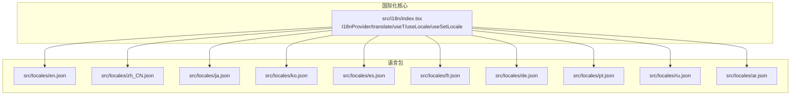
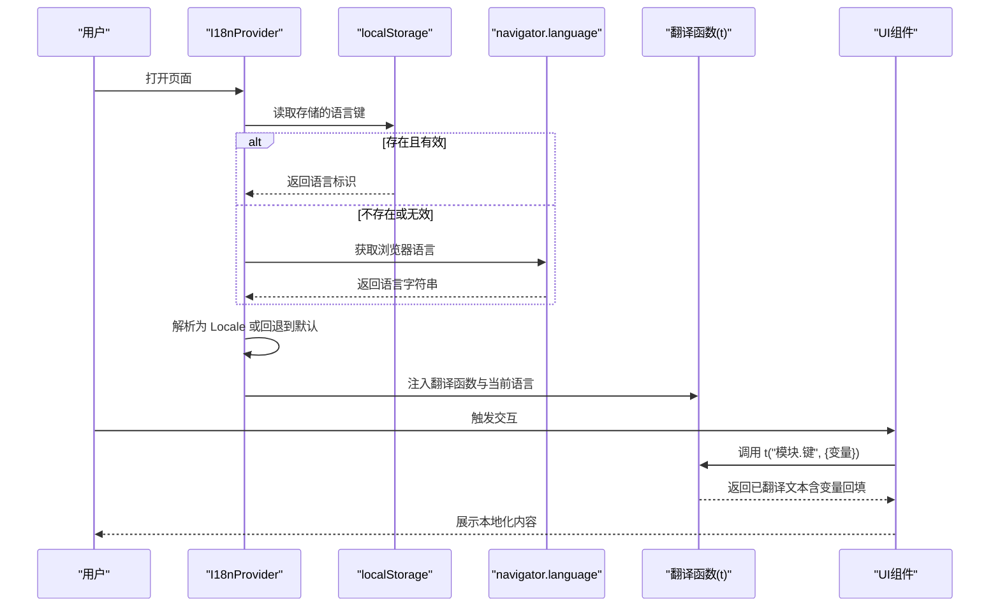
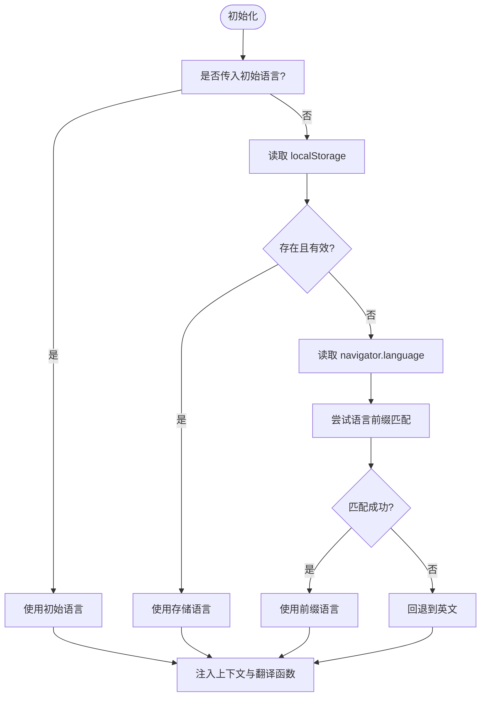
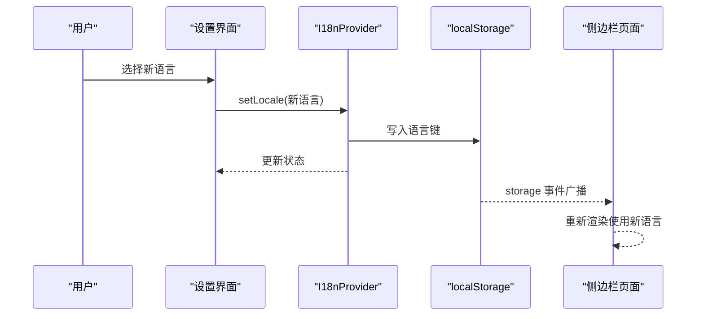
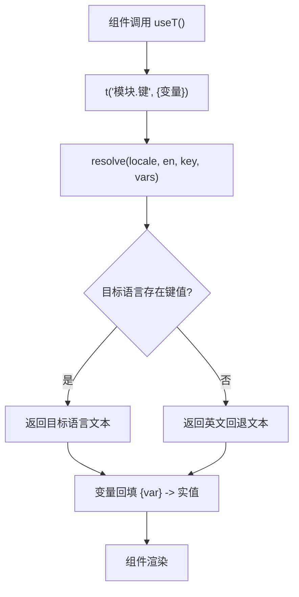
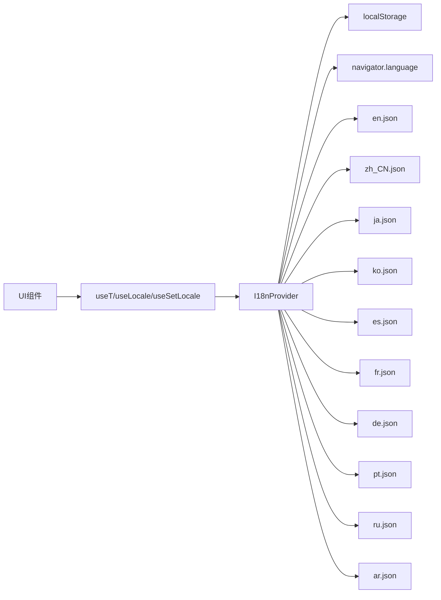

# 国际化支持

<cite>
**本文引用的文件**
- [src/i18n/index.tsx](file://src/i18n/index.tsx)
- [src/locales/en.json](file://src/locales/en.json)
- [src/locales/zh_CN.json](file://src/locales/zh_CN.json)
- [src/locales/ar.json](file://src/locales/ar.json)
- [src/locales/ja.json](file://src/locales/ja.json)
- [src/locales/ko.json](file://src/locales/ko.json)
- [src/locales/de.json](file://src/locales/de.json)
- [src/locales/es.json](file://src/locales/es.json)
- [src/locales/fr.json](file://src/locales/fr.json)
- [src/locales/pt.json](file://src/locales/pt.json)
- [src/locales/ru.json](file://src/locales/ru.json)
</cite>

## 目录
1. [简介](#简介)
2. [项目结构](#项目结构)
3. [核心组件](#核心组件)
4. [架构总览](#架构总览)
5. [详细组件分析](#详细组件分析)
6. [依赖关系分析](#依赖关系分析)
7. [性能考量](#性能考量)
8. [故障排查指南](#故障排查指南)
9. [结论](#结论)
10. [附录](#附录)

## 简介
本文件系统性阐述 BrowseMemory 的国际化（i18n）实现，覆盖以下方面：
- 多语言切换机制：检测用户首选语言、持久化选择、跨页面同步
- 语言包管理：10 种语言的组织结构与键值规范
- 动态加载策略：按需导入语言包、运行时解析与回填
- 文本提取、翻译与回填的完整流程
- 新增语言支持的开发指南与最佳实践
- RTL 语言（阿拉伯语）的特殊处理与布局适配
- 本地化测试与质量保证方法
- 维护与扩展建议，兼顾本地化工程师与产品经理视角

## 项目结构
国际化相关代码主要由两部分组成：
- i18n 核心：提供上下文、翻译函数、语言切换与检测逻辑
- 语言包：每个语言对应一个 JSON 文件，按模块分组组织键值

**图表来源**
- [src/i18n/index.tsx](file://src/i18n/index.tsx)
- [src/locales/en.json](file://src/locales/en.json)
- [src/locales/zh_CN.json](file://src/locales/zh_CN.json)
- [src/locales/ar.json](file://src/locales/ar.json)
- [src/locales/ja.json](file://src/locales/ja.json)
- [src/locales/ko.json](file://src/locales/ko.json)
- [src/locales/de.json](file://src/locales/de.json)
- [src/locales/es.json](file://src/locales/es.json)
- [src/locales/fr.json](file://src/locales/fr.json)
- [src/locales/pt.json](file://src/locales/pt.json)
- [src/locales/ru.json](file://src/locales/ru.json)

**章节来源**
- [src/i18n/index.tsx](file://src/i18n/index.tsx)
- [src/locales/en.json](file://src/locales/en.json)
- [src/locales/zh_CN.json](file://src/locales/zh_CN.json)
- [src/locales/ar.json](file://src/locales/ar.json)
- [src/locales/ja.json](file://src/locales/ja.json)
- [src/locales/ko.json](file://src/locales/ko.json)
- [src/locales/de.json](file://src/locales/de.json)
- [src/locales/es.json](file://src/locales/es.json)
- [src/locales/fr.json](file://src/locales/fr.json)
- [src/locales/pt.json](file://src/locales/pt.json)
- [src/locales/ru.json](file://src/locales/ru.json)

## 核心组件
- I18nProvider：React Provider，负责初始化语言、存储用户选择、跨页面同步、注入翻译函数与当前语言
- useT/useLocale/useSetLocale：三个 Hook，分别提供翻译函数、当前语言与切换语言能力
- 语言检测：优先从 localStorage 读取，其次从 navigator.language 推断，最后回退到英文
- 语言包：每个语言 JSON 采用模块化分组（如 common、header、settings、sidepanel、dashboard），键值支持占位符回填

关键要点
- 支持语言集合与显示名映射：包含英语、简体中文、日语、韩语、德语、西班牙语、法语、阿拉伯语、葡萄牙语、俄语
- RTL 语言识别：阿拉伯语标记为 RTL，渲染根节点上设置 dir="rtl"
- 变量回填：通过占位符 {var} 在运行时替换为具体值
- 回退策略：优先使用目标语言，不存在则回退到英文

**章节来源**
- [src/i18n/index.tsx](file://src/i18n/index.tsx)
- [src/locales/en.json](file://src/locales/en.json)
- [src/locales/zh_CN.json](file://src/locales/zh_CN.json)
- [src/locales/ar.json](file://src/locales/ar.json)

## 架构总览
下图展示 i18n 的整体工作流：从语言检测到翻译函数调用，再到 UI 渲染。

**图表来源**
- [src/i18n/index.tsx](file://src/i18n/index.tsx)

## 详细组件分析

### I18nProvider 实现与语言检测
- 初始化阶段
  - 若外部传入初始语言，则直接使用；否则进行检测
  - 检测顺序：localStorage -> navigator.language 前缀匹配 -> 英文
- 语言切换
  - setLocale 写入 localStorage 并更新状态
  - 监听 storage 事件，实现多页面间同步
- 翻译函数
  - resolve 优先从目标语言取值，不存在则回退英文
  - 支持占位符回填，形如 {n}、{total}
- RTL 适配
  - 使用 RTL_LOCALES 集合判断是否为 RTL
  - 在根节点 div 上设置 dir="rtl"/"ltr"

**图表来源**
- [src/i18n/index.tsx](file://src/i18n/index.tsx)

**章节来源**
- [src/i18n/index.tsx](file://src/i18n/index.tsx)

### 语言包组织与键值管理
- 组织结构
  - 每个语言一个 JSON 文件，根级按功能模块分组
  - 典型模块：common、header、settings、sidepanel、dashboard
- 键命名规范
  - 使用“模块.子项”层级路径，便于查找与维护
  - 含变量的键统一使用 {var} 占位符，避免硬编码拼接
- 示例模块
  - common：通用控件文案（保存、取消、确认、关闭、删除、加载中、重试、跳转设置）
  - header：头部导航与标签
  - settings：设置面板标题、描述、表单项、提示信息、错误消息、成功消息等
  - sidepanel：侧边栏标题、统计、搜索、聊天、错误提示、导航标签等
  - dashboard：报告面板标题、周期、生成按钮、加载与错误提示等

语言覆盖范围
- 英语（en）、简体中文（zh_CN）、日语（ja）、韩语（ko）、德语（de）、西班牙语（es）、法语（fr）、阿拉伯语（ar）、葡萄牙语（pt）、俄语（ru）

**章节来源**
- [src/locales/en.json](file://src/locales/en.json)
- [src/locales/zh_CN.json](file://src/locales/zh_CN.json)
- [src/locales/ar.json](file://src/locales/ar.json)
- [src/locales/ja.json](file://src/locales/ja.json)
- [src/locales/ko.json](file://src/locales/ko.json)
- [src/locales/de.json](file://src/locales/de.json)
- [src/locales/es.json](file://src/locales/es.json)
- [src/locales/fr.json](file://src/locales/fr.json)
- [src/locales/pt.json](file://src/locales/pt.json)
- [src/locales/ru.json](file://src/locales/ru.json)

### 动态语言切换与用户体验优化
- 切换流程
  - 用户在设置中选择语言 -> setLocale 更新状态与存储 -> storage 事件触发其他页面同步 -> UI 重新渲染
- 用户体验优化
  - 本地持久化：避免每次刷新重选
  - 跨页面同步：选项页与侧边栏等多入口一致
  - 回退策略：缺失键自动回退英文，减少空白文案
  - RTL 自动适配：阿拉伯语自动设置 dir="rtl"

**图表来源**
- [src/i18n/index.tsx](file://src/i18n/index.tsx)

**章节来源**
- [src/i18n/index.tsx](file://src/i18n/index.tsx)

### 文本提取、翻译与回填流程
- 提取
  - 在各 UI 组件中通过 useT() 获取翻译函数
  - 调用 t("模块.键", {变量}) 获取本地化文本
- 翻译
  - resolve 递归查找嵌套键值，若不存在则回退英文
- 回填
  - 对返回文本进行占位符替换，最终渲染到 DOM

**图表来源**
- [src/i18n/index.tsx](file://src/i18n/index.tsx)

**章节来源**
- [src/i18n/index.tsx](file://src/i18n/index.tsx)

### 新增语言支持的开发指南与最佳实践
- 新增步骤
  - 在 src/locales 下新增 {lang}.json，复制任一语言的模块结构作为模板
  - 完成翻译，确保模块与键名与现有语言一致
  - 在 src/i18n/index.tsx 中：
    - 导入新增语言 JSON
    - 在 LOCALES 映射中注册
    - 在 Locale 联合类型与 LOCALE_NAMES 中添加
    - 如为 RTL 语言，在 RTL_LOCALES 中加入
- 最佳实践
  - 保持模块与键名一致性，避免碎片化
  - 使用占位符统一变量传递，避免字符串拼接
  - 为 RTL 语言预留布局空间，避免文本溢出
  - 为长句预留空间，避免截断
  - 为日期/数字格式化预留文化相关处理点（如有需要）

**章节来源**
- [src/i18n/index.tsx](file://src/i18n/index.tsx)
- [src/locales/en.json](file://src/locales/en.json)

### RTL 语言（阿拉伯语）的特殊处理与布局适配
- 识别与适配
  - RTL_LOCALES 包含 "ar"，用于判断是否为 RTL
  - 根节点 div 设置 dir="rtl"，影响文本方向、对齐与滚动行为
- 布局建议
  - 导航与图标方向：确保向左/右指示正确
  - 表单与输入框：文本从右到左，光标行为正常
  - 弹窗与菜单：定位与箭头方向适配 RTL
  - 滚动条：在 RTL 下仍符合预期

**章节来源**
- [src/i18n/index.tsx](file://src/i18n/index.tsx)
- [src/locales/ar.json](file://src/locales/ar.json)

## 依赖关系分析
- 组件耦合
  - UI 组件仅依赖 useT/useLocale/useSetLocale，低耦合高内聚
  - I18nProvider 依赖语言包 JSON，但不直接依赖 UI
- 外部依赖
  - localStorage 用于持久化
  - navigator.language 用于检测浏览器语言
- 潜在风险
  - 语言包缺失键值将回退英文，需持续校验
  - RTL 语言需额外验证布局与交互

**图表来源**
- [src/i18n/index.tsx](file://src/i18n/index.tsx)
- [src/locales/en.json](file://src/locales/en.json)
- [src/locales/zh_CN.json](file://src/locales/zh_CN.json)
- [src/locales/ar.json](file://src/locales/ar.json)
- [src/locales/ja.json](file://src/locales/ja.json)
- [src/locales/ko.json](file://src/locales/ko.json)
- [src/locales/de.json](file://src/locales/de.json)
- [src/locales/es.json](file://src/locales/es.json)
- [src/locales/fr.json](file://src/locales/fr.json)
- [src/locales/pt.json](file://src/locales/pt.json)
- [src/locales/ru.json](file://src/locales/ru.json)

**章节来源**
- [src/i18n/index.tsx](file://src/i18n/index.tsx)

## 性能考量
- 语言包加载
  - 当前实现为静态导入，打包时包含全部语言包，体积略增
  - 若未来语言增多，可考虑按需动态导入（动态 import），以降低首屏体积
- 渲染性能
  - 翻译函数为纯函数，计算成本极低
  - 通过 React.memo 与稳定依赖（localeData）避免不必要的重渲染
- 存储与网络
  - 本地存储读写为 O(1)，对性能影响可忽略
  - 无网络请求参与，无需考虑网络抖动

## 故障排查指南
- 常见问题
  - 语言未生效：检查 localStorage 是否写入成功；确认 storage 事件监听是否正常
  - 文案缺失：检查语言包中是否存在对应键；确认模块与键名拼写
  - RTL 布局异常：检查 dir 属性是否正确设置；验证样式中对 RTL 的适配
- 排查步骤
  - 打开浏览器开发者工具，查看 localStorage 中的语言键值
  - 在控制台调用 useLocale/useT 验证返回值
  - 检查语言包 JSON 语法与键值类型（应为字符串）
  - 在 RTL 语言下验证文本方向与布局

**章节来源**
- [src/i18n/index.tsx](file://src/i18n/index.tsx)

## 结论
BrowseMemory 的 i18n 框架以简洁高效的 React Context 为核心，结合静态语言包与运行时解析，实现了稳定的多语言支持。其设计具备良好的可维护性与扩展性，能够快速支持新语言并保障 RTL 语言的可用性。建议在后续迭代中引入动态语言包加载以进一步优化首屏性能，并持续完善本地化测试流程以提升质量稳定性。

## 附录
- 支持语言清单
  - 英语（en）、简体中文（zh_CN）、日语（ja）、韩语（ko）、德语（de）、西班牙语（es）、法语（fr）、阿拉伯语（ar）、葡萄牙语（pt）、俄语（ru）
- 关键接口与钩子
  - I18nProvider：提供上下文与翻译函数
  - useT：获取翻译函数
  - useLocale：获取当前语言
  - useSetLocale：设置语言
- 语言包结构建议
  - 保持模块与键名一致
  - 使用占位符统一变量传递
  - 为 RTL 语言预留布局空间