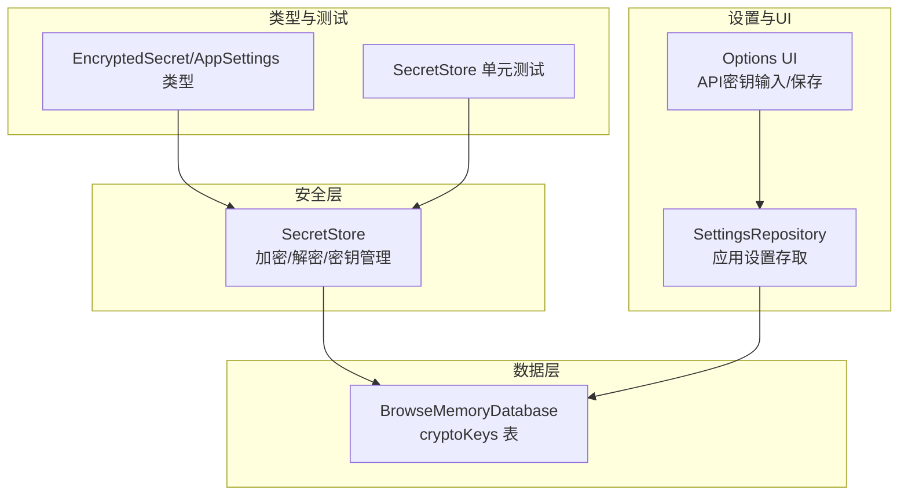
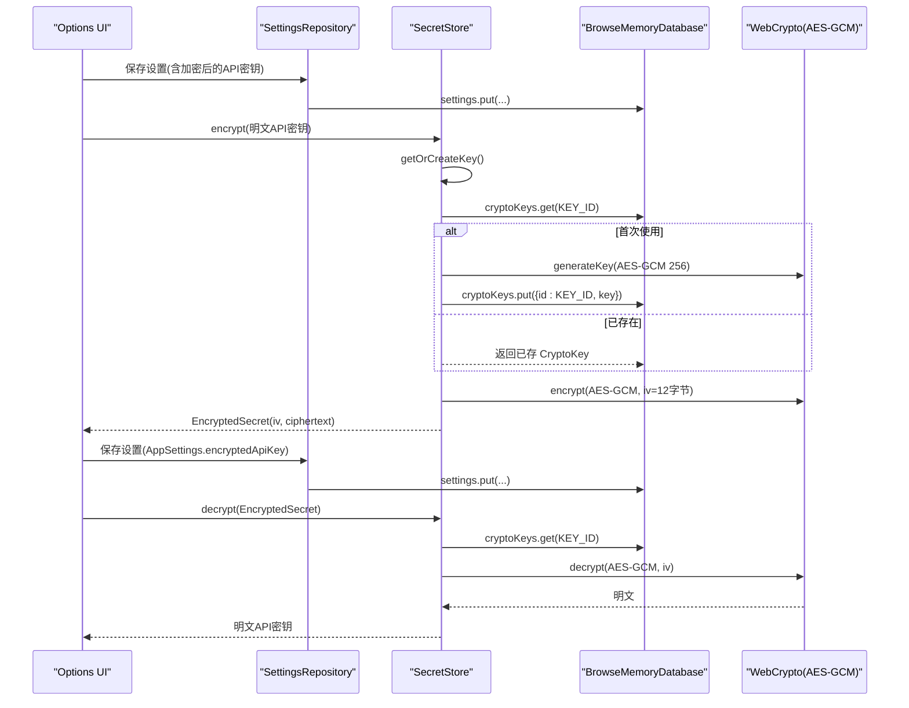
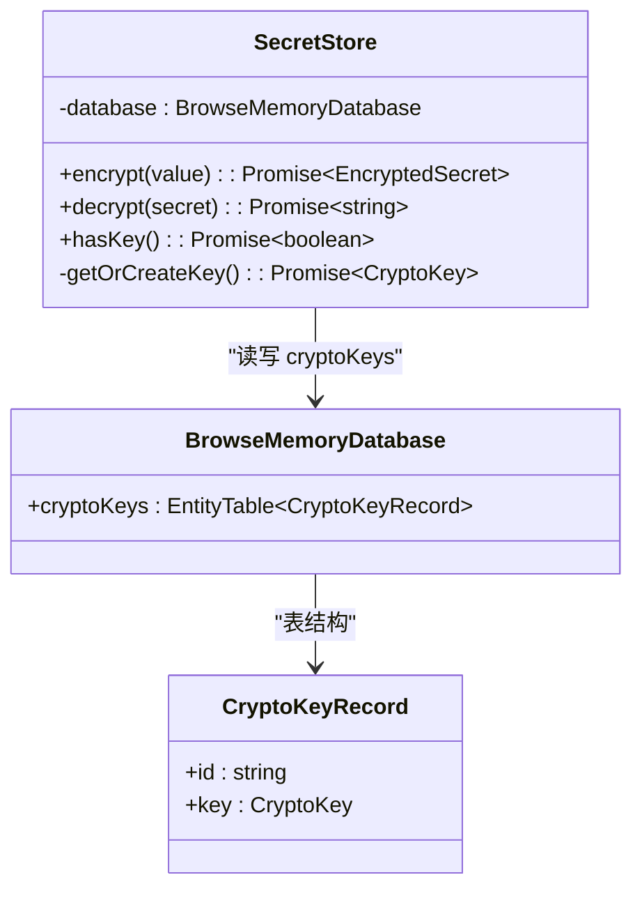
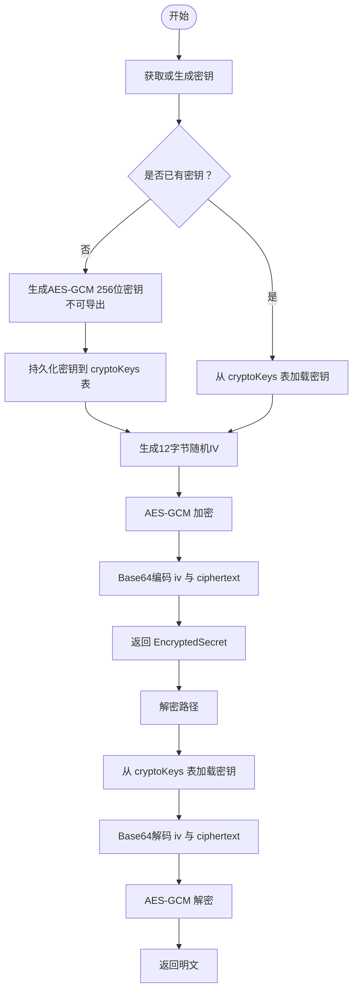
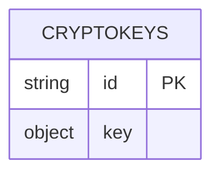
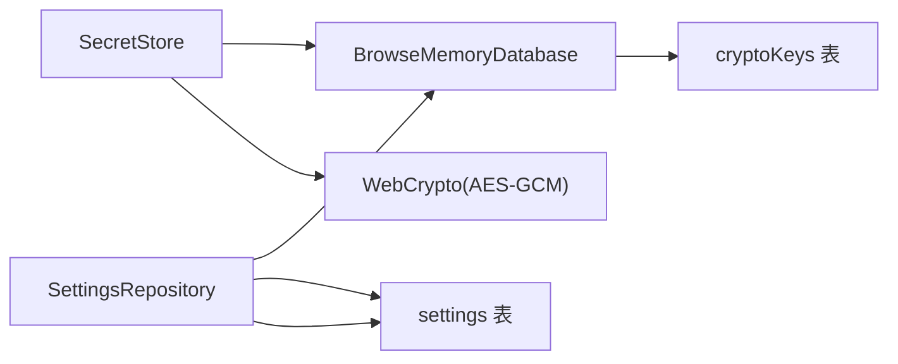

# API密钥加密存储

<cite>
**本文引用的文件**
- [src/security/secret-store.ts](file://src/security/secret-store.ts)
- [src/storage/database.ts](file://src/storage/database.ts)
- [src/shared/types.ts](file://src/shared/types.ts)
- [tests/security/secret-store.test.ts](file://tests/security/secret-store.test.ts)
- [src/storage/settings-repository.ts](file://src/storage/settings-repository.ts)
- [entrypoints/options/App.tsx](file://entrypoints/options/App.tsx)
</cite>

## 目录
1. [简介](#简介)
2. [项目结构](#项目结构)
3. [核心组件](#核心组件)
4. [架构总览](#架构总览)
5. [详细组件分析](#详细组件分析)
6. [依赖关系分析](#依赖关系分析)
7. [性能考量](#性能考量)
8. [故障排查指南](#故障排查指南)
9. [结论](#结论)
10. [附录：使用示例与最佳实践](#附录使用示例与最佳实践)

## 简介
本文件面向开发者，系统性阐述 BrowseMemory 中“API密钥加密存储”能力的技术实现与使用方法。重点覆盖以下方面：
- AES-GCM 对称加密在浏览器 WebCrypto 环境下的实现细节（密钥生成、IV 随机性、加解密流程）
- SecretStore 类的设计与职责边界（密钥管理、加解密、持久化策略）
- 加密密钥的持久化模型（CryptoKeys 表、KEY_ID 常量）
- 完整的端到端使用示例（从输入到存储再到解密验证）
- 安全性考量（密钥长度、IV 要求、抗攻击设计）
- 密钥轮换与迁移的可扩展建议

## 项目结构
围绕“API密钥加密存储”的关键文件组织如下：
- 安全层：src/security/secret-store.ts 提供加密与解密能力
- 数据层：src/storage/database.ts 定义数据库结构与 CryptoKeys 表
- 类型定义：src/shared/types.ts 定义 EncryptedSecret 与 AppSettings
- 测试：tests/security/secret-store.test.ts 验证非导出密钥与往返一致性
- 设置存储：src/storage/settings-repository.ts 提供应用设置的读写与清理
- UI入口：entrypoints/options/App.tsx 展示用户输入与保存流程

图表来源
- [src/security/secret-store.ts:25-69](file://src/security/secret-store.ts#L25-L69)
- [src/storage/database.ts:29-39](file://src/storage/database.ts#L29-L39)
- [src/shared/types.ts:1-22](file://src/shared/types.ts#L1-L22)
- [tests/security/secret-store.test.ts:1-26](file://tests/security/secret-store.test.ts#L1-L26)
- [src/storage/settings-repository.ts:8-56](file://src/storage/settings-repository.ts#L8-L56)
- [entrypoints/options/App.tsx:199-215](file://entrypoints/options/App.tsx#L199-L215)

章节来源
- [src/security/secret-store.ts:25-69](file://src/security/secret-store.ts#L25-L69)
- [src/storage/database.ts:29-39](file://src/storage/database.ts#L29-L39)
- [src/shared/types.ts:1-22](file://src/shared/types.ts#L1-L22)
- [tests/security/secret-store.test.ts:1-26](file://tests/security/secret-store.test.ts#L1-L26)
- [src/storage/settings-repository.ts:8-56](file://src/storage/settings-repository.ts#L8-L56)
- [entrypoints/options/App.tsx:199-215](file://entrypoints/options/App.tsx#L199-L215)

## 核心组件
- SecretStore：负责密钥生成/加载、AES-GCM 加密、AES-GCM 解密、以及密钥存在性检查
- BrowseMemoryDatabase：提供 cryptoKeys 表用于持久化 CryptoKey
- EncryptedSecret/AppSettings：定义加密后的密钥结构与应用设置结构
- SettingsRepository：提供应用设置的读取、保存与清空（含 cryptoKeys）

章节来源
- [src/security/secret-store.ts:25-69](file://src/security/secret-store.ts#L25-L69)
- [src/storage/database.ts:29-39](file://src/storage/database.ts#L29-L39)
- [src/shared/types.ts:1-22](file://src/shared/types.ts#L1-L22)
- [src/storage/settings-repository.ts:8-56](file://src/storage/settings-repository.ts#L8-L56)

## 架构总览
下图展示了从 UI 输入到数据库持久化的整体流程，以及解密时的回溯路径。

图表来源
- [src/security/secret-store.ts:28-68](file://src/security/secret-store.ts#L28-L68)
- [src/storage/database.ts:39](file://src/storage/database.ts#L39)
- [src/shared/types.ts:1-22](file://src/shared/types.ts#L1-L22)
- [src/storage/settings-repository.ts:19-23](file://src/storage/settings-repository.ts#L19-L23)
- [entrypoints/options/App.tsx:199-215](file://entrypoints/options/App.tsx#L199-L215)

## 详细组件分析

### SecretStore 类设计与实现
- 职责边界
  - 密钥生命周期管理：首次使用时生成密钥并持久化；后续直接复用
  - 加密：生成12字节随机 IV，使用 AES-GCM 对明文进行加密，返回包含 Base64 编码的 iv 与 ciphertext 的结构
  - 解密：从持久化密钥恢复 CryptoKey，使用提供的 iv 进行解密并返回明文
  - 密钥存在性检查：通过 KEY_ID 查询 cryptoKeys 表判断是否存在密钥

- 关键实现要点
  - 密钥生成：AES-GCM 256 位密钥，不可导出（extractable=false），确保密钥仅在 WebCrypto 上下文中可用
  - IV 生成：使用 crypto.getRandomValues 生成 12 字节随机数，满足 AES-GCM 的推荐长度
  - 序列化：iv 与 ciphertext 使用 Base64 编解码，便于跨存储传输
  - 错误处理：未显式捕获异常，调用方需自行处理可能的解密失败或数据库访问异常

图表来源
- [src/security/secret-store.ts:25-69](file://src/security/secret-store.ts#L25-L69)
- [src/storage/database.ts:29-39](file://src/storage/database.ts#L29-L39)

章节来源
- [src/security/secret-store.ts:25-69](file://src/security/secret-store.ts#L25-L69)
- [src/storage/database.ts:29-39](file://src/storage/database.ts#L29-L39)

### 加密与解密流程详解
- 加密流程
  - 获取或生成密钥：若不存在则生成新密钥并持久化
  - 生成 IV：12 字节随机值
  - 执行 AES-GCM 加密：返回密文
  - 将 iv 与 ciphertext 分别 Base64 编码后封装为 EncryptedSecret

- 解密流程
  - 获取密钥：从 cryptoKeys 表按 KEY_ID 恢复 CryptoKey
  - Base64 解码 iv 与 ciphertext
  - 执行 AES-GCM 解密：返回明文字符串

图表来源
- [src/security/secret-store.ts:28-68](file://src/security/secret-store.ts#L28-L68)

章节来源
- [src/security/secret-store.ts:28-68](file://src/security/secret-store.ts#L28-L68)

### 数据持久化模型：CryptoKeys 表与 KEY_ID
- CryptoKeys 表
  - 字段：id（字符串主键）、key（CryptoKey）
  - 版本：v1/v2/v3 均包含该表，确保向前兼容
- KEY_ID
  - 固定标识符“api-key”，用于区分不同用途的密钥（当前用于通用 API 密钥）
  - 可扩展：如需多密钥场景，可在同一表中引入不同 id 并在业务侧路由

图表来源
- [src/storage/database.ts:29-39](file://src/storage/database.ts#L29-L39)

章节来源
- [src/storage/database.ts:29-39](file://src/storage/database.ts#L29-L39)

### 类型与接口
- EncryptedSecret
  - 结构：iv（Base64 字符串）、ciphertext（Base64 字符串）
- AppSettings
  - 可选字段：encryptedApiKey、encryptedEmbeddingApiKey，用于存放加密后的密钥

章节来源
- [src/shared/types.ts:1-22](file://src/shared/types.ts#L1-L22)

### 测试验证点
- round-trip 正确性：加密后再解密得到原始明文
- 密钥不可导出：生成的 CryptoKey.extractable 为 false，避免被导出或泄露

章节来源
- [tests/security/secret-store.test.ts:17-25](file://tests/security/secret-store.test.ts#L17-L25)

## 依赖关系分析
- 组件耦合
  - SecretStore 依赖 BrowseMemoryDatabase 的 cryptoKeys 表进行密钥持久化
  - SettingsRepository 依赖 settings 表存储应用设置（含加密后的密钥）
- 外部依赖
  - WebCrypto API（crypto.subtle.encrypt/decrypt、crypto.getRandomValues）
  - Dexie（EntityTable、事务）

图表来源
- [src/security/secret-store.ts:25-69](file://src/security/secret-store.ts#L25-L69)
- [src/storage/database.ts:39](file://src/storage/database.ts#L39)
- [src/storage/settings-repository.ts:8-56](file://src/storage/settings-repository.ts#L8-L56)

章节来源
- [src/security/secret-store.ts:25-69](file://src/security/secret-store.ts#L25-L69)
- [src/storage/database.ts:39](file://src/storage/database.ts#L39)
- [src/storage/settings-repository.ts:8-56](file://src/storage/settings-repository.ts#L8-L56)

## 性能考量
- 密钥生成成本低：AES-GCM 256 位密钥生成与 WebCrypto 实现通常很快
- 加解密开销：AES-GCM 在现代浏览器中硬件加速良好，对小到中等长度的 API 密钥影响可忽略
- IV 复杂度：每次加密生成新的 12 字节 IV，无额外存储负担
- 存储体积：EncryptedSecret 由两个 Base64 字符串组成，体积略大于明文，但安全收益显著

## 故障排查指南
- 解密失败
  - 检查 EncryptedSecret 的 iv 与 ciphertext 是否完整且未被截断
  - 确认密钥未被意外删除或覆盖（KEY_ID 对应记录是否存在）
- 密钥丢失
  - 若 cryptoKeys 表被清空，重新执行一次加密会触发新密钥生成；此前加密的数据将无法解密
- 权限问题
  - 确保页面上下文允许访问 WebCrypto API（HTTPS 或 localhost）
- 测试验证
  - 参考单元测试用例，确认 round-trip 与密钥不可导出属性

章节来源
- [tests/security/secret-store.test.ts:17-25](file://tests/security/secret-store.test.ts#L17-L25)

## 结论
BrowseMemory 的 API 密钥加密存储以 WebCrypto 的 AES-GCM 为核心，结合本地 IndexedDB（Dexie）实现安全、便捷的密钥持久化。SecretStore 将密钥管理、加解密与持久化整合为统一接口，配合严格的密钥不可导出策略与 12 字节 IV，提供了良好的安全性与可维护性。对于未来扩展（如多密钥、密钥轮换），可在现有表结构与 KEY_ID 基础上平滑演进。

## 附录：使用示例与最佳实践

### 示例：在应用中保存与读取加密的 API 密钥
- 保存流程
  - 用户在 Options 页面输入明文 API 密钥
  - 调用 SecretStore.encrypt 得到 EncryptedSecret
  - 将 EncryptedSecret 写入 AppSettings.encryptedApiKey
  - 通过 SettingsRepository.save 持久化设置
- 读取流程
  - 通过 SettingsRepository.get 获取 AppSettings
  - 若存在 encryptedApiKey，则调用 SecretStore.decrypt 解密得到明文
  - 仅在需要时临时解密，避免长期持有明文

章节来源
- [entrypoints/options/App.tsx:199-215](file://entrypoints/options/App.tsx#L199-L215)
- [src/security/secret-store.ts:28-68](file://src/security/secret-store.ts#L28-L68)
- [src/storage/settings-repository.ts:19-23](file://src/storage/settings-repository.ts#L19-L23)
- [src/shared/types.ts:6-22](file://src/shared/types.ts#L6-L22)

### 安全性考虑
- 密钥长度：采用 AES-GCM 256 位密钥，满足高强度加密需求
- IV 随机性：每次加密使用 12 字节随机 IV，避免重复 IV 导致的安全风险
- 抗攻击设计：密钥不可导出，防止被外部工具提取；EncryptedSecret 仅包含必要的元数据
- 传输与存储：EncryptedSecret 以 Base64 字符串形式存储，便于跨层传递

### 密钥轮换与迁移最佳实践
- 新旧密钥共存
  - 在 cryptoKeys 表中引入新的 id（例如“api-key-v2”），同时保留旧密钥
  - 新增加密使用新密钥，旧数据仍可使用旧密钥解密
- 渐进迁移
  - 读取旧密钥解密后，立即使用新密钥重新加密并更新存储
  - 迁移完成后删除旧密钥记录
- 清理策略
  - SettingsRepository.clearAll 会一并清空 cryptoKeys 表，导致历史加密数据不可恢复
  - 如需迁移，请先完成密钥轮换再执行清理

章节来源
- [src/storage/database.ts:48-76](file://src/storage/database.ts#L48-L76)
- [src/storage/settings-repository.ts:25-55](file://src/storage/settings-repository.ts#L25-L55)