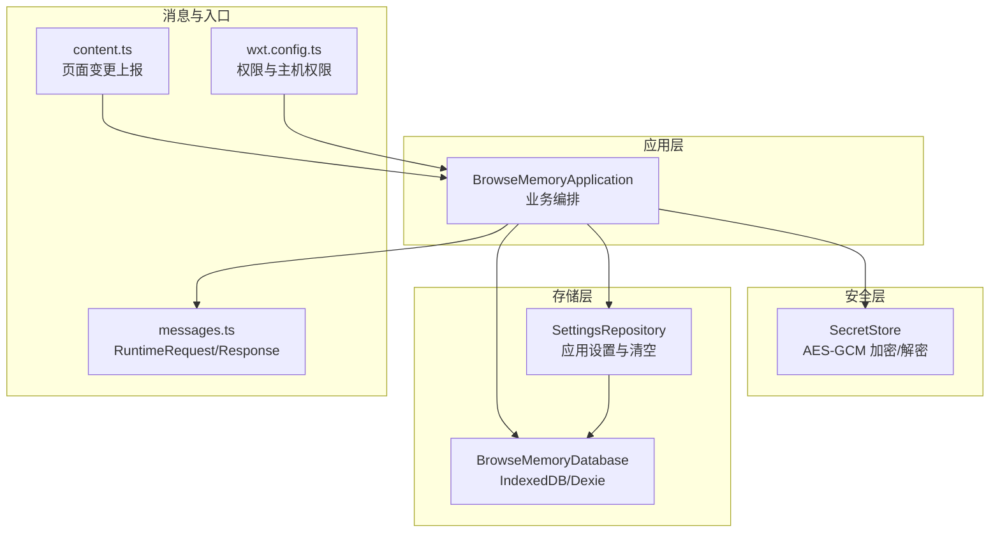
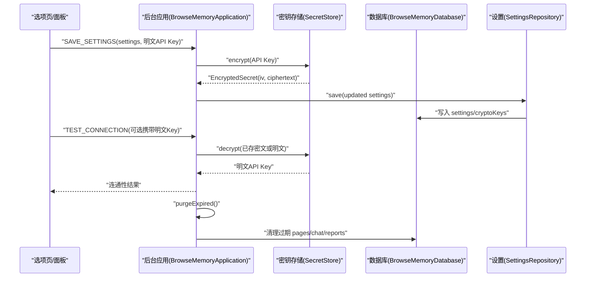
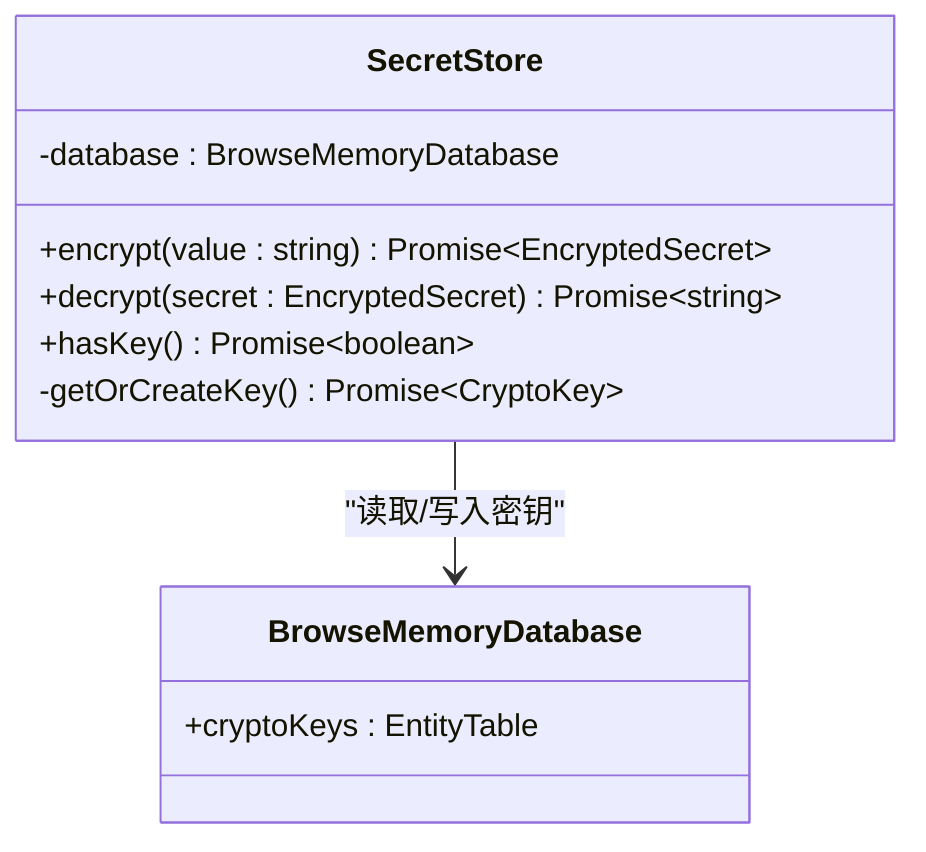
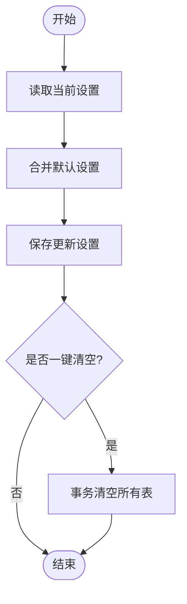
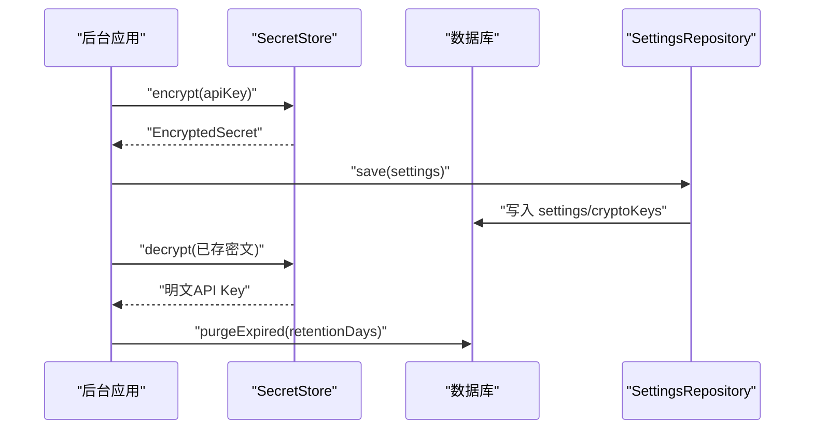
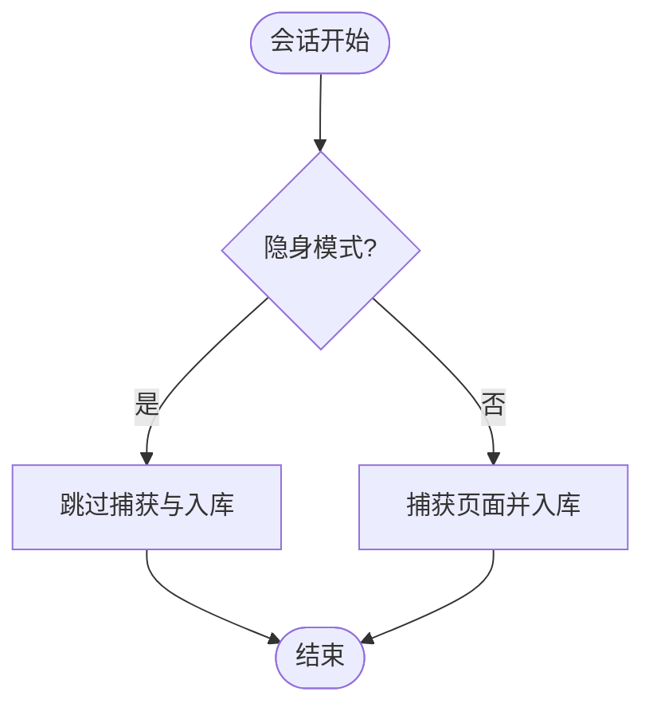
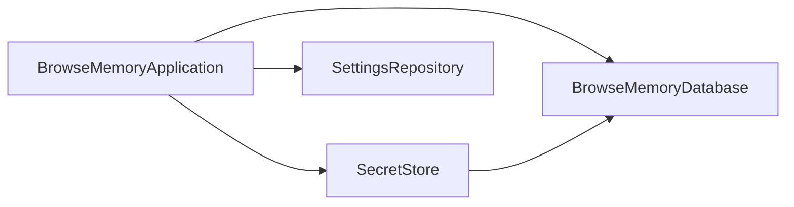
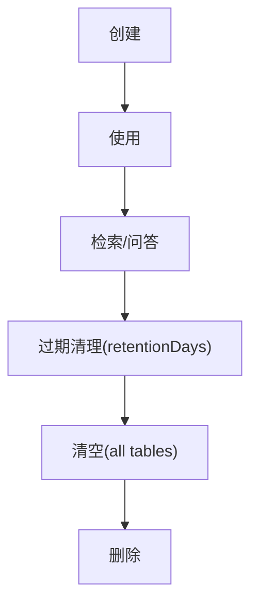

# 安全与隐私

<cite>
**本文引用的文件**
- [src/security/secret-store.ts](file://src/security/secret-store.ts)
- [src/storage/database.ts](file://src/storage/database.ts)
- [src/storage/settings-repository.ts](file://src/storage/settings-repository.ts)
- [src/background/application.ts](file://src/background/application.ts)
- [src/shared/types.ts](file://src/shared/types.ts)
- [src/shared/constants.ts](file://src/shared/constants.ts)
- [src/shared/messages.ts](file://src/shared/messages.ts)
- [src/capture/session-machine.ts](file://src/capture/session-machine.ts)
- [src/background/session-coordinator.ts](file://src/background/session-coordinator.ts)
- [entrypoints/content.ts](file://entrypoints/content.ts)
- [wxt.config.ts](file://wxt.config.ts)
- [tests/security/secret-store.test.ts](file://tests/security/secret-store.test.ts)
</cite>

## 目录
1. [简介](#简介)
2. [项目结构](#项目结构)
3. [核心组件](#核心组件)
4. [架构总览](#架构总览)
5. [详细组件分析](#详细组件分析)
6. [依赖关系分析](#依赖关系分析)
7. [性能考量](#性能考量)
8. [故障排查指南](#故障排查指南)
9. [结论](#结论)
10. [附录](#附录)

## 简介
本文件聚焦于 BrowseMemory 的“安全与隐私”能力，系统性阐述以下主题：
- AES-GCM 加密 API 密钥的实现：密钥生成、加密存储与解密流程
- 隐私设计原则：本地存储优先、数据最小化收集、用户控制机制
- 敏感数据处理：API 密钥、用户对话与页面内容的保护策略
- 权限最小化原则：为何不申请历史、Cookie 或网络请求权限
- 隐身模式下的数据处理策略与用户隐私保护
- 安全配置最佳实践与安全审计建议
- 数据生命周期管理：从创建到删除的全流程
- 开发者安全编码规范与漏洞防护指导

## 项目结构
围绕安全与隐私的关键模块与职责如下：
- 安全层
  - SecretStore：基于 WebCrypto 的 AES-GCM 对称加密，密钥在浏览器侧生成并仅可使用一次（非导出）
- 存储层
  - BrowseMemoryDatabase：IndexedDB/Dexie 抽象，包含 pages、chatSessions、chatMessages、bm25Documents、bm25Terms、embeddings、taskQueue、reports、settings、cryptoKeys 等表
  - SettingsRepository：应用设置持久化，支持一键清空所有数据（含密钥）
- 应用层
  - BrowseMemoryApplication：后台应用主控制器，负责调用 SecretStore 进行密钥加解密、执行数据清理与任务调度
- 消息与入口
  - messages.ts：前后端通信协议定义
  - content.ts：内容脚本监听页面变化并上报
  - wxt.config.ts：扩展清单，声明权限与主机权限

图表来源
- [src/security/secret-store.ts:25-69](file://src/security/secret-store.ts#L25-L69)
- [src/storage/database.ts:34-76](file://src/storage/database.ts#L34-L76)
- [src/storage/settings-repository.ts:8-56](file://src/storage/settings-repository.ts#L8-L56)
- [src/background/application.ts:29-63](file://src/background/application.ts#L29-L63)
- [src/shared/messages.ts:13-71](file://src/shared/messages.ts#L13-L71)
- [entrypoints/content.ts:1-43](file://entrypoints/content.ts#L1-L43)
- [wxt.config.ts:1-18](file://wxt.config.ts#L1-L18)

章节来源
- [src/security/secret-store.ts:25-69](file://src/security/secret-store.ts#L25-L69)
- [src/storage/database.ts:34-76](file://src/storage/database.ts#L34-L76)
- [src/storage/settings-repository.ts:8-56](file://src/storage/settings-repository.ts#L8-L56)
- [src/background/application.ts:29-63](file://src/background/application.ts#L29-L63)
- [src/shared/messages.ts:13-71](file://src/shared/messages.ts#L13-L71)
- [entrypoints/content.ts:1-43](file://entrypoints/content.ts#L1-L43)
- [wxt.config.ts:1-18](file://wxt.config.ts#L1-L18)

## 核心组件
- SecretStore
  - 职责：对字符串进行 AES-GCM 加密；对密文进行解密；按需生成并缓存非导出 CryptoKey；以 EncryptedSecret 形式返回 iv 与密文
  - 关键点：iv 长度 12 字节；密钥长度 256；密钥不可导出；加密结果以 Base64 字符串存储
- BrowseMemoryDatabase
  - 职责：统一管理 IndexedDB 表结构，包含 cryptoKeys 表用于存放密钥
- SettingsRepository
  - 职责：读取/保存应用设置；提供一键清空数据库（含密钥）能力
- BrowseMemoryApplication
  - 职责：在保存设置时加密 API Key；在测试连接时解密 API Key；在清理过期数据时联动各仓库
- 类型与常量
  - EncryptedSecret：密文结构
  - AppSettings：包含加密后的聊天与嵌入式 API Key 字段
  - DEFAULT_SETTINGS：默认保留天数、模型等参数
- 消息协议
  - SAVE_SETTINGS：携带明文 API Key，由后台加密后落库
  - TEST_CONNECTION / TEST_EMBEDDING_CONNECTION：解密后临时验证连通性
- 内容脚本
  - 监听页面变化并上报，不直接访问敏感数据

章节来源
- [src/security/secret-store.ts:25-69](file://src/security/secret-store.ts#L25-L69)
- [src/storage/database.ts:29-32](file://src/storage/database.ts#L29-L32)
- [src/storage/settings-repository.ts:8-56](file://src/storage/settings-repository.ts#L8-L56)
- [src/background/application.ts:115-129](file://src/background/application.ts#L115-L129)
- [src/background/application.ts:130-177](file://src/background/application.ts#L130-L177)
- [src/shared/types.ts:1-22](file://src/shared/types.ts#L1-L22)
- [src/shared/constants.ts:10-24](file://src/shared/constants.ts#L10-L24)
- [src/shared/messages.ts:26-28](file://src/shared/messages.ts#L26-L28)
- [entrypoints/content.ts:17-21](file://entrypoints/content.ts#L17-L21)

## 架构总览
下图展示从用户输入到数据落地与清理的端到端路径，重点标注了敏感数据与密钥的处理位置。

图表来源
- [src/background/application.ts:115-129](file://src/background/application.ts#L115-L129)
- [src/background/application.ts:130-177](file://src/background/application.ts#L130-L177)
- [src/background/application.ts:65-72](file://src/background/application.ts#L65-L72)
- [src/security/secret-store.ts:28-50](file://src/security/secret-store.ts#L28-L50)
- [src/storage/settings-repository.ts:19-23](file://src/storage/settings-repository.ts#L19-L23)
- [src/storage/database.ts:34-44](file://src/storage/database.ts#L34-L44)

## 详细组件分析

### 组件一：SecretStore（AES-GCM 加密 API 密钥）
- 设计要点
  - 使用 WebCrypto SubtleCrypto 的 AES-GCM，256 位密钥，12 字节随机 IV
  - 密钥仅在内存中存在且不可导出，首次使用时自动生成并持久化到 cryptoKeys 表
  - 加密输出以 Base64 字符串形式返回，便于跨进程传输与存储
- 处理流程（加密）
  - 获取或生成密钥 -> 生成 12 字节随机 IV -> AES-GCM 加密 -> 返回 EncryptedSecret
- 处理流程（解密）
  - 获取密钥 -> 读取 iv 与 ciphertext -> AES-GCM 解密 -> 返回明文
- 测试验证
  - round-trip 正确性与密钥不可导出属性

图表来源
- [src/security/secret-store.ts:25-69](file://src/security/secret-store.ts#L25-L69)
- [src/storage/database.ts:29-32](file://src/storage/database.ts#L29-L32)

章节来源
- [src/security/secret-store.ts:25-69](file://src/security/secret-store.ts#L25-L69)
- [tests/security/secret-store.test.ts:17-25](file://tests/security/secret-store.test.ts#L17-L25)

### 组件二：应用设置与一键清空（隐私控制与数据最小化）
- 设置读取与保存
  - 读取：合并默认设置与持久化值
  - 保存：合并新设置并写入 settings 表
- 一键清空
  - 清空 pages、bm25Documents、bm25Terms、settings、cryptoKeys、chatSessions、chatMessages、embeddings、taskQueue、reports 等全部表
- 用户控制机制
  - 通过 UI 层触发 CLEAR_ALL_DATA，后台应用立即执行清空操作，确保用户对数据的完全控制

图表来源
- [src/storage/settings-repository.ts:11-23](file://src/storage/settings-repository.ts#L11-L23)
- [src/storage/settings-repository.ts:25-55](file://src/storage/settings-repository.ts#L25-L55)

章节来源
- [src/storage/settings-repository.ts:11-23](file://src/storage/settings-repository.ts#L11-L23)
- [src/storage/settings-repository.ts:25-55](file://src/storage/settings-repository.ts#L25-L55)

### 组件三：后台应用编排（敏感数据最小化与生命周期）
- 保存设置时加密 API Key
  - 若传入明文，则加密后写入 settings
- 测试连接时解密 API Key
  - 先尝试解密已存密文，若无则使用传入明文；失败时返回缺失密钥错误
- 清理过期数据
  - 并行清理 pages、chat、reports，基于 retentionDays 计算截止时间
- 会话与页面捕获
  - 仅在满足条件时才捕获页面内容，避免无关数据入库

图表来源
- [src/background/application.ts:115-129](file://src/background/application.ts#L115-L129)
- [src/background/application.ts:130-177](file://src/background/application.ts#L130-L177)
- [src/background/application.ts:65-72](file://src/background/application.ts#L65-L72)

章节来源
- [src/background/application.ts:115-129](file://src/background/application.ts#L115-L129)
- [src/background/application.ts:130-177](file://src/background/application.ts#L130-L177)
- [src/background/application.ts:65-72](file://src/background/application.ts#L65-L72)

### 组件四：隐身模式下的数据处理策略
- 会话协调器
  - 在 finalize 时判断 incognito 标志，决定是否捕获页面
- 会话机
  - 记录 incognito 状态并在切换时保持该状态
- 结论
  - 在隐身模式下，不会将页面内容写入数据库，从而实现“零数据留存”

图表来源
- [src/background/session-coordinator.ts:130-147](file://src/background/session-coordinator.ts#L130-L147)
- [src/capture/session-machine.ts:1-69](file://src/capture/session-machine.ts#L1-L69)

章节来源
- [src/background/session-coordinator.ts:130-147](file://src/background/session-coordinator.ts#L130-L147)
- [src/capture/session-machine.ts:1-69](file://src/capture/session-machine.ts#L1-L69)

### 组件五：权限最小化原则与网络访问
- 扩展权限
  - tabs、activeTab、storage、alarms、sidePanel
  - host_permissions: "<all_urls>"
- 无需历史、Cookie 或网络请求权限的原因
  - 不读取浏览历史与 Cookie，避免隐私风险
  - 仅通过 host_permissions 访问页面上下文，不主动发起网络请求
  - 页面内容提取与上报通过 content.ts 监听事件完成，不涉及 Cookie 读取

章节来源
- [wxt.config.ts:9-10](file://wxt.config.ts#L9-L10)
- [entrypoints/content.ts:17-21](file://entrypoints/content.ts#L17-L21)

## 依赖关系分析
- 组件耦合
  - SecretStore 与 BrowseMemoryDatabase 强耦合（密钥持久化）
  - BrowseMemoryApplication 同时依赖 SecretStore、SettingsRepository、各仓储与服务
- 外部依赖
  - WebCrypto（AES-GCM）、Dexie（IndexedDB 封装）
- 循环依赖
  - 未发现循环依赖

图表来源
- [src/background/application.ts:29-63](file://src/background/application.ts#L29-L63)
- [src/security/secret-store.ts:25-26](file://src/security/secret-store.ts#L25-L26)
- [src/storage/database.ts:34-44](file://src/storage/database.ts#L34-L44)

章节来源
- [src/background/application.ts:29-63](file://src/background/application.ts#L29-L63)
- [src/security/secret-store.ts:25-26](file://src/security/secret-store.ts#L25-L26)
- [src/storage/database.ts:34-44](file://src/storage/database.ts#L34-L44)

## 性能考量
- 加密成本
  - AES-GCM 为对称加密，CPU 成本低；IV 随机生成，避免重用
- 存储与索引
  - 使用 Dexie 管理多表；BM25 倒排索引增量更新，减少重建开销
- 清理策略
  - 基于 retentionDays 的批量清理，避免长时间运行导致的数据膨胀
- 建议
  - 控制 API Key 更新频率；合理设置保留天数；避免频繁触发大体量任务

## 故障排查指南
- 无法保存设置或测试连接失败
  - 检查是否正确传入明文 API Key 或已存在的 EncryptedSecret
  - 确认 SecretStore 是否成功生成/读取密钥
- 一键清空后仍残留数据
  - 确认 SettingsRepository 的清空事务是否执行
  - 检查 cryptoKeys 表是否被清空
- 隐身模式下仍有数据
  - 检查会话协调器的 incognito 标记是否传递至 finalize 判断逻辑

章节来源
- [src/background/application.ts:115-129](file://src/background/application.ts#L115-L129)
- [src/background/application.ts:130-177](file://src/background/application.ts#L130-L177)
- [src/storage/settings-repository.ts:25-55](file://src/storage/settings-repository.ts#L25-L55)
- [src/background/session-coordinator.ts:130-147](file://src/background/session-coordinator.ts#L130-L147)

## 结论
BrowseMemory 在安全与隐私方面采取了“本地优先、最小化采集、用户可控”的设计原则：
- API 密钥采用 AES-GCM 对称加密，密钥不可导出，仅在内存中可用
- 数据库中仅存储必要的结构化记录，敏感信息以加密形式保存
- 通过隐身模式判断与会话机，确保在隐身场景下不产生持久化数据
- 权限最小化，不读取历史与 Cookie，避免不必要的隐私风险
- 提供一键清空与过期清理，保障用户对数据的完全控制

## 附录

### 数据生命周期管理（从创建到删除）
- 创建
  - 页面捕获：满足条件时写入 pages 与 BM25 索引
  - 会话与消息：创建 chatSessions 与 chatMessages
  - 设置：写入 settings，必要时写入 cryptoKeys
- 使用
  - 查询：基于 BM25 与可选嵌入向量检索
  - 问答：结合检索结果与会话历史生成答案
- 清理
  - 过期清理：按 retentionDays 删除 pages、chat、reports
  - 一键清空：清空所有表，包括 cryptoKeys
- 删除
  - 用户主动触发 CLEAR_ALL_DATA 或等待过期自动清理

图表来源
- [src/background/application.ts:65-72](file://src/background/application.ts#L65-L72)
- [src/storage/settings-repository.ts:25-55](file://src/storage/settings-repository.ts#L25-L55)

章节来源
- [src/background/application.ts:65-72](file://src/background/application.ts#L65-L72)
- [src/storage/settings-repository.ts:25-55](file://src/storage/settings-repository.ts#L25-L55)

### 安全配置最佳实践与审计建议
- 最佳实践
  - 仅在内存中持有密钥，避免序列化存储明文
  - 使用随机 IV，避免重复使用
  - 限制 API Key 的可见范围，仅在需要时解密
  - 合理设置保留天数，定期清理过期数据
  - 通过隐身模式开关严格控制数据留存
- 审计建议
  - 定期检查 cryptoKeys 表是否存在可导出密钥
  - 核对 settings 中的加密字段是否为空
  - 验证一键清空事务是否覆盖所有相关表
  - 回顾权限清单，确认未引入额外敏感权限

### 开发者安全编码规范与漏洞防护
- 编码规范
  - 所有敏感字符串在传输前必须加密
  - 解密仅在必要时发生，且作用域最小化
  - 避免在日志中打印密文或明文
  - 使用类型系统约束 EncryptedSecret 结构
- 漏洞防护
  - 防止重放攻击：使用随机 IV，避免固定初始化向量
  - 防止密钥泄露：确保密钥不可导出，不在 DOM 或全局变量中暴露
  - 防止越权访问：严格校验权限与隐身模式状态
  - 防止数据膨胀：合理设置保留天数与清理策略