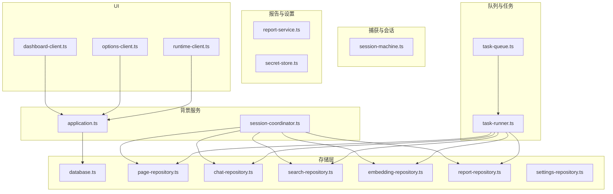
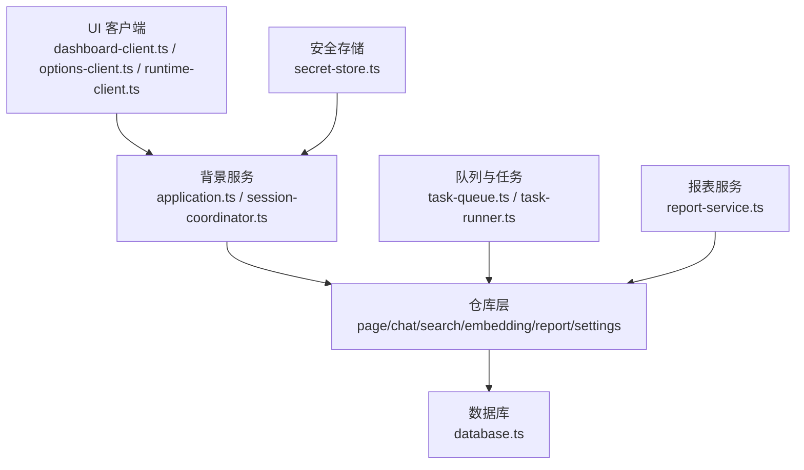
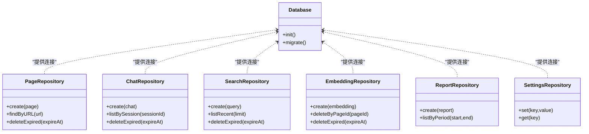
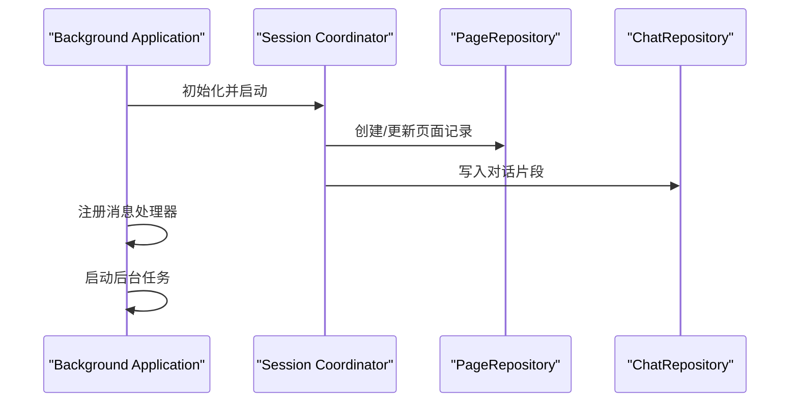
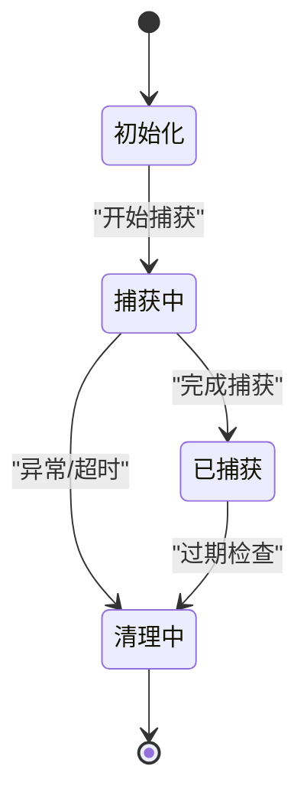
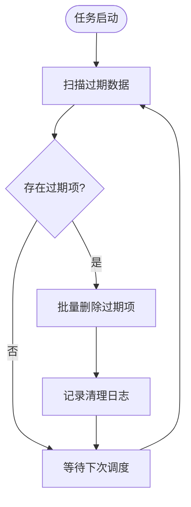
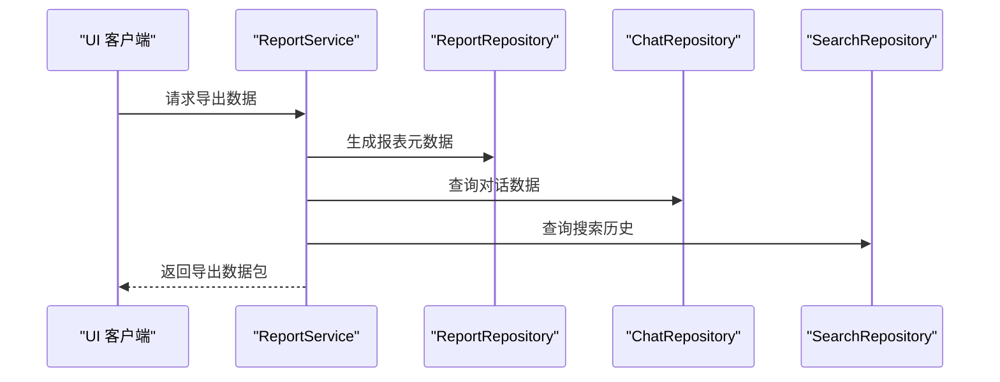
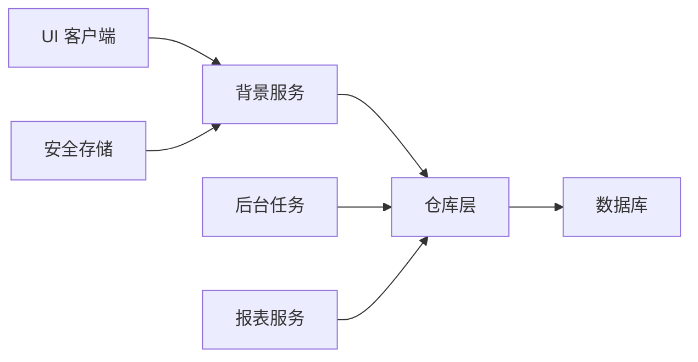

# 数据生命周期管理

<cite>
**本文引用的文件**
- [src/storage/database.ts](file://src/storage/database.ts)
- [src/storage/page-repository.ts](file://src/storage/page-repository.ts)
- [src/storage/chat-repository.ts](file://src/storage/chat-repository.ts)
- [src/storage/search-repository.ts](file://src/storage/search-repository.ts)
- [src/storage/embedding-repository.ts](file://src/storage/embedding-repository.ts)
- [src/storage/report-repository.ts](file://src/storage/report-repository.ts)
- [src/storage/settings-repository.ts](file://src/storage/settings-repository.ts)
- [src/background/application.ts](file://src/background/application.ts)
- [src/background/session-coordinator.ts](file://src/background/session-coordinator.ts)
- [src/capture/session-machine.ts](file://src/capture/session-machine.ts)
- [src/shared/constants.ts](file://src/shared/constants.ts)
- [src/shared/types.ts](file://src/shared/types.ts)
- [src/reports/report-service.ts](file://src/reports/report-service.ts)
- [src/queue/task-queue.ts](file://src/queue/task-queue.ts)
- [src/queue/task-runner.ts](file://src/queue/task-runner.ts)
- [src/security/secret-store.ts](file://src/security/secret-store.ts)
- [src/ui/dashboard-client.ts](file://src/ui/dashboard-client.ts)
- [src/ui/options-client.ts](file://src/ui/options-client.ts)
- [src/ui/runtime-client.ts](file://src/ui/runtime-client.ts)
- [README.md](file://README.md)
</cite>

## 目录
1. [简介](#简介)
2. [项目结构](#项目结构)
3. [核心组件](#核心组件)
4. [架构总览](#架构总览)
5. [详细组件分析](#详细组件分析)
6. [依赖关系分析](#依赖关系分析)
7. [性能考量](#性能考量)
8. [故障排查指南](#故障排查指南)
9. [结论](#结论)
10. [附录](#附录)

## 简介
本文件系统性梳理 BrowseMemory 的数据生命周期管理方案，覆盖数据从创建、存储、过期与自动清理，到销毁与导出的全链路设计。重点说明页面内容、用户对话、搜索历史、AI 生成内容等不同数据类型的保留策略；阐述备份与恢复机制（含迁移场景）；明确手动删除、自动清理与批量删除的实现路径；给出数据导出能力与格式建议；总结压缩与存储优化策略，并提供最佳实践与用户指导。

## 项目结构
围绕数据生命周期管理的关键模块主要分布在以下位置：
- 存储层：数据库初始化与各仓库（Repository）封装
- 背景服务：应用生命周期与会话协调
- 捕获与会话：页面捕获状态机
- 队列与任务：后台清理与维护任务
- 报告与设置：报表生成与用户设置
- 安全：密钥与敏感信息存储
- UI：仪表盘、选项页与运行时客户端

图表来源
- [src/storage/database.ts](file://src/storage/database.ts)
- [src/storage/page-repository.ts](file://src/storage/page-repository.ts)
- [src/storage/chat-repository.ts](file://src/storage/chat-repository.ts)
- [src/storage/search-repository.ts](file://src/storage/search-repository.ts)
- [src/storage/embedding-repository.ts](file://src/storage/embedding-repository.ts)
- [src/storage/report-repository.ts](file://src/storage/report-repository.ts)
- [src/storage/settings-repository.ts](file://src/storage/settings-repository.ts)
- [src/background/application.ts](file://src/background/application.ts)
- [src/background/session-coordinator.ts](file://src/background/session-coordinator.ts)
- [src/capture/session-machine.ts](file://src/capture/session-machine.ts)
- [src/queue/task-queue.ts](file://src/queue/task-queue.ts)
- [src/queue/task-runner.ts](file://src/queue/task-runner.ts)
- [src/reports/report-service.ts](file://src/reports/report-service.ts)
- [src/security/secret-store.ts](file://src/security/secret-store.ts)
- [src/ui/dashboard-client.ts](file://src/ui/dashboard-client.ts)
- [src/ui/options-client.ts](file://src/ui/options-client.ts)
- [src/ui/runtime-client.ts](file://src/ui/runtime-client.ts)

章节来源
- [src/storage/database.ts](file://src/storage/database.ts)
- [src/storage/page-repository.ts](file://src/storage/page-repository.ts)
- [src/storage/chat-repository.ts](file://src/storage/chat-repository.ts)
- [src/storage/search-repository.ts](file://src/storage/search-repository.ts)
- [src/storage/embedding-repository.ts](file://src/storage/embedding-repository.ts)
- [src/storage/report-repository.ts](file://src/storage/report-repository.ts)
- [src/storage/settings-repository.ts](file://src/storage/settings-repository.ts)
- [src/background/application.ts](file://src/background/application.ts)
- [src/background/session-coordinator.ts](file://src/background/session-coordinator.ts)
- [src/capture/session-machine.ts](file://src/capture/session-machine.ts)
- [src/queue/task-queue.ts](file://src/queue/task-queue.ts)
- [src/queue/task-runner.ts](file://src/queue/task-runner.ts)
- [src/reports/report-service.ts](file://src/reports/report-service.ts)
- [src/security/secret-store.ts](file://src/security/secret-store.ts)
- [src/ui/dashboard-client.ts](file://src/ui/dashboard-client.ts)
- [src/ui/options-client.ts](file://src/ui/options-client.ts)
- [src/ui/runtime-client.ts](file://src/ui/runtime-client.ts)

## 核心组件
- 数据库与仓库：统一通过数据库初始化与各领域仓库进行 CRUD 操作，确保数据一致性与可维护性。
- 背景应用与会话协调：负责应用启动、会话状态管理与跨模块调度。
- 捕获与会话状态机：控制页面捕获流程与状态转换，影响页面内容的创建与更新。
- 队列与任务执行器：承载定时清理、索引维护、嵌入向量处理等后台任务。
- 报告与设置：生成报表与持久化用户设置，支撑数据导出与恢复。
- 安全存储：集中管理密钥与敏感配置，保障数据安全。
- UI 客户端：提供用户交互入口，触发数据管理动作。

章节来源
- [src/storage/database.ts](file://src/storage/database.ts)
- [src/storage/page-repository.ts](file://src/storage/page-repository.ts)
- [src/storage/chat-repository.ts](file://src/storage/chat-repository.ts)
- [src/storage/search-repository.ts](file://src/storage/search-repository.ts)
- [src/storage/embedding-repository.ts](file://src/storage/embedding-repository.ts)
- [src/storage/report-repository.ts](file://src/storage/report-repository.ts)
- [src/storage/settings-repository.ts](file://src/storage/settings-repository.ts)
- [src/background/application.ts](file://src/background/application.ts)
- [src/background/session-coordinator.ts](file://src/background/session-coordinator.ts)
- [src/capture/session-machine.ts](file://src/capture/session-machine.ts)
- [src/queue/task-queue.ts](file://src/queue/task-queue.ts)
- [src/queue/task-runner.ts](file://src/queue/task-runner.ts)
- [src/reports/report-service.ts](file://src/reports/report-service.ts)
- [src/security/secret-store.ts](file://src/security/secret-store.ts)
- [src/ui/dashboard-client.ts](file://src/ui/dashboard-client.ts)
- [src/ui/options-client.ts](file://src/ui/options-client.ts)
- [src/ui/runtime-client.ts](file://src/ui/runtime-client.ts)

## 架构总览
下图展示数据生命周期管理的整体架构：UI 触发操作 → 背景服务协调 → 仓库持久化 → 后台任务执行清理 → 报表与设置辅助恢复与导出。

图表来源
- [src/ui/dashboard-client.ts](file://src/ui/dashboard-client.ts)
- [src/ui/options-client.ts](file://src/ui/options-client.ts)
- [src/ui/runtime-client.ts](file://src/ui/runtime-client.ts)
- [src/background/application.ts](file://src/background/application.ts)
- [src/background/session-coordinator.ts](file://src/background/session-coordinator.ts)
- [src/storage/page-repository.ts](file://src/storage/page-repository.ts)
- [src/storage/chat-repository.ts](file://src/storage/chat-repository.ts)
- [src/storage/search-repository.ts](file://src/storage/search-repository.ts)
- [src/storage/embedding-repository.ts](file://src/storage/embedding-repository.ts)
- [src/storage/report-repository.ts](file://src/storage/report-repository.ts)
- [src/storage/settings-repository.ts](file://src/storage/settings-repository.ts)
- [src/storage/database.ts](file://src/storage/database.ts)
- [src/queue/task-queue.ts](file://src/queue/task-queue.ts)
- [src/queue/task-runner.ts](file://src/queue/task-runner.ts)
- [src/reports/report-service.ts](file://src/reports/report-service.ts)
- [src/security/secret-store.ts](file://src/security/secret-store.ts)

## 详细组件分析

### 数据库与仓库层
- 数据库初始化：集中定义数据库版本、对象存储（OS）模式与迁移策略，确保数据模型演进与兼容。
- 仓库职责：按领域拆分（页面、对话、搜索、嵌入、报表、设置），每个仓库封装 CRUD 与查询方法，屏蔽底层存储细节。
- 过期与清理：仓库层提供基于时间戳的过期查询与删除接口，配合后台任务执行自动清理。

图表来源
- [src/storage/database.ts](file://src/storage/database.ts)
- [src/storage/page-repository.ts](file://src/storage/page-repository.ts)
- [src/storage/chat-repository.ts](file://src/storage/chat-repository.ts)
- [src/storage/search-repository.ts](file://src/storage/search-repository.ts)
- [src/storage/embedding-repository.ts](file://src/storage/embedding-repository.ts)
- [src/storage/report-repository.ts](file://src/storage/report-repository.ts)
- [src/storage/settings-repository.ts](file://src/storage/settings-repository.ts)

章节来源
- [src/storage/database.ts](file://src/storage/database.ts)
- [src/storage/page-repository.ts](file://src/storage/page-repository.ts)
- [src/storage/chat-repository.ts](file://src/storage/chat-repository.ts)
- [src/storage/search-repository.ts](file://src/storage/search-repository.ts)
- [src/storage/embedding-repository.ts](file://src/storage/embedding-repository.ts)
- [src/storage/report-repository.ts](file://src/storage/report-repository.ts)
- [src/storage/settings-repository.ts](file://src/storage/settings-repository.ts)

### 背景应用与会话协调
- 应用启动：初始化数据库、注册消息处理器、启动后台任务与会话协调器。
- 会话协调：根据页面捕获状态机推进会话生命周期，驱动仓库写入与清理策略。

图表来源
- [src/background/application.ts](file://src/background/application.ts)
- [src/background/session-coordinator.ts](file://src/background/session-coordinator.ts)
- [src/storage/page-repository.ts](file://src/storage/page-repository.ts)
- [src/storage/chat-repository.ts](file://src/storage/chat-repository.ts)

章节来源
- [src/background/application.ts](file://src/background/application.ts)
- [src/background/session-coordinator.ts](file://src/background/session-coordinator.ts)

### 页面捕获与会话状态机
- 状态机：定义页面捕获的状态流转，决定何时创建、更新与标记过期页面。
- 与仓库协作：状态变更触发仓库写入与清理逻辑，确保只保留有效页面内容。

图表来源
- [src/capture/session-machine.ts](file://src/capture/session-machine.ts)

章节来源
- [src/capture/session-machine.ts](file://src/capture/session-machine.ts)

### 后台任务与自动清理
- 任务队列：统一的任务调度与优先级管理。
- 任务执行器：周期性扫描过期数据并删除，释放存储空间，维持系统性能。

图表来源
- [src/queue/task-queue.ts](file://src/queue/task-queue.ts)
- [src/queue/task-runner.ts](file://src/queue/task-runner.ts)

章节来源
- [src/queue/task-queue.ts](file://src/queue/task-queue.ts)
- [src/queue/task-runner.ts](file://src/queue/task-runner.ts)

### 报表与数据导出
- 报表服务：按时间段生成数据报表，支持导出为标准格式。
- 导出能力：UI 提供导出入口，结合报表服务输出用户数据集合。

图表来源
- [src/reports/report-service.ts](file://src/reports/report-service.ts)
- [src/storage/report-repository.ts](file://src/storage/report-repository.ts)
- [src/storage/chat-repository.ts](file://src/storage/chat-repository.ts)
- [src/storage/search-repository.ts](file://src/storage/search-repository.ts)

章节来源
- [src/reports/report-service.ts](file://src/reports/report-service.ts)
- [src/storage/report-repository.ts](file://src/storage/report-repository.ts)
- [src/storage/chat-repository.ts](file://src/storage/chat-repository.ts)
- [src/storage/search-repository.ts](file://src/storage/search-repository.ts)

### 安全与密钥管理
- 密钥存储：集中管理扩展密钥与敏感配置，避免硬编码与泄露风险。
- 数据访问控制：限制对敏感数据的读写范围，配合权限模型与审计日志。

章节来源
- [src/security/secret-store.ts](file://src/security/secret-store.ts)

## 依赖关系分析
- 低耦合高内聚：仓库层按领域隔离，减少跨模块依赖。
- 单一数据源：数据库作为唯一可信源，所有写入与清理均通过仓库层进行。
- 异步清理：后台任务与会话协调解耦，提升响应性与稳定性。

图表来源
- [src/ui/dashboard-client.ts](file://src/ui/dashboard-client.ts)
- [src/ui/options-client.ts](file://src/ui/options-client.ts)
- [src/ui/runtime-client.ts](file://src/ui/runtime-client.ts)
- [src/background/application.ts](file://src/background/application.ts)
- [src/storage/page-repository.ts](file://src/storage/page-repository.ts)
- [src/storage/chat-repository.ts](file://src/storage/chat-repository.ts)
- [src/storage/search-repository.ts](file://src/storage/search-repository.ts)
- [src/storage/embedding-repository.ts](file://src/storage/embedding-repository.ts)
- [src/storage/report-repository.ts](file://src/storage/report-repository.ts)
- [src/storage/settings-repository.ts](file://src/storage/settings-repository.ts)
- [src/storage/database.ts](file://src/storage/database.ts)
- [src/queue/task-queue.ts](file://src/queue/task-queue.ts)
- [src/queue/task-runner.ts](file://src/queue/task-runner.ts)
- [src/reports/report-service.ts](file://src/reports/report-service.ts)
- [src/security/secret-store.ts](file://src/security/secret-store.ts)

章节来源
- [src/ui/dashboard-client.ts](file://src/ui/dashboard-client.ts)
- [src/ui/options-client.ts](file://src/ui/options-client.ts)
- [src/ui/runtime-client.ts](file://src/ui/runtime-client.ts)
- [src/background/application.ts](file://src/background/application.ts)
- [src/storage/page-repository.ts](file://src/storage/page-repository.ts)
- [src/storage/chat-repository.ts](file://src/storage/chat-repository.ts)
- [src/storage/search-repository.ts](file://src/storage/search-repository.ts)
- [src/storage/embedding-repository.ts](file://src/storage/embedding-repository.ts)
- [src/storage/report-repository.ts](file://src/storage/report-repository.ts)
- [src/storage/settings-repository.ts](file://src/storage/settings-repository.ts)
- [src/storage/database.ts](file://src/storage/database.ts)
- [src/queue/task-queue.ts](file://src/queue/task-queue.ts)
- [src/queue/task-runner.ts](file://src/queue/task-runner.ts)
- [src/reports/report-service.ts](file://src/reports/report-service.ts)
- [src/security/secret-store.ts](file://src/security/secret-store.ts)

## 性能考量
- 存储优化：采用对象存储与索引策略，减少查询开销；定期清理过期数据，控制表规模。
- 压缩策略：对大字段（如页面内容摘要）启用压缩，降低磁盘占用。
- 并发控制：后台任务串行化执行，避免写放大；必要时引入批处理与限流。
- 缓存与预热：对高频读取数据建立缓存层，缩短响应时间。

## 故障排查指南
- 数据未清理：检查后台任务是否正常运行，确认过期阈值与时间戳字段正确。
- 导出失败：验证报表服务可用性与仓库查询权限，检查导出格式与大小限制。
- 数据不一致：核对数据库迁移脚本与仓库写入事务，确保原子性。
- 安全问题：审查密钥存储与访问日志，防止未授权访问。

章节来源
- [src/queue/task-runner.ts](file://src/queue/task-runner.ts)
- [src/reports/report-service.ts](file://src/reports/report-service.ts)
- [src/storage/database.ts](file://src/storage/database.ts)
- [src/security/secret-store.ts](file://src/security/secret-store.ts)

## 结论
BrowseMemory 的数据生命周期管理以“仓库层 + 背景服务 + 后台任务”为核心，实现了页面内容、对话、搜索历史与 AI 生成内容的有序存储与自动清理。通过报表与设置模块支撑导出与恢复，配合安全存储与权限控制，形成完整的数据全生命周期闭环。建议在生产环境中持续监控清理效果与导出质量，并根据业务增长迭代过期策略与压缩算法。

## 附录

### 数据类型与保留期限
- 页面内容：按会话与过期策略保留，超期自动清理。
- 用户对话：按会话 ID 分组，支持按会话或全局清理。
- 搜索历史：按最近使用时间保留，定期清理过期条目。
- AI 生成内容：与对话关联，随对话清理策略同步处理。

章节来源
- [src/storage/page-repository.ts](file://src/storage/page-repository.ts)
- [src/storage/chat-repository.ts](file://src/storage/chat-repository.ts)
- [src/storage/search-repository.ts](file://src/storage/search-repository.ts)
- [src/storage/embedding-repository.ts](file://src/storage/embedding-repository.ts)

### 备份与恢复机制
- 备份：通过报表服务生成数据快照，包含页面、对话、搜索与设置。
- 恢复：在新环境导入快照，重建数据库与仓库数据；迁移时保持版本兼容。

章节来源
- [src/reports/report-service.ts](file://src/reports/report-service.ts)
- [src/storage/report-repository.ts](file://src/storage/report-repository.ts)
- [src/storage/settings-repository.ts](file://src/storage/settings-repository.ts)

### 删除功能实现
- 手动删除：UI 提供选择性删除入口，调用对应仓库删除接口。
- 自动清理：后台任务按过期策略批量删除，保证系统整洁。
- 批量删除：支持按会话、按日期区间或全量清理，兼顾效率与安全。

章节来源
- [src/ui/dashboard-client.ts](file://src/ui/dashboard-client.ts)
- [src/ui/options-client.ts](file://src/ui/options-client.ts)
- [src/queue/task-runner.ts](file://src/queue/task-runner.ts)

### 数据导出
- 导出入口：UI 提供导出按钮，触发报表服务生成数据包。
- 数据格式：建议采用结构化格式（如 JSON/CSV），包含元数据与正文摘要。
- 导出范围：支持全量导出与按会话/时间范围导出。

章节来源
- [src/ui/dashboard-client.ts](file://src/ui/dashboard-client.ts)
- [src/reports/report-service.ts](file://src/reports/report-service.ts)

### 压缩与存储优化
- 字段压缩：对长文本摘要启用压缩，降低存储成本。
- 索引优化：为常用查询字段建立索引，提升检索性能。
- 批处理：后台任务采用批处理方式，减少频繁写入带来的抖动。

章节来源
- [src/storage/page-repository.ts](file://src/storage/page-repository.ts)
- [src/storage/chat-repository.ts](file://src/storage/chat-repository.ts)
- [src/queue/task-runner.ts](file://src/queue/task-runner.ts)

### 最佳实践与用户指导
- 定期清理：建议用户定期清理过期页面与对话，释放空间。
- 导出备份：重要会话与搜索历史建议定期导出，防止意外丢失。
- 设置管理：通过设置模块调整保留天数与清理频率，平衡性能与数据完整性。
- 安全意识：不要导出或分享包含敏感信息的数据，注意传输与存储安全。

章节来源
- [src/ui/options-client.ts](file://src/ui/options-client.ts)
- [src/storage/settings-repository.ts](file://src/storage/settings-repository.ts)
- [src/security/secret-store.ts](file://src/security/secret-store.ts)