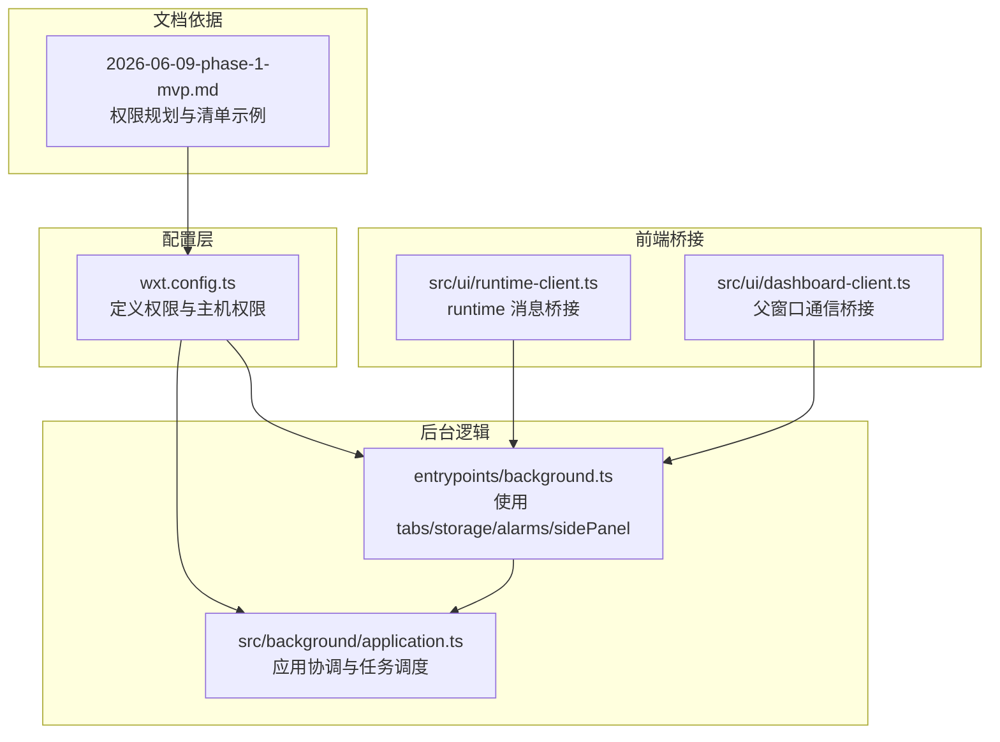
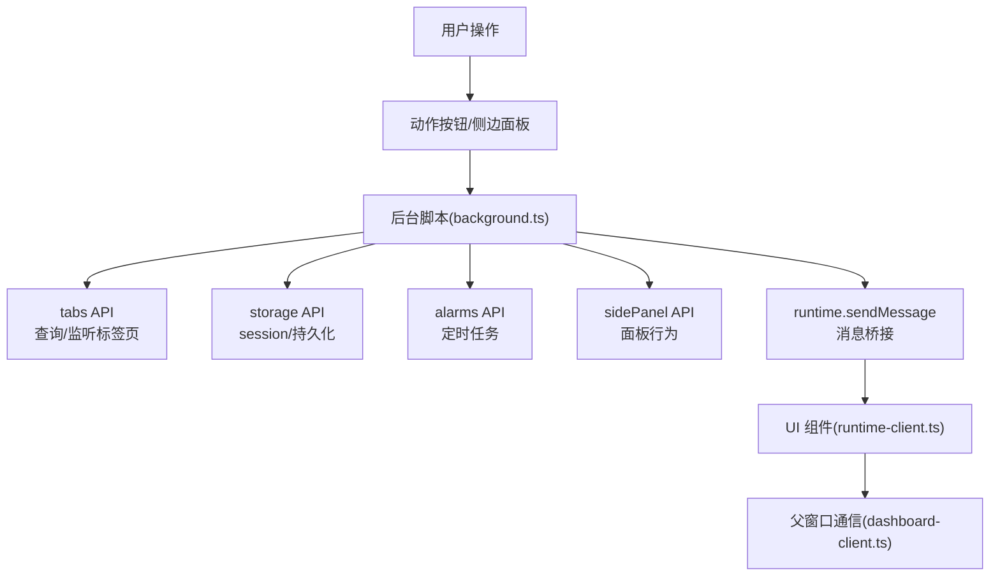
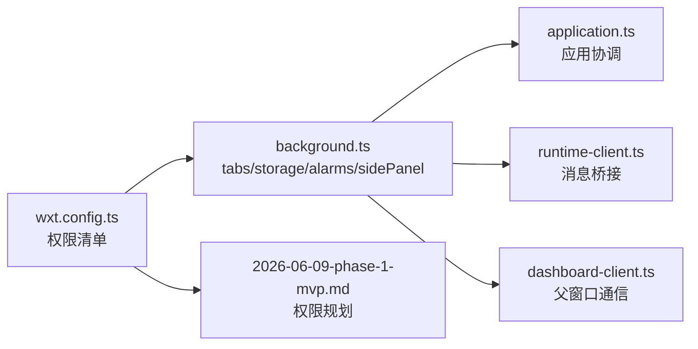
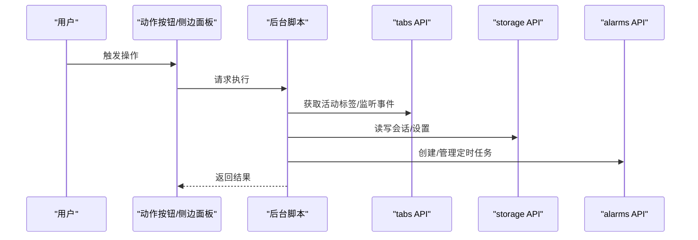

# 权限管理

<cite>
**本文引用的文件**
- [wxt.config.ts](file://wxt.config.ts)
- [background.ts](file://entrypoints/background.ts)
- [application.ts](file://src/background/application.ts)
- [runtime-client.ts](file://src/ui/runtime-client.ts)
- [dashboard-client.ts](file://src/ui/dashboard-client.ts)
- [url-policy.test.ts](file://tests/shared/url-policy.test.ts)
- [2026-06-09-phase-1-mvp.md](file://docs/superpowers/plans/2026-06-09-phase-1-mvp.md)
</cite>

## 目录
1. [引言](#引言)
2. [项目结构](#项目结构)
3. [核心组件](#核心组件)
4. [架构总览](#架构总览)
5. [详细组件分析](#详细组件分析)
6. [依赖分析](#依赖分析)
7. [性能考虑](#性能考虑)
8. [故障排查指南](#故障排查指南)
9. [结论](#结论)
10. [附录](#附录)

## 引言
本文件聚焦于 BrowseMemory 的权限管理体系，系统阐述 Chrome 扩展权限申请的最小化原则，并结合代码库实际配置与使用场景，逐项解释当前已授权权限（如 tabs、activeTab、storage、alarms、sidePanel）的必要性与作用；同时明确说明未授予历史记录、Cookie 访问与网络请求权限的原因（隐私保护与功能实现考量），并给出权限变更影响评估、最佳实践、隐身模式差异与用户隐私保护机制，以及面向开发者的权限审查清单与安全检查指导。

## 项目结构
围绕权限管理的关键文件与职责如下：
- 配置层：wxt.config.ts 定义扩展清单权限与主机权限
- 后台逻辑：entrypoints/background.ts 使用 tabs、storage、alarms、sidePanel 能力
- 应用层：src/background/application.ts 协调后台任务与存储交互
- 前端桥接：src/ui/runtime-client.ts、src/ui/dashboard-client.ts 通过 runtime 消息与父窗口通信
- 文档依据：docs/superpowers/plans/2026-06-09-phase-1-mvp.md 明确了初始权限规划

图表来源
- [wxt.config.ts:1-18](file://wxt.config.ts#L1-L18)
- [background.ts:154-194](file://entrypoints/background.ts#L154-L194)
- [application.ts:13-20](file://src/background/application.ts#L13-L20)
- [runtime-client.ts:129-181](file://src/ui/runtime-client.ts#L129-L181)
- [dashboard-client.ts:44-77](file://src/ui/dashboard-client.ts#L44-L77)
- [2026-06-09-phase-1-mvp.md:72-80](file://docs/superpowers/plans/2026-06-09-phase-1-mvp.md#L72-L80)

章节来源
- [wxt.config.ts:1-18](file://wxt.config.ts#L1-L18)
- [background.ts:154-194](file://entrypoints/background.ts#L154-L194)
- [application.ts:13-20](file://src/background/application.ts#L13-L20)
- [runtime-client.ts:129-181](file://src/ui/runtime-client.ts#L129-L181)
- [dashboard-client.ts:44-77](file://src/ui/dashboard-client.ts#L44-L77)
- [2026-06-09-phase-1-mvp.md:72-80](file://docs/superpowers/plans/2026-06-09-phase-1-mvp.md#L72-L80)

## 核心组件
- 权限清单与主机权限
  - 当前清单包含：tabs、activeTab、storage、alarms、sidePanel
  - 主机权限：<all_urls>
- 权限使用点
  - tabs：查询活动标签页、监听标签页激活/移除事件
  - storage：会话存储、持久化设置与数据
  - alarms：心跳、清理、嵌入与报告定时任务
  - sidePanel：控制侧边面板行为
  - runtime 消息：前后端通信与错误回传
  - 父窗口通信：仪表盘客户端桥接

章节来源
- [wxt.config.ts:9-10](file://wxt.config.ts#L9-L10)
- [background.ts:154-194](file://entrypoints/background.ts#L154-L194)
- [runtime-client.ts:64-73](file://src/ui/runtime-client.ts#L64-L73)
- [dashboard-client.ts:44-58](file://src/ui/dashboard-client.ts#L44-L58)

## 架构总览
下图展示权限在系统中的流转与使用关系：

图表来源
- [background.ts:154-194](file://entrypoints/background.ts#L154-L194)
- [runtime-client.ts:129-181](file://src/ui/runtime-client.ts#L129-L181)
- [dashboard-client.ts:44-77](file://src/ui/dashboard-client.ts#L44-L77)

## 详细组件分析

### 权限最小化原则与现状
- 最小化原则：仅授予实现功能所必需的权限，避免过度授权
- 现状说明：当前清单与使用点均围绕“本地浏览记忆”这一目标展开，不涉及历史记录、Cookie 访问或跨站网络请求权限

章节来源
- [wxt.config.ts:9-10](file://wxt.config.ts#L9-L10)
- [background.ts:154-194](file://entrypoints/background.ts#L154-L194)

### 不需要历史记录权限的原因
- 功能定位：BrowseMemory 专注于对本地页面内容进行检索与摘要，而非访问浏览器历史
- 实现方式：通过 activeTab 与 tabs 查询当前活动标签页内容，无需历史记录权限
- 隐私保护：避免读取用户浏览历史，降低隐私风险

章节来源
- [background.ts:154-160](file://entrypoints/background.ts#L154-L160)
- [wxt.config.ts:9](file://wxt.config.ts#L9)

### 不需要 Cookie 访问权限的原因
- 数据来源：页面内容提取与检索基于当前页面可见内容，不涉及 Cookie 读写
- 隐私保护：避免访问或修改站点 Cookie，防止潜在隐私与安全风险

章节来源
- [background.ts:154-160](file://entrypoints/background.ts#L154-L160)

### 不需要网络请求权限的原因
- 功能边界：扩展内不发起跨站网络请求，所有 AI 服务调用由后端或云端完成，扩展仅负责本地内容与消息桥接
- 隐私保护：避免扩展层面的网络访问，减少数据泄露面

章节来源
- [runtime-client.ts:129-181](file://src/ui/runtime-client.ts#L129-L181)
- [dashboard-client.ts:44-77](file://src/ui/dashboard-client.ts#L44-L77)

### 已授权权限详解
- tabs
  - 用途：获取活动标签页信息、监听标签页激活与关闭事件，驱动会话切换与清理
  - 使用点：查询活动标签、事件监听器注册
- storage
  - 用途：会话存储与持久化设置，支撑应用状态与用户偏好
  - 使用点：会话键值存取、设置持久化
- alarms
  - 用途：周期性任务（心跳、清理、嵌入、报告）
  - 使用点：创建多个定时器，按分钟级调度
- sidePanel
  - 用途：控制侧边面板打开行为，提升用户体验
  - 使用点：设置面板行为
- activeTab
  - 用途：按需访问当前活动标签页，满足页面内容提取与交互
  - 使用点：转换活动标签对象、触发会话切换

章节来源
- [background.ts:154-194](file://entrypoints/background.ts#L154-L194)
- [wxt.config.ts:9](file://wxt.config.ts#L9)

### 权限变更影响评估
- 升级策略
  - 新版本若需新增权限，应先在文档中明确变更原因与必要性
  - 通过配置层（wxt.config.ts）更新权限清单，并在后台脚本中补充对应使用点
  - 在 UI 层（runtime-client.ts、dashboard-client.ts）同步消息协议与错误处理
- 影响范围
  - 用户授权弹窗与信任度：权限增加可能引发用户对隐私的担忧
  - 功能可用性：缺少权限将导致相应功能不可用，需提供降级提示
  - 测试覆盖：新增权限需完善单元测试与集成测试

章节来源
- [wxt.config.ts:1-18](file://wxt.config.ts#L1-L18)
- [runtime-client.ts:64-73](file://src/ui/runtime-client.ts#L64-L73)
- [dashboard-client.ts:44-58](file://src/ui/dashboard-client.ts#L44-L58)

### 隐身模式下的权限处理差异
- 隐身模式限制
  - 隐身模式下，某些存储 API 可能受限或不可用，需在后台脚本中进行条件判断与降级处理
- 隐私保护机制
  - 不读取历史、不访问 Cookie、不发起网络请求，天然符合隐身模式的隐私要求
  - 对 URL 支持与阻断的策略（仅支持普通网页，阻断特殊协议）进一步降低风险

章节来源
- [background.ts:154-194](file://entrypoints/background.ts#L154-L194)
- [url-policy.test.ts:26-34](file://tests/shared/url-policy.test.ts#L26-L34)

### 权限配置最佳实践
- 最小化原则
  - 仅授予实现功能所必需的权限，避免一次性授予过多权限
- 明确用途
  - 在配置与注释中清晰说明每个权限的用途与边界
- 透明与可审计
  - 将权限清单与使用点纳入文档与测试，便于审查与回归验证
- 渐进式授权
  - 新功能优先采用现有权限组合实现，必要时再申请新权限
- 隐私优先
  - 不访问历史、Cookie 或发起网络请求，避免不必要的数据暴露

章节来源
- [wxt.config.ts:9-10](file://wxt.config.ts#L9-L10)
- [background.ts:154-194](file://entrypoints/background.ts#L154-L194)
- [url-policy.test.ts:26-34](file://tests/shared/url-policy.test.ts#L26-L34)

### 开发者权限审查清单与安全检查
- 审查清单
  - 是否存在历史记录访问？是否可以改用 activeTab/tabs？
  - 是否存在 Cookie 读写？是否可以避免？
  - 是否存在网络请求？是否必须由扩展发起？
  - storage 使用是否遵循最小化与加密策略？
  - alarms 是否合理且无资源泄漏风险？
  - sidePanel 行为是否符合用户预期？
- 安全检查
  - URL 支持与阻断策略是否覆盖特殊协议与不受支持页面
  - runtime 消息是否包含错误回传与超时处理
  - 父窗口通信是否限定来源与协议

章节来源
- [runtime-client.ts:64-73](file://src/ui/runtime-client.ts#L64-L73)
- [dashboard-client.ts:44-58](file://src/ui/dashboard-client.ts#L44-L58)
- [url-policy.test.ts:10-40](file://tests/shared/url-policy.test.ts#L10-L40)

## 依赖分析
权限之间的耦合与依赖关系如下：

图表来源
- [wxt.config.ts:1-18](file://wxt.config.ts#L1-L18)
- [background.ts:154-194](file://entrypoints/background.ts#L154-L194)
- [application.ts:13-20](file://src/background/application.ts#L13-L20)
- [runtime-client.ts:129-181](file://src/ui/runtime-client.ts#L129-L181)
- [dashboard-client.ts:44-77](file://src/ui/dashboard-client.ts#L44-L77)
- [2026-06-09-phase-1-mvp.md:72-80](file://docs/superpowers/plans/2026-06-09-phase-1-mvp.md#L72-L80)

章节来源
- [wxt.config.ts:1-18](file://wxt.config.ts#L1-L18)
- [background.ts:154-194](file://entrypoints/background.ts#L154-L194)
- [application.ts:13-20](file://src/background/application.ts#L13-L20)
- [runtime-client.ts:129-181](file://src/ui/runtime-client.ts#L129-L181)
- [dashboard-client.ts:44-77](file://src/ui/dashboard-client.ts#L44-L77)
- [2026-06-09-phase-1-mvp.md:72-80](file://docs/superpowers/plans/2026-06-09-phase-1-mvp.md#L72-L80)

## 性能考虑
- 定时任务频率：心跳、清理、嵌入与报告的周期需平衡功能需求与资源消耗
- 存储访问：会话存储与持久化应避免频繁读写，建议批量或节流
- 事件监听：仅在需要时注册标签页事件监听器，避免常驻开销

## 故障排查指南
- 权限不足
  - 症状：功能不可用或报错
  - 排查：确认权限清单与使用点是否匹配，检查后台脚本中的 API 调用
- 运行时消息失败
  - 症状：UI 无响应或超时
  - 排查：检查消息桥接与错误回传逻辑，确认父窗口通信协议
- 隐身模式异常
  - 症状：存储不可用或功能受限
  - 排查：在后台脚本中添加条件分支与降级处理

章节来源
- [runtime-client.ts:64-73](file://src/ui/runtime-client.ts#L64-L73)
- [dashboard-client.ts:44-58](file://src/ui/dashboard-client.ts#L44-L58)
- [background.ts:154-194](file://entrypoints/background.ts#L154-L194)

## 结论
BrowseMemory 的权限设计严格遵循最小化原则：仅授予实现本地页面记忆检索与摘要所必需的权限，避免历史记录、Cookie 访问与网络请求权限，从而在保障功能完整性的同时最大化用户隐私保护。通过清晰的权限清单、严格的使用点控制与完善的测试覆盖，系统在隐身模式与常规模式下均能稳健运行。未来任何权限变更都应遵循本文提供的审查清单与评估流程，确保透明、可控与可审计。

## 附录
- 权限使用流程示意

图表来源
- [background.ts:154-194](file://entrypoints/background.ts#L154-L194)