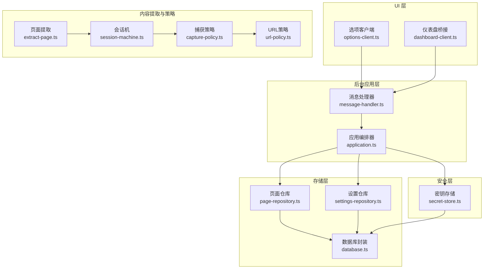
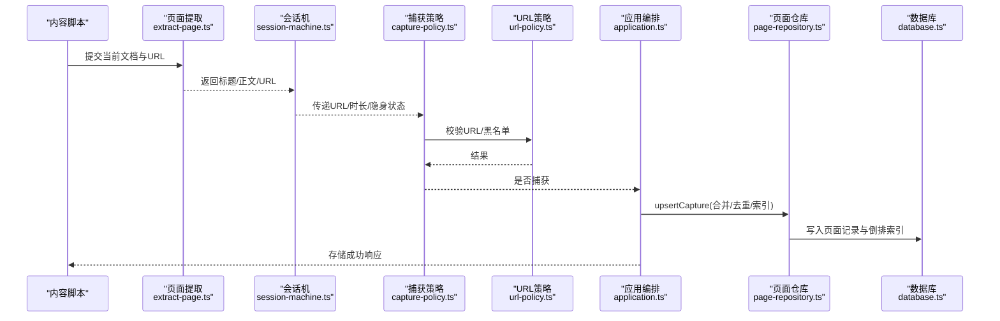
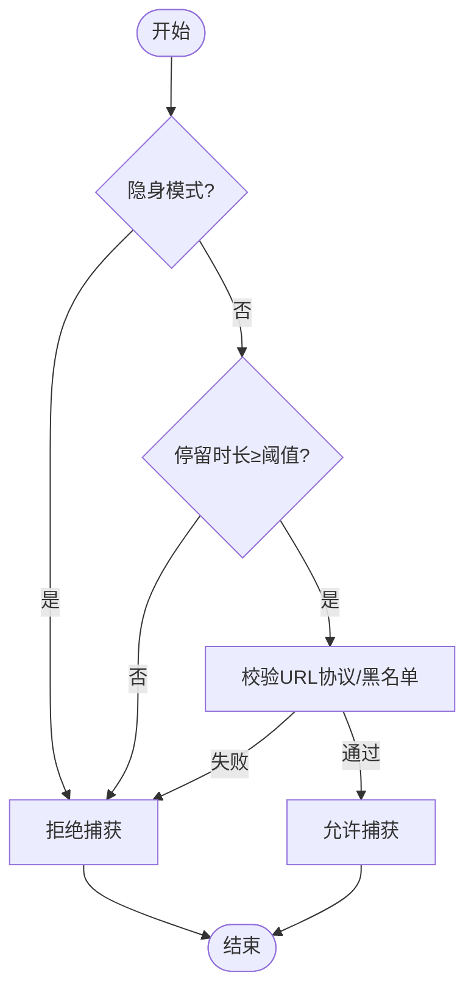
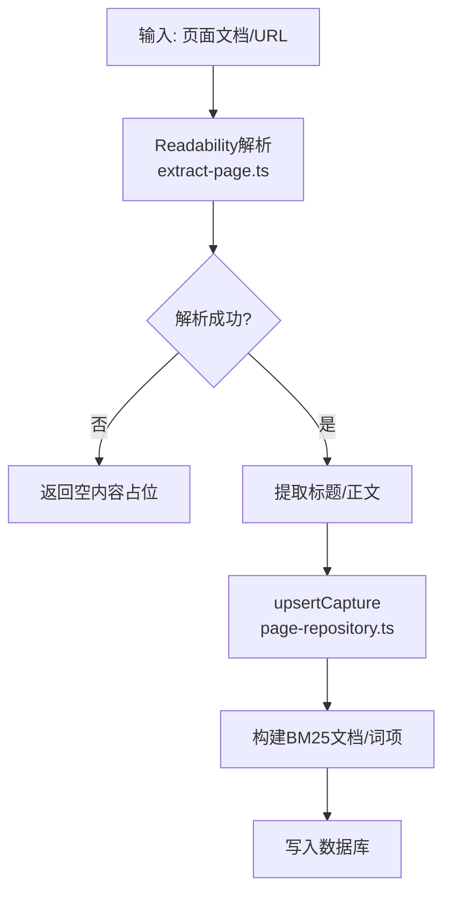
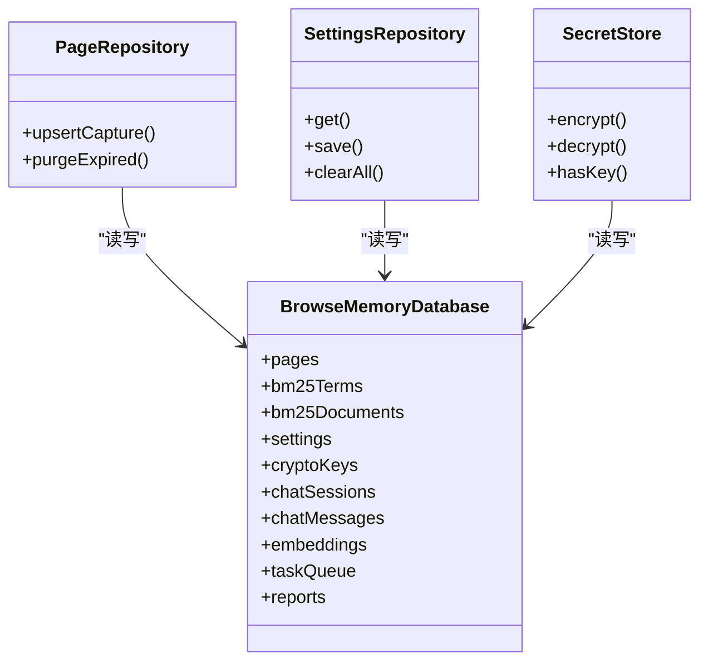
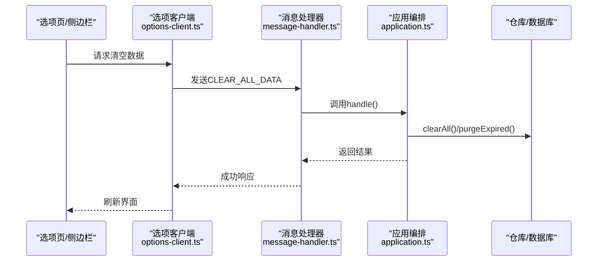
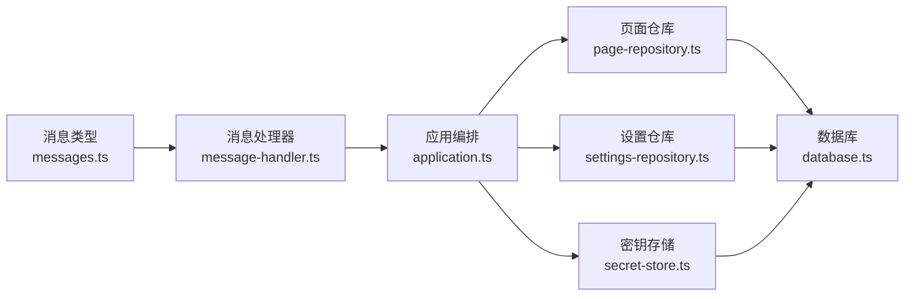

# 隐私保护策略

<cite>
**本文档引用的文件**
- [src/shared/url-policy.ts](file://src/shared/url-policy.ts)
- [src/capture/capture-policy.ts](file://src/capture/capture-policy.ts)
- [src/capture/session-machine.ts](file://src/capture/session-machine.ts)
- [src/extraction/extract-page.ts](file://src/extraction/extract-page.ts)
- [src/storage/page-repository.ts](file://src/storage/page-repository.ts)
- [src/storage/settings-repository.ts](file://src/storage/settings-repository.ts)
- [src/storage/database.ts](file://src/storage/database.ts)
- [src/security/secret-store.ts](file://src/security/secret-store.ts)
- [src/background/application.ts](file://src/background/application.ts)
- [src/background/message-handler.ts](file://src/background/message-handler.ts)
- [src/shared/messages.ts](file://src/shared/messages.ts)
- [src/shared/constants.ts](file://src/shared/constants.ts)
- [src/shared/types.ts](file://src/shared/types.ts)
- [src/ui/options-client.ts](file://src/ui/options-client.ts)
- [src/ui/dashboard-client.ts](file://src/ui/dashboard-client.ts)
</cite>

## 目录
1. [引言](#引言)
2. [项目结构](#项目结构)
3. [核心组件](#核心组件)
4. [架构总览](#架构总览)
5. [详细组件分析](#详细组件分析)
6. [依赖关系分析](#依赖关系分析)
7. [性能考量](#性能考量)
8. [故障排除指南](#故障排除指南)
9. [结论](#结论)
10. [附录](#附录)

## 引言
本隐私保护策略文档面向BrowseMemory项目，系统阐述其“本地化数据处理”“数据最小化收集”“URL过滤与页面捕获政策”“隐身模式下的数据处理机制”“用户对数据的完全控制权”“隐私设置配置指南”以及“与第三方服务的数据共享限制”。目标是帮助用户在尊重隐私的前提下，理解并安全地使用本扩展。

## 项目结构
BrowseMemory采用分层架构：UI层（选项页、侧边栏面板、仪表盘桥接）、后台应用层（消息处理、业务编排）、存储层（IndexedDB/Dexie封装）与安全层（端到端密钥与加密存储）。数据流从内容脚本提取页面信息，经会话机与捕获策略判定后写入本地数据库；检索与AI能力按需启用，且API密钥仅在本地加密存储。

图表来源
- [src/ui/options-client.ts:1-87](file://src/ui/options-client.ts#L1-L87)
- [src/ui/dashboard-client.ts:1-148](file://src/ui/dashboard-client.ts#L1-L148)
- [src/background/message-handler.ts:1-22](file://src/background/message-handler.ts#L1-L22)
- [src/background/application.ts:1-388](file://src/background/application.ts#L1-L388)
- [src/storage/database.ts:1-80](file://src/storage/database.ts#L1-L80)
- [src/storage/page-repository.ts:1-265](file://src/storage/page-repository.ts#L1-L265)
- [src/storage/settings-repository.ts:1-57](file://src/storage/settings-repository.ts#L1-L57)
- [src/security/secret-store.ts:1-70](file://src/security/secret-store.ts#L1-L70)
- [src/extraction/extract-page.ts:1-26](file://src/extraction/extract-page.ts#L1-L26)
- [src/capture/session-machine.ts:1-69](file://src/capture/session-machine.ts#L1-L69)
- [src/capture/capture-policy.ts:1-21](file://src/capture/capture-policy.ts#L1-L21)
- [src/shared/url-policy.ts:1-63](file://src/shared/url-policy.ts#L1-L63)

章节来源
- [src/ui/options-client.ts:1-87](file://src/ui/options-client.ts#L1-L87)
- [src/ui/dashboard-client.ts:1-148](file://src/ui/dashboard-client.ts#L1-L148)
- [src/background/message-handler.ts:1-22](file://src/background/message-handler.ts#L1-L22)
- [src/background/application.ts:1-388](file://src/background/application.ts#L1-L388)
- [src/storage/database.ts:1-80](file://src/storage/database.ts#L1-L80)
- [src/storage/page-repository.ts:1-265](file://src/storage/page-repository.ts#L1-L265)
- [src/storage/settings-repository.ts:1-57](file://src/storage/settings-repository.ts#L1-L57)
- [src/security/secret-store.ts:1-70](file://src/security/secret-store.ts#L1-L70)
- [src/extraction/extract-page.ts:1-26](file://src/extraction/extract-page.ts#L1-L26)
- [src/capture/session-machine.ts:1-69](file://src/capture/session-machine.ts#L1-L69)
- [src/capture/capture-policy.ts:1-21](file://src/capture/capture-policy.ts#L1-L21)
- [src/shared/url-policy.ts:1-63](file://src/shared/url-policy.ts#L1-L63)

## 核心组件
- URL策略与过滤：支持URL标准化、跟踪参数剔除、黑名单域名匹配，确保仅处理受支持协议与非阻断域名。
- 捕获策略：基于隐身模式、停留时长阈值、URL有效性与黑名单三要素判定是否捕获。
- 页面提取：使用可读性算法提取标题与正文文本，避免无关DOM节点。
- 本地存储与索引：以Dexie封装IndexedDB，建立BM25倒排索引，支持增量更新与过期清理。
- 设置与隐私：默认保留周期、黑名单、最小阅读时长等；支持一键清空全部数据。
- 加密存储：API密钥以本地加密形式保存，仅在运行时解密用于外部调用。
- 后台应用编排：统一处理UI请求、触发任务队列、执行检索与RAG回答、生成报告。

章节来源
- [src/shared/url-policy.ts:13-62](file://src/shared/url-policy.ts#L13-L62)
- [src/capture/capture-policy.ts:10-20](file://src/capture/capture-policy.ts#L10-L20)
- [src/extraction/extract-page.ts:9-25](file://src/extraction/extract-page.ts#L9-L25)
- [src/storage/page-repository.ts:46-103](file://src/storage/page-repository.ts#L46-L103)
- [src/storage/settings-repository.ts:8-55](file://src/storage/settings-repository.ts#L8-L55)
- [src/security/secret-store.ts:25-69](file://src/security/secret-store.ts#L25-L69)
- [src/background/application.ts:29-352](file://src/background/application.ts#L29-L352)

## 架构总览
下图展示从内容提取到本地存储与检索的整体流程，突出“本地化”“最小化”“可控性”的设计原则。

图表来源
- [src/extraction/extract-page.ts:9-25](file://src/extraction/extract-page.ts#L9-L25)
- [src/capture/session-machine.ts:15-69](file://src/capture/session-machine.ts#L15-L69)
- [src/capture/capture-policy.ts:10-20](file://src/capture/capture-policy.ts#L10-L20)
- [src/shared/url-policy.ts:13-62](file://src/shared/url-policy.ts#L13-L62)
- [src/background/application.ts:78-87](file://src/background/application.ts#L78-L87)
- [src/storage/page-repository.ts:46-103](file://src/storage/page-repository.ts#L46-L103)
- [src/storage/database.ts:34-76](file://src/storage/database.ts#L34-L76)

## 详细组件分析

### URL过滤与页面捕获政策
- 支持协议：仅接受http/https协议，其他协议直接拒绝。
- 跟踪参数剔除：自动移除常见跟踪参数与utm_前缀参数，降低指纹暴露风险。
- 黑名单域名：默认屏蔽银行、支付类及密码管理类站点，用户可自定义。
- 捕获条件：必须非隐身模式、停留时长达到阈值、URL有效且未命中黑名单。
- 影身模式：隐身状态下不进行任何捕获，确保浏览痕迹不落地。

图表来源
- [src/capture/capture-policy.ts:10-20](file://src/capture/capture-policy.ts#L10-L20)
- [src/shared/url-policy.ts:13-62](file://src/shared/url-policy.ts#L13-L62)

章节来源
- [src/shared/url-policy.ts:13-62](file://src/shared/url-policy.ts#L13-L62)
- [src/capture/capture-policy.ts:10-20](file://src/capture/capture-policy.ts#L10-L20)

### 页面内容提取与数据最小化
- 提取范围：仅提取标题与正文文本，去除冗余空白与不可读内容。
- 去重与合并：同日同一URL合并，累加阅读时长，避免重复存储。
- 索引构建：基于标题与正文构建词频，建立BM25文档与词项倒排，便于高效检索。
- 过期清理：按保留天数清理旧记录，同时维护倒排索引一致性。

图表来源
- [src/extraction/extract-page.ts:9-25](file://src/extraction/extract-page.ts#L9-L25)
- [src/storage/page-repository.ts:46-103](file://src/storage/page-repository.ts#L46-L103)

章节来源
- [src/extraction/extract-page.ts:9-25](file://src/extraction/extract-page.ts#L9-L25)
- [src/storage/page-repository.ts:46-103](file://src/storage/page-repository.ts#L46-L103)

### 数据生命周期与本地化存储
- 数据库版本化：Dexie定义多版本表结构，涵盖页面、倒排、设置、加密密钥、聊天、嵌入向量、任务队列与报告。
- 默认保留策略：默认保留90天，可由用户在设置中调整。
- 清理机制：过期记录内容清空并同步更新倒排索引，避免残留敏感信息。
- 全量清除：一键清空页面、倒排、设置、加密密钥、聊天、嵌入、任务与报告等所有数据。

图表来源
- [src/storage/database.ts:34-76](file://src/storage/database.ts#L34-L76)
- [src/storage/page-repository.ts:46-197](file://src/storage/page-repository.ts#L46-L197)
- [src/storage/settings-repository.ts:8-55](file://src/storage/settings-repository.ts#L8-L55)
- [src/security/secret-store.ts:25-69](file://src/security/secret-store.ts#L25-L69)

章节来源
- [src/storage/database.ts:34-76](file://src/storage/database.ts#L34-L76)
- [src/storage/page-repository.ts:148-197](file://src/storage/page-repository.ts#L148-L197)
- [src/storage/settings-repository.ts:25-55](file://src/storage/settings-repository.ts#L25-L55)

### 隐身模式下的数据处理
- 隐身判定：捕获策略显式检查隐身标志，若为真则直接拒绝捕获。
- 会话状态：隐身模式下不会产生任何会话事件或持久化记录。
- 透明行为：用户无需额外配置即可获得“无痕”体验。

章节来源
- [src/capture/capture-policy.ts:15](file://src/capture/capture-policy.ts#L15)
- [src/capture/session-machine.ts:10-13](file://src/capture/session-machine.ts#L10-L13)

### 用户数据的完全控制权
- 导出能力：UI通过运行时消息接口与后台通信，支持查询、检索、报告生成等。
- 删除与清除：提供“获取存储用量”“一键清空全部数据”等能力，保障用户对数据的最终处置权。
- 会话管理：支持列出、获取、创建、添加消息与删除聊天会话，便于用户自主管理对话历史。

图表来源
- [src/ui/options-client.ts:83-86](file://src/ui/options-client.ts#L83-L86)
- [src/background/message-handler.ts:6-21](file://src/background/message-handler.ts#L6-L21)
- [src/background/application.ts:256-258](file://src/background/application.ts#L256-L258)
- [src/storage/settings-repository.ts:25-55](file://src/storage/settings-repository.ts#L25-L55)

章节来源
- [src/ui/options-client.ts:83-86](file://src/ui/options-client.ts#L83-L86)
- [src/background/application.ts:256-258](file://src/background/application.ts#L256-L258)
- [src/background/message-handler.ts:6-21](file://src/background/message-handler.ts#L6-L21)

### 隐私设置配置指南
- 默认设置：包含聊天模型、最小阅读时长、黑名单、保留天数、嵌入开关与基础URL等。
- 可调参数：最小阅读时长、黑名单模式、保留天数、嵌入启用与复用聊天密钥等。
- 安全存储：API密钥以加密形式保存，仅在测试连接或调用外部服务时临时解密。

章节来源
- [src/shared/constants.ts:12-24](file://src/shared/constants.ts#L12-L24)
- [src/shared/types.ts:6-22](file://src/shared/types.ts#L6-L22)
- [src/background/application.ts:115-129](file://src/background/application.ts#L115-L129)
- [src/background/application.ts:130-151](file://src/background/application.ts#L130-L151)
- [src/background/application.ts:152-177](file://src/background/application.ts#L152-L177)

### 与第三方服务的数据共享限制
- 无默认上传：默认不向任何第三方发送数据，所有处理与检索均在本地完成。
- 外部服务调用：仅在用户明确配置API密钥并触发测试/调用时，才会与指定的聊天/嵌入服务进行必要通信。
- 密钥保护：API密钥在本地加密存储，传输路径严格限定于用户授权范围内的调用场景。

章节来源
- [src/background/application.ts:130-151](file://src/background/application.ts#L130-L151)
- [src/background/application.ts:152-177](file://src/background/application.ts#L152-L177)
- [src/security/secret-store.ts:28-50](file://src/security/secret-store.ts#L28-L50)

## 依赖关系分析
- 组件耦合：后台应用编排器聚合多个仓库与服务，消息处理器负责错误包装与路由，UI客户端通过运行时消息与后台交互。
- 外部依赖：Dexie用于IndexedDB抽象；Mozilla Readability用于内容提取；浏览器运行时API用于消息通信与存储估算。
- 循环依赖：未发现循环导入；各模块职责清晰，通过类型与消息边界解耦。

图表来源
- [src/shared/messages.ts:13-41](file://src/shared/messages.ts#L13-L41)
- [src/background/message-handler.ts:6-21](file://src/background/message-handler.ts#L6-L21)
- [src/background/application.ts:29-63](file://src/background/application.ts#L29-L63)
- [src/storage/page-repository.ts:43-44](file://src/storage/page-repository.ts#L43-L44)
- [src/storage/settings-repository.ts:8-9](file://src/storage/settings-repository.ts#L8-L9)
- [src/security/secret-store.ts:25-26](file://src/security/secret-store.ts#L25-L26)
- [src/storage/database.ts:34-44](file://src/storage/database.ts#L34-L44)

章节来源
- [src/shared/messages.ts:13-41](file://src/shared/messages.ts#L13-L41)
- [src/background/message-handler.ts:6-21](file://src/background/message-handler.ts#L6-L21)
- [src/background/application.ts:29-63](file://src/background/application.ts#L29-L63)
- [src/storage/page-repository.ts:43-44](file://src/storage/page-repository.ts#L43-L44)
- [src/storage/settings-repository.ts:8-9](file://src/storage/settings-repository.ts#L8-L9)
- [src/security/secret-store.ts:25-26](file://src/security/secret-store.ts#L25-L26)
- [src/storage/database.ts:34-44](file://src/storage/database.ts#L34-L44)

## 性能考量
- 倒排索引增量更新：仅针对受影响词项进行倒排维护，避免重建全量索引带来的开销。
- 事务批量写入：捕获与索引更新在单个事务内完成，保证一致性与吞吐。
- 过期清理批处理：定期清理过期记录，释放存储空间并维持索引规模稳定。
- 检索优化：结合BM25与可选嵌入向量，支持混合检索与降噪高召回。

章节来源
- [src/storage/page-repository.ts:203-263](file://src/storage/page-repository.ts#L203-L263)
- [src/storage/page-repository.ts:148-197](file://src/storage/page-repository.ts#L148-L197)

## 故障排除指南
- API密钥缺失：当未配置聊天或嵌入API密钥时，相关测试与调用会返回明确错误码与提示。
- 连接测试失败：通过“测试连接”接口验证服务可达性与凭据正确性。
- 错误包装：消息处理器统一捕获异常，区分OpenAI请求错误与其他未知错误，返回结构化错误响应。

章节来源
- [src/background/application.ts:130-151](file://src/background/application.ts#L130-L151)
- [src/background/application.ts:152-177](file://src/background/application.ts#L152-L177)
- [src/background/message-handler.ts:10-19](file://src/background/message-handler.ts#L10-L19)

## 结论
BrowseMemory坚持“本地化优先、数据最小化、用户完全可控”的隐私设计原则。通过严格的URL过滤、隐身模式保护、本地加密存储与一键清空机制，确保用户在享受智能检索与报告能力的同时，始终掌握自身数据的采集、存储与处置权。建议用户根据自身需求调整最小阅读时长、黑名单与保留天数，并谨慎配置外部服务API密钥，以平衡功能与隐私。

## 附录
- 关键术语
  - 最小阅读时长：页面停留达到该阈值才考虑捕获。
  - 黑名单域名：命中后不进行页面捕获。
  - 保留天数：超过该天数的记录将被清理。
  - 隐身模式：浏览过程中不产生任何本地持久化记录。
- 常用操作路径
  - 打开选项页：通过选项客户端发起“获取设置/保存设置/测试连接/清空数据”等请求。
  - 生成报告：通过仪表盘桥接或后台消息触发报告生成。
  - 查看存储用量：通过“获取存储用量”接口查询当前占用空间。

章节来源
- [src/ui/options-client.ts:35-86](file://src/ui/options-client.ts#L35-L86)
- [src/ui/dashboard-client.ts:99-142](file://src/ui/dashboard-client.ts#L99-L142)
- [src/background/application.ts:252-258](file://src/background/application.ts#L252-L258)