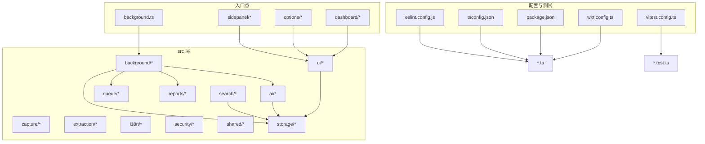
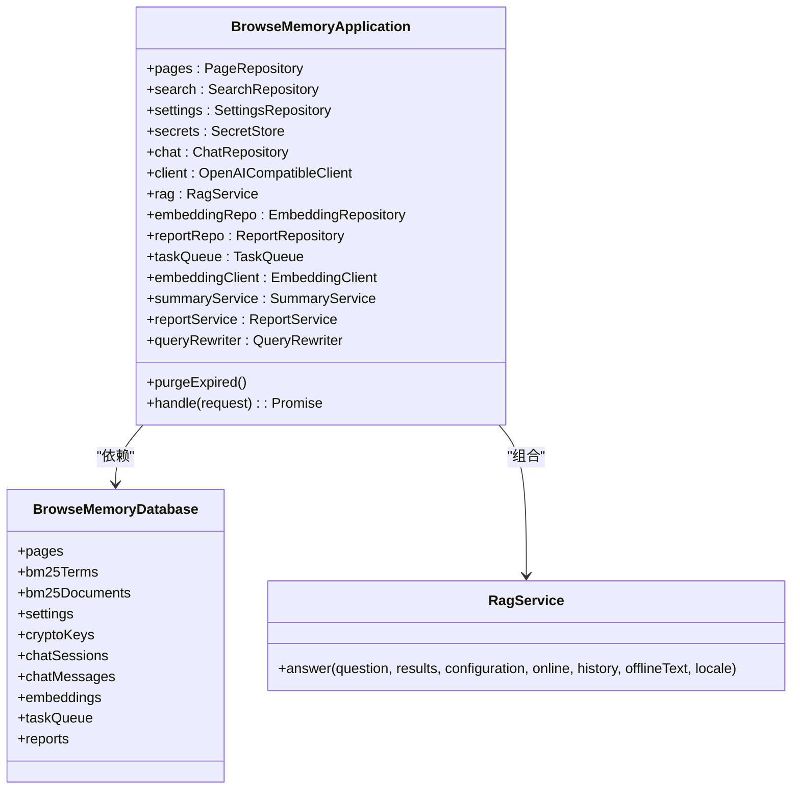
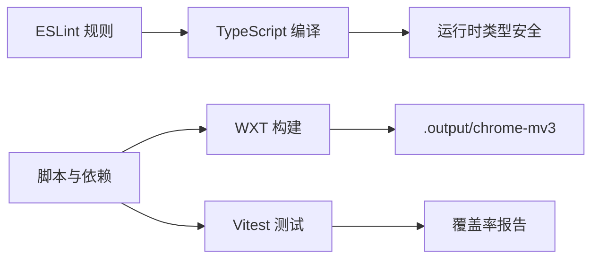

# 代码规范与最佳实践

<cite>
**本文档引用的文件**
- [eslint.config.js](file://eslint.config.js)
- [tsconfig.json](file://tsconfig.json)
- [package.json](file://package.json)
- [vitest.config.ts](file://vitest.config.ts)
- [wxt.config.ts](file://wxt.config.ts)
- [src/shared/types.ts](file://src/shared/types.ts)
- [src/shared/constants.ts](file://src/shared/constants.ts)
- [src/background/application.ts](file://src/background/application.ts)
- [src/storage/database.ts](file://src/storage/database.ts)
- [src/ai/rag-service.ts](file://src/ai/rag-service.ts)
- [src/ui/utils.ts](file://src/ui/utils.ts)
- [entrypoints/dashboard/App.tsx](file://entrypoints/dashboard/App.tsx)
- [tests/setup.ts](file://tests/setup.ts)
- [README.md](file://README.md)
- [.github/workflows/release.yml](file://.github/workflows/release.yml)
</cite>

## 目录
1. [简介](#简介)
2. [项目结构](#项目结构)
3. [核心组件](#核心组件)
4. [架构总览](#架构总览)
5. [详细组件分析](#详细组件分析)
6. [依赖关系分析](#依赖关系分析)
7. [性能考虑](#性能考虑)
8. [故障排查指南](#故障排查指南)
9. [结论](#结论)
10. [附录](#附录)

## 简介
本指南面向 BrowseMemory 项目，系统性地给出 TypeScript 配置、编码标准、ESLint 规则、代码组织与命名规范、注释与文档标准、Git 提交与分支规范、性能优化实践以及代码审查清单与质量保障流程。内容基于仓库现有配置与实现进行提炼，确保可落地、可执行。

## 项目结构
项目采用“入口点 + 模块化 src 分层”的组织方式，结合 WXT 的 MV3 扩展工程化能力与 Vitest 测试框架，形成清晰的职责边界与可维护性。

图表来源
- [wxt.config.ts:1-19](file://wxt.config.ts#L1-L19)
- [tsconfig.json:1-34](file://tsconfig.json#L1-L34)
- [eslint.config.js:1-25](file://eslint.config.js#L1-L25)
- [package.json:1-49](file://package.json#L1-L49)
- [vitest.config.ts:1-15](file://vitest.config.ts#L1-L15)

章节来源
- [README.md:94-115](file://README.md#L94-L115)
- [wxt.config.ts:1-19](file://wxt.config.ts#L1-L19)
- [tsconfig.json:1-34](file://tsconfig.json#L1-L34)
- [eslint.config.js:1-25](file://eslint.config.js#L1-L25)
- [package.json:1-49](file://package.json#L1-L49)
- [vitest.config.ts:1-15](file://vitest.config.ts#L1-L15)

## 核心组件
- 类型与常量：集中于 shared，统一对外暴露接口与默认值，便于跨模块复用与约束变更范围。
- 应用层：background/application 聚合仓储、AI 服务与任务队列，作为消息路由与业务编排中心。
- 存储层：storage/database 基于 Dexie 定义表结构与版本迁移，确保数据一致性与演进能力。
- AI 服务：ai/rag-service 封装 RAG 答案生成流程，支持在线/离线与历史上下文。
- UI 工具：ui/utils 提供样式合并工具函数，统一类名拼接策略。
- 入口应用：entrypoints/dashboard/App.tsx 展示报告仪表盘，体现组件状态管理与错误处理范式。

章节来源
- [src/shared/types.ts:1-139](file://src/shared/types.ts#L1-L139)
- [src/shared/constants.ts:1-33](file://src/shared/constants.ts#L1-L33)
- [src/background/application.ts:1-388](file://src/background/application.ts#L1-L388)
- [src/storage/database.ts:1-80](file://src/storage/database.ts#L1-L80)
- [src/ai/rag-service.ts:1-66](file://src/ai/rag-service.ts#L1-L66)
- [src/ui/utils.ts:1-7](file://src/ui/utils.ts#L1-L7)
- [entrypoints/dashboard/App.tsx:1-208](file://entrypoints/dashboard/App.tsx#L1-L208)

## 架构总览
下图展示后台应用层如何协调存储、AI 与任务队列，完成消息分发与业务处理。

图表来源
- [src/background/application.ts:29-63](file://src/background/application.ts#L29-L63)
- [src/storage/database.ts:34-76](file://src/storage/database.ts#L34-L76)
- [src/ai/rag-service.ts:15-64](file://src/ai/rag-service.ts#L15-L64)

## 详细组件分析

### 类型系统与接口设计
- 接口命名采用名词短语，首字母大写，如 PageRecord、SearchResult；枚举型联合类型使用小写并以管道分隔，如 TaskType、TaskStatus。
- 可选字段明确标注，避免隐式 undefined；对外响应对象统一包含 ok 字段与错误码，便于前端统一处理。
- 泛型使用集中在仓储与客户端封装，保持调用方与实现解耦。

章节来源
- [src/shared/types.ts:6-139](file://src/shared/types.ts#L6-L139)

### 泛型与仓储模式
- 数据库表通过 EntityTable 明确主键类型，提升查询与事务安全性。
- 仓储类围绕数据库表进行 CRUD 封装，方法返回 Promise，便于在应用层进行并发控制与错误恢复。

章节来源
- [src/storage/database.ts:34-76](file://src/storage/database.ts#L34-L76)

### RAG 服务与上下文构建
- 通过 RagService 统一答案生成流程，支持离线回退、历史上下文注入与引用解析。
- 当缺少配置或离线时，返回本地片段与来源映射，确保用户体验连续性。

章节来源
- [src/ai/rag-service.ts:15-64](file://src/ai/rag-service.ts#L15-L64)

### React 组件与状态管理
- 组件内部使用 useState/useEffect/useCallback 管理状态与副作用，避免不必要的重渲染。
- 错误处理通过局部状态与错误边界式提示呈现，必要时引导用户前往设置页。

章节来源
- [entrypoints/dashboard/App.tsx:18-173](file://entrypoints/dashboard/App.tsx#L18-L173)

### 任务队列与异步调度
- 任务类型与状态枚举化，便于日志追踪与可视化监控。
- 通过指数退避与最大重试次数控制失败任务的抖动与资源占用。

章节来源
- [src/shared/types.ts:108-124](file://src/shared/types.ts#L108-L124)
- [src/shared/constants.ts:31-32](file://src/shared/constants.ts#L31-L32)

### 数据库版本迁移与索引
- Dexie 版本化迁移确保新增表与索引平滑演进，避免破坏既有数据。
- 关键查询字段建立复合索引，降低检索成本。

章节来源
- [src/storage/database.ts:46-76](file://src/storage/database.ts#L46-L76)

## 依赖关系分析
- 构建与运行时：WXT 提供 MV3 扩展打包与开发服务器；Vitest 提供 DOM 环境与测试工具链；ESLint 与 TypeScript 提供静态检查与类型安全。
- 依赖注入：应用层通过构造函数注入仓储与服务实例，降低耦合度，便于替换与测试替身。

图表来源
- [eslint.config.js:1-25](file://eslint.config.js#L1-L25)
- [tsconfig.json:1-34](file://tsconfig.json#L1-L34)
- [package.json:6-12](file://package.json#L6-L12)
- [vitest.config.ts:1-15](file://vitest.config.ts#L1-L15)
- [wxt.config.ts:1-19](file://wxt.config.ts#L1-L19)

章节来源
- [package.json:14-46](file://package.json#L14-L46)
- [eslint.config.js:6-24](file://eslint.config.js#L6-L24)
- [tsconfig.json:3-24](file://tsconfig.json#L3-L24)
- [vitest.config.ts:3-14](file://vitest.config.ts#L3-L14)
- [wxt.config.ts:3-18](file://wxt.config.ts#L3-L18)

## 性能考虑
- React 组件优化
  - 使用 useCallback 包裹回调，减少子组件重渲染。
  - 合理拆分状态，避免大对象频繁更新导致的全量重渲染。
  - 在长列表场景中使用稳定 key 与虚拟滚动（如适用）。
- 内存管理
  - 严格控制全局状态规模，定期清理定时器与事件监听。
  - 对外暴露的客户端方法应避免持有过期引用，及时释放闭包。
- 异步操作
  - 并发请求使用 Promise.all 控制批处理，失败时采用指数退避与最大重试。
  - 对用户触发的操作提供加载态与取消机制，避免重复提交。
- 搜索与渲染
  - 搜索结果截断与高亮范围计算需限制文本长度，避免主线程阻塞。
  - Markdown 渲染与图片懒加载配合，降低初始渲染压力。

## 故障排查指南
- 类型错误
  - 使用 typecheck 脚本快速定位类型问题；开启 strict 模式有助于发现潜在隐患。
- 测试失败
  - 使用 Vitest 运行单测，关注 setup.ts 中的清理逻辑，避免跨用例污染。
- 构建与发布
  - 发布流程包含类型检查、Lint、测试与打包步骤，任一步骤失败需修复后再推进。

章节来源
- [package.json:10-12](file://package.json#L10-L12)
- [tests/setup.ts:1-9](file://tests/setup.ts#L1-L9)
- [.github/workflows/release.yml:33-43](file://.github/workflows/release.yml#L33-L43)

## 结论
本指南总结了 BrowseMemory 项目的类型体系、配置策略、组件设计与质量保障流程。建议在日常开发中遵循本文规范，持续完善测试与文档，确保功能演进与性能表现的平衡。

## 附录

### TypeScript 配置与编码标准
- 编译目标与模块
  - 目标 ES2022，模块系统为 ESNext，解析器为 Bundler，禁用 emit，启用 JSX 与严格模式。
- 路径别名与类型声明
  - 使用 @/* 指向 src，内置测试与 DOM 类型，便于统一导入与类型推断。
- 严格性与一致性
  - 启用严格模式与大小写敏感，避免因文件名大小写导致的运行时问题。

章节来源
- [tsconfig.json:3-24](file://tsconfig.json#L3-L24)

### ESLint 规则与自定义规则
- 推荐规则
  - 使用官方推荐配置与 TypeScript ESLint 推荐集，确保基础质量。
- React Hooks
  - 启用推荐规则，避免常见 Hook 使用陷阱。
- React Refresh
  - 仅允许常量导出，防止热更新异常。
- 忽略目录
  - 忽略输出目录、WXT 构建产物、覆盖率与网站静态资源。

章节来源
- [eslint.config.js:6-24](file://eslint.config.js#L6-L24)

### 代码组织与文件命名规范
- 目录与职责
  - 按功能域划分：ai、background、capture、extraction、i18n、queue、reports、search、security、shared、storage、ui。
- 文件命名
  - 组件文件使用 PascalCase，如 App.tsx；工具函数文件使用小驼峰，如 utils.ts。
- 导入顺序
  - 优先第三方库，再内部模块，最后相对路径；同组内按字母序排列。

### 接口与类型设计
- 接口命名
  - 使用名词短语，首字母大写；如 PageRecord、SearchResult。
- 联合类型
  - 使用小写并以管道分隔，如 TaskType、TaskStatus。
- 可选字段
  - 明确标注可选属性，避免隐式 undefined。

章节来源
- [src/shared/types.ts:6-139](file://src/shared/types.ts#L6-L139)

### 注释与文档标准
- JSDoc
  - 为公共接口与复杂函数添加简要说明，突出参数、返回值与异常情况。
- API 文档
  - 在 README 或 docs 中补充消息协议、端点行为与错误码说明，便于集成与测试。

### Git 提交信息与分支规范
- 提交信息
  - 采用“类型(scope): 描述”格式；类型可参考 feat、fix、docs、style、refactor、perf、test、chore。
- 分支命名
  - 使用短横线分隔的小写字母；如 feature/add-search，fix/bug-in-rag，hotfix/critical-bug。

### 代码审查清单
- 类型与接口
  - 是否使用严格类型；接口是否最小化且可演进。
- 组件与状态
  - 是否合理拆分状态；是否避免不必要重渲染。
- 异步与错误
  - 是否有超时与重试；错误是否可恢复或可提示。
- 测试
  - 是否覆盖关键路径与边界条件；是否包含单元与集成测试。
- 性能
  - 是否存在阻塞主线程的操作；是否使用合理的缓存与节流。

### 质量保证流程
- 本地
  - 运行 typecheck、lint、test，确保无告警与失败。
- CI/CD
  - 发布工作流包含类型检查、Lint、测试与打包，失败即阻断。
- 发布
  - 产出压缩包用于分发，版本号与标签保持一致。

章节来源
- [package.json:10-12](file://package.json#L10-L12)
- [.github/workflows/release.yml:33-56](file://.github/workflows/release.yml#L33-L56)