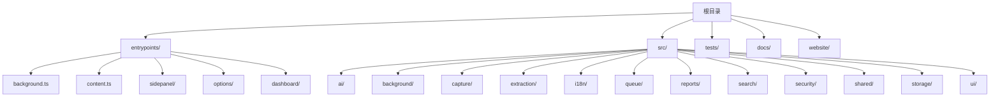
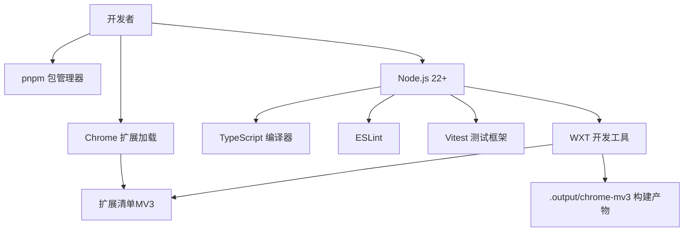
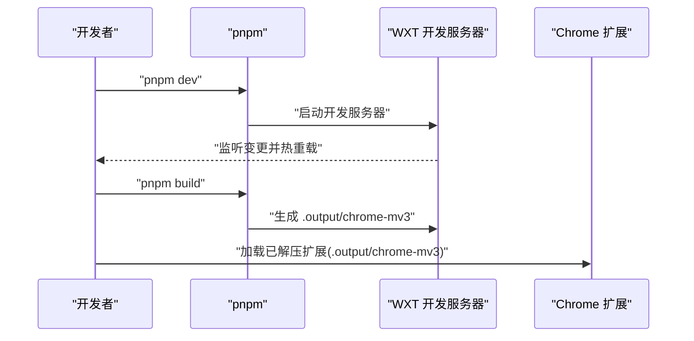
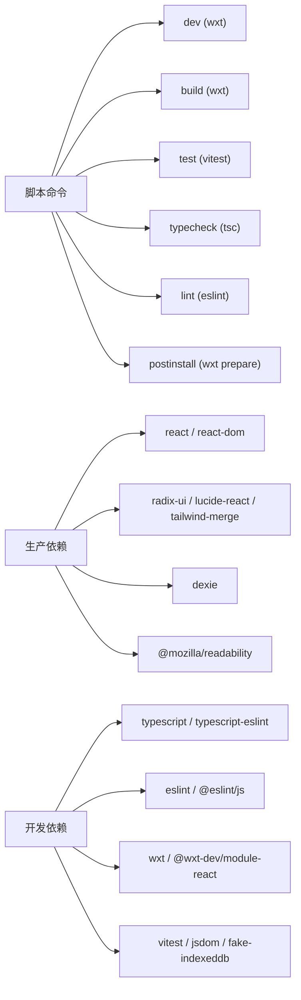

# 开发环境设置

<cite>
**本文档引用的文件**
- [package.json](file://package.json)
- [wxt.config.ts](file://wxt.config.ts)
- [tsconfig.json](file://tsconfig.json)
- [eslint.config.js](file://eslint.config.js)
- [vitest.config.ts](file://vitest.config.ts)
- [pnpm-workspace.yaml](file://pnpm-workspace.yaml)
- [README.md](file://README.md)
- [entrypoints/background.ts](file://entrypoints/background.ts)
- [entrypoints/content.ts](file://entrypoints/content.ts)
</cite>

## 目录
1. [简介](#简介)
2. [项目结构](#项目结构)
3. [核心组件](#核心组件)
4. [架构总览](#架构总览)
5. [详细组件分析](#详细组件分析)
6. [依赖分析](#依赖分析)
7. [性能考虑](#性能考虑)
8. [故障排除指南](#故障排除指南)
9. [结论](#结论)
10. [附录](#附录)

## 简介
本指南面向参与 BrowseMemory Chrome 扩展开发的工程师，提供从零搭建开发环境、安装依赖、运行开发服务器、配置 WXT 工具链、TypeScript 与 ESLint/Prettier 的最佳实践，以及如何在 Chrome 扩展环境中进行调试与加载。项目采用 Node.js 22+ 与 pnpm 作为首选工具链，并基于 WXT（Web Extensions Toolkit）实现 MV3 扩展的构建与开发。

## 项目结构
BrowseMemory 采用“入口点 + 源码分层”的组织方式：
- 入口点（entrypoints）：background、content、sidepanel、options、dashboard 等
- 源码分层（src）：ai、background、capture、extraction、i18n、queue、reports、search、security、shared、storage、ui 等
- 测试（tests）：按模块划分的单元测试与集成测试
- 文档与站点（docs、website）

章节来源
- [README.md:28-46](file://README.md#L28-L46)

## 核心组件
- 包管理与脚本
  - 使用 pnpm 作为包管理器，版本由 package.json 的 packageManager 字段声明
  - 核心脚本：dev、build、test、typecheck、lint、postinstall
- WXT 配置
  - 模块：React 支持模块
  - 清单：名称、描述、图标、权限与主机权限、动作标题
- TypeScript 配置
  - 继承 WXT 生成的 tsconfig，启用严格模式、路径别名、JSX 支持
- ESLint 配置
  - 推荐规则集、React Hooks 规则、React Refresh 规则
- Vitest 配置
  - 路径别名、jsdom 环境、测试设置文件

章节来源
- [package.json:6-13](file://package.json#L6-L13)
- [package.json:47](file://package.json#L47)
- [wxt.config.ts:3-18](file://wxt.config.ts#L3-L18)
- [tsconfig.json:2-24](file://tsconfig.json#L2-L24)
- [eslint.config.js:6-24](file://eslint.config.js#L6-L24)
- [vitest.config.ts:3-14](file://vitest.config.ts#L3-L14)

## 架构总览
下图展示了开发环境的关键组件及其交互关系：Node.js 与 pnpm 提供运行时与包管理；WXT 负责扩展清单、模块与构建；TypeScript 提供类型检查；ESLint 与 Vitest 提供代码质量与测试保障。

图表来源
- [package.json:6-13](file://package.json#L6-L13)
- [wxt.config.ts:3-18](file://wxt.config.ts#L3-L18)
- [tsconfig.json:2-24](file://tsconfig.json#L2-L24)
- [eslint.config.js:6-24](file://eslint.config.js#L6-L24)
- [vitest.config.ts:3-14](file://vitest.config.ts#L3-L14)

## 详细组件分析

### Node.js 版本与包管理器
- Node.js 版本要求：22+
- 包管理器：pnpm（由 package.json 的 packageManager 字段声明）
- 安装与初始化
  - 安装依赖：pnpm install
  - 启动开发：pnpm dev
  - 生产构建：pnpm build
  - 代码检查：pnpm lint
  - 类型检查：pnpm typecheck
  - 单元测试：pnpm test

章节来源
- [README.md:30-35](file://README.md#L30-L35)
- [package.json:47](file://package.json#L47)
- [package.json:6-13](file://package.json#L6-L13)

### 依赖安装流程
- 安装生产依赖与开发依赖
  - pnpm install 将根据 package.json 的 dependencies 与 devDependencies 安装全部依赖
  - postinstall 钩子会调用 wxt prepare，确保 WXT 的内部准备步骤完成
- Workspace 与构建能力
  - pnpm-workspace.yaml 启用了必要的构建工具能力，便于在工作区中统一管理

章节来源
- [package.json:14-46](file://package.json#L14-L46)
- [package.json:7](file://package.json#L7)
- [pnpm-workspace.yaml:1-4](file://pnpm-workspace.yaml#L1-L4)

### WXT 开发工具配置与使用
- 清单配置
  - 名称、描述、图标路径、权限（tabs、activeTab、storage、alarms、sidePanel）、主机权限（<all_urls>）、动作标题
- React 模块
  - 通过 @wxt-dev/module-react 提供 React 支持
- 开发服务器与热重载
  - pnpm dev 启动 WXT 开发服务器，自动监听源码变化并触发热重载
- 构建产物
  - pnpm build 输出到 .output/chrome-mv3，用于本地加载与发布
- Chrome 扩展加载
  - 构建后在 chrome://extensions 中开启“开发者模式”，加载已解压的扩展目录 .output/chrome-mv3

图表来源
- [package.json:6-13](file://package.json#L6-L13)
- [wxt.config.ts:3-18](file://wxt.config.ts#L3-L18)
- [README.md:48-55](file://README.md#L48-L55)

章节来源
- [wxt.config.ts:3-18](file://wxt.config.ts#L3-L18)
- [README.md:48-55](file://README.md#L48-L55)

### TypeScript 配置详解
- 继承 WXT 生成的 tsconfig，确保与 WXT 的构建体系一致
- 关键编译选项
  - 目标与库：ES2022、DOM、DOM.Iterable
  - 模块系统：ESNext、Bundler
  - 严格模式：启用
  - JSX：react-jsx
  - 路径别名：@/* 映射至 src/*
  - 类型声明：包含 vitest、@testing-library/jest-dom、chrome
- 包含范围：.wxt/wxt.d.ts、entrypoints、src、tests、根目录下的 *.ts/*.js

章节来源
- [tsconfig.json:2-24](file://tsconfig.json#L2-L24)
- [tsconfig.json:25-33](file://tsconfig.json#L25-L33)

### ESLint 与 Prettier 集成
- ESLint 配置
  - 使用 @eslint/js 推荐规则集
  - TypeScript ESLint 推荐规则集
  - React Hooks 与 React Refresh 插件
  - 忽略目录：.output、.wxt、coverage、node_modules、website
- Prettier
  - 仓库未提供独立 Prettier 配置文件，建议在 VS Code 中安装 Prettier 插件并配合 ESLint 使用
  - 在 VS Code 设置中启用格式化程序为 ESLint，或使用 Prettier 插件并配置默认格式化行为

章节来源
- [eslint.config.js:6-24](file://eslint.config.js#L6-L24)

### VS Code 推荐插件与配置
- 必备插件
  - ESLint：提供实时语法与风格检查
  - Prettier：代码格式化（若未使用内置格式化）
  - Tailwind CSS IntelliSense：提供 Tailwind 类名提示
  - TypeScript Importer：辅助导入类型与模块
- VS Code 设置建议
  - editor.formatOnSave：true
  - editor.codeActionsOnSave：启用 ESLint 自动修复
  - [路径别名解析]：确保 TypeScript 路径映射生效（由 tsconfig.json 的 paths 控制）
- 与项目配置的对应关系
  - ESLint 规则与忽略目录由 eslint.config.js 定义
  - 路径别名由 tsconfig.json 的 paths 控制

章节来源
- [eslint.config.js:6-24](file://eslint.config.js#L6-L24)
- [tsconfig.json:21-23](file://tsconfig.json#L21-L23)

### Chrome 扩展开发工具使用
- 清单与权限
  - 清单中声明了 tabs、activeTab、storage、alarms、sidePanel 等权限，以及 <all_urls> 主机权限
- 调试要点
  - 后台页面：在 chrome://extensions 中找到 BrowseMemory，点击“service worker”进入后台页面调试
  - 内容脚本：在目标网页中打开开发者工具，切换到 Console 或 Sources 查看内容脚本注入与消息通信
  - 侧边栏与选项页：通过扩展图标打开 UI，结合控制台观察消息传递与状态更新
- 热重载与重新加载
  - 修改源码后，WXT 会自动热重载；如需强制刷新，可在 chrome://extensions 中点击“重新加载”

章节来源
- [wxt.config.ts:9-16](file://wxt.config.ts#L9-L16)
- [entrypoints/background.ts:39-240](file://entrypoints/background.ts#L39-L240)
- [entrypoints/content.ts:3-43](file://entrypoints/content.ts#L3-L43)

## 依赖分析
- 脚本与工具链
  - dev：wxt 开发服务器
  - build：wxt 构建输出至 .output/chrome-mv3
  - test：vitest 运行测试
  - typecheck：TypeScript 类型检查
  - lint：ESLint 代码检查
  - postinstall：wxt prepare
- 依赖分类
  - 生产依赖：React、Dexie、Tailwind Merge、Radix UI、Lucide React、Readability 等
  - 开发依赖：TypeScript、ESLint、Vitest、WXT、React 模块、JSDOM 等

图表来源
- [package.json:6-13](file://package.json#L6-L13)
- [package.json:14-46](file://package.json#L14-L46)

章节来源
- [package.json:6-13](file://package.json#L6-L13)
- [package.json:14-46](file://package.json#L14-L46)

## 性能考虑
- 严格模式与隔离模块
  - tsconfig.json 启用严格模式与 isolatedModules，有助于早期发现潜在问题并提升构建稳定性
- 模块解析与打包
  - 使用 Bundler 解析器与 ESNext 模块系统，配合 WXT 的打包策略，减少冗余代码
- 测试环境优化
  - Vitest 使用 jsdom 环境，避免启动真实浏览器带来的性能开销
- 热重载与增量构建
  - WXT 开发服务器提供快速热重载，缩短迭代周期

章节来源
- [tsconfig.json:11-18](file://tsconfig.json#L11-L18)
- [vitest.config.ts:9-13](file://vitest.config.ts#L9-L13)

## 故障排除指南
- Node.js 版本不匹配
  - 症状：安装或运行时报错
  - 处理：升级到 Node.js 22+ 并重新安装依赖
- pnpm 版本或工作区问题
  - 症状：安装失败或构建异常
  - 处理：确认 pnpm-workspace.yaml 的构建能力已启用；清理 node_modules 与 pnpm-lock.yaml 后重试
- WXT 准备失败
  - 症状：首次安装后无法启动 dev
  - 处理：执行 postinstall 钩子（wxt prepare）或手动运行 wxt prepare
- 清单权限不足
  - 症状：扩展无法访问标签页或存储
  - 处理：确认清单中 permissions 与 host_permissions 已正确声明
- 热重载无效
  - 症状：修改代码后无变化
  - 处理：重启开发服务器（pnpm dev），或检查文件是否被 ESLint 忽略（见 eslint.config.js 的忽略列表）
- Chrome 加载失败
  - 症状：加载已解压扩展时报错
  - 处理：确保 .output/chrome-mv3 存在且未被忽略；在 chrome://extensions 中开启“开发者模式”并重新加载

章节来源
- [package.json:7](file://package.json#L7)
- [package.json:47](file://package.json#L47)
- [eslint.config.js:7](file://eslint.config.js#L7)
- [README.md:48-55](file://README.md#L48-L55)

## 结论
BrowseMemory 的开发环境以 Node.js 22+ 与 pnpm 为基础，借助 WXT 实现 MV3 扩展的高效开发与构建。通过合理的 TypeScript、ESLint 与 Vitest 配置，结合 VS Code 的推荐插件，可以显著提升开发效率与代码质量。按照本文档的步骤进行环境搭建与调试，可快速定位并解决常见问题，顺利推进扩展功能的迭代与发布。

## 附录
- 常用命令速查
  - 安装依赖：pnpm install
  - 启动开发：pnpm dev
  - 生产构建：pnpm build
  - 代码检查：pnpm lint
  - 类型检查：pnpm typecheck
  - 单元测试：pnpm test
- 构建产物位置
  - .output/chrome-mv3

章节来源
- [README.md:32-44](file://README.md#L32-L44)
- [package.json:6-13](file://package.json#L6-L13)