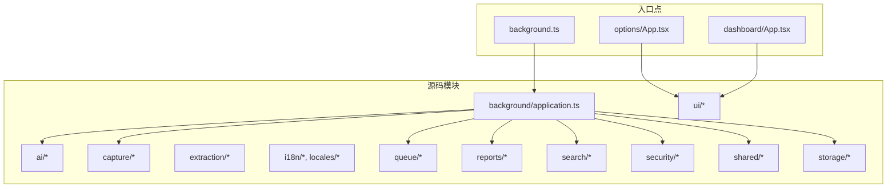
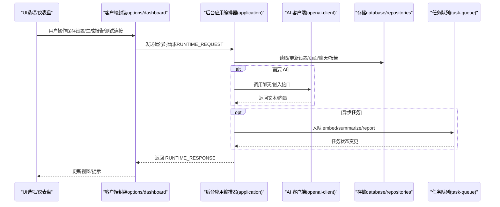
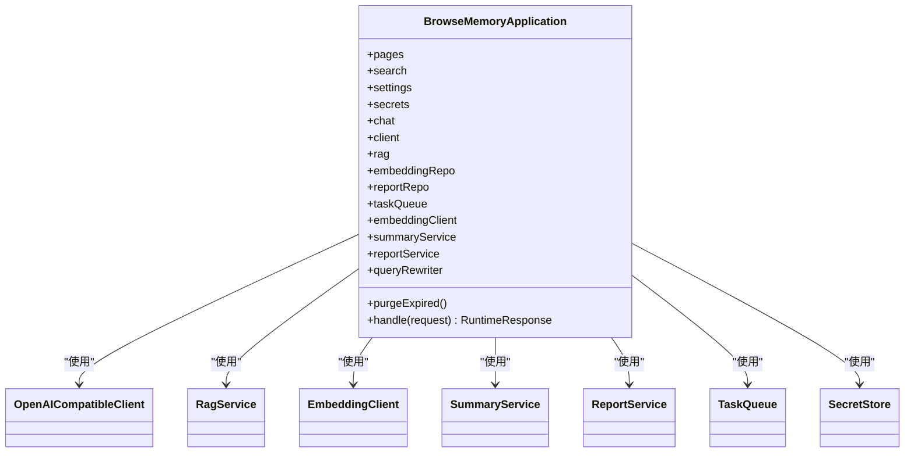
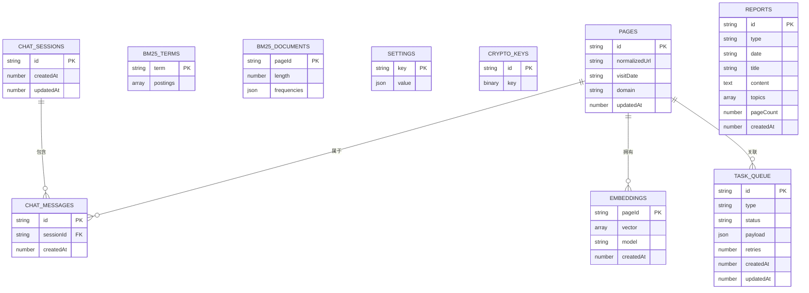
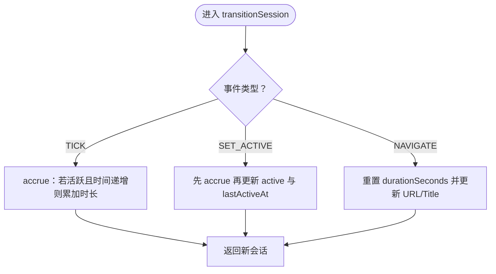
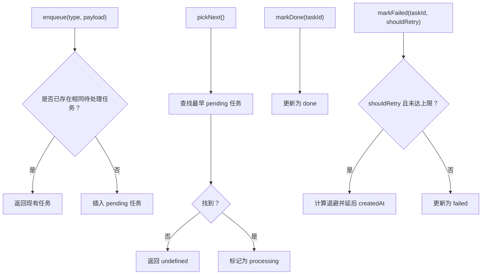
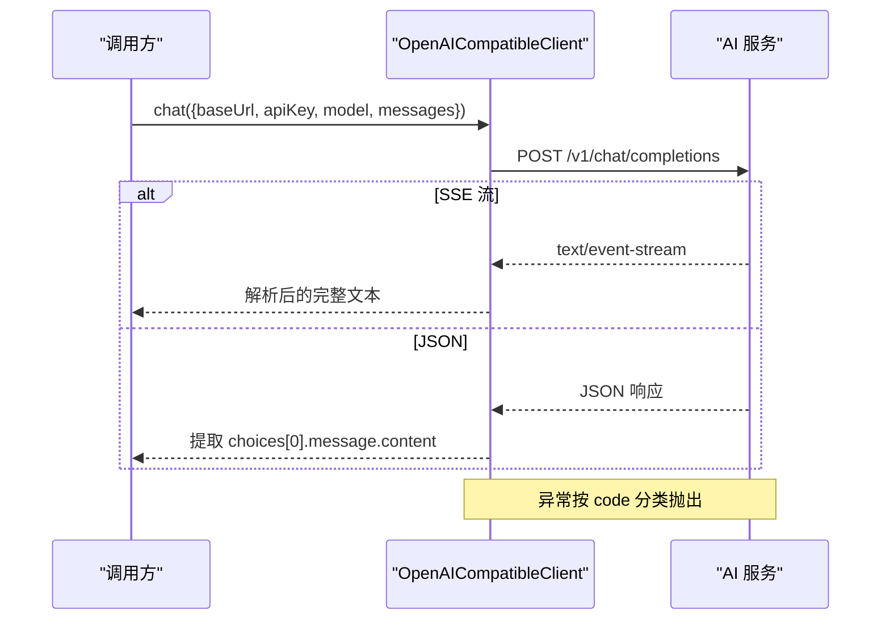
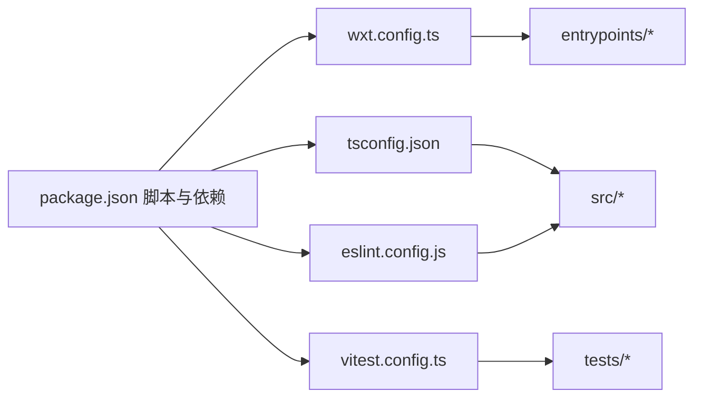

# 开发者指南

<cite>
**本文档引用的文件**
- [README.md](file://README.md)
- [package.json](file://package.json)
- [wxt.config.ts](file://wxt.config.ts)
- [tsconfig.json](file://tsconfig.json)
- [eslint.config.js](file://eslint.config.js)
- [vitest.config.ts](file://vitest.config.ts)
- [pnpm-workspace.yaml](file://pnpm-workspace.yaml)
- [src/background/application.ts](file://src/background/application.ts)
- [src/shared/types.ts](file://src/shared/types.ts)
- [src/shared/constants.ts](file://src/shared/constants.ts)
- [src/capture/session-machine.ts](file://src/capture/session-machine.ts)
- [src/storage/database.ts](file://src/storage/database.ts)
- [src/ai/openai-client.ts](file://src/ai/openai-client.ts)
- [src/queue/task-queue.ts](file://src/queue/task-queue.ts)
- [src/ui/utils.ts](file://src/ui/utils.ts)
- [entrypoints/options/App.tsx](file://entrypoints/options/App.tsx)
- [entrypoints/dashboard/App.tsx](file://entrypoints/dashboard/App.tsx)
- [tests/setup.ts](file://tests/setup.ts)
</cite>

## 目录
1. [简介](#简介)
2. [项目结构](#项目结构)
3. [核心组件](#核心组件)
4. [架构总览](#架构总览)
5. [详细组件分析](#详细组件分析)
6. [依赖关系分析](#依赖关系分析)
7. [性能考虑](#性能考虑)
8. [故障排除指南](#故障排除指南)
9. [结论](#结论)
10. [附录](#附录)

## 简介
本指南面向新老开发者，系统性介绍 BrowseMemory 的开发环境搭建、代码规范、贡献流程、开发工作流、性能优化、故障排除、扩展点与插件机制，以及常用开发工具链（WXT、Chrome DevTools 等）。项目采用 React + TypeScript + WXT（基于 Vite）构建 Chrome MV3 扩展，数据持久化使用 Dexie（IndexedDB），AI 服务通过兼容 OpenAI 接口的客户端调用。

## 项目结构
项目采用“入口点 + 源码模块”的分层组织方式：
- 入口点（entrypoints）：background.ts、content.ts、sidepanel、options、dashboard
- 源码（src）：ai、background、capture、extraction、i18n、locales、queue、reports、search、security、shared、storage、ui
- 测试（tests）：按模块与功能划分的单元测试
- 文档（docs）：设计文档、规格说明、测试策略等
- 网站（website）：静态站点资源

图表来源
- [wxt.config.ts:1-19](file://wxt.config.ts#L1-L19)
- [src/background/application.ts:1-388](file://src/background/application.ts#L1-L388)
- [entrypoints/options/App.tsx:1-529](file://entrypoints/options/App.tsx#L1-L529)
- [entrypoints/dashboard/App.tsx:1-208](file://entrypoints/dashboard/App.tsx#L1-L208)

章节来源
- [README.md:94-115](file://README.md#L94-L115)

## 核心组件
- 应用编排器（BrowseMemoryApplication）：集中管理仓库、AI 客户端、任务队列、报告服务等，统一处理来自 UI 的运行时请求。
- 数据库（BrowseMemoryDatabase）：基于 Dexie 的 IndexedDB Schema，包含页面、BM25 索引、聊天、嵌入、任务、报告等表。
- 会话状态机（Session Machine）：追踪标签页阅读时长、活跃状态与导航事件，驱动页面采集。
- 任务队列（TaskQueue）：异步任务调度与重试，支持指数退避与去重。
- AI 客户端（OpenAICompatibleClient）：兼容 OpenAI 接口的聊天能力，支持 SSE 流式解析与错误分类。
- 类型与常量（shared/types.ts、constants.ts）：定义应用设置、页面记录、任务类型、报警名称、重试策略等。

章节来源
- [src/background/application.ts:29-388](file://src/background/application.ts#L29-L388)
- [src/storage/database.ts:34-80](file://src/storage/database.ts#L34-L80)
- [src/capture/session-machine.ts:1-69](file://src/capture/session-machine.ts#L1-L69)
- [src/queue/task-queue.ts:12-126](file://src/queue/task-queue.ts#L12-L126)
- [src/ai/openai-client.ts:56-125](file://src/ai/openai-client.ts#L56-L125)
- [src/shared/types.ts:1-139](file://src/shared/types.ts#L1-L139)
- [src/shared/constants.ts:1-33](file://src/shared/constants.ts#L1-L33)

## 架构总览
下图展示了扩展的运行时交互：UI（选项页、仪表盘）通过客户端封装与后台通信；后台应用编排器协调 AI、存储、任务队列与报告服务；数据库持久化数据；会话状态机驱动采集。

图表来源
- [src/background/application.ts:74-352](file://src/background/application.ts#L74-L352)
- [src/ai/openai-client.ts:64-124](file://src/ai/openai-client.ts#L64-L124)
- [src/storage/database.ts:34-80](file://src/storage/database.ts#L34-L80)
- [src/queue/task-queue.ts:15-106](file://src/queue/task-queue.ts#L15-L106)

## 详细组件分析

### 后台应用编排器（BrowseMemoryApplication）
职责与流程要点：
- 依赖注入：构造页面、搜索、设置、密钥、聊天、AI 客户端、RAG、嵌入、摘要、报告、查询重写、任务队列等。
- 请求分发：根据请求类型路由到对应处理逻辑，如页面入库、搜索、问答、设置读写、连接测试、报告生成、队列状态等。
- 多轮对话与重写：在有历史与配置时，对问题进行重写以提升检索质量。
- 混合检索：在具备嵌入 API Key 时，将重写后的查询向量化并与 BM25 融合。
- 异步任务：入库成功后按需入队嵌入与摘要任务。
- 报告生成：按日/周/月生成报告，并支持手动触发强制覆盖。

图表来源
- [src/background/application.ts:29-63](file://src/background/application.ts#L29-L63)
- [src/background/application.ts:74-352](file://src/background/application.ts#L74-L352)

章节来源
- [src/background/application.ts:29-388](file://src/background/application.ts#L29-L388)

### 数据库与仓储（Dexie）
- 表结构：页面、BM25 词条/文档、设置、加密密钥、聊天会话/消息、嵌入、任务队列、报告。
- 版本迁移：从 v1 到 v3 逐步增加聊天、嵌入、任务、报告等表，保证升级兼容。
- 仓储职责：PageRepository、SearchRepository、SettingsRepository、ChatRepository、EmbeddingRepository、ReportRepository、TaskQueue 等围绕数据库表提供 CRUD 与聚合查询。

图表来源
- [src/storage/database.ts:34-80](file://src/storage/database.ts#L34-L80)

章节来源
- [src/storage/database.ts:34-80](file://src/storage/database.ts#L34-L80)

### 会话状态机（ReadingSession）
- 状态：包含标签页 ID、URL/标题、时长、活跃标志、最后活跃时间。
- 事件：Tick（计时）、SetActive（激活/失活）、Navigate（导航）。
- 转移：根据事件累积时长、切换活跃状态或重置时长并更新导航信息。

图表来源
- [src/capture/session-machine.ts:43-68](file://src/capture/session-machine.ts#L43-L68)

章节来源
- [src/capture/session-machine.ts:1-69](file://src/capture/session-machine.ts#L1-L69)

### 任务队列（TaskQueue）
- 去重：同类型与相同 payload 的任务不会重复入队。
- 选取：按创建时间升序挑选最早待处理任务并标记为处理中。
- 成功/失败：成功标记完成；失败按最大重试次数与指数退避延后。
- 清理：定期清理超过保留期的已完成任务。

图表来源
- [src/queue/task-queue.ts:15-106](file://src/queue/task-queue.ts#L15-L106)
- [src/shared/constants.ts:31-32](file://src/shared/constants.ts#L31-L32)

章节来源
- [src/queue/task-queue.ts:12-126](file://src/queue/task-queue.ts#L12-L126)
- [src/shared/constants.ts:31-32](file://src/shared/constants.ts#L31-L32)

### AI 客户端（OpenAICompatibleClient）
- 支持标准 JSON 与 SSE 两种响应格式，统一解析为最终文本。
- 错误分类：鉴权、速率限制、超时、网络、供应商错误。
- Service Worker 安全：通过箭头函数绑定避免非法调用。

图表来源
- [src/ai/openai-client.ts:64-124](file://src/ai/openai-client.ts#L64-L124)

章节来源
- [src/ai/openai-client.ts:56-125](file://src/ai/openai-client.ts#L56-L125)

### UI 组件与客户端封装
- 选项页（options/App.tsx）：集中管理 AI 服务、嵌入、报告、采集规则、存储与隐私设置，支持即时保存与连接测试。
- 仪表盘（dashboard/App.tsx）：按日/周/月查看报告，支持生成与 Markdown 渲染。
- 客户端封装（ui/*）：提供与后台通信的统一接口，屏蔽消息协议细节。

章节来源
- [entrypoints/options/App.tsx:1-529](file://entrypoints/options/App.tsx#L1-L529)
- [entrypoints/dashboard/App.tsx:1-208](file://entrypoints/dashboard/App.tsx#L1-L208)

## 依赖关系分析
- 构建与脚本：WXT 作为主构建工具，Vitest 用于单元测试，ESLint + TypeScript ESLint 提供类型安全与风格约束。
- 运行时依赖：React、Tailwind 工具集、Dexie、Readability、Radix UI 组件等。
- 类型与别名：TS 路径映射 @/* 指向 src，便于模块导入。

图表来源
- [package.json:6-12](file://package.json#L6-L12)
- [wxt.config.ts:3-18](file://wxt.config.ts#L3-L18)
- [tsconfig.json:21-23](file://tsconfig.json#L21-L23)
- [eslint.config.js:6-24](file://eslint.config.js#L6-L24)
- [vitest.config.ts:4-14](file://vitest.config.ts#L4-L14)

章节来源
- [package.json:14-46](file://package.json#L14-L46)
- [tsconfig.json:1-34](file://tsconfig.json#L1-L34)
- [eslint.config.js:1-25](file://eslint.config.js#L1-L25)
- [vitest.config.ts:1-15](file://vitest.config.ts#L1-L15)
- [pnpm-workspace.yaml:1-4](file://pnpm-workspace.yaml#L1-L4)

## 性能考虑
- 内存与存储
  - IndexedDB 存储：合理设置保留天数与清理策略，避免无界增长。
  - 任务队列：指数退避减少抖动，失败任务及时标记，定期清理已完成任务。
  - 嵌入向量：仅在启用时生成，离线场景下回退至 BM25，降低在线依赖。
- 渲染与交互
  - React 组件：按需渲染、懒加载与虚拟滚动（如适用）。
  - Tailwind 工具集：合并与最小化类名，避免重复样式。
- 网络与 AI
  - 超时控制与错误分类，避免长时间阻塞 UI。
  - 多轮对话前的查询重写，减少无关检索，提高命中率。
- 构建与打包
  - 使用 WXT/Vite 的 Tree Shaking 与按需加载，避免引入未使用模块。

[本节为通用建议，无需列出章节来源]

## 故障排除指南
- 开发与调试
  - 使用 Chrome DevTools 的 Extensions 面板检查后台脚本、侧边栏与弹出页。
  - 在后台应用编排器中定位请求处理分支，确认设置读取、AI 调用与任务入队是否符合预期。
  - 若出现“非法调用”错误，检查 fetch 包装与 Service Worker 上下文绑定。
- 常见问题
  - API Key 缺失：连接测试返回缺失 Key，需在设置页填写并保存。
  - 嵌入 API 报错：降级为 BM25，检查地址、模型与网络连通性。
  - 任务积压：查看队列状态，调整退避策略或并发度。
- 单元测试
  - 使用 Vitest 运行测试，利用 fake-indexeddb 与 jsdom 环境模拟浏览器 API。
  - 在 tests/setup.ts 中确保每次测试后清理 DOM 与 IndexedDB。

章节来源
- [src/background/application.ts:130-177](file://src/background/application.ts#L130-L177)
- [src/ai/openai-client.ts:108-123](file://src/ai/openai-client.ts#L108-L123)
- [tests/setup.ts:1-9](file://tests/setup.ts#L1-L9)

## 结论
BrowseMemory 以清晰的模块边界与职责分离实现了本地优先的浏览记忆扩展。通过后台应用编排器统一调度、Dexie 持久化、任务队列异步化与 AI 客户端抽象，既保证了功能完整性，也为后续扩展（如语义搜索、报告与任务队列）提供了良好基础。建议在开发中遵循本文档的规范与流程，持续完善测试与性能优化。

[本节为总结，无需列出章节来源]

## 附录

### 开发环境设置与 IDE 推荐
- 运行时与包管理
  - Node.js 22+ 与 pnpm（版本由 package.json 指定）。
  - 安装依赖后自动准备 WXT。
- IDE 插件建议
  - TypeScript/ESLint/ES6 智能提示与自动修复。
  - Prettier 或内置格式化工具配合 ESLint 规则。
  - React DevTools（检查组件树与 Hooks）。
- 调试技巧
  - 在 options/dashboard 的客户端封装处设置断点，观察请求/响应。
  - 使用 Chrome DevTools 的 Application 面板查看 IndexedDB 数据。
  - 在后台应用编排器 handle 分支中定位具体请求类型。

章节来源
- [README.md:30-44](file://README.md#L30-L44)
- [package.json:47-48](file://package.json#L47-L48)

### 代码规范与最佳实践
- TypeScript 配置
  - 严格模式、ESNext 模块、Bundler 解析、JSX React 渲染。
  - 路径别名 @/* 指向 src，便于跨目录引用。
- ESLint 规则
  - 推荐规则 + React Hooks + React Refresh 规则，禁止在非导出组件中使用常量导出以外的导出。
- 代码格式化
  - 与 ESLint 配合，统一缩进、分号与空行风格。
- Git 与工作流
  - 使用分支策略（如功能分支、特性分支）与小步提交。
  - 提交信息遵循约定式提交（可选），PR 包含变更说明与测试覆盖。

章节来源
- [tsconfig.json:3-24](file://tsconfig.json#L3-L24)
- [eslint.config.js:6-24](file://eslint.config.js#L6-L24)

### 贡献指南
- 分支策略
  - 主分支保护，功能开发在特性分支进行。
- 提交规范
  - 简洁描述问题与解决方案，必要时引用 Issue。
- Pull Request 流程
  - 包含变更摘要、测试用例与风险评估。
  - 代码审查通过后方可合并。

[本节为通用流程建议，无需列出章节来源]

### 开发工作流
- 功能开发
  - 新增/修改模块后，补充单元测试与集成测试。
  - 使用 Vitest 运行测试，确保覆盖率与稳定性。
- 构建与发布
  - 本地构建产物位于 .output/chrome-mv3，安装未打包扩展步骤见 README。
- 代码审查
  - 关注复杂度、可维护性与性能影响。

章节来源
- [README.md:48-56](file://README.md#L48-L56)
- [vitest.config.ts:9-13](file://vitest.config.ts#L9-L13)

### 性能优化方法与工具
- 内存管理
  - 控制 IndexedDB 记录数量与字段大小，定期清理过期数据。
  - 合理使用任务队列，避免堆积。
- 渲染优化
  - 组件拆分与懒加载，减少首屏压力。
  - 使用 Tailwind 工具集减少样式体积。
- 工具链
  - WXT/Vite 的 Tree Shaking 与按需加载。
  - Chrome DevTools Performance 面板分析长任务与内存峰值。

[本节为通用建议，无需列出章节来源]

### 扩展点与插件机制
- 模块化扩展
  - 新增模块时，遵循 shared/types.ts 中的数据契约与 constants.ts 中的默认值。
  - 在 background/application.ts 中注册与调度。
- 插件与适配
  - AI 客户端抽象允许替换不同供应商的兼容接口。
  - 任务队列可扩展更多任务类型（如新增报告类型）。

章节来源
- [src/shared/types.ts:108-124](file://src/shared/types.ts#L108-L124)
- [src/shared/constants.ts:31-32](file://src/shared/constants.ts#L31-L32)
- [src/ai/openai-client.ts:56-62](file://src/ai/openai-client.ts#L56-L62)

### 开发工具链使用指南
- WXT
  - dev/build/lint/typecheck/test 脚本，自动准备与构建 MV3 扩展。
- Chrome DevTools
  - Background Pages、Application、Network、Performance 面板辅助调试。
- 测试框架
  - Vitest + jsdom + fake-indexeddb，测试设置在 tests/setup.ts。

章节来源
- [package.json:6-12](file://package.json#L6-L12)
- [tests/setup.ts:1-9](file://tests/setup.ts#L1-L9)

### 学习路径与资源推荐
- 快速上手
  - 阅读 README 的功能概览与开发步骤，安装依赖后运行 dev。
- 进阶学习
  - 研读后台应用编排器与数据库 Schema，理解数据流与控制流。
  - 查看 UI 组件与客户端封装，掌握前后端通信协议。
- 资源链接
  - WXT 官方文档（构建与配置）
  - Chrome Extension 开发文档（MV3、权限与清单）
  - Dexie 文档（IndexedDB 封装）
  - React 与 TypeScript 官方文档

[本节为学习建议，无需列出章节来源]