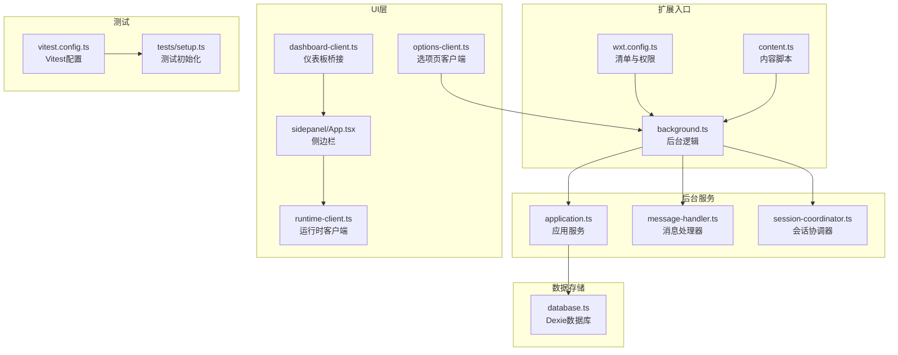
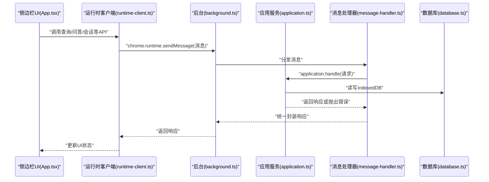
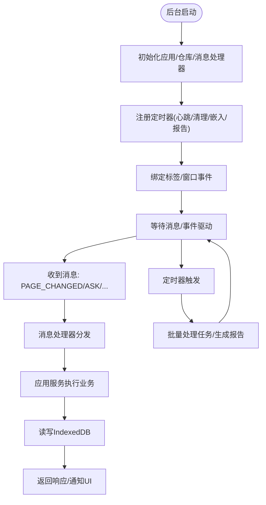
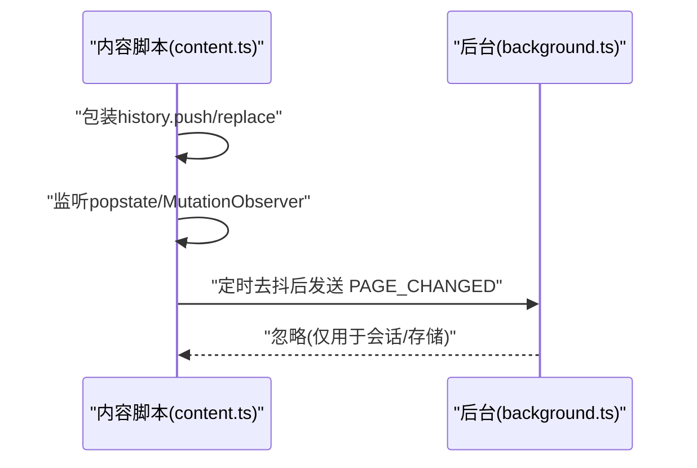
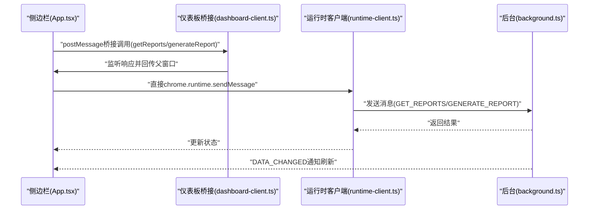
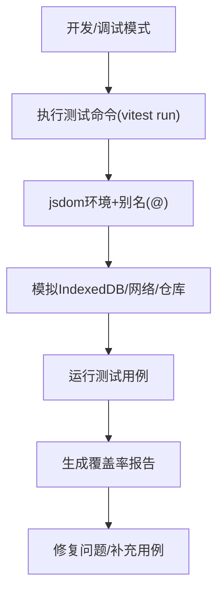
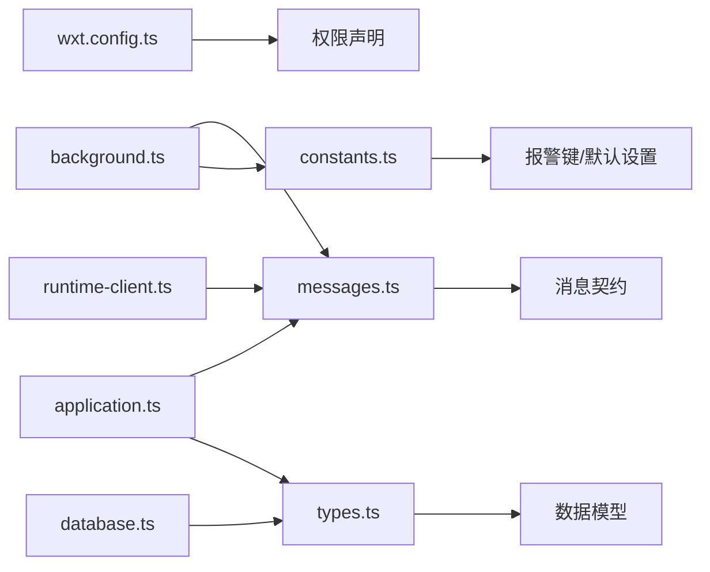
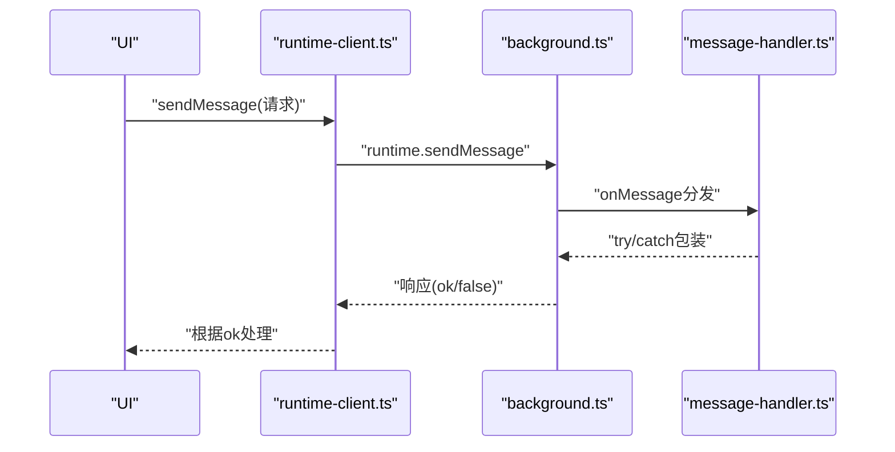

# 调试与故障排除

<cite>
**本文引用的文件**
- [package.json](file://package.json)
- [vitest.config.ts](file://vitest.config.ts)
- [wxt.config.ts](file://wxt.config.ts)
- [background.ts](file://entrypoints/background.ts)
- [content.ts](file://entrypoints/content.ts)
- [messages.ts](file://src/shared/messages.ts)
- [application.ts](file://src/background/application.ts)
- [message-handler.ts](file://src/background/message-handler.ts)
- [session-coordinator.ts](file://src/background/session-coordinator.ts)
- [database.ts](file://src/storage/database.ts)
- [setup.ts](file://tests/setup.ts)
- [App.tsx（侧边栏）](file://entrypoints/sidepanel/App.tsx)
- [runtime-client.ts](file://src/ui/runtime-client.ts)
- [dashboard-client.ts](file://src/ui/dashboard-client.ts)
- [options-client.ts](file://src/ui/options-client.ts)
- [types.ts](file://src/shared/types.ts)
- [constants.ts](file://src/shared/constants.ts)
</cite>

## 目录
1. [简介](#简介)
2. [项目结构](#项目结构)
3. [核心组件](#核心组件)
4. [架构总览](#架构总览)
5. [详细组件分析](#详细组件分析)
6. [依赖分析](#依赖分析)
7. [性能考虑](#性能考虑)
8. [故障排除指南](#故障排除指南)
9. [结论](#结论)
10. [附录](#附录)

## 简介
本指南面向BrowseMemory项目的开发者与维护者，提供系统化的调试与故障排除方法，覆盖以下方面：
- Chrome扩展调试：后台页面、内容脚本、侧边栏页面的调试要点与技巧
- 测试框架Vitest：运行、断点调试、模拟对象、覆盖率分析
- 常见问题诊断：IndexedDB访问、消息传递异常、性能瓶颈
- 开发工具：Chrome DevTools、React DevTools、性能分析
- 日志与错误追踪最佳实践
- 网络请求与API调用排查
- 内存泄漏检测与性能优化
- 跨域与权限配置问题处理

## 项目结构
项目采用基于功能模块的组织方式，入口位于entrypoints目录，业务逻辑分布在src目录，测试集中在tests目录。关键调试相关文件包括：
- 扩展入口与清单：wxt.config.ts、manifest权限声明
- 后台逻辑：background.ts、application.ts、message-handler.ts、session-coordinator.ts
- 内容脚本：content.ts
- UI层：sidepanel/App.tsx、runtime-client.ts、dashboard-client.ts、options-client.ts
- 数据存储：database.ts（Dexie）
- 测试环境：vitest.config.ts、tests/setup.ts

图表来源
- [wxt.config.ts:1-19](file://wxt.config.ts#L1-L19)
- [background.ts:1-241](file://entrypoints/background.ts#L1-L241)
- [application.ts:1-388](file://src/background/application.ts#L1-L388)
- [message-handler.ts:1-22](file://src/background/message-handler.ts#L1-L22)
- [session-coordinator.ts:1-157](file://src/background/session-coordinator.ts#L1-L157)
- [content.ts:1-44](file://entrypoints/content.ts#L1-L44)
- [App.tsx（侧边栏）:1-834](file://entrypoints/sidepanel/App.tsx#L1-L834)
- [runtime-client.ts:1-182](file://src/ui/runtime-client.ts#L1-L182)
- [dashboard-client.ts:1-148](file://src/ui/dashboard-client.ts#L1-L148)
- [options-client.ts:1-87](file://src/ui/options-client.ts#L1-L87)
- [database.ts:1-80](file://src/storage/database.ts#L1-L80)
- [vitest.config.ts:1-15](file://vitest.config.ts#L1-L15)
- [setup.ts:1-9](file://tests/setup.ts#L1-L9)

章节来源
- [wxt.config.ts:1-19](file://wxt.config.ts#L1-L19)
- [background.ts:1-241](file://entrypoints/background.ts#L1-L241)
- [content.ts:1-44](file://entrypoints/content.ts#L1-L44)
- [App.tsx（侧边栏）:1-834](file://entrypoints/sidepanel/App.tsx#L1-L834)
- [runtime-client.ts:1-182](file://src/ui/runtime-client.ts#L1-L182)
- [dashboard-client.ts:1-148](file://src/ui/dashboard-client.ts#L1-L148)
- [options-client.ts:1-87](file://src/ui/options-client.ts#L1-L87)
- [application.ts:1-388](file://src/background/application.ts#L1-L388)
- [message-handler.ts:1-22](file://src/background/message-handler.ts#L1-L22)
- [session-coordinator.ts:1-157](file://src/background/session-coordinator.ts#L1-L157)
- [database.ts:1-80](file://src/storage/database.ts#L1-L80)
- [vitest.config.ts:1-15](file://vitest.config.ts#L1-L15)
- [setup.ts:1-9](file://tests/setup.ts#L1-L9)

## 核心组件
- 后台服务（Background）：负责消息路由、任务调度、会话管理、定时清理与嵌入向量生成等
- 应用服务（Application）：统一处理来自UI的消息请求，封装AI检索与摘要、报告生成、存储清理等业务
- 消息处理器（Message Handler）：对应用服务返回结果进行错误包装，统一响应格式
- 会话协调器（Session Coordinator）：跟踪当前标签页、会话生命周期与页面变更事件
- 内容脚本（Content Script）：监听页面URL/title变化并向后台发送页面变更消息
- UI客户端（Runtime Client/Dashboard/Options）：通过chrome.runtime.sendMessage与后台交互，封装API调用
- 数据库（Dexie）：IndexedDB封装，提供多表结构与版本迁移
- 测试环境（Vitest）：DOM环境、别名解析、测试初始化与覆盖率

章节来源
- [background.ts:1-241](file://entrypoints/background.ts#L1-L241)
- [application.ts:1-388](file://src/background/application.ts#L1-L388)
- [message-handler.ts:1-22](file://src/background/message-handler.ts#L1-L22)
- [session-coordinator.ts:1-157](file://src/background/session-coordinator.ts#L1-L157)
- [content.ts:1-44](file://entrypoints/content.ts#L1-L44)
- [runtime-client.ts:1-182](file://src/ui/runtime-client.ts#L1-L182)
- [dashboard-client.ts:1-148](file://src/ui/dashboard-client.ts#L1-L148)
- [options-client.ts:1-87](file://src/ui/options-client.ts#L1-L87)
- [database.ts:1-80](file://src/storage/database.ts#L1-L80)
- [vitest.config.ts:1-15](file://vitest.config.ts#L1-L15)
- [setup.ts:1-9](file://tests/setup.ts#L1-L9)

## 架构总览
下图展示从UI到后台、再到数据库与外部AI服务的整体交互路径。

图表来源
- [App.tsx（侧边栏）:1-834](file://entrypoints/sidepanel/App.tsx#L1-L834)
- [runtime-client.ts:1-182](file://src/ui/runtime-client.ts#L1-L182)
- [background.ts:1-241](file://entrypoints/background.ts#L1-L241)
- [application.ts:1-388](file://src/background/application.ts#L1-L388)
- [message-handler.ts:1-22](file://src/background/message-handler.ts#L1-L22)
- [database.ts:1-80](file://src/storage/database.ts#L1-L80)

## 详细组件分析

### 后台页面调试要点
- 关注消息监听与分发：检查runtime.onMessage、alarms.onAlarm、tabs/windows事件回调是否触发
- 任务队列与批量执行：观察TaskRunner批处理与重试策略
- 会话生命周期：确认SessionCoordinator在标签切换、窗口焦点变化时的行为
- IndexedDB访问：确保数据库版本迁移与事务正确性

图表来源
- [background.ts:1-241](file://entrypoints/background.ts#L1-L241)
- [application.ts:1-388](file://src/background/application.ts#L1-L388)
- [message-handler.ts:1-22](file://src/background/message-handler.ts#L1-L22)
- [session-coordinator.ts:1-157](file://src/background/session-coordinator.ts#L1-L157)
- [database.ts:1-80](file://src/storage/database.ts#L1-L80)

章节来源
- [background.ts:1-241](file://entrypoints/background.ts#L1-L241)
- [application.ts:1-388](file://src/background/application.ts#L1-L388)
- [message-handler.ts:1-22](file://src/background/message-handler.ts#L1-L22)
- [session-coordinator.ts:1-157](file://src/background/session-coordinator.ts#L1-L157)
- [database.ts:1-80](file://src/storage/database.ts#L1-L80)

### 内容脚本调试要点
- 页面导航与历史API：确认pushState/replaceState与popstate事件包裹生效
- DOM变更监听：MutationObserver是否正确触发
- 发送消息频率：防抖与去抖策略是否合理

图表来源
- [content.ts:1-44](file://entrypoints/content.ts#L1-L44)
- [background.ts:1-241](file://entrypoints/background.ts#L1-L241)

章节来源
- [content.ts:1-44](file://entrypoints/content.ts#L1-L44)
- [background.ts:1-241](file://entrypoints/background.ts#L1-L241)

### 侧边栏页面调试要点
- 消息桥接：postMessage桥接与chrome.runtime可用性判断
- 数据加载与懒加载：按日期分段加载、IntersectionObserver触发
- 错误处理：统一错误提示与本地化文案
- 与后台的数据同步：监听DATA_CHANGED消息刷新

图表来源
- [App.tsx（侧边栏）:1-834](file://entrypoints/sidepanel/App.tsx#L1-L834)
- [dashboard-client.ts:1-148](file://src/ui/dashboard-client.ts#L1-L148)
- [runtime-client.ts:1-182](file://src/ui/runtime-client.ts#L1-L182)
- [background.ts:1-241](file://entrypoints/background.ts#L1-L241)

章节来源
- [App.tsx（侧边栏）:1-834](file://entrypoints/sidepanel/App.tsx#L1-L834)
- [dashboard-client.ts:1-148](file://src/ui/dashboard-client.ts#L1-L148)
- [runtime-client.ts:1-182](file://src/ui/runtime-client.ts#L1-L182)
- [background.ts:1-241](file://entrypoints/background.ts#L1-L241)

### Vitest测试框架调试
- 运行与断点：使用脚本命令运行测试；在IDE中设置断点进行单步调试
- 模拟对象：利用fake-indexeddb模拟IndexedDB；对fetch/仓库进行mock
- 覆盖率：启用@vitest/coverage-v8生成覆盖率报告
- 环境与别名：jsdom环境、@别名解析、测试初始化cleanup

图表来源
- [package.json:1-49](file://package.json#L1-L49)
- [vitest.config.ts:1-15](file://vitest.config.ts#L1-L15)
- [setup.ts:1-9](file://tests/setup.ts#L1-L9)

章节来源
- [package.json:1-49](file://package.json#L1-L49)
- [vitest.config.ts:1-15](file://vitest.config.ts#L1-L15)
- [setup.ts:1-9](file://tests/setup.ts#L1-L9)

## 依赖分析
- 权限与清单：permissions/host_permissions定义了tabs、storage、alarms、sidePanel等能力
- 消息契约：messages.ts定义了前后台通信的消息类型与响应结构
- 类型与常量：types.ts与constants.ts提供设置默认值、任务类型、报警键等

图表来源
- [wxt.config.ts:1-19](file://wxt.config.ts#L1-L19)
- [messages.ts:1-71](file://src/shared/messages.ts#L1-L71)
- [types.ts:1-139](file://src/shared/types.ts#L1-L139)
- [constants.ts:1-33](file://src/shared/constants.ts#L1-L33)
- [background.ts:1-241](file://entrypoints/background.ts#L1-L241)
- [application.ts:1-388](file://src/background/application.ts#L1-L388)
- [runtime-client.ts:1-182](file://src/ui/runtime-client.ts#L1-L182)
- [database.ts:1-80](file://src/storage/database.ts#L1-L80)

章节来源
- [wxt.config.ts:1-19](file://wxt.config.ts#L1-L19)
- [messages.ts:1-71](file://src/shared/messages.ts#L1-L71)
- [types.ts:1-139](file://src/shared/types.ts#L1-L139)
- [constants.ts:1-33](file://src/shared/constants.ts#L1-L33)
- [background.ts:1-241](file://entrypoints/background.ts#L1-L241)
- [application.ts:1-388](file://src/background/application.ts#L1-L388)
- [runtime-client.ts:1-182](file://src/ui/runtime-client.ts#L1-L182)
- [database.ts:1-80](file://src/storage/database.ts#L1-L80)

## 性能考虑
- 防抖与节流：内容脚本对页面变更事件进行去抖，减少消息发送频率
- 分页与懒加载：侧边栏按日期分页加载，使用IntersectionObserver触发下一页
- IndexedDB事务：批量写入与事务合并，降低锁竞争
- 任务队列批处理：后台定时器批量执行任务，避免高频IO
- 网络请求：统一错误处理与降级策略（离线/重试）

章节来源
- [content.ts:1-44](file://entrypoints/content.ts#L1-L44)
- [App.tsx（侧边栏）:1-834](file://entrypoints/sidepanel/App.tsx#L1-L834)
- [application.ts:1-388](file://src/background/application.ts#L1-L388)
- [background.ts:1-241](file://entrypoints/background.ts#L1-L241)

## 故障排除指南

### Chrome扩展调试技巧
- 后台页面
  - 在“扩展程序”页面打开“后台页面”，使用DevTools查看控制台与网络请求
  - 设置断点于runtime.onMessage与alarms.onAlarm回调，验证消息与定时任务
- 内容脚本
  - 在目标网页右键选择“检查”，在Sources面板设置断点
  - 观察history包装函数与MutationObserver是否被调用
- 侧边栏页面
  - 使用React DevTools检查组件树与状态变化
  - 在Console中验证postMessage桥接与chrome.runtime可用性

章节来源
- [background.ts:1-241](file://entrypoints/background.ts#L1-L241)
- [content.ts:1-44](file://entrypoints/content.ts#L1-L44)
- [App.tsx（侧边栏）:1-834](file://entrypoints/sidepanel/App.tsx#L1-L834)

### 消息传递异常排查
- 检查消息类型与字段：确保请求/响应符合messages.ts定义
- 统一错误包装：message-handler.ts将OpenAIRequestError转换为可读错误码
- 异步超时与连接丢失：后台对chrome.runtime.sendMessage异常进行捕获与静默处理

图表来源
- [runtime-client.ts:1-182](file://src/ui/runtime-client.ts#L1-L182)
- [background.ts:1-241](file://entrypoints/background.ts#L1-L241)
- [message-handler.ts:1-22](file://src/background/message-handler.ts#L1-L22)
- [messages.ts:1-71](file://src/shared/messages.ts#L1-L71)

章节来源
- [runtime-client.ts:1-182](file://src/ui/runtime-client.ts#L1-L182)
- [background.ts:1-241](file://entrypoints/background.ts#L1-L241)
- [message-handler.ts:1-22](file://src/background/message-handler.ts#L1-L22)
- [messages.ts:1-71](file://src/shared/messages.ts#L1-L71)

### IndexedDB访问问题
- 初始化与版本迁移：确认database.ts中的版本链与索引定义
- 测试环境：tests/setup.ts启用fake-indexeddb/auto，避免真实DB影响
- 常见症状：升级失败、查询为空、事务冲突
- 排查步骤：在DevTools的“应用”->“存储”->“IndexedDB”中查看表结构与数据

章节来源
- [database.ts:1-80](file://src/storage/database.ts#L1-L80)
- [setup.ts:1-9](file://tests/setup.ts#L1-L9)

### 性能瓶颈识别
- CPU热点：使用Performance面板录制，关注消息处理、搜索与嵌入向量计算
- IO瓶颈：观察IndexedDB事务耗时与任务队列积压
- 网络延迟：在Network面板检查AI服务请求耗时与重试次数
- UI渲染：React DevTools检查重渲染次数与长列表虚拟化

章节来源
- [App.tsx（侧边栏）:1-834](file://entrypoints/sidepanel/App.tsx#L1-L834)
- [application.ts:1-388](file://src/background/application.ts#L1-L388)
- [background.ts:1-241](file://entrypoints/background.ts#L1-L241)

### 网络请求与API调用问题
- 连通性测试：options-client.ts提供TEST_CONNECTION/TEST_EMBEDDING_CONNECTION
- 错误映射：message-handler.ts将OpenAIRequestError映射为前端可读错误码
- 降级策略：离线模式与BM25检索回退

章节来源
- [options-client.ts:1-87](file://src/ui/options-client.ts#L1-L87)
- [message-handler.ts:1-22](file://src/background/message-handler.ts#L1-L22)
- [application.ts:1-388](file://src/background/application.ts#L1-L388)

### 跨域与权限配置
- 清单权限：确认permissions与host_permissions包含所需域名与能力
- 动态权限：如需额外站点访问，参考扩展文档申请动态权限
- 报错定位：在Console中查看权限不足或跨域拦截信息

章节来源
- [wxt.config.ts:1-19](file://wxt.config.ts#L1-L19)

### 日志记录与错误追踪最佳实践
- 统一错误类：runtime-client.ts定义BrowseMemoryError便于前端识别
- 后台错误包装：message-handler.ts捕获异常并返回标准化错误
- 本地化错误消息：UI层使用国际化文案提升可读性

章节来源
- [runtime-client.ts:1-182](file://src/ui/runtime-client.ts#L1-L182)
- [message-handler.ts:1-22](file://src/background/message-handler.ts#L1-L22)
- [App.tsx（侧边栏）:1-834](file://entrypoints/sidepanel/App.tsx#L1-L834)

### 内存泄漏检测与性能优化
- 泄漏检测：使用Performance Memory快照对比，关注未释放的闭包与事件监听
- 优化建议：减少全局状态、及时移除事件监听、避免大数组深拷贝
- UI优化：长列表虚拟化、图片懒加载、防抖与节流

章节来源
- [App.tsx（侧边栏）:1-834](file://entrypoints/sidepanel/App.tsx#L1-L834)
- [content.ts:1-44](file://entrypoints/content.ts#L1-L44)

## 结论
本指南提供了从扩展调试、测试框架、消息通信、数据库访问到性能与安全问题的系统化排查方法。建议在开发流程中结合Chrome DevTools、React DevTools与Vitest，建立完善的日志与错误追踪体系，并持续监控IndexedDB与网络请求表现，以保障扩展的稳定性与用户体验。

## 附录

### 常用调试命令与配置
- 开发：使用wxt dev启动热重载
- 构建：使用wxt build打包
- 测试：使用vitest run运行测试
- 类型检查：tsc --noEmit
- ESLint：eslint .

章节来源
- [package.json:1-49](file://package.json#L1-L49)