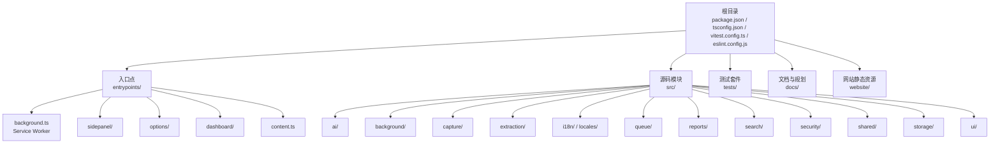
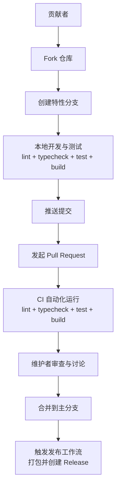
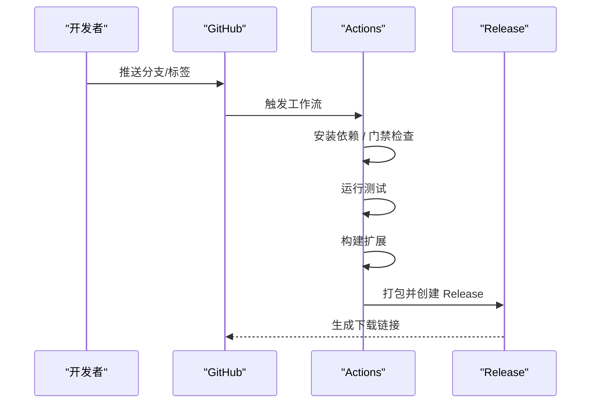
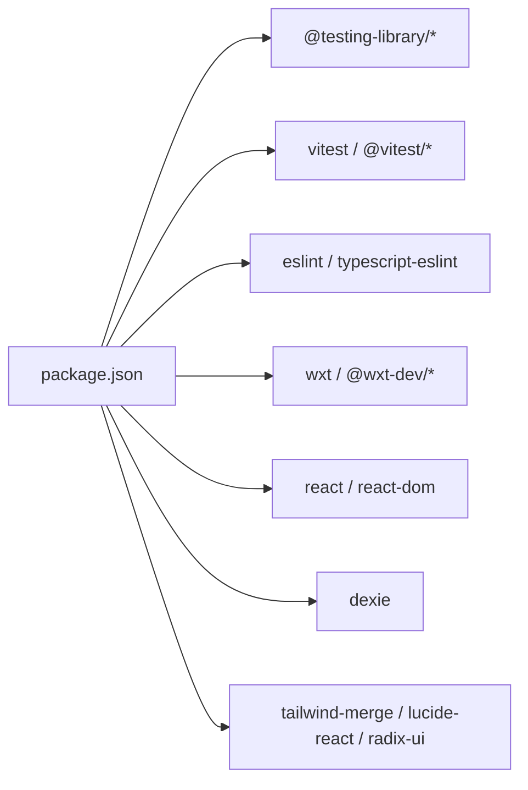

# 贡献指南

<cite>
**本文档引用的文件**
- [README.md](file://README.md)
- [package.json](file://package.json)
- [eslint.config.js](file://eslint.config.js)
- [vitest.config.ts](file://vitest.config.ts)
- [.github/workflows/release.yml](file://.github/workflows/release.yml)
- [.github/workflows/pages.yml](file://.github/workflows/pages.yml)
- [tests/setup.ts](file://tests/setup.ts)
- [docs/testing/manual-phase-1.md](file://docs/testing/manual-phase-1.md)
- [docs/superpowers/plans/2026-06-09-phase-1-mvp.md](file://docs/superpowers/plans/2026-06-09-phase-1-mvp.md)
- [website/README.md](file://website/README.md)
</cite>

## 目录
1. [简介](#简介)
2. [项目结构](#项目结构)
3. [核心组件](#核心组件)
4. [架构总览](#架构总览)
5. [详细组件分析](#详细组件分析)
6. [依赖关系分析](#依赖关系分析)
7. [性能考虑](#性能考虑)
8. [故障排查指南](#故障排查指南)
9. [结论](#结论)
10. [附录](#附录)

## 简介
本指南面向希望参与 BrowseMemory 项目的贡献者，涵盖从 Fork 项目到提交 Pull Request 的完整流程；说明新增功能、Bug 修复与文档改进的贡献方式；定义测试要求与覆盖率标准；解释 CI/CD 流程与自动化测试；提供问题报告与功能请求的模板与流程；说明社区行为准则与沟通规范；给出新贡献者的入门指导与导师制度建议；最后解释许可证与知识产权政策。

## 项目结构
BrowseMemory 是一个基于 WXT 的 Chrome MV3 扩展，采用 React + TypeScript + Vitest + ESLint 的技术栈。项目分为多个入口点与模块化源码目录，测试覆盖广泛，CI/CD 通过 GitHub Actions 实现自动化构建与发布。

图表来源
- [README.md:94-115](file://README.md#L94-L115)
- [package.json:1-49](file://package.json#L1-L49)

章节来源
- [README.md:94-115](file://README.md#L94-L115)
- [package.json:1-49](file://package.json#L1-L49)

## 核心组件
- 开发与构建脚本：提供开发、类型检查、Lint、测试与构建命令，确保本地与 CI 环境一致。
- 测试框架：Vitest + @testing-library，环境为 jsdom，使用 fake-indexeddb 与 setup 文件进行清理。
- 代码质量：ESLint + TypeScript ESLint，规则覆盖 React Hooks 与组件刷新。
- CI/CD：GitHub Actions 工作流负责发布与网站部署，遵循严格门禁（类型检查、Lint、测试、构建）。

章节来源
- [package.json:6-12](file://package.json#L6-L12)
- [vitest.config.ts:1-15](file://vitest.config.ts#L1-L15)
- [eslint.config.js:1-25](file://eslint.config.js#L1-L25)
- [.github/workflows/release.yml:1-58](file://.github/workflows/release.yml#L1-L58)
- [.github/workflows/pages.yml:1-43](file://.github/workflows/pages.yml#L1-L43)

## 架构总览
下图展示了贡献流程的关键节点：Fork → 分支 → 提交 → PR → CI 自动化 → 审查与合并 → 发布。

图表来源
- [.github/workflows/release.yml:1-58](file://.github/workflows/release.yml#L1-L58)
- [README.md:28-46](file://README.md#L28-L46)

## 详细组件分析

### 贡献流程与分支策略
- Fork 项目至个人仓库，创建特性分支用于实现功能、修复或文档改进。
- 本地执行门禁命令：lint、typecheck、test、build，确保通过后再推送。
- 提交 PR 时，描述变更内容、动机与验证方法；必要时附带截图或日志。
- 维护者审查后合并，随后由 CI 触发发布流程。

章节来源
- [README.md:28-46](file://README.md#L28-L46)
- [.github/workflows/release.yml:33-43](file://.github/workflows/release.yml#L33-L43)

### 代码变更类别与要求
- 新增功能：需配套单元测试与集成测试；在 sidepanel、options、background 等入口处进行端到端验证；遵循现有模块边界与命名约定。
- Bug 修复：提供最小可复现测试用例；修复后补充回归测试。
- 文档改进：包括设计文档、测试手册与用户文档；确保示例与实际代码一致。

章节来源
- [docs/testing/manual-phase-1.md:1-67](file://docs/testing/manual-phase-1.md#L1-L67)
- [docs/superpowers/plans/2026-06-09-phase-1-mvp.md:461-518](file://docs/superpowers/plans/2026-06-09-phase-1-mvp.md#L461-L518)

### 测试要求与覆盖率标准
- 单元测试：使用 Vitest 与 @testing-library，环境为 jsdom；使用 fake-indexeddb 与 setup 清理；每个模块均应有对应测试文件。
- 集成测试：覆盖 background 与 UI 的消息协议与交互；模拟 Chrome API 适配器。
- 端到端测试：通过手动验证清单（安装扩展、API 配置、搜索与 RAG、离线回退等）保障用户体验。
- 覆盖率：当前未配置覆盖率阈值，建议逐步引入并设定合理目标（如函数/行/分支/语句覆盖率）。

章节来源
- [vitest.config.ts:1-15](file://vitest.config.ts#L1-L15)
- [tests/setup.ts:1-9](file://tests/setup.ts#L1-L9)
- [docs/testing/manual-phase-1.md:1-67](file://docs/testing/manual-phase-1.md#L1-L67)

### CI/CD 流程与自动化测试
- 发布工作流（release.yml）：在推送标签时触发，执行门禁命令并打包发布。
- 网站部署工作流（pages.yml）：监听 website 目录变更，部署到 GitHub Pages。
- 本地与 CI 环境一致性：使用 pnpm、Node.js 22、固定锁版本与相同脚本。

图表来源
- [.github/workflows/release.yml:1-58](file://.github/workflows/release.yml#L1-L58)

章节来源
- [.github/workflows/release.yml:1-58](file://.github/workflows/release.yml#L1-L58)
- [.github/workflows/pages.yml:1-43](file://.github/workflows/pages.yml#L1-L43)

### 问题报告与功能请求
- 问题报告模板建议包含：环境信息（操作系统、浏览器版本、扩展版本）、重现步骤、期望结果与实际结果、日志或截图。
- 功能请求模板建议包含：背景与动机、期望行为、验收条件、是否可提供示例或草图。

章节来源
- [docs/testing/manual-phase-1.md:20-67](file://docs/testing/manual-phase-1.md#L20-L67)

### 社区行为准则与沟通规范
- 尊重与包容：保持友善、尊重不同观点，避免人身攻击。
- 明确沟通：在 Issue/PR 中清晰描述问题与方案，附带证据与参考。
- 代码审查：积极反馈与接受反馈，聚焦于问题与改进方案。

（本节为通用规范说明，不直接分析具体文件）

### 新贡献者入门与导师制度
- 入门路径：阅读 README 与开发说明，安装依赖并运行 dev/build/test；从简单任务开始（修复拼写、完善测试、文档校对）。
- 导师制度：建议为每位新贡献者指派一位导师，协助理解架构、代码风格与测试规范。

（本节为通用指导说明，不直接分析具体文件）

### 许可证与知识产权政策
- 许可证：请参考项目根目录下的 LICENSE 文件（若存在）。
- 知识产权：贡献即表示同意遵守项目许可证；涉及第三方依赖，请遵循其各自许可证条款。

（本节为通用政策说明，不直接分析具体文件）

## 依赖关系分析
- 开发依赖：ESLint、TypeScript、Vitest、WXT、Testing Library、fake-indexeddb 等。
- 运行依赖：React、Dexie、Tailwind Merge、Radix UI、Lucide React、Mozilla Readability 等。
- 构建与测试：通过 package.json 脚本统一管理，Vitest 配置别名与 jsdom 环境。

图表来源
- [package.json:14-46](file://package.json#L14-L46)

章节来源
- [package.json:14-46](file://package.json#L14-L46)
- [vitest.config.ts:4-8](file://vitest.config.ts#L4-L8)

## 性能考虑
- 构建体积：手动验证清单要求构建总体积低于一定阈值，建议持续关注并优化依赖与打包策略。
- 测试效率：使用 jsdom 与 fake-indexeddb 提升测试速度；避免不必要的全局状态污染。
- 代码质量：通过 ESLint 与 TypeScript 规则减少潜在性能与可维护性问题。

章节来源
- [docs/testing/manual-phase-1.md:12-18](file://docs/testing/manual-phase-1.md#L12-L18)
- [eslint.config.js:16-22](file://eslint.config.js#L16-L22)

## 故障排查指南
- 本地无法运行：确认 Node.js 版本与 pnpm 版本；执行门禁命令定位问题。
- 测试失败：检查 jsdom 环境与 fake-indexeddb 初始化；确保每次测试后清理。
- CI 失败：对照 Actions 日志逐项修复；确保本地与 CI 环境一致。

章节来源
- [README.md:28-46](file://README.md#L28-L46)
- [vitest.config.ts:9-13](file://vitest.config.ts#L9-L13)
- [tests/setup.ts:6-8](file://tests/setup.ts#L6-L8)
- [.github/workflows/release.yml:33-43](file://.github/workflows/release.yml#L33-L43)

## 结论
本指南提供了从流程、测试到 CI/CD 的完整贡献实践，建议新贡献者先从文档与测试入手，逐步深入架构与核心模块。维护者应坚持门禁标准与代码审查，确保质量与一致性。

## 附录
- 网站部署：website 目录通过 pages.yml 自动部署到 GitHub Pages，支持本地预览与自定义域名。

章节来源
- [website/README.md:1-19](file://website/README.md#L1-L19)