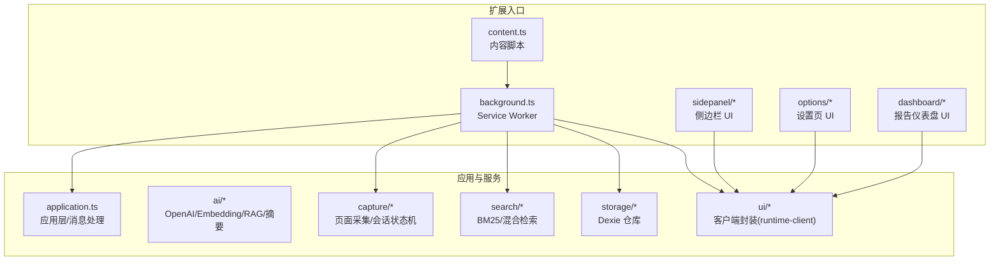
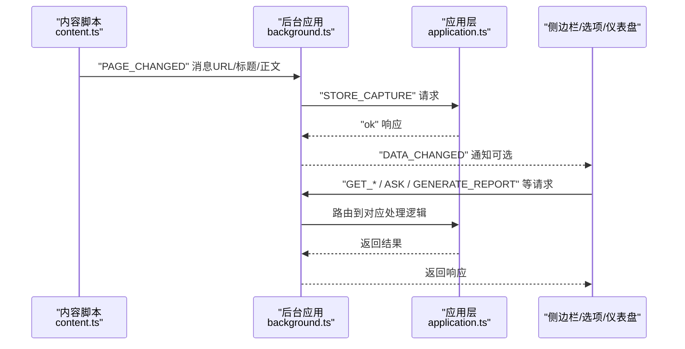
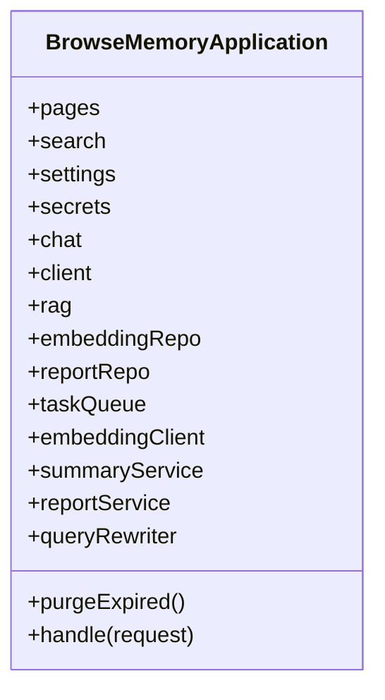
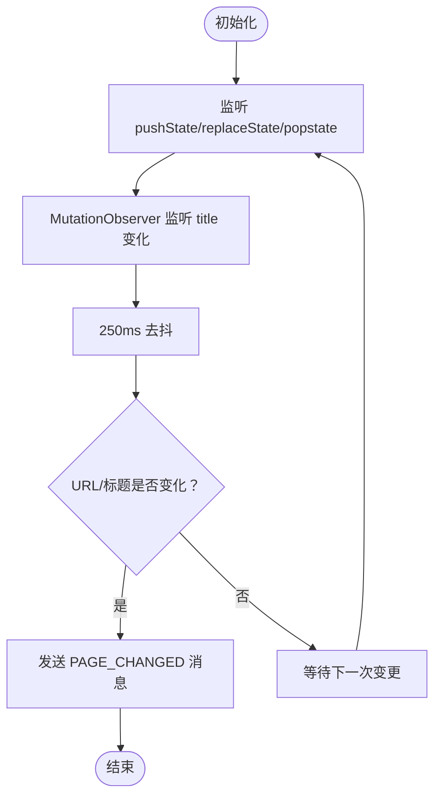
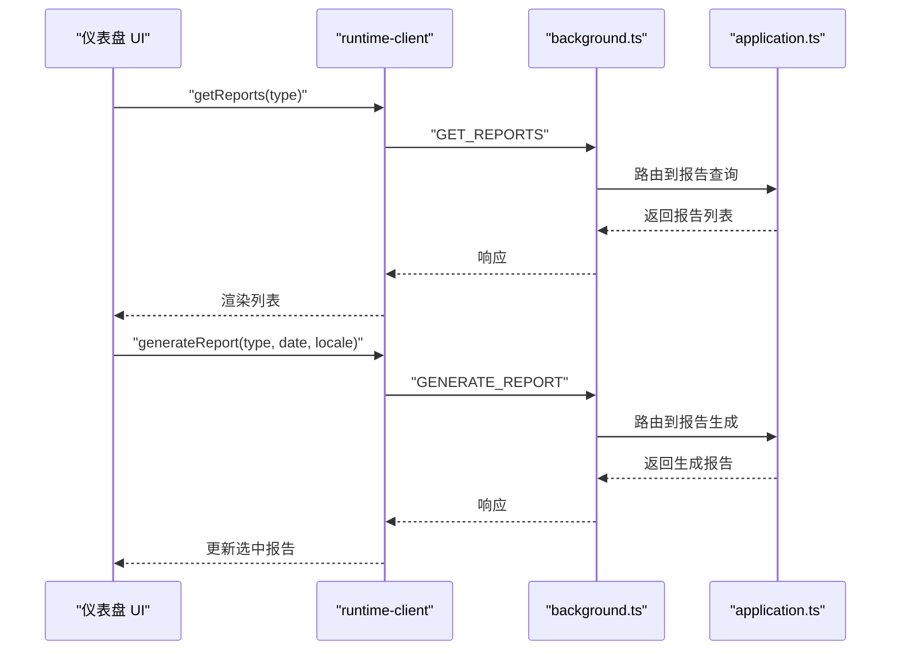
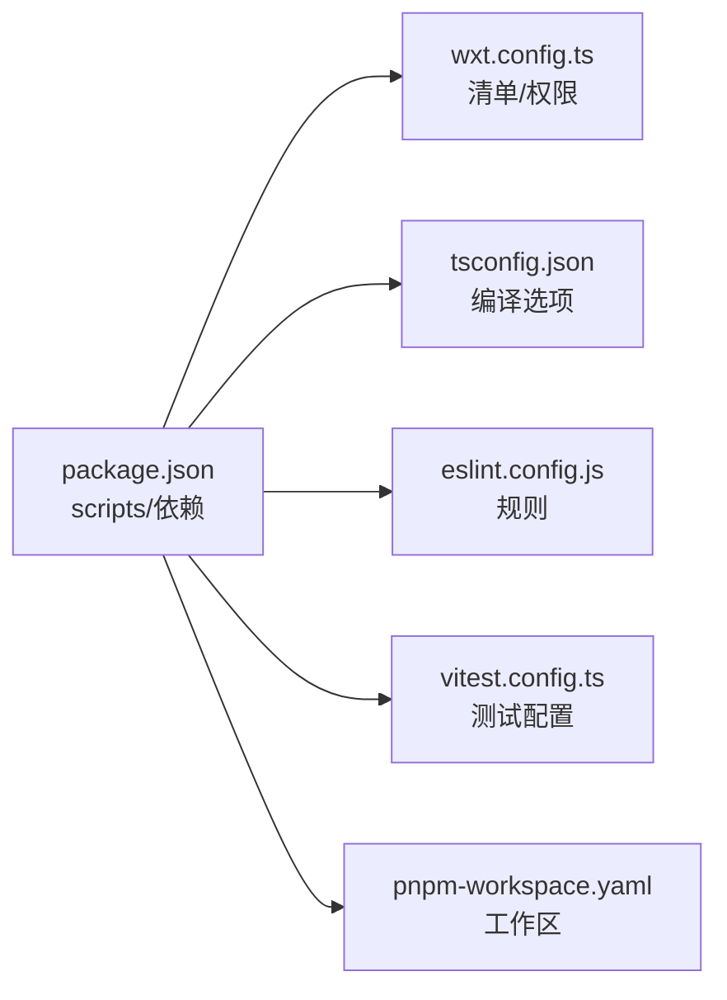

# 快速开始

<cite>
**本文引用的文件**
- [README.md](file://README.md)
- [package.json](file://package.json)
- [wxt.config.ts](file://wxt.config.ts)
- [tsconfig.json](file://tsconfig.json)
- [eslint.config.js](file://eslint.config.js)
- [vitest.config.ts](file://vitest.config.ts)
- [pnpm-workspace.yaml](file://pnpm-workspace.yaml)
- [entrypoints/background.ts](file://entrypoints/background.ts)
- [entrypoints/content.ts](file://entrypoints/content.ts)
- [entrypoints/dashboard/App.tsx](file://entrypoints/dashboard/App.tsx)
- [src/background/application.ts](file://src/background/application.ts)
- [src/ui/runtime-client.ts](file://src/ui/runtime-client.ts)
- [src/i18n/index.tsx](file://src/i18n/index.tsx)
- [tests/setup.ts](file://tests/setup.ts)
- [src/shared/constants.ts](file://src/shared/constants.ts)
</cite>

## 目录
1. [简介](#简介)
2. [项目结构](#项目结构)
3. [核心组件](#核心组件)
4. [架构总览](#架构总览)
5. [详细组件分析](#详细组件分析)
6. [依赖分析](#依赖分析)
7. [性能考虑](#性能考虑)
8. [故障排除指南](#故障排除指南)
9. [结论](#结论)
10. [附录](#附录)

## 简介
本指南面向新手开发者，帮助你在最短时间内完成 BrowseMemory 扩展的环境准备、安装、开发与生产构建，并将未打包扩展安装到 Chrome 浏览器进行调试。项目基于 WXT（Web Extension Toolkit）与 Vite，采用 TypeScript、React 以及 Chrome MV3 Manifest V3 规范。

## 项目结构
- 入口点（MV3 扩展页面与脚本）位于 entrypoints 目录，包含 background service worker、content script、侧边栏、选项页与仪表盘等。
- 业务逻辑与 UI 分层清晰：src/background、src/ai、src/capture、src/search、src/storage、src/ui 等模块分别承担应用层、AI 服务、采集、检索、存储与客户端封装职责。
- 测试位于 tests 目录，使用 Vitest + jsdom 环境；国际化资源在 src/locales 与 src/i18n。
- 工程配置集中在根目录：package.json（脚本与依赖）、tsconfig.json（编译配置）、eslint.config.js（代码规范）、vitest.config.ts（测试配置）、wxt.config.ts（扩展清单与权限）、pnpm-workspace.yaml（工作区设置）。

图表来源
- [entrypoints/background.ts:1-241](file://entrypoints/background.ts#L1-L241)
- [entrypoints/content.ts:1-44](file://entrypoints/content.ts#L1-L44)
- [src/background/application.ts:1-200](file://src/background/application.ts#L1-L200)
- [src/ui/runtime-client.ts:1-182](file://src/ui/runtime-client.ts#L1-L182)

章节来源
- [README.md:28-46](file://README.md#L28-L46)

## 核心组件
- 扩展清单与权限：由 wxt.config.ts 统一定义，包含名称、描述、图标、权限与 host_permissions，以及默认标题等。
- 应用层：BrowseMemoryApplication 聚合并协调页面、搜索、设置、密钥、聊天、RAG、Embedding、摘要、报告与任务队列等能力。
- 内容脚本：监控 SPA 导航事件与 DOM 变化，向 background 发送页面变更消息。
- 客户端封装：runtime-client 提供统一的跨页面通信接口，屏蔽 chrome.runtime.sendMessage 的细节。
- 国际化：i18n 提供多语言解析、回退与本地存储同步，支持从浏览器语言探测默认语言。

章节来源
- [wxt.config.ts:1-19](file://wxt.config.ts#L1-L19)
- [src/background/application.ts:1-200](file://src/background/application.ts#L1-L200)
- [entrypoints/content.ts:1-44](file://entrypoints/content.ts#L1-L44)
- [src/ui/runtime-client.ts:1-182](file://src/ui/runtime-client.ts#L1-L182)
- [src/i18n/index.tsx:1-197](file://src/i18n/index.tsx#L1-L197)

## 架构总览
下面的序列图展示了从内容脚本检测页面变化到 background 应用层处理、再到 UI 展示的关键流程。

图表来源
- [entrypoints/content.ts:1-44](file://entrypoints/content.ts#L1-L44)
- [entrypoints/background.ts:1-241](file://entrypoints/background.ts#L1-L241)
- [src/background/application.ts:1-200](file://src/background/application.ts#L1-L200)

## 详细组件分析

### 组件 A：应用层与消息处理（BrowseMemoryApplication）
- 职责：集中处理来自 UI 的请求，协调数据库、AI 服务、任务队列与报告服务；提供清理过期数据、测试连接等功能。
- 关键流程：根据消息类型分派到不同处理分支，如 STORE_CAPTURE、SEARCH、ASK、GENERATE_REPORT 等。
- 错误处理：统一返回 { ok, code, message }，便于 UI 层捕获与提示。

图表来源
- [src/background/application.ts:1-200](file://src/background/application.ts#L1-L200)

章节来源
- [src/background/application.ts:1-200](file://src/background/application.ts#L1-L200)

### 组件 B：内容脚本与页面采集（content.ts）
- 职责：监听 SPA 导航（pushState/replaceState/popstate）与 DOM 变化（MutationObserver），在节流后向 background 发送 PAGE_CHANGED 消息。
- 关键点：使用定时器去抖，避免频繁触发；对标题变更也做监听。

图表来源
- [entrypoints/content.ts:1-44](file://entrypoints/content.ts#L1-L44)

章节来源
- [entrypoints/content.ts:1-44](file://entrypoints/content.ts#L1-L44)

### 组件 C：仪表盘 UI（dashboard/App.tsx）
- 职责：展示日报/周报/月报，支持生成、切换与 Markdown 渲染；在缺少 API Key 时引导跳转设置页。
- 关键点：使用 runtime-client 与后台通信；Tab 切换时加载对应报告列表；错误处理区分“缺少 Key”与“其他错误”。

图表来源
- [entrypoints/dashboard/App.tsx:1-208](file://entrypoints/dashboard/App.tsx#L1-L208)
- [src/ui/runtime-client.ts:1-182](file://src/ui/runtime-client.ts#L1-L182)
- [entrypoints/background.ts:1-241](file://entrypoints/background.ts#L1-L241)
- [src/background/application.ts:1-200](file://src/background/application.ts#L1-L200)

章节来源
- [entrypoints/dashboard/App.tsx:1-208](file://entrypoints/dashboard/App.tsx#L1-L208)
- [src/ui/runtime-client.ts:1-182](file://src/ui/runtime-client.ts#L1-L182)

## 依赖分析
- 包管理器：pnpm（package.json 指定 packageManager）。
- 构建与开发：WXT 提供开发服务器与打包；Vite 作为底层构建引擎。
- 类型与规范：TypeScript 编译配置继承 .wxt/tsconfig.json；ESLint 配置启用 React Hooks 与 React Refresh 规则；Vitest 配置别名 @ 指向 src。
- 依赖关系：React、Dexie、Radix UI、Lucide React 等运行时依赖；WXT、Vite、TypeScript、ESLint、Vitest 等开发依赖。

图表来源
- [package.json:1-49](file://package.json#L1-L49)
- [wxt.config.ts:1-19](file://wxt.config.ts#L1-L19)
- [tsconfig.json:1-34](file://tsconfig.json#L1-L34)
- [eslint.config.js:1-25](file://eslint.config.js#L1-L25)
- [vitest.config.ts:1-15](file://vitest.config.ts#L1-L15)
- [pnpm-workspace.yaml:1-4](file://pnpm-workspace.yaml#L1-L4)

章节来源
- [package.json:1-49](file://package.json#L1-L49)
- [tsconfig.json:1-34](file://tsconfig.json#L1-L34)
- [eslint.config.js:1-25](file://eslint.config.js#L1-L25)
- [vitest.config.ts:1-15](file://vitest.config.ts#L1-L15)
- [pnpm-workspace.yaml:1-4](file://pnpm-workspace.yaml#L1-L4)

## 性能考虑
- 页面采集节流：内容脚本对导航与 DOM 变化采用去抖，减少频繁的消息发送。
- 任务队列与退避：常量中定义最大重试次数与退避时间，避免瞬时压力。
- 离线与降级：未配置 Embedding 或 API 报错时自动降级为纯 BM25，保证基础功能可用。
- 严格类型与无副作用：TS 严格模式、ESLint React Hooks 规则有助于减少运行时错误与性能隐患。

章节来源
- [entrypoints/content.ts:1-44](file://entrypoints/content.ts#L1-L44)
- [src/shared/constants.ts:1-33](file://src/shared/constants.ts#L1-L33)
- [README.md:126-135](file://README.md#L126-L135)

## 故障排除指南
- Node.js 版本不匹配
  - 症状：安装或启动时报版本错误。
  - 处理：确保使用 Node.js 22+。
  - 参考：README 中的“开发”与“生产构建”段落。
- pnpm 未正确安装或版本过旧
  - 症状：安装依赖失败或工作区异常。
  - 处理：使用 pnpm 11.5.2+；若已有 pnpm，请升级至推荐版本。
  - 参考：package.json 的 packageManager 字段。
- 开发服务器无法启动
  - 症状：执行 pnpm dev 报错。
  - 排查：确认已安装依赖（pnpm install）；检查 tsconfig.json 与 wxt.config.ts 是否存在语法错误；查看终端输出定位具体报错。
- 未打包扩展加载失败
  - 症状：chrome://extensions 加载失败或找不到 .output/chrome-mv3。
  - 处理：先执行 pnpm build，再在扩展页面开启“开发者模式”，选择“.output/chrome-mv3”加载。
  - 参考：README 的“安装未打包扩展”步骤。
- 测试失败或覆盖率缺失
  - 症状：pnpm test 报错或 coverage 目录为空。
  - 处理：确认 Vitest 配置与 setup.ts；确保 tests 目录结构正确；jsdom 环境可用。
  - 参考：vitest.config.ts 与 tests/setup.ts。
- ESLint 报错
  - 症状：pnpm lint 报错。
  - 处理：遵循 React Hooks 与 React Refresh 规则；检查忽略目录（.output、.wxt、coverage、node_modules、website）。
  - 参考：eslint.config.js。
- 生产构建产物路径
  - 症状：找不到构建产物。
  - 处理：构建产物位于 .output/chrome-mv3；确保先执行 pnpm build。
  - 参考：README 的“生产构建”与“安装未打包扩展”。

章节来源
- [README.md:30-56](file://README.md#L30-L56)
- [package.json:1-49](file://package.json#L1-L49)
- [vitest.config.ts:1-15](file://vitest.config.ts#L1-L15)
- [tests/setup.ts:1-9](file://tests/setup.ts#L1-L9)
- [eslint.config.js:1-25](file://eslint.config.js#L1-L25)

## 结论
通过本指南，你可以在本地快速搭建 BrowseMemory 的开发环境，完成依赖安装、开发服务器启动、测试与类型检查、代码规范检查以及生产构建。随后可将构建产物加载到 Chrome 浏览器进行调试，并根据常见问题排查指引解决典型问题。

## 附录

### 环境要求与安装步骤
- 环境要求
  - Node.js 22+
  - pnpm（版本见 package.json 的 packageManager）
- 安装步骤
  1) 克隆项目后进入目录。
  2) 安装依赖：pnpm install
  3) 启动开发服务器：pnpm dev
  4) 在浏览器中访问扩展页面，启用“开发者模式”，加载已解压的扩展（指向 .output/chrome-mv3）。
- 生产构建流程
  - 代码检查：pnpm lint
  - 类型检查：pnpm typecheck
  - 运行测试：pnpm test
  - 生成构建：pnpm build
  - 构建产物：.output/chrome-mv3

章节来源
- [README.md:30-56](file://README.md#L30-L56)
- [package.json:1-49](file://package.json#L1-L49)

### IDE 配置建议与调试技巧
- VS Code
  - 推荐插件：ESLint、TypeScript TSServer、Prettier、Bracket Pair Colorizer。
  - 调试：使用浏览器开发者工具附加到扩展页面；在 background 与 content 脚本断点调试；利用控制台观察 runtime.sendMessage 的消息流转。
- 命令行调试
  - 使用 pnpm dev 启动热重载；在终端关注构建日志与错误提示。
  - 使用 pnpm test -- --watch 持续运行测试；结合 tests/setup.ts 的清理钩子避免残留状态。

章节来源
- [vitest.config.ts:1-15](file://vitest.config.ts#L1-L15)
- [tests/setup.ts:1-9](file://tests/setup.ts#L1-L9)

### 未打包扩展安装到 Chrome 的步骤
1) 先执行 pnpm build。
2) 打开 chrome://extensions。
3) 开启右上角的“开发者模式”。
4) 点击“加载已解压的扩展程序”。
5) 选择项目中的 .output/chrome-mv3。
6) 点击工具栏中的 BrowseMemory 图标打开侧边栏。

章节来源
- [README.md:48-56](file://README.md#L48-L56)

### 常见开发问题与解决方案
- “找不到模块”或“路径别名无效”
  - 处理：确认 tsconfig.json 中 @/* 别名与 baseUrl；确保 Vitest 配置中别名一致。
- “ESLint 报错：only-export-components”
  - 处理：遵循规则，将组件导出限制在允许范围内。
- “测试环境异常（IndexedDB）”
  - 处理：tests/setup.ts 已引入 fake-indexeddb/auto，确保测试环境隔离。
- “构建产物为空或路径不正确”
  - 处理：确认 WXT 输出目录为 .output/chrome-mv3；检查 wxt.config.ts 的 manifest 配置。

章节来源
- [tsconfig.json:1-34](file://tsconfig.json#L1-L34)
- [vitest.config.ts:1-15](file://vitest.config.ts#L1-L15)
- [tests/setup.ts:1-9](file://tests/setup.ts#L1-L9)
- [wxt.config.ts:1-19](file://wxt.config.ts#L1-L19)