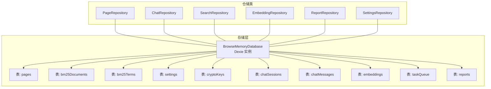
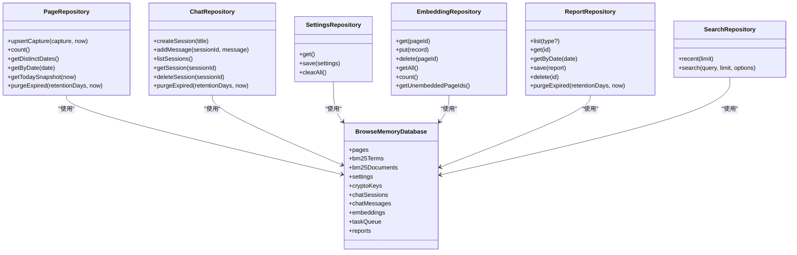
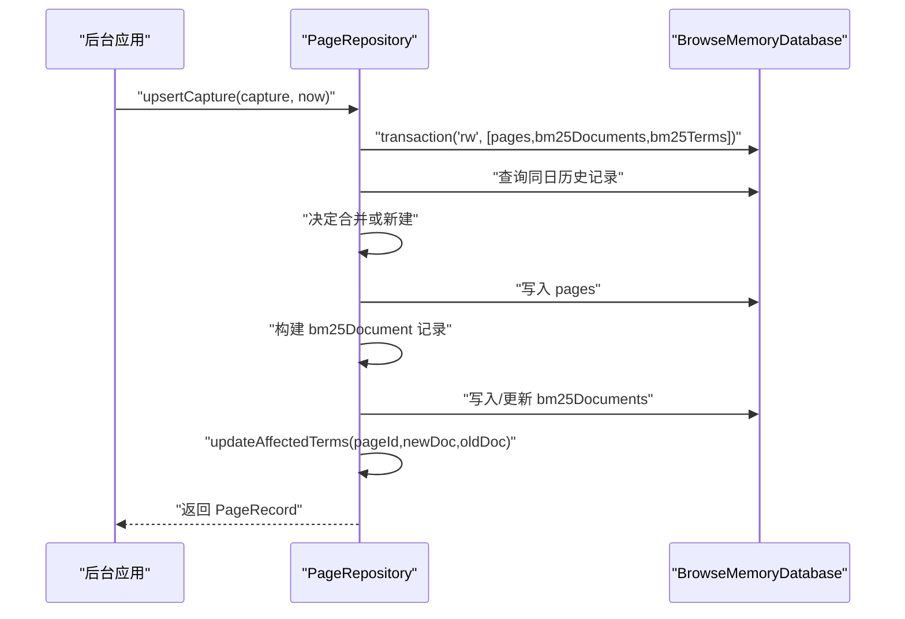
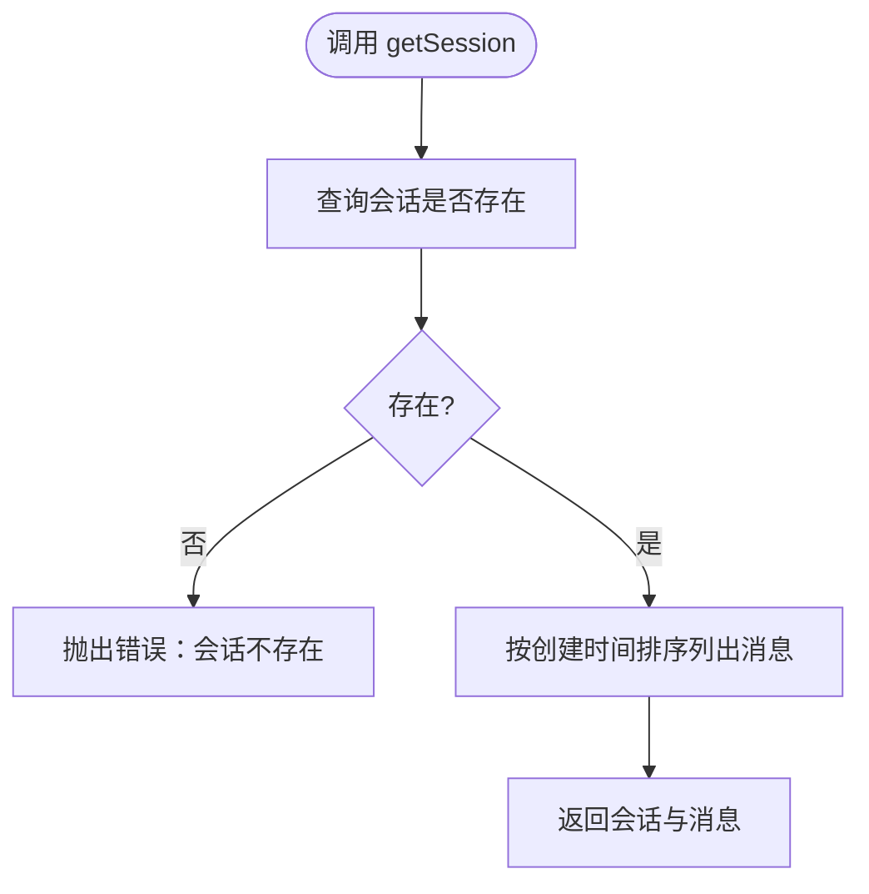
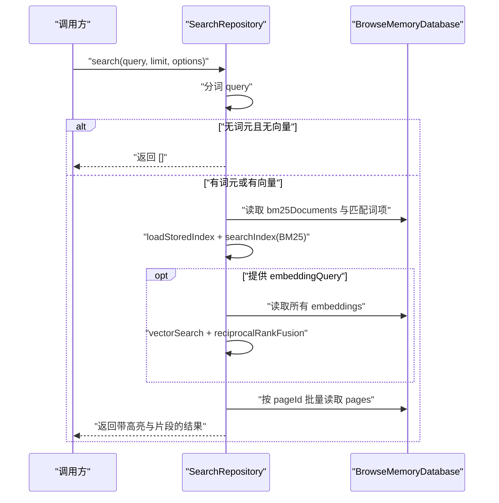
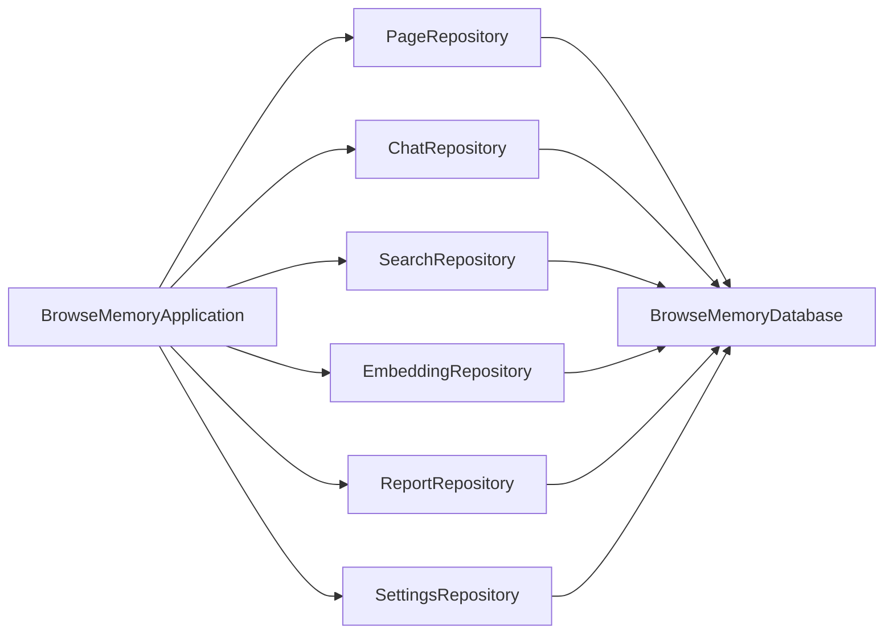

# 仓储模式实现

<cite>
**本文档引用的文件**
- [src/storage/page-repository.ts](file://src/storage/page-repository.ts)
- [src/storage/chat-repository.ts](file://src/storage/chat-repository.ts)
- [src/storage/settings-repository.ts](file://src/storage/settings-repository.ts)
- [src/storage/embedding-repository.ts](file://src/storage/embedding-repository.ts)
- [src/storage/report-repository.ts](file://src/storage/report-repository.ts)
- [src/storage/search-repository.ts](file://src/storage/search-repository.ts)
- [src/storage/database.ts](file://src/storage/database.ts)
- [src/shared/types.ts](file://src/shared/types.ts)
- [src/shared/constants.ts](file://src/shared/constants.ts)
- [src/background/application.ts](file://src/background/application.ts)
- [tests/storage/page-repository.test.ts](file://tests/storage/page-repository.test.ts)
- [tests/storage/chat-repository.test.ts](file://tests/storage/chat-repository.test.ts)
- [tests/storage/settings-repository.test.ts](file://tests/storage/settings-repository.test.ts)
- [tests/storage/embedding-repository.test.ts](file://tests/storage/embedding-repository.test.ts)
- [tests/storage/report-repository.test.ts](file://tests/storage/report-repository.test.ts)
- [tests/storage/search-repository.test.ts](file://tests/storage/search-repository.test.ts)
</cite>

## 目录
1. [简介](#简介)
2. [项目结构](#项目结构)
3. [核心组件](#核心组件)
4. [架构总览](#架构总览)
5. [详细组件分析](#详细组件分析)
6. [依赖关系分析](#依赖关系分析)
7. [性能考量](#性能考量)
8. [故障排查指南](#故障排查指南)
9. [结论](#结论)
10. [附录：自定义仓储实现指南](#附录自定义仓储实现指南)

## 简介
本文件系统性阐述 BrowseMemory 的仓储模式设计与实现，重点覆盖以下方面：
- 仓储模式的设计理念与在项目中的落地方式
- 各仓储类（PageRepository、ChatRepository、SettingsRepository、EmbeddingRepository、ReportRepository、SearchRepository）的功能职责、CRUD 实现与使用方式
- 数据访问逻辑的封装、事务处理与并发控制机制
- 错误处理与异常管理策略
- 最佳实践与扩展指导
- 自定义仓储类的实现步骤与注意事项

## 项目结构
仓储层位于 src/storage 目录，围绕 Dexie 数据库进行抽象，每个仓储类负责一个或多个实体表的数据访问与业务规则封装。数据库版本迁移与表结构定义集中在 database.ts 中。

图表来源
- [src/storage/database.ts:34-76](file://src/storage/database.ts#L34-L76)
- [src/storage/page-repository.ts:43-44](file://src/storage/page-repository.ts#L43-L44)
- [src/storage/chat-repository.ts:8-9](file://src/storage/chat-repository.ts#L8-L9)
- [src/storage/search-repository.ts:15-16](file://src/storage/search-repository.ts#L15-L16)
- [src/storage/embedding-repository.ts:4-5](file://src/storage/embedding-repository.ts#L4-L5)
- [src/storage/report-repository.ts:4-5](file://src/storage/report-repository.ts#L4-L5)
- [src/storage/settings-repository.ts:8-9](file://src/storage/settings-repository.ts#L8-L9)

章节来源
- [src/storage/database.ts:34-76](file://src/storage/database.ts#L34-L76)
- [src/storage/page-repository.ts:43-44](file://src/storage/page-repository.ts#L43-L44)
- [src/storage/chat-repository.ts:8-9](file://src/storage/chat-repository.ts#L8-L9)
- [src/storage/search-repository.ts:15-16](file://src/storage/search-repository.ts#L15-L16)
- [src/storage/embedding-repository.ts:4-5](file://src/storage/embedding-repository.ts#L4-L5)
- [src/storage/report-repository.ts:4-5](file://src/storage/report-repository.ts#L4-L5)
- [src/storage/settings-repository.ts:8-9](file://src/storage/settings-repository.ts#L8-L9)

## 核心组件
- BrowseMemoryDatabase：基于 Dexie 的数据库实例，定义各实体表及版本迁移策略
- PageRepository：页面捕获与索引维护（BM25 文档与词项），支持按日合并、过期清理、今日快照统计
- ChatRepository：聊天会话与消息的增删查改，支持过期清理
- SettingsRepository：应用设置读取与保存，支持一键清空全部数据
- EmbeddingRepository：向量嵌入的存取与未嵌入页面 ID 推导
- ReportRepository：报告的列表、查询、保存、删除与过期清理
- SearchRepository：最近记录与混合检索（BM25 + 向量），结果高亮与片段生成

章节来源
- [src/storage/database.ts:34-76](file://src/storage/database.ts#L34-L76)
- [src/storage/page-repository.ts:43-265](file://src/storage/page-repository.ts#L43-L265)
- [src/storage/chat-repository.ts:8-102](file://src/storage/chat-repository.ts#L8-L102)
- [src/storage/settings-repository.ts:8-57](file://src/storage/settings-repository.ts#L8-L57)
- [src/storage/embedding-repository.ts:4-36](file://src/storage/embedding-repository.ts#L4-L36)
- [src/storage/report-repository.ts:4-40](file://src/storage/report-repository.ts#L4-L40)
- [src/storage/search-repository.ts:15-110](file://src/storage/search-repository.ts#L15-L110)

## 架构总览
仓储层通过构造函数注入数据库实例，向上层提供类型安全的 CRUD 与业务方法。上层应用（如后台服务）组合多个仓储实例，协调业务流程。

图表来源
- [src/storage/database.ts:34-76](file://src/storage/database.ts#L34-L76)
- [src/storage/page-repository.ts:43-265](file://src/storage/page-repository.ts#L43-L265)
- [src/storage/chat-repository.ts:8-102](file://src/storage/chat-repository.ts#L8-L102)
- [src/storage/settings-repository.ts:8-57](file://src/storage/settings-repository.ts#L8-L57)
- [src/storage/embedding-repository.ts:4-36](file://src/storage/embedding-repository.ts#L4-L36)
- [src/storage/report-repository.ts:4-40](file://src/storage/report-repository.ts#L4-L40)
- [src/storage/search-repository.ts:15-110](file://src/storage/search-repository.ts#L15-L110)

## 详细组件分析

### PageRepository（页面仓储）
- 职责
  - 将页面捕获数据写入 pages 表，并同步维护 bm25Documents 与 bm25Terms 倒排索引
  - 按日合并同一 URL 的多次访问，避免重复存储
  - 提供今日统计、按日期查询、计数、过期清理等能力
- 关键方法
  - upsertCapture：事务内执行合并与索引增量更新
  - purgeExpired：清理过期内容并同步更新倒排索引
  - getTodaySnapshot、getDistinctDates、getByDate、count
- 事务与并发
  - 使用数据库事务包裹跨表写入，确保索引一致性
  - 增量更新词项时逐条处理，保持事务活跃
- 复杂度
  - upsertCapture：O(k) 词项差异更新，k 为新增/变更词项数量
  - purgeExpired：O(n+m)，n 为过期页数量，m 为涉及的词项数量

图表来源
- [src/storage/page-repository.ts:46-103](file://src/storage/page-repository.ts#L46-L103)
- [src/storage/page-repository.ts:203-263](file://src/storage/page-repository.ts#L203-L263)

章节来源
- [src/storage/page-repository.ts:43-265](file://src/storage/page-repository.ts#L43-L265)
- [tests/storage/page-repository.test.ts:19-51](file://tests/storage/page-repository.test.ts#L19-L51)
- [tests/storage/page-repository.test.ts:53-138](file://tests/storage/page-repository.test.ts#L53-L138)
- [tests/storage/page-repository.test.ts:140-239](file://tests/storage/page-repository.test.ts#L140-L239)

### ChatRepository（聊天仓储）
- 职责
  - 会话与消息的创建、查询、删除
  - 过期清理：删除超期会话及其消息
- 关键方法
  - createSession、addMessage、listSessions、getSession、deleteSession、purgeExpired
- 并发与事务
  - 删除会话时使用事务保证会话与消息的一致性
- 异常处理
  - 查询不存在会话时抛出明确错误信息

图表来源
- [src/storage/chat-repository.ts:73-86](file://src/storage/chat-repository.ts#L73-L86)

章节来源
- [src/storage/chat-repository.ts:8-102](file://src/storage/chat-repository.ts#L8-L102)
- [tests/storage/chat-repository.test.ts:55-57](file://tests/storage/chat-repository.test.ts#L55-L57)
- [tests/storage/chat-repository.test.ts:63-91](file://tests/storage/chat-repository.test.ts#L63-L91)

### SettingsRepository（设置仓储）
- 职责
  - 应用设置的读取与保存，合并默认值
  - 清空全部应用数据（多表事务）
- 关键方法
  - get、save、clearAll
- 默认值与持久化
  - 从 DEFAULT_SETTINGS 合并存储值，确保字段完整性

章节来源
- [src/storage/settings-repository.ts:8-57](file://src/storage/settings-repository.ts#L8-L57)
- [src/shared/constants.ts:12-24](file://src/shared/constants.ts#L12-L24)
- [tests/storage/settings-repository.test.ts:19-34](file://tests/storage/settings-repository.test.ts#L19-L34)

### EmbeddingRepository（嵌入仓储）
- 职责
  - 向量嵌入的增删查改
  - 计算未嵌入页面 ID 列表，用于批量回填任务
- 关键方法
  - get、put、delete、getAll、count、getUnembeddedPageIds
- 性能
  - getUnembeddedPageIds 并行读取 pages 与 embeddings 的主键集合，再做差集计算

章节来源
- [src/storage/embedding-repository.ts:4-36](file://src/storage/embedding-repository.ts#L4-L36)
- [tests/storage/embedding-repository.test.ts:53-76](file://tests/storage/embedding-repository.test.ts#L53-L76)

### ReportRepository（报告仓储）
- 职责
  - 报告的列表、按类型/日期查询、保存、删除与过期清理
- 关键方法
  - list、get、getByDate、save、delete、purgeExpired
- 数据模型
  - ReportRecord 包含类型、日期、标题、内容、主题、页数与创建时间

章节来源
- [src/storage/report-repository.ts:4-40](file://src/storage/report-repository.ts#L4-L40)
- [src/shared/types.ts:129-138](file://src/shared/types.ts#L129-L138)
- [tests/storage/report-repository.test.ts:34-80](file://tests/storage/report-repository.test.ts#L34-L80)

### SearchRepository（搜索仓储）
- 职责
  - 最近浏览记录与混合检索（BM25 + 可选向量）
  - 结果高亮与片段生成
- 关键方法
  - recent、search
- 检索流程
  - 对空查询直接返回空结果
  - 加载已存储的 BM25 索引并执行检索
  - 若提供向量查询，则与 BM25 结果进行重排融合

图表来源
- [src/storage/search-repository.ts:35-108](file://src/storage/search-repository.ts#L35-L108)

章节来源
- [src/storage/search-repository.ts:15-110](file://src/storage/search-repository.ts#L15-L110)
- [tests/storage/search-repository.test.ts:18-37](file://tests/storage/search-repository.test.ts#L18-L37)
- [tests/storage/search-repository.test.ts:39-54](file://tests/storage/search-repository.test.ts#L39-L54)

## 依赖关系分析
- 组件耦合
  - 各仓储类均依赖 BrowseMemoryDatabase，通过构造函数注入
  - 上层应用（如 BrowseMemoryApplication）聚合多个仓储，形成领域服务组合
- 外部依赖
  - Dexie 提供 IndexedDB 的 ORM 能力
  - 搜索模块依赖 BM25 与混合检索工具
- 版本迁移
  - 数据库版本逐步增加新表，确保平滑升级

图表来源
- [src/background/application.ts:29-63](file://src/background/application.ts#L29-L63)
- [src/storage/database.ts:34-76](file://src/storage/database.ts#L34-L76)

章节来源
- [src/background/application.ts:29-63](file://src/background/application.ts#L29-L63)
- [src/storage/database.ts:34-76](file://src/storage/database.ts#L34-L76)

## 性能考量
- 索引维护
  - PageRepository 在 upsert 时采用增量更新倒排索引，避免重建整个索引，降低写放大
- 并行查询
  - SearchRepository 在检索时并行加载文档与匹配词项，提升检索吞吐
- 批量操作
  - ChatRepository 与 ReportRepository 在过期清理中使用批量删除，减少事务开销
- 内存与 IO
  - EmbeddingRepository 的 getUnembeddedPageIds 使用集合差集计算，适合大体量数据场景

[本节为通用性能建议，不直接分析具体文件]

## 故障排查指南
- 会话不存在
  - 现象：调用 getSession 时抛出“会话不存在”
  - 处理：确认 sessionId 是否正确，或检查是否已被清理
  - 参考
    - [src/storage/chat-repository.ts:73-86](file://src/storage/chat-repository.ts#L73-L86)
    - [tests/storage/chat-repository.test.ts:55-57](file://tests/storage/chat-repository.test.ts#L55-L57)
- 过期清理无效
  - 现象：purgeExpired 返回 0 或未清理预期数据
  - 排查：确认 retentionDays 设置与当前时间戳；检查 updatedAt 字段是否更新
  - 参考
    - [src/storage/page-repository.ts:148-197](file://src/storage/page-repository.ts#L148-L197)
    - [src/storage/chat-repository.ts:46-71](file://src/storage/chat-repository.ts#L46-L71)
    - [src/storage/report-repository.ts:30-38](file://src/storage/report-repository.ts#L30-L38)
- 检索无结果
  - 现象：search 返回空数组
  - 排查：确认 query 分词后非空；检查 bm25Documents 是否存在；若启用向量，确认 embeddingQuery 是否成功生成
  - 参考
    - [src/storage/search-repository.ts:35-43](file://src/storage/search-repository.ts#L35-L43)
    - [tests/storage/search-repository.test.ts:18-37](file://tests/storage/search-repository.test.ts#L18-L37)
- 增量索引不同步
  - 现象：更新页面后词项频率或文档频率异常
  - 排查：确认 updateAffectedTerms 的词项差异计算逻辑；检查事务是否完整提交
  - 参考
    - [src/storage/page-repository.ts:203-263](file://src/storage/page-repository.ts#L203-L263)
    - [tests/storage/page-repository.test.ts:74-98](file://tests/storage/page-repository.test.ts#L74-L98)

章节来源
- [src/storage/chat-repository.ts:73-86](file://src/storage/chat-repository.ts#L73-L86)
- [tests/storage/chat-repository.test.ts:55-57](file://tests/storage/chat-repository.test.ts#L55-L57)
- [src/storage/page-repository.ts:148-197](file://src/storage/page-repository.ts#L148-L197)
- [src/storage/chat-repository.ts:46-71](file://src/storage/chat-repository.ts#L46-L71)
- [src/storage/report-repository.ts:30-38](file://src/storage/report-repository.ts#L30-L38)
- [src/storage/search-repository.ts:35-43](file://src/storage/search-repository.ts#L35-L43)
- [tests/storage/search-repository.test.ts:18-37](file://tests/storage/search-repository.test.ts#L18-L37)
- [src/storage/page-repository.ts:203-263](file://src/storage/page-repository.ts#L203-L263)
- [tests/storage/page-repository.test.ts:74-98](file://tests/storage/page-repository.test.ts#L74-L98)

## 结论
仓储模式在 BrowseMemory 中有效封装了数据访问与业务规则，通过事务与增量更新保障一致性与性能。各仓储职责清晰、接口统一，便于上层应用组合使用。结合测试用例可验证核心行为，建议在扩展新功能时遵循现有模式，优先考虑事务、索引与批量操作的优化。

[本节为总结性内容，不直接分析具体文件]

## 附录：自定义仓储实现指南
- 设计原则
  - 单一职责：每个仓储聚焦一组相关实体与业务规则
  - 明确接口：对外暴露清晰的 CRUD 与业务方法
  - 事务边界：跨表写入必须在事务中完成
  - 并发安全：避免长事务阻塞，必要时拆分批处理
- 实现步骤
  - 定义实体表与索引：在 database.ts 中声明表结构与索引
  - 编写仓储类：在 src/storage 下新增文件，接收数据库实例作为依赖
  - 实现 CRUD 与业务方法：优先使用事务包裹复杂写入
  - 编写测试：在 tests/storage 下新增对应测试文件，覆盖关键路径
- 最佳实践
  - 使用增量更新维护倒排索引（参考 PageRepository）
  - 对于批量删除/清理，使用 bulkDelete 并行处理
  - 对外暴露的查询方法尽量返回扁平结果，避免深层嵌套
  - 对异常进行显式处理并提供可读错误信息
- 扩展建议
  - 新增表时同步更新数据库版本迁移
  - 如需向量检索，提供 getUnembeddedPageIds 等辅助方法
  - 为高频查询建立合适索引，平衡写入与读取性能

[本节为通用指导，不直接分析具体文件]