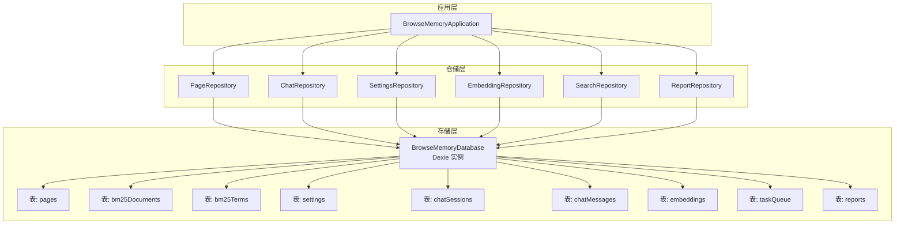
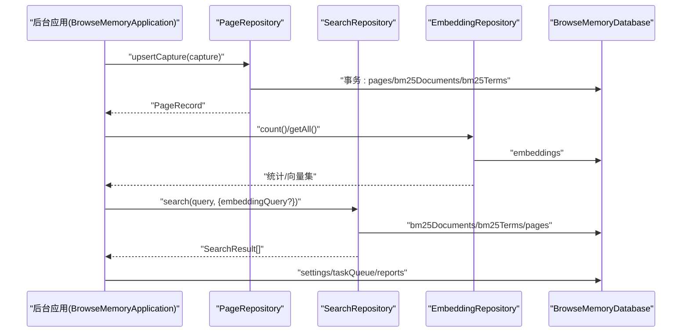
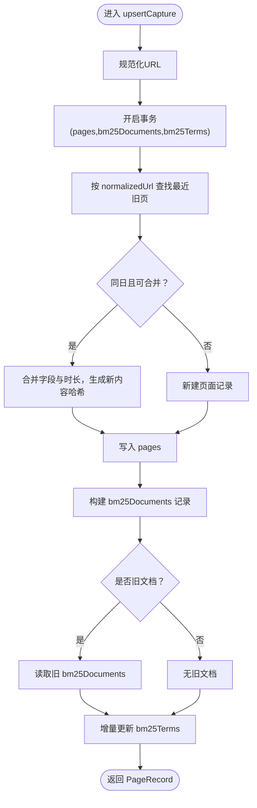
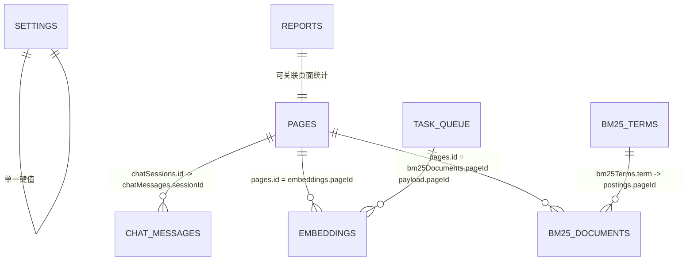
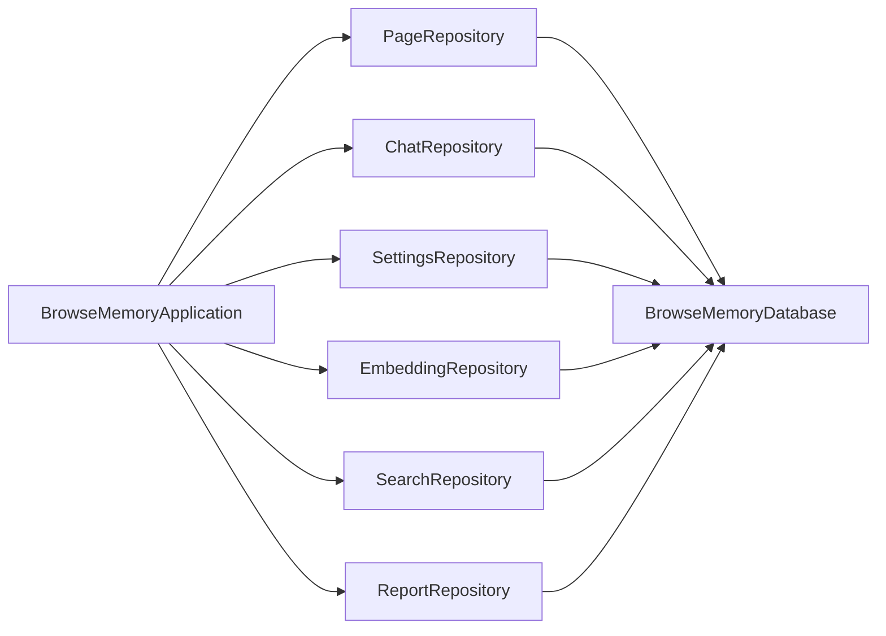

# 数据存储系统

<cite>
**本文引用的文件**
- [src/storage/database.ts](file://src/storage/database.ts)
- [src/storage/page-repository.ts](file://src/storage/page-repository.ts)
- [src/storage/chat-repository.ts](file://src/storage/chat-repository.ts)
- [src/storage/settings-repository.ts](file://src/storage/settings-repository.ts)
- [src/storage/embedding-repository.ts](file://src/storage/embedding-repository.ts)
- [src/storage/search-repository.ts](file://src/storage/search-repository.ts)
- [src/storage/report-repository.ts](file://src/storage/report-repository.ts)
- [src/shared/types.ts](file://src/shared/types.ts)
- [src/shared/constants.ts](file://src/shared/constants.ts)
- [src/search/bm25.ts](file://src/search/bm25.ts)
- [src/search/hybrid-search.ts](file://src/search/hybrid-search.ts)
- [src/background/application.ts](file://src/background/application.ts)
- [src/capture/session-machine.ts](file://src/capture/session-machine.ts)
- [tests/storage/page-repository.test.ts](file://tests/storage/page-repository.test.ts)
- [tests/storage/chat-repository.test.ts](file://tests/storage/chat-repository.test.ts)
- [tests/storage/settings-repository.test.ts](file://tests/storage/settings-repository.test.ts)
</cite>

## 目录
1. [简介](#简介)
2. [项目结构](#项目结构)
3. [核心组件](#核心组件)
4. [架构总览](#架构总览)
5. [详细组件分析](#详细组件分析)
6. [依赖关系分析](#依赖关系分析)
7. [性能考量](#性能考量)
8. [故障排查指南](#故障排查指南)
9. [结论](#结论)
10. [附录](#附录)

## 简介
本文件面向数据库管理员与应用开发者，系统性阐述 BrowseMemory 的数据存储体系：以 Dexie 封装的 IndexedDB 为核心，结合仓储模式（Repository Pattern）组织各领域数据访问逻辑；围绕 Page、Capture、Embedding 等核心实体构建数据库模式与索引策略；覆盖本地持久化优化、数据清理与归档、数据迁移与版本管理、备份与恢复建议，以及扩展与自定义存储的最佳实践。

## 项目结构
存储子系统采用“数据库定义 + 领域仓储”的分层组织：
- 数据库定义：集中于数据库类与表结构版本迁移脚本
- 领域仓储：按功能域拆分，如页面、聊天、设置、嵌入、检索、报告等
- 搜索与算法：BM25 倒排索引与混合检索策略
- 应用集成：后台应用服务统一编排仓储与任务队列

图表来源
- [src/storage/database.ts:34-79](file://src/storage/database.ts#L34-L79)
- [src/storage/page-repository.ts:43-44](file://src/storage/page-repository.ts#L43-L44)
- [src/storage/chat-repository.ts:8-9](file://src/storage/chat-repository.ts#L8-L9)
- [src/storage/settings-repository.ts:8-9](file://src/storage/settings-repository.ts#L8-L9)
- [src/storage/embedding-repository.ts:4-5](file://src/storage/embedding-repository.ts#L4-L5)
- [src/storage/search-repository.ts:15-16](file://src/storage/search-repository.ts#L15-L16)
- [src/storage/report-repository.ts:4-5](file://src/storage/report-repository.ts#L4-L5)
- [src/background/application.ts:29-63](file://src/background/application.ts#L29-L63)

章节来源
- [src/storage/database.ts:34-79](file://src/storage/database.ts#L34-L79)
- [src/background/application.ts:29-63](file://src/background/application.ts#L29-L63)

## 核心组件
- 数据库与表结构
  - 数据库类继承 Dexie，声明各表及其主键类型
  - 版本迁移脚本定义初始表集合，并逐步引入聊天、嵌入、任务队列、报告等表
- 仓储模式
  - PageRepository：页面捕获合并、倒排索引增量更新、过期清理
  - ChatRepository：会话与消息的增删查改、过期清理
  - SettingsRepository：应用设置读写与一键清空
  - EmbeddingRepository：向量嵌入的存取与未嵌入页面发现
  - SearchRepository：最近记录与混合检索（BM25 + 向量）
  - ReportRepository：报告列表、查询、保存、删除与过期清理
- 搜索与索引
  - BM25 文档/词项倒排结构与增量维护
  - 向量相似度与 RRF 融合策略

章节来源
- [src/storage/database.ts:34-79](file://src/storage/database.ts#L34-L79)
- [src/storage/page-repository.ts:43-265](file://src/storage/page-repository.ts#L43-L265)
- [src/storage/chat-repository.ts:8-102](file://src/storage/chat-repository.ts#L8-L102)
- [src/storage/settings-repository.ts:8-57](file://src/storage/settings-repository.ts#L8-L57)
- [src/storage/embedding-repository.ts:4-36](file://src/storage/embedding-repository.ts#L4-L36)
- [src/storage/search-repository.ts:15-110](file://src/storage/search-repository.ts#L15-L110)
- [src/storage/report-repository.ts:4-40](file://src/storage/report-repository.ts#L4-L40)
- [src/search/bm25.ts:46-166](file://src/search/bm25.ts#L46-L166)
- [src/search/hybrid-search.ts:35-78](file://src/search/hybrid-search.ts#L35-L78)

## 架构总览
下图展示从后台应用到仓储再到数据库的调用链路，以及关键数据流（页面捕获、嵌入与摘要任务、混合检索）：

图表来源
- [src/background/application.ts:46-63](file://src/background/application.ts#L46-L63)
- [src/storage/page-repository.ts:46-103](file://src/storage/page-repository.ts#L46-L103)
- [src/storage/search-repository.ts:35-108](file://src/storage/search-repository.ts#L35-L108)
- [src/storage/embedding-repository.ts:7-21](file://src/storage/embedding-repository.ts#L7-L21)
- [src/storage/database.ts:34-44](file://src/storage/database.ts#L34-L44)

## 详细组件分析

### 数据库与表结构（Dexie + IndexedDB）
- 表与索引
  - pages：主键 id；二级索引 normalizedUrl、visitDate、domain、updatedAt
  - bm25Documents：主键 pageId；用于 BM25 文档级频率与长度
  - bm25Terms：主键 term；记录文档频率与倒排 postings
  - settings：主键 key；存储应用设置
  - chatSessions：主键 id；索引 createdAt、updatedAt
  - chatMessages：主键 id；索引 sessionId、createdAt
  - embeddings：主键 pageId；存储向量、模型与创建时间
  - taskQueue：主键 id；索引 status、type
  - reports：主键 id；索引 type、date
- 版本迁移
  - v1/v2/v3 逐步引入聊天、嵌入、任务队列、报告等表，保持向后兼容

章节来源
- [src/storage/database.ts:34-79](file://src/storage/database.ts#L34-L79)

### PageRepository：页面捕获与倒排索引
- 功能要点
  - 合并与去重：按 normalizedUrl 与当日聚合，合并阅读时长与内容哈希
  - 倒排索引增量更新：仅对受影响词项进行增删改，避免重建全文索引
  - 过期清理：按 updatedAt 截止时间清理内容并同步更新倒排
  - 快照统计：按日统计页面数、阅读分钟、深度阅读数与热门域名
- 关键流程（upsert 与增量索引）

图表来源
- [src/storage/page-repository.ts:46-103](file://src/storage/page-repository.ts#L46-L103)
- [src/storage/page-repository.ts:203-263](file://src/storage/page-repository.ts#L203-L263)

章节来源
- [src/storage/page-repository.ts:43-265](file://src/storage/page-repository.ts#L43-L265)
- [tests/storage/page-repository.test.ts:19-51](file://tests/storage/page-repository.test.ts#L19-L51)
- [tests/storage/page-repository.test.ts:53-138](file://tests/storage/page-repository.test.ts#L53-L138)
- [tests/storage/page-repository.test.ts:140-239](file://tests/storage/page-repository.test.ts#L140-L239)

### ChatRepository：会话与消息
- 功能要点
  - 创建会话、追加消息、列出会话（按更新时间倒序）、按会话拉取消息
  - 过期清理：删除超时会话及其消息
  - 删除会话：级联删除消息
- 使用场景
  - 与后台应用协作，支持多轮对话与上下文历史

章节来源
- [src/storage/chat-repository.ts:8-102](file://src/storage/chat-repository.ts#L8-L102)
- [tests/storage/chat-repository.test.ts:19-57](file://tests/storage/chat-repository.test.ts#L19-L57)
- [tests/storage/chat-repository.test.ts:59-98](file://tests/storage/chat-repository.test.ts#L59-L98)

### SettingsRepository：应用设置
- 功能要点
  - 读取默认设置与持久化值的合并
  - 保存部分设置并返回最新配置
  - 清空所有应用数据（跨表事务）
- 默认设置来源于常量模块

章节来源
- [src/storage/settings-repository.ts:8-57](file://src/storage/settings-repository.ts#L8-L57)
- [src/shared/constants.ts:12-24](file://src/shared/constants.ts#L12-L24)
- [tests/storage/settings-repository.test.ts:19-35](file://tests/storage/settings-repository.test.ts#L19-L35)

### EmbeddingRepository：向量嵌入
- 功能要点
  - 获取/写入/删除单条嵌入
  - 列出全部嵌入与计数
  - 发现未嵌入页面 ID（与 pages 对比）

章节来源
- [src/storage/embedding-repository.ts:4-36](file://src/storage/embedding-repository.ts#L4-L36)

### SearchRepository：混合检索
- 功能要点
  - 最近记录：按更新时间倒序返回
  - 混合检索：BM25 + 可选向量（余弦相似度）+ RRF 融合
  - 结果高亮：基于查询词构建片段与高亮范围
- 索引加载与搜索
  - 从 bm25Documents 与 bm25Terms 加载倒排索引，执行 BM25 排序
  - 若提供向量查询，再与向量结果融合

章节来源
- [src/storage/search-repository.ts:15-110](file://src/storage/search-repository.ts#L15-L110)
- [src/search/bm25.ts:46-166](file://src/search/bm25.ts#L46-L166)
- [src/search/hybrid-search.ts:35-78](file://src/search/hybrid-search.ts#L35-L78)

### ReportRepository：报告
- 功能要点
  - 列表、按类型过滤、按日期查询、保存、删除
  - 过期清理：按创建时间截断

章节来源
- [src/storage/report-repository.ts:4-40](file://src/storage/report-repository.ts#L4-L40)

### 数据模型与关系
- 核心实体
  - PageRecord：页面元数据与内容摘要
  - ChatSessionRecord / ChatMessageRecord：会话与消息
  - EmbeddingRecord：页面向量
  - TaskRecord：异步任务（嵌入、摘要、报告）
  - ReportRecord：每日/周/月报告
- 关系示意

图表来源
- [src/shared/types.ts:32-138](file://src/shared/types.ts#L32-L138)
- [src/storage/database.ts:34-44](file://src/storage/database.ts#L34-L44)

## 依赖关系分析
- 组件耦合
  - 仓储均依赖数据库实例，彼此低耦合
  - 后台应用统一编排仓储与外部服务（AI、嵌入、任务队列）
- 外部依赖
  - Dexie（IndexedDB ORM）
  - 浏览器存储配额估算接口（用于容量监控）

图表来源
- [src/background/application.ts:29-63](file://src/background/application.ts#L29-L63)
- [src/storage/database.ts:34-44](file://src/storage/database.ts#L34-L44)

章节来源
- [src/background/application.ts:29-63](file://src/background/application.ts#L29-L63)

## 性能考量
- 查询优化
  - 使用二级索引：pages(normalizedUrl/visitDate/domain/updatedAt)、chatSessions(createdAt/updatedAt)、chatMessages(sessionId/createdAt)、embeddings(pageId)、taskQueue(status,type)、reports(type/date)
  - 混合检索：BM25 通过倒排索引快速筛选候选，向量检索采用暴力匹配（适用于中小规模）
- 写入优化
  - 事务批量写入：页面合并与倒排更新在单事务中完成，保证一致性与性能
  - 增量索引：仅对受影响词项更新，避免全量重建
- 存储与内存
  - 过期清理：按 updatedAt 或 createdAt 截止时间清理，释放空间
  - 设置默认保留天数：便于统一策略

章节来源
- [src/storage/database.ts:48-76](file://src/storage/database.ts#L48-L76)
- [src/storage/page-repository.ts:46-103](file://src/storage/page-repository.ts#L46-L103)
- [src/storage/search-repository.ts:35-108](file://src/storage/search-repository.ts#L35-L108)
- [src/shared/constants.ts:10](file://src/shared/constants.ts#L10)

## 故障排查指南
- 页面过期清理无效
  - 检查 retentionDays 设置与当前时间戳计算
  - 确认事务内对 bm25Documents 与 bm25Terms 的同步更新
- 倒排索引不一致
  - 确保在 upsert 与合并路径中都调用增量更新函数
  - 核验 postings 中是否存在已删除页面的残留
- 混合检索为空
  - 确认 bm25Documents 与 bm25Terms 是否存在
  - 若启用向量，确认 embeddings 已存在且向量维度正确
- 会话清理异常
  - 确认过期截止时间计算与会话/消息的更新时间

章节来源
- [tests/storage/page-repository.test.ts:140-239](file://tests/storage/page-repository.test.ts#L140-L239)
- [tests/storage/chat-repository.test.ts:59-98](file://tests/storage/chat-repository.test.ts#L59-L98)
- [src/storage/page-repository.ts:148-197](file://src/storage/page-repository.ts#L148-L197)
- [src/storage/chat-repository.ts:46-71](file://src/storage/chat-repository.ts#L46-L71)

## 结论
该存储系统以 Dexie + IndexedDB 为基础，采用仓储模式清晰分离业务逻辑，配合 BM25 倒排索引与可选向量检索，实现了高效、可扩展的本地知识库。通过事务与增量更新保障一致性与性能，结合统一的过期策略与默认设置，满足长期运行与资源控制需求。建议在生产环境中持续关注浏览器存储配额与索引大小，必要时引入压缩或分片策略。

## 附录

### 数据持久化策略
- 本地存储优化
  - 使用二级索引加速查询
  - 事务批处理写入
  - 增量索引与内容哈希减少重复
- 数据同步机制
  - 通过后台应用统一调度，结合任务队列异步处理嵌入与摘要
  - 会话与消息通过仓储直接持久化，支持离线场景

章节来源
- [src/storage/page-repository.ts:46-103](file://src/storage/page-repository.ts#L46-L103)
- [src/storage/chat-repository.ts:11-37](file://src/storage/chat-repository.ts#L11-L37)
- [src/background/application.ts:74-352](file://src/background/application.ts#L74-L352)

### 数据访问模式与查询优化
- 常用查询模式
  - 按日期范围查询页面：利用 visitDate 索引
  - 按会话查询消息：利用 sessionId 索引
  - 检索：先 BM25 候选，再向量融合
- 优化建议
  - 控制向量维度与数量，避免大规模暴力搜索
  - 合理设置保留天数，定期清理

章节来源
- [src/storage/database.ts:48-76](file://src/storage/database.ts#L48-L76)
- [src/storage/search-repository.ts:35-108](file://src/storage/search-repository.ts#L35-L108)

### 数据迁移与版本管理
- 版本迁移策略
  - 逐版本增加表与索引，保持前一版本结构不变
  - 在迁移脚本中一次性声明目标表结构，避免运行时变更
- 迁移注意事项
  - 新增表时确保事务边界覆盖相关写入
  - 迁移后验证索引与查询路径

章节来源
- [src/storage/database.ts:48-76](file://src/storage/database.ts#L48-L76)

### 数据清理与归档策略
- 清理策略
  - 按 updatedAt（页面）或 createdAt（聊天/报告）设定截止时间
  - 页面内容清空但保留元数据，维持索引一致性
- 归档建议
  - 将长期不活跃的页面内容归档至外部存储（需自定义扩展）
  - 保留 bm25Documents 与 bm25Terms 以维持检索能力

章节来源
- [src/storage/page-repository.ts:148-197](file://src/storage/page-repository.ts#L148-L197)
- [src/storage/chat-repository.ts:46-71](file://src/storage/chat-repository.ts#L46-L71)
- [src/storage/report-repository.ts:30-38](file://src/storage/report-repository.ts#L30-L38)

### 备份与恢复
- 备份建议
  - 导出 settings、chatSessions/messages、embeddings、reports 等关键表
  - 使用浏览器存储导出工具或扩展备份 IndexedDB
- 恢复建议
  - 先恢复结构（迁移脚本），再导入数据
  - 注意保留页面内容与倒排索引的一致性

章节来源
- [src/storage/settings-repository.ts:25-55](file://src/storage/settings-repository.ts#L25-L55)
- [src/storage/chat-repository.ts:88-100](file://src/storage/chat-repository.ts#L88-L100)
- [src/storage/embedding-repository.ts:19-21](file://src/storage/embedding-repository.ts#L19-L21)
- [src/storage/report-repository.ts:22-28](file://src/storage/report-repository.ts#L22-L28)

### 扩展与自定义存储建议
- 新增领域表
  - 在数据库类中声明表与主键类型
  - 在迁移脚本中添加 stores 条目
  - 编写对应仓储类封装 CRUD 与查询
- 自定义索引
  - 优先使用复合索引与范围查询
  - 对高频过滤字段建立二级索引
- 事务与一致性
  - 所有跨表写入尽量放入事务
  - 对倒排索引更新采用增量策略

章节来源
- [src/storage/database.ts:34-79](file://src/storage/database.ts#L34-L79)
- [src/storage/page-repository.ts:203-263](file://src/storage/page-repository.ts#L203-L263)