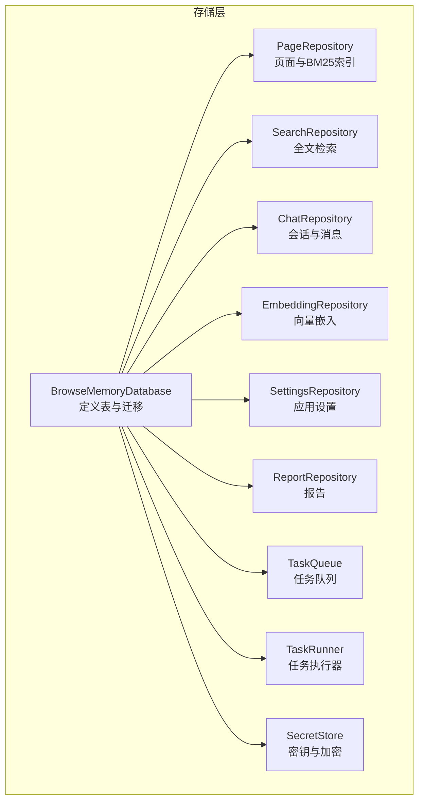
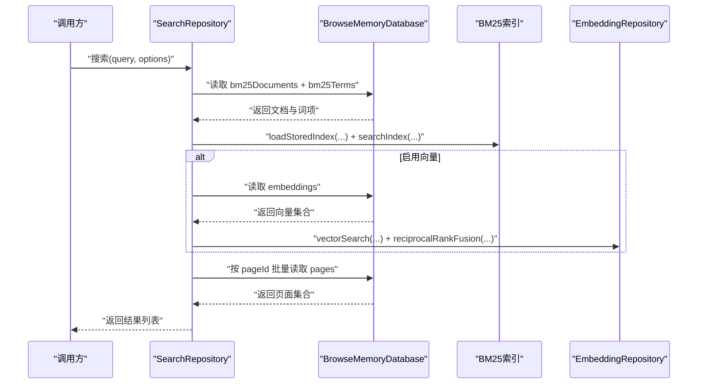
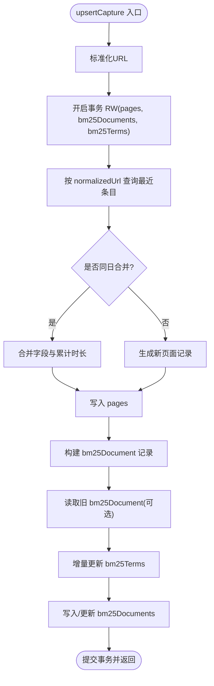
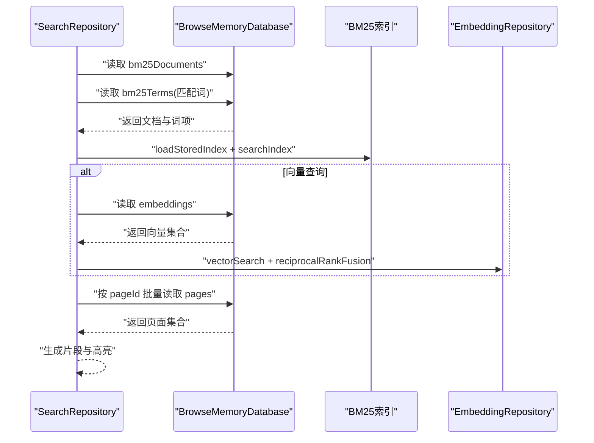
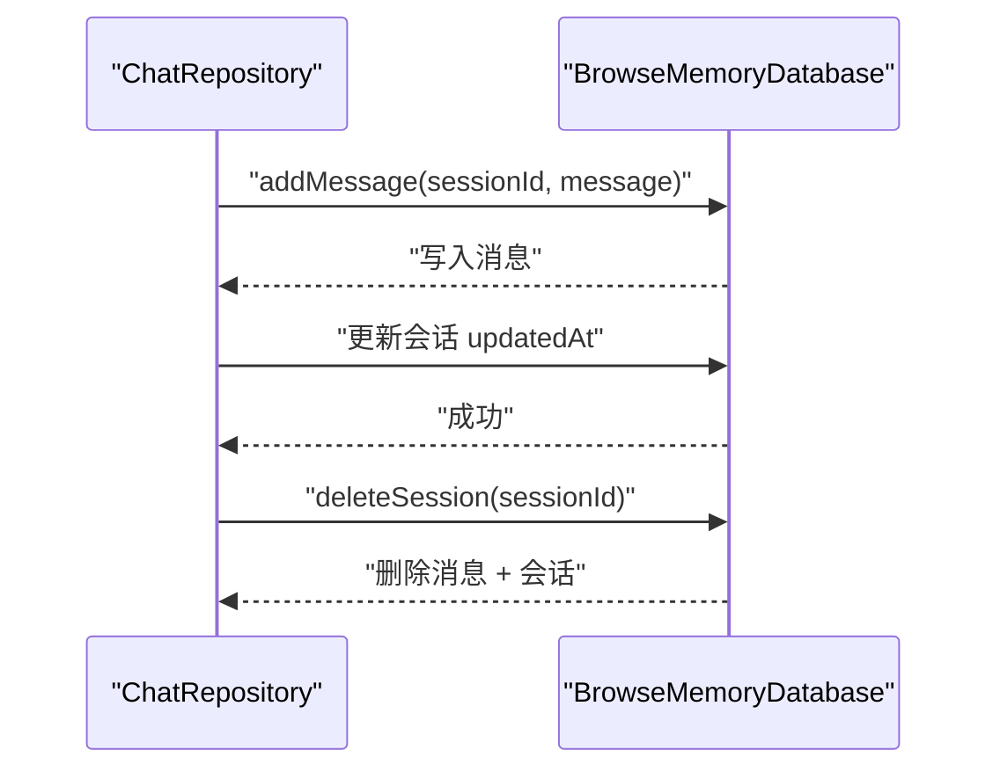
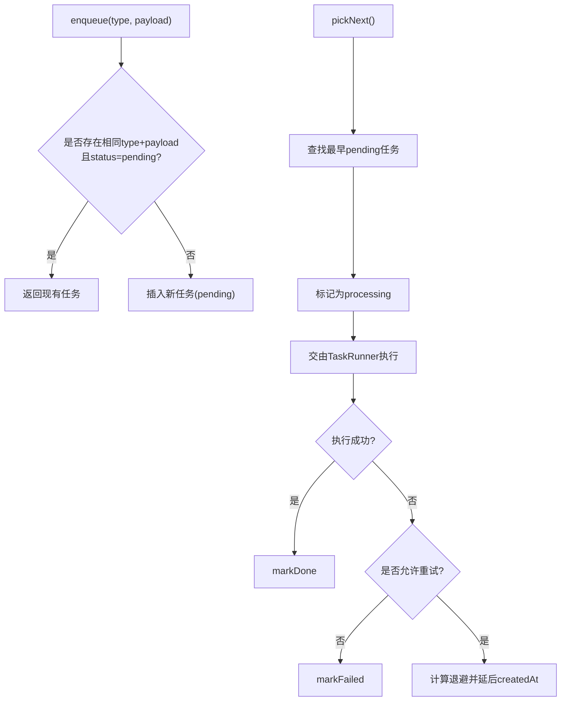
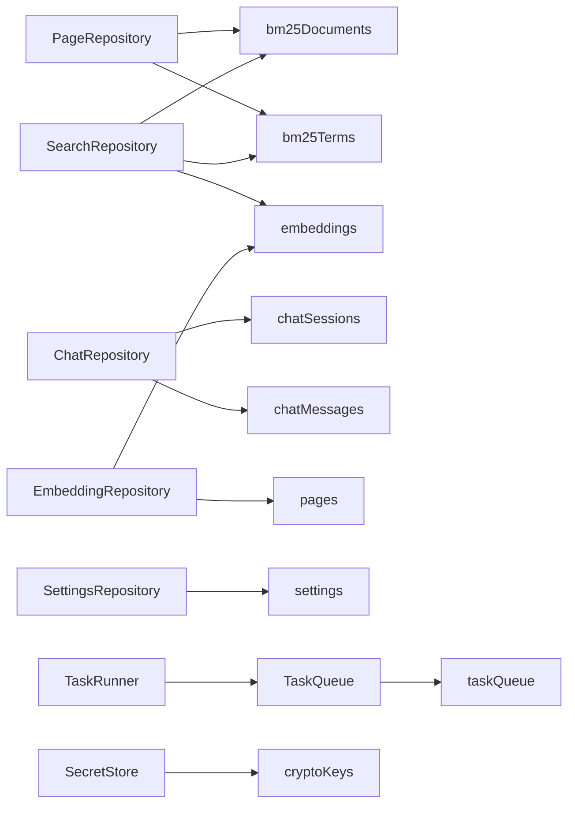
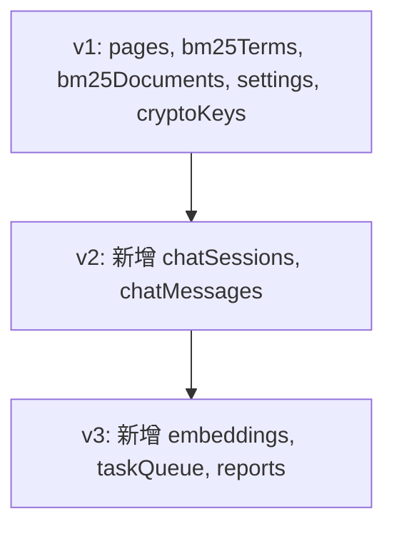

# 数据库设计

<cite>
**本文引用的文件**
- [database.ts](file://src/storage/database.ts)
- [types.ts](file://src/shared/types.ts)
- [page-repository.ts](file://src/storage/page-repository.ts)
- [search-repository.ts](file://src/storage/search-repository.ts)
- [chat-repository.ts](file://src/storage/chat-repository.ts)
- [embedding-repository.ts](file://src/storage/embedding-repository.ts)
- [settings-repository.ts](file://src/storage/settings-repository.ts)
- [report-repository.ts](file://src/storage/report-repository.ts)
- [task-queue.ts](file://src/queue/task-queue.ts)
- [task-runner.ts](file://src/queue/task-runner.ts)
- [secret-store.ts](file://src/security/secret-store.ts)
- [constants.ts](file://src/shared/constants.ts)
- [bm25.ts](file://src/search/bm25.ts)
</cite>

## 目录
1. [简介](#简介)
2. [项目结构与数据库入口](#项目结构与数据库入口)
3. [核心组件与表结构](#核心组件与表结构)
4. [架构总览](#架构总览)
5. [详细组件分析](#详细组件分析)
6. [依赖关系分析](#依赖关系分析)
7. [性能与查询优化](#性能与查询优化)
8. [数据完整性与错误处理](#数据完整性与错误处理)
9. [数据库版本管理与迁移](#数据库版本管理与迁移)
10. [维护与监控指南](#维护与监控指南)
11. [结论](#结论)

## 简介
本文件系统性阐述 BrowseMemory 基于 Dexie 的 IndexedDB 数据库设计，覆盖表结构、索引策略、版本迁移、数据模型关系、查询优化、性能调优、完整性保障与错误处理，并提供面向数据库管理员的维护与监控建议。数据库以 BrowseMemoryDatabase 类为核心，通过 Dexie 的版本化迁移机制实现从 v1 到 v3 的演进，支撑页面浏览记录、BM25 检索索引、聊天会话与消息、向量嵌入、任务队列、报告以及应用设置等模块的数据持久化与检索。

## 项目结构与数据库入口
- 数据库定义集中在 storage 层，核心类为 BrowseMemoryDatabase，继承自 Dexie。
- 该类在构造函数中声明所有表及其主键，并通过多版本 stores 配置完成迁移。
- 其他仓库层（如 PageRepository、ChatRepository、EmbeddingRepository 等）均注入该数据库实例进行 CRUD 操作。

图表来源
- [database.ts:34-76](file://src/storage/database.ts#L34-L76)
- [page-repository.ts:43-103](file://src/storage/page-repository.ts#L43-L103)
- [search-repository.ts:15-108](file://src/storage/search-repository.ts#L15-L108)
- [chat-repository.ts:8-101](file://src/storage/chat-repository.ts#L8-L101)
- [embedding-repository.ts:4-35](file://src/storage/embedding-repository.ts#L4-L35)
- [settings-repository.ts:8-56](file://src/storage/settings-repository.ts#L8-L56)
- [report-repository.ts:4-39](file://src/storage/report-repository.ts#L4-L39)
- [task-queue.ts:12-125](file://src/queue/task-queue.ts#L12-L125)
- [task-runner.ts:7-40](file://src/queue/task-runner.ts#L7-L40)
- [secret-store.ts:25-68](file://src/security/secret-store.ts#L25-L68)

章节来源
- [database.ts:34-76](file://src/storage/database.ts#L34-L76)

## 核心组件与表结构
以下表格总结各表的字段与索引策略（主键以“PK”标注，索引以“IX”标注），并给出典型查询场景下的索引使用建议。

- pages 表
  - 主键：id
  - 索引：normalizedUrl、visitDate、domain、updatedAt
  - 字段用途：页面唯一标识、标准化 URL、访问日期、域名、内容哈希、创建/更新时间、摘要等
  - 典型查询：按日期范围检索、按域名分组统计、按更新时间倒序查看最近条目

- bm25Terms 表
  - 主键：term
  - 字段用途：词项、文档频率、倒排列表（postings：包含 pageId 与 termFrequency）
  - 典型查询：按 term 过滤匹配词项，构建 BM25 索引

- bm25Documents 表
  - 主键：pageId
  - 字段用途：文档长度、词频映射（字符串到频次）
  - 典型查询：加载全部文档用于 BM25 计算；与 bm25Terms 联合检索

- settings 表
  - 主键：key
  - 字段用途：统一的键值对存储，当前仅存一个应用设置记录
  - 典型查询：读取/更新应用设置

- cryptoKeys 表
  - 主键：id
  - 字段用途：存储 AES-GCM 密钥，用于敏感信息加密
  - 典型查询：生成/获取密钥、加密/解密

- chatSessions 表
  - 主键：id
  - 索引：createdAt、updatedAt
  - 字段用途：会话元数据（标题、创建/更新时间）

- chatMessages 表
  - 主键：id
  - 索引：sessionId、createdAt
  - 字段用途：消息内容、角色、来源、离线标记、缺失密钥标记、创建时间

- embeddings 表
  - 主键：pageId
  - 字段用途：向量、模型名、创建时间
  - 典型查询：批量获取未嵌入页面 ID、按页检索向量

- taskQueue 表
  - 主键：id
  - 索引：status、type
  - 字段用途：任务类型、状态、重试次数、负载、创建/更新时间
  - 典型查询：挑选待处理任务、按状态统计、去重入队

- reports 表
  - 主键：id
  - 索引：type、date
  - 字段用途：报告类型、日期、标题、内容、主题、页数、创建时间
  - 典型查询：按类型/日期筛选、倒序列出最新报告

章节来源
- [database.ts:34-76](file://src/storage/database.ts#L34-L76)
- [types.ts:32-41](file://src/shared/types.ts#L32-L41)
- [types.ts:68-84](file://src/shared/types.ts#L68-L84)
- [types.ts:100-105](file://src/shared/types.ts#L100-L105)
- [types.ts:116-124](file://src/shared/types.ts#L116-L124)
- [types.ts:129-138](file://src/shared/types.ts#L129-L138)

## 架构总览
下图展示数据库与各仓库层的交互关系，以及关键查询路径（BM25 检索、向量检索、混合检索）。

图表来源
- [search-repository.ts:35-108](file://src/storage/search-repository.ts#L35-L108)
- [bm25.ts:46-165](file://src/search/bm25.ts#L46-L165)
- [embedding-repository.ts:27-34](file://src/storage/embedding-repository.ts#L27-L34)

## 详细组件分析

### 页面与 BM25 索引（PageRepository）
- upsertCapture：事务内合并同日同 URL 的页面，计算内容哈希与累计时长；写入 pages 并同步更新 bm25Documents 与 bm25Terms 的增量部分，避免重建整个倒排索引。
- purgeExpired：按更新时间阈值清理过期页面，同时维护 bm25Documents 与 bm25Terms 的倒排列表一致性。
- getTodaySnapshot：按 visitDate 统计当日阅读时长、深读页数与热门域名。

图表来源
- [page-repository.ts:46-103](file://src/storage/page-repository.ts#L46-L103)
- [page-repository.ts:203-263](file://src/storage/page-repository.ts#L203-L263)

章节来源
- [page-repository.ts:43-265](file://src/storage/page-repository.ts#L43-L265)

### 搜索与混合检索（SearchRepository）
- recent：按 updatedAt 倒序返回最近若干页面，用于“最近浏览”展示。
- search：
  - 始终执行 BM25 检索，先读取 bm25Documents 与匹配的 bm25Terms，构建内存索引并评分排序；
  - 若提供 embeddingQuery，则并行读取 embeddings，执行向量相似度搜索并与 BM25 结果做重排融合；
  - 最后按 pageId 批量回表读取 pages，生成高亮片段。

图表来源
- [search-repository.ts:35-108](file://src/storage/search-repository.ts#L35-L108)
- [bm25.ts:46-165](file://src/search/bm25.ts#L46-L165)

章节来源
- [search-repository.ts:15-110](file://src/storage/search-repository.ts#L15-L110)

### 聊天会话与消息（ChatRepository）
- createSession/addMessage：原子性写入会话与消息，并更新会话的 updatedAt。
- getSession/deleteSession：按 sessionId 获取会话及消息，删除时级联清理消息。
- purgeExpired：按会话 updatedAt 清理过期会话与对应消息。

图表来源
- [chat-repository.ts:23-100](file://src/storage/chat-repository.ts#L23-L100)

章节来源
- [chat-repository.ts:8-102](file://src/storage/chat-repository.ts#L8-L102)

### 向量嵌入（EmbeddingRepository）
- 提供 get/put/delete/getAll/count 与未嵌入页面 ID 的差集计算，支持批量任务调度与检索。

章节来源
- [embedding-repository.ts:4-35](file://src/storage/embedding-repository.ts#L4-L35)

### 应用设置（SettingsRepository）
- 以单一键值记录保存应用设置，提供读取、合并保存与全表清空（事务内批量清空所有表）。

章节来源
- [settings-repository.ts:8-56](file://src/storage/settings-repository.ts#L8-L56)

### 报告（ReportRepository）
- 支持按类型/日期过滤、按创建时间倒序列出、保存、删除与过期清理。

章节来源
- [report-repository.ts:4-39](file://src/storage/report-repository.ts#L4-L39)

### 任务队列（TaskQueue/TaskRunner）
- 入队去重：相同类型与负载的 pending 任务不会重复入队。
- 出队：按创建时间升序挑选下一个待处理任务并标记为 processing。
- 失败重试：指数退避策略，超过最大重试次数则标记失败。
- 完成清理：保留 done 任务 7 天后清理。

图表来源
- [task-queue.ts:15-106](file://src/queue/task-queue.ts#L15-L106)
- [task-runner.ts:13-39](file://src/queue/task-runner.ts#L13-L39)
- [constants.ts:31-32](file://src/shared/constants.ts#L31-L32)

章节来源
- [task-queue.ts:12-125](file://src/queue/task-queue.ts#L12-L125)
- [task-runner.ts:7-40](file://src/queue/task-runner.ts#L7-L40)
- [constants.ts:31-32](file://src/shared/constants.ts#L31-L32)

### 加密与密钥（SecretStore）
- 使用 AES-GCM 对敏感字符串进行加解密，首次使用时生成并持久化密钥。
- 通过 cryptoKeys 表存储密钥对象，确保跨会话可用。

章节来源
- [secret-store.ts:25-68](file://src/security/secret-store.ts#L25-L68)
- [database.ts:29-32](file://src/storage/database.ts#L29-L32)

## 依赖关系分析
- PageRepository 依赖 bm25Documents 与 bm25Terms 维护倒排索引，二者共同支撑 BM25 检索。
- SearchRepository 依赖 bm25Documents、bm25Terms 与 embeddings 实现混合检索。
- ChatRepository 依赖 chatSessions 与 chatMessages，二者强关联。
- EmbeddingRepository 依赖 embeddings 与 pages，用于识别未嵌入页面。
- SettingsRepository 依赖 settings，用于全局配置。
- TaskQueue 依赖 taskQueue，配合 TaskRunner 执行后台任务。
- SecretStore 依赖 cryptoKeys，用于密钥管理。

图表来源
- [page-repository.ts:43-103](file://src/storage/page-repository.ts#L43-L103)
- [search-repository.ts:35-108](file://src/storage/search-repository.ts#L35-L108)
- [chat-repository.ts:8-101](file://src/storage/chat-repository.ts#L8-L101)
- [embedding-repository.ts:4-35](file://src/storage/embedding-repository.ts#L4-L35)
- [settings-repository.ts:8-56](file://src/storage/settings-repository.ts#L8-L56)
- [task-queue.ts:12-125](file://src/queue/task-queue.ts#L12-L125)
- [secret-store.ts:25-68](file://src/security/secret-store.ts#L25-L68)

## 性能与查询优化
- 索引选择
  - pages：按 normalizedUrl、visitDate、domain、updatedAt 建立复合索引，满足去重、日期筛选、域名聚合与时间排序。
  - chatSessions/chatMessages：按 createdAt/updatedAt 与 sessionId 建立索引，支持会话时间线与消息查询。
  - embeddings：以 pageId 为主键，适合按页检索。
  - taskQueue：以 status、type 建立索引，便于快速挑选待处理任务与按类型统计。
  - reports：以 type、date 建立索引，支持按周期与日期检索。
- 查询模式
  - BM25：先读取 bm25Documents 与匹配的 bm25Terms，再在内存中构建索引并评分，最后回表读取 pages。
  - 向量：并行读取 embeddings，结合向量相似度与 BM25 排序融合。
  - 批量操作：使用 bulkDelete 与 Promise.all 并行处理，减少往返开销。
- 事务与并发
  - 在涉及多表一致性的操作（如页面合并、过期清理、会话删除）中使用事务，确保原子性。
- 缓存与预热
  - BM25 文档与词项在内存中构建索引，避免重复序列化/反序列化。
- I/O 优化
  - 尽量使用 anyOf、reverse、sortBy、limit 等 Dexie API，减少不必要的全表扫描。
  - 对高频查询字段建立合适索引，避免在大表上进行无索引过滤。

章节来源
- [database.ts:48-75](file://src/storage/database.ts#L48-L75)
- [search-repository.ts:35-108](file://src/storage/search-repository.ts#L35-L108)
- [page-repository.ts:148-197](file://src/storage/page-repository.ts#L148-L197)
- [chat-repository.ts:46-71](file://src/storage/chat-repository.ts#L46-L71)

## 数据完整性与错误处理
- 事务一致性
  - 页面合并、过期清理、会话删除等多表操作均在事务中执行，防止中间态导致的数据不一致。
- 错误处理
  - 会话不存在时抛出明确错误，调用方可据此提示用户或重试。
  - 任务执行异常时进入重试流程，超过最大重试次数后标记失败。
- 数据清理
  - purgeExpired/purgeCompleted：按时间阈值清理过期数据，释放存储空间。
- 默认值与校验
  - SettingsRepository 以默认配置为基础进行合并，避免空值影响运行。

章节来源
- [page-repository.ts:148-197](file://src/storage/page-repository.ts#L148-L197)
- [chat-repository.ts:73-86](file://src/storage/chat-repository.ts#L73-L86)
- [task-queue.ts:71-106](file://src/queue/task-queue.ts#L71-L106)
- [settings-repository.ts:11-23](file://src/storage/settings-repository.ts#L11-L23)

## 数据库版本管理与迁移
- 版本 1（初始）
  - 表：pages、bm25Terms、bm25Documents、settings、cryptoKeys
  - 索引：pages(normalizedUrl, visitDate, domain, updatedAt)，bm25Terms(term)，bm25Documents(pageId)，settings(key)，cryptoKeys(id)
- 版本 2（新增聊天）
  - 新增表：chatSessions、chatMessages
  - 新增索引：chatSessions(createdAt, updatedAt)，chatMessages(sessionId, createdAt)
- 版本 3（新增嵌入、任务、报告）
  - 新增表：embeddings、taskQueue、reports
  - 新增索引：embeddings(pageId)，taskQueue(status, type)，reports(type, date)

图表来源
- [database.ts:48-75](file://src/storage/database.ts#L48-L75)

章节来源
- [database.ts:48-75](file://src/storage/database.ts#L48-L75)

## 维护与监控指南
- 监控指标
  - pages、bm25Documents、bm25Terms 的数量与大小，评估索引规模。
  - taskQueue 的 pending/done/fail 分布，观察任务积压与失败率。
  - chatSessions、reports 的增长趋势，评估用户活跃度与报告生成频率。
- 清理策略
  - 设置合理的保留天数（retentionDays），定期执行 purgeExpired 与 purgeCompleted。
  - 对过期报告执行 purgeExpired，避免冗余内容占用空间。
- 性能审计
  - 定期检查慢查询（如大规模 anyOf 或 reverse 排序），必要时调整索引或拆分查询。
  - 关注事务中的顺序与锁竞争，避免长时间持有锁。
- 备份与恢复
  - IndexedDB 不提供直接备份接口，建议通过导出 pages、settings、reports 等关键表数据作为离线备份。
- 安全
  - 通过 SecretStore 管理敏感密钥，避免明文存储。
  - 对外暴露的 API/服务端点需严格鉴权，防止越权访问数据库。

## 结论
本数据库设计围绕 Dexie 的版本化迁移与事务一致性，构建了从页面浏览、BM25 检索、聊天、向量嵌入、任务队列到报告的完整数据通路。通过合理的索引策略与查询优化，兼顾了实时性与性能；通过事务与清理策略保障了数据完整性与存储健康。建议在生产环境中持续监控关键指标，定期清理过期数据，并根据业务增长迭代索引与查询模式。