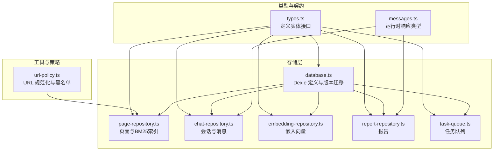
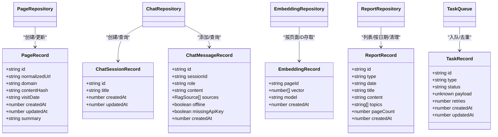
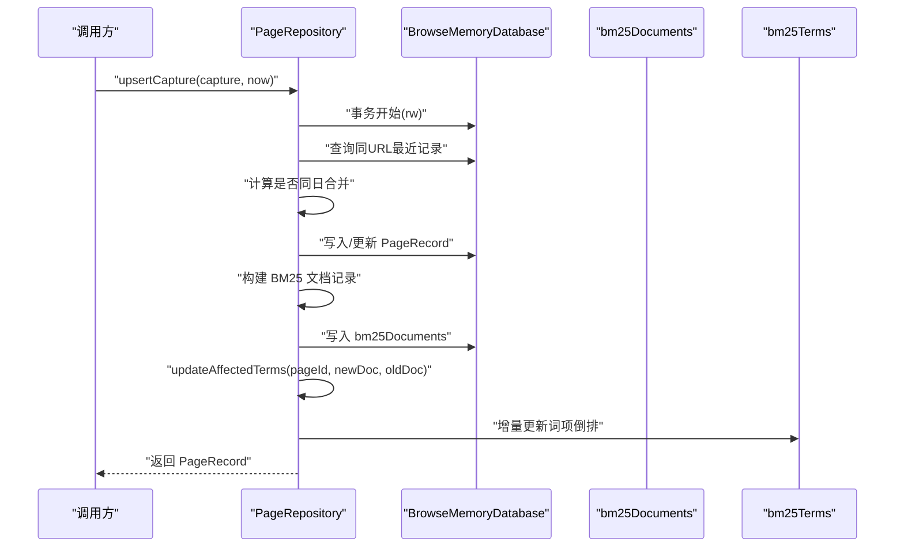
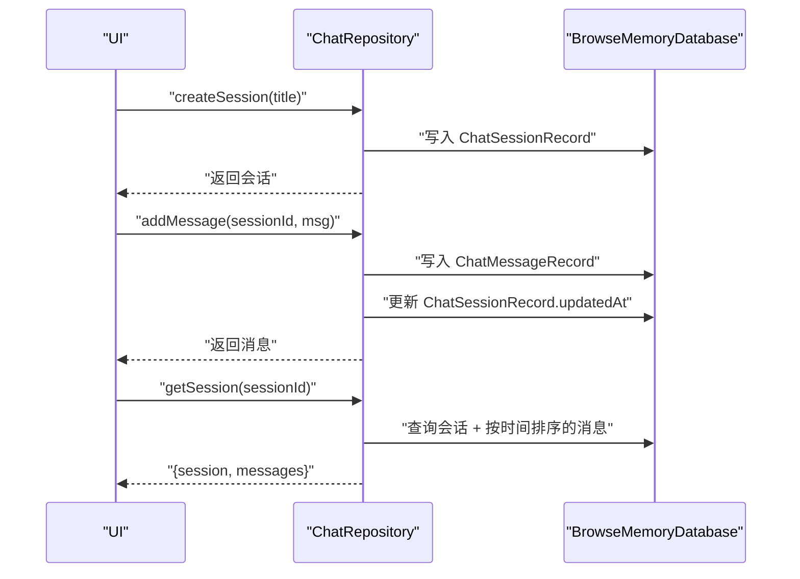
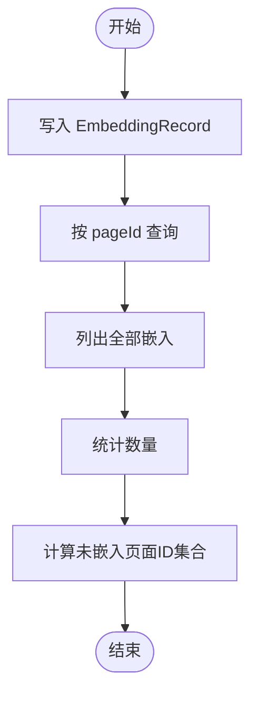
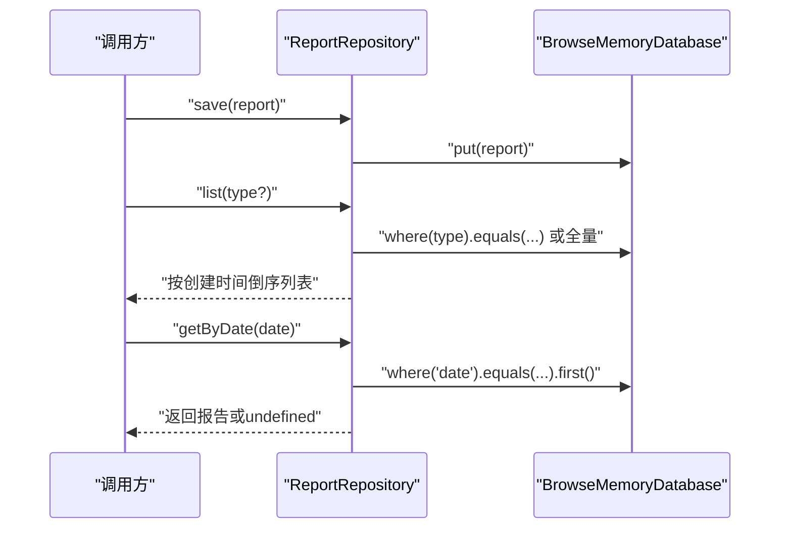
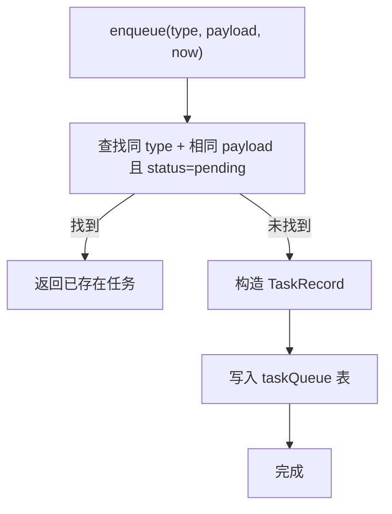
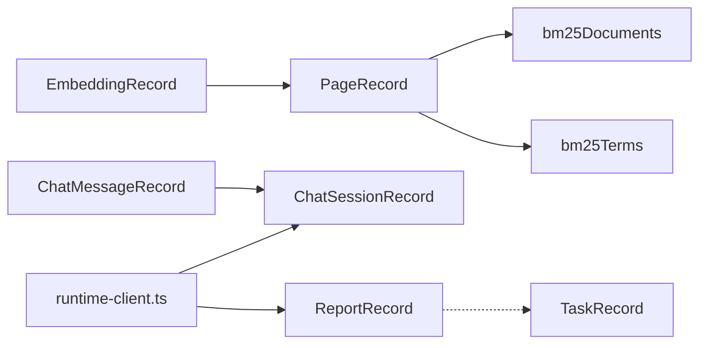

# 数据模型

<cite>
**本文引用的文件**
- [src/shared/types.ts](file://src/shared/types.ts)
- [src/storage/database.ts](file://src/storage/database.ts)
- [src/storage/page-repository.ts](file://src/storage/page-repository.ts)
- [src/storage/chat-repository.ts](file://src/storage/chat-repository.ts)
- [src/storage/embedding-repository.ts](file://src/storage/embedding-repository.ts)
- [src/storage/report-repository.ts](file://src/storage/report-repository.ts)
- [src/queue/task-queue.ts](file://src/queue/task-queue.ts)
- [src/shared/url-policy.ts](file://src/shared/url-policy.ts)
- [src/shared/messages.ts](file://src/shared/messages.ts)
- [tests/storage/page-repository.test.ts](file://tests/storage/page-repository.test.ts)
- [tests/storage/chat-repository.test.ts](file://tests/storage/chat-repository.test.ts)
- [tests/storage/report-repository.test.ts](file://tests/storage/report-repository.test.ts)
- [tests/storage/embedding-repository.test.ts](file://tests/storage/embedding-repository.test.ts)
- [tests/shared/url-policy.test.ts](file://tests/shared/url-policy.test.ts)
- [src/ui/runtime-client.ts](file://src/ui/runtime-client.ts)
</cite>

## 目录
1. [简介](#简介)
2. [项目结构](#项目结构)
3. [核心组件](#核心组件)
4. [架构总览](#架构总览)
5. [详细组件分析](#详细组件分析)
6. [依赖分析](#依赖分析)
7. [性能考虑](#性能考虑)
8. [故障排查指南](#故障排查指南)
9. [结论](#结论)
10. [附录：数据模型与数据库表映射](#附录数据模型与数据库表映射)

## 简介
本文件系统性梳理 BrowseMemory 的数据模型设计与实现，聚焦核心数据实体（PageRecord、ChatSessionRecord、ChatMessageRecord、EmbeddingRecord、ReportRecord、TaskRecord）的结构、字段语义、实体间关系、生命周期管理、验证与约束、序列化与反序列化机制，以及与数据库表结构的映射。文档同时提供面向数据分析师与开发者的使用指导、扩展建议与常见问题排查。

## 项目结构
数据模型相关代码主要分布在以下模块：
- 类型定义与契约：src/shared/types.ts
- 数据库与索引：src/storage/database.ts
- 存储仓库：src/storage/*.ts（页面、聊天、嵌入、报告）
- 队列任务：src/queue/task-queue.ts
- 工具与策略：src/shared/url-policy.ts、src/shared/messages.ts
- 测试用例：tests/storage/*.test.ts、tests/shared/*.test.ts

图表来源
- [src/shared/types.ts:1-139](file://src/shared/types.ts#L1-L139)
- [src/storage/database.ts:1-80](file://src/storage/database.ts#L1-L80)
- [src/storage/page-repository.ts:1-265](file://src/storage/page-repository.ts#L1-L265)
- [src/storage/chat-repository.ts:1-101](file://src/storage/chat-repository.ts#L1-L101)
- [src/storage/embedding-repository.ts:1-36](file://src/storage/embedding-repository.ts#L1-L36)
- [src/storage/report-repository.ts:1-39](file://src/storage/report-repository.ts#L1-L39)
- [src/queue/task-queue.ts:1-46](file://src/queue/task-queue.ts#L1-L46)
- [src/shared/url-policy.ts:1-62](file://src/shared/url-policy.ts#L1-L62)
- [src/shared/messages.ts:43-70](file://src/shared/messages.ts#L43-L70)

章节来源
- [src/shared/types.ts:1-139](file://src/shared/types.ts#L1-L139)
- [src/storage/database.ts:1-80](file://src/storage/database.ts#L1-L80)

## 核心组件
本节对六大核心数据实体进行逐项解析，并给出字段语义、业务约束与典型用法路径。

- PageRecord（页面记录）
  - 字段要点：标识符、规范化URL、域名、内容哈希、访问日期、时间戳、可选摘要等
  - 关键约束：同一规范化URL同一天内的多次访问合并；内容为空时支持“过期清理”仅清空内容不删记录
  - 典型流程：捕获页面 → 合并/新建 → 更新BM25文档与词项倒排索引
  - 参考路径：[页面实体定义:32-41](file://src/shared/types.ts#L32-L41)，[页面仓库 upsert:46-103](file://src/storage/page-repository.ts#L46-L103)，[过期清理:148-197](file://src/storage/page-repository.ts#L148-L197)

- ChatSessionRecord（聊天会话）
  - 字段要点：会话标识、标题、创建/更新时间戳
  - 关键约束：标题长度限制；更新会话时同步更新时间戳
  - 典型流程：创建会话 → 添加消息 → 列表按更新时间排序 → 过期清理（级联删除消息）
  - 参考路径：[会话实体定义:68-73](file://src/shared/types.ts#L68-L73)，[创建会话:11-21](file://src/storage/chat-repository.ts#L11-L21)，[添加消息:23-37](file://src/storage/chat-repository.ts#L23-L37)，[过期清理:46-71](file://src/storage/chat-repository.ts#L46-L71)

- ChatMessageRecord（聊天消息）
  - 字段要点：消息标识、所属会话、角色、内容、可选来源列表、离线/缺钥标记、时间戳
  - 关键约束：消息属于单一会话；来源列表用于RAG溯源
  - 典型流程：向会话追加消息 → 拉取会话及消息 → 响应中返回消息列表
  - 参考路径：[消息实体定义:75-84](file://src/shared/types.ts#L75-L84)，[添加消息:23-37](file://src/storage/chat-repository.ts#L23-L37)，[会话查询:73-86](file://src/storage/chat-repository.ts#L73-L86)，[运行时响应:43-70](file://src/shared/messages.ts#L43-L70)

- EmbeddingRecord（嵌入向量）
  - 字段要点：页面标识、向量数组、模型名、创建时间
  - 关键约束：一对一绑定页面；支持按页面ID检索/删除
  - 典型流程：生成向量 → 写入嵌入表 → 查询未嵌入页面ID → 批量回填
  - 参考路径：[嵌入实体定义:100-105](file://src/shared/types.ts#L100-L105)，[嵌入仓库:1-36](file://src/storage/embedding-repository.ts#L1-L36)，[测试用例:1-44](file://tests/storage/embedding-repository.test.ts#L1-L44)

- ReportRecord（报告）
  - 字段要点：报告标识、类型（日/周/月）、日期键、标题、内容、主题列表、页数、创建时间
  - 关键约束：按类型/日期查询；支持按保留天数清理
  - 典型流程：生成报告 → 持久化 → 列表/按日期查询 → 过期清理
  - 参考路径：[报告实体定义:129-138](file://src/shared/types.ts#L129-L138)，[报告仓库:1-39](file://src/storage/report-repository.ts#L1-L39)，[测试用例:1-81](file://tests/storage/report-repository.test.ts#L1-L81)

- TaskRecord（任务）
  - 字段要点：任务标识、类型（嵌入/摘要/日报/周报/月报）、状态、载荷、重试次数、创建/更新时间
  - 关键约束：同类型+相同载荷去重；幂等入队
  - 典型流程：入队 → 去重判断 → 写入队列 → 状态流转
  - 参考路径：[任务类型与实体:108-124](file://src/shared/types.ts#L108-L124)，[任务队列:1-46](file://src/queue/task-queue.ts#L1-L46)

章节来源
- [src/shared/types.ts:32-138](file://src/shared/types.ts#L32-L138)
- [src/storage/page-repository.ts:46-103](file://src/storage/page-repository.ts#L46-L103)
- [src/storage/chat-repository.ts:11-37](file://src/storage/chat-repository.ts#L11-L37)
- [src/storage/embedding-repository.ts:1-36](file://src/storage/embedding-repository.ts#L1-L36)
- [src/storage/report-repository.ts:1-39](file://src/storage/report-repository.ts#L1-L39)
- [src/queue/task-queue.ts:1-46](file://src/queue/task-queue.ts#L1-L46)

## 架构总览
下图展示数据模型在应用中的交互关系：页面捕获与索引、聊天会话与消息、嵌入向量与页面、报告与任务队列，以及数据库表结构映射。

图表来源
- [src/shared/types.ts:32-138](file://src/shared/types.ts#L32-L138)
- [src/storage/page-repository.ts:43-103](file://src/storage/page-repository.ts#L43-L103)
- [src/storage/chat-repository.ts:8-37](file://src/storage/chat-repository.ts#L8-L37)
- [src/storage/embedding-repository.ts:4-17](file://src/storage/embedding-repository.ts#L4-L17)
- [src/storage/report-repository.ts:4-24](file://src/storage/report-repository.ts#L4-L24)
- [src/queue/task-queue.ts:12-46](file://src/queue/task-queue.ts#L12-L46)

## 详细组件分析

### 页面数据模型（PageRecord）与BM25索引
- 设计要点
  - 合并与去重：同一规范化URL且同日访问合并时长与内容，保持历史元数据
  - 索引增量更新：BM25文档记录与词项倒排索引仅对受影响词项做增量维护
  - 过期策略：按更新时间清理旧内容，保留元数据与索引结构
- 关键流程（插入/合并/索引/清理）

图表来源
- [src/storage/page-repository.ts:46-103](file://src/storage/page-repository.ts#L46-L103)
- [src/storage/page-repository.ts:203-263](file://src/storage/page-repository.ts#L203-L263)

- 数据验证与约束
  - URL 规范化：移除跟踪参数、小写主机、排序查询参数、去除尾随斜杠
  - 黑名单匹配：支持通配域匹配
  - 本地日期键：基于本地历法日生成访问日期，避免跨时区偏差
- 参考路径
  - [URL 规范化:22-39](file://src/shared/url-policy.ts#L22-L39)
  - [黑名单匹配:55-62](file://src/shared/url-policy.ts#L55-L62)
  - [本地日期键](file://src/storage/page-repository.ts:67-L67)

- 生命周期与时间戳
  - 创建/更新：插入或合并时设置 createdAt/updatedAt
  - 过期：按 updatedAt 超过保留天数清理内容，保留索引与元数据
- 参考路径
  - [过期清理实现:148-197](file://src/storage/page-repository.ts#L148-L197)
  - [测试用例：过期清理:140-183](file://tests/storage/page-repository.test.ts#L140-L183)

章节来源
- [src/storage/page-repository.ts:46-103](file://src/storage/page-repository.ts#L46-L103)
- [src/shared/url-policy.ts:22-39](file://src/shared/url-policy.ts#L22-L39)
- [tests/storage/page-repository.test.ts:140-183](file://tests/storage/page-repository.test.ts#L140-L183)

### 聊天数据模型（ChatSessionRecord 与 ChatMessageRecord）
- 设计要点
  - 会话：标题截断至固定长度；更新会话时同步更新时间戳
  - 消息：归属单一会话；支持来源列表与离线/缺钥标记
  - 查询：按会话ID拉取消息列表；按更新时间倒序列出会话
  - 清理：按会话最后更新时间清理，级联删除消息
- 关键流程（创建会话/添加消息/查询/清理）

图表来源
- [src/storage/chat-repository.ts:11-37](file://src/storage/chat-repository.ts#L11-L37)
- [src/storage/chat-repository.ts:73-86](file://src/storage/chat-repository.ts#L73-L86)

- 生命周期与时间戳
  - 会话：createdAt/updatedAt 同步创建与更新
  - 消息：createdAt 由服务端注入
- 参考路径
  - [会话创建与更新:11-37](file://src/storage/chat-repository.ts#L11-L37)
  - [会话查询与消息排序:73-86](file://src/storage/chat-repository.ts#L73-L86)
  - [过期清理（事务内级联）:46-71](file://src/storage/chat-repository.ts#L46-L71)

- 数据验证与约束
  - 标题长度限制（截断）
  - 消息角色枚举（用户/助手）
  - 会话存在性校验（抛出错误）
- 参考路径
  - [标题截断:14-16](file://src/storage/chat-repository.ts#L14-L16)
  - [会话存在性检查:77-80](file://src/storage/chat-repository.ts#L77-L80)
  - [测试用例：过期清理:59-99](file://tests/storage/chat-repository.test.ts#L59-L99)

章节来源
- [src/storage/chat-repository.ts:11-37](file://src/storage/chat-repository.ts#L11-L37)
- [src/storage/chat-repository.ts:73-86](file://src/storage/chat-repository.ts#L73-L86)
- [tests/storage/chat-repository.test.ts:59-99](file://tests/storage/chat-repository.test.ts#L59-L99)

### 嵌入向量数据模型（EmbeddingRecord）
- 设计要点
  - 一对一绑定页面：以 pageId 作为主键
  - 支持批量查询未嵌入页面ID，便于回填
- 关键流程（写入/查询/统计/清理）

图表来源
- [src/storage/embedding-repository.ts:7-35](file://src/storage/embedding-repository.ts#L7-L35)

- 生命周期与时间戳
  - createdAt 记录向量生成时间
- 参考路径
  - [嵌入实体定义:100-105](file://src/shared/types.ts#L100-L105)
  - [嵌入仓库:1-36](file://src/storage/embedding-repository.ts#L1-L36)
  - [测试用例:1-44](file://tests/storage/embedding-repository.test.ts#L1-L44)

章节来源
- [src/shared/types.ts:100-105](file://src/shared/types.ts#L100-L105)
- [src/storage/embedding-repository.ts:1-36](file://src/storage/embedding-repository.ts#L1-L36)
- [tests/storage/embedding-repository.test.ts:1-44](file://tests/storage/embedding-repository.test.ts#L1-L44)

### 报告数据模型（ReportRecord）
- 设计要点
  - 按类型（日/周/月）与日期键组织
  - 支持按类型/日期查询与列表排序
  - 过期清理：按创建时间超过保留天数删除
- 关键流程（保存/查询/列表/按日期/清理）

图表来源
- [src/storage/report-repository.ts:7-24](file://src/storage/report-repository.ts#L7-L24)
- [src/storage/report-repository.ts:18-20](file://src/storage/report-repository.ts#L18-L20)

- 生命周期与时间戳
  - createdAt 用于过期判定
- 参考路径
  - [报告实体定义:129-138](file://src/shared/types.ts#L129-L138)
  - [报告仓库:1-39](file://src/storage/report-repository.ts#L1-L39)
  - [测试用例：按日期/清理:55-81](file://tests/storage/report-repository.test.ts#L55-L81)

章节来源
- [src/shared/types.ts:129-138](file://src/shared/types.ts#L129-L138)
- [src/storage/report-repository.ts:1-39](file://src/storage/report-repository.ts#L1-L39)
- [tests/storage/report-repository.test.ts:55-81](file://tests/storage/report-repository.test.ts#L55-L81)

### 任务队列数据模型（TaskRecord）
- 设计要点
  - 去重：同类型+相同载荷的“待处理”任务不会重复入队
  - 状态机：pending → processing → done/failed
  - 载荷：任意结构，由执行器解析
- 关键流程（入队/去重/写入）

图表来源
- [src/queue/task-queue.ts:15-46](file://src/queue/task-queue.ts#L15-L46)

- 生命周期与时间戳
  - createdAt/updatedAt 记录任务创建与状态变更时间
- 参考路径
  - [任务实体定义:116-124](file://src/shared/types.ts#L116-L124)
  - [任务队列:1-46](file://src/queue/task-queue.ts#L1-L46)

章节来源
- [src/shared/types.ts:116-124](file://src/shared/types.ts#L116-L124)
- [src/queue/task-queue.ts:1-46](file://src/queue/task-queue.ts#L1-L46)

## 依赖分析
- 实体依赖
  - PageRecord 与 BM25 文档/词项：页面内容变化触发索引增量更新
  - ChatMessageRecord 依赖 ChatSessionRecord：消息必须属于有效会话
  - EmbeddingRecord 依赖 PageRecord：向量与页面一一对应
  - ReportRecord 与 TaskRecord：报告生成可能由任务驱动
- 外部依赖
  - Dexie：IndexedDB 封装，负责表结构与版本迁移
  - 浏览器运行时：通过运行时客户端与后台通信，获取会话/报告/嵌入状态等

图表来源
- [src/storage/page-repository.ts:31-41](file://src/storage/page-repository.ts#L31-L41)
- [src/storage/chat-repository.ts:73-86](file://src/storage/chat-repository.ts#L73-L86)
- [src/storage/embedding-repository.ts:7-9](file://src/storage/embedding-repository.ts#L7-L9)
- [src/ui/runtime-client.ts:129-181](file://src/ui/runtime-client.ts#L129-L181)

章节来源
- [src/storage/page-repository.ts:31-41](file://src/storage/page-repository.ts#L31-L41)
- [src/storage/chat-repository.ts:73-86](file://src/storage/chat-repository.ts#L73-L86)
- [src/storage/embedding-repository.ts:7-9](file://src/storage/embedding-repository.ts#L7-L9)
- [src/ui/runtime-client.ts:129-181](file://src/ui/runtime-client.ts#L129-L181)

## 性能考虑
- 索引增量维护：仅对受影响词项更新 BM25 倒排，避免全量重建
- 事务批处理：页面、BM25 文档与词项更新在单事务中完成，保证一致性与性能
- 去重入队：任务队列对相同载荷的任务进行去重，减少重复工作
- 时间窗口清理：按更新/创建时间进行批量清理，降低扫描成本

## 故障排查指南
- 会话不存在
  - 现象：按会话ID查询抛出错误
  - 排查：确认会话ID正确、未被过期清理
  - 参考路径：[会话查询异常:77-80](file://src/storage/chat-repository.ts#L77-L80)，[测试用例:55-57](file://tests/storage/chat-repository.test.ts#L55-L57)
- 报告按日期查询为空
  - 现象：按日期查询返回 undefined
  - 排查：确认日期格式与键一致、报告已保存
  - 参考路径：[按日期查询:18-20](file://src/storage/report-repository.ts#L18-L20)，[测试用例:55-62](file://tests/storage/report-repository.test.ts#L55-L62)
- 嵌入向量缺失
  - 现象：按页面ID查询不到向量
  - 排查：确认页面已生成向量、模型名一致、未被删除
  - 参考路径：[嵌入查询:7-9](file://src/storage/embedding-repository.ts#L7-L9)，[测试用例:20-32](file://tests/storage/embedding-repository.test.ts#L20-L32)
- URL 规范化导致误判
  - 现象：不同页面被当作同一页面合并
  - 排查：核对 URL 规范化逻辑（移除跟踪参数、排序查询参数）
  - 参考路径：[URL 规范化:22-39](file://src/shared/url-policy.ts#L22-L39)，[测试用例:10-14](file://tests/shared/url-policy.test.ts#L10-L14)

章节来源
- [src/storage/chat-repository.ts:77-80](file://src/storage/chat-repository.ts#L77-L80)
- [src/storage/report-repository.ts:18-20](file://src/storage/report-repository.ts#L18-L20)
- [src/storage/embedding-repository.ts:7-9](file://src/storage/embedding-repository.ts#L7-L9)
- [src/shared/url-policy.ts:22-39](file://src/shared/url-policy.ts#L22-L39)
- [tests/shared/url-policy.test.ts:10-14](file://tests/shared/url-policy.test.ts#L10-L14)

## 结论
BrowseMemory 的数据模型围绕“本地持久化 + 离线可用”的目标设计，通过严格的实体边界、事务一致性与增量索引维护，实现了页面、聊天、嵌入、报告与任务的协同。时间戳与保留策略确保了数据生命周期的可控性；类型与运行时响应契约保障了前端与后台交互的一致性。该模型为后续扩展（如多模态、跨设备同步）提供了清晰的演进路径。

## 附录：数据模型与数据库表映射
- 表与索引
  - pages：主键 id；二级索引 normalizedUrl、visitDate、domain、updatedAt
  - bm25Terms：主键 term
  - bm25Documents：主键 pageId
  - settings：主键 key
  - cryptoKeys：主键 id
  - chatSessions：主键 id；二级索引 createdAt、updatedAt
  - chatMessages：主键 id；二级索引 sessionId、createdAt
  - embeddings：主键 pageId
  - taskQueue：主键 id；二级索引 status、type
  - reports：主键 id；二级索引 type、date
- 版本迁移
  - v1/v2/v3 分别引入页面、聊天、嵌入、任务与报告表结构
- 参考路径
  - [Dexie 定义与版本迁移:34-76](file://src/storage/database.ts#L34-L76)

章节来源
- [src/storage/database.ts:34-76](file://src/storage/database.ts#L34-L76)