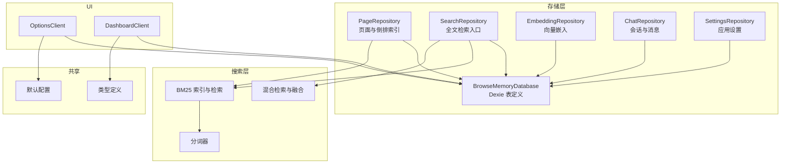
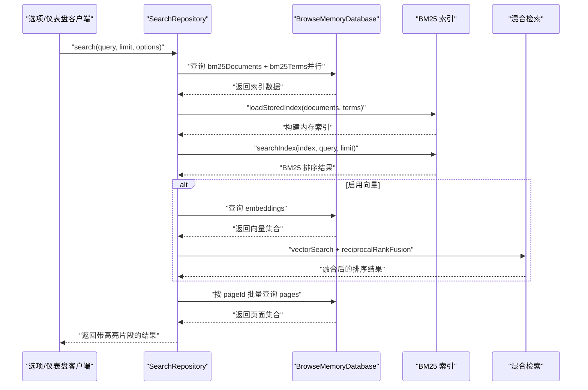
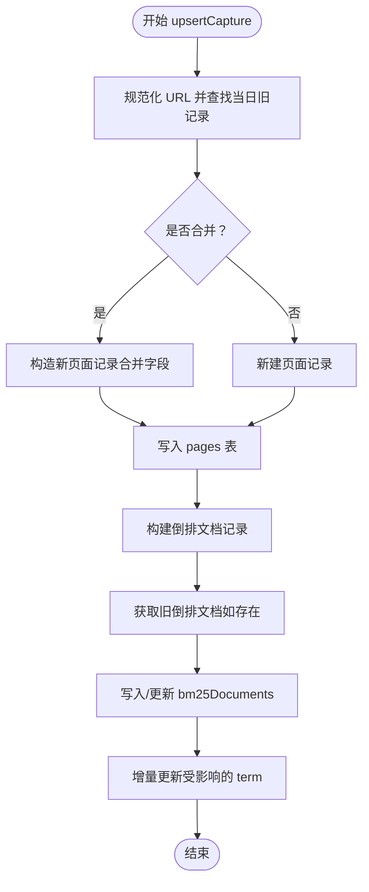
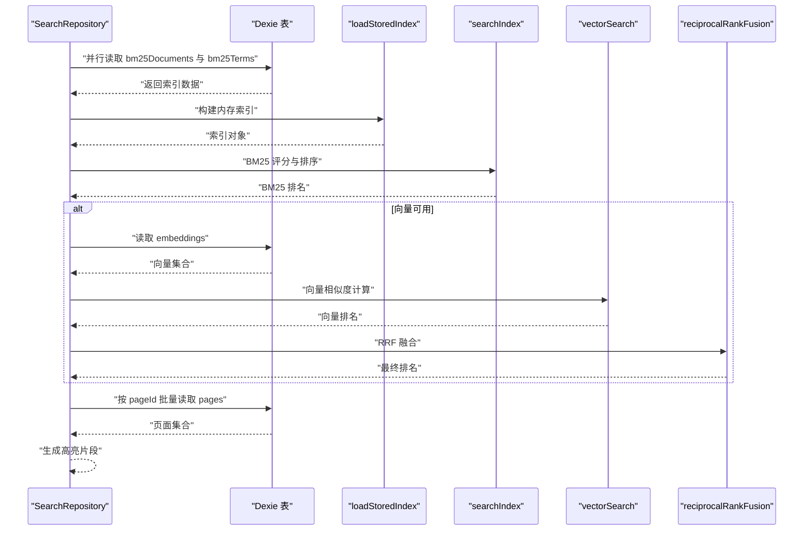
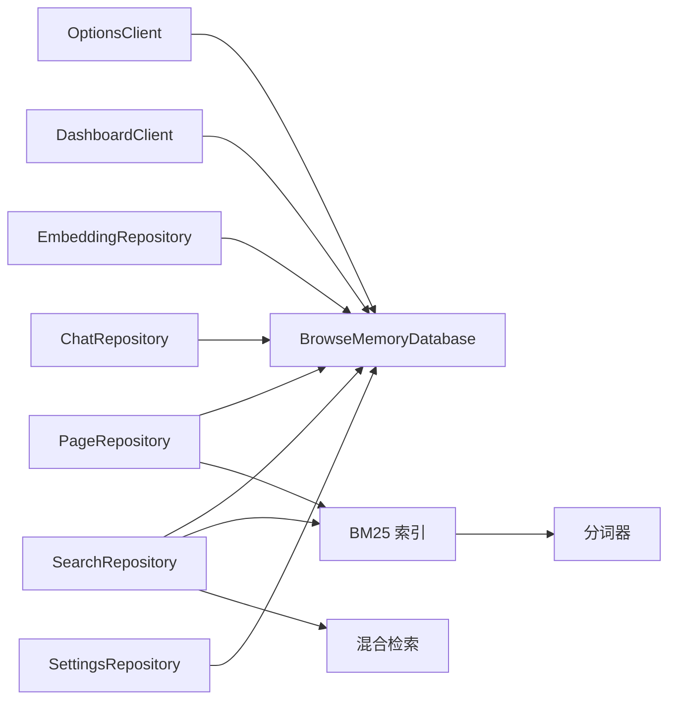
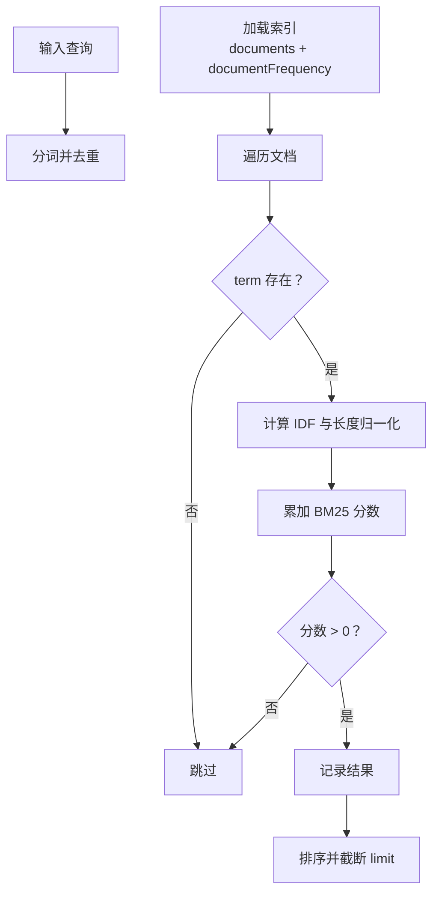

# 数据访问优化

<cite>
**本文引用的文件**
- [src/storage/database.ts](file://src/storage/database.ts)
- [src/storage/page-repository.ts](file://src/storage/page-repository.ts)
- [src/storage/search-repository.ts](file://src/storage/search-repository.ts)
- [src/search/bm25.ts](file://src/search/bm25.ts)
- [src/search/tokenize.ts](file://src/search/tokenize.ts)
- [src/search/hybrid-search.ts](file://src/search/hybrid-search.ts)
- [src/storage/embedding-repository.ts](file://src/storage/embedding-repository.ts)
- [src/storage/chat-repository.ts](file://src/storage/chat-repository.ts)
- [src/storage/settings-repository.ts](file://src/storage/settings-repository.ts)
- [src/shared/types.ts](file://src/shared/types.ts)
- [src/shared/constants.ts](file://src/shared/constants.ts)
- [src/ui/dashboard-client.ts](file://src/ui/dashboard-client.ts)
- [src/ui/options-client.ts](file://src/ui/options-client.ts)
</cite>

## 目录
1. [简介](#简介)
2. [项目结构](#项目结构)
3. [核心组件](#核心组件)
4. [架构总览](#架构总览)
5. [详细组件分析](#详细组件分析)
6. [依赖关系分析](#依赖关系分析)
7. [性能考量](#性能考量)
8. [故障排查指南](#故障排查指南)
9. [结论](#结论)
10. [附录](#附录)

## 简介
本文件面向性能工程师与前端开发者，系统化梳理 BrowseMemory 在浏览器端基于 IndexedDB/Dexie 的数据访问优化策略，重点覆盖以下主题：
- IndexedDB 性能优化：索引设计、查询路径、批量写入与事务边界
- BM25 搜索：倒排索引的存储与查询优化、向量化检索与融合策略
- 缓存与内存管理：索引加载与内存占用控制
- 异步查询与 Promise 链：并发与串行的权衡
- 分页与虚拟滚动：数据分页与 UI 虚拟化配合
- 大数据量优化：过期清理、增量更新、向量化回填
- 压缩与存储优化：内容裁剪与归档策略
- 性能监控与调试：埋点、指标采集与定位手段

## 项目结构
项目采用“按职责分层 + 按功能模块划分”的组织方式：
- 存储层（storage）：以 Dexie 抽象数据库表，提供仓库类封装 CRUD 与业务逻辑
- 搜索层（search）：BM25 实现、分词器、混合检索与重排序
- 共享类型（shared）：统一的数据模型与默认配置
- UI 客户端（ui）：与后台通信桥接，暴露设置、报告等接口
- 背景应用（background）：任务队列、定时任务与数据生命周期管理（由仓库与客户端协作）

图表来源
- [src/storage/database.ts:34-76](file://src/storage/database.ts#L34-L76)
- [src/storage/page-repository.ts:43-103](file://src/storage/page-repository.ts#L43-L103)
- [src/storage/search-repository.ts:15-108](file://src/storage/search-repository.ts#L15-L108)
- [src/search/bm25.ts:38-68](file://src/search/bm25.ts#L38-L68)
- [src/search/tokenize.ts:37-49](file://src/search/tokenize.ts#L37-L49)
- [src/search/hybrid-search.ts:57-77](file://src/search/hybrid-search.ts#L57-L77)
- [src/storage/embedding-repository.ts:4-35](file://src/storage/embedding-repository.ts#L4-L35)
- [src/storage/chat-repository.ts:8-101](file://src/storage/chat-repository.ts#L8-L101)
- [src/storage/settings-repository.ts:8-56](file://src/storage/settings-repository.ts#L8-L56)
- [src/shared/types.ts:32-105](file://src/shared/types.ts#L32-L105)
- [src/shared/constants.ts:12-24](file://src/shared/constants.ts#L12-L24)
- [src/ui/options-client.ts:35-86](file://src/ui/options-client.ts#L35-L86)
- [src/ui/dashboard-client.ts:99-142](file://src/ui/dashboard-client.ts#L99-L142)

章节来源
- [src/storage/database.ts:34-76](file://src/storage/database.ts#L34-L76)
- [src/shared/types.ts:32-105](file://src/shared/types.ts#L32-L105)
- [src/shared/constants.ts:12-24](file://src/shared/constants.ts#L12-L24)

## 核心组件
- 数据库与表结构：通过 Dexie 版本化迁移定义多版本表结构，明确主键与复合索引，确保查询路径稳定
- PageRepository：负责页面写入合并、倒排索引增量更新、过期清理与统计快照
- SearchRepository：组合 BM25 与可选向量检索，支持最近结果与高亮片段
- EmbeddingRepository：向量嵌入的增删查与未嵌入页面发现
- ChatRepository：会话与消息的持久化与过期清理
- SettingsRepository：应用设置的读取、保存与全量清空（跨表事务）
- 搜索算法：BM25 倒排索引加载、查询评分、混合检索与 RRF 融合

章节来源
- [src/storage/database.ts:34-76](file://src/storage/database.ts#L34-L76)
- [src/storage/page-repository.ts:43-103](file://src/storage/page-repository.ts#L43-L103)
- [src/storage/search-repository.ts:15-108](file://src/storage/search-repository.ts#L15-L108)
- [src/search/bm25.ts:38-68](file://src/search/bm25.ts#L38-L68)
- [src/search/hybrid-search.ts:57-77](file://src/search/hybrid-search.ts#L57-L77)
- [src/storage/embedding-repository.ts:4-35](file://src/storage/embedding-repository.ts#L4-L35)
- [src/storage/chat-repository.ts:8-101](file://src/storage/chat-repository.ts#L8-L101)
- [src/storage/settings-repository.ts:8-56](file://src/storage/settings-repository.ts#L8-L56)

## 架构总览
下图展示从 UI 到存储与搜索的完整数据流，强调事务边界、并发查询与结果组装。

图表来源
- [src/storage/search-repository.ts:35-108](file://src/storage/search-repository.ts#L35-L108)
- [src/search/bm25.ts:46-68](file://src/search/bm25.ts#L46-L68)
- [src/search/hybrid-search.ts:35-77](file://src/search/hybrid-search.ts#L35-L77)
- [src/storage/database.ts:34-44](file://src/storage/database.ts#L34-L44)

## 详细组件分析

### IndexedDB 表结构与索引策略
- 主键与二级索引：pages、bm25Documents、bm25Terms、settings、cryptoKeys、chatSessions、chatMessages、embeddings、taskQueue、reports 明确主键；pages 提供 normalizedUrl、visitDate、domain、updatedAt 等常用查询字段；taskQueue 增加 status、type 便于过滤
- 版本化迁移：通过 stores 映射维护向后兼容，避免删除或重命名字段导致的破坏性变更
- 查询路径：优先使用主键或二级索引进行过滤与排序，减少全表扫描

章节来源
- [src/storage/database.ts:46-76](file://src/storage/database.ts#L46-L76)

### PageRepository：倒排索引的增量更新与事务边界
- 写入合并：对同一天同一 URL 的页面进行合并，减少重复索引重建
- 事务边界：upsertCapture、purgeExpired、SettingsRepository.clearAllData 使用只读/读写事务包裹多个表操作，保证一致性
- 增量更新：updateAffectedTerms 仅对受影响的 term 进行增删改，避免重建整个倒排索引
- 过期清理：按 updatedAt 下界过滤，清理 bm25Documents 与 bm25Terms 中的失效条目，并将 content 置空以节省空间

图表来源
- [src/storage/page-repository.ts:46-103](file://src/storage/page-repository.ts#L46-L103)
- [src/storage/page-repository.ts:203-263](file://src/storage/page-repository.ts#L203-L263)

章节来源
- [src/storage/page-repository.ts:46-103](file://src/storage/page-repository.ts#L46-L103)
- [src/storage/page-repository.ts:148-197](file://src/storage/page-repository.ts#L148-L197)
- [src/storage/page-repository.ts:203-263](file://src/storage/page-repository.ts#L203-L263)

### SearchRepository：BM25 与混合检索
- 并行预取：同时拉取 bm25Documents 与匹配的 bm25Terms，降低查询等待时间
- 索引加载：loadStoredIndex 将存储结构转换为内存索引，便于快速评分
- BM25 评分：searchIndex 对每个文档计算 BM25 分数并排序
- 向量融合：当提供向量查询时，vectorSearch 计算余弦相似度，reciprocalRankFusion 将两类结果融合
- 结果组装：根据 pageId 批量查询 pages，生成高亮片段

图表来源
- [src/storage/search-repository.ts:35-108](file://src/storage/search-repository.ts#L35-L108)
- [src/search/bm25.ts:46-68](file://src/search/bm25.ts#L46-L68)
- [src/search/bm25.ts:125-165](file://src/search/bm25.ts#L125-L165)
- [src/search/hybrid-search.ts:35-77](file://src/search/hybrid-search.ts#L35-L77)

章节来源
- [src/storage/search-repository.ts:35-108](file://src/storage/search-repository.ts#L35-L108)
- [src/search/bm25.ts:46-68](file://src/search/bm25.ts#L46-L68)
- [src/search/hybrid-search.ts:57-77](file://src/search/hybrid-search.ts#L57-L77)

### EmbeddingRepository：向量检索与回填
- 单条读写：按 pageId 获取/写入/删除向量
- 全量读取：用于向量检索
- 未嵌入页面发现：通过 pages 与 embeddings 的键集差集计算，支持批量回填

章节来源
- [src/storage/embedding-repository.ts:4-35](file://src/storage/embedding-repository.ts#L4-L35)

### ChatRepository：会话与消息的生命周期管理
- 创建会话与消息：自动更新会话 updatedAt
- 过期清理：按会话 updatedAt 清理过期会话及其消息
- 事务删除：先删消息再删会话，保持引用一致

章节来源
- [src/storage/chat-repository.ts:8-101](file://src/storage/chat-repository.ts#L8-L101)

### SettingsRepository：设置读取、保存与全量清空
- 默认值合并：读取时与 DEFAULT_SETTINGS 合并，保证字段完整性
- 全量清空：跨表事务一次性清空所有数据，保障一致性

章节来源
- [src/storage/settings-repository.ts:8-56](file://src/storage/settings-repository.ts#L8-L56)
- [src/shared/constants.ts:12-24](file://src/shared/constants.ts#L12-L24)

### UI 客户端：与后台通信桥接
- OptionsClient：获取设置、保存设置、测试连接、触发向量回填、查询存储用量、清空数据
- DashboardClient：获取报告列表/详情、生成报告、打开 URL/选项页

章节来源
- [src/ui/options-client.ts:35-86](file://src/ui/options-client.ts#L35-L86)
- [src/ui/dashboard-client.ts:99-142](file://src/ui/dashboard-client.ts#L99-L142)

## 依赖关系分析
- 存储层依赖 Dexie 表结构，仓库类封装业务逻辑
- 搜索层依赖分词器与 BM25 索引，向量检索依赖 EmbeddingRepository
- UI 客户端通过 chrome.runtime 或 postMessage 与后台通信，间接访问存储

图表来源
- [src/ui/options-client.ts:35-86](file://src/ui/options-client.ts#L35-L86)
- [src/ui/dashboard-client.ts:99-142](file://src/ui/dashboard-client.ts#L99-L142)
- [src/storage/search-repository.ts:15-108](file://src/storage/search-repository.ts#L15-L108)
- [src/storage/page-repository.ts:43-103](file://src/storage/page-repository.ts#L43-L103)
- [src/search/bm25.ts:38-68](file://src/search/bm25.ts#L38-L68)
- [src/search/hybrid-search.ts:57-77](file://src/search/hybrid-search.ts#L57-L77)
- [src/search/tokenize.ts:37-49](file://src/search/tokenize.ts#L37-L49)

## 性能考量

### IndexedDB 查询与索引优化
- 优先使用主键或二级索引过滤：pages 的 normalizedUrl、visitDate、domain、updatedAt；taskQueue 的 status、type
- 避免全表扫描：对大表使用 where + anyOf + limit 组合，减少 IO 与内存占用
- 并行预取：SearchRepository 对 bm25Documents 与 bm25Terms 并行读取，缩短首屏延迟

章节来源
- [src/storage/database.ts:48-76](file://src/storage/database.ts#L48-L76)
- [src/storage/search-repository.ts:48-54](file://src/storage/search-repository.ts#L48-L54)

### 倒排索引的存储与查询优化
- 存储结构：Bm25DocumentRecord 与 Bm25TermRecord 将 posting 列表与文档频率分离，便于快速过滤与评分
- 加载路径：loadStoredIndex 将存储映射到内存 Map，提升查询效率
- 增量更新：updateAffectedTerms 仅处理受影响 term，避免重建索引

章节来源
- [src/storage/database.ts:12-22](file://src/storage/database.ts#L12-L22)
- [src/search/bm25.ts:46-68](file://src/search/bm25.ts#L46-L68)
- [src/storage/page-repository.ts:203-263](file://src/storage/page-repository.ts#L203-L263)

### 向量检索与混合检索
- 向量搜索：vectorSearch 采用暴力检索，适用于中小规模（<10K 文档），复杂度 O(N·D)
- 融合策略：reciprocalRankFusion 将 BM25 与向量排序融合，提升召回质量
- 条件启用：仅在 options.embeddingQuery 存在时执行向量分支

章节来源
- [src/search/hybrid-search.ts:35-77](file://src/search/hybrid-search.ts#L35-L77)
- [src/storage/search-repository.ts:64-77](file://src/storage/search-repository.ts#L64-L77)

### 事务与批量操作
- 事务边界：PageRepository.upsertCapture、SettingsRepository.clearAllData、ChatRepository.purgeExpired 使用事务包裹多表写入，保证 ACID
- 批量删除：ChatRepository.purgeExpired 先删消息再删会话，EmbeddingRepository 支持 bulkDelete（在相关调用中使用）

章节来源
- [src/storage/page-repository.ts:52-102](file://src/storage/page-repository.ts#L52-L102)
- [src/storage/settings-repository.ts:26-55](file://src/storage/settings-repository.ts#L26-L55)
- [src/storage/chat-repository.ts:48-71](file://src/storage/chat-repository.ts#L48-L71)

### 缓存与内存管理
- 内存索引：loadStoredIndex 将索引加载到内存 Map，BM25 评分直接在内存上完成，避免多次 IO
- 控制上限：searchIndex 的 limit 参数限制输出数量，避免内存峰值
- 分词器：tokenize 使用大小写归一化与停用词过滤，减少无效 token 数量

章节来源
- [src/search/bm25.ts:46-68](file://src/search/bm25.ts#L46-L68)
- [src/search/bm25.ts:125-165](file://src/search/bm25.ts#L125-L165)
- [src/search/tokenize.ts:37-49](file://src/search/tokenize.ts#L37-L49)

### 异步查询与 Promise 链
- 并行读取：SearchRepository 对 bm25Documents 与 bm25Terms 使用 Promise.all 并行获取
- 串行保持事务活性：PageRepository.updateAffectedTerms 在事务内顺序 await，确保事务不超时
- 结果组装：按 pageId 批量查询 pages，减少多次往返

章节来源
- [src/storage/search-repository.ts:48-54](file://src/storage/search-repository.ts#L48-L54)
- [src/storage/page-repository.ts:216-217](file://src/storage/page-repository.ts#L216-L217)
- [src/storage/search-repository.ts:83-87](file://src/storage/search-repository.ts#L83-L87)

### 分页与虚拟滚动
- 数据分页：SearchRepository.recent 使用 limit 控制返回数量，适合分页加载
- UI 虚拟滚动：建议在前端组件中对结果列表使用虚拟滚动，仅渲染可视区域元素，结合分页/无限滚动进一步降低 DOM 与内存压力

章节来源
- [src/storage/search-repository.ts:18-33](file://src/storage/search-repository.ts#L18-L33)

### 大数据量场景优化
- 过期清理：PageRepository.purgeExpired 与 ChatRepository.purgeExpired 按时间阈值清理历史数据
- 增量索引：updateAffectedTerms 仅更新受影响 term，避免全量重建
- 向量回填：EmbeddingRepository.getUnembeddedPageIds 计算未嵌入页面集合，支持后台任务队列批量处理

章节来源
- [src/storage/page-repository.ts:148-197](file://src/storage/page-repository.ts#L148-L197)
- [src/storage/chat-repository.ts:46-71](file://src/storage/chat-repository.ts#L46-L71)
- [src/storage/embedding-repository.ts:27-34](file://src/storage/embedding-repository.ts#L27-L34)

### 存储压缩与空间优化
- 内容裁剪：过期清理时将 content 置空，显著降低存储体积
- 归档策略：结合 retentionDays 设置定期清理，避免无界增长

章节来源
- [src/storage/page-repository.ts:188-191](file://src/storage/page-repository.ts#L188-L191)
- [src/shared/constants.ts](file://src/shared/constants.ts#L10)

### 性能监控与调试
- 指标采集：在 UI 客户端暴露 getStorageUsage，可用于监控存储占用趋势
- 调试建议：在关键路径（索引加载、向量检索、批量写入）埋点，记录耗时与命中率；利用浏览器开发者工具的性能面板与网络面板定位瓶颈

章节来源
- [src/ui/options-client.ts:76-82](file://src/ui/options-client.ts#L76-L82)

## 故障排查指南
- 查询无结果
  - 检查 queryTokens 是否为空且未提供向量查询
  - 确认 bm25Documents 与 bm25Terms 是否已建立
- 性能异常
  - 观察是否存在全表扫描，优先添加/使用二级索引
  - 检查事务是否过长，拆分为更小粒度
- 向量检索慢
  - 确认向量数量是否超过暴力检索适用范围
  - 考虑引入近似最近邻（ANN）替代方案（需扩展）
- 存储膨胀
  - 检查 retentionDays 设置与过期清理是否生效
  - 使用 getStorageUsage 监控趋势

章节来源
- [src/storage/search-repository.ts:40-43](file://src/storage/search-repository.ts#L40-L43)
- [src/storage/database.ts:48-76](file://src/storage/database.ts#L48-L76)
- [src/storage/page-repository.ts:148-197](file://src/storage/page-repository.ts#L148-L197)
- [src/ui/options-client.ts:76-82](file://src/ui/options-client.ts#L76-L82)

## 结论
本项目在浏览器端通过 Dexie/IndexedDB 实现了高效的全文检索与向量检索能力。通过合理的索引设计、事务边界、并行查询与增量更新策略，在保证一致性的同时兼顾性能与可维护性。针对大数据量场景，建议结合过期清理、向量回填与虚拟滚动等手段持续优化用户体验与资源占用。

## 附录

### 关键流程图：BM25 倒排索引评分

图表来源
- [src/search/bm25.ts:125-165](file://src/search/bm25.ts#L125-L165)
- [src/search/bm25.ts:46-68](file://src/search/bm25.ts#L46-L68)