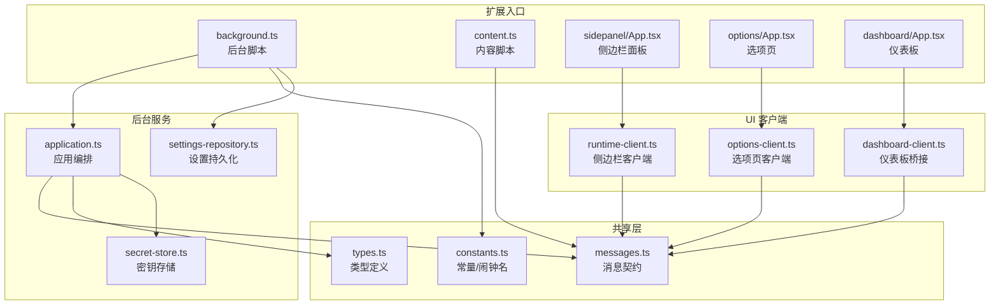
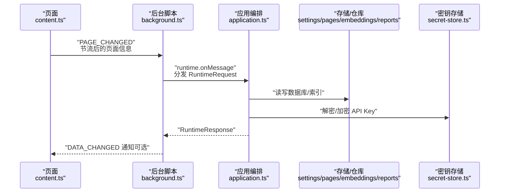
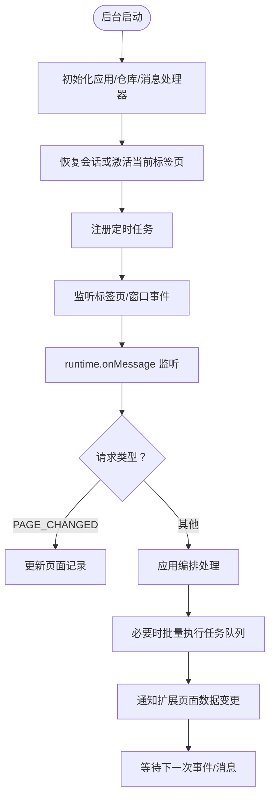
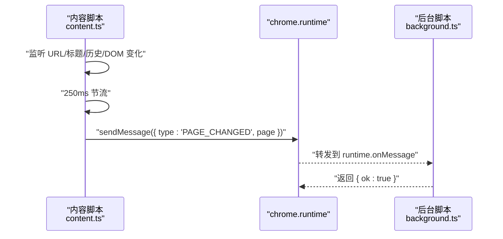
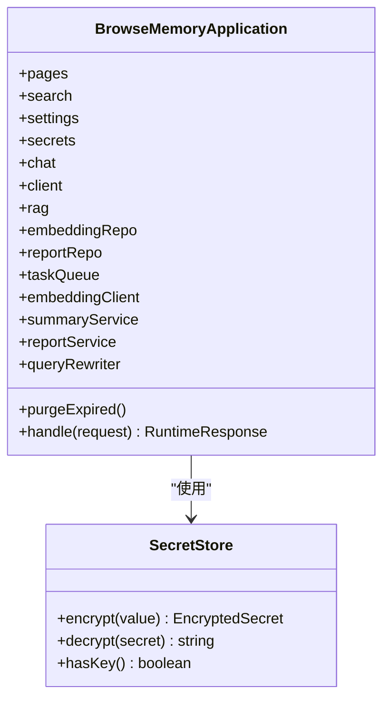
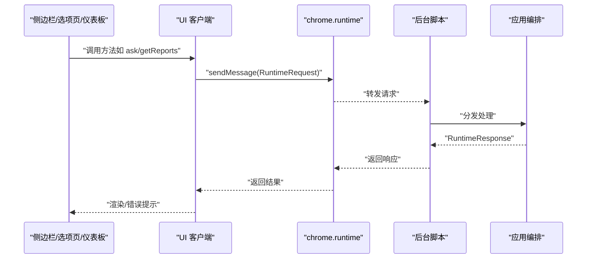
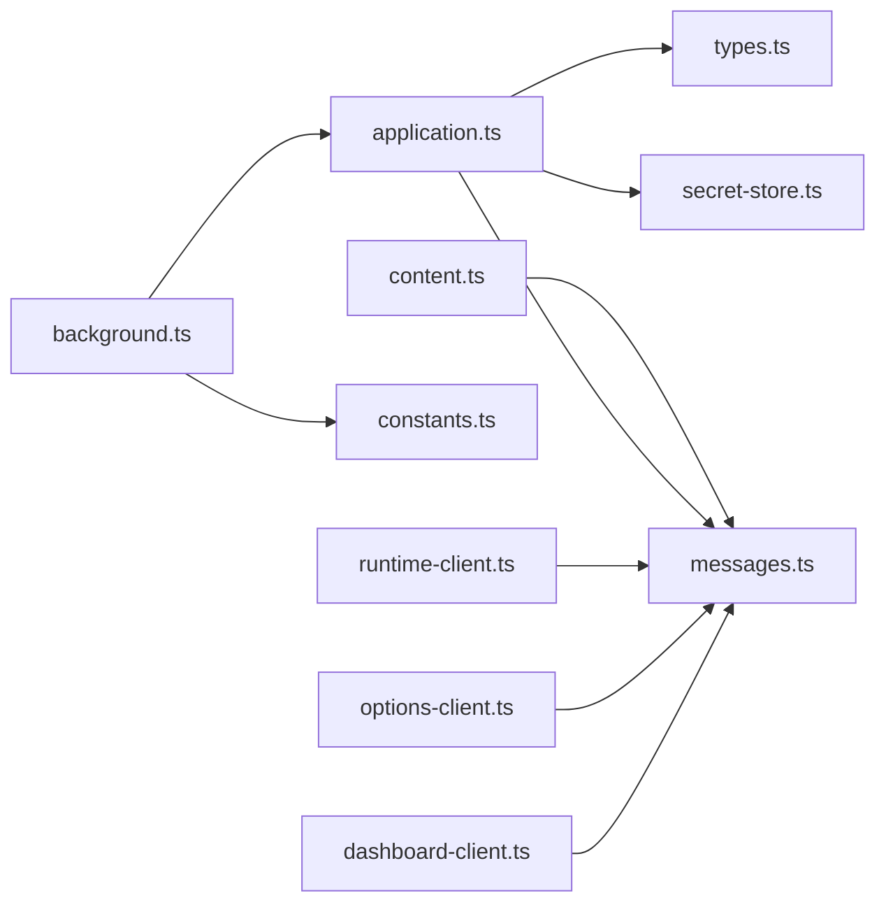

# 扩展集成方案

<cite>
**本文档引用的文件**
- [wxt.config.ts](file://wxt.config.ts)
- [background.ts](file://entrypoints/background.ts)
- [content.ts](file://entrypoints/content.ts)
- [messages.ts](file://src/shared/messages.ts)
- [application.ts](file://src/background/application.ts)
- [constants.ts](file://src/shared/constants.ts)
- [runtime-client.ts](file://src/ui/runtime-client.ts)
- [options-client.ts](file://src/ui/options-client.ts)
- [dashboard-client.ts](file://src/ui/dashboard-client.ts)
- [types.ts](file://src/shared/types.ts)
- [secret-store.ts](file://src/security/secret-store.ts)
- [settings-repository.ts](file://src/storage/settings-repository.ts)
- [App.tsx（侧边栏）](file://entrypoints/sidepanel/App.tsx)
- [App.tsx（选项页）](file://entrypoints/options/App.tsx)
- [App.tsx（仪表板）](file://entrypoints/dashboard/App.tsx)
</cite>

## 目录
1. [简介](#简介)
2. [项目结构](#项目结构)
3. [核心组件](#核心组件)
4. [架构总览](#架构总览)
5. [详细组件分析](#详细组件分析)
6. [依赖关系分析](#依赖关系分析)
7. [性能考虑](#性能考虑)
8. [故障排除指南](#故障排除指南)
9. [结论](#结论)
10. [附录](#附录)

## 简介
本方案面向 BrowseMemory Chrome 扩展，系统化阐述扩展的集成架构与实现细节，覆盖以下主题：
- Service Worker 注册与管理：后台脚本生命周期、会话协调、定时任务与消息处理
- 内容脚本注入机制：页面变更检测、消息上报与节流策略
- 消息传递协议设计：请求/响应类型定义、前后台通信桥接与错误处理
- 扩展入口点职责：background、content、sidepanel、options 的角色与协作
- 与 Chrome 扩展 API 的交互模式：权限声明、alarms、storage、sidePanel 等
- 安全模型与权限管理：密钥加密存储、最小权限原则、运行时权限检查
- 架构图与消息流程示例：可视化展示前后台通信与任务执行链路

## 项目结构
扩展采用基于 WXT 的模块化组织，入口点位于 entrypoints 目录，业务逻辑分布在 src 子目录中，共享类型与常量位于 src/shared。

**图表来源**
- [background.ts:1-241](file://entrypoints/background.ts#L1-L241)
- [content.ts:1-44](file://entrypoints/content.ts#L1-L44)
- [messages.ts:1-71](file://src/shared/messages.ts#L1-L71)
- [application.ts:1-388](file://src/background/application.ts#L1-L388)
- [constants.ts:1-33](file://src/shared/constants.ts#L1-L33)
- [runtime-client.ts:1-182](file://src/ui/runtime-client.ts#L1-L182)
- [options-client.ts:1-87](file://src/ui/options-client.ts#L1-L87)
- [dashboard-client.ts:1-148](file://src/ui/dashboard-client.ts#L1-L148)
- [types.ts:1-139](file://src/shared/types.ts#L1-L139)
- [secret-store.ts:1-70](file://src/security/secret-store.ts#L1-L70)
- [settings-repository.ts:1-57](file://src/storage/settings-repository.ts#L1-L57)

**章节来源**
- [wxt.config.ts:1-19](file://wxt.config.ts#L1-L19)
- [background.ts:1-241](file://entrypoints/background.ts#L1-L241)
- [content.ts:1-44](file://entrypoints/content.ts#L1-L44)
- [messages.ts:1-71](file://src/shared/messages.ts#L1-L71)
- [application.ts:1-388](file://src/background/application.ts#L1-L388)
- [constants.ts:1-33](file://src/shared/constants.ts#L1-L33)
- [runtime-client.ts:1-182](file://src/ui/runtime-client.ts#L1-L182)
- [options-client.ts:1-87](file://src/ui/options-client.ts#L1-L87)
- [dashboard-client.ts:1-148](file://src/ui/dashboard-client.ts#L1-L148)
- [types.ts:1-139](file://src/shared/types.ts#L1-L139)
- [secret-store.ts:1-70](file://src/security/secret-store.ts#L1-L70)
- [settings-repository.ts:1-57](file://src/storage/settings-repository.ts#L1-L57)

## 核心组件
- 后台脚本（background.ts）
  - 负责应用生命周期管理、会话协调、定时任务调度、消息路由与任务队列执行
  - 使用 SessionCoordinator 维护当前标签页会话，使用 TaskRunner 处理异步任务
  - 注册 alarms 实现心跳、清理、嵌入回填与报告生成
- 内容脚本（content.ts）
  - 在页面上下文中监听 URL/标题变化、历史操作与 DOM 变更，节流后向后台发送 PAGE_CHANGED
- 应用编排（application.ts）
  - 提供统一的 RuntimeRequest 处理器，封装检索、问答、聊天、报告、嵌入与摘要等能力
  - 集成 SecretStore 进行敏感信息加密存储，支持查询重写与混合检索
- 消息协议（messages.ts）
  - 定义 RuntimeRequest/RuntimeResponse 的完整契约，涵盖检索、问答、聊天、设置、报告、嵌入等
- UI 客户端（runtime-client.ts、options-client.ts、dashboard-client.ts）
  - 为侧边栏、选项页、仪表板提供统一的 chrome.runtime.sendMessage 封装与错误处理
  - 仪表板通过 postMessage 桥接在侧边栏 iframe 中调用后台功能
- 共享常量与类型（constants.ts、types.ts）
  - 定义默认设置、会话键、闹钟名称、任务类型、报告类型等
- 安全与设置（secret-store.ts、settings-repository.ts）
  - 基于 Web Crypto 的 AES-GCM 加密，密钥持久化；设置项默认值与清空逻辑

**章节来源**
- [background.ts:1-241](file://entrypoints/background.ts#L1-L241)
- [application.ts:1-388](file://src/background/application.ts#L1-L388)
- [messages.ts:1-71](file://src/shared/messages.ts#L1-L71)
- [runtime-client.ts:1-182](file://src/ui/runtime-client.ts#L1-L182)
- [options-client.ts:1-87](file://src/ui/options-client.ts#L1-L87)
- [dashboard-client.ts:1-148](file://src/ui/dashboard-client.ts#L1-L148)
- [constants.ts:1-33](file://src/shared/constants.ts#L1-L33)
- [types.ts:1-139](file://src/shared/types.ts#L1-L139)
- [secret-store.ts:1-70](file://src/security/secret-store.ts#L1-L70)
- [settings-repository.ts:1-57](file://src/storage/settings-repository.ts#L1-L57)

## 架构总览
下图展示了扩展从内容脚本到后台脚本，再到应用服务与存储的完整链路，并标注了消息流向与关键事件。

**图表来源**
- [content.ts:1-44](file://entrypoints/content.ts#L1-L44)
- [background.ts:1-241](file://entrypoints/background.ts#L1-L241)
- [application.ts:1-388](file://src/background/application.ts#L1-L388)
- [secret-store.ts:1-70](file://src/security/secret-store.ts#L1-L70)

## 详细组件分析

### Service Worker 与后台脚本（background.ts）
- 生命周期与职责
  - 初始化应用实例、设置仓库、消息处理器与会话协调器
  - 恢复上次会话，若无则激活当前活动标签页
  - 注册 alarms：心跳、清理、嵌入回填、报告生成
  - 监听标签页事件（切换、关闭、窗口焦点变化），驱动会话状态
- 消息处理
  - 处理来自内容脚本的 PAGE_CHANGED，更新页面记录
  - 转发通用 RuntimeRequest 到应用编排层，必要时触发任务队列批处理
  - 通过 chrome.runtime.sendMessage 通知扩展页面（如侧边栏）数据变更
- 任务队列
  - 支持 embed、summarize、report_daily/weekly/monthly 等任务类型
  - 通过 TaskRunner 批量执行，结合退避重试策略

**图表来源**
- [background.ts:1-241](file://entrypoints/background.ts#L1-L241)

**章节来源**
- [background.ts:1-241](file://entrypoints/background.ts#L1-L241)

### 内容脚本注入与消息协议（content.ts 与 messages.ts）
- 注入匹配
  - 匹配 http/https 所有页面，确保跨站访问一致性
- 页面变更检测
  - 监听 location.href、document.title、history.push/replace、popstate
  - 使用 250ms 节流，避免高频变更导致的消息风暴
- 消息协议
  - PAGE_CHANGED 请求携带 { url, title, content }，由后台脚本解析并入库
  - 与后台脚本的 RuntimeRequest/RuntimeResponse 类型保持一致

**图表来源**
- [content.ts:1-44](file://entrypoints/content.ts#L1-L44)
- [messages.ts:1-71](file://src/shared/messages.ts#L1-L71)

**章节来源**
- [content.ts:1-44](file://entrypoints/content.ts#L1-L44)
- [messages.ts:1-71](file://src/shared/messages.ts#L1-L71)

### 应用编排与消息处理（application.ts 与 messages.ts）
- 请求分发
  - STORE_CAPTURE：入库并按需入队嵌入与摘要任务
  - SEARCH/RECENT/GET_TODAY_SNAPSHOT：检索与统计
  - ASK：构建对话历史、查询重写、混合检索与 RAG 回答
  - CHAT 会话：列出、创建、添加消息、删除
  - 报告：按日/周/月生成并持久化
  - 设置：获取/保存、测试连接、清空数据、存储用量
  - 嵌入：状态查询、回填触发、队列状态
- 错误处理
  - 统一返回 { ok: false, code, message }，由 UI 客户端抛出 BrowseMemoryError
- 安全与密钥
  - 通过 SecretStore 对 API Key 进行加解密，避免明文存储

**图表来源**
- [application.ts:1-388](file://src/background/application.ts#L1-L388)
- [secret-store.ts:1-70](file://src/security/secret-store.ts#L1-L70)

**章节来源**
- [application.ts:1-388](file://src/background/application.ts#L1-L388)
- [messages.ts:1-71](file://src/shared/messages.ts#L1-L71)
- [secret-store.ts:1-70](file://src/security/secret-store.ts#L1-L70)

### UI 客户端与扩展页面（runtime-client.ts、options-client.ts、dashboard-client.ts）
- 侧边栏客户端（runtime-client.ts）
  - 提供 getSnapshot、search、ask、聊天会话管理、报告获取与生成、嵌入状态与队列状态查询
  - 统一封装 sendMessage 并将非 ok 响应转换为 BrowseMemoryError
- 选项页客户端（options-client.ts）
  - 获取/保存设置、测试连接、触发嵌入回填、获取存储用量、清空数据
- 仪表板桥接（dashboard-client.ts）
  - 在侧边栏 iframe 中通过 postMessage 与父级通信，兼容无 chrome.runtime 场景
  - 支持超时控制与错误码透传

**图表来源**
- [runtime-client.ts:1-182](file://src/ui/runtime-client.ts#L1-L182)
- [options-client.ts:1-87](file://src/ui/options-client.ts#L1-L87)
- [dashboard-client.ts:1-148](file://src/ui/dashboard-client.ts#L1-L148)
- [background.ts:1-241](file://entrypoints/background.ts#L1-L241)
- [application.ts:1-388](file://src/background/application.ts#L1-L388)

**章节来源**
- [runtime-client.ts:1-182](file://src/ui/runtime-client.ts#L1-L182)
- [options-client.ts:1-87](file://src/ui/options-client.ts#L1-L87)
- [dashboard-client.ts:1-148](file://src/ui/dashboard-client.ts#L1-L148)

### 扩展入口点与职责分工
- background（后台脚本）
  - 注册与管理 Service Worker 生命周期
  - 会话协调、定时任务、消息路由、任务队列执行
- content（内容脚本）
  - 页面变更检测与节流上报
- sidepanel（侧边栏面板）
  - 用户交互界面，调用 runtime-client 发起检索、问答、聊天、报告等请求
- options（选项页）
  - 设置管理、连接测试、数据清理、嵌入回填触发
- dashboard（仪表板）
  - 报告浏览与生成，通过 postMessage 桥接父级侧边栏

**章节来源**
- [background.ts:1-241](file://entrypoints/background.ts#L1-L241)
- [content.ts:1-44](file://entrypoints/content.ts#L1-L44)
- [App.tsx（侧边栏）:1-834](file://entrypoints/sidepanel/App.tsx#L1-L834)
- [App.tsx（选项页）:1-529](file://entrypoints/options/App.tsx#L1-L529)
- [App.tsx（仪表板）:1-208](file://entrypoints/dashboard/App.tsx#L1-L208)

### 与 Chrome 扩展 API 的交互模式
- 权限声明（wxt.config.ts）
  - tabs、activeTab：获取当前标签页信息
  - storage：本地存储（IndexedDB 封装）
  - alarms：定时任务
  - sidePanel：侧边栏行为控制
  - host_permissions：<all_urls>：跨站页面访问
- 交互要点
  - chrome.runtime.sendMessage：前后台消息通信
  - chrome.alarms：周期性任务调度
  - chrome.storage.session：会话状态临时存储
  - chrome.sidePanel.setPanelBehavior：点击动作时打开侧边栏
  - chrome.tabs.create：打开外部链接

**章节来源**
- [wxt.config.ts:1-19](file://wxt.config.ts#L1-L19)
- [background.ts:1-241](file://entrypoints/background.ts#L1-L241)

### 安全模型与权限管理
- 密钥加密存储
  - SecretStore 基于 Web Crypto AES-GCM，随机 IV，密钥持久化
  - SettingsRepository 仅保存加密后的密钥片段，不暴露明文
- 最小权限原则
  - 仅申请必要权限，host_permissions 用于跨站页面提取
  - 通过权限检查与错误码反馈，避免越权操作
- 运行时权限检查
  - UI 客户端在无 chrome.runtime 时自动降级为 postMessage 桥接

**章节来源**
- [secret-store.ts:1-70](file://src/security/secret-store.ts#L1-L70)
- [settings-repository.ts:1-57](file://src/storage/settings-repository.ts#L1-L57)
- [dashboard-client.ts:1-148](file://src/ui/dashboard-client.ts#L1-L148)

## 依赖关系分析
- 组件耦合
  - background 依赖 application 与仓库层，耦合集中在消息分发与任务执行
  - content 仅依赖 messages，低耦合高内聚
  - UI 客户端统一依赖 messages 与 chrome.runtime，便于替换实现
- 外部依赖
  - WXT 模块化打包与 React 渲染
  - Dexie 作为 IndexedDB 封装
  - 浏览器原生 API：chrome.*、Web Crypto、fetch

**图表来源**
- [content.ts:1-44](file://entrypoints/content.ts#L1-L44)
- [background.ts:1-241](file://entrypoints/background.ts#L1-L241)
- [application.ts:1-388](file://src/background/application.ts#L1-L388)
- [messages.ts:1-71](file://src/shared/messages.ts#L1-L71)
- [runtime-client.ts:1-182](file://src/ui/runtime-client.ts#L1-L182)
- [options-client.ts:1-87](file://src/ui/options-client.ts#L1-L87)
- [dashboard-client.ts:1-148](file://src/ui/dashboard-client.ts#L1-L148)
- [secret-store.ts:1-70](file://src/security/secret-store.ts#L1-L70)
- [types.ts:1-139](file://src/shared/types.ts#L1-L139)

**章节来源**
- [background.ts:1-241](file://entrypoints/background.ts#L1-L241)
- [application.ts:1-388](file://src/background/application.ts#L1-L388)
- [messages.ts:1-71](file://src/shared/messages.ts#L1-L71)
- [runtime-client.ts:1-182](file://src/ui/runtime-client.ts#L1-L182)
- [options-client.ts:1-87](file://src/ui/options-client.ts#L1-L87)
- [dashboard-client.ts:1-148](file://src/ui/dashboard-client.ts#L1-L148)

## 性能考虑
- 内容脚本节流
  - PAGE_CHANGED 采用 250ms 节流，降低消息频率，避免 UI 卡顿
- 任务批处理
  - TaskRunner 批量执行任务，减少频繁 IO 与网络请求
- 退避重试
  - 任务重试采用指数退避策略，缓解瞬时失败
- 懒加载与虚拟滚动
  - 侧边栏按天懒加载与 IntersectionObserver 触发，提升长列表性能
- 离线与回退
  - 无 API Key 或网络异常时，优雅降级并提示用户

## 故障排除指南
- 常见错误与定位
  - 缺少 API Key：TEST_CONNECTION/TEST_EMBEDDING_CONNECTION 返回缺失密钥错误码
  - 任务失败：GET_QUEUE_STATUS 查看 pending/processing/failed 数量
  - 数据未更新：确认 BACKGROUND 是否收到 PAGE_CHANGED 并触发 DATA_CHANGED 通知
- 排查步骤
  - 检查后台脚本日志与 alarms 是否正常
  - 在选项页进行连接测试，确认 host_permissions 与权限授予
  - 清理数据后重试，验证存储用量与设置是否被正确清空
- UI 错误处理
  - UI 客户端统一捕获非 ok 响应并抛出 BrowseMemoryError，便于用户感知

**章节来源**
- [application.ts:1-388](file://src/background/application.ts#L1-L388)
- [runtime-client.ts:1-182](file://src/ui/runtime-client.ts#L1-L182)
- [options-client.ts:1-87](file://src/ui/options-client.ts#L1-L87)
- [background.ts:1-241](file://entrypoints/background.ts#L1-L241)

## 结论
本方案以清晰的职责划分与严格的前后台消息契约，实现了从页面采集到智能检索与问答的完整闭环。通过任务队列、定时任务与安全存储，扩展在保证用户体验的同时兼顾了性能与隐私。建议后续持续优化任务调度策略与 UI 交互体验，并完善离线场景下的缓存与回退机制。

## 附录
- 关键常量与类型
  - 闹钟名称：心跳、清理、嵌入回填、报告前缀
  - 任务类型：embed、summarize、report_daily/weekly/monthly
  - 报告类型：daily、weekly、monthly
- 权限清单
  - tabs、activeTab、storage、alarms、sidePanel、host_permissions:<all_urls>

**章节来源**
- [constants.ts:1-33](file://src/shared/constants.ts#L1-L33)
- [types.ts:1-139](file://src/shared/types.ts#L1-L139)
- [wxt.config.ts:1-19](file://wxt.config.ts#L1-L19)