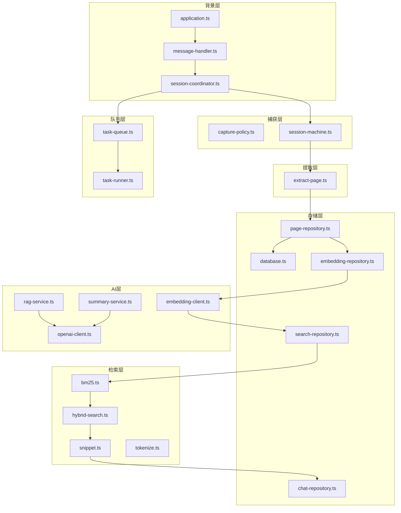
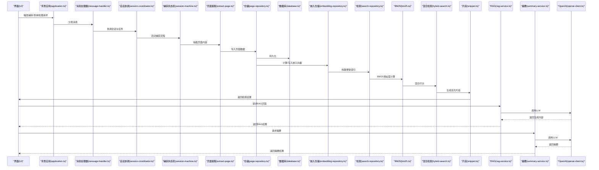
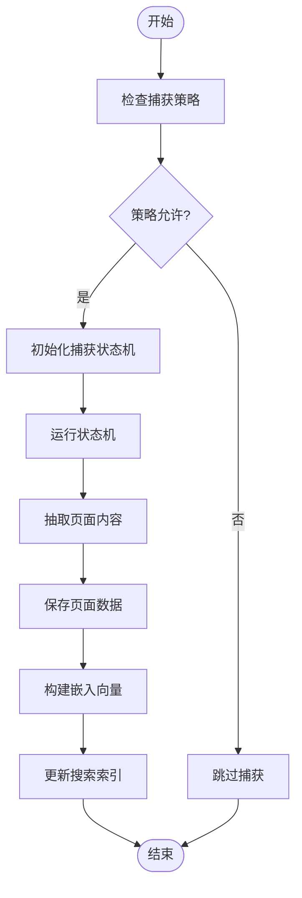
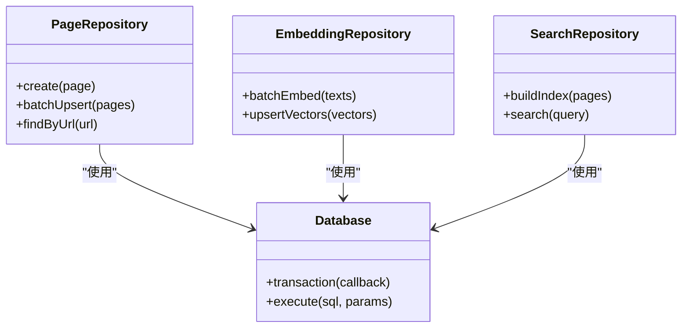
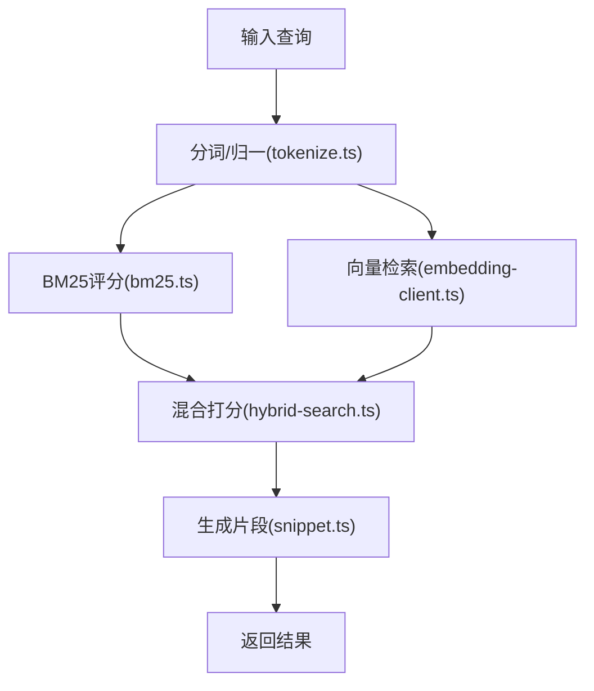
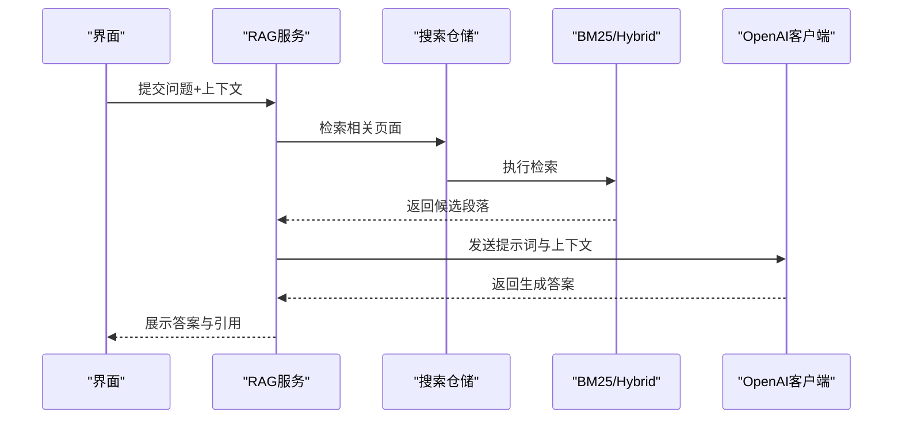
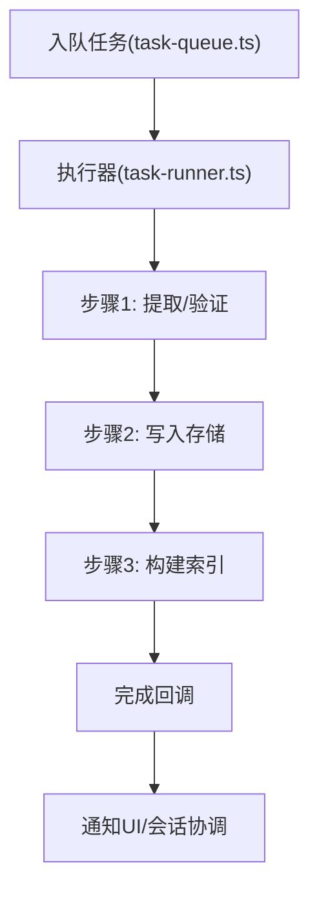
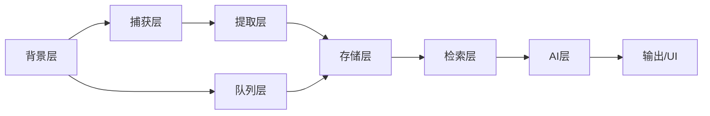

# 数据流架构

<cite>
**本文档引用的文件**
- [README.md](file://README.md)
- [application.ts](file://src/background/application.ts)
- [message-handler.ts](file://src/background/message-handler.ts)
- [session-coordinator.ts](file://src/background/session-coordinator.ts)
- [capture-policy.ts](file://src/capture/capture-policy.ts)
- [session-machine.ts](file://src/capture/session-machine.ts)
- [extract-page.ts](file://src/extraction/extract-page.ts)
- [database.ts](file://src/storage/database.ts)
- [page-repository.ts](file://src/storage/page-repository.ts)
- [embedding-repository.ts](file://src/storage/embedding-repository.ts)
- [search-repository.ts](file://src/storage/search-repository.ts)
- [chat-repository.ts](file://src/storage/chat-repository.ts)
- [bm25.ts](file://src/search/bm25.ts)
- [hybrid-search.ts](file://src/search/hybrid-search.ts)
- [snippet.ts](file://src/search/snippet.ts)
- [tokenize.ts](file://src/search/tokenize.ts)
- [rag-service.ts](file://src/ai/rag-service.ts)
- [summary-service.ts](file://src/ai/summary-service.ts)
- [openai-client.ts](file://src/ai/openai-client.ts)
- [embedding-client.ts](file://src/ai/embedding-client.ts)
- [task-queue.ts](file://src/queue/task-queue.ts)
- [task-runner.ts](file://src/queue/task-runner.ts)
</cite>

## 目录
1. [简介](#简介)
2. [项目结构](#项目结构)
3. [核心组件](#核心组件)
4. [架构总览](#架构总览)
5. [详细组件分析](#详细组件分析)
6. [依赖关系分析](#依赖关系分析)
7. [性能考虑](#性能考虑)
8. [故障排除指南](#故障排除指南)
9. [结论](#结论)

## 简介
本文件面向BrowseMemory项目的“数据流架构”，系统性梳理从页面捕获到数据存储，再到AI处理与检索的完整数据流程。重点覆盖以下方面：
- 页面内容提取与验证
- 存储写入与索引构建
- 搜索查询与片段生成
- AI处理（RAG与摘要）
- 异步数据处理机制（Promise链、事件队列、回调）
- 缓存策略与性能优化
- 关键业务场景的数据流与时序图

该文档旨在帮助开发者与产品人员理解数据在各模块间的流转路径，并为后续扩展与优化提供依据。

## 项目结构
BrowseMemory采用分层与功能域结合的组织方式：
- 背景层：应用生命周期管理、消息处理、会话协调
- 捕获层：捕获策略与状态机驱动的页面捕获流程
- 提取层：页面内容抽取与清洗
- 存储层：数据库与各类仓储（页面、嵌入、搜索、聊天、设置）
- 检索层：BM25、混合检索与片段生成
- AI层：RAG服务、摘要服务、Embedding与LLM客户端
- 队列层：任务队列与执行器，支撑异步处理

图表来源
- [application.ts](file://src/background/application.ts)
- [message-handler.ts](file://src/background/message-handler.ts)
- [session-coordinator.ts](file://src/background/session-coordinator.ts)
- [capture-policy.ts](file://src/capture/capture-policy.ts)
- [session-machine.ts](file://src/capture/session-machine.ts)
- [extract-page.ts](file://src/extraction/extract-page.ts)
- [database.ts](file://src/storage/database.ts)
- [page-repository.ts](file://src/storage/page-repository.ts)
- [embedding-repository.ts](file://src/storage/embedding-repository.ts)
- [search-repository.ts](file://src/storage/search-repository.ts)
- [chat-repository.ts](file://src/storage/chat-repository.ts)
- [bm25.ts](file://src/search/bm25.ts)
- [hybrid-search.ts](file://src/search/hybrid-search.ts)
- [snippet.ts](file://src/search/snippet.ts)
- [tokenize.ts](file://src/search/tokenize.ts)
- [rag-service.ts](file://src/ai/rag-service.ts)
- [summary-service.ts](file://src/ai/summary-service.ts)
- [openai-client.ts](file://src/ai/openai-client.ts)
- [embedding-client.ts](file://src/ai/embedding-client.ts)
- [task-queue.ts](file://src/queue/task-queue.ts)
- [task-runner.ts](file://src/queue/task-runner.ts)

章节来源
- [README.md](file://README.md)
- [application.ts](file://src/background/application.ts)
- [message-handler.ts](file://src/background/message-handler.ts)
- [session-coordinator.ts](file://src/background/session-coordinator.ts)
- [capture-policy.ts](file://src/capture/capture-policy.ts)
- [session-machine.ts](file://src/capture/session-machine.ts)
- [extract-page.ts](file://src/extraction/extract-page.ts)
- [database.ts](file://src/storage/database.ts)
- [page-repository.ts](file://src/storage/page-repository.ts)
- [embedding-repository.ts](file://src/storage/embedding-repository.ts)
- [search-repository.ts](file://src/storage/search-repository.ts)
- [chat-repository.ts](file://src/storage/chat-repository.ts)
- [bm25.ts](file://src/search/bm25.ts)
- [hybrid-search.ts](file://src/search/hybrid-search.ts)
- [snippet.ts](file://src/search/snippet.ts)
- [tokenize.ts](file://src/search/tokenize.ts)
- [rag-service.ts](file://src/ai/rag-service.ts)
- [summary-service.ts](file://src/ai/summary-service.ts)
- [openai-client.ts](file://src/ai/openai-client.ts)
- [embedding-client.ts](file://src/ai/embedding-client.ts)
- [task-queue.ts](file://src/queue/task-queue.ts)
- [task-runner.ts](file://src/queue/task-runner.ts)

## 核心组件
- 背景应用与消息处理：负责扩展生命周期管理、消息路由与会话协调，是前端UI与后台处理的桥梁。
- 捕获策略与状态机：定义何时捕获、如何触发捕获流程，以及捕获过程的状态转换。
- 页面提取：对页面DOM进行解析、清洗与结构化抽取，形成可检索的文本块。
- 存储与仓储：统一数据库访问与领域仓储，分别负责页面、嵌入向量、搜索索引、聊天记录与设置的持久化。
- 检索与片段：基于BM25与混合策略进行相关性排序，生成高亮片段用于展示。
- AI处理：RAG服务整合上下文与检索结果，摘要服务生成简明总结；两者均通过OpenAI与Embedding客户端调用外部模型。
- 任务队列：异步批处理与后台任务调度，确保高并发下的稳定性与吞吐。

章节来源
- [application.ts](file://src/background/application.ts)
- [message-handler.ts](file://src/background/message-handler.ts)
- [session-coordinator.ts](file://src/background/session-coordinator.ts)
- [capture-policy.ts](file://src/capture/capture-policy.ts)
- [session-machine.ts](file://src/capture/session-machine.ts)
- [extract-page.ts](file://src/extraction/extract-page.ts)
- [database.ts](file://src/storage/database.ts)
- [page-repository.ts](file://src/storage/page-repository.ts)
- [embedding-repository.ts](file://src/storage/embedding-repository.ts)
- [search-repository.ts](file://src/storage/search-repository.ts)
- [chat-repository.ts](file://src/storage/chat-repository.ts)
- [bm25.ts](file://src/search/bm25.ts)
- [hybrid-search.ts](file://src/search/hybrid-search.ts)
- [snippet.ts](file://src/search/snippet.ts)
- [tokenize.ts](file://src/search/tokenize.ts)
- [rag-service.ts](file://src/ai/rag-service.ts)
- [summary-service.ts](file://src/ai/summary-service.ts)
- [openai-client.ts](file://src/ai/openai-client.ts)
- [embedding-client.ts](file://src/ai/embedding-client.ts)
- [task-queue.ts](file://src/queue/task-queue.ts)
- [task-runner.ts](file://src/queue/task-runner.ts)

## 架构总览
下图展示了端到端的数据流：从页面捕获开始，经由提取、存储、索引、检索，最终进入AI处理与输出。

图表来源
- [application.ts](file://src/background/application.ts)
- [message-handler.ts](file://src/background/message-handler.ts)
- [session-coordinator.ts](file://src/background/session-coordinator.ts)
- [session-machine.ts](file://src/capture/session-machine.ts)
- [extract-page.ts](file://src/extraction/extract-page.ts)
- [page-repository.ts](file://src/storage/page-repository.ts)
- [database.ts](file://src/storage/database.ts)
- [embedding-repository.ts](file://src/storage/embedding-repository.ts)
- [search-repository.ts](file://src/storage/search-repository.ts)
- [bm25.ts](file://src/search/bm25.ts)
- [hybrid-search.ts](file://src/search/hybrid-search.ts)
- [snippet.ts](file://src/search/snippet.ts)
- [rag-service.ts](file://src/ai/rag-service.ts)
- [summary-service.ts](file://src/ai/summary-service.ts)
- [openai-client.ts](file://src/ai/openai-client.ts)

## 详细组件分析

### 页面捕获与状态机
- 捕获策略：根据URL策略与用户配置决定是否捕获，避免重复与无效页面。
- 状态机：驱动捕获流程的启动、等待、完成与失败状态转换，保证流程可控与可观测。
- 与会话协调配合：在消息处理后触发捕获，确保前后端事件一致。

图表来源
- [capture-policy.ts](file://src/capture/capture-policy.ts)
- [session-machine.ts](file://src/capture/session-machine.ts)
- [extract-page.ts](file://src/extraction/extract-page.ts)
- [page-repository.ts](file://src/storage/page-repository.ts)
- [embedding-repository.ts](file://src/storage/embedding-repository.ts)
- [search-repository.ts](file://src/storage/search-repository.ts)

章节来源
- [capture-policy.ts](file://src/capture/capture-policy.ts)
- [session-machine.ts](file://src/capture/session-machine.ts)
- [extract-page.ts](file://src/extraction/extract-page.ts)
- [page-repository.ts](file://src/storage/page-repository.ts)
- [embedding-repository.ts](file://src/storage/embedding-repository.ts)
- [search-repository.ts](file://src/storage/search-repository.ts)

### 页面内容提取与验证
- DOM解析与清洗：去除脚本、样式、无用标签，保留正文与标题。
- 结构化抽取：按段落、列表、标题层级生成可检索文本块。
- 数据验证：校验URL合法性、内容长度阈值、编码一致性，过滤噪声。

章节来源
- [extract-page.ts](file://src/extraction/extract-page.ts)

### 存储与索引构建
- 页面仓储：封装页面元数据与正文的CRUD操作，支持批量写入。
- 嵌入仓储：对接Embedding客户端，批量生成向量并写入向量库。
- 搜索仓储：维护倒排索引与元数据映射，支持快速检索。
- 数据库：事务性写入，保证一致性与原子性。

图表来源
- [page-repository.ts](file://src/storage/page-repository.ts)
- [embedding-repository.ts](file://src/storage/embedding-repository.ts)
- [search-repository.ts](file://src/storage/search-repository.ts)
- [database.ts](file://src/storage/database.ts)

章节来源
- [page-repository.ts](file://src/storage/page-repository.ts)
- [embedding-repository.ts](file://src/storage/embedding-repository.ts)
- [search-repository.ts](file://src/storage/search-repository.ts)
- [database.ts](file://src/storage/database.ts)

### 检索与片段生成
- BM25：基于词频统计计算相关性得分。
- 混合检索：融合BM25与向量相似度，提升召回质量。
- 片段生成：在匹配段落中定位高相关区间，生成带高亮的片段。
- 分词与归一：Tokenize模块提供分词与规范化，提高检索精度。

图表来源
- [tokenize.ts](file://src/search/tokenize.ts)
- [bm25.ts](file://src/search/bm25.ts)
- [embedding-client.ts](file://src/ai/embedding-client.ts)
- [hybrid-search.ts](file://src/search/hybrid-search.ts)
- [snippet.ts](file://src/search/snippet.ts)

章节来源
- [bm25.ts](file://src/search/bm25.ts)
- [hybrid-search.ts](file://src/search/hybrid-search.ts)
- [snippet.ts](file://src/search/snippet.ts)
- [tokenize.ts](file://src/search/tokenize.ts)
- [embedding-client.ts](file://src/ai/embedding-client.ts)

### AI处理（RAG与摘要）
- RAG服务：整合检索结果与上下文，调用OpenAI客户端生成回答。
- 摘要服务：对长文本或对话历史生成简洁摘要。
- 客户端：Embedding客户端负责向量生成；OpenAI客户端负责对话与补全。

图表来源
- [rag-service.ts](file://src/ai/rag-service.ts)
- [search-repository.ts](file://src/storage/search-repository.ts)
- [bm25.ts](file://src/search/bm25.ts)
- [hybrid-search.ts](file://src/search/hybrid-search.ts)
- [openai-client.ts](file://src/ai/openai-client.ts)

章节来源
- [rag-service.ts](file://src/ai/rag-service.ts)
- [summary-service.ts](file://src/ai/summary-service.ts)
- [openai-client.ts](file://src/ai/openai-client.ts)
- [embedding-client.ts](file://src/ai/embedding-client.ts)

### 异步数据处理机制
- Promise链：在提取、存储、索引与检索中广泛使用，确保步骤有序与错误可追踪。
- 事件队列：会话协调器与任务队列协同，将耗时操作异步化，避免阻塞主线程。
- 回调处理：消息处理器对不同通道的消息进行分派，触发相应处理流程。

图表来源
- [task-queue.ts](file://src/queue/task-queue.ts)
- [task-runner.ts](file://src/queue/task-runner.ts)
- [session-coordinator.ts](file://src/background/session-coordinator.ts)

章节来源
- [task-queue.ts](file://src/queue/task-queue.ts)
- [task-runner.ts](file://src/queue/task-runner.ts)
- [session-coordinator.ts](file://src/background/session-coordinator.ts)

## 依赖关系分析
- 组件耦合：背景层与会话协调紧密耦合，消息处理作为入口；其他层相对独立，通过仓储与客户端解耦。
- 外部依赖：Embedding与OpenAI客户端作为外部服务接口，需关注超时与重试策略。
- 循环依赖：当前设计未见循环导入，模块间通过接口与仓储隔离。

图表来源
- [application.ts](file://src/background/application.ts)
- [message-handler.ts](file://src/background/message-handler.ts)
- [session-coordinator.ts](file://src/background/session-coordinator.ts)
- [session-machine.ts](file://src/capture/session-machine.ts)
- [extract-page.ts](file://src/extraction/extract-page.ts)
- [page-repository.ts](file://src/storage/page-repository.ts)
- [search-repository.ts](file://src/storage/search-repository.ts)
- [rag-service.ts](file://src/ai/rag-service.ts)
- [task-queue.ts](file://src/queue/task-queue.ts)

章节来源
- [application.ts](file://src/background/application.ts)
- [message-handler.ts](file://src/background/message-handler.ts)
- [session-coordinator.ts](file://src/background/session-coordinator.ts)
- [session-machine.ts](file://src/capture/session-machine.ts)
- [extract-page.ts](file://src/extraction/extract-page.ts)
- [page-repository.ts](file://src/storage/page-repository.ts)
- [search-repository.ts](file://src/storage/search-repository.ts)
- [rag-service.ts](file://src/ai/rag-service.ts)
- [task-queue.ts](file://src/queue/task-queue.ts)

## 性能考虑
- 批量处理：仓储与队列均支持批量写入与执行，降低I/O与网络开销。
- 向量化加速：Embedding向量用于近似最近邻检索，显著提升大规模文本的相似度计算效率。
- 检索融合：BM25与向量检索融合，减少单一指标偏差带来的性能波动。
- 缓存策略：建议在UI层对热门查询结果与片段进行短期缓存；在检索层对热点页面的向量与倒排索引进行内存驻留。
- 超时与重试：对外部客户端（Embedding/OpenAI）设置合理超时与指数退避重试，保障稳定性。
- 并发控制：队列执行器限制并发度，避免资源争用导致的抖动。

## 故障排除指南
- 捕获失败：检查捕获策略与状态机日志，确认URL策略与页面加载时机。
- 提取异常：核对DOM解析规则与编码处理，定位空内容或编码错误。
- 存储写入：查看仓储事务与数据库回滚日志，确认唯一约束与字段校验。
- 检索无结果：检查分词与索引构建流程，确认向量维度与索引参数。
- AI调用失败：检查外部客户端配置与配额，关注超时与限流响应。
- 队列堆积：监控队列长度与执行时延，调整并发与重试策略。

章节来源
- [capture-policy.ts](file://src/capture/capture-policy.ts)
- [session-machine.ts](file://src/capture/session-machine.ts)
- [extract-page.ts](file://src/extraction/extract-page.ts)
- [page-repository.ts](file://src/storage/page-repository.ts)
- [embedding-repository.ts](file://src/storage/embedding-repository.ts)
- [search-repository.ts](file://src/storage/search-repository.ts)
- [rag-service.ts](file://src/ai/rag-service.ts)
- [openai-client.ts](file://src/ai/openai-client.ts)
- [embedding-client.ts](file://src/ai/embedding-client.ts)
- [task-queue.ts](file://src/queue/task-queue.ts)
- [task-runner.ts](file://src/queue/task-runner.ts)

## 结论
BrowseMemory的数据流以“捕获-提取-存储-索引-检索-AI处理”为主线，通过仓储与客户端实现模块解耦，借助队列与Promise链实现异步与可观测性。建议在现有基础上强化缓存与并发控制，完善错误恢复与监控告警，持续优化检索融合与向量质量，以获得更稳定、更快捷、更智能的用户体验。