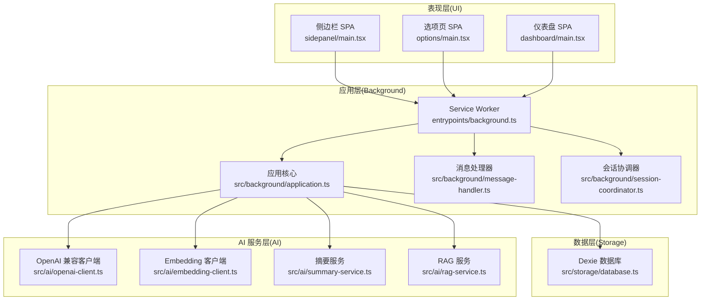
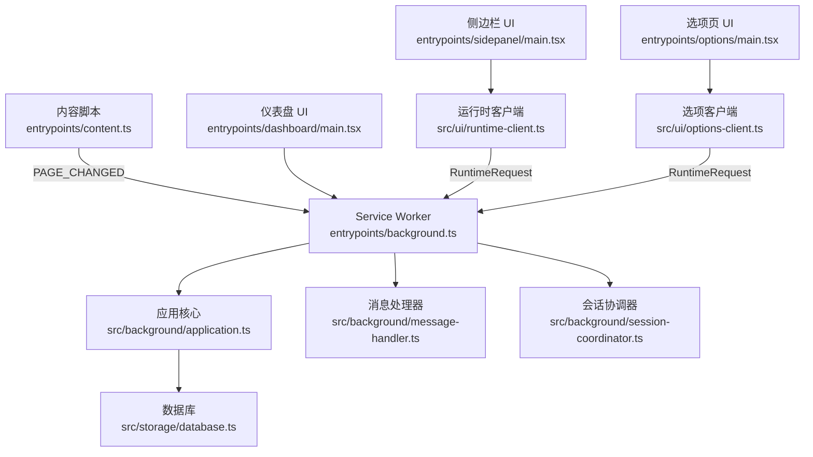
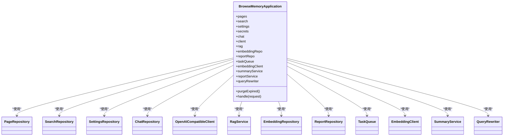
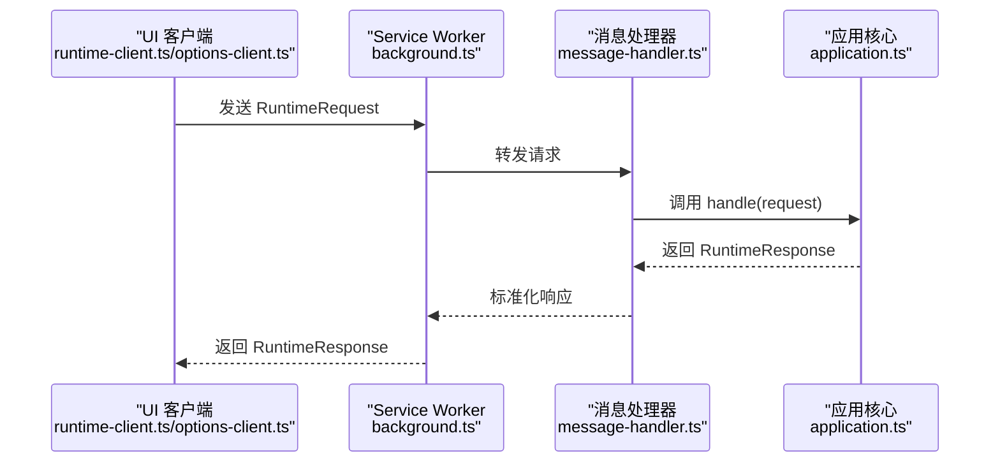
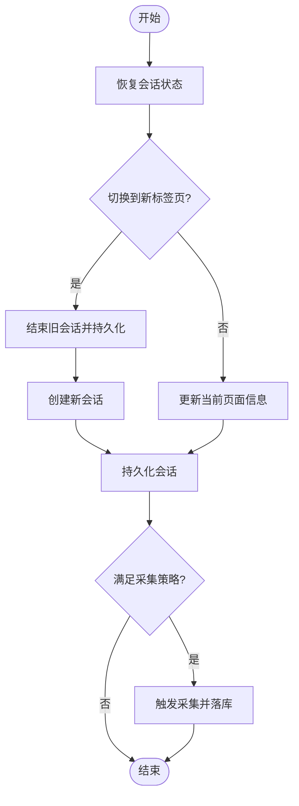
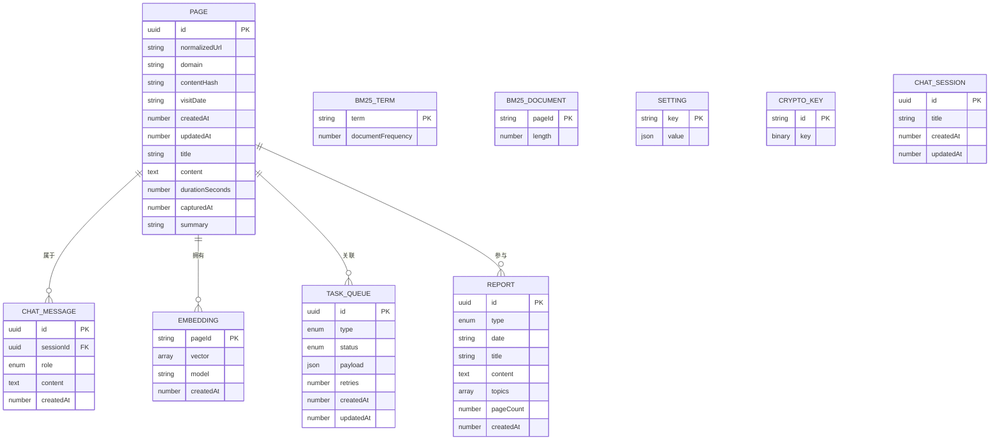
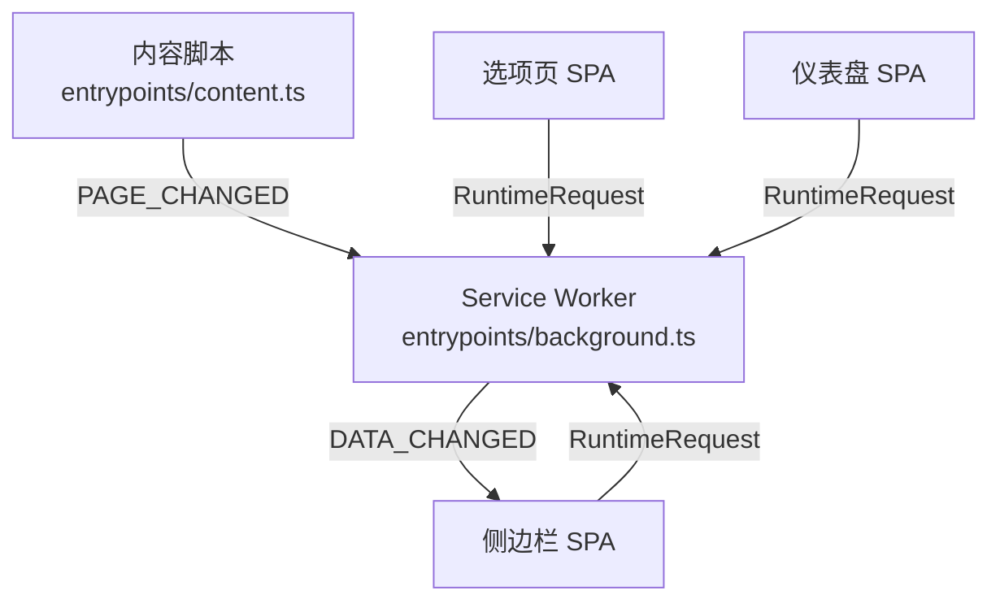
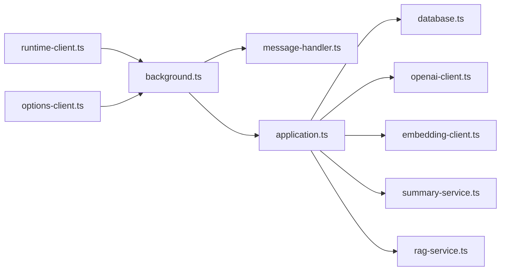

# 整体架构概览

<cite>
**本文档引用的文件**
- [README.md](file://README.md)
- [wxt.config.ts](file://wxt.config.ts)
- [background.ts](file://entrypoints/background.ts)
- [content.ts](file://entrypoints/content.ts)
- [application.ts](file://src/background/application.ts)
- [message-handler.ts](file://src/background/message-handler.ts)
- [session-coordinator.ts](file://src/background/session-coordinator.ts)
- [messages.ts](file://src/shared/messages.ts)
- [types.ts](file://src/shared/types.ts)
- [database.ts](file://src/storage/database.ts)
- [runtime-client.ts](file://src/ui/runtime-client.ts)
- [options-client.ts](file://src/ui/options-client.ts)
- [dashboard/main.tsx](file://entrypoints/dashboard/main.tsx)
- [options/main.tsx](file://entrypoints/options/main.tsx)
- [sidepanel/main.tsx](file://entrypoints/sidepanel/main.tsx)
</cite>

## 目录
1. [简介](#简介)
2. [项目结构](#项目结构)
3. [核心组件](#核心组件)
4. [架构总览](#架构总览)
5. [详细组件分析](#详细组件分析)
6. [依赖关系分析](#依赖关系分析)
7. [性能考量](#性能考量)
8. [故障排查指南](#故障排查指南)
9. [结论](#结论)
10. [附录](#附录)

## 简介
BrowseMemory 是一个本地优先的 Chrome 扩展，目标是帮助用户“搜索并询问自己的浏览记忆”。其核心能力包括：
- 自动采集符合策略的页面正文与阅读时长，并以本地 IndexedDB 存储
- 提供 BM25 离线全文检索；在启用语义搜索时，结合向量检索与混合排序
- 支持基于 RAG 的问答与来源引用，以及 AI 自动生成的页面摘要与报告
- 采用任务队列异步处理 Embedding、摘要与报告生成，具备重试与降级策略
- 严格隐私设计：API Key 加密存储，不申请敏感权限，隐身模式默认不采集

## 项目结构
项目采用分层与模块化设计，围绕 Chrome MV3 扩展的典型入口进行组织：
- 表现层（UI 层）：侧边栏、选项页、仪表盘三套 React SPA，分别对应记录、设置与报告场景
- 应用层（业务逻辑层）：Service Worker 作为应用中枢，负责消息路由、会话协调、任务调度与业务编排
- 数据层（存储层）：Dexie 管理 IndexedDB，提供多表结构与版本迁移
- AI 服务层（外部集成）：OpenAI 兼容聊天、Embedding 与摘要服务，支持可选的语义搜索与报告生成

**图表来源**
- [background.ts:39-241](file://entrypoints/background.ts#L39-L241)
- [application.ts:29-63](file://src/background/application.ts#L29-L63)
- [database.ts:34-79](file://src/storage/database.ts#L34-L79)

**章节来源**
- [README.md:94-115](file://README.md#L94-L115)
- [wxt.config.ts:3-18](file://wxt.config.ts#L3-L18)

## 核心组件
- BrowseMemoryApplication：应用核心类，集中管理仓储、AI 服务与任务队列，统一处理来自 UI 的运行时请求
- MessageHandler：将运行时请求委托给应用核心，并捕获错误转换为标准化响应
- SessionCoordinator：维护当前标签页的阅读会话状态，依据采集策略决定是否落库
- Storage(Database)：定义 Dexie 表结构与版本迁移，承载页面、索引、聊天、嵌入、任务与报告等数据
- RuntimeClient/OptionsClient：UI 与 Service Worker 的消息桥接层，封装运行时请求与响应
- AI 服务：OpenAI 兼容客户端、Embedding 客户端、摘要与 RAG 服务，支持可选的语义搜索与报告生成

**章节来源**
- [application.ts:29-63](file://src/background/application.ts#L29-L63)
- [message-handler.ts:6-21](file://src/background/message-handler.ts#L6-L21)
- [session-coordinator.ts:28-35](file://src/background/session-coordinator.ts#L28-L35)
- [database.ts:34-79](file://src/storage/database.ts#L34-L79)
- [runtime-client.ts:50-48](file://src/ui/runtime-client.ts#L50-L48)
- [options-client.ts:35-33](file://src/ui/options-client.ts#L35-L33)

## 架构总览
BrowseMemory 的整体架构遵循“表现层-应用层-数据层-AI 服务层”的分层设计，并在 Chrome MV3 环境下采用 Service Worker、内容脚本与后台页面的协作模式：
- 内容脚本（content.ts）：监听页面 URL 变化、SPA 导航与 DOM 变更，周期性提取正文并通过消息通道上报
- Service Worker（background.ts）：作为应用中枢，接收来自 UI 与内容脚本的消息，协调会话、调用应用核心、调度任务与定时器
- 后台页面（sidepanel/options/dashboard）：三套 React SPA，通过 runtimeClient/optionsClient 与 Service Worker 通信
- 应用核心（application.ts）：集中处理业务逻辑，包含依赖注入（构造函数注入仓储与服务实例）
- 数据层（database.ts）：Dexie 管理多张表，支持版本迁移与索引优化
- AI 服务层：OpenAI 兼容聊天、Embedding 与摘要服务，支持查询改写、混合检索与报告生成

**图表来源**
- [content.ts:3-43](file://entrypoints/content.ts#L3-L43)
- [background.ts:39-241](file://entrypoints/background.ts#L39-L241)
- [sidepanel/main.tsx:1-18](file://entrypoints/sidepanel/main.tsx#L1-L18)
- [options/main.tsx:1-15](file://entrypoints/options/main.tsx#L1-L15)
- [dashboard/main.tsx:1-15](file://entrypoints/dashboard/main.tsx#L1-L15)
- [runtime-client.ts:18-24](file://src/ui/runtime-client.ts#L18-L24)
- [options-client.ts:6-12](file://src/ui/options-client.ts#L6-L12)
- [application.ts:74-352](file://src/background/application.ts#L74-L352)
- [database.ts:34-79](file://src/storage/database.ts#L34-L79)

## 详细组件分析

### 组件一：应用核心 BrowseMemoryApplication
- 职责：统一处理运行时请求，协调仓储与 AI 服务，提供清理、搜索、问答、会话管理、报告与任务队列等功能
- 设计要点：构造函数注入多个仓储与服务实例，形成依赖注入模式；对外暴露 handle 方法集中处理请求类型
- 关键流程：ASK 请求中包含查询改写、可选 Embedding 查询、混合检索与 RAG 回答；支持多轮会话历史与降级策略

**图表来源**
- [application.ts:29-63](file://src/background/application.ts#L29-L63)

**章节来源**
- [application.ts:74-352](file://src/background/application.ts#L74-L352)

### 组件二：消息处理与事件驱动
- 运行时消息协议：通过 messages.ts 定义 RuntimeRequest/RuntimeResponse，涵盖搜索、问答、会话、报告、设置等全部能力
- 事件驱动：background.ts 注册 alarms、tabs/window 事件与 runtime.onMessage 监听器，形成事件驱动的控制流
- 错误处理：message-handler.ts 将 OpenAIRequestError 转换为标准化响应，其他异常返回通用错误码

**图表来源**
- [runtime-client.ts:18-24](file://src/ui/runtime-client.ts#L18-L24)
- [background.ts:226-239](file://entrypoints/background.ts#L226-L239)
- [message-handler.ts:6-21](file://src/background/message-handler.ts#L6-L21)
- [application.ts:74-352](file://src/background/application.ts#L74-L352)

**章节来源**
- [messages.ts:13-71](file://src/shared/messages.ts#L13-L71)
- [message-handler.ts:6-21](file://src/background/message-handler.ts#L6-L21)
- [background.ts:195-239](file://entrypoints/background.ts#L195-L239)

### 组件三：会话协调与采集策略
- 会话状态：SessionCoordinator 维护当前标签页的阅读会话，包含活跃状态、URL 变化与时间戳
- 采集策略：根据最小阅读时长、黑名单与隐身模式等规则判断是否采集
- 生命周期：tick/switchTo/setActive/finalize 等方法确保在合适时机落库并持久化

**图表来源**
- [session-coordinator.ts:41-149](file://src/background/session-coordinator.ts#L41-L149)

**章节来源**
- [session-coordinator.ts:28-157](file://src/background/session-coordinator.ts#L28-L157)

### 组件四：数据层与模块化设计
- 数据模型：database.ts 定义页面、BM25 索引、设置、加密密钥、聊天、嵌入、任务与报告等表结构
- 版本迁移：通过 Dexie 的 version/stores 逐步升级，保证向后兼容
- 模块化：各 Repository（Page/Search/Settings/Chat/Embedding/Report/Task）封装 CRUD 与领域逻辑

**图表来源**
- [database.ts:12-79](file://src/storage/database.ts#L12-L79)

**章节来源**
- [database.ts:34-79](file://src/storage/database.ts#L34-L79)

### 组件五：Chrome 扩展特有架构模式
- Service Worker：作为长期运行的后台进程，负责定时任务、消息路由与全局状态
- 内容脚本：注入到页面，监听 SPA 导航与 DOM 变更，周期性提取正文并通过消息上报
- 后台页面：侧边栏、选项页、仪表盘三套 SPA，通过 chrome.runtime 与 Service Worker 通信

**图表来源**
- [content.ts:3-43](file://entrypoints/content.ts#L3-L43)
- [background.ts:59-65](file://entrypoints/background.ts#L59-L65)
- [sidepanel/main.tsx:1-18](file://entrypoints/sidepanel/main.tsx#L1-L18)
- [options/main.tsx:1-15](file://entrypoints/options/main.tsx#L1-L15)
- [dashboard/main.tsx:1-15](file://entrypoints/dashboard/main.tsx#L1-L15)

**章节来源**
- [content.ts:3-43](file://entrypoints/content.ts#L3-L43)
- [background.ts:39-241](file://entrypoints/background.ts#L39-L241)

## 依赖关系分析
- 组件耦合：应用核心聚合仓储与服务，消息处理器仅承担适配与错误转换，降低 UI 与业务逻辑耦合
- 外部依赖：Dexie 用于本地存储；浏览器 API（tabs/storage/alarms/runtime）用于扩展能力
- 依赖注入：通过构造函数注入仓储与服务实例，便于测试与替换实现
- 循环依赖：未见直接循环依赖；消息协议与类型定义被多处共享，但无循环导入

**图表来源**
- [runtime-client.ts:18-24](file://src/ui/runtime-client.ts#L18-L24)
- [options-client.ts:6-12](file://src/ui/options-client.ts#L6-L12)
- [background.ts:39-241](file://entrypoints/background.ts#L39-L241)
- [application.ts:46-63](file://src/background/application.ts#L46-L63)
- [database.ts:34-79](file://src/storage/database.ts#L34-L79)

**章节来源**
- [runtime-client.ts:50-48](file://src/ui/runtime-client.ts#L50-L48)
- [options-client.ts:35-33](file://src/ui/options-client.ts#L35-L33)
- [application.ts:46-63](file://src/background/application.ts#L46-L63)

## 性能考量
- 异步任务队列：Phase 2 引入任务队列与调度器，将 Embedding、摘要与报告生成异步化，避免阻塞主线程
- 混合检索：在有 Embedding 时进行向量检索与 BM25 融合，无 Embedding 或离线时自动降级为纯 BM25
- 事件节流：内容脚本对导航与 DOM 变更进行去抖处理，减少频繁上报
- 存储优化：Dexie 多表结构与索引字段，配合版本迁移保障数据访问效率

## 故障排查指南
- API Key 缺失或无效：应用核心提供连接测试接口，若缺失或无效将返回明确错误码
- 问答失败：检查在线状态与 API 配置；若 Embedding 失败会自动降级为 BM25 搜索
- 任务队列异常：通过队列状态接口查看 pending/processing/failed 数量，必要时手动回填 Embedding
- 数据清理：定期清理过期数据，释放存储空间

**章节来源**
- [application.ts:130-177](file://src/background/application.ts#L130-L177)
- [application.ts:343-350](file://src/background/application.ts#L343-L350)
- [runtime-client.ts:172-174](file://src/ui/runtime-client.ts#L172-L174)

## 结论
BrowseMemory 通过清晰的分层架构与事件驱动的消息传递，实现了本地优先的浏览记忆系统。其核心优势在于：
- 明确的职责划分与依赖注入，提升可维护性与可测试性
- Chrome MV3 特有的 Service Worker、内容脚本与后台页面协作模式
- 可选的 AI 能力与降级策略，兼顾功能与稳定性
- 模块化的数据层与任务队列，支撑扩展性与异步处理

## 附录
- 架构图与组件关系图已在前述章节中给出，建议结合源码路径定位具体实现
- 如需进一步了解某一层或模块的细节，请参考相应章节与源文件