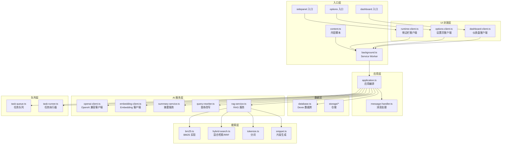
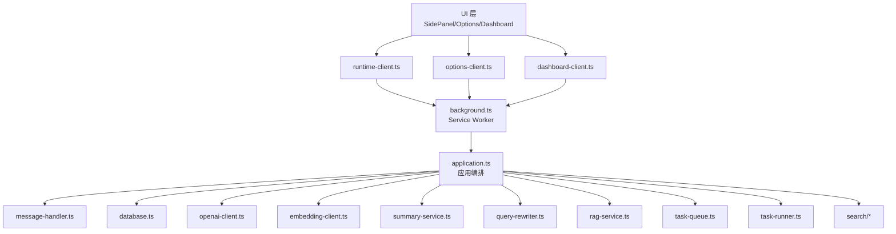
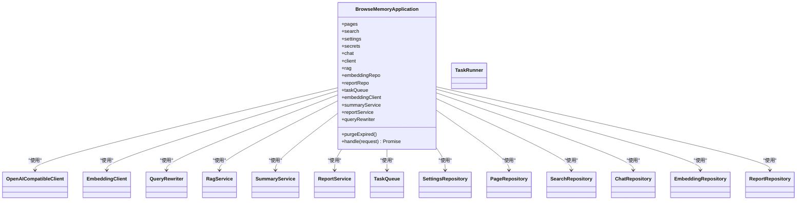
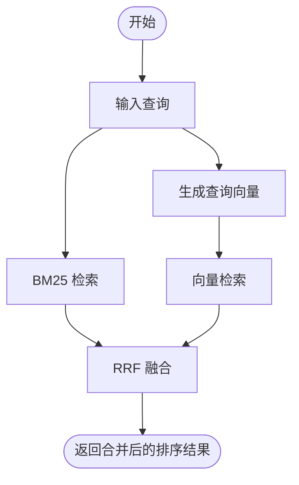
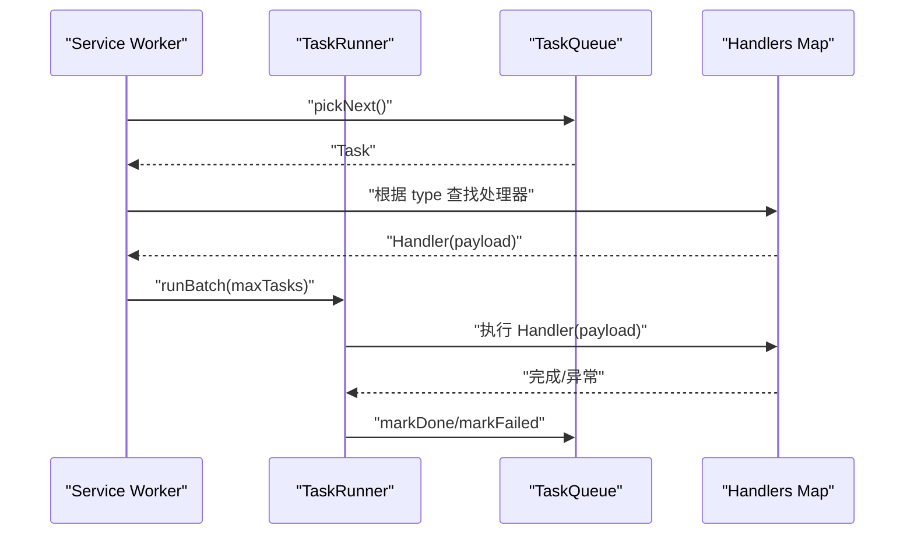
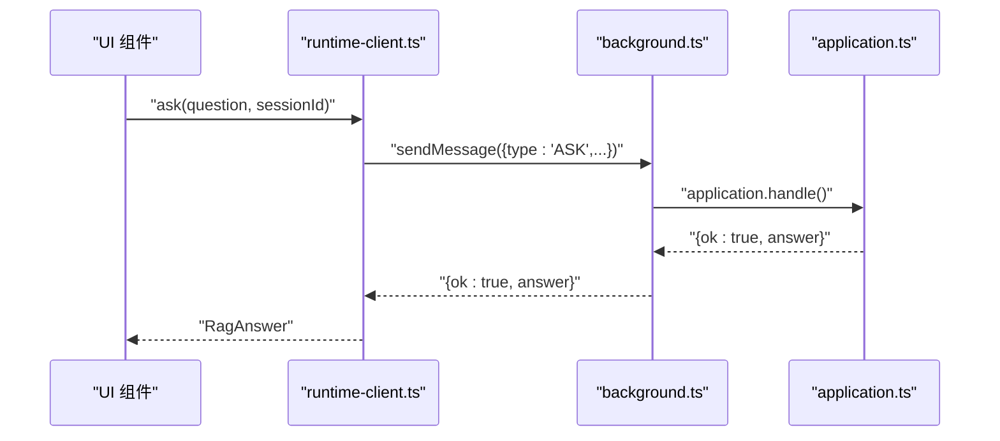
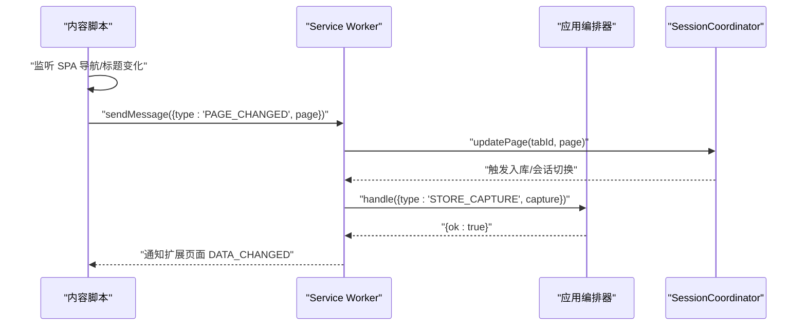
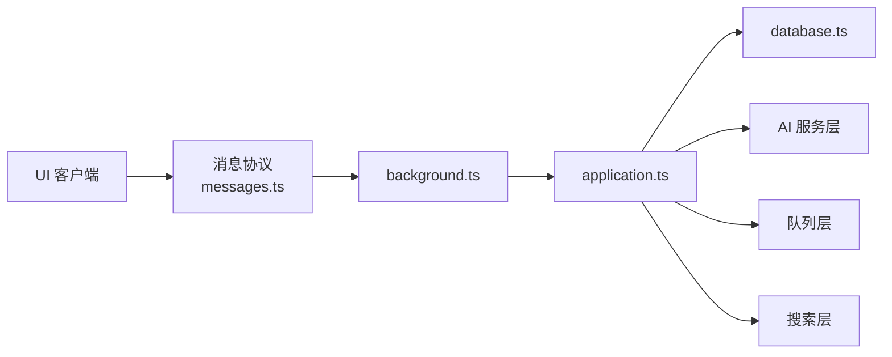

# 架构设计

<cite>
**本文档引用的文件**
- [README.md](file://README.md)
- [wxt.config.ts](file://wxt.config.ts)
- [package.json](file://package.json)
- [entrypoints/background.ts](file://entrypoints/background.ts)
- [entrypoints/content.ts](file://entrypoints/content.ts)
- [src/background/application.ts](file://src/background/application.ts)
- [src/background/message-handler.ts](file://src/background/message-handler.ts)
- [src/capture/session-machine.ts](file://src/capture/session-machine.ts)
- [src/storage/database.ts](file://src/storage/database.ts)
- [src/shared/types.ts](file://src/shared/types.ts)
- [src/ai/openai-client.ts](file://src/ai/openai-client.ts)
- [src/queue/task-runner.ts](file://src/queue/task-runner.ts)
- [src/search/hybrid-search.ts](file://src/search/hybrid-search.ts)
- [src/ui/dashboard-client.ts](file://src/ui/dashboard-client.ts)
- [src/ui/options-client.ts](file://src/ui/options-client.ts)
- [src/ui/runtime-client.ts](file://src/ui/runtime-client.ts)
</cite>

## 目录
1. [简介](#简介)
2. [项目结构](#项目结构)
3. [核心组件](#核心组件)
4. [架构总览](#架构总览)
5. [详细组件分析](#详细组件分析)
6. [依赖分析](#依赖分析)
7. [性能考量](#性能考量)
8. [故障排查指南](#故障排查指南)
9. [结论](#结论)
10. [附录](#附录)

## 简介
BrowseMemory 是一个本地优先的 Chrome 扩展，目标是“把浏览记忆带入你的本地”。其核心能力包括：
- 自动记录符合规则的网页正文与阅读时长
- 本地 IndexedDB 存储（Dexie）
- 离线 BM25 搜索；可选语义搜索（向量检索）与混合检索（BM25 + 向量 + RRF 融合）
- OpenAI 兼容的单轮 RAG 问答与来源引用
- AES-GCM 加密 API Key
- 侧边栏、设置页、报告仪表盘等 UI
- 离线任务队列与定时任务（Alarms）

该项目采用分层架构、事件驱动架构与依赖注入思想，围绕 Service Worker 的后台进程统一编排，内容脚本负责页面事件捕获，UI 层通过 runtime 客户端与后台通信。

## 项目结构
项目采用按“职责领域”组织的模块化结构，入口点与核心业务模块清晰分离：
- 入口层：background.ts（Service Worker）、content.ts（内容脚本）、UI 入口（sidepanel、options、dashboard）
- 应用层：src/background/application.ts（应用编排、消息处理、RAG/任务队列协调）
- 数据层：src/storage/*（Dexie 数据库与仓储）
- AI 服务层：src/ai/*（OpenAI 兼容客户端、Embedding、摘要、查询改写、RAG）
- 搜索层：src/search/*（BM25、混合检索、RRF 融合）
- 队列层：src/queue/*（任务队列、任务执行器）
- UI 封装层：src/ui/*（runtime-client、options-client、dashboard-client）
- 共享层：src/shared/*（类型、常量、消息协议）

**图表来源**
- [entrypoints/background.ts:1-241](file://entrypoints/background.ts#L1-L241)
- [entrypoints/content.ts:1-44](file://entrypoints/content.ts#L1-L44)
- [src/background/application.ts:1-388](file://src/background/application.ts#L1-L388)
- [src/background/message-handler.ts:1-22](file://src/background/message-handler.ts#L1-L22)
- [src/storage/database.ts:1-80](file://src/storage/database.ts#L1-L80)
- [src/ai/openai-client.ts:1-125](file://src/ai/openai-client.ts#L1-L125)
- [src/queue/task-runner.ts:1-41](file://src/queue/task-runner.ts#L1-L41)
- [src/search/hybrid-search.ts:1-78](file://src/search/hybrid-search.ts#L1-L78)
- [src/ui/runtime-client.ts:1-182](file://src/ui/runtime-client.ts#L1-L182)
- [src/ui/options-client.ts:1-87](file://src/ui/options-client.ts#L1-L87)
- [src/ui/dashboard-client.ts:1-148](file://src/ui/dashboard-client.ts#L1-L148)

**章节来源**
- [README.md:94-115](file://README.md#L94-L115)
- [wxt.config.ts:1-19](file://wxt.config.ts#L1-L19)
- [package.json:1-49](file://package.json#L1-L49)

## 核心组件
- 应用编排器（BrowseMemoryApplication）
  - 职责：集中处理来自 UI 的运行时请求，协调仓储、AI 服务、任务队列与报告服务；提供清理过期数据、测试连接等功能。
  - 关键交互：与 SettingsRepository、PageRepository、SearchRepository、ChatRepository、EmbeddingRepository、ReportRepository、TaskQueue、OpenAICompatibleClient、EmbeddingClient、SummaryService、ReportService、QueryRewriter 等协作。
- 消息处理器（createMessageHandler）
  - 职责：将运行时请求委托给应用编排器，并统一错误处理（OpenAIRequestError 映射为特定 code）。
- 数据库与仓储（Dexie）
  - 职责：定义表结构（pages、bm25Terms、bm25Documents、settings、cryptoKeys、chatSessions、chatMessages、embeddings、taskQueue、reports），提供 CRUD 与聚合查询。
- AI 服务层
  - OpenAI 兼容客户端：封装聊天接口调用、SSE 解析、错误码映射。
  - Embedding 客户端：封装向量接口调用。
  - 摘要服务：基于聊天接口生成页面摘要。
  - 查询改写：多轮对话中将代词还原为具体实体。
  - RAG 服务：结合 BM25 与向量检索结果进行融合与回答生成。
- 搜索层
  - BM25：离线全文检索基础。
  - 混合检索与 RRF：将 BM25 与向量相似度合并排序。
- 队列层
  - 任务队列：持久化任务（embed、summarize、report_*），支持重试与状态管理。
  - 任务执行器：周期性拉取并执行任务，失败重试与计数统计。
- UI 封装层
  - runtime-client：侧边栏 UI 与后台通信。
  - options-client：设置页 UI 与后台通信。
  - dashboard-client：报告仪表盘 UI 与后台通信（iframe 内嵌场景下提供 postMessage 桥）。

**章节来源**
- [src/background/application.ts:29-63](file://src/background/application.ts#L29-L63)
- [src/background/message-handler.ts:6-21](file://src/background/message-handler.ts#L6-L21)
- [src/storage/database.ts:34-79](file://src/storage/database.ts#L34-L79)
- [src/ai/openai-client.ts:56-124](file://src/ai/openai-client.ts#L56-L124)
- [src/queue/task-runner.ts:7-40](file://src/queue/task-runner.ts#L7-L40)
- [src/ui/runtime-client.ts:50-181](file://src/ui/runtime-client.ts#L50-L181)
- [src/ui/options-client.ts:35-86](file://src/ui/options-client.ts#L35-L86)
- [src/ui/dashboard-client.ts:99-147](file://src/ui/dashboard-client.ts#L99-L147)

## 架构总览
系统采用“分层 + 事件驱动 + 依赖注入”的组合架构：
- 分层架构
  - UI 层：SidePanel、Options、Dashboard，通过 runtime-client、options-client、dashboard-client 与后台通信。
  - 应用层：background.ts 中的 Service Worker 作为中枢，应用编排器集中处理业务逻辑。
  - 数据层：Dexie 提供本地数据库与仓储抽象。
  - AI 服务层：封装外部 OpenAI 兼容 API 与 Embedding API。
- 事件驱动架构
  - 内容脚本监听 SPA 导航与 DOM 变化，周期性上报页面变更。
  - Service Worker 响应 Alarms（心跳、清理、Embedding 回填、报告生成）与消息事件。
  - 任务执行器按批处理队列任务。
- 依赖注入
  - 应用编排器构造时注入数据库与各类服务实例，形成松耦合的服务组合。

**图表来源**
- [entrypoints/background.ts:1-241](file://entrypoints/background.ts#L1-L241)
- [src/background/application.ts:1-388](file://src/background/application.ts#L1-L388)
- [src/background/message-handler.ts:1-22](file://src/background/message-handler.ts#L1-L22)
- [src/storage/database.ts:1-80](file://src/storage/database.ts#L1-L80)
- [src/ai/openai-client.ts:1-125](file://src/ai/openai-client.ts#L1-L125)
- [src/ui/runtime-client.ts:1-182](file://src/ui/runtime-client.ts#L1-L182)
- [src/ui/options-client.ts:1-87](file://src/ui/options-client.ts#L1-L87)
- [src/ui/dashboard-client.ts:1-148](file://src/ui/dashboard-client.ts#L1-L148)

## 详细组件分析

### 应用层：BrowseMemoryApplication
- 职责
  - 接收并处理运行时请求（搜索、问答、会话管理、设置读写、测试连接、清理、报告生成、队列状态等）。
  - 在入库页面时按配置入队 Embedding 与摘要任务。
  - 在多轮对话中进行查询改写，必要时回退至纯 BM25。
- 设计要点
  - 通过 SettingsRepository 读取配置，SecretStore 管理加密密钥。
  - 通过 TaskQueue 入队异步任务，由 TaskRunner 批量执行。
  - 通过 OpenAICompatibleClient 与 EmbeddingClient 调用外部服务。
- 错误处理
  - 将 OpenAIRequestError 映射为明确的 code（认证、限流、网络、超时、提供商）。
  - 其他异常统一返回“未知错误”。

**图表来源**
- [src/background/application.ts:29-63](file://src/background/application.ts#L29-L63)

**章节来源**
- [src/background/application.ts:74-352](file://src/background/application.ts#L74-L352)

### 数据层：Dexie 数据库与仓储
- 数据库版本演进
  - 版本 1：pages、bm25Terms、bm25Documents、settings、cryptoKeys
  - 版本 2：新增 chatSessions、chatMessages
  - 版本 3：新增 embeddings、taskQueue、reports
- 仓储职责
  - PageRepository：页面增删改查、去重、时间聚合、摘要更新
  - SearchRepository：最近记录、日期列表、按日查询、BM25/混合检索
  - SettingsRepository：设置读写、清理
  - EmbeddingRepository：向量存取、索引统计
  - ReportRepository：报告列表与详情
  - ChatRepository：会话与消息管理
  - TaskQueue：任务入队、出队、状态管理
- 复杂度与性能
  - BM25 文档/词条表用于离线检索，适合中小规模数据。
  - 向量检索采用暴力匹配，适合小于 10K 文档的场景。

**章节来源**
- [src/storage/database.ts:46-76](file://src/storage/database.ts#L46-L76)
- [src/shared/types.ts:32-138](file://src/shared/types.ts#L32-L138)

### 搜索层：BM25 与混合检索
- BM25
  - 基于 term/document 表计算词频与文档长度，支持离线快速检索。
- 向量检索
  - 余弦相似度计算，暴力搜索，TopK 返回。
- RRF 融合
  - Reciprocal Rank Fusion 将两类排序结果合并，提升召回质量。

**图表来源**
- [src/search/hybrid-search.ts:13-77](file://src/search/hybrid-search.ts#L13-L77)

**章节来源**
- [src/search/hybrid-search.ts:1-78](file://src/search/hybrid-search.ts#L1-L78)

### 队列层：任务队列与执行器
- 任务类型
  - embed：为页面生成向量
  - summarize：生成页面摘要
  - report_daily/weekly/monthly：生成报告
- 执行策略
  - TaskRunner 批量拉取任务，逐个执行，失败重试与计数统计。
  - Service Worker 通过 Alarms 触发批量执行。

**图表来源**
- [entrypoints/background.ts:78-152](file://entrypoints/background.ts#L78-L152)
- [src/queue/task-runner.ts:13-39](file://src/queue/task-runner.ts#L13-L39)

**章节来源**
- [entrypoints/background.ts:78-152](file://entrypoints/background.ts#L78-L152)
- [src/queue/task-runner.ts:1-41](file://src/queue/task-runner.ts#L1-L41)

### UI 层：客户端封装与桥接
- runtime-client：侧边栏 UI 与后台通信，封装搜索、问答、会话管理、报告、队列状态等。
- options-client：设置页 UI 与后台通信，封装设置读写、连接测试、存储用量、清空数据等。
- dashboard-client：仪表盘 UI 与后台通信，支持直接 runtime 发送与 postMessage 桥两种路径（iframe 场景）。

**图表来源**
- [src/ui/runtime-client.ts:93-104](file://src/ui/runtime-client.ts#L93-L104)
- [entrypoints/background.ts:226-239](file://entrypoints/background.ts#L226-L239)
- [src/background/application.ts:178-251](file://src/background/application.ts#L178-L251)

**章节来源**
- [src/ui/runtime-client.ts:50-181](file://src/ui/runtime-client.ts#L50-L181)
- [src/ui/options-client.ts:35-86](file://src/ui/options-client.ts#L35-L86)
- [src/ui/dashboard-client.ts:99-147](file://src/ui/dashboard-client.ts#L99-L147)

### Chrome 扩展特有架构
- Service Worker（background.ts）
  - 注册 Alarms：心跳、清理、Embedding 回填、报告生成。
  - 监听标签页事件与消息事件，协调会话状态机与数据入库。
  - 初始化应用编排器、消息处理器、任务执行器。
- 内容脚本（content.ts）
  - 检测 SPA 导航（pushState/replaceState/popstate）与标题变化（MutationObserver）。
  - 定时节流上报页面变更（PAGE_CHANGED）。
- 后台页面与侧边栏
  - 通过 chrome.runtime 与 chrome.sidePanel 交互，打开侧边栏面板。

**图表来源**
- [entrypoints/content.ts:9-22](file://entrypoints/content.ts#L9-L22)
- [entrypoints/background.ts:57-67](file://entrypoints/background.ts#L57-L67)
- [src/background/application.ts:78-87](file://src/background/application.ts#L78-L87)

**章节来源**
- [entrypoints/background.ts:39-240](file://entrypoints/background.ts#L39-L240)
- [entrypoints/content.ts:1-44](file://entrypoints/content.ts#L1-L44)

## 依赖分析
- 外部依赖
  - Dexie：IndexedDB ORM，提供本地持久化与版本迁移。
  - React 生态：UI 组件与样式库。
  - WXT：开发与打包工具链。
- 内部依赖
  - 应用层对仓储、AI 服务、队列的依赖通过构造注入，降低耦合。
  - UI 客户端仅依赖运行时消息协议，不直接依赖业务实现。
- 循环依赖
  - 未发现明显循环依赖；模块间通过接口与消息协议解耦。

**图表来源**
- [src/ui/runtime-client.ts:18-24](file://src/ui/runtime-client.ts#L18-L24)
- [entrypoints/background.ts:1-26](file://entrypoints/background.ts#L1-L26)
- [src/background/application.ts:1-24](file://src/background/application.ts#L1-L24)

**章节来源**
- [package.json:14-48](file://package.json#L14-L48)
- [wxt.config.ts:3-18](file://wxt.config.ts#L3-L18)

## 性能考量
- 检索性能
  - BM25 适合中小规模离线检索，复杂度与文档数量线性相关。
  - 向量检索为暴力匹配，建议控制文档规模（<10K）以维持交互性能。
- 混合检索
  - RRF 融合在小规模数据上收益显著，且实现简单。
- 任务队列
  - 批量执行与重试策略降低峰值负载，避免阻塞主线程。
- 离线优先
  - 无 API Key 或网络异常时，系统自动降级为纯 BM25，保证基本可用。

## 故障排查指南
- 常见错误与定位
  - OpenAI 请求错误：认证失败、限流、超时、网络异常、提供商错误。应用层统一映射为 code，便于 UI 提示。
  - 任务执行失败：检查任务队列状态（pending/processing/failed），确认 Alarms 是否正常触发。
  - 设置项缺失：测试连接前确保 API Key 已正确加密保存。
- 建议排查步骤
  - 通过 options-client 获取队列状态与存储用量，确认任务积压情况。
  - 在设置页测试连接，验证聊天与 Embedding 服务连通性。
  - 清理过期数据后重试，确认磁盘占用与索引状态。

**章节来源**
- [src/background/message-handler.ts:10-19](file://src/background/message-handler.ts#L10-L19)
- [src/background/application.ts:130-177](file://src/background/application.ts#L130-L177)
- [src/ui/options-client.ts:65-82](file://src/ui/options-client.ts#L65-L82)

## 结论
BrowseMemory 通过清晰的分层与事件驱动设计，实现了从页面捕获、本地存储、离线检索到可选语义增强与报告生成的完整闭环。Dexie 与 WXT 的技术选型保证了本地优先与开发效率；任务队列与 Alarms 使异步处理具备可预测性与可靠性。整体架构在隐私与性能之间取得平衡，满足 Chrome 扩展的工程化与可用性要求。

## 附录
- 系统边界与集成点
  - 与 OpenAI 兼容 API：聊天与 Embedding 接口，支持 SSE 流式输出解析。
  - 与 IndexedDB：Dexie 管理的本地数据库，版本迁移与事务安全。
  - 与 Chrome 扩展 API：runtime、tabs、storage、alarms、sidePanel、storage.session。
- 技术决策与权衡
  - Dexie：本地 ORM，易用、可迁移、生态成熟，适合中小规模数据。
  - WXT：现代化打包与开发体验，MV3 支持良好。
  - 任务队列：持久化与批处理，避免高峰时段阻塞。
  - 降级策略：Embedding 不可用时静默降级为 BM25，保障用户体验。

**章节来源**
- [README.md:57-135](file://README.md#L57-L135)
- [src/ai/openai-client.ts:34-54](file://src/ai/openai-client.ts#L34-L54)
- [src/storage/database.ts:46-76](file://src/storage/database.ts#L46-L76)
- [wxt.config.ts:9-17](file://wxt.config.ts#L9-L17)