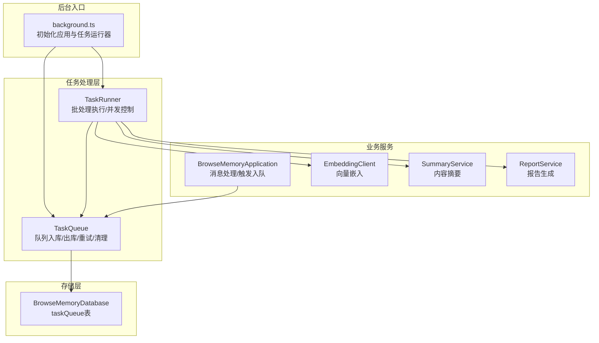
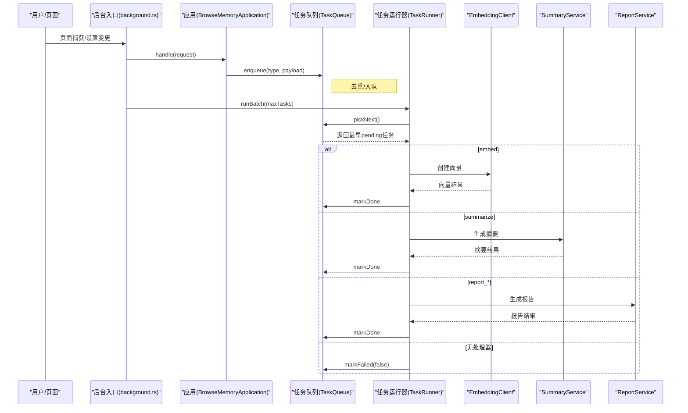
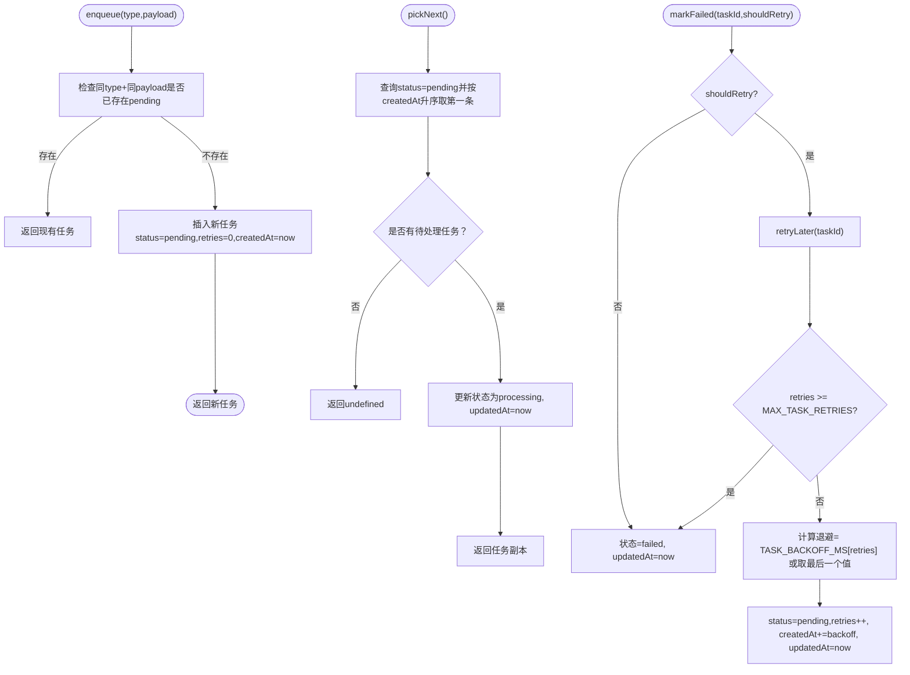
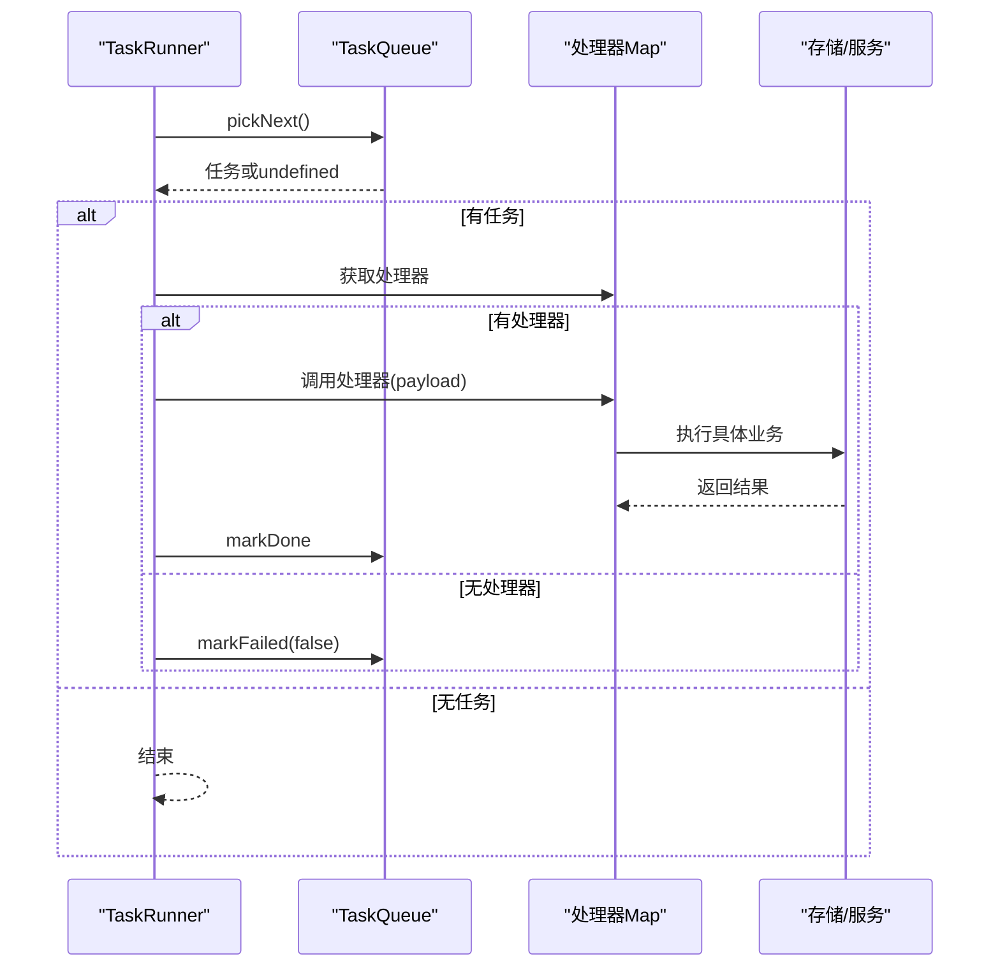
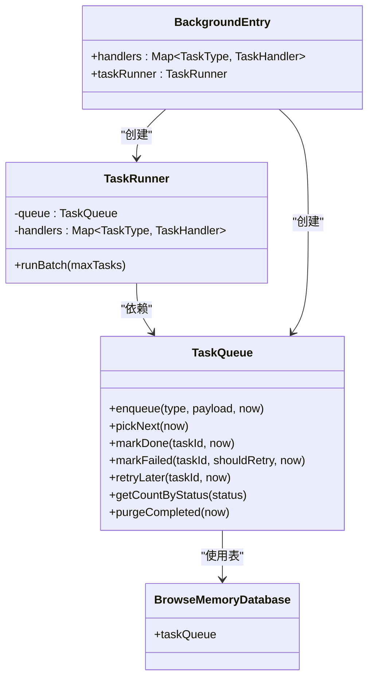
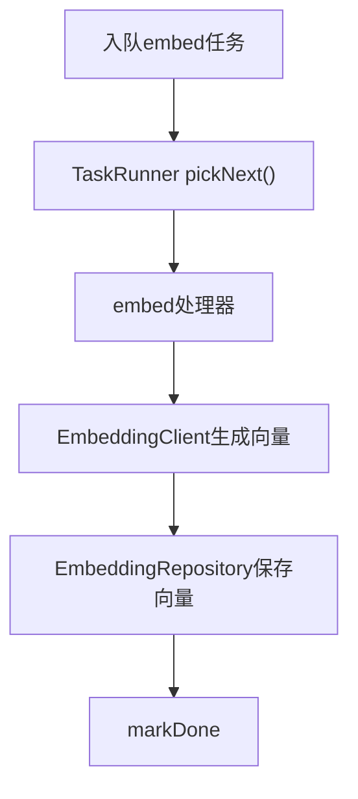
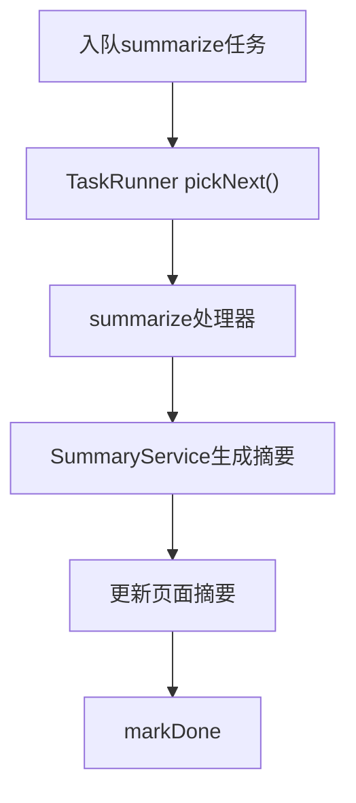
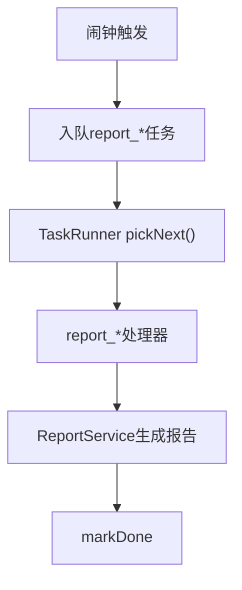

# 任务处理系统

<cite>
**本文档引用的文件**
- [src/queue/task-queue.ts](file://src/queue/task-queue.ts)
- [src/queue/task-runner.ts](file://src/queue/task-runner.ts)
- [entrypoints/background.ts](file://entrypoints/background.ts)
- [src/background/application.ts](file://src/background/application.ts)
- [src/shared/types.ts](file://src/shared/types.ts)
- [src/shared/constants.ts](file://src/shared/constants.ts)
- [src/storage/database.ts](file://src/storage/database.ts)
- [tests/queue/task-queue.test.ts](file://tests/queue/task-queue.test.ts)
- [tests/queue/task-runner.test.ts](file://tests/queue/task-runner.test.ts)
</cite>

## 目录
1. [简介](#简介)
2. [项目结构](#项目结构)
3. [核心组件](#核心组件)
4. [架构总览](#架构总览)
5. [详细组件分析](#详细组件分析)
6. [依赖关系分析](#依赖关系分析)
7. [性能考量](#性能考量)
8. [故障排查指南](#故障排查指南)
9. [结论](#结论)
10. [附录](#附录)

## 简介
本文件面向BrowseMemory的任务处理系统，重点解析TaskQueue与TaskRunner的设计与实现，涵盖：
- 任务队列的数据结构与去重策略
- 优先级与调度（基于创建时间的先进先出）
- 异步任务的创建、排队、执行与状态跟踪
- 失败重试机制、退避策略与最大重试次数
- 并发控制与批处理策略
- 不同类型任务的处理逻辑（向量嵌入、内容摘要、报告生成）
- 错误处理、超时与数据一致性保障
- 执行流程图与性能监控指标建议

## 项目结构
任务处理系统位于扩展的后台入口中，通过浏览器闹钟触发周期性任务执行，同时在页面捕获事件中即时入队。

图表来源
- [entrypoints/background.ts:69-152](file://entrypoints/background.ts#L69-L152)
- [src/queue/task-queue.ts:12-125](file://src/queue/task-queue.ts#L12-L125)
- [src/queue/task-runner.ts:7-40](file://src/queue/task-runner.ts#L7-L40)
- [src/storage/database.ts:34-76](file://src/storage/database.ts#L34-L76)
- [src/background/application.ts:74-351](file://src/background/application.ts#L74-L351)

章节来源
- [entrypoints/background.ts:39-241](file://entrypoints/background.ts#L39-L241)
- [src/background/application.ts:29-63](file://src/background/application.ts#L29-L63)

## 核心组件
- TaskQueue：负责任务的入队、去重、出队、完成标记、失败标记与重试、统计查询与过期清理。
- TaskRunner：负责从队列取出任务，按类型分派到对应处理器，执行后更新状态；支持批处理与最大并发控制。
- 类型与常量：定义任务类型、状态、记录结构以及重试退避策略与最大重试次数。
- 存储：使用Dexie数据库维护taskQueue表，包含索引以支持快速筛选与排序。

章节来源
- [src/queue/task-queue.ts:12-125](file://src/queue/task-queue.ts#L12-L125)
- [src/queue/task-runner.ts:7-40](file://src/queue/task-runner.ts#L7-L40)
- [src/shared/types.ts:107-124](file://src/shared/types.ts#L107-L124)
- [src/shared/constants.ts:31-32](file://src/shared/constants.ts#L31-L32)
- [src/storage/database.ts:43-43](file://src/storage/database.ts#L43-L43)

## 架构总览
系统采用“后台闹钟驱动 + 即时触发”的双通道模式：
- 闹钟通道：定时触发TaskRunner批处理，执行嵌入/摘要/报告等周期性任务。
- 即时通道：页面捕获事件触发应用逻辑，将嵌入与摘要任务入队。

图表来源
- [entrypoints/background.ts:78-150](file://entrypoints/background.ts#L78-L150)
- [src/queue/task-runner.ts:13-39](file://src/queue/task-runner.ts#L13-L39)
- [src/queue/task-queue.ts:48-106](file://src/queue/task-queue.ts#L48-L106)
- [src/background/application.ts:78-86](file://src/background/application.ts#L78-L86)

## 详细组件分析

### TaskQueue 设计与实现
- 数据结构
  - 使用Dexie实体表taskQueue，字段包含：id、type、status、payload、retries、createdAt、updatedAt。
  - 索引：status、type，便于按状态筛选与排序。
- 入队与去重
  - 对同一type与相同payload（序列化后）进行去重，避免重复排队。
  - 新任务初始状态为pending，retries为0。
- 出队与调度
  - 选择status为pending且createdAt最早的记录，将其状态置为processing并返回。
  - 调度策略为先进先出（FIFO），基于创建时间排序。
- 成功/失败标记
  - 成功：markDone将状态置为done。
  - 失败：markFailed根据shouldRetry决定直接失败或进入重试流程。
- 重试与退避
  - retryLater计算退避时间，依据TASK_BACKOFF_MS数组与当前retries索引。
  - 达到MAX_TASK_RETRIES后转为failed。
- 统计与清理
  - 提供按状态计数方法。
  - purgeCompleted清理7天前的done任务，释放存储空间。

图表来源
- [src/queue/task-queue.ts:15-106](file://src/queue/task-queue.ts#L15-L106)
- [src/shared/constants.ts:31-32](file://src/shared/constants.ts#L31-L32)

章节来源
- [src/queue/task-queue.ts:12-125](file://src/queue/task-queue.ts#L12-L125)
- [src/storage/database.ts:43-43](file://src/storage/database.ts#L43-L43)
- [tests/queue/task-queue.test.ts:19-91](file://tests/queue/task-queue.test.ts#L19-L91)

### TaskRunner 设计与实现
- 批处理与并发控制
  - runBatch默认最多处理5个任务，可通过参数调整上限。
  - 逐个从队列取出任务，若无任务则提前结束。
- 任务分派与执行
  - 根据任务type从Map中查找对应处理器，未注册处理器则标记失败。
  - 执行成功则markDone，异常则markFailed(true)进入重试。
- 结果统计
  - 返回processed与failed计数，便于上层监控与日志。

图表来源
- [src/queue/task-runner.ts:13-39](file://src/queue/task-runner.ts#L13-L39)

章节来源
- [src/queue/task-runner.ts:7-40](file://src/queue/task-runner.ts#L7-L40)
- [tests/queue/task-runner.test.ts:21-90](file://tests/queue/task-runner.test.ts#L21-L90)

### 任务类型与处理器映射
后台入口中为不同任务类型注册了处理器：
- embed：根据页面标题与内容生成向量，写入EmbeddingRepository。
- summarize：调用SummaryService生成摘要并回写页面。
- report_daily/weekly/monthly：调用ReportService生成对应周期报告。

章节来源
- [entrypoints/background.ts:78-150](file://entrypoints/background.ts#L78-L150)

### 应用层触发与集成
- 页面捕获事件：当收到STORE_CAPTURE请求时，应用会根据设置决定是否入队embed与summarize任务。
- 报告触发：闹钟触发时，按周期类型入队相应报告任务并立即批处理执行。
- 队列状态查询：提供GET_QUEUE_STATUS接口返回pending/processing/failed数量。

章节来源
- [src/background/application.ts:78-86](file://src/background/application.ts#L78-L86)
- [entrypoints/background.ts:203-224](file://entrypoints/background.ts#L203-L224)
- [src/background/application.ts:343-350](file://src/background/application.ts#L343-L350)

## 依赖关系分析
- TaskQueue依赖BrowseMemoryDatabase的taskQueue表，使用where/filter/sort/count等查询能力。
- TaskRunner依赖TaskQueue进行任务取放，依赖处理器Map进行任务分派。
- 后台入口在初始化时构建TaskQueue与TaskRunner，并注册各任务类型的处理器。
- 应用层在消息处理中触发任务入队，例如页面捕获与报告触发。

图表来源
- [src/queue/task-queue.ts:12-125](file://src/queue/task-queue.ts#L12-L125)
- [src/queue/task-runner.ts:7-40](file://src/queue/task-runner.ts#L7-L40)
- [src/storage/database.ts:34-76](file://src/storage/database.ts#L34-L76)
- [entrypoints/background.ts:69-152](file://entrypoints/background.ts#L69-L152)

章节来源
- [src/queue/task-queue.ts:12-125](file://src/queue/task-queue.ts#L12-L125)
- [src/queue/task-runner.ts:7-40](file://src/queue/task-runner.ts#L7-L40)
- [entrypoints/background.ts:69-152](file://entrypoints/background.ts#L69-L152)

## 性能考量
- 批处理大小：默认每次最多处理5个任务，可通过runBatch参数调整，平衡吞吐与延迟。
- FIFO调度：简单高效，适合大多数场景；若需优先级，可在createdAt上做更精细控制（当前实现按时间排序）。
- 去重策略：避免重复任务堆积，减少无效计算。
- 退避与重试：采用指数/阶梯式退避，防止雪崩；达到最大重试后失败，避免无限循环。
- 存储清理：定期清理已完成任务，控制数据库体积增长。
- 并发与资源：处理器内部可进一步引入并发限制（如每类任务的并发上限），避免外部服务限流或内存压力。

## 故障排查指南
- 任务长时间停留在pending
  - 检查是否存在对应处理器注册，或处理器是否抛出异常导致重试。
  - 查看队列状态统计，确认pending数量与最近更新时间。
- 任务频繁重试
  - 检查退避策略与最大重试次数配置，定位网络/鉴权/模型服务问题。
- 任务最终失败
  - 确认是否超过最大重试次数，或markFailed(false)路径被触发。
- 数据不一致
  - 确保处理器内业务操作具备幂等性，或在处理器中进行必要的校验与回滚。
- 性能瓶颈
  - 观察批处理大小与处理器耗时，适当调整maxTasks与处理器内部并发。

章节来源
- [src/queue/task-queue.ts:71-106](file://src/queue/task-queue.ts#L71-L106)
- [src/queue/task-runner.ts:21-35](file://src/queue/task-runner.ts#L21-L35)
- [tests/queue/task-runner.test.ts:37-53](file://tests/queue/task-runner.test.ts#L37-L53)
- [tests/queue/task-queue.test.ts:75-81](file://tests/queue/task-queue.test.ts#L75-L81)

## 结论
BrowseMemory的任务处理系统以简洁可靠的队列与运行器为核心，结合后台闹钟与即时触发机制，实现了对嵌入、摘要与报告等异步任务的稳定处理。其设计特点包括：
- 明确的状态流转与去重策略
- 可配置的退避与最大重试
- 灵活的处理器映射与批处理控制
- 清晰的统计与清理机制

建议在生产环境中配合可观测性指标（如队列长度、处理耗时、重试率、失败率）持续优化批处理规模与退避策略，确保系统在高负载下保持稳定与高效。

## 附录

### 任务类型与处理逻辑一览
- embed：生成页面向量并持久化
- summarize：生成页面摘要并回写
- report_daily/weekly/monthly：生成对应周期报告

章节来源
- [src/shared/types.ts:108-113](file://src/shared/types.ts#L108-L113)
- [entrypoints/background.ts:78-150](file://entrypoints/background.ts#L78-L150)

### 关键流程图：嵌入任务执行

图表来源
- [entrypoints/background.ts:78-102](file://entrypoints/background.ts#L78-L102)
- [src/queue/task-runner.ts:13-39](file://src/queue/task-runner.ts#L13-L39)
- [src/queue/task-queue.ts:48-69](file://src/queue/task-queue.ts#L48-L69)

### 关键流程图：摘要任务执行

图表来源
- [entrypoints/background.ts:103-117](file://entrypoints/background.ts#L103-L117)
- [src/queue/task-runner.ts:13-39](file://src/queue/task-runner.ts#L13-L39)
- [src/queue/task-queue.ts:48-69](file://src/queue/task-queue.ts#L48-L69)

### 关键流程图：报告任务执行

图表来源
- [entrypoints/background.ts:203-224](file://entrypoints/background.ts#L203-L224)
- [src/queue/task-runner.ts:13-39](file://src/queue/task-runner.ts#L13-L39)
- [src/queue/task-queue.ts:48-69](file://src/queue/task-queue.ts#L48-L69)

### 性能监控指标建议
- 队列长度：pending/processing/failed数量
- 处理速率：单位时间内processed计数
- 失败率：failed/(processed+failed)
- 重试率：重试次数/总任务数
- 平均处理耗时：单任务处理时间分布
- 退避命中：按重试级别统计
- 存储占用：taskQueue表记录数与数据库大小

章节来源
- [src/background/application.ts:343-350](file://src/background/application.ts#L343-L350)
- [src/queue/task-queue.ts:108-112](file://src/queue/task-queue.ts#L108-L112)