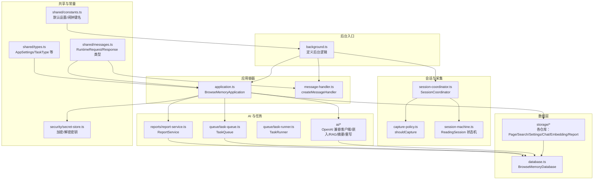
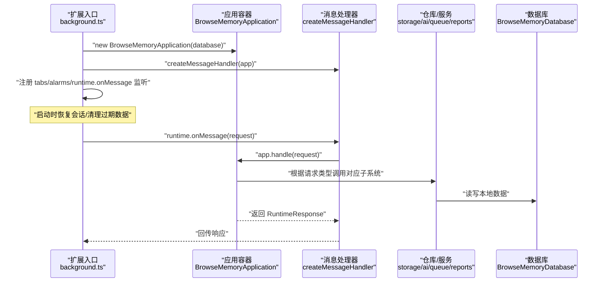
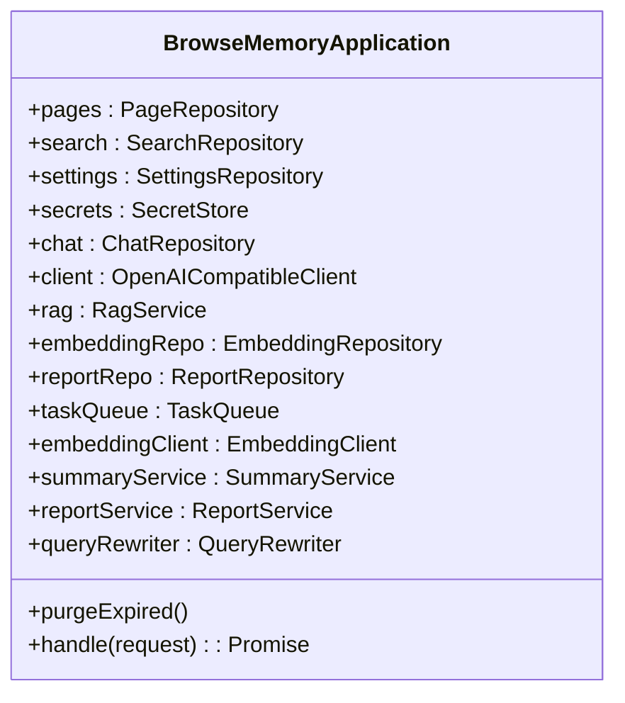
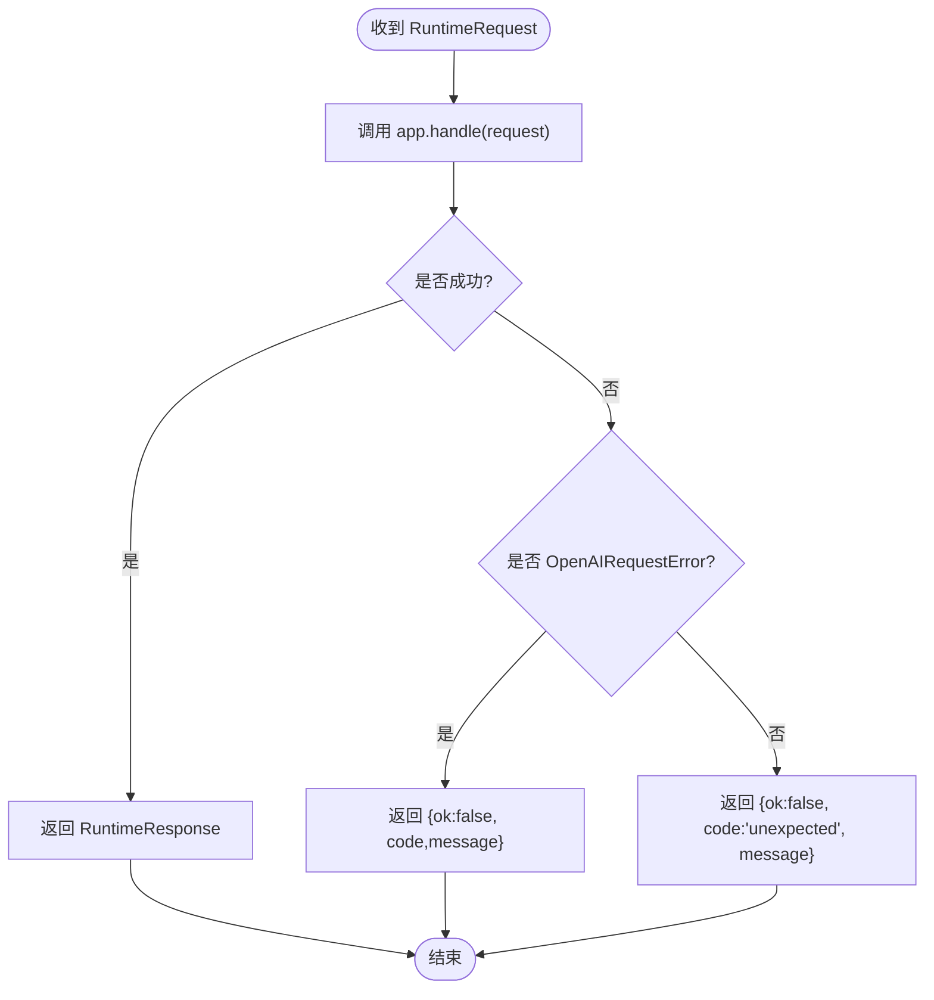
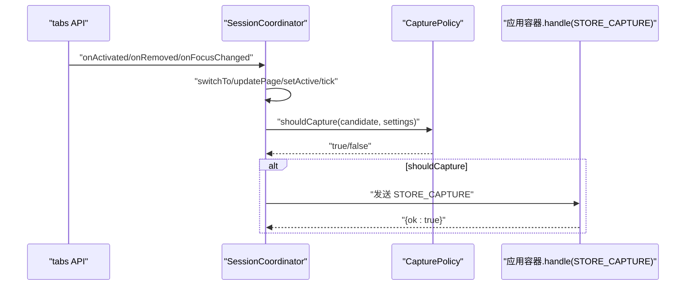
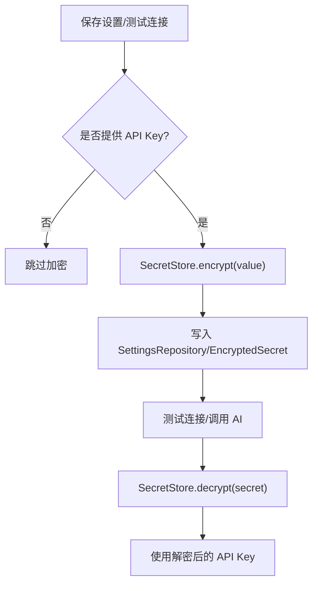
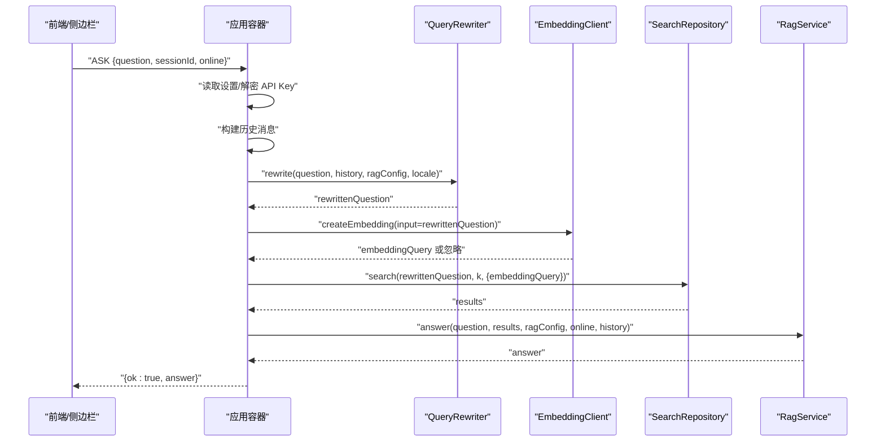
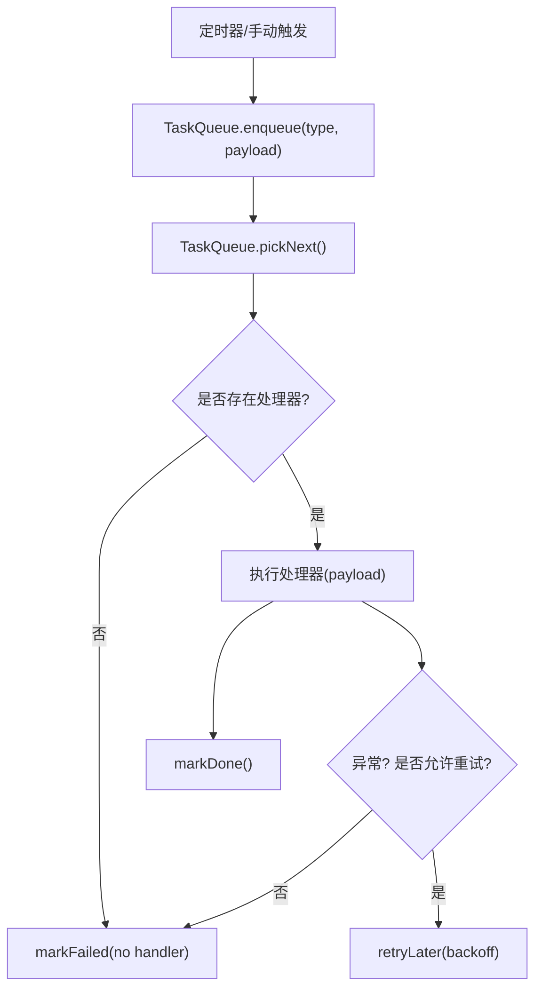
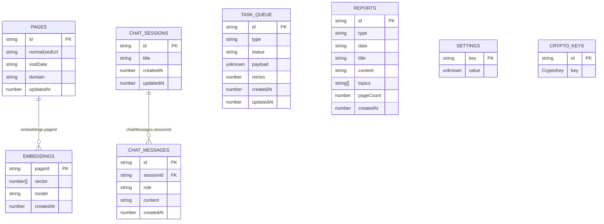
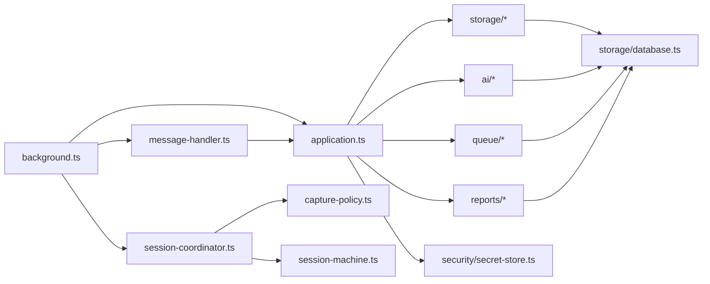

# 应用核心组件

<cite>
**本文引用的文件**
- [application.ts](file://src/background/application.ts)
- [message-handler.ts](file://src/background/message-handler.ts)
- [session-coordinator.ts](file://src/background/session-coordinator.ts)
- [background.ts](file://entrypoints/background.ts)
- [messages.ts](file://src/shared/messages.ts)
- [types.ts](file://src/shared/types.ts)
- [constants.ts](file://src/shared/constants.ts)
- [secret-store.ts](file://src/security/secret-store.ts)
- [database.ts](file://src/storage/database.ts)
- [task-queue.ts](file://src/queue/task-queue.ts)
- [task-runner.ts](file://src/queue/task-runner.ts)
- [report-service.ts](file://src/reports/report-service.ts)
- [capture-policy.ts](file://src/capture/capture-policy.ts)
- [session-machine.ts](file://src/capture/session-machine.ts)
</cite>

## 目录
1. [简介](#简介)
2. [项目结构](#项目结构)
3. [核心组件](#核心组件)
4. [架构总览](#架构总览)
5. [详细组件分析](#详细组件分析)
6. [依赖分析](#依赖分析)
7. [性能考虑](#性能考虑)
8. [故障排查指南](#故障排查指南)
9. [结论](#结论)
10. [附录](#附录)

## 简介
本文件聚焦于 BrowseMemory 应用的核心组件——BrowseMemoryApplication 类及其周边系统，系统性阐述其作为应用容器的设计理念与实现细节，包括：
- 依赖注入与组件初始化
- 子系统生命周期管理（页面存储、搜索、设置、聊天、AI服务、任务队列、报告）
- 消息处理机制与请求分发
- 配置管理、API 密钥处理与安全存储
- 启动流程与组件依赖关系

目标是帮助开发者快速理解整体架构与组件协作模式，并为后续扩展与维护提供清晰的参考。

## 项目结构
BrowseMemory 采用按功能域划分的模块化组织方式，核心入口位于后台脚本，业务逻辑分布在 background、storage、ai、queue、reports、security、shared 等目录中。应用通过 Service Worker 运行在浏览器环境中，使用 Dexie 作为 IndexedDB 封装进行本地持久化。

图表来源
- [background.ts:39-240](file://entrypoints/background.ts#L39-L240)
- [application.ts:29-63](file://src/background/application.ts#L29-L63)
- [session-coordinator.ts:28-35](file://src/background/session-coordinator.ts#L28-L35)
- [database.ts:34-79](file://src/storage/database.ts#L34-L79)
- [messages.ts:13-70](file://src/shared/messages.ts#L13-L70)
- [types.ts:6-139](file://src/shared/types.ts#L6-L139)
- [constants.ts:12-32](file://src/shared/constants.ts#L12-L32)
- [secret-store.ts:25-68](file://src/security/secret-store.ts#L25-L68)
- [task-queue.ts:12-125](file://src/queue/task-queue.ts#L12-L125)
- [task-runner.ts:7-40](file://src/queue/task-runner.ts#L7-L40)
- [report-service.ts:157-354](file://src/reports/report-service.ts#L157-L354)
- [capture-policy.ts:10-20](file://src/capture/capture-policy.ts#L10-L20)
- [session-machine.ts:15-68](file://src/capture/session-machine.ts#L15-L68)

章节来源
- [background.ts:39-240](file://entrypoints/background.ts#L39-L240)
- [application.ts:29-63](file://src/background/application.ts#L29-L63)
- [database.ts:34-79](file://src/storage/database.ts#L34-L79)

## 核心组件
本节聚焦 BrowseMemoryApplication 的设计与实现，说明其作为应用容器的角色、依赖注入与组件初始化、消息分发与生命周期管理。

- 设计理念
  - 单一职责：集中管理所有业务子系统实例，统一对外提供处理接口。
  - 依赖注入：构造函数接收数据库实例，按需创建各仓库与服务对象，便于测试与替换。
  - 请求分发：handle 方法基于请求类型进行分支，调用相应子系统能力。
  - 生命周期：通过后台入口的定时器与事件监听，驱动会话状态、清理策略、任务执行与报告生成。

- 关键字段与职责
  - 页面存储：PageRepository
  - 搜索：SearchRepository
  - 设置：SettingsRepository
  - 秘钥：SecretStore
  - 聊天：ChatRepository
  - AI 客户端：OpenAICompatibleClient
  - RAG：RagService
  - 嵌入：EmbeddingRepository、EmbeddingClient
  - 报告：ReportRepository、ReportService
  - 任务队列：TaskQueue、TaskRunner
  - 摘要：SummaryService
  - 查询重写：QueryRewriter

- 初始化流程
  - 构造函数内以数据库为根，创建各仓库与服务实例；fetcher 可选注入，确保 Service Worker 环境下的安全调用。
  - 后台入口在启动时创建应用实例、消息处理器、会话协调器与任务运行器，并注册浏览器事件与闹钟。

章节来源
- [application.ts:29-63](file://src/background/application.ts#L29-L63)
- [background.ts:39-77](file://entrypoints/background.ts#L39-L77)

## 架构总览
下图展示从浏览器事件到应用容器再到各子系统的调用链路，以及后台入口如何协调这些组件。

图表来源
- [background.ts:39-240](file://entrypoints/background.ts#L39-L240)
- [message-handler.ts:6-21](file://src/background/message-handler.ts#L6-L21)
- [application.ts:74-352](file://src/background/application.ts#L74-L352)
- [database.ts:34-79](file://src/storage/database.ts#L34-L79)

## 详细组件分析

### BrowseMemoryApplication 类
- 角色定位
  - 应用容器：聚合所有业务能力，提供统一的 handle 接口。
  - 生命周期协调者：配合后台入口与任务运行器，驱动定时任务与清理流程。
- 依赖注入
  - 通过构造函数注入数据库实例，创建各仓库与服务对象，形成清晰的依赖图。
- 处理流程
  - handle 方法根据 RuntimeRequest 的 type 分支，调用对应子系统能力，如页面捕获、搜索、聊天、设置保存、连接测试、RAG 回答、报告生成、嵌入统计与队列状态查询等。
  - 对于需要 AI 能力的请求，优先从设置中读取并解密 API Key，构建 RAG 配置后调用相应服务。
  - 对于嵌入与摘要等异步任务，通过任务队列进行排队与批处理。

图表来源
- [application.ts:29-63](file://src/background/application.ts#L29-L63)

章节来源
- [application.ts:29-63](file://src/background/application.ts#L29-L63)
- [application.ts:74-352](file://src/background/application.ts#L74-L352)

### 消息处理与错误处理
- createMessageHandler
  - 将应用容器的 handle 包裹在统一的 try-catch 中，捕获 OpenAIRequestError 并转换为标准响应格式，其余异常返回通用错误码与提示。
- 错误映射
  - OpenAIRequestError -> 返回 { ok: false, code, message }
  - 其他异常 -> 返回 { ok: false, code: "unexpected", message }

图表来源
- [message-handler.ts:6-21](file://src/background/message-handler.ts#L6-L21)

章节来源
- [message-handler.ts:6-21](file://src/background/message-handler.ts#L6-L21)

### 会话协调与采集策略
- SessionCoordinator
  - 维护当前阅读会话，支持切换、更新页面、激活状态变更与心跳 tick。
  - 通过 SessionStorageAdapter 与浏览器存储交互，持久化当前会话。
  - 结合 CapturePolicy 与 SessionMachine 判断是否触发页面捕获。
- CapturePolicy
  - 基于最小阅读时长、URL 支持性与黑名单过滤决定是否采集。
- SessionMachine
  - 提供 ReadingSession 的创建与状态迁移（tick、active 切换、导航）。

图表来源
- [session-coordinator.ts:28-156](file://src/background/session-coordinator.ts#L28-L156)
- [capture-policy.ts:10-20](file://src/capture/capture-policy.ts#L10-L20)
- [session-machine.ts:15-68](file://src/capture/session-machine.ts#L15-L68)
- [background.ts:43-67](file://entrypoints/background.ts#L43-L67)

章节来源
- [session-coordinator.ts:28-156](file://src/background/session-coordinator.ts#L28-L156)
- [capture-policy.ts:10-20](file://src/capture/capture-policy.ts#L10-L20)
- [session-machine.ts:15-68](file://src/capture/session-machine.ts#L15-L68)

### 配置管理、API 密钥与安全存储
- 配置管理
  - SettingsRepository 提供设置的读取与保存，包含聊天与嵌入的基础地址、模型、最小阅读时长、保留天数、嵌入开关与复用策略、报告生成时间与语言等。
  - 默认设置由 constants.ts 提供，确保首次安装时具备合理初始值。
- API 密钥处理
  - SecretStore 使用 WebCrypto AES-GCM 对称加密，将密钥以 EncryptedSecret 形式存储在数据库的 cryptoKeys 表中。
  - 应用在保存设置时可选择加密新输入的 API Key；在测试连接或调用 AI 服务前进行解密。
- 安全存储机制
  - 加密密钥按需生成并持久化，避免明文存储敏感信息。
  - 解密失败或未配置密钥时，相关功能返回明确的错误码与提示。

图表来源
- [secret-store.ts:25-68](file://src/security/secret-store.ts#L25-L68)
- [application.ts:115-129](file://src/background/application.ts#L115-L129)
- [application.ts:130-151](file://src/background/application.ts#L130-L151)
- [application.ts:178-251](file://src/background/application.ts#L178-L251)
- [constants.ts:12-24](file://src/shared/constants.ts#L12-L24)

章节来源
- [secret-store.ts:25-68](file://src/security/secret-store.ts#L25-L68)
- [application.ts:115-129](file://src/background/application.ts#L115-L129)
- [application.ts:130-151](file://src/background/application.ts#L130-L151)
- [application.ts:178-251](file://src/background/application.ts#L178-L251)
- [constants.ts:12-24](file://src/shared/constants.ts#L12-L24)

### 搜索与 RAG 流程
- 搜索
  - SearchRepository 提供最近记录、按日期检索与全文搜索能力。
- RAG
  - QueryRewriter 在多轮对话场景下对问题进行改写，提升检索质量。
  - RagService 调用 AI 客户端生成答案，结合检索结果与历史消息。
- 嵌入检索
  - 当启用嵌入且存在有效 API Key 时，使用 EmbeddingClient 生成向量，与 BM25 混合检索，提高召回质量。

图表来源
- [application.ts:178-251](file://src/background/application.ts#L178-L251)
- [application.ts:217-237](file://src/background/application.ts#L217-L237)
- [messages.ts:13-41](file://src/shared/messages.ts#L13-L41)

章节来源
- [application.ts:178-251](file://src/background/application.ts#L178-L251)
- [messages.ts:13-41](file://src/shared/messages.ts#L13-L41)

### 报告生成与任务队列
- 报告服务
  - ReportService 根据日/周/月维度收集页面数据，构建提示词并调用 AI 生成报告，支持本地化标题与内容。
- 任务队列
  - TaskQueue 提供去重入队、挑选下一个任务、标记完成/失败与指数退避重试。
  - TaskRunner 批量执行任务，按类型路由到具体处理器（embed、summarize、report_*）。
- 后台调度
  - 后台入口注册多种闹钟，周期性触发嵌入回填与报告生成，并在必要时立即运行任务批次。

图表来源
- [task-queue.ts:12-125](file://src/queue/task-queue.ts#L12-L125)
- [task-runner.ts:7-40](file://src/queue/task-runner.ts#L7-L40)
- [background.ts:78-152](file://entrypoints/background.ts#L78-L152)
- [report-service.ts:157-354](file://src/reports/report-service.ts#L157-L354)

章节来源
- [task-queue.ts:12-125](file://src/queue/task-queue.ts#L12-L125)
- [task-runner.ts:7-40](file://src/queue/task-runner.ts#L7-L40)
- [background.ts:78-152](file://entrypoints/background.ts#L78-L152)
- [report-service.ts:157-354](file://src/reports/report-service.ts#L157-L354)

### 数据库与表结构
- BrowseMemoryDatabase
  - 基于 Dexie 定义多张表：pages、bm25Terms、bm25Documents、settings、cryptoKeys、chatSessions、chatMessages、embeddings、taskQueue、reports。
  - 版本升级时逐步添加新表与索引，保证兼容性。
- 表关系
  - 页面与嵌入、任务、聊天会话与消息、报告之间存在外键语义（通过记录中的 id 字段体现）。

图表来源
- [database.ts:34-79](file://src/storage/database.ts#L34-L79)

章节来源
- [database.ts:34-79](file://src/storage/database.ts#L34-L79)

## 依赖分析
- 组件耦合
  - Application 对各仓库与服务有直接依赖，但通过构造函数注入降低外部耦合度。
  - MessageHandler 仅依赖 Application，保持职责单一。
  - SessionCoordinator 通过适配器与策略解耦存储与采集策略。
- 外部依赖
  - 浏览器 API：tabs、windows、alarms、runtime、storage。
  - WebCrypto：用于密钥生成与对称加解密。
  - Dexie：IndexedDB 封装，提供实体表与版本迁移。
- 循环依赖
  - 未发现循环依赖；各模块间通过接口与类型进行弱耦合。

图表来源
- [background.ts:39-240](file://entrypoints/background.ts#L39-L240)
- [application.ts:29-63](file://src/background/application.ts#L29-L63)
- [session-coordinator.ts:28-35](file://src/background/session-coordinator.ts#L28-L35)
- [database.ts:34-79](file://src/storage/database.ts#L34-L79)
- [message-handler.ts:6-21](file://src/background/message-handler.ts#L6-L21)
- [capture-policy.ts:10-20](file://src/capture/capture-policy.ts#L10-L20)
- [session-machine.ts:15-68](file://src/capture/session-machine.ts#L15-L68)

章节来源
- [background.ts:39-240](file://entrypoints/background.ts#L39-L240)
- [application.ts:29-63](file://src/background/application.ts#L29-L63)

## 性能考虑
- 异步批处理
  - 任务队列采用批处理与指数退避，避免频繁 IO 与网络请求造成阻塞。
- 去重入队
  - 同类型同负载的任务不会重复入队，减少冗余计算。
- 检索优化
  - 混合检索结合 BM25 与嵌入向量，提升召回质量与速度。
- 清理策略
  - 启动与定时清理过期数据，控制存储增长。
- UI 响应
  - 将耗时任务放入后台与队列，前台只负责展示与交互。

## 故障排查指南
- 常见错误与定位
  - 缺少 API Key：检查设置保存与加密流程，确认密钥已正确存储与解密。
  - 连接测试失败：验证基础地址、模型与网络连通性。
  - 嵌入/摘要任务失败：查看任务队列状态与重试次数，确认 API Key 与模型可用。
  - 报告生成为空：确认日期范围与页面数据是否存在。
- 日志与诊断
  - 使用浏览器开发者工具查看后台日志与网络请求。
  - 检查 IndexedDB 中对应表的数据完整性。
- 快速修复
  - 重新保存设置并进行连接测试。
  - 清理过期数据后重试。
  - 手动触发回填或报告生成任务。

章节来源
- [application.ts:115-129](file://src/background/application.ts#L115-L129)
- [application.ts:130-151](file://src/background/application.ts#L130-L151)
- [application.ts:285-314](file://src/background/application.ts#L285-L314)
- [task-queue.ts:71-106](file://src/queue/task-queue.ts#L71-L106)
- [message-handler.ts:6-21](file://src/background/message-handler.ts#L6-L21)

## 结论
BrowseMemoryApplication 作为应用容器，通过清晰的依赖注入与统一的消息分发机制，将页面存储、搜索、设置、聊天、AI 服务、嵌入与报告等功能有机整合。配合后台入口的会话协调、定时任务与事件监听，实现了稳定、可扩展且易于维护的后台服务架构。借助安全存储与任务队列机制，应用在性能与可靠性方面均具备良好表现。

## 附录
- 关键类型与常量
  - RuntimeRequest/Response：定义后台通信协议。
  - AppSettings：应用配置项集合。
  - TaskType/TaskStatus：任务类型与状态枚举。
  - 默认设置与闹钟键名：提供合理的初始行为与调度策略。

章节来源
- [messages.ts:13-70](file://src/shared/messages.ts#L13-L70)
- [types.ts:6-139](file://src/shared/types.ts#L6-L139)
- [constants.ts:12-32](file://src/shared/constants.ts#L12-L32)