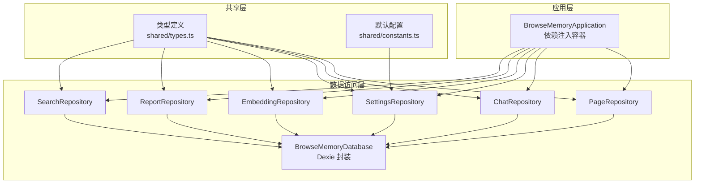
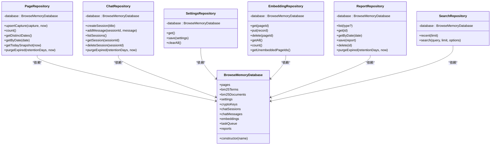
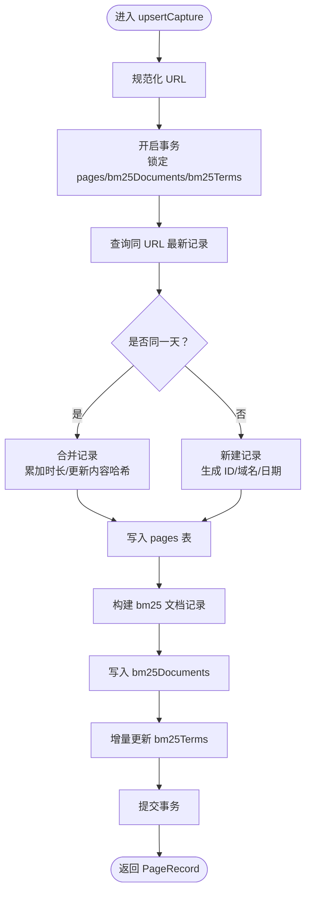
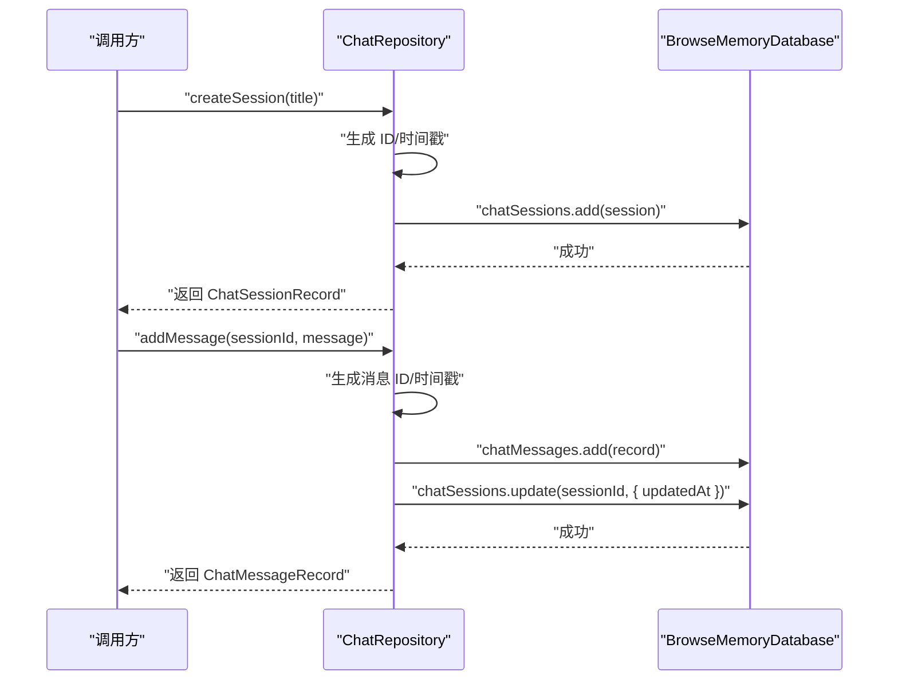
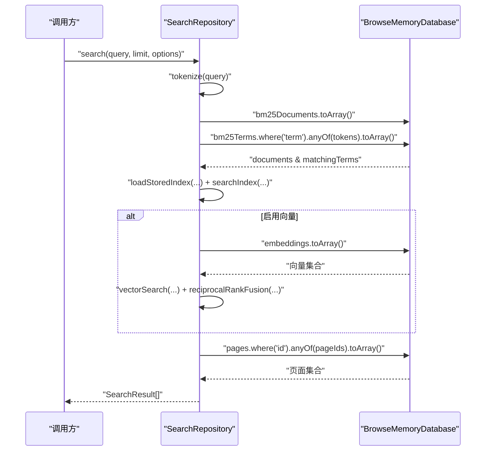
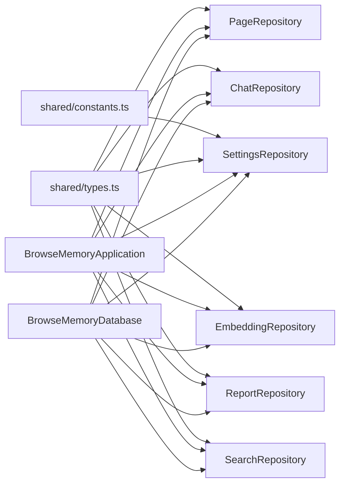
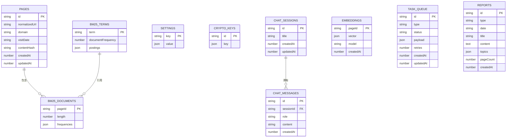

# 数据访问层组件

<cite>
**本文档引用的文件**
- [database.ts](file://src/storage/database.ts)
- [page-repository.ts](file://src/storage/page-repository.ts)
- [chat-repository.ts](file://src/storage/chat-repository.ts)
- [settings-repository.ts](file://src/storage/settings-repository.ts)
- [embedding-repository.ts](file://src/storage/embedding-repository.ts)
- [report-repository.ts](file://src/storage/report-repository.ts)
- [search-repository.ts](file://src/storage/search-repository.ts)
- [types.ts](file://src/shared/types.ts)
- [constants.ts](file://src/shared/constants.ts)
- [application.ts](file://src/background/application.ts)
- [page-repository.test.ts](file://tests/storage/page-repository.test.ts)
- [chat-repository.test.ts](file://tests/storage/chat-repository.test.ts)
- [settings-repository.test.ts](file://tests/storage/settings-repository.test.ts)
</cite>

## 目录
1. [简介](#简介)
2. [项目结构](#项目结构)
3. [核心组件](#核心组件)
4. [架构总览](#架构总览)
5. [详细组件分析](#详细组件分析)
6. [依赖关系分析](#依赖关系分析)
7. [性能考虑](#性能考虑)
8. [故障排除指南](#故障排除指南)
9. [结论](#结论)
10. [附录](#附录)

## 简介
本文件系统性梳理 BrowseMemory 的数据访问层（Data Access Layer），重点围绕 Dexie 数据库封装、数据模型定义、仓储类职责与接口设计展开。文档覆盖以下关键主题：
- 数据库版本迁移与索引设计
- 核心仓储类：PageRepository、ChatRepository、SettingsRepository、EmbeddingRepository、ReportRepository、SearchRepository 的实现细节与最佳实践
- 查询优化、事务处理与数据一致性保障
- 与上层业务逻辑的解耦设计（仓储模式与依赖注入）
- 实体关系图与查询示例，帮助开发者快速理解与扩展

## 项目结构
数据访问层位于 src/storage 目录，采用“按功能域分层”的组织方式：
- database.ts：Dexie 数据库封装与表结构定义
- 各仓储类：page-repository.ts、chat-repository.ts、settings-repository.ts、embedding-repository.ts、report-repository.ts、search-repository.ts
- 类型定义：shared/types.ts
- 应用集成：background/application.ts 中通过构造函数注入数据库实例，形成依赖注入模式

图表来源
- [database.ts:34-79](file://src/storage/database.ts#L34-L79)
- [page-repository.ts:43-103](file://src/storage/page-repository.ts#L43-L103)
- [chat-repository.ts:8-101](file://src/storage/chat-repository.ts#L8-L101)
- [settings-repository.ts:8-56](file://src/storage/settings-repository.ts#L8-L56)
- [embedding-repository.ts:4-35](file://src/storage/embedding-repository.ts#L4-L35)
- [report-repository.ts:4-39](file://src/storage/report-repository.ts#L4-L39)
- [search-repository.ts:15-109](file://src/storage/search-repository.ts#L15-L109)
- [application.ts:29-63](file://src/background/application.ts#L29-L63)

章节来源
- [database.ts:34-79](file://src/storage/database.ts#L34-L79)
- [application.ts:29-63](file://src/background/application.ts#L29-L63)

## 核心组件
本节概述各仓储类的职责与接口设计，强调其在业务流程中的作用以及与数据库交互的方式。

- PageRepository：负责页面浏览记录的增删改查、去重合并、倒排索引增量更新、过期清理等
- ChatRepository：负责聊天会话与消息的创建、查询、删除与过期清理
- SettingsRepository：负责应用设置的读取、保存与全量清空
- EmbeddingRepository：负责向量嵌入的存取与未嵌入页面识别
- ReportRepository：负责报告的列表、查询、删除与过期清理
- SearchRepository：负责最近内容检索与混合检索（BM25 + 向量）

章节来源
- [page-repository.ts:43-265](file://src/storage/page-repository.ts#L43-L265)
- [chat-repository.ts:8-102](file://src/storage/chat-repository.ts#L8-L102)
- [settings-repository.ts:8-57](file://src/storage/settings-repository.ts#L8-L57)
- [embedding-repository.ts:4-36](file://src/storage/embedding-repository.ts#L4-L36)
- [report-repository.ts:4-40](file://src/storage/report-repository.ts#L4-L40)
- [search-repository.ts:15-110](file://src/storage/search-repository.ts#L15-L110)

## 架构总览
数据访问层以 BrowseMemoryDatabase 为核心，基于 Dexie 提供的实体表与版本迁移能力，实现多表协作与事务一致性。应用层通过构造函数注入数据库实例，形成清晰的依赖注入模式，确保仓储类与上层业务逻辑解耦。

图表来源
- [database.ts:34-44](file://src/storage/database.ts#L34-L44)
- [page-repository.ts:43-103](file://src/storage/page-repository.ts#L43-L103)
- [chat-repository.ts:8-101](file://src/storage/chat-repository.ts#L8-L101)
- [settings-repository.ts:8-56](file://src/storage/settings-repository.ts#L8-L56)
- [embedding-repository.ts:4-35](file://src/storage/embedding-repository.ts#L4-L35)
- [report-repository.ts:4-39](file://src/storage/report-repository.ts#L4-L39)
- [search-repository.ts:15-109](file://src/storage/search-repository.ts#L15-L109)

## 详细组件分析

### 数据库与数据模型
- 数据库封装：BrowseMemoryDatabase 继承自 Dexie，声明各实体表并定义版本迁移脚本，确保表结构演进与数据兼容
- 版本迁移：从 v1 到 v3 逐步引入 chatSessions、chatMessages、embeddings、taskQueue、reports 等表，同时为现有表添加复合索引
- 关键索引：
  - pages：主键 id，复合索引 normalizedUrl、visitDate、domain、updatedAt
  - bm25Terms：主键 term
  - bm25Documents：主键 pageId
  - settings：主键 key
  - chatSessions：主键 id，索引 createdAt、updatedAt
  - chatMessages：主键 id，索引 sessionId、createdAt
  - embeddings：主键 pageId
  - taskQueue：主键 id，索引 status、type
  - reports：主键 id，索引 type、date

章节来源
- [database.ts:34-79](file://src/storage/database.ts#L34-L79)

### PageRepository 分析
- 去重合并策略：基于 normalizedUrl 与 visitDate 判断同一天内的重复访问，合并时累加阅读时长并更新 contentHash
- 倒排索引增量更新：upsertCapture 内部维护 bm25Documents 与 bm25Terms 的增量更新，避免重建整个索引
- 过期清理：purgeExpired 按 updatedAt 截止时间清理内容，保留元数据；同步清理倒排索引与 term posting 列表
- 快照统计：getTodaySnapshot 计算当日页面数、阅读分钟数、深度阅读数量与热门域名

图表来源
- [page-repository.ts:46-103](file://src/storage/page-repository.ts#L46-L103)
- [page-repository.ts:203-263](file://src/storage/page-repository.ts#L203-L263)

章节来源
- [page-repository.ts:43-265](file://src/storage/page-repository.ts#L43-L265)

### ChatRepository 分析
- 会话管理：createSession 自动生成 ID 与时间戳；listSessions 按 updatedAt 降序排列
- 消息管理：addMessage 自动关联 sessionId 并更新会话 updatedAt
- 事务一致性：purgeExpired 在单事务中删除过期会话及其消息，保证数据一致性
- 会话查询：getSession 返回会话与消息集合，不存在时抛出错误

图表来源
- [chat-repository.ts:11-37](file://src/storage/chat-repository.ts#L11-L37)
- [chat-repository.ts:46-71](file://src/storage/chat-repository.ts#L46-L71)

章节来源
- [chat-repository.ts:8-102](file://src/storage/chat-repository.ts#L8-L102)

### SettingsRepository 分析
- 默认值合并：get 时将 DEFAULT_SETTINGS 与数据库存储值合并，确保字段完整性
- 清空操作：clearAll 在单事务中清空所有表，用于重置或卸载场景

章节来源
- [settings-repository.ts:8-57](file://src/storage/settings-repository.ts#L8-L57)
- [constants.ts:12-24](file://src/shared/constants.ts#L12-L24)

### EmbeddingRepository 分析
- 基础 CRUD：支持按 pageId 获取、写入、删除与全量查询
- 统计与识别：count 返回已嵌入数量；getUnembeddedPageIds 通过集合差集识别待嵌入页面

章节来源
- [embedding-repository.ts:4-36](file://src/storage/embedding-repository.ts#L4-L36)

### ReportRepository 分析
- 列表与查询：list 支持按类型过滤；getByDate 返回指定日期第一条报告
- 过期清理：purgeExpired 基于 createdAt 截止时间批量删除

章节来源
- [report-repository.ts:4-40](file://src/storage/report-repository.ts#L4-L40)

### SearchRepository 分析
- 最近内容：recent 返回按 updatedAt 降序的最近页面，构建简要片段
- 混合检索：search 支持 BM25 与可选向量检索（embeddingQuery），通过 reciprocal rank fusion 融合排序，再回表补全页面详情与高亮片段

图表来源
- [search-repository.ts:35-108](file://src/storage/search-repository.ts#L35-L108)

章节来源
- [search-repository.ts:15-110](file://src/storage/search-repository.ts#L15-L110)

## 依赖关系分析
- 仓储类均通过构造函数接收 BrowseMemoryDatabase 实例，形成显式依赖注入
- 应用层（BrowseMemoryApplication）在构造函数中创建各仓储实例，集中管理依赖
- 共享类型（shared/types.ts）与默认配置（shared/constants.ts）被仓储类广泛使用，确保类型安全与默认行为一致

图表来源
- [application.ts:46-62](file://src/background/application.ts#L46-L62)
- [database.ts:34-44](file://src/storage/database.ts#L34-L44)
- [types.ts:1-139](file://src/shared/types.ts#L1-L139)
- [constants.ts:12-24](file://src/shared/constants.ts#L12-L24)

章节来源
- [application.ts:29-63](file://src/background/application.ts#L29-L63)

## 性能考虑
- 索引与查询优化
  - pages 表的复合索引（normalizedUrl、visitDate、domain、updatedAt）支持高频查询与排序
  - chatSessions 与 chatMessages 的索引提升会话与消息检索效率
  - bm25Documents 与 bm25Terms 主键索引配合增量更新，避免全量重建
- 事务与一致性
  - PageRepository 与 ChatRepository 在关键路径使用事务，确保跨表写入的一致性
  - SettingsRepository 的 clearAll 使用并行清空多个表，减少事务持有时间
- 增量索引更新
  - PageRepository 的 updateAffectedTerms 仅对受影响的 term 执行增量更新，降低写放大
- 批量操作
  - ChatRepository 的 purgeExpired 使用 bulkDelete 减少多次往返
  - ReportRepository 的 purgeExpired 使用 primaryKeys + bulkDelete 高效清理
- I/O 优化
  - SearchRepository 在 BM25 与向量检索之间进行并行加载，缩短总延迟

章节来源
- [page-repository.ts:52-103](file://src/storage/page-repository.ts#L52-L103)
- [chat-repository.ts:48-71](file://src/storage/chat-repository.ts#L48-L71)
- [settings-repository.ts:26-55](file://src/storage/settings-repository.ts#L26-L55)
- [report-repository.ts:30-38](file://src/storage/report-repository.ts#L30-L38)
- [search-repository.ts:48-77](file://src/storage/search-repository.ts#L48-L77)

## 故障排除指南
- 会话不存在
  - 现象：调用 getSession 时抛出“会话不存在”
  - 处理：确认 sessionId 是否正确；检查 chatSessions 表是否存在对应记录
  - 参考
    - [chat-repository.ts:77-85](file://src/storage/chat-repository.ts#L77-L85)
- 数据未过期清理
  - 现象：purgeExpired 返回 0 或清理不生效
  - 排查：确认 retentionDays 设置与当前时间；检查 updatedAt 字段是否更新
  - 参考
    - [page-repository.test.ts:209-222](file://tests/storage/page-repository.test.ts#L209-L222)
    - [chat-repository.test.ts:93-98](file://tests/storage/chat-repository.test.ts#L93-L98)
- 倒排索引异常
  - 现象：搜索结果为空或不准确
  - 排查：确认 bm25Documents 与 bm25Terms 是否存在；检查增量更新逻辑是否执行
  - 参考
    - [page-repository.test.ts:140-191](file://tests/storage/page-repository.test.ts#L140-L191)
- 设置未合并默认值
  - 现象：部分设置缺失
  - 处理：确认 DEFAULT_SETTINGS 是否被正确合并；检查 settings 表记录
  - 参考
    - [settings-repository.test.ts:19-27](file://tests/storage/settings-repository.test.ts#L19-L27)

章节来源
- [chat-repository.ts:77-85](file://src/storage/chat-repository.ts#L77-L85)
- [page-repository.test.ts:140-222](file://tests/storage/page-repository.test.ts#L140-L222)
- [chat-repository.test.ts:93-98](file://tests/storage/chat-repository.test.ts#L93-L98)
- [settings-repository.test.ts:19-27](file://tests/storage/settings-repository.test.ts#L19-L27)

## 结论
BrowseMemory 的数据访问层以 Dexie 为基础，结合仓储模式与依赖注入，实现了清晰的职责分离与良好的扩展性。通过复合索引、事务与增量更新等策略，兼顾了查询性能与写入效率。建议在后续迭代中：
- 对高频查询建立更多复合索引
- 引入缓存层以进一步降低热点查询延迟
- 增强迁移脚本的向后兼容性与回滚能力
- 为关键仓储增加更细粒度的单元测试覆盖

## 附录

### 数据实体关系图

图表来源
- [database.ts:34-44](file://src/storage/database.ts#L34-L44)
- [types.ts:32-41](file://src/shared/types.ts#L32-L41)
- [types.ts:68-84](file://src/shared/types.ts#L68-L84)
- [types.ts:100-105](file://src/shared/types.ts#L100-L105)
- [types.ts:129-138](file://src/shared/types.ts#L129-L138)

### 查询示例（路径指引）
- 获取最近浏览记录
  - [search-repository.ts:18-33](file://src/storage/search-repository.ts#L18-L33)
- 搜索页面（BM25）
  - [search-repository.ts:35-60](file://src/storage/search-repository.ts#L35-L60)
- 搜索页面（BM25 + 向量）
  - [search-repository.ts:62-77](file://src/storage/search-repository.ts#L62-L77)
- 获取今日快照
  - [page-repository.ts:124-146](file://src/storage/page-repository.ts#L124-L146)
- 获取某日浏览记录
  - [page-repository.ts:116-122](file://src/storage/page-repository.ts#L116-L122)
- 创建聊天会话
  - [chat-repository.ts:11-21](file://src/storage/chat-repository.ts#L11-L21)
- 添加聊天消息
  - [chat-repository.ts:23-37](file://src/storage/chat-repository.ts#L23-L37)
- 获取应用设置
  - [settings-repository.ts:11-17](file://src/storage/settings-repository.ts#L11-L17)
- 获取向量嵌入状态
  - [application.ts:317-331](file://src/background/application.ts#L317-L331)