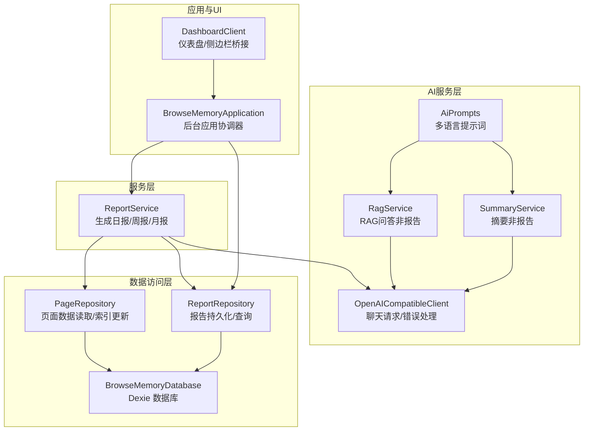
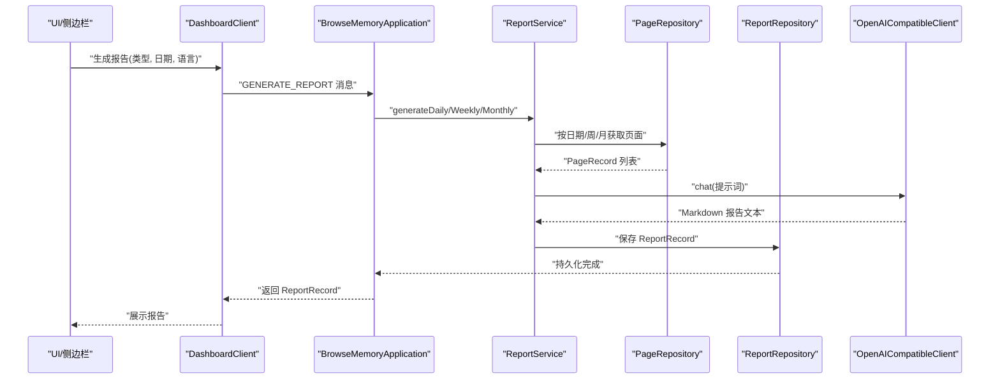
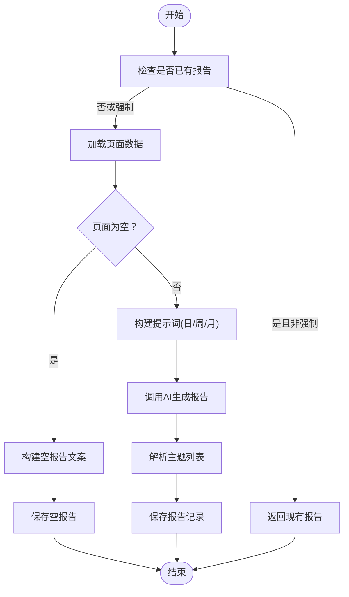
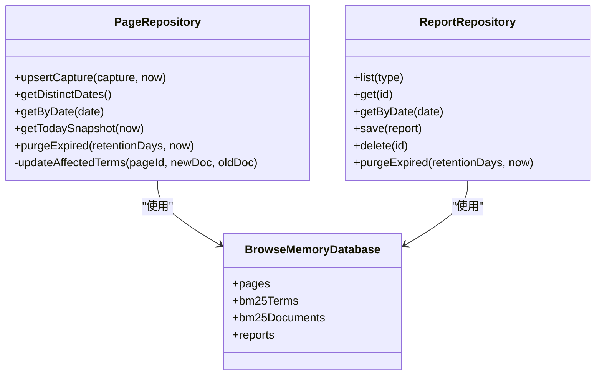
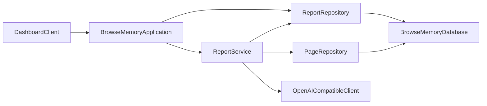

# 服务层组件

<cite>
**本文引用的文件**
- [report-service.ts](file://src/reports/report-service.ts)
- [report-repository.ts](file://src/storage/report-repository.ts)
- [page-repository.ts](file://src/storage/page-repository.ts)
- [database.ts](file://src/storage/database.ts)
- [openai-client.ts](file://src/ai/openai-client.ts)
- [rag-service.ts](file://src/ai/rag-service.ts)
- [summary-service.ts](file://src/ai/summary-service.ts)
- [ai-prompts.ts](file://src/ai/ai-prompts.ts)
- [application.ts](file://src/background/application.ts)
- [dashboard-client.ts](file://src/ui/dashboard-client.ts)
- [types.ts](file://src/shared/types.ts)
- [constants.ts](file://src/shared/constants.ts)
- [report-service.test.ts](file://tests/reports/report-service.test.ts)
</cite>

## 目录
1. [简介](#简介)
2. [项目结构](#项目结构)
3. [核心组件](#核心组件)
4. [架构总览](#架构总览)
5. [详细组件分析](#详细组件分析)
6. [依赖关系分析](#依赖关系分析)
7. [性能考量](#性能考量)
8. [故障排查指南](#故障排查指南)
9. [结论](#结论)
10. [附录](#附录)

## 简介
本文件面向BrowseMemory服务层组件，聚焦“报告服务（ReportService）”的设计理念与实现细节，系统阐述日报、周报、月报的生成流程与算法，解释与AI服务、数据访问层及用户界面的交互方式，并覆盖模板系统、多语言支持与个性化定制、错误处理策略、性能优化与缓存机制。文档同时提供工作流程图与数据处理示例，帮助开发者理解扩展与维护方法。

## 项目结构
服务层位于src/reports目录，核心由ReportService驱动，依赖数据访问层（PageRepository、ReportRepository）、AI客户端（OpenAICompatibleClient）与数据库（Dexie）。UI侧通过dashboard-client与后台应用（BrowseMemoryApplication）交互，后台应用再调用ReportService执行报告生成。

图表来源
- [report-service.ts:157-354](file://src/reports/report-service.ts#L157-L354)
- [page-repository.ts:43-264](file://src/storage/page-repository.ts#L43-L264)
- [report-repository.ts:4-39](file://src/storage/report-repository.ts#L4-L39)
- [database.ts:34-79](file://src/storage/database.ts#L34-L79)
- [openai-client.ts:56-124](file://src/ai/openai-client.ts#L56-L124)
- [rag-service.ts:15-65](file://src/ai/rag-service.ts#L15-L65)
- [summary-service.ts:7-34](file://src/ai/summary-service.ts#L7-L34)
- [ai-prompts.ts:29-199](file://src/ai/ai-prompts.ts#L29-L199)
- [application.ts:29-351](file://src/background/application.ts#L29-L351)
- [dashboard-client.ts:99-142](file://src/ui/dashboard-client.ts#L99-L142)

章节来源
- [report-service.ts:157-354](file://src/reports/report-service.ts#L157-L354)
- [application.ts:29-351](file://src/background/application.ts#L29-L351)

## 核心组件
- 报告服务（ReportService）
  - 职责：按日/周/月维度聚合浏览记录，构建AI提示词，调用OpenAI兼容客户端生成报告，解析主题并持久化。
  - 关键能力：多语言提示词注入、空数据占位文案、强制重生成、ISO周/月ID解析。
- 页面仓库（PageRepository）
  - 职责：页面捕获合并、按日期查询、今日快照统计、倒排索引增量更新。
- 报告仓库（ReportRepository）
  - 职责：报告列表、按日期查询、保存、删除、过期清理。
- 数据库（BrowseMemoryDatabase）
  - 职责：Dexie表定义（pages、bm25Terms、bm25Documents、reports等），版本迁移。
- AI客户端（OpenAICompatibleClient）
  - 职责：统一聊天请求、SSE流解析、错误码映射（认证、限流、网络、超时、提供商）。
- 后台应用（BrowseMemoryApplication）
  - 职责：集中管理各服务实例，路由消息请求（含报告生成），触发任务队列与清理。
- UI桥接（DashboardClient）
  - 职责：向后台发送消息（获取报告、生成报告），在无chrome.runtime时回退到postMessage桥。

章节来源
- [report-service.ts:157-354](file://src/reports/report-service.ts#L157-L354)
- [page-repository.ts:43-264](file://src/storage/page-repository.ts#L43-L264)
- [report-repository.ts:4-39](file://src/storage/report-repository.ts#L4-L39)
- [database.ts:34-79](file://src/storage/database.ts#L34-L79)
- [openai-client.ts:56-124](file://src/ai/openai-client.ts#L56-L124)
- [application.ts:29-351](file://src/background/application.ts#L29-L351)
- [dashboard-client.ts:99-142](file://src/ui/dashboard-client.ts#L99-L142)

## 架构总览
ReportService作为服务层入口，围绕“数据聚合—提示词构建—AI生成—主题提取—持久化”的闭环工作流运行。其与AI服务、数据访问层、后台应用、UI桥接形成清晰分层。

图表来源
- [application.ts:285-314](file://src/background/application.ts#L285-L314)
- [report-service.ts:164-322](file://src/reports/report-service.ts#L164-L322)
- [page-repository.ts:116-122](file://src/storage/page-repository.ts#L116-L122)
- [report-repository.ts:22-24](file://src/storage/report-repository.ts#L22-L24)
- [openai-client.ts:64-107](file://src/ai/openai-client.ts#L64-L107)

## 详细组件分析

### 报告服务（ReportService）
- 设计要点
  - 多语言支持：通过LOCALE_LANGUAGE_MAP与LOCALE_STRINGS注入AI提示词语言指令与本地化文案。
  - 提示词构建：针对日/周/月分别构造统计摘要、Top清单与要求清单，限制输入长度MAX_INPUT_CHARS。
  - 强制重生成：用户触发生成时force=true，覆盖旧报告；定时任务可选择跳过已存在报告。
  - 主题提取：基于Markdown标题层级提取主题列表，最多10个。
  - ISO周/月ID解析：collectWeekPages与collectMonthPages按日期过滤聚合。
- 关键流程
  - 日报：按日期获取页面，排序时长，拼接输入，调用AI生成，保存ReportRecord。
  - 周报：收集周内所有日期的页面，统计活跃天数与域名数，生成深度阅读Top 10。
  - 月报：统计总阅读时长、活跃天数与域名数，生成深度阅读Top 10。
- 错误处理
  - 依赖OpenAICompatibleClient的错误码映射，统一抛出OpenAIRequestError。
  - 无页面时返回本地化空状态文案，不调用AI。
- 性能与缓存
  - 已存在报告且非强制：直接返回，避免重复调用AI。
  - PageRepository对BM25倒排索引采用增量更新，减少重建成本。
- 可扩展性
  - 新增语言：在LOCALE_LANGUAGE_MAP与LOCALE_STRINGS中新增条目，无需修改服务逻辑。
  - 新增报告类型：可在buildDailyPrompt/buildWeeklyPrompt/buildMonthlyPrompt中扩展字段与要求。

图表来源
- [report-service.ts:164-215](file://src/reports/report-service.ts#L164-L215)
- [report-service.ts:217-269](file://src/reports/report-service.ts#L217-L269)
- [report-service.ts:271-322](file://src/reports/report-service.ts#L271-L322)
- [report-service.ts:324-353](file://src/reports/report-service.ts#L324-L353)

章节来源
- [report-service.ts:157-354](file://src/reports/report-service.ts#L157-L354)

### 数据访问层
- PageRepository
  - upsertCapture：去重合并同日多次访问，计算contentHash，更新BM25倒排索引（增量更新）。
  - getDistinctDates/getByDate：按日期查询页面，支持今日快照统计。
  - purgeExpired：按保留期清理过期页面，同步更新倒排索引。
- ReportRepository
  - list/get/getByDate/save/delete/purgeExpired：报告的CRUD与过期清理。
- BrowseMemoryDatabase
  - 定义pages、bm25Terms、bm25Documents、reports等表，支持版本迁移。

图表来源
- [page-repository.ts:43-264](file://src/storage/page-repository.ts#L43-L264)
- [report-repository.ts:4-39](file://src/storage/report-repository.ts#L4-L39)
- [database.ts:34-79](file://src/storage/database.ts#L34-L79)

章节来源
- [page-repository.ts:43-264](file://src/storage/page-repository.ts#L43-L264)
- [report-repository.ts:4-39](file://src/storage/report-repository.ts#L4-L39)
- [database.ts:34-79](file://src/storage/database.ts#L34-L79)

### AI服务与提示词
- OpenAICompatibleClient
  - 统一endpoint、请求头、超时控制（30秒），支持SSE流解析，错误码映射。
- RagService/SummaryService
  - 通过AiPrompts提供多语言模板，RAG/摘要服务复用同一提示词体系。
- AiPrompts
  - 针对RAG、摘要、查询重写提供系统/用户模板与离线前缀，支持10种语言。

章节来源
- [openai-client.ts:56-124](file://src/ai/openai-client.ts#L56-L124)
- [rag-service.ts:15-65](file://src/ai/rag-service.ts#L15-L65)
- [summary-service.ts:7-34](file://src/ai/summary-service.ts#L7-L34)
- [ai-prompts.ts:29-199](file://src/ai/ai-prompts.ts#L29-L199)

### 与后台应用和UI的交互
- BrowseMemoryApplication
  - 注入OpenAICompatibleClient、RagService、SummaryService、ReportService等，统一处理消息请求。
  - 生成报告：从设置读取AI配置，解密API Key，调用ReportService并返回结果。
- DashboardClient
  - 在有chrome.runtime时直连后台，否则通过postMessage桥接，支持超时与错误包装。

章节来源
- [application.ts:29-351](file://src/background/application.ts#L29-L351)
- [dashboard-client.ts:99-142](file://src/ui/dashboard-client.ts#L99-L142)

## 依赖关系分析
- 组件耦合
  - ReportService依赖PageRepository（数据源）、ReportRepository（持久化）、OpenAICompatibleClient（AI生成）。
  - PageRepository与ReportRepository均依赖BrowseMemoryDatabase。
  - Application集中装配各服务，降低上层耦合。
- 外部依赖
  - Dexie（IndexedDB封装）、fetch（网络请求）、SSE解析。
- 循环依赖
  - 未发现循环依赖，模块边界清晰。

图表来源
- [report-service.ts:157-162](file://src/reports/report-service.ts#L157-L162)
- [page-repository.ts:43-44](file://src/storage/page-repository.ts#L43-L44)
- [report-repository.ts:4-5](file://src/storage/report-repository.ts#L4-L5)
- [database.ts:34-44](file://src/storage/database.ts#L34-L44)
- [application.ts:46-62](file://src/background/application.ts#L46-L62)
- [dashboard-client.ts:99-142](file://src/ui/dashboard-client.ts#L99-L142)

章节来源
- [report-service.ts:157-162](file://src/reports/report-service.ts#L157-L162)
- [application.ts:46-62](file://src/background/application.ts#L46-L62)

## 性能考量
- 缓存与去重
  - ReportService优先返回已存在报告（非强制），避免重复调用AI。
  - PageRepository合并同日多次访问，减少重复存储与索引更新。
- 输入裁剪
  - MAX_INPUT_CHARS限制提示词输入长度，控制Token消耗与延迟。
- 增量索引更新
  - PageRepository仅对受影响术语进行增量更新，避免重建倒排索引。
- 过期清理
  - ReportRepository与PageRepository支持按保留期清理，释放存储空间。
- 并发与异步
  - Application在清理时并行执行多个仓库的purgeExpired。

章节来源
- [report-service.ts:7-7](file://src/reports/report-service.ts#L7-L7)
- [report-service.ts:170-175](file://src/reports/report-service.ts#L170-L175)
- [page-repository.ts:68-91](file://src/storage/page-repository.ts#L68-L91)
- [page-repository.ts:203-263](file://src/storage/page-repository.ts#L203-L263)
- [report-repository.ts:30-38](file://src/storage/report-repository.ts#L30-L38)
- [application.ts:65-72](file://src/background/application.ts#L65-L72)

## 故障排查指南
- 常见错误与定位
  - 认证失败：OpenAICompatibleClient抛出“authentication”，检查API Key与权限。
  - 速率限制：抛出“rate_limit”，建议降低请求频率或等待配额恢复。
  - 网络异常：抛出“network”，检查网络连通性与代理设置。
  - 超时：抛出“timeout”，适当增加等待时间或减少输入长度。
  - 缺少API Key：后台应用在生成报告前校验，返回“missing_api_key”。
- 排查步骤
  - 确认设置中的AI服务地址与模型配置正确。
  - 使用“测试连接”功能验证API Key有效性。
  - 查看报告仓库是否存在重复或过期报告导致的缓存问题。
  - 检查PageRepository的upsertCapture是否正常合并同日访问。
- 单元测试参考
  - 测试覆盖了空报告、强制重生成、周/月报告生成等场景，便于回归验证。

章节来源
- [openai-client.ts:22-30](file://src/ai/openai-client.ts#L22-L30)
- [openai-client.ts:82-97](file://src/ai/openai-client.ts#L82-L97)
- [openai-client.ts:108-120](file://src/ai/openai-client.ts#L108-L120)
- [application.ts:290-292](file://src/background/application.ts#L290-L292)
- [report-service.test.ts:58-131](file://tests/reports/report-service.test.ts#L58-L131)

## 结论
ReportService以清晰的职责划分与稳健的错误处理，实现了跨日/周/月的报告生成闭环。通过多语言提示词、本地化文案与主题提取，兼顾可读性与可扩展性。配合PageRepository的增量索引更新与ReportRepository的过期清理，整体具备良好的性能与可维护性。建议在后续迭代中引入更细粒度的缓存策略与并发控制，进一步提升大规模数据下的稳定性。

## 附录
- 类型与常量
  - ReportType/ReportRecord：报告类型与持久化结构。
  - DEFAULT_SETTINGS/REPORT_ALARM_PREFIX：默认设置与定时任务前缀。
- 扩展建议
  - 新增报告类型：在提示词构建函数中扩展字段与要求。
  - 多语言扩展：在LOCALE_LANGUAGE_MAP与LOCALE_STRINGS中新增语言条目。
  - 性能优化：引入报告缓存失效策略与批量生成队列。

章节来源
- [types.ts:126-139](file://src/shared/types.ts#L126-L139)
- [constants.ts:12-33](file://src/shared/constants.ts#L12-L33)