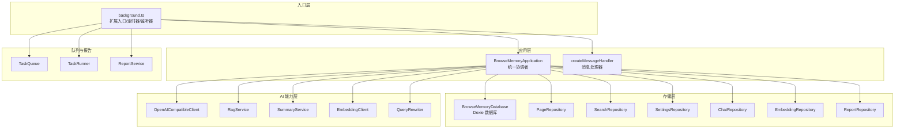
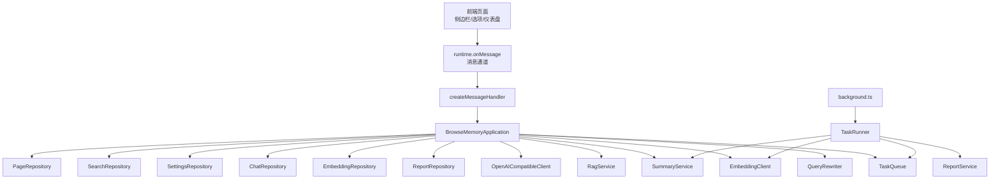
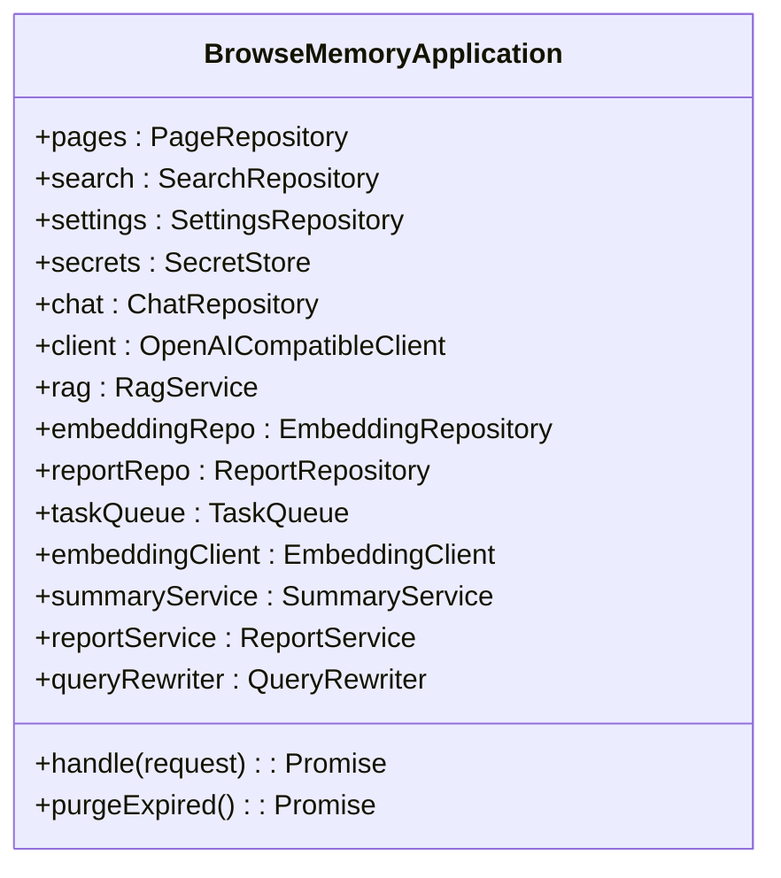
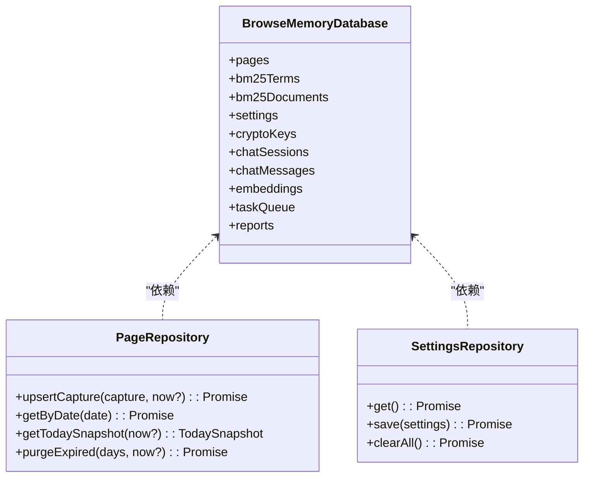
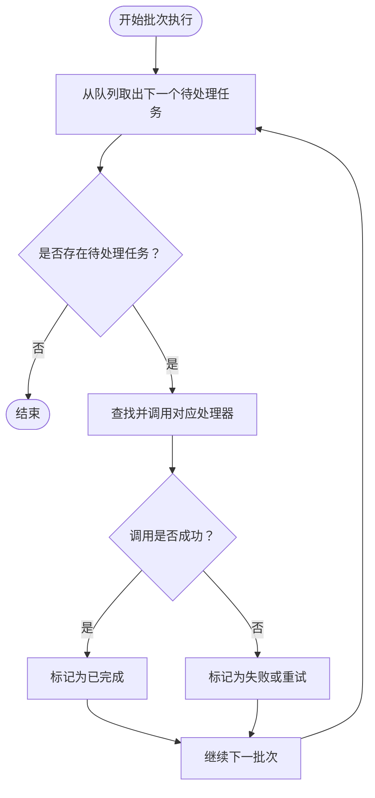
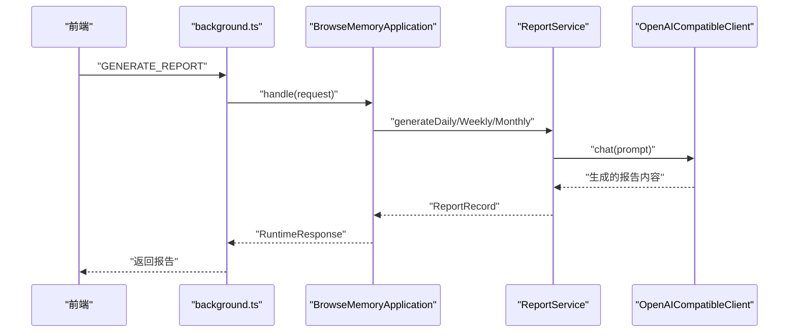
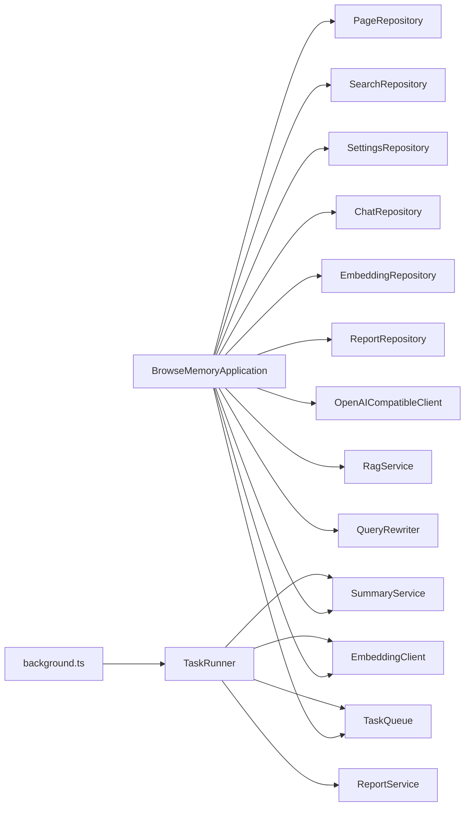
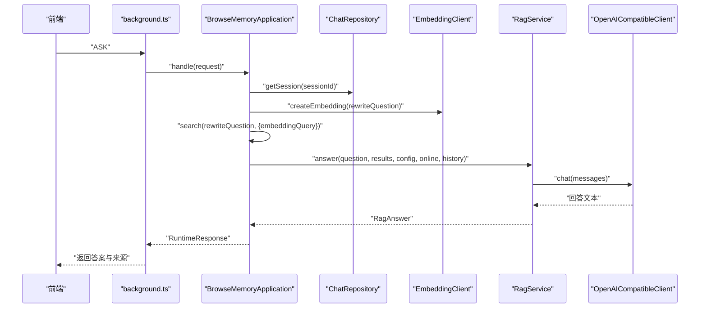

# 核心组件设计

<cite>
**本文引用的文件**
- [src/background/application.ts](file://src/background/application.ts)
- [src/background/message-handler.ts](file://src/background/message-handler.ts)
- [entrypoints/background.ts](file://entrypoints/background.ts)
- [src/storage/database.ts](file://src/storage/database.ts)
- [src/storage/page-repository.ts](file://src/storage/page-repository.ts)
- [src/storage/settings-repository.ts](file://src/storage/settings-repository.ts)
- [src/queue/task-queue.ts](file://src/queue/task-queue.ts)
- [src/queue/task-runner.ts](file://src/queue/task-runner.ts)
- [src/reports/report-service.ts](file://src/reports/report-service.ts)
- [src/shared/messages.ts](file://src/shared/messages.ts)
- [src/shared/types.ts](file://src/shared/types.ts)
- [src/shared/constants.ts](file://src/shared/constants.ts)
- [src/ai/openai-client.ts](file://src/ai/openai-client.ts)
- [src/ai/rag-service.ts](file://src/ai/rag-service.ts)
</cite>

## 目录
1. [引言](#引言)
2. [项目结构](#项目结构)
3. [核心组件](#核心组件)
4. [架构总览](#架构总览)
5. [详细组件分析](#详细组件分析)
6. [依赖分析](#依赖分析)
7. [性能考虑](#性能考虑)
8. [故障排查指南](#故障排查指南)
9. [结论](#结论)
10. [附录](#附录)

## 引言
本设计文档聚焦于 BrowseMemory 的核心组件，围绕应用核心类 BrowseMemoryApplication、数据库访问层、任务队列系统与报告服务展开，系统性阐述各组件的职责边界、接口设计、依赖关系、协作模式（消息传递、事件处理、状态同步）、生命周期管理与错误处理策略，并通过类图与序列图帮助开发者快速理解组件间的调用关系与数据交换。

## 项目结构
项目采用按功能域分层的组织方式：入口层负责扩展生命周期与定时任务调度；后台应用层作为统一协调者；存储层封装数据库与各类仓储；AI 能力层提供检索增强生成与嵌入能力；队列与报告模块支撑异步任务与周期性产出。

图表来源
- [entrypoints/background.ts:39-240](file://entrypoints/background.ts#L39-L240)
- [src/background/application.ts:29-63](file://src/background/application.ts#L29-L63)
- [src/storage/database.ts:34-79](file://src/storage/database.ts#L34-L79)

章节来源
- [entrypoints/background.ts:39-240](file://entrypoints/background.ts#L39-L240)
- [src/storage/database.ts:34-79](file://src/storage/database.ts#L34-L79)

## 核心组件
- 应用核心类 BrowseMemoryApplication：集中编排页面、搜索、设置、聊天、嵌入、报告、任务队列与 AI 服务，统一处理来自前端的消息请求。
- 数据库访问层：以仓储模式封装对 Dexie 数据库的读写，包含页面、BM25 索引、设置、加密密钥、聊天会话与消息、嵌入向量、任务队列、报告等表。
- 任务队列系统：提供去重入队、优先出队、失败重试（带指数退避）、计数统计与过期清理。
- 报告服务：根据日/周/月维度聚合浏览记录，生成本地化报告内容并持久化。
- 消息与类型定义：统一前后端通信协议与响应格式，确保类型安全与可维护性。
- 常量与默认配置：提供默认设置、报警名称、任务重试策略等全局常量。

章节来源
- [src/background/application.ts:29-63](file://src/background/application.ts#L29-L63)
- [src/storage/database.ts:34-79](file://src/storage/database.ts#L34-L79)
- [src/queue/task-queue.ts:12-125](file://src/queue/task-queue.ts#L12-L125)
- [src/reports/report-service.ts:157-354](file://src/reports/report-service.ts#L157-L354)
- [src/shared/messages.ts:13-70](file://src/shared/messages.ts#L13-L70)
- [src/shared/constants.ts:12-32](file://src/shared/constants.ts#L12-L32)

## 架构总览
整体采用“入口层 -> 应用层 -> 存储层/能力层”的分层架构。入口层负责扩展生命周期、定时器与消息监听；应用层作为门面协调各子系统；存储层通过仓储抽象屏蔽底层数据库细节；AI 能力层提供检索增强与嵌入；队列与报告模块支持异步与周期性任务。

图表来源
- [entrypoints/background.ts:226-239](file://entrypoints/background.ts#L226-L239)
- [src/background/message-handler.ts:6-21](file://src/background/message-handler.ts#L6-L21)
- [src/background/application.ts:74-352](file://src/background/application.ts#L74-L352)
- [src/queue/task-runner.ts:7-39](file://src/queue/task-runner.ts#L7-L39)

## 详细组件分析

### BrowseMemoryApplication 应用核心类
- 职责边界
  - 接收并路由来自前端的消息请求，执行对应业务逻辑。
  - 协调页面入库、搜索、设置、聊天、报告、嵌入与任务队列。
  - 提供数据清理与用量查询等辅助能力。
- 关键接口
  - handle(request): 根据请求类型分派到具体处理分支。
  - purgeExpired(): 清理过期数据（页面、聊天、报告）。
- 依赖关系
  - 依赖仓储层（PageRepository、SearchRepository、SettingsRepository、ChatRepository、EmbeddingRepository、ReportRepository）。
  - 依赖 AI 能力层（OpenAICompatibleClient、RagService、SummaryService、EmbeddingClient、QueryRewriter）。
  - 依赖任务队列（TaskQueue）。
- 生命周期与状态
  - 在扩展启动时由入口层注入数据库实例构造。
  - 通过消息处理器捕获异常并转换为标准化响应。
- 错误处理
  - 对 OpenAIRequestError 进行映射，返回结构化错误码与信息。
  - 其他异常统一返回“暂时无法完成该操作”。

图表来源
- [src/background/application.ts:29-63](file://src/background/application.ts#L29-L63)

章节来源
- [src/background/application.ts:29-63](file://src/background/application.ts#L29-L63)
- [src/background/application.ts:74-352](file://src/background/application.ts#L74-L352)
- [src/background/message-handler.ts:6-21](file://src/background/message-handler.ts#L6-L21)

### 数据库访问层（仓储）
- PageRepository
  - 负责页面存取、去重合并、BM25 文档/词项索引增量更新。
  - 支持按日期查询、今日快照统计、过期清理。
- SettingsRepository
  - 提供应用设置的读取、保存与一键清空（事务内级联清理多表）。
- 其他仓储
  - SearchRepository、ChatRepository、EmbeddingRepository、ReportRepository、TaskQueue（在数据库中以实体表形式存在）。

图表来源
- [src/storage/database.ts:34-79](file://src/storage/database.ts#L34-L79)
- [src/storage/page-repository.ts:43-103](file://src/storage/page-repository.ts#L43-L103)
- [src/storage/settings-repository.ts:8-56](file://src/storage/settings-repository.ts#L8-L56)

章节来源
- [src/storage/page-repository.ts:43-265](file://src/storage/page-repository.ts#L43-L265)
- [src/storage/settings-repository.ts:8-56](file://src/storage/settings-repository.ts#L8-L56)
- [src/storage/database.ts:34-79](file://src/storage/database.ts#L34-L79)

### 任务队列系统
- TaskQueue
  - 去重入队：相同类型与负载的任务不会重复排队。
  - 优先出队：按创建时间升序取出最早待处理任务并标记为处理中。
  - 失败重试：超过最大重试次数后标记失败；否则按退避策略延后重试。
  - 计数与清理：支持按状态计数与完成任务的定期清理。
- TaskRunner
  - 批量执行：从队列取出多个任务并调用对应处理器。
  - 错误隔离：单个任务失败不影响后续任务处理。

图表来源
- [src/queue/task-runner.ts:13-39](file://src/queue/task-runner.ts#L13-L39)
- [src/queue/task-queue.ts:48-106](file://src/queue/task-queue.ts#L48-L106)

章节来源
- [src/queue/task-queue.ts:12-125](file://src/queue/task-queue.ts#L12-L125)
- [src/queue/task-runner.ts:7-40](file://src/queue/task-runner.ts#L7-L40)

### 报告服务
- 功能范围
  - 日/周/月报告生成：聚合页面记录，构建提示词，调用 AI 生成报告内容并提取主题。
  - 本地化：根据语言环境输出标题与文案。
  - 强制覆盖：用户触发时可强制重新生成并覆盖旧报告。
- 处理流程
  - 检查已存在报告与强制标志。
  - 收集目标周期内的页面记录，构建 Prompt。
  - 调用 AI 客户端生成内容，解析主题，持久化报告。

图表来源
- [entrypoints/background.ts:226-239](file://entrypoints/background.ts#L226-L239)
- [src/background/application.ts:285-315](file://src/background/application.ts#L285-L315)
- [src/reports/report-service.ts:164-215](file://src/reports/report-service.ts#L164-L215)

章节来源
- [src/reports/report-service.ts:157-354](file://src/reports/report-service.ts#L157-L354)
- [src/background/application.ts:276-315](file://src/background/application.ts#L276-L315)

### 消息与类型定义
- RuntimeRequest/RuntimeResponse
  - 统一扩展消息协议，涵盖页面变更、搜索、设置、聊天、报告、嵌入与队列状态等请求与响应。
- 类型安全
  - 通过联合类型与泛型约束保证请求/响应的一致性，降低运行时错误。

章节来源
- [src/shared/messages.ts:13-70](file://src/shared/messages.ts#L13-L70)
- [src/shared/types.ts:108-139](file://src/shared/types.ts#L108-L139)

### 常量与默认配置
- 默认设置：提供聊天与嵌入的基础配置与黑名单、保留天数等默认值。
- 定时器名称：心跳、清理、嵌入回填与报告生成的周期性任务名称。
- 任务重试：最大重试次数与退避毫秒数数组。

章节来源
- [src/shared/constants.ts:12-32](file://src/shared/constants.ts#L12-L32)

## 依赖分析
- 组件耦合
  - BrowseMemoryApplication 高度聚合，依赖仓储与 AI 能力，便于统一控制但需注意其复杂度。
  - TaskRunner 与 TaskQueue 解耦良好，通过 Map 将任务类型与处理器绑定，利于扩展新任务。
- 外部依赖
  - Dexie：提供 IndexedDB 封装与版本迁移。
  - 浏览器扩展 API：runtime、tabs、windows、alarms、storage。
- 循环依赖
  - 未发现直接循环依赖；仓储与应用层之间为单向依赖。

图表来源
- [src/background/application.ts:29-63](file://src/background/application.ts#L29-L63)
- [entrypoints/background.ts:69-152](file://entrypoints/background.ts#L69-L152)

章节来源
- [src/background/application.ts:29-63](file://src/background/application.ts#L29-L63)
- [entrypoints/background.ts:69-152](file://entrypoints/background.ts#L69-L152)

## 性能考虑
- 索引与查询
  - PageRepository 采用 BM25 文档/词项表，支持按日期与倒排索引高效检索；upsert 时增量更新词项，避免重建索引带来的开销。
- 任务批处理
  - TaskRunner 批量执行，减少唤醒与上下文切换成本；TaskQueue 的退避策略避免雪崩式重试。
- 内容截断
  - 报告服务对输入进行字符上限截断，控制提示词长度，平衡质量与成本。
- 事务与批量删除
  - SettingsRepository.clearAll 使用事务批量清理多表，保证一致性与效率。

## 故障排查指南
- API 连通性测试
  - TEST_CONNECTION/TEST_EMBEDDING_CONNECTION：分别验证聊天与嵌入服务连通性，返回结构化错误码（如缺少密钥、认证失败、速率限制、网络超时等）。
- 消息处理异常
  - createMessageHandler 将 OpenAIRequestError 映射为标准响应；其他异常统一返回“暂时无法完成该操作”。
- 任务失败定位
  - 查看 TaskQueue 中任务状态与重试次数；结合 TaskRunner 的批处理结果定位失败原因。
- 报告生成失败
  - 检查设置中的 API Key、模型与基础地址；确认强制覆盖参数；查看 AI 返回状态与内容类型。

章节来源
- [src/background/application.ts:130-177](file://src/background/application.ts#L130-L177)
- [src/background/message-handler.ts:6-21](file://src/background/message-handler.ts#L6-L21)
- [src/queue/task-queue.ts:71-106](file://src/queue/task-queue.ts#L71-L106)
- [src/reports/report-service.ts:164-215](file://src/reports/report-service.ts#L164-L215)

## 结论
BrowseMemory 的核心组件以 BrowseMemoryApplication 为中心，通过仓储与 AI 能力的清晰边界划分，配合任务队列与报告服务的异步化设计，实现了从页面采集、检索增强、智能摘要到周期性报告的完整闭环。入口层的定时器与消息监听进一步增强了系统的自动化与可观测性。建议在后续迭代中持续优化提示词工程、监控与告警体系，并引入更细粒度的单元测试与集成测试以保障稳定性。

## 附录
- 关键流程时序（ASK 请求）

图表来源
- [entrypoints/background.ts:226-239](file://entrypoints/background.ts#L226-L239)
- [src/background/application.ts:178-251](file://src/background/application.ts#L178-L251)
- [src/ai/rag-service.ts:18-64](file://src/ai/rag-service.ts#L18-L64)
- [src/ai/openai-client.ts:64-124](file://src/ai/openai-client.ts#L64-L124)