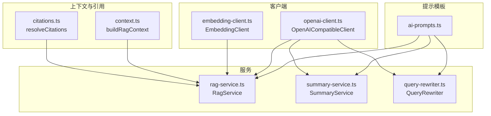
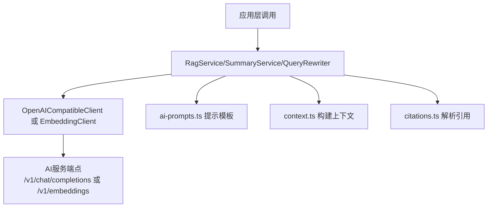
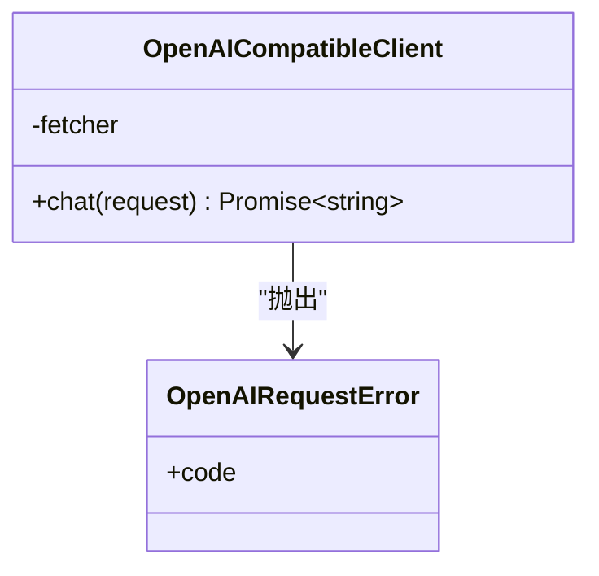
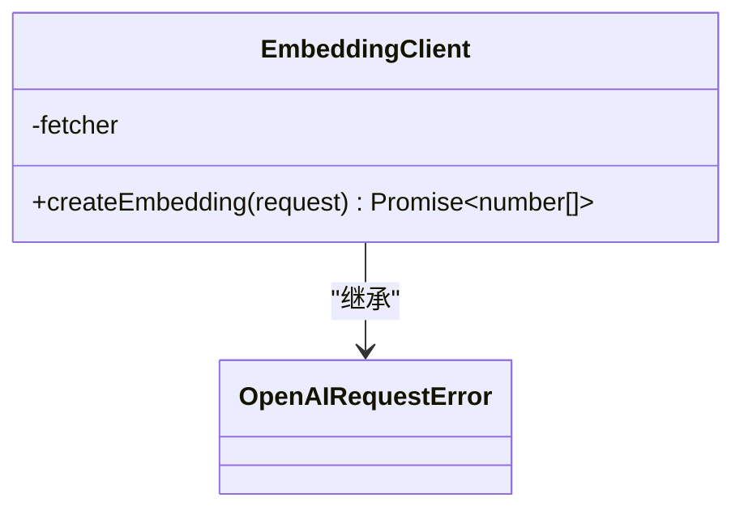
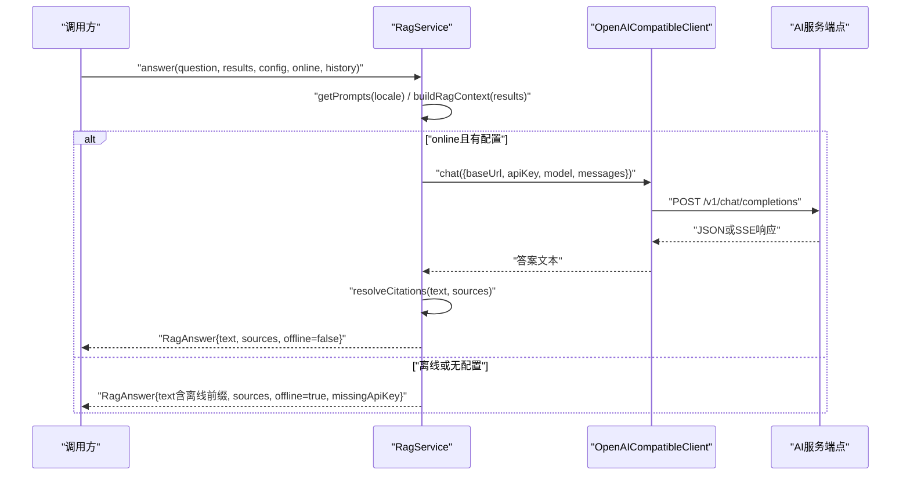
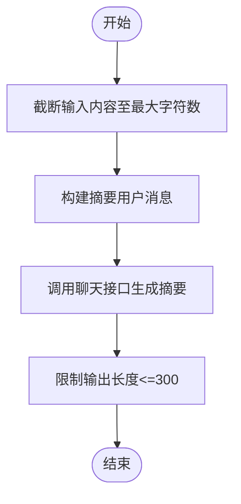
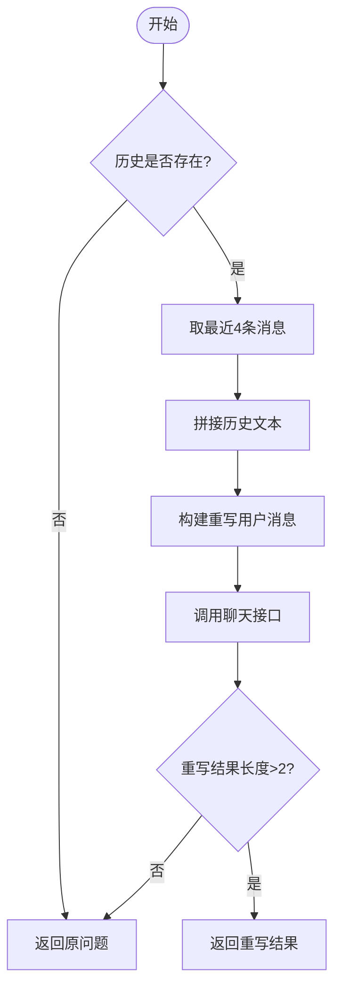
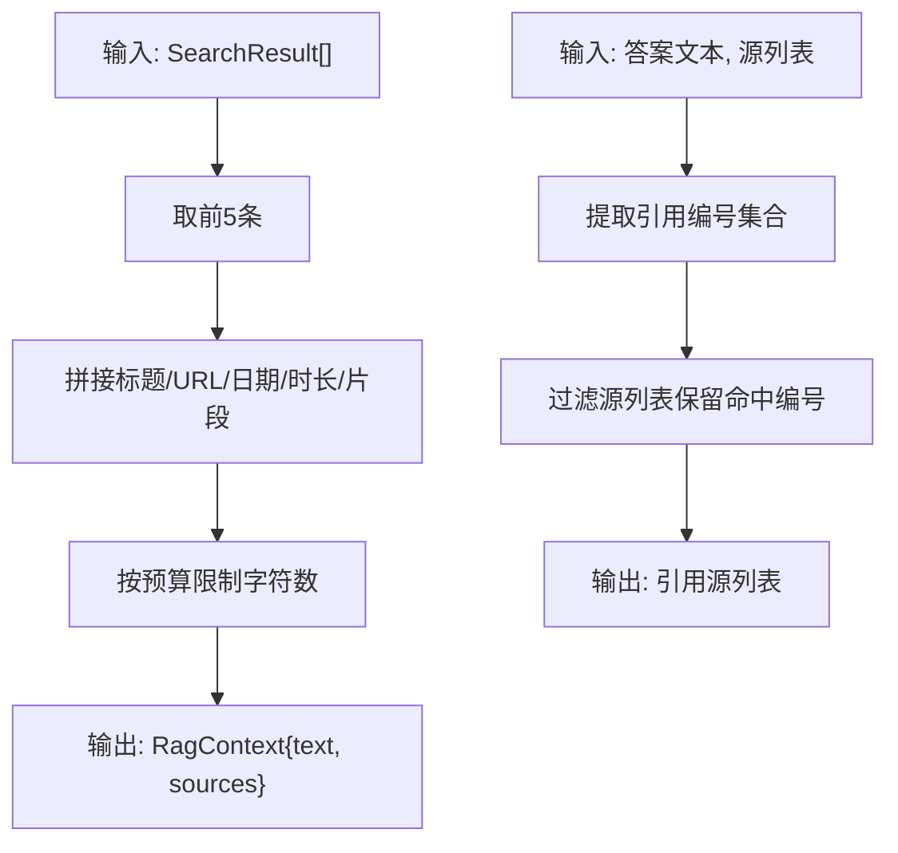
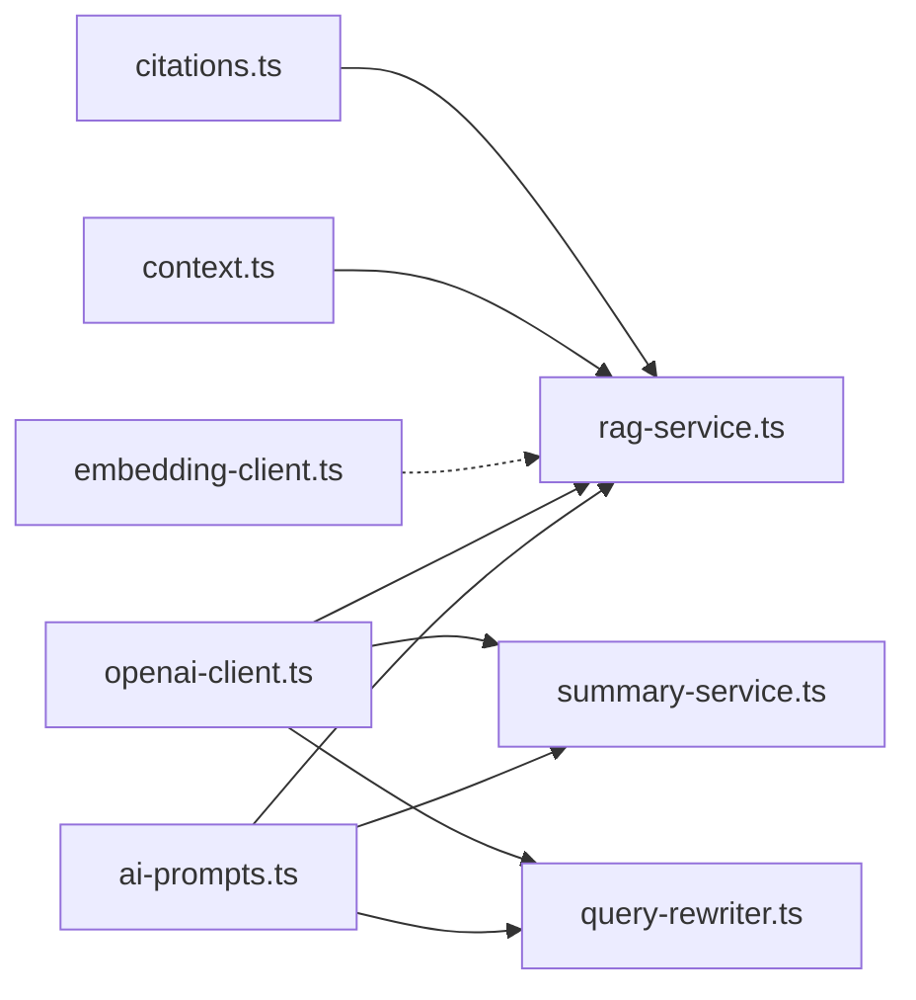

# AI服务层

<cite>
**本文档引用的文件**
- [src/ai/openai-client.ts](file://src/ai/openai-client.ts)
- [src/ai/rag-service.ts](file://src/ai/rag-service.ts)
- [src/ai/embedding-client.ts](file://src/ai/embedding-client.ts)
- [src/ai/summary-service.ts](file://src/ai/summary-service.ts)
- [src/ai/query-rewriter.ts](file://src/ai/query-rewriter.ts)
- [src/ai/context.ts](file://src/ai/context.ts)
- [src/ai/citations.ts](file://src/ai/citations.ts)
- [src/ai/ai-prompts.ts](file://src/ai/ai-prompts.ts)
- [tests/ai/openai-client.test.ts](file://tests/ai/openai-client.test.ts)
- [tests/ai/rag-service.test.ts](file://tests/ai/rag-service.test.ts)
- [tests/ai/embedding-client.test.ts](file://tests/ai/embedding-client.test.ts)
- [tests/ai/summary-service.test.ts](file://tests/ai/summary-service.test.ts)
- [tests/ai/query-rewriter.test.ts](file://tests/ai/query-rewriter.test.ts)
- [tests/ai/context.test.ts](file://tests/ai/context.test.ts)
- [tests/ai/citations.test.ts](file://tests/ai/citations.test.ts)
</cite>

## 目录
1. [简介](#简介)
2. [项目结构](#项目结构)
3. [核心组件](#核心组件)
4. [架构总览](#架构总览)
5. [详细组件分析](#详细组件分析)
6. [依赖关系分析](#依赖关系分析)
7. [性能考虑](#性能考虑)
8. [故障排查指南](#故障排查指南)
9. [结论](#结论)
10. [附录](#附录)

## 简介
本文件面向AI服务层的技术文档，聚焦于以下能力与实现：
- OpenAI兼容客户端：统一封装聊天与嵌入请求、SSE流解析、错误码归一化与超时控制。
- 检索增强生成（RAG）服务：从查询理解、上下文构建、消息构造到答案生成与引用解析的完整链路。
- 向量嵌入客户端：文本编码、向量存储与相似度计算的支撑能力。
- 内容摘要服务：抽取式与生成式摘要的模板化提示与长度约束。
- 查询重写器：基于对话历史的指代消解与查询重构，提升检索质量。
- 引用生成与上下文管理：通过占位符与正则匹配实现可追溯性与准确性。
- 配置选项、性能调优与成本控制建议，以及集成示例与自定义模型支持方法。

## 项目结构
AI服务层位于 src/ai 目录，围绕“提示模板”“客户端”“服务”三层组织：
- 提示模板：集中管理多语言提示，供各服务复用。
- 客户端：OpenAI兼容聊天客户端与嵌入客户端，负责HTTP请求、SSE解析与错误归一化。
- 服务：RAG服务、摘要服务、查询重写器，组合提示与客户端完成业务闭环。
- 上下文与引用：构建RAG上下文、解析引用标记，保证答案可溯源。

图表来源
- [src/ai/ai-prompts.ts:1-200](file://src/ai/ai-prompts.ts#L1-L200)
- [src/ai/openai-client.ts:56-125](file://src/ai/openai-client.ts#L56-L125)
- [src/ai/embedding-client.ts:16-87](file://src/ai/embedding-client.ts#L16-L87)
- [src/ai/rag-service.ts:15-66](file://src/ai/rag-service.ts#L15-L66)
- [src/ai/summary-service.ts:7-35](file://src/ai/summary-service.ts#L7-L35)
- [src/ai/query-rewriter.ts:5-52](file://src/ai/query-rewriter.ts#L5-L52)
- [src/ai/context.ts:17-37](file://src/ai/context.ts#L17-L37)
- [src/ai/citations.ts:3-12](file://src/ai/citations.ts#L3-L12)

章节来源
- [src/ai/ai-prompts.ts:1-200](file://src/ai/ai-prompts.ts#L1-L200)
- [src/ai/openai-client.ts:1-125](file://src/ai/openai-client.ts#L1-L125)
- [src/ai/embedding-client.ts:1-87](file://src/ai/embedding-client.ts#L1-L87)
- [src/ai/rag-service.ts:1-66](file://src/ai/rag-service.ts#L1-L66)
- [src/ai/summary-service.ts:1-35](file://src/ai/summary-service.ts#L1-L35)
- [src/ai/query-rewriter.ts:1-52](file://src/ai/query-rewriter.ts#L1-L52)
- [src/ai/context.ts:1-37](file://src/ai/context.ts#L1-L37)
- [src/ai/citations.ts:1-12](file://src/ai/citations.ts#L1-L12)

## 核心组件
- OpenAI兼容客户端：支持JSON与SSE两种响应格式，统一错误码（认证、限流、网络、超时、提供商），内置30秒超时与AbortController。
- 嵌入客户端：封装/v1/embeddings端点，校验返回向量存在性，错误归一化。
- RAG服务：拼装系统提示、历史消息与用户上下文，调用聊天接口生成答案，并解析引用。
- 摘要服务：对长内容截断，调用聊天接口生成摘要并限制输出长度。
- 查询重写器：基于最近对话历史与模板，将指代表述转为独立查询。
- 上下文构建：从搜索结果中选取前N条，拼接标题、URL、时间与片段，限制字符数。
- 引用解析：从答案中提取引用编号，映射到源列表。

章节来源
- [src/ai/openai-client.ts:56-125](file://src/ai/openai-client.ts#L56-L125)
- [src/ai/embedding-client.ts:16-87](file://src/ai/embedding-client.ts#L16-L87)
- [src/ai/rag-service.ts:15-66](file://src/ai/rag-service.ts#L15-L66)
- [src/ai/summary-service.ts:7-35](file://src/ai/summary-service.ts#L7-L35)
- [src/ai/query-rewriter.ts:5-52](file://src/ai/query-rewriter.ts#L5-L52)
- [src/ai/context.ts:17-37](file://src/ai/context.ts#L17-L37)
- [src/ai/citations.ts:3-12](file://src/ai/citations.ts#L3-L12)

## 架构总览
AI服务层采用“提示模板驱动 + 客户端抽象 + 服务编排”的分层设计。提示模板集中维护多语言指令；客户端屏蔽底层HTTP细节；服务通过组合提示与客户端完成具体任务；上下文与引用模块保障信息完整性与可追溯性。

图表来源
- [src/ai/rag-service.ts:15-66](file://src/ai/rag-service.ts#L15-L66)
- [src/ai/summary-service.ts:7-35](file://src/ai/summary-service.ts#L7-L35)
- [src/ai/query-rewriter.ts:5-52](file://src/ai/query-rewriter.ts#L5-L52)
- [src/ai/openai-client.ts:56-125](file://src/ai/openai-client.ts#L56-L125)
- [src/ai/embedding-client.ts:16-87](file://src/ai/embedding-client.ts#L16-L87)
- [src/ai/ai-prompts.ts:1-200](file://src/ai/ai-prompts.ts#L1-L200)
- [src/ai/context.ts:17-37](file://src/ai/context.ts#L17-L37)
- [src/ai/citations.ts:3-12](file://src/ai/citations.ts#L3-L12)

## 详细组件分析

### OpenAI兼容客户端
- 职责：封装聊天请求，支持SSE流式响应解析；对HTTP状态码进行错误码归一化；统一超时与网络异常处理。
- 关键点：
  - 端点拼接：自动去除尾部斜杠并拼接/v1/chat/completions。
  - SSE解析：逐行解析以"data:"开头的事件行，拼接delta.content。
  - 错误归一化：401/403→认证错误；429→限流；其他非2xx→提供商错误；AbortError→超时；其他异常→网络错误。
  - 超时控制：30秒超时，使用AbortController中断请求。
- 测试覆盖：JSON响应、SSE响应、HTTP状态码归一化、超时与网络失败场景。

图表来源
- [src/ai/openai-client.ts:56-125](file://src/ai/openai-client.ts#L56-L125)

章节来源
- [src/ai/openai-client.ts:56-125](file://src/ai/openai-client.ts#L56-L125)
- [tests/ai/openai-client.test.ts:1-116](file://tests/ai/openai-client.test.ts#L1-L116)

### 嵌入客户端
- 职责：封装/v1/embeddings端点，返回数值向量数组。
- 关键点：
  - 端点拼接：去除尾部斜杠后拼接/v1/embeddings。
  - 错误归一化：401/403→认证；429→限流；其他→提供商；无向量→提供商。
  - 超时与网络异常同上。
- 测试覆盖：成功返回向量、401/429、响应无向量、fetch失败、baseUrl尾斜杠清理。

图表来源
- [src/ai/embedding-client.ts:16-87](file://src/ai/embedding-client.ts#L16-L87)

章节来源
- [src/ai/embedding-client.ts:1-87](file://src/ai/embedding-client.ts#L1-L87)
- [tests/ai/embedding-client.test.ts:1-97](file://tests/ai/embedding-client.test.ts#L1-L97)

### RAG服务
- 职责：在在线与离线模式下生成答案，构建RAG上下文，解析引用，支持历史消息注入。
- 工作流：
  1) 获取提示模板与构建上下文（最多5条，限制字符数）。
  2) 在线模式：拼装系统提示、历史消息与用户消息，调用聊天接口。
  3) 离线模式：返回本地片段与离线前缀，不调用外部API。
  4) 解析引用：从答案中提取引用编号，映射到源列表。
- 关键点：
  - 在线/离线切换由配置与online标志决定。
  - 历史消息为空时跳过在线生成，直接走离线路径。
  - 引用解析仅保留存在的源索引。

图表来源
- [src/ai/rag-service.ts:15-66](file://src/ai/rag-service.ts#L15-L66)
- [src/ai/context.ts:17-37](file://src/ai/context.ts#L17-L37)
- [src/ai/citations.ts:3-12](file://src/ai/citations.ts#L3-L12)
- [src/ai/ai-prompts.ts:1-200](file://src/ai/ai-prompts.ts#L1-L200)
- [src/ai/openai-client.ts:56-125](file://src/ai/openai-client.ts#L56-L125)

章节来源
- [src/ai/rag-service.ts:1-66](file://src/ai/rag-service.ts#L1-L66)
- [tests/ai/rag-service.test.ts:1-103](file://tests/ai/rag-service.test.ts#L1-L103)

### 摘要服务
- 职责：对页面内容进行摘要，限制输入长度与输出长度。
- 关键点：
  - 截断输入内容至最大字符数。
  - 使用摘要系统与用户模板，调用聊天接口生成摘要。
  - 输出限制在300字符以内。

图表来源
- [src/ai/summary-service.ts:7-35](file://src/ai/summary-service.ts#L7-L35)
- [src/ai/ai-prompts.ts:1-200](file://src/ai/ai-prompts.ts#L1-L200)

章节来源
- [src/ai/summary-service.ts:1-35](file://src/ai/summary-service.ts#L1-L35)
- [tests/ai/summary-service.test.ts:1-54](file://tests/ai/summary-service.test.ts#L1-L54)

### 查询重写器
- 职责：基于对话历史将指代表述重写为独立、完整的查询，提升检索质量。
- 关键点：
  - 历史为空直接返回原问题。
  - 最多取最近4条消息（约2回合）拼接历史文本。
  - 使用重写系统提示与示例模板，调用聊天接口生成重写查询。
  - 若重写结果为空或过短，回退到原问题。

图表来源
- [src/ai/query-rewriter.ts:5-52](file://src/ai/query-rewriter.ts#L5-L52)
- [src/ai/ai-prompts.ts:1-200](file://src/ai/ai-prompts.ts#L1-L200)

章节来源
- [src/ai/query-rewriter.ts:1-52](file://src/ai/query-rewriter.ts#L1-L52)
- [tests/ai/query-rewriter.test.ts:1-78](file://tests/ai/query-rewriter.test.ts#L1-L78)

### 上下文构建与引用解析
- 上下文构建：
  - 选择前5条结果，拼接标题、URL、访问日期与阅读时长。
  - 对每条片段进行长度截断，最终文本不超过预算字符数。
  - 严格使用搜索片段，避免泄露页面正文隐私内容。
- 引用解析：
  - 从答案中提取形如[n]的引用编号，映射到对应源列表。

图表来源
- [src/ai/context.ts:17-37](file://src/ai/context.ts#L17-L37)
- [src/ai/citations.ts:3-12](file://src/ai/citations.ts#L3-L12)

章节来源
- [src/ai/context.ts:1-37](file://src/ai/context.ts#L1-L37)
- [tests/ai/context.test.ts:1-57](file://tests/ai/context.test.ts#L1-L57)
- [src/ai/citations.ts:1-12](file://src/ai/citations.ts#L1-L12)
- [tests/ai/citations.test.ts:1-36](file://tests/ai/citations.test.ts#L1-L36)

## 依赖关系分析
- 服务依赖提示模板：RAG、摘要、查询重写均通过getPrompts(locale)获取模板。
- 服务依赖客户端：RAG与摘要依赖OpenAI兼容客户端；嵌入客户端独立于RAG服务。
- 上下文与引用：RAG服务在生成答案后调用引用解析，确保引用有效。
- 错误归一化：客户端统一抛出OpenAIRequestError，服务侧无需重复处理。

图表来源
- [src/ai/ai-prompts.ts:1-200](file://src/ai/ai-prompts.ts#L1-L200)
- [src/ai/rag-service.ts:1-66](file://src/ai/rag-service.ts#L1-L66)
- [src/ai/summary-service.ts:1-35](file://src/ai/summary-service.ts#L1-L35)
- [src/ai/query-rewriter.ts:1-52](file://src/ai/query-rewriter.ts#L1-L52)
- [src/ai/openai-client.ts:1-125](file://src/ai/openai-client.ts#L1-L125)
- [src/ai/embedding-client.ts:1-87](file://src/ai/embedding-client.ts#L1-L87)
- [src/ai/context.ts:1-37](file://src/ai/context.ts#L1-L37)
- [src/ai/citations.ts:1-12](file://src/ai/citations.ts#L1-L12)

章节来源
- [src/ai/rag-service.ts:1-66](file://src/ai/rag-service.ts#L1-L66)
- [src/ai/summary-service.ts:1-35](file://src/ai/summary-service.ts#L1-L35)
- [src/ai/query-rewriter.ts:1-52](file://src/ai/query-rewriter.ts#L1-L52)
- [src/ai/openai-client.ts:1-125](file://src/ai/openai-client.ts#L1-L125)
- [src/ai/embedding-client.ts:1-87](file://src/ai/embedding-client.ts#L1-L87)
- [src/ai/context.ts:1-37](file://src/ai/context.ts#L1-L37)
- [src/ai/citations.ts:1-12](file://src/ai/citations.ts#L1-L12)
- [src/ai/ai-prompts.ts:1-200](file://src/ai/ai-prompts.ts#L1-L200)

## 性能考虑
- 超时与并发：客户端默认30秒超时，避免长时间阻塞；在高并发场景下建议引入队列与重试策略。
- 文本截断：上下文与摘要均有限制字符数，减少Token消耗与延迟。
- 历史窗口：查询重写仅使用最近4条消息，降低上下文开销。
- SSE与JSON：客户端同时支持SSE与JSON，按服务端返回类型自动解析，减少额外适配成本。
- 离线降级：当配置缺失或网络不可用时，RAG服务返回本地片段，保障可用性。

## 故障排查指南
- 认证失败（401/403）：检查API Key与服务端权限；确认OpenAIRequestError.code为"authentication"。
- 限流（429）：降低请求频率或升级配额；观察OpenAIRequestError.code为"rate_limit"。
- 网络异常：检查网络连通性与代理设置；OpenAIRequestError.code为"network"。
- 超时：延长超时阈值或优化上游服务；OpenAIRequestError.code为"timeout"。
- 提供商错误（非2xx）：检查服务端状态与日志；OpenAIRequestError.code为"provider"。
- 嵌入无向量：确认模型返回数据结构正确；OpenAIRequestError.code为"provider"。
- 引用缺失：检查答案中的引用编号是否与源列表索引一致；使用resolveCitations验证。

章节来源
- [src/ai/openai-client.ts:82-119](file://src/ai/openai-client.ts#L82-L119)
- [src/ai/embedding-client.ts:40-68](file://src/ai/embedding-client.ts#L40-L68)
- [tests/ai/openai-client.test.ts:50-114](file://tests/ai/openai-client.test.ts#L50-L114)
- [tests/ai/embedding-client.test.ts:32-76](file://tests/ai/embedding-client.test.ts#L32-L76)
- [src/ai/citations.ts:3-12](file://src/ai/citations.ts#L3-L12)

## 结论
AI服务层通过统一的提示模板与客户端抽象，实现了RAG、摘要、查询重写等核心能力。其设计强调可扩展性（多语言提示）、可维护性（错误归一化与超时控制）与可追溯性（引用解析）。结合上下文截断与历史窗口，可在保证质量的同时控制成本与延迟。

## 附录

### 配置选项与最佳实践
- 基础配置
  - baseUrl：AI服务地址（末尾斜杠会被自动清理）。
  - apiKey：访问令牌。
  - model：模型名称。
- 性能调优
  - 控制上下文字符数与片段截断长度，平衡召回与延迟。
  - 限制摘要输出长度，减少Token与成本。
  - 重写历史窗口控制在合理范围，避免上下文膨胀。
- 成本控制
  - 优先使用离线模式以减少API调用。
  - 对高频请求增加缓存与队列节流。
  - 选择合适模型与参数，避免过度生成。

### 集成示例（步骤说明）
- 初始化客户端
  - 创建OpenAI兼容客户端实例，传入自定义fetch（可选）。
- 执行RAG
  - 准备搜索结果与历史消息，调用RagService.answer。
  - 在线模式需提供配置；离线模式自动降级。
- 生成摘要
  - 调用SummaryService.summarize，传入标题与内容。
- 查询重写
  - 调用QueryRewriter.rewrite，传入问题与历史。
- 嵌入向量
  - 调用EmbeddingClient.createEmbedding，传入文本与模型。

### 自定义AI模型支持方法
- 更换模型：在调用处修改model字段即可。
- 兼容端点：若服务端点不同，可在客户端中调整endpoint函数。
- 多语言提示：在ai-prompts.ts中新增语言条目，无需改动服务逻辑。