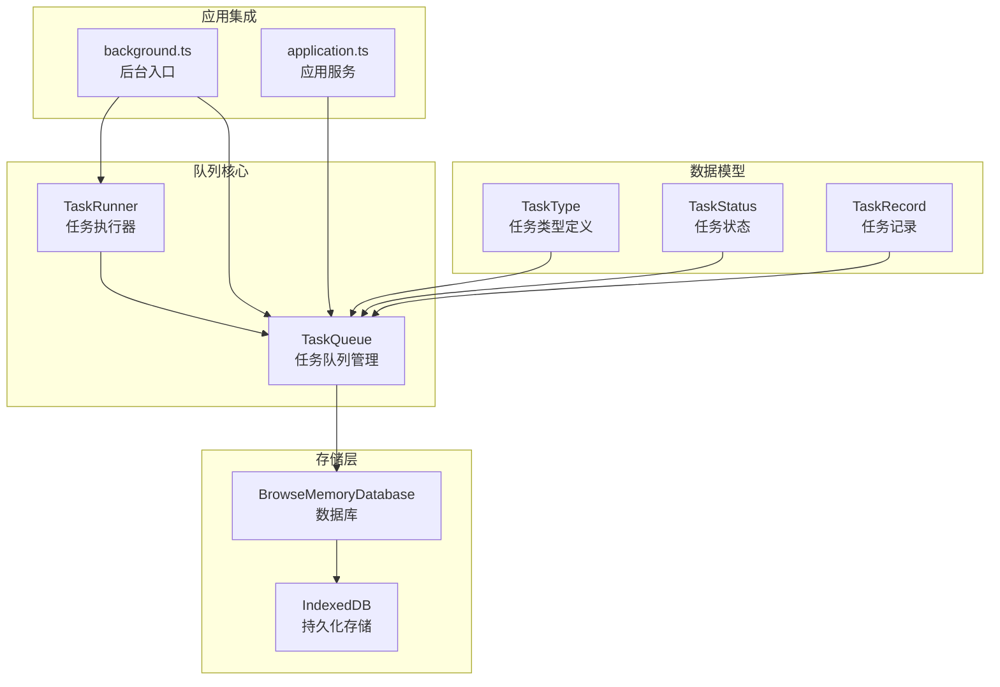
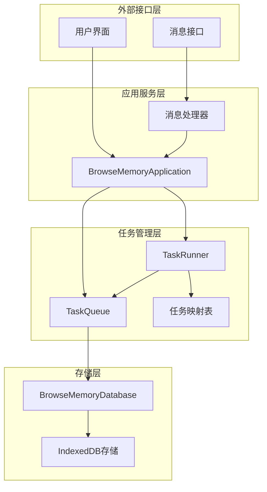
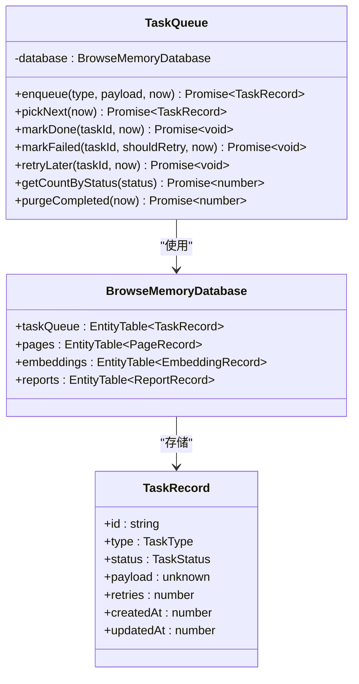
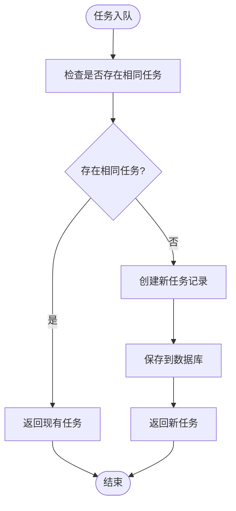
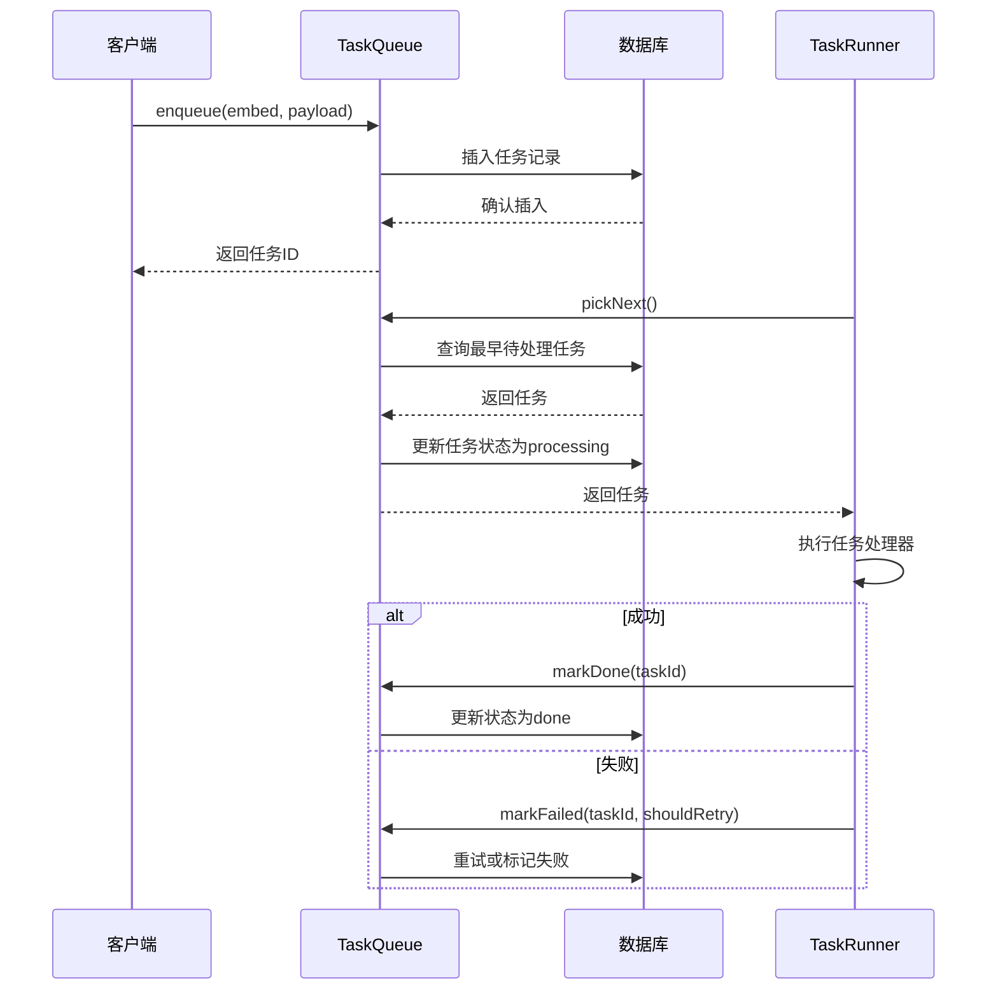
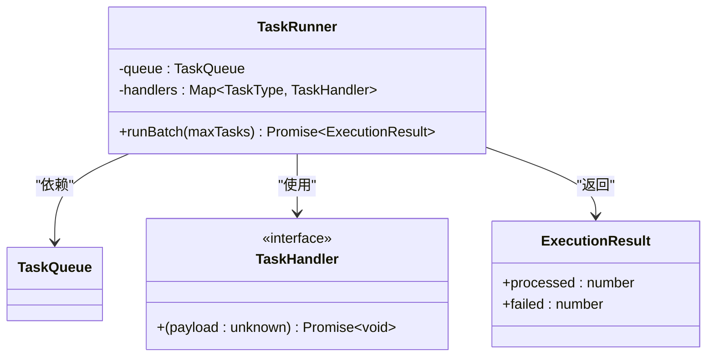
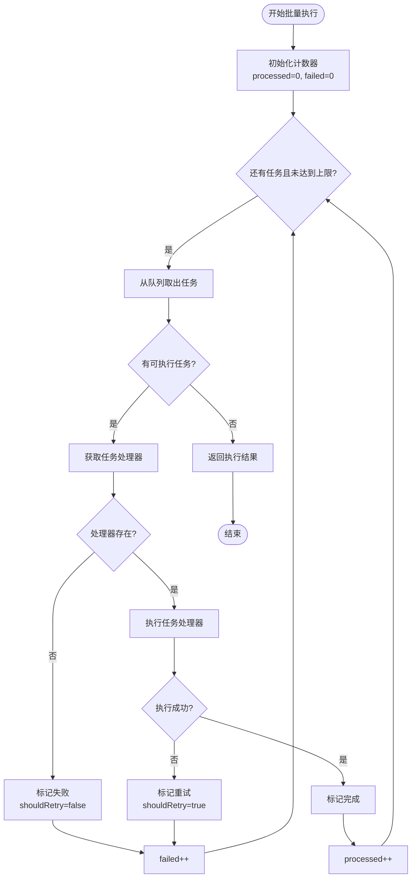
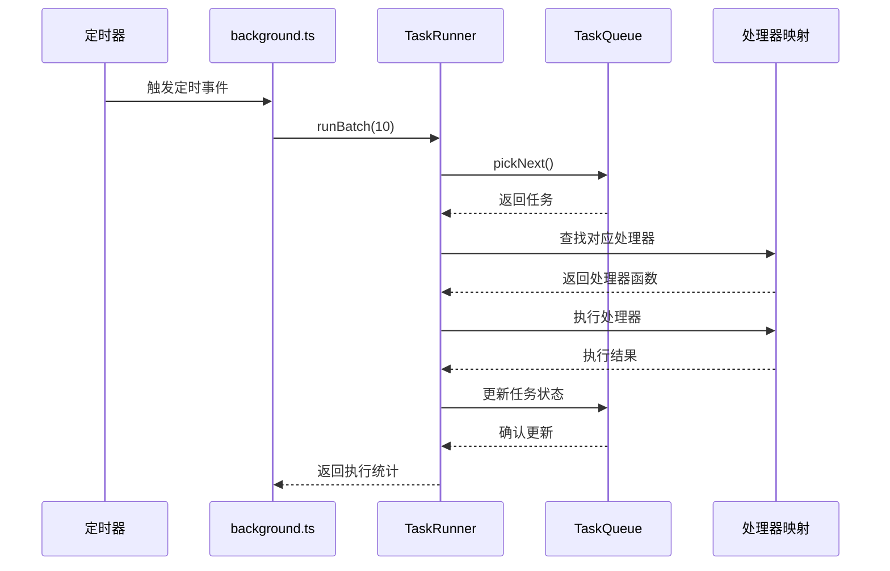
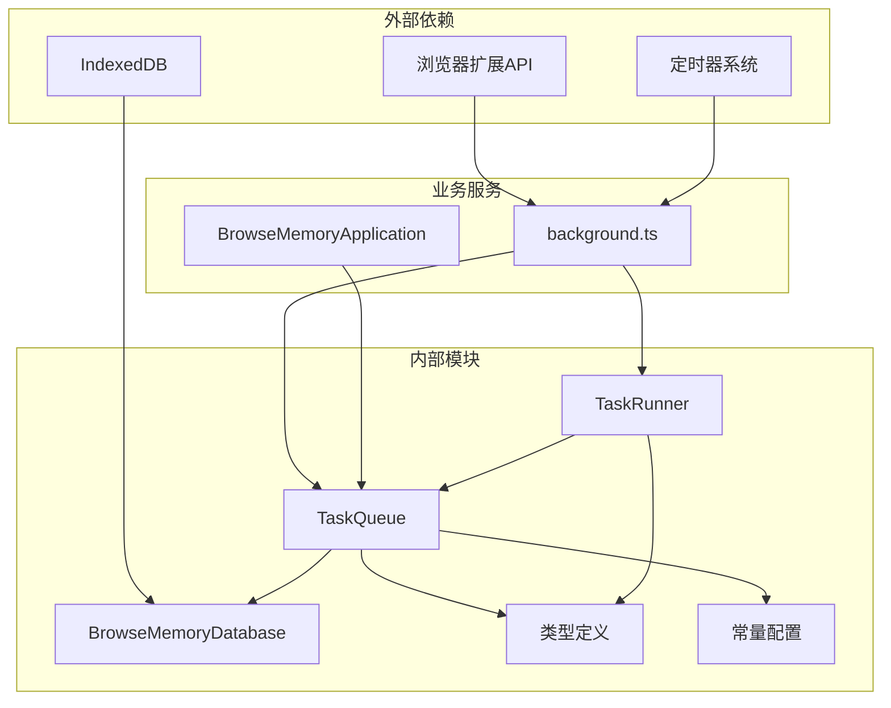
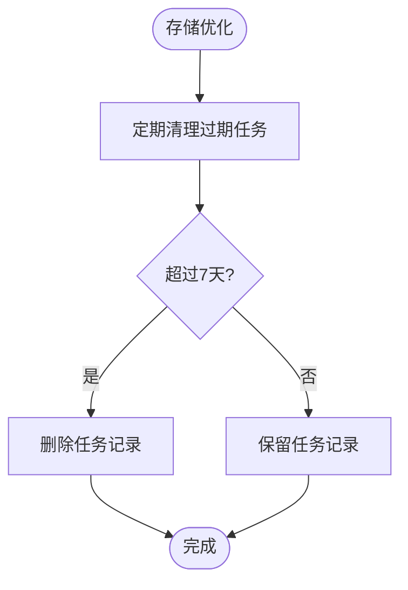

# 任务队列系统

<cite>
**本文档引用的文件**
- [task-queue.ts](file://src/queue/task-queue.ts)
- [task-runner.ts](file://src/queue/task-runner.ts)
- [types.ts](file://src/shared/types.ts)
- [constants.ts](file://src/shared/constants.ts)
- [database.ts](file://src/storage/database.ts)
- [background.ts](file://entrypoints/background.ts)
- [application.ts](file://src/background/application.ts)
- [task-queue.test.ts](file://tests/queue/task-queue.test.ts)
- [task-runner.test.ts](file://tests/queue/task-runner.test.ts)
</cite>

## 目录
1. [简介](#简介)
2. [项目结构](#项目结构)
3. [核心组件](#核心组件)
4. [架构概览](#架构概览)
5. [详细组件分析](#详细组件分析)
6. [依赖关系分析](#依赖关系分析)
7. [性能考虑](#性能考虑)
8. [故障排除指南](#故障排除指南)
9. [结论](#结论)
10. [附录](#附录)

## 简介

任务队列系统是 BrowseMemory 扩展功能的核心基础设施，负责管理异步任务的生命周期，包括任务创建、调度、执行和状态跟踪。该系统采用基于浏览器扩展的消息传递机制，通过定时器触发任务执行，并使用 IndexedDB 进行持久化存储。

系统支持多种任务类型，包括嵌入向量化、内容摘要、报告生成等，并提供了完善的错误处理和重试机制。任务队列采用简单的 FIFO 调度策略，确保任务按创建顺序执行，同时支持任务去重和批量处理优化。

## 项目结构

任务队列系统主要分布在以下目录和文件中：



**图表来源**
- [task-queue.ts:1-126](file://src/queue/task-queue.ts#L1-L126)
- [task-runner.ts:1-41](file://src/queue/task-runner.ts#L1-L41)
- [database.ts:34-76](file://src/storage/database.ts#L34-L76)

**章节来源**
- [task-queue.ts:1-126](file://src/queue/task-queue.ts#L1-L126)
- [task-runner.ts:1-41](file://src/queue/task-runner.ts#L1-L41)
- [database.ts:34-76](file://src/storage/database.ts#L34-L76)

## 核心组件

### 任务类型定义

系统支持五种核心任务类型：
- `embed`: 嵌入向量化任务，将页面内容转换为向量表示
- `summarize`: 内容摘要任务，生成页面内容的摘要
- `report_daily`: 日报生成任务
- `report_weekly`: 周报生成任务  
- `report_monthly`: 月报生成任务

每种任务类型都有特定的负载格式和处理逻辑，通过统一的接口进行抽象。

### 任务状态管理

任务在四个状态间转换：
- `pending`: 待处理状态，新创建的任务初始状态
- `processing`: 处理中状态，被任务执行器取出的任务
- `done`: 完成状态，成功执行的任务
- `failed`: 失败状态，超过最大重试次数的任务

### 错误处理与重试机制

系统实现了智能的错误处理策略：
- 最大重试次数：3次
- 指数退避延迟：60秒、300秒、1800秒
- 失败后降级：超过最大重试次数的任务标记为失败
- 无处理器任务：未注册处理器的任务直接标记失败

**章节来源**
- [types.ts:108-124](file://src/shared/types.ts#L108-L124)
- [constants.ts:31-32](file://src/shared/constants.ts#L31-L32)
- [task-queue.ts:71-106](file://src/queue/task-queue.ts#L71-L106)

## 架构概览

任务队列系统采用分层架构设计，各组件职责清晰分离：



**图表来源**
- [background.ts:39-241](file://entrypoints/background.ts#L39-L241)
- [application.ts:29-63](file://src/background/application.ts#L29-L63)
- [task-queue.ts:12-13](file://src/queue/task-queue.ts#L12-L13)
- [task-runner.ts:7-11](file://src/queue/task-runner.ts#L7-L11)

系统通过浏览器扩展的后台脚本运行，利用定时器触发任务执行，通过消息传递机制与前端界面通信。

## 详细组件分析

### TaskQueue 组件分析

TaskQueue 是任务队列的核心管理类，负责任务的生命周期管理：



**图表来源**
- [task-queue.ts:12-126](file://src/queue/task-queue.ts#L12-L126)
- [database.ts:34-44](file://src/storage/database.ts#L34-L44)
- [types.ts:116-124](file://src/shared/types.ts#L116-L124)

#### 任务去重机制

TaskQueue 实现了智能的任务去重功能，避免相同类型和负载的任务重复排队：



**图表来源**
- [task-queue.ts:15-46](file://src/queue/task-queue.ts#L15-L46)

#### 任务调度策略

系统采用基于创建时间的简单调度策略，确保任务按先进先出原则执行：



**图表来源**
- [task-queue.ts:48-62](file://src/queue/task-queue.ts#L48-L62)
- [task-runner.ts:13-39](file://src/queue/task-runner.ts#L13-L39)

**章节来源**
- [task-queue.ts:12-126](file://src/queue/task-queue.ts#L12-L126)

### TaskRunner 组件分析

TaskRunner 是任务执行引擎，负责从队列中取出任务并执行相应的处理器：



**图表来源**
- [task-runner.ts:7-41](file://src/queue/task-runner.ts#L7-L41)

#### 批量执行机制

TaskRunner 支持批量执行模式，通过参数控制每次处理的任务数量：



**图表来源**
- [task-runner.ts:13-39](file://src/queue/task-runner.ts#L13-L39)

**章节来源**
- [task-runner.ts:1-41](file://src/queue/task-runner.ts#L1-L41)

### 后台集成分析

任务队列系统与后台脚本深度集成，通过定时器驱动任务执行：



**图表来源**
- [background.ts:195-225](file://entrypoints/background.ts#L195-L225)
- [background.ts:200-202](file://entrypoints/background.ts#L200-L202)

**章节来源**
- [background.ts:69-152](file://entrypoints/background.ts#L69-L152)
- [background.ts:195-225](file://entrypoints/background.ts#L195-L225)

## 依赖关系分析

任务队列系统具有清晰的依赖层次结构：



**图表来源**
- [background.ts:1-26](file://entrypoints/background.ts#L1-L26)
- [task-queue.ts:1-13](file://src/queue/task-queue.ts#L1-L13)
- [task-runner.ts:1-5](file://src/queue/task-runner.ts#L1-L5)

### 数据流分析

系统中的数据流遵循严格的单向原则：

1. **任务创建**: 应用服务通过 `TaskQueue.enqueue()` 创建任务
2. **任务调度**: 定时器触发 `TaskRunner.runBatch()` 取出任务
3. **任务执行**: 根据任务类型查找对应处理器执行
4. **状态更新**: 执行完成后更新任务状态到数据库
5. **结果反馈**: 批量执行返回处理统计信息

**章节来源**
- [application.ts:74-86](file://src/background/application.ts#L74-L86)
- [background.ts:200-202](file://entrypoints/background.ts#L200-L202)

## 性能考虑

### 并发控制机制

系统采用简单的串行执行模式，通过以下机制控制并发：

- **批量大小限制**: 默认每次最多处理10个任务
- **任务去重**: 避免重复任务占用资源
- **内存管理**: 定期清理已完成任务，防止内存泄漏

### 存储优化策略



**图表来源**
- [task-queue.ts:114-124](file://src/queue/task-queue.ts#L114-L124)

### 批量处理优化

系统通过以下方式优化批量处理性能：

- **批量执行**: 单次调用处理多个任务，减少数据库查询开销
- **处理器缓存**: 使用Map结构快速查找任务处理器
- **异步处理**: 所有数据库操作都是异步的，不阻塞主线程

**章节来源**
- [task-runner.ts:13-39](file://src/queue/task-runner.ts#L13-L39)
- [task-queue.ts:114-124](file://src/queue/task-queue.ts#L114-L124)

## 故障排除指南

### 常见问题诊断

#### 任务无法执行
1. **检查处理器注册**: 确保对应任务类型的处理器已注册
2. **验证API密钥**: 对于需要API的任务，检查密钥是否正确配置
3. **查看队列状态**: 使用 `GET_QUEUE_STATUS` 获取当前队列统计信息

#### 任务重复执行
1. **检查去重机制**: 确认相同类型和负载的任务不会重复入队
2. **验证任务ID**: 检查任务ID是否正确传递
3. **清理异常状态**: 手动清理处于异常状态的任务

#### 性能问题
1. **调整批量大小**: 根据系统资源调整 `runBatch()` 的参数
2. **监控队列长度**: 定期检查队列长度，避免积压
3. **优化处理器**: 检查处理器执行时间，必要时进行优化

**章节来源**
- [task-queue.test.ts:19-91](file://tests/queue/task-queue.test.ts#L19-L91)
- [task-runner.test.ts:21-90](file://tests/queue/task-runner.test.ts#L21-L90)

### 错误处理策略

系统提供了多层次的错误处理机制：

1. **处理器异常**: 任务执行抛出异常时自动重试
2. **无处理器错误**: 未注册处理器的任务直接标记失败
3. **数据库错误**: 数据库操作失败时记录错误但不影响其他任务
4. **API错误**: 外部API调用失败时根据错误类型决定重试策略

**章节来源**
- [task-runner.ts:28-35](file://src/queue/task-runner.ts#L28-L35)
- [task-queue.ts:71-84](file://src/queue/task-queue.ts#L71-L84)

## 结论

BrowseMemory 的任务队列系统是一个设计简洁、实现优雅的异步任务管理系统。系统通过合理的架构设计和完善的错误处理机制，为扩展功能提供了可靠的任务执行基础。

主要特点包括：
- **简单可靠的架构**: 基于FIFO的调度策略，易于理解和维护
- **完善的生命周期管理**: 从创建到完成的完整状态跟踪
- **智能的错误处理**: 支持重试和失败降级
- **良好的性能特性**: 批量处理和去重机制优化资源使用
- **灵活的扩展性**: 易于添加新的任务类型和处理器

该系统为后续的功能扩展奠定了坚实的基础，可以轻松支持更多复杂任务类型的处理需求。

## 附录

### 任务定义示例

#### 嵌入向量化任务
```typescript
// 入队示例
await taskQueue.enqueue("embed", { 
  pageId: "page_123" 
});

// 处理器实现
handlers.set("embed", async (payload) => {
  const { pageId } = payload as { pageId: string };
  // 执行嵌入向量化逻辑
});
```

#### 报告生成任务
```typescript
// 入队示例
await taskQueue.enqueue("report_daily", { 
  date: "2024-01-15" 
});

// 处理器实现
handlers.set("report_daily", async (payload) => {
  const { date } = payload as { date: string };
  // 生成日报逻辑
});
```

### 执行流程演示

系统支持多种执行模式：

1. **定时执行**: 通过浏览器定时器自动触发
2. **手动触发**: 通过消息接口主动执行
3. **批量处理**: 支持一次性处理多个任务

### 性能优化建议

1. **合理设置批量大小**: 根据系统性能调整 `runBatch()` 参数
2. **监控队列健康**: 定期检查队列长度和处理速度
3. **优化处理器性能**: 减少处理器执行时间，提高吞吐量
4. **定期清理**: 启用自动清理机制，保持数据库整洁