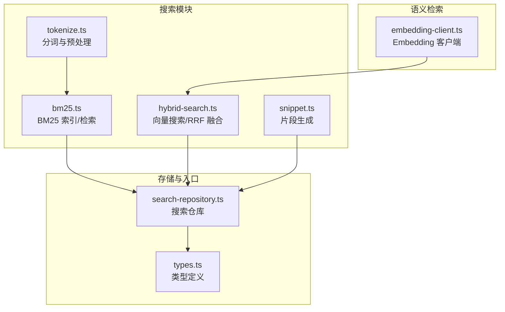
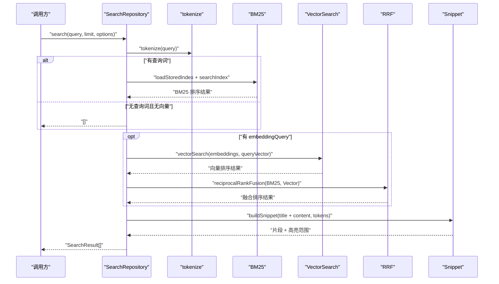
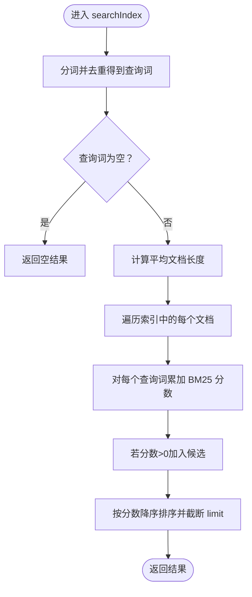
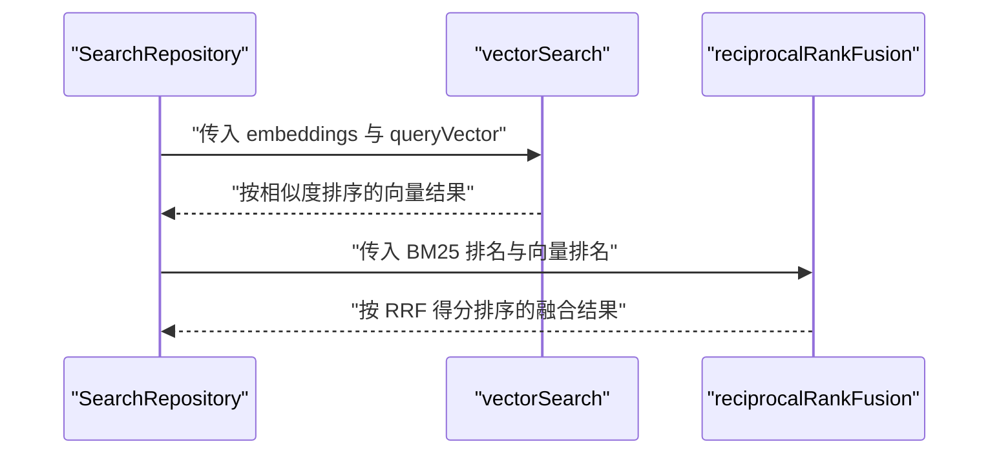
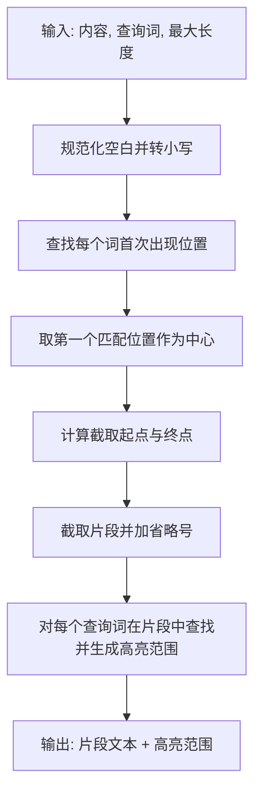
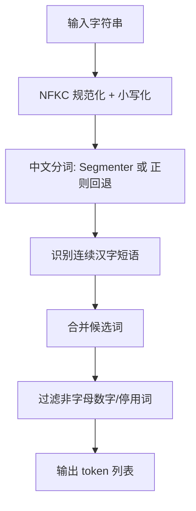
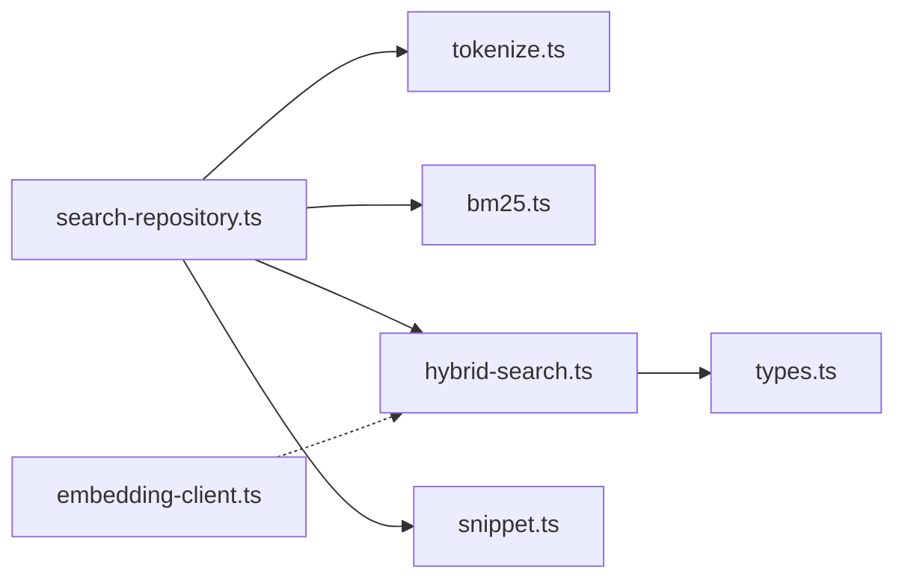

# 搜索引擎系统

<cite>
**本文档引用的文件**
- [README.md](file://README.md)
- [bm25.ts](file://src/search/bm25.ts)
- [hybrid-search.ts](file://src/search/hybrid-search.ts)
- [snippet.ts](file://src/search/snippet.ts)
- [tokenize.ts](file://src/search/tokenize.ts)
- [search-repository.ts](file://src/storage/search-repository.ts)
- [types.ts](file://src/shared/types.ts)
- [embedding-client.ts](file://src/ai/embedding-client.ts)
- [bm25.test.ts](file://tests/search/bm25.test.ts)
- [hybrid-search.test.ts](file://tests/search/hybrid-search.test.ts)
- [snippet.test.ts](file://tests/search/snippet.test.ts)
- [tokenize.test.ts](file://tests/search/tokenize.test.ts)
</cite>

## 目录
1. [简介](#简介)
2. [项目结构](#项目结构)
3. [核心组件](#核心组件)
4. [架构总览](#架构总览)
5. [详细组件分析](#详细组件分析)
6. [依赖关系分析](#依赖关系分析)
7. [性能考量](#性能考量)
8. [故障排查指南](#故障排查指南)
9. [结论](#结论)
10. [附录](#附录)

## 简介
本项目是一个“本地优先”的浏览器扩展搜索引擎，提供以下能力：
- 基于 BM25 的全文检索（支持中英文）
- 可选的向量语义检索（基于余弦相似度）
- 混合检索（BM25 + 向量）通过 Reciprocal Rank Fusion（RRF）融合排序
- 结果片段生成（上下文截取 + 关键词高亮）
- 文本分词与预处理（多语言、停用词过滤、词形归一化）

系统采用“离线优先 + 云端可选”的设计：当语义检索不可用时，自动降级为纯 BM25；Embedding 生成通过后台任务队列异步执行，不影响主流程。

章节来源
- [README.md:1-135](file://README.md#L1-L135)

## 项目结构
围绕“搜索”功能的核心目录与文件如下：
- 搜索算法与工具
  - 分词与预处理：tokenize.ts
  - BM25 实现：bm25.ts
  - 混合检索与向量搜索：hybrid-search.ts
  - 片段生成：snippet.ts
- 存储与检索入口
  - 搜索仓库：search-repository.ts
- 类型定义
  - 共享类型：types.ts
- 语义检索客户端
  - Embedding 客户端：embedding-client.ts

图表来源
- [bm25.ts:1-166](file://src/search/bm25.ts#L1-L166)
- [hybrid-search.ts:1-78](file://src/search/hybrid-search.ts#L1-L78)
- [snippet.ts:1-52](file://src/search/snippet.ts#L1-L52)
- [tokenize.ts:1-50](file://src/search/tokenize.ts#L1-L50)
- [search-repository.ts:1-110](file://src/storage/search-repository.ts#L1-L110)
- [types.ts:1-139](file://src/shared/types.ts#L1-L139)
- [embedding-client.ts:1-87](file://src/ai/embedding-client.ts#L1-L87)

章节来源
- [README.md:94-115](file://README.md#L94-L115)

## 核心组件
- 分词与预处理（tokenize.ts）
  - 支持中英文分词：使用 Intl.Segmenter（中文词级切分）与正则回退（拉丁字母/数字）
  - 停用词过滤：内置英文及部分中文停用词集合
  - 归一化：Unicode NFKC 规范化与小写化
- BM25 全文检索（bm25.ts）
  - 索引结构：文档映射、词项文档频率、总长度
  - 计算逻辑：词频加权、标题权重提升、IDF 平滑、归一化因子
  - 查询接口：支持限制返回数量
- 向量检索与融合（hybrid-search.ts）
  - 余弦相似度：向量相似度计算
  - 暴力向量检索：适用于中小规模向量集
  - RRF 融合：综合 BM25 与向量排序
- 片段生成（snippet.ts）
  - 上下文截取：根据首个匹配位置为中心截取固定长度
  - 高亮范围：为每个查询词生成高亮区间
- 搜索仓库（search-repository.ts）
  - 组织 BM25 与向量检索流程，生成最终结果与片段
  - 支持无嵌入查询时的纯 BM25 检索
- 类型定义（types.ts）
  - 搜索结果、高亮范围、Embedding 记录等类型
- Embedding 客户端（embedding-client.ts）
  - 发起 Embedding 请求，处理鉴权、速率限制、网络异常等

章节来源
- [tokenize.ts:1-50](file://src/search/tokenize.ts#L1-L50)
- [bm25.ts:3-166](file://src/search/bm25.ts#L3-L166)
- [hybrid-search.ts:1-78](file://src/search/hybrid-search.ts#L1-L78)
- [snippet.ts:1-52](file://src/search/snippet.ts#L1-L52)
- [search-repository.ts:15-110](file://src/storage/search-repository.ts#L15-L110)
- [types.ts:43-105](file://src/shared/types.ts#L43-L105)
- [embedding-client.ts:16-87](file://src/ai/embedding-client.ts#L16-L87)

## 架构总览
系统采用“模块化 + 仓库入口”的设计：
- 搜索仓库统一协调 BM25 与向量检索，按需进行 RRF 融合
- 分词与预处理在 BM25 与片段生成阶段复用
- Embedding 客户端独立负责向量化请求，异常时触发降级

图表来源
- [search-repository.ts:35-108](file://src/storage/search-repository.ts#L35-L108)
- [bm25.ts:46-69](file://src/search/bm25.ts#L46-L69)
- [bm25.ts:125-165](file://src/search/bm25.ts#L125-L165)
- [hybrid-search.ts:35-48](file://src/search/hybrid-search.ts#L35-L48)
- [hybrid-search.ts:57-77](file://src/search/hybrid-search.ts#L57-L77)
- [snippet.ts:8-51](file://src/search/snippet.ts#L8-L51)

## 详细组件分析

### BM25 组件分析
- 数据结构
  - 索引文档：包含 pageId、长度、词项频率
  - 词项文档频率：用于 IDF 计算
  - 总长度：用于平均文档长度计算
- 关键流程
  - upsertDocument：去重插入、更新频率与文档总数
  - removeDocument：移除旧文档并同步更新词项频率
  - searchIndex：查询词去重、IDF 平滑、归一化、打分与排序
- 参数与公式
  - k1、b：控制饱和与长度归一化的超参
  - IDF 平滑：使用 log(1 + ...) 形式避免分母为零
  - 标题权重：标题分词频率额外加权，提升标题命中优先级

图表来源
- [bm25.ts:125-165](file://src/search/bm25.ts#L125-L165)

章节来源
- [bm25.ts:3-166](file://src/search/bm25.ts#L3-L166)
- [bm25.test.ts:10-55](file://tests/search/bm25.test.ts#L10-L55)

### 混合搜索组件分析
- 向量搜索
  - 余弦相似度：点积与范数归一化
  - 暴力检索：遍历所有向量，适合中小规模
- RRF 融合
  - 公式：对每个 pageId，将两个列表中的排名位次代入 1/(k+rank)，累加作为融合得分
  - 超参 k：控制融合强度，k 越大，远位次贡献越小
- 降级策略
  - 当 embeddingQuery 缺失或向量为空时，直接返回 BM25 结果

图表来源
- [hybrid-search.ts:17-30](file://src/search/hybrid-search.ts#L17-L30)
- [hybrid-search.ts:35-48](file://src/search/hybrid-search.ts#L35-L48)
- [hybrid-search.ts:57-77](file://src/search/hybrid-search.ts#L57-L77)

章节来源
- [hybrid-search.ts:1-78](file://src/search/hybrid-search.ts#L1-L78)
- [hybrid-search.test.ts:10-96](file://tests/search/hybrid-search.test.ts#L10-L96)

### 片段生成组件分析
- 截取策略
  - 将内容规范化（空白折叠），定位首个查询词出现位置
  - 以前后半窗口为中心截取固定长度，两端添加省略号
- 高亮策略
  - 对每个查询词（去重后）在片段中查找所有出现位置，生成高亮区间
  - 返回片段文本与高亮范围数组

图表来源
- [snippet.ts:8-51](file://src/search/snippet.ts#L8-L51)

章节来源
- [snippet.ts:1-52](file://src/search/snippet.ts#L1-L52)
- [snippet.test.ts:5-29](file://tests/search/snippet.test.ts#L5-L29)

### 分词与预处理组件分析
- 中文分词
  - 优先使用 Intl.Segmenter（granularity=word），否则回退到正则匹配
  - 额外识别连续汉字短语，保证成语/专有名词完整性
- 停用词与标点
  - 过滤常见英文停用词与部分中文虚词
  - 移除非字母数字字符，保留有效 token
- 归一化
  - Unicode NFKC 规范化，统一全角/半角字符
  - 统一小写化，降低大小写差异

图表来源
- [tokenize.ts:37-49](file://src/search/tokenize.ts#L37-L49)

章节来源
- [tokenize.ts:1-50](file://src/search/tokenize.ts#L1-L50)
- [tokenize.test.ts:5-28](file://tests/search/tokenize.test.ts#L5-L28)

### 搜索仓库与类型定义
- 搜索仓库职责
  - 组织 BM25 与向量检索流程，生成 SearchResult（含片段与高亮）
  - 在 embeddingQuery 缺失时，直接返回 BM25 结果
- 类型定义
  - SearchResult、HighlightRange、EmbeddingRecord 等类型支撑前端渲染与数据一致性

章节来源
- [search-repository.ts:15-110](file://src/storage/search-repository.ts#L15-L110)
- [types.ts:43-105](file://src/shared/types.ts#L43-L105)

### Embedding 客户端
- 功能
  - 构造 /v1/embeddings 请求，支持超时与中断
  - 统一处理鉴权失败、速率限制、网络异常等错误
- 降级策略
  - 当 Embedding 请求失败或离线时，系统自动降级为纯 BM25 检索

章节来源
- [embedding-client.ts:16-87](file://src/ai/embedding-client.ts#L16-L87)
- [README.md:126-135](file://README.md#L126-L135)

## 依赖关系分析
- 模块耦合
  - search-repository 依赖 tokenize、bm25、hybrid-search、snippet
  - hybrid-search 依赖 shared/types 中的 EmbeddingRecord
  - embedding-client 与 hybrid-search 解耦，仅在需要时被调用
- 外部依赖
  - Intl.Segmenter（浏览器环境）
  - IndexedDB（Dexie）用于持久化索引与向量

图表来源
- [search-repository.ts:1-110](file://src/storage/search-repository.ts#L1-L110)
- [bm25.ts:1-166](file://src/search/bm25.ts#L1-L166)
- [hybrid-search.ts:1-78](file://src/search/hybrid-search.ts#L1-L78)
- [snippet.ts:1-52](file://src/search/snippet.ts#L1-L52)
- [types.ts:1-139](file://src/shared/types.ts#L1-L139)
- [embedding-client.ts:1-87](file://src/ai/embedding-client.ts#L1-L87)

## 性能考量
- 索引构建与存储
  - 使用 Map 结构存储文档与词项频率，便于快速更新与查询
  - 通过 documentFrequency 与 totalLength 避免重复计算
- 查询加速
  - 查询词先分词再去重，减少重复计算
  - BM25 分数仅在 termFrequency > 0 时累加
- 向量检索
  - 暴力检索适用于中小规模（<10K 文档），复杂度 O(N·D)
  - 可通过 topK 限制候选集，降低后续融合成本
- 片段生成
  - 截取与高亮范围计算为线性复杂度，阈值可调
- 缓存与降级
  - Embedding 失败或离线时，优先使用已缓存向量与 BM25，保障可用性

章节来源
- [bm25.ts:125-165](file://src/search/bm25.ts#L125-L165)
- [hybrid-search.ts:35-48](file://src/search/hybrid-search.ts#L35-L48)
- [README.md:126-135](file://README.md#L126-L135)

## 故障排查指南
- BM25 无结果
  - 检查查询是否为空或仅包含停用词
  - 确认索引是否已加载（documents/term 集合）
- 向量检索异常
  - 检查 Embedding API Key 是否有效、是否触发速率限制
  - 确认向量维度与查询向量一致
- 片段不显示高亮
  - 确认查询词经分词后仍存在于内容中
  - 检查大小写与 Unicode 规范化是否导致匹配失败
- 降级行为确认
  - 未配置 Embedding 时应返回 BM25 结果
  - Embedding 报错或离线时应保持可用性

章节来源
- [bm25.test.ts:40-55](file://tests/search/bm25.test.ts#L40-L55)
- [hybrid-search.test.ts:32-55](file://tests/search/hybrid-search.test.ts#L32-L55)
- [snippet.test.ts:5-29](file://tests/search/snippet.test.ts#L5-L29)
- [embedding-client.ts:40-84](file://src/ai/embedding-client.ts#L40-L84)
- [README.md:126-135](file://README.md#L126-L135)

## 结论
本搜索引擎系统以“BM25 全文检索为基础，向量检索为增强”的混合架构实现高召回与高精度兼顾的检索体验。通过统一的搜索仓库组织流程、标准化的分词与片段生成、以及健壮的降级策略，系统在本地优先的前提下实现了良好的可用性与扩展性。建议在实际部署中结合业务规模调整 BM25 超参与 RRF 超参，并在大规模向量场景引入近似最近邻索引以进一步提升性能。

## 附录

### API 使用示例（路径指引）
- 搜索（BM25 + 可选向量融合）
  - 调用路径：[search-repository.search:35-108](file://src/storage/search-repository.ts#L35-L108)
  - 输入：query（字符串）、limit（可选）、options.embeddingQuery（可选向量）
  - 输出：SearchResult[]（包含片段与高亮范围）
- BM25 索引管理
  - 创建索引：[createBm25Index:38-44](file://src/search/bm25.ts#L38-L44)
  - 插入/更新文档：[upsertDocument:100-123](file://src/search/bm25.ts#L100-L123)
  - 删除文档：[removeDocument:82-98](file://src/search/bm25.ts#L82-L98)
  - 检索：[searchIndex:125-165](file://src/search/bm25.ts#L125-L165)
- 向量检索与融合
  - 余弦相似度：[cosineSimilarity:17-30](file://src/search/hybrid-search.ts#L17-L30)
  - 暴力向量检索：[vectorSearch:35-48](file://src/search/hybrid-search.ts#L35-L48)
  - RRF 融合：[reciprocalRankFusion:57-77](file://src/search/hybrid-search.ts#L57-L77)
- 片段生成
  - [buildSnippet:8-51](file://src/search/snippet.ts#L8-L51)
- 分词
  - [tokenize:37-49](file://src/search/tokenize.ts#L37-L49)

### 参数调优策略（路径指引）
- BM25 超参
  - k1、b：在 [searchIndex:137-138](file://src/search/bm25.ts#L137-L138) 中定义，建议通过 A/B 实验在业务数据上寻找最优组合
  - 标题权重：在 [frequenciesFor:71-80](file://src/search/bm25.ts#L71-L80) 中对标题分词频率加权，可根据业务调整倍数
- RRF 超参
  - k：在 [reciprocalRankFusion](file://src/search/hybrid-search.ts#L60) 中控制融合强度，建议结合 BM25 与向量结果分布调节
- 片段长度
  - maximumLength：在 [buildSnippet](file://src/search/snippet.ts#L11) 中设定，建议根据 UI 展示空间与用户阅读习惯调整
- 向量检索 topK
  - 在 [vectorSearch](file://src/search/hybrid-search.ts#L38) 中设定，建议与下游展示数量一致或略大以保留多样性