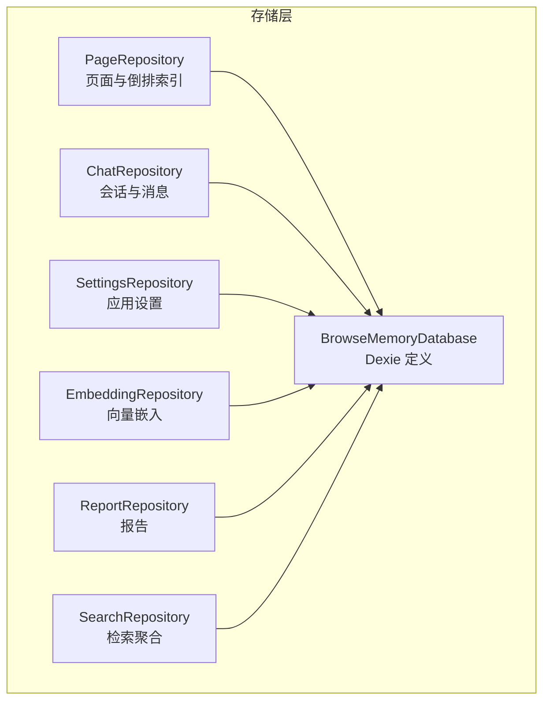
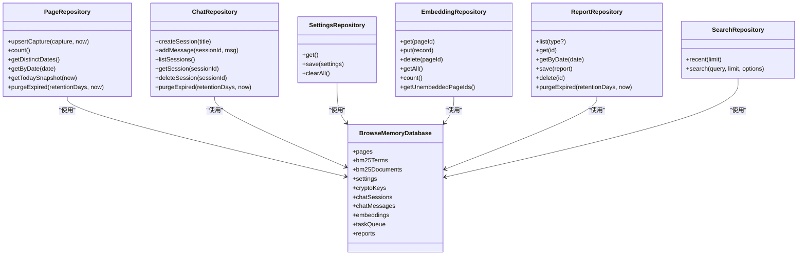
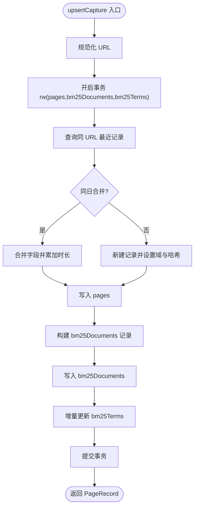
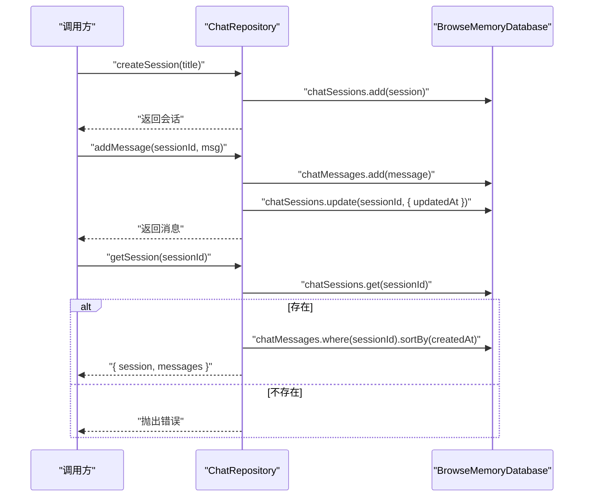
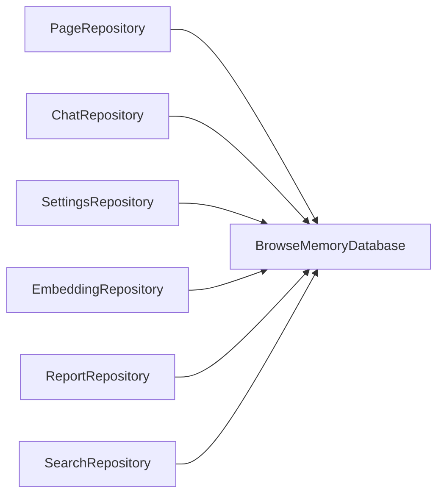

# 数据存储层

<cite>
**本文引用的文件**
- [src/storage/database.ts](file://src/storage/database.ts)
- [src/storage/page-repository.ts](file://src/storage/page-repository.ts)
- [src/storage/chat-repository.ts](file://src/storage/chat-repository.ts)
- [src/storage/settings-repository.ts](file://src/storage/settings-repository.ts)
- [src/storage/embedding-repository.ts](file://src/storage/embedding-repository.ts)
- [src/storage/report-repository.ts](file://src/storage/report-repository.ts)
- [src/storage/search-repository.ts](file://src/storage/search-repository.ts)
- [src/shared/types.ts](file://src/shared/types.ts)
- [src/shared/constants.ts](file://src/shared/constants.ts)
- [tests/storage/page-repository.test.ts](file://tests/storage/page-repository.test.ts)
- [tests/storage/chat-repository.test.ts](file://tests/storage/chat-repository.test.ts)
- [tests/storage/settings-repository.test.ts](file://tests/storage/settings-repository.test.ts)
</cite>

## 目录
1. [简介](#简介)
2. [项目结构](#项目结构)
3. [核心组件](#核心组件)
4. [架构总览](#架构总览)
5. [详细组件分析](#详细组件分析)
6. [依赖分析](#依赖分析)
7. [性能考虑](#性能考虑)
8. [故障排查指南](#故障排查指南)
9. [结论](#结论)
10. [附录](#附录)

## 简介
本文件面向数据存储层，系统性阐述基于 Dexie 的数据库设计与仓储模式实现，覆盖表结构与主键/索引策略、数据模型关系映射、事务与批量操作、查询优化、迁移与版本升级、备份恢复与清理、隐私保护以及 CRUD 与复杂查询的实现范式。目标是帮助开发者快速理解并正确使用存储层，同时为维护与扩展提供清晰指引。

## 项目结构
存储层由“数据库定义 + 多个仓储类”组成，每个仓储封装特定实体的增删改查与业务逻辑，并通过 Dexie 提供的事务、索引与批量 API 实现高性能与一致性。

图表来源
- [src/storage/database.ts:34-76](file://src/storage/database.ts#L34-L76)
- [src/storage/page-repository.ts:43-103](file://src/storage/page-repository.ts#L43-L103)
- [src/storage/chat-repository.ts:8-21](file://src/storage/chat-repository.ts#L8-L21)
- [src/storage/settings-repository.ts:8-23](file://src/storage/settings-repository.ts#L8-L23)
- [src/storage/embedding-repository.ts:4-13](file://src/storage/embedding-repository.ts#L4-L13)
- [src/storage/report-repository.ts:4-24](file://src/storage/report-repository.ts#L4-L24)
- [src/storage/search-repository.ts:15-33](file://src/storage/search-repository.ts#L15-L33)

章节来源
- [src/storage/database.ts:1-80](file://src/storage/database.ts#L1-L80)
- [src/storage/page-repository.ts:1-265](file://src/storage/page-repository.ts#L1-L265)
- [src/storage/chat-repository.ts:1-102](file://src/storage/chat-repository.ts#L1-L102)
- [src/storage/settings-repository.ts:1-57](file://src/storage/settings-repository.ts#L1-L57)
- [src/storage/embedding-repository.ts:1-36](file://src/storage/embedding-repository.ts#L1-L36)
- [src/storage/report-repository.ts:1-40](file://src/storage/report-repository.ts#L1-L40)
- [src/storage/search-repository.ts:1-110](file://src/storage/search-repository.ts#L1-L110)

## 核心组件
- 数据库定义：集中声明所有表、主键与索引，以及版本迁移脚本。
- 仓储类：围绕实体提供 CRUD、聚合统计、清理与查询等能力；多数方法在事务中执行以保证一致性。
- 类型系统：统一的记录类型定义，确保仓储接口与数据库表结构一致。

章节来源
- [src/storage/database.ts:34-76](file://src/storage/database.ts#L34-L76)
- [src/shared/types.ts:32-138](file://src/shared/types.ts#L32-L138)

## 架构总览
Dexie 将 IndexedDB 映射为类关系模型，仓储类通过数据库实例暴露的方法进行读写。事务用于跨表一致性更新（如页面合并时同步更新倒排索引），批量 API 用于高效清理与导出。

图表来源
- [src/storage/database.ts:34-44](file://src/storage/database.ts#L34-L44)
- [src/storage/page-repository.ts:43-103](file://src/storage/page-repository.ts#L43-L103)
- [src/storage/chat-repository.ts:8-21](file://src/storage/chat-repository.ts#L8-L21)
- [src/storage/settings-repository.ts:8-23](file://src/storage/settings-repository.ts#L8-L23)
- [src/storage/embedding-repository.ts:4-13](file://src/storage/embedding-repository.ts#L4-L13)
- [src/storage/report-repository.ts:4-24](file://src/storage/report-repository.ts#L4-L24)
- [src/storage/search-repository.ts:15-33](file://src/storage/search-repository.ts#L15-L33)

## 详细组件分析

### 数据库与表结构、索引与约束
- 表与主键
  - 页面：pages(id)
  - 倒排词项：bm25Terms(term)
  - 文档频率：bm25Documents(pageId)
  - 设置：settings(key)
  - 加密密钥：cryptoKeys(id)
  - 会话：chatSessions(id)
  - 消息：chatMessages(id)
  - 向量：embeddings(pageId)
  - 任务队列：taskQueue(id)
  - 报告：reports(id)
- 索引策略
  - pages：主键 id，复合索引 normalizedUrl、visitDate、domain、updatedAt
  - bm25Terms：主键 term
  - bm25Documents：主键 pageId
  - settings：主键 key
  - chatSessions：主键 id，索引 createdAt、updatedAt
  - chatMessages：主键 id，索引 sessionId、createdAt
  - embeddings：主键 pageId
  - taskQueue：主键 id，索引 status、type
  - reports：主键 id，索引 type、date
- 约束与默认值
  - 所有记录字段遵循类型定义；字符串字段长度限制见具体仓储（如会话标题截断）。
  - 删除/清理采用软删除语义：保留元数据，清空内容字段或删除关联记录。

章节来源
- [src/storage/database.ts:46-76](file://src/storage/database.ts#L46-L76)
- [src/shared/types.ts:32-138](file://src/shared/types.ts#L32-L138)

### PageRepository：页面与倒排索引
- 合并策略
  - 同一 URL 且同一天内多次捕获合并为一次记录，累计阅读时长，更新时间戳。
  - 跨日则生成新记录。
- 倒排索引增量更新
  - 在事务中更新 bm25Documents 与 bm25Terms，仅对受影响的词项进行增删改，避免重建全量索引。
- 清理策略
  - 基于 updatedAt 截止时间清理过期页面，清空 content 并同步更新倒排索引。
- 统计与快照
  - 支持按日期分组、计算今日阅读分钟数、深读页数与热门域名。

图表来源
- [src/storage/page-repository.ts:46-103](file://src/storage/page-repository.ts#L46-L103)
- [src/storage/page-repository.ts:203-263](file://src/storage/page-repository.ts#L203-L263)

章节来源
- [src/storage/page-repository.ts:43-103](file://src/storage/page-repository.ts#L43-L103)
- [src/storage/page-repository.ts:148-197](file://src/storage/page-repository.ts#L148-L197)
- [src/storage/page-repository.ts:203-263](file://src/storage/page-repository.ts#L203-L263)
- [tests/storage/page-repository.test.ts:19-51](file://tests/storage/page-repository.test.ts#L19-L51)
- [tests/storage/page-repository.test.ts:140-191](file://tests/storage/page-repository.test.ts#L140-L191)

### ChatRepository：会话与消息
- 会话管理
  - 创建时截断标题长度，记录创建/更新时间。
  - 新增消息后刷新会话更新时间。
- 查询与删除
  - 列表按 updatedAt 倒序。
  - 获取会话时若不存在抛出错误。
  - 删除会话级联删除其消息。
- 清理策略
  - 基于 updatedAt 截止时间删除过期会话及其消息。

图表来源
- [src/storage/chat-repository.ts:11-37](file://src/storage/chat-repository.ts#L11-L37)
- [src/storage/chat-repository.ts:73-86](file://src/storage/chat-repository.ts#L73-L86)

章节来源
- [src/storage/chat-repository.ts:8-21](file://src/storage/chat-repository.ts#L8-L21)
- [src/storage/chat-repository.ts:23-37](file://src/storage/chat-repository.ts#L23-L37)
- [src/storage/chat-repository.ts:39-44](file://src/storage/chat-repository.ts#L39-L44)
- [src/storage/chat-repository.ts:73-86](file://src/storage/chat-repository.ts#L73-L86)
- [src/storage/chat-repository.ts:88-100](file://src/storage/chat-repository.ts#L88-L100)
- [tests/storage/chat-repository.test.ts:19-53](file://tests/storage/chat-repository.test.ts#L19-L53)
- [tests/storage/chat-repository.test.ts:59-98](file://tests/storage/chat-repository.test.ts#L59-L98)

### SettingsRepository：应用设置
- 读取：合并默认设置与持久化值，返回完整配置对象。
- 写入：部分更新后整体保存。
- 清理：一次性清空所有相关表，重置到默认状态。

章节来源
- [src/storage/settings-repository.ts:8-23](file://src/storage/settings-repository.ts#L8-L23)
- [src/storage/settings-repository.ts:25-55](file://src/storage/settings-repository.ts#L25-L55)
- [src/shared/constants.ts:12-24](file://src/shared/constants.ts#L12-L24)

### EmbeddingRepository：向量嵌入
- 基础 CRUD：按 pageId 主键存取向量。
- 统计与差集：计算总数、列出未嵌入页面 ID 集合。

章节来源
- [src/storage/embedding-repository.ts:4-35](file://src/storage/embedding-repository.ts#L4-L35)

### ReportRepository：报告
- 列表/详情/按日期查询/保存/删除。
- 清理：按创建时间过滤并批量删除。

章节来源
- [src/storage/report-repository.ts:4-39](file://src/storage/report-repository.ts#L4-L39)

### SearchRepository：检索聚合
- 最近浏览：按 updatedAt 倒序取最近若干条，生成摘要片段。
- 混合检索：BM25 + 可选向量相似度融合，支持互惠排序融合算法。

章节来源
- [src/storage/search-repository.ts:15-33](file://src/storage/search-repository.ts#L15-L33)
- [src/storage/search-repository.ts:35-108](file://src/storage/search-repository.ts#L35-L108)

## 依赖分析
- 仓储对数据库的依赖：所有仓储均持有数据库实例，直接使用 Dexie 的集合 API 进行查询与写入。
- 事务耦合：PageRepository 与 ChatRepository 在跨表一致性场景下使用事务，降低并发风险。
- 批量操作：SettingsRepository 的清空操作使用 Promise.all 并发清空多个表；ReportRepository 的清理使用 bulkDelete。
- 查询依赖：SearchRepository 依赖 bm25Documents 与 bm25Terms 的现有数据，以及可选的 embeddings。

图表来源
- [src/storage/page-repository.ts:43-103](file://src/storage/page-repository.ts#L43-L103)
- [src/storage/chat-repository.ts:8-21](file://src/storage/chat-repository.ts#L8-L21)
- [src/storage/settings-repository.ts:8-23](file://src/storage/settings-repository.ts#L8-L23)
- [src/storage/embedding-repository.ts:4-13](file://src/storage/embedding-repository.ts#L4-L13)
- [src/storage/report-repository.ts:4-24](file://src/storage/report-repository.ts#L4-L24)
- [src/storage/search-repository.ts:15-33](file://src/storage/search-repository.ts#L15-L33)

## 性能考虑
- 索引利用
  - pages 使用 normalizedUrl、visitDate、domain、updatedAt 等索引，适合去重、按天统计与聚合。
  - chatMessages 使用 sessionId、createdAt 索引，适合按会话查询与时间排序。
  - taskQueue 使用 status、type 索引，便于任务调度筛选。
- 事务与批量
  - 合并页面与倒排索引更新在单事务中完成，减少锁竞争与中间态。
  - 批量删除与清空使用 bulkDelete/清空集合，显著降低开销。
- 查询优化
  - 倒排索引增量更新避免全量重建，提升写入吞吐。
  - 混合检索先做 BM25 排序，再与向量结果融合，控制最终结果规模。
- I/O 与内存
  - 未嵌入页面 ID 差集计算使用并行读取 keys，减少往返次数。

章节来源
- [src/storage/page-repository.ts:52-102](file://src/storage/page-repository.ts#L52-L102)
- [src/storage/chat-repository.ts:48-71](file://src/storage/chat-repository.ts#L48-L71)
- [src/storage/settings-repository.ts:25-55](file://src/storage/settings-repository.ts#L25-L55)
- [src/storage/search-repository.ts:35-108](file://src/storage/search-repository.ts#L35-L108)

## 故障排查指南
- 会话不存在
  - 现象：获取会话时报错。
  - 处理：确认 sessionId 是否正确，检查是否存在跨标签页并发删除导致的竞态。
  - 参考：[src/storage/chat-repository.ts:77-80](file://src/storage/chat-repository.ts#L77-L80)
- 倒排索引不一致
  - 现象：搜索结果异常或为空。
  - 处理：确认页面更新是否在事务中完成，增量更新函数是否被调用。
  - 参考：[src/storage/page-repository.ts:203-263](file://src/storage/page-repository.ts#L203-L263)
- 过期清理无效
  - 现象：retentionDays 设置后仍保留旧数据。
  - 处理：核对截止时间计算与 updatedAt 字段更新逻辑。
  - 参考：[src/storage/page-repository.ts:148-197](file://src/storage/page-repository.ts#L148-L197), [src/storage/chat-repository.ts:46-71](file://src/storage/chat-repository.ts#L46-L71)
- 设置未生效
  - 现象：修改后重启仍回到默认值。
  - 处理：确认保存流程已合并默认值并写入 settings 表。
  - 参考：[src/storage/settings-repository.ts:11-23](file://src/storage/settings-repository.ts#L11-L23)

章节来源
- [src/storage/chat-repository.ts:73-86](file://src/storage/chat-repository.ts#L73-L86)
- [src/storage/page-repository.ts:203-263](file://src/storage/page-repository.ts#L203-L263)
- [src/storage/page-repository.ts:148-197](file://src/storage/page-repository.ts#L148-L197)
- [src/storage/chat-repository.ts:46-71](file://src/storage/chat-repository.ts#L46-L71)
- [src/storage/settings-repository.ts:11-23](file://src/storage/settings-repository.ts#L11-L23)

## 结论
该存储层以 Dexie 为核心，通过明确的表结构与索引策略、严谨的事务与批量操作、以及针对检索的倒排索引增量更新，实现了高可用与高性能的数据持久化。仓储模式将业务逻辑封装在单一职责的类中，既保证了可维护性，也为后续扩展（如更多检索策略、报告类型、任务队列）提供了清晰路径。

## 附录

### 版本迁移与升级
- 当前版本
  - v1：基础表（pages、bm25Terms、bm25Documents、settings、cryptoKeys）
  - v2：新增 chatSessions、chatMessages
  - v3：新增 embeddings、taskQueue、reports
- 升级建议
  - 新增字段：在新版本 stores 中声明索引，保持向后兼容。
  - 删除字段：先迁移数据，再在后续版本移除列定义。
  - 索引变更：谨慎评估性能影响，必要时分步发布。

章节来源
- [src/storage/database.ts:48-76](file://src/storage/database.ts#L48-L76)

### 数据备份与恢复
- 备份
  - 导出 settings、pages、chatSessions、chatMessages、embeddings、reports 等关键表数据。
  - 对于大表（如 pages、embeddings），建议分批导出并压缩。
- 恢复
  - 在新环境初始化数据库后，按表顺序导入数据，注意主键冲突处理。
  - 恢复后验证索引完整性与查询性能。

### 数据清理与隐私保护
- 清理
  - 基于 updatedAt 或 createdAt 的截止时间清理过期数据。
  - 清理页面内容时保留元数据，避免泄露敏感信息。
- 隐私
  - settings 中的加密密钥以加密形式存储，避免明文保存。
  - 清理时同步删除相关索引与向量，防止残留。

章节来源
- [src/storage/page-repository.ts:148-197](file://src/storage/page-repository.ts#L148-L197)
- [src/storage/chat-repository.ts:46-71](file://src/storage/chat-repository.ts#L46-L71)
- [src/storage/settings-repository.ts:25-55](file://src/storage/settings-repository.ts#L25-L55)
- [src/storage/database.ts:24-32](file://src/storage/database.ts#L24-L32)

### CRUD 与复杂查询范式
- CRUD 范式
  - 读：单条 get、范围 where + anyOf、排序 reverse + sortBy、限制 limit。
  - 写：put/add/delete，批量 bulkDelete/bulkAdd。
  - 更新：update 或在事务中组合写入。
- 复杂查询范式
  - 倒排索引：先筛选匹配词项，再加载索引并评分排序。
  - 混合检索：BM25 排名与向量相似度融合，互惠排序融合。
  - 聚合统计：按日期分组、计数、求和与 Top-N。

章节来源
- [src/storage/search-repository.ts:35-108](file://src/storage/search-repository.ts#L35-L108)
- [src/storage/page-repository.ts:105-146](file://src/storage/page-repository.ts#L105-L146)
- [src/storage/report-repository.ts:7-12](file://src/storage/report-repository.ts#L7-L12)