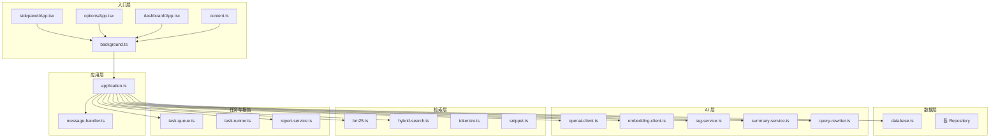
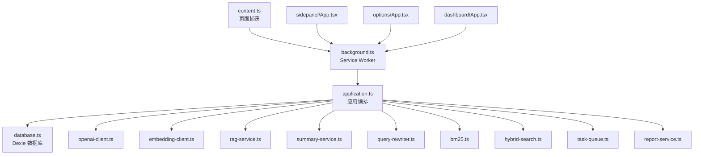
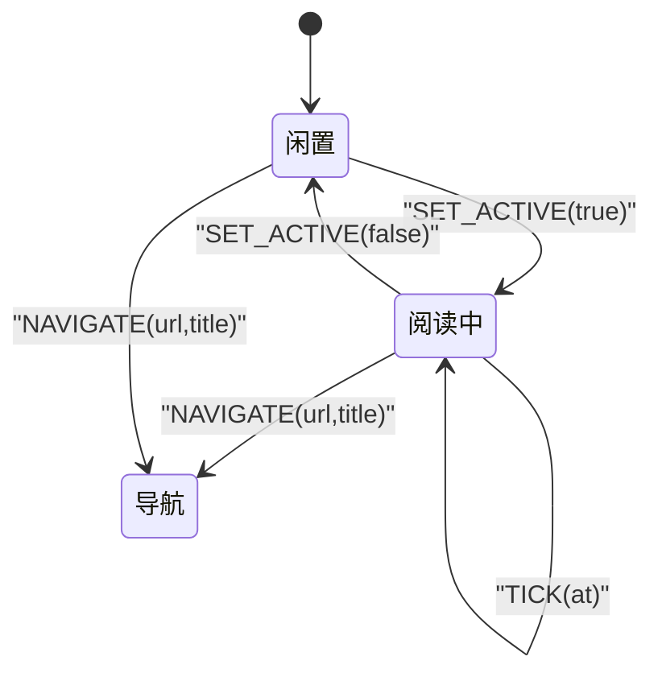
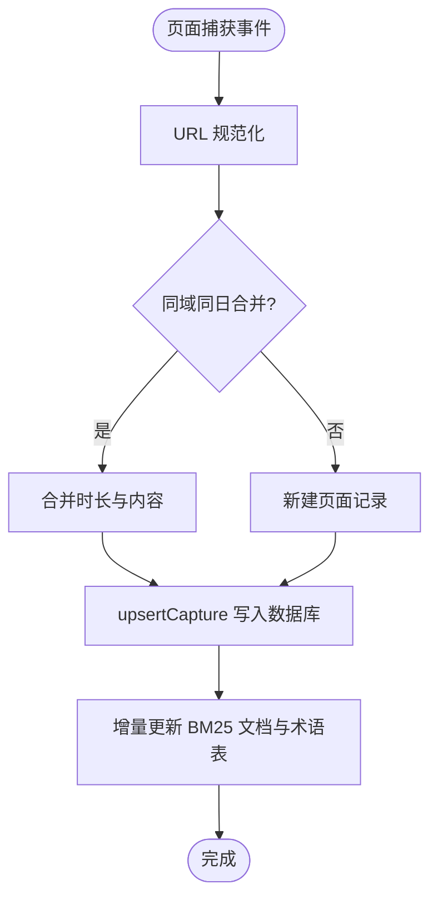
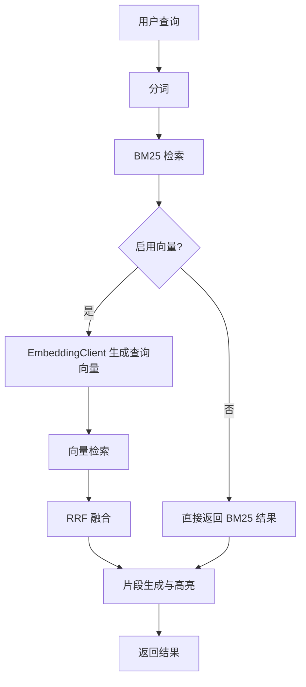
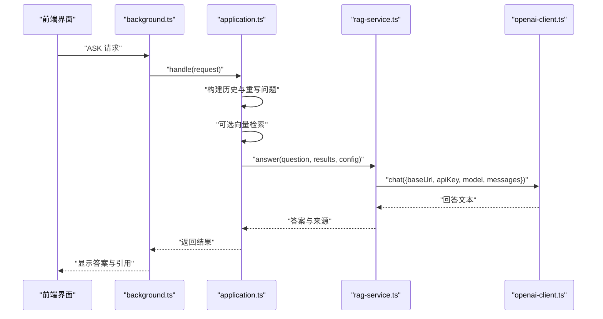
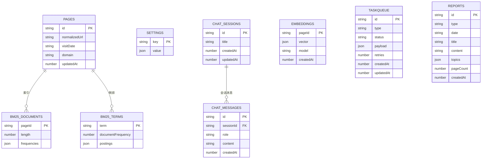
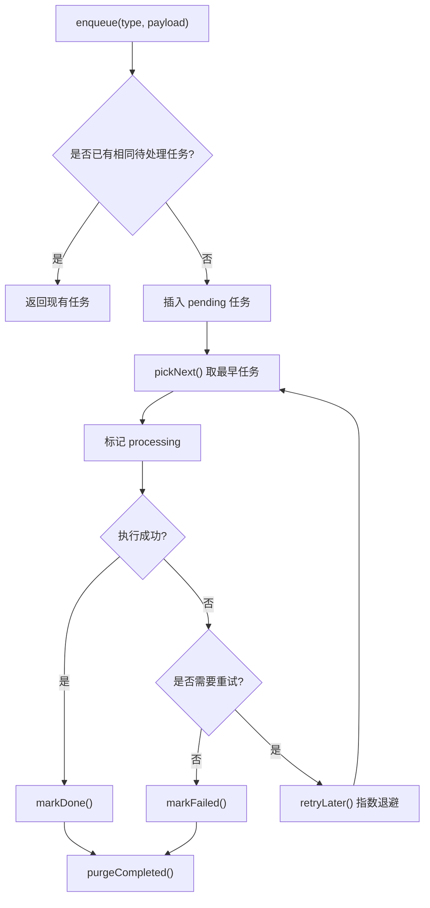
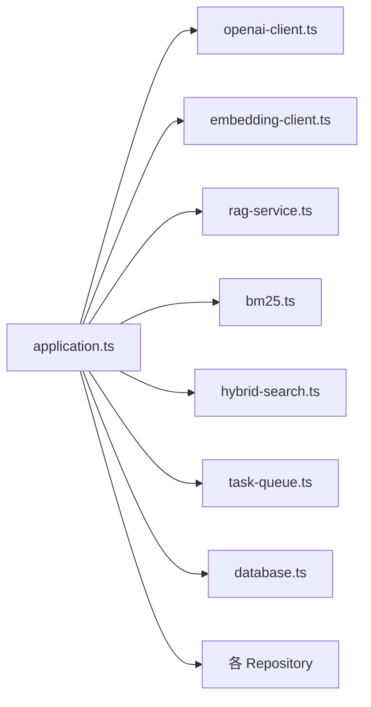

# 核心功能模块

<cite>
**本文档引用的文件**
- [README.md](file://README.md)
- [package.json](file://package.json)
- [src/background/application.ts](file://src/background/application.ts)
- [src/background/message-handler.ts](file://src/background/message-handler.ts)
- [src/capture/session-machine.ts](file://src/capture/session-machine.ts)
- [src/extraction/extract-page.ts](file://src/extraction/extract-page.ts)
- [src/search/bm25.ts](file://src/search/bm25.ts)
- [src/search/hybrid-search.ts](file://src/search/hybrid-search.ts)
- [src/search/snippet.ts](file://src/search/snippet.ts)
- [src/search/tokenize.ts](file://src/search/tokenize.ts)
- [src/ai/openai-client.ts](file://src/ai/openai-client.ts)
- [src/ai/embedding-client.ts](file://src/ai/embedding-client.ts)
- [src/ai/rag-service.ts](file://src/ai/rag-service.ts)
- [src/ai/summary-service.ts](file://src/ai/summary-service.ts)
- [src/ai/query-rewriter.ts](file://src/ai/query-rewriter.ts)
- [src/ai/context.ts](file://src/ai/context.ts)
- [src/ai/citations.ts](file://src/ai/citations.ts)
- [src/ai/ai-prompts.ts](file://src/ai/ai-prompts.ts)
- [src/storage/database.ts](file://src/storage/database.ts)
- [src/storage/page-repository.ts](file://src/storage/page-repository.ts)
- [src/storage/search-repository.ts](file://src/storage/search-repository.ts)
- [src/storage/chat-repository.ts](file://src/storage/chat-repository.ts)
- [src/storage/embedding-repository.ts](file://src/storage/embedding-repository.ts)
- [src/storage/report-repository.ts](file://src/storage/report-repository.ts)
- [src/storage/settings-repository.ts](file://src/storage/settings-repository.ts)
- [src/queue/task-queue.ts](file://src/queue/task-queue.ts)
- [src/queue/task-runner.ts](file://src/queue/task-runner.ts)
- [src/reports/report-service.ts](file://src/reports/report-service.ts)
- [src/security/secret-store.ts](file://src/security/secret-store.ts)
- [src/shared/types.ts](file://src/shared/types.ts)
- [src/shared/constants.ts](file://src/shared/constants.ts)
- [src/shared/messages.ts](file://src/shared/messages.ts)
- [src/shared/url-policy.ts](file://src/shared/url-policy.ts)
- [src/shared/local-date.ts](file://src/shared/local-date.ts)
- [entrypoints/background.ts](file://entrypoints/background.ts)
- [entrypoints/content.ts](file://entrypoints/content.ts)
- [entrypoints/dashboard/App.tsx](file://entrypoints/dashboard/App.tsx)
- [entrypoints/options/App.tsx](file://entrypoints/options/App.tsx)
- [entrypoints/sidepanel/App.tsx](file://entrypoints/sidepanel/App.tsx)
</cite>

## 目录
1. [简介](#简介)
2. [项目结构](#项目结构)
3. [核心组件](#核心组件)
4. [架构总览](#架构总览)
5. [详细组件分析](#详细组件分析)
6. [依赖关系分析](#依赖关系分析)
7. [性能考虑](#性能考虑)
8. [故障排查指南](#故障排查指南)
9. [结论](#结论)
10. [附录](#附录)

## 简介
BrowseMemory 是一个本地优先的 Chrome 扩展，专注于“本地记忆”。其核心能力包括：
- 页面捕获与会话管理：自动记录符合规则的网页正文与阅读时长，并通过会话状态机维护阅读状态。
- 搜索引擎系统：内置 BM25 离线全文检索；Phase 2 支持向量检索与 RRF 融合，提供更精准的混合检索。
- AI 服务层：OpenAI 兼容聊天、Embedding 向量生成、RAG 问答、查询改写、AI 摘要与报告生成。
- 数据存储层：基于 Dexie 的 IndexedDB 存储，涵盖页面、索引、设置、会话、嵌入向量、任务队列与报告。
- 任务队列系统：离线持久化任务队列，支持重试与指数退避，异步处理 Embedding 生成、摘要与报告。

本章节概述了项目目标、功能范围与整体架构定位，帮助读者快速建立全局认知。

## 项目结构
项目采用按功能域划分的目录组织方式，入口点分为 background、sidepanel、options、dashboard 与 content。核心业务逻辑分布在 src 下的 background、capture、search、ai、storage、queue、reports、security、shared、ui 等子目录。

图示来源
- [entrypoints/background.ts](file://entrypoints/background.ts)
- [src/background/application.ts](file://src/background/application.ts)
- [src/background/message-handler.ts](file://src/background/message-handler.ts)
- [src/storage/database.ts](file://src/storage/database.ts)
- [src/ai/openai-client.ts](file://src/ai/openai-client.ts)
- [src/ai/embedding-client.ts](file://src/ai/embedding-client.ts)
- [src/ai/rag-service.ts](file://src/ai/rag-service.ts)
- [src/search/bm25.ts](file://src/search/bm25.ts)
- [src/search/hybrid-search.ts](file://src/search/hybrid-search.ts)
- [src/queue/task-queue.ts](file://src/queue/task-queue.ts)
- [src/reports/report-service.ts](file://src/reports/report-service.ts)

章节来源
- [README.md:94-115](file://README.md#L94-L115)
- [package.json:1-49](file://package.json#L1-L49)

## 核心组件
本节聚焦于五大核心模块的设计理念、实现原理与使用方法，并给出调用序列与时序流程图，帮助读者理解模块间协作机制。

- 页面捕获与会话管理
  - 设计理念：通过会话状态机跟踪标签页的活跃状态与导航事件，结合正文提取与 URL 规范化，实现“同一日期同域合并”的去重与增量更新。
  - 实现要点：会话事件驱动状态演进；PageRepository 在事务中原子性更新页面与倒排索引；支持按日期分组与今日快照统计。
  - 使用方法：content.ts 发送页面捕获事件 → background 接收并调用 Application.handle → PageRepository.upsertCapture → 更新 BM25 文档与术语表。
  - 关键路径参考
    - [src/capture/session-machine.ts](file://src/capture/session-machine.ts)
    - [src/extraction/extract-page.ts](file://src/extraction/extract-page.ts)
    - [src/storage/page-repository.ts](file://src/storage/page-repository.ts)

- 搜索引擎系统
  - 设计理念：BM25 作为基础检索，Phase 2 引入向量相似度与 RRF 融合，实现“离线可用 + 可选增强”的双轨策略。
  - 实现要点：BM25 倒排索引与术语表增量维护；向量检索采用余弦相似度；RRF 将两类排序结果融合统一打分。
  - 使用方法：用户输入查询 → Application.handle 触发搜索 → BM25 与可选向量检索 → RRF 融合 → 返回高分结果。
  - 关键路径参考
    - [src/search/bm25.ts](file://src/search/bm25.ts)
    - [src/search/hybrid-search.ts](file://src/search/hybrid-search.ts)
    - [src/search/tokenize.ts](file://src/search/tokenize.ts)
    - [src/search/snippet.ts](file://src/search/snippet.ts)

- AI 服务层
  - 设计理念：统一的 OpenAI 兼容客户端，支持聊天、Embedding、RAG、摘要与报告；错误分类与降级策略保证用户体验。
  - 实现要点：OpenAICompatibleClient 统一错误码；EmbeddingClient 生成向量；RagService 构建上下文与引用；QueryRewriter 改写多轮问题；SummaryService 生成摘要；ReportService 生成日报/周报/月报。
  - 使用方法：ASK 请求 → Application.handle → 可选 Embedding → 混合检索 → RAG 问答 → 返回答案与来源。
  - 关键路径参考
    - [src/ai/openai-client.ts](file://src/ai/openai-client.ts)
    - [src/ai/embedding-client.ts](file://src/ai/embedding-client.ts)
    - [src/ai/rag-service.ts](file://src/ai/rag-service.ts)
    - [src/ai/summary-service.ts](file://src/ai/summary-service.ts)
    - [src/ai/query-rewriter.ts](file://src/ai/query-rewriter.ts)
    - [src/ai/context.ts](file://src/ai/context.ts)
    - [src/ai/citations.ts](file://src/ai/citations.ts)
    - [src/ai/ai-prompts.ts](file://src/ai/ai-prompts.ts)

- 数据存储层
  - 设计理念：Dexie 管理多张表，涵盖页面、索引、设置、会话、嵌入向量、任务队列与报告；版本迁移兼容历史数据。
  - 实现要点：BrowseMemoryDatabase 定义表结构与迁移；各 Repository 提供领域操作接口；事务保证一致性。
  - 使用方法：Repository 在构造时持有数据库实例；通过事务批量更新索引与数据。
  - 关键路径参考
    - [src/storage/database.ts](file://src/storage/database.ts)
    - [src/storage/page-repository.ts](file://src/storage/page-repository.ts)
    - [src/storage/search-repository.ts](file://src/storage/search-repository.ts)
    - [src/storage/chat-repository.ts](file://src/storage/chat-repository.ts)
    - [src/storage/embedding-repository.ts](file://src/storage/embedding-repository.ts)
    - [src/storage/report-repository.ts](file://src/storage/report-repository.ts)
    - [src/storage/settings-repository.ts](file://src/storage/settings-repository.ts)

- 任务队列系统
  - 设计理念：离线持久化任务队列，支持去重、重试与指数退避；后台定时器驱动任务执行。
  - 实现要点：TaskQueue 提供入队、取队、完成/失败标记与重试；TaskRunner 消费队列并执行具体任务。
  - 使用方法：页面入库后触发 embed/summarize 入队 → TaskRunner 拉取任务 → 执行并更新状态。
  - 关键路径参考
    - [src/queue/task-queue.ts](file://src/queue/task-queue.ts)
    - [src/queue/task-runner.ts](file://src/queue/task-runner.ts)

章节来源
- [README.md:5-27](file://README.md#L5-L27)
- [src/background/application.ts:29-63](file://src/background/application.ts#L29-L63)
- [src/storage/database.ts:34-79](file://src/storage/database.ts#L34-L79)

## 架构总览
下图展示了从浏览器入口到后台应用、再到各子系统的交互关系与数据流。

图示来源
- [entrypoints/background.ts](file://entrypoints/background.ts)
- [entrypoints/content.ts](file://entrypoints/content.ts)
- [entrypoints/sidepanel/App.tsx](file://entrypoints/sidepanel/App.tsx)
- [entrypoints/options/App.tsx](file://entrypoints/options/App.tsx)
- [entrypoints/dashboard/App.tsx](file://entrypoints/dashboard/App.tsx)
- [src/background/application.ts](file://src/background/application.ts)
- [src/storage/database.ts](file://src/storage/database.ts)
- [src/ai/openai-client.ts](file://src/ai/openai-client.ts)
- [src/ai/embedding-client.ts](file://src/ai/embedding-client.ts)
- [src/ai/rag-service.ts](file://src/ai/rag-service.ts)
- [src/search/bm25.ts](file://src/search/bm25.ts)
- [src/search/hybrid-search.ts](file://src/search/hybrid-search.ts)
- [src/queue/task-queue.ts](file://src/queue/task-queue.ts)
- [src/reports/report-service.ts](file://src/reports/report-service.ts)

## 详细组件分析

### 页面捕获与会话管理
- 会话状态机
  - 事件类型：TICK、SET_ACTIVE、NAVIGATE
  - 状态字段：tabId、url、title、durationSeconds、active、lastActiveAt
  - 状态演进：根据事件类型累加时长、切换活跃态或重置会话
- 页面入库与索引更新
  - URL 规范化与域名提取
  - 同域同日合并策略，计算 contentHash
  - 倒排索引增量更新：仅变更受影响的术语项
- 今日快照与按日检索
  - 计算页面数、阅读分钟数、深度阅读次数与热门域名

图示来源
- [src/capture/session-machine.ts](file://src/capture/session-machine.ts)

图示来源
- [src/storage/page-repository.ts](file://src/storage/page-repository.ts)

章节来源
- [src/capture/session-machine.ts:1-69](file://src/capture/session-machine.ts#L1-L69)
- [src/storage/page-repository.ts:43-103](file://src/storage/page-repository.ts#L43-L103)
- [src/storage/page-repository.ts:203-263](file://src/storage/page-repository.ts#L203-L263)

### 搜索引擎系统
- BM25 实现
  - 输入文档：pageId、title、content
  - 倒排索引：文档频率、词频映射、平均长度
  - 查询评分：IDF、词频与长度归一化
- 向量检索与 RRF 融合
  - 余弦相似度计算
  - RRF：对两类结果按秩求逆的倒数和进行融合
- 片段生成与高亮
  - 基于关键词与窗口截取生成片段

图示来源
- [src/search/bm25.ts](file://src/search/bm25.ts)
- [src/search/hybrid-search.ts](file://src/search/hybrid-search.ts)
- [src/ai/embedding-client.ts](file://src/ai/embedding-client.ts)

章节来源
- [src/search/bm25.ts:38-166](file://src/search/bm25.ts#L38-L166)
- [src/search/hybrid-search.ts:13-78](file://src/search/hybrid-search.ts#L13-L78)
- [src/ai/embedding-client.ts:23-87](file://src/ai/embedding-client.ts#L23-L87)

### AI 服务层
- OpenAI 兼容客户端
  - 统一错误码：认证、速率限制、超时、网络、提供商
  - SSE 解析与 JSON 响应兼容
- Embedding 客户端
  - 生成向量并进行错误分类
- RAG 服务
  - 构建上下文、拼装提示词、调用聊天接口、解析引用
- 查询改写与摘要
  - 多轮对话中将代词还原为具体实体
  - 自动生成页面摘要
- 报告服务
  - 日/周/月报告生成，Markdown 输出，主题提取

图示来源
- [src/background/application.ts](file://src/background/application.ts)
- [src/ai/rag-service.ts](file://src/ai/rag-service.ts)
- [src/ai/openai-client.ts](file://src/ai/openai-client.ts)

章节来源
- [src/ai/openai-client.ts:56-125](file://src/ai/openai-client.ts#L56-L125)
- [src/ai/embedding-client.ts:16-87](file://src/ai/embedding-client.ts#L16-L87)
- [src/ai/rag-service.ts:15-66](file://src/ai/rag-service.ts#L15-L66)
- [src/ai/query-rewriter.ts](file://src/ai/query-rewriter.ts)
- [src/ai/summary-service.ts](file://src/ai/summary-service.ts)
- [src/reports/report-service.ts:157-363](file://src/reports/report-service.ts#L157-L363)

### 数据存储层
- 数据库设计
  - 表：pages、bm25Documents、bm25Terms、settings、cryptoKeys、chatSessions、chatMessages、embeddings、taskQueue、reports
  - 版本迁移：逐步添加新表与索引
- Repository 职责
  - PageRepository：upsert、按日查询、今日快照、过期清理、索引增量更新
  - SearchRepository：最近记录、全文检索
  - SettingsRepository：应用设置读写与加密密钥管理
  - Chat/Embedding/ReportRepository：会话、嵌入、报告的增删查改
- 事务与一致性
  - 关键操作在事务中执行，保证索引与数据一致性

图示来源
- [src/storage/database.ts](file://src/storage/database.ts)
- [src/storage/page-repository.ts](file://src/storage/page-repository.ts)
- [src/storage/search-repository.ts](file://src/storage/search-repository.ts)
- [src/storage/chat-repository.ts](file://src/storage/chat-repository.ts)
- [src/storage/embedding-repository.ts](file://src/storage/embedding-repository.ts)
- [src/storage/report-repository.ts](file://src/storage/report-repository.ts)
- [src/storage/settings-repository.ts](file://src/storage/settings-repository.ts)

章节来源
- [src/storage/database.ts:34-79](file://src/storage/database.ts#L34-L79)
- [src/storage/page-repository.ts:43-265](file://src/storage/page-repository.ts#L43-L265)

### 任务队列系统
- 任务模型
  - 类型：embed、summarize、report_daily、report_weekly、report_monthly
  - 状态：pending、processing、done、failed
  - 重试：最多 3 次，指数退避时间间隔
- 入队与去重
  - 同类型且相同负载的任务不会重复入队
- 清理策略
  - 完成任务保留 7 天后清理

图示来源
- [src/queue/task-queue.ts](file://src/queue/task-queue.ts)
- [src/shared/types.ts:108-124](file://src/shared/types.ts#L108-L124)
- [src/shared/constants.ts:31-33](file://src/shared/constants.ts#L31-L33)

章节来源
- [src/queue/task-queue.ts:12-126](file://src/queue/task-queue.ts#L12-L126)
- [src/shared/types.ts:108-124](file://src/shared/types.ts#L108-L124)
- [src/shared/constants.ts:31-33](file://src/shared/constants.ts#L31-L33)

## 依赖关系分析
- 组件耦合
  - application.ts 作为编排中心，依赖所有子系统；消息处理器负责错误包装。
  - 搜索与 AI 依赖存储层；任务队列独立但被应用层触发。
- 外部依赖
  - Dexie：IndexedDB ORM
  - React/Tailwind：UI 框架与样式
  - @mozilla/readability：正文提取
- 循环依赖
  - 无明显循环导入；模块职责清晰，接口边界明确。

图示来源
- [src/background/application.ts](file://src/background/application.ts)
- [src/ai/openai-client.ts](file://src/ai/openai-client.ts)
- [src/ai/embedding-client.ts](file://src/ai/embedding-client.ts)
- [src/ai/rag-service.ts](file://src/ai/rag-service.ts)
- [src/search/bm25.ts](file://src/search/bm25.ts)
- [src/search/hybrid-search.ts](file://src/search/hybrid-search.ts)
- [src/queue/task-queue.ts](file://src/queue/task-queue.ts)
- [src/storage/database.ts](file://src/storage/database.ts)

章节来源
- [src/background/application.ts:29-63](file://src/background/application.ts#L29-L63)
- [src/background/message-handler.ts:6-22](file://src/background/message-handler.ts#L6-L22)

## 性能考虑
- 检索性能
  - BM25 倒排索引与术语表增量更新，避免重建全量索引。
  - 向量检索规模控制在 10K 以内，采用暴力匹配；大规模场景需分片或外部向量库。
- 网络与超时
  - 所有远程调用设置 30 秒超时；错误分类便于快速降级。
- 任务队列
  - 最大重试与指数退避降低抖动；完成任务定期清理释放空间。
- 存储与事务
  - Dexie 事务内批量更新索引，减少 IO 次数；定期清理过期数据。
- UI 与交互
  - 侧边栏与设置页采用轻量组件，避免不必要的重渲染。

## 故障排查指南
- 常见错误与处理
  - 缺少 API Key：测试连接接口返回缺失密钥错误码，引导用户在设置页填写。
  - 认证失败/速率限制/提供商错误：统一由 OpenAIRequestError 捕获并返回对应错误码。
  - 网络超时：检查网络连通性与代理设置。
- 诊断步骤
  - 在设置页测试连接，确认聊天与 Embedding 服务均可访问。
  - 查看任务队列状态，确认 pending/failed 数量与重试次数。
  - 检查存储用量与过期清理是否正常。
- 相关实现参考
  - 错误包装与返回：[src/background/message-handler.ts:6-22](file://src/background/message-handler.ts#L6-L22)
  - OpenAI 错误分类：[src/ai/openai-client.ts:22-30](file://src/ai/openai-client.ts#L22-L30)
  - 连接测试：[src/background/application.ts:130-177](file://src/background/application.ts#L130-L177)

章节来源
- [src/background/message-handler.ts:6-22](file://src/background/message-handler.ts#L6-L22)
- [src/ai/openai-client.ts:22-125](file://src/ai/openai-client.ts#L22-L125)
- [src/background/application.ts:130-177](file://src/background/application.ts#L130-L177)

## 结论
BrowseMemory 通过“本地优先 + 云端增强”的双轨设计，实现了从页面捕获、全文检索、智能问答到报告生成的完整闭环。其模块化架构清晰、职责分离明确，既满足初学者快速上手，也为高级开发者提供了丰富的扩展点与定制化空间。建议在生产环境中结合业务规模评估向量检索规模，并完善监控与告警体系。

## 附录
- 配置与部署
  - 开发与构建脚本、测试与类型检查命令参见 [package.json:6-12](file://package.json#L6-L12)。
  - 安装与打包流程参见 [README.md:48-56](file://README.md#L48-L56)。
- 默认设置与常量
  - 默认黑名单、保留天数、报警名称与任务重试策略参见 [src/shared/constants.ts:3-33](file://src/shared/constants.ts#L3-L33)。
- 类型与消息协议
  - 应用设置、页面记录、RAG 答案、任务类型等定义参见 [src/shared/types.ts:6-139](file://src/shared/types.ts#L6-L139)。
  - 消息协议定义参见 [src/shared/messages.ts](file://src/shared/messages.ts)。