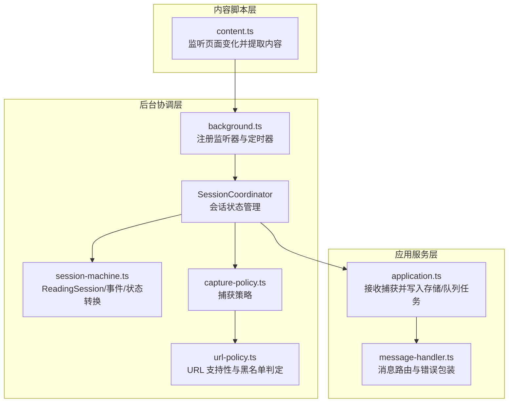
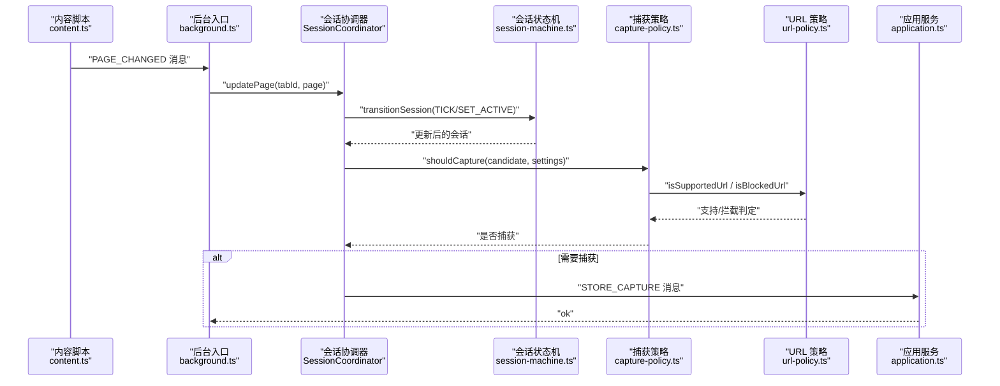
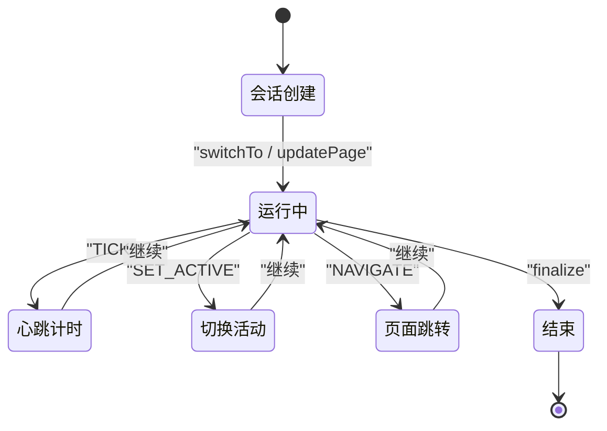
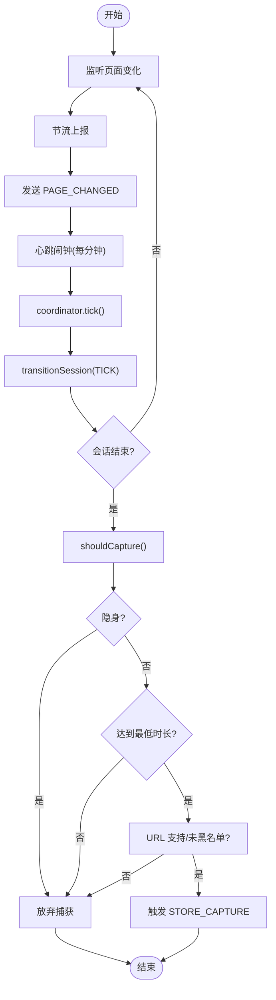
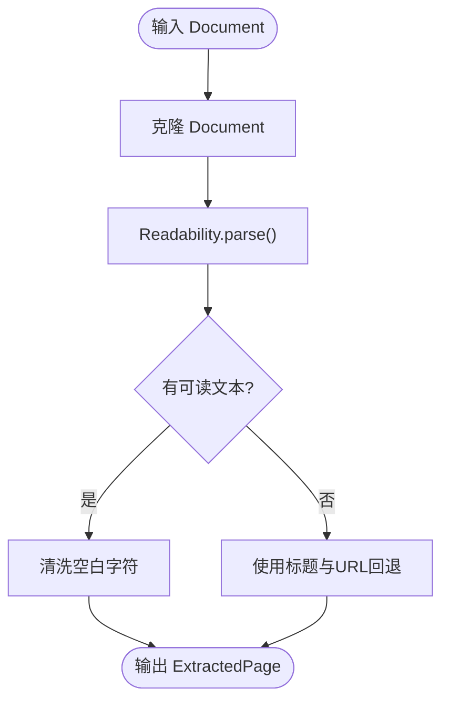
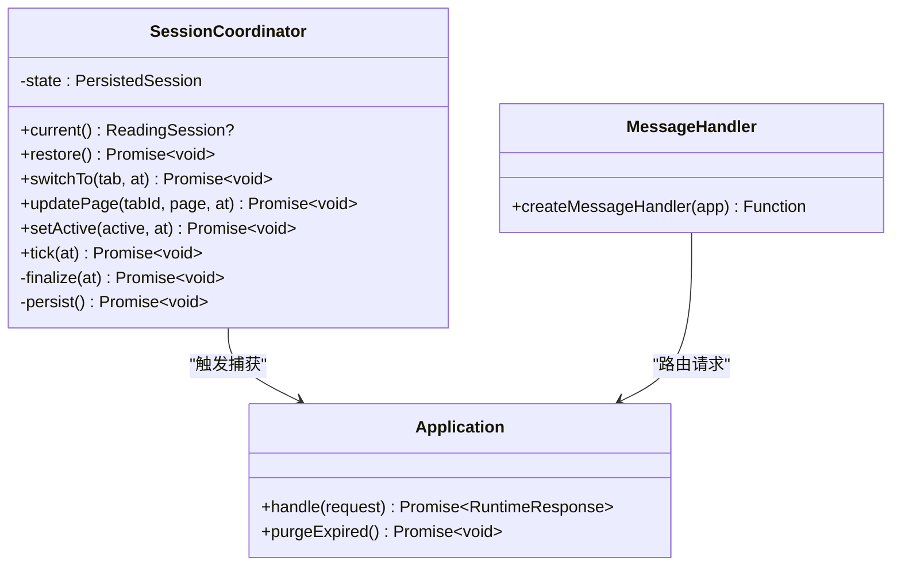
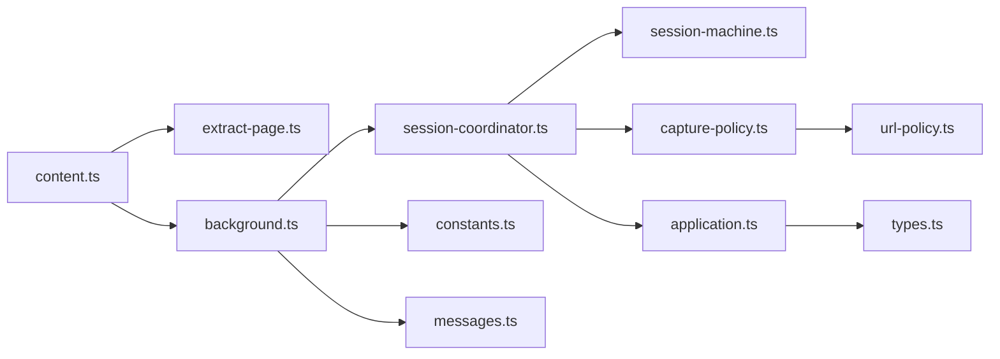

# 页面捕获与会话管理

<cite>
**本文引用的文件**
- [src/capture/session-machine.ts](file://src/capture/session-machine.ts)
- [src/capture/capture-policy.ts](file://src/capture/capture-policy.ts)
- [src/extraction/extract-page.ts](file://src/extraction/extract-page.ts)
- [src/background/session-coordinator.ts](file://src/background/session-coordinator.ts)
- [src/background/application.ts](file://src/background/application.ts)
- [src/background/message-handler.ts](file://src/background/message-handler.ts)
- [entrypoints/content.ts](file://entrypoints/content.ts)
- [entrypoints/background.ts](file://entrypoints/background.ts)
- [src/shared/types.ts](file://src/shared/types.ts)
- [src/shared/url-policy.ts](file://src/shared/url-policy.ts)
- [src/shared/constants.ts](file://src/shared/constants.ts)
- [src/shared/messages.ts](file://src/shared/messages.ts)
- [tests/capture/session-machine.test.ts](file://tests/capture/session-machine.test.ts)
- [tests/capture/capture-policy.test.ts](file://tests/capture/capture-policy.test.ts)
- [tests/extraction/extract-page.test.ts](file://tests/extraction/extract-page.test.ts)
</cite>

## 目录
1. [简介](#简介)
2. [项目结构](#项目结构)
3. [核心组件](#核心组件)
4. [架构总览](#架构总览)
5. [详细组件分析](#详细组件分析)
6. [依赖关系分析](#依赖关系分析)
7. [性能考虑](#性能考虑)
8. [故障排除指南](#故障排除指南)
9. [结论](#结论)
10. [附录](#附录)

## 简介
本技术文档围绕“页面捕获与会话管理”子系统，系统性阐述阅读会话状态机设计与实现、页面内容提取算法、捕获策略配置以及在浏览器扩展中的集成模式。重点覆盖以下方面：
- ReadingSession 接口定义与 SessionEvent 事件类型
- transitionSession 状态转换逻辑与会话生命周期管理
- 活动状态跟踪与持续时间计算机制
- 页面内容提取：DOM 解析、文本清洗与结构化数据输出
- 捕获策略：URL 匹配规则、内容过滤条件与自动化触发机制
- 使用示例与集成模式（浏览器扩展）
- 性能优化建议与错误处理策略

## 项目结构
该子系统由三类模块协同工作：
- 内容脚本层：负责监听页面变更并提取页面内容
- 后台协调层：维护会话状态、驱动状态机、执行捕获策略与持久化
- 应用服务层：接收捕获结果并进行后续处理（如嵌入向量化、摘要生成、报告生成）

图表来源
- [entrypoints/content.ts:1-44](file://entrypoints/content.ts#L1-L44)
- [entrypoints/background.ts:1-241](file://entrypoints/background.ts#L1-L241)
- [src/background/session-coordinator.ts:1-157](file://src/background/session-coordinator.ts#L1-L157)
- [src/capture/session-machine.ts:1-69](file://src/capture/session-machine.ts#L1-L69)
- [src/capture/capture-policy.ts:1-21](file://src/capture/capture-policy.ts#L1-L21)
- [src/shared/url-policy.ts:1-63](file://src/shared/url-policy.ts#L1-L63)
- [src/background/application.ts:1-388](file://src/background/application.ts#L1-L388)
- [src/background/message-handler.ts:1-22](file://src/background/message-handler.ts#L1-L22)

章节来源
- [entrypoints/content.ts:1-44](file://entrypoints/content.ts#L1-L44)
- [entrypoints/background.ts:1-241](file://entrypoints/background.ts#L1-L241)
- [src/background/session-coordinator.ts:1-157](file://src/background/session-coordinator.ts#L1-L157)
- [src/capture/session-machine.ts:1-69](file://src/capture/session-machine.ts#L1-L69)
- [src/capture/capture-policy.ts:1-21](file://src/capture/capture-policy.ts#L1-L21)
- [src/shared/url-policy.ts:1-63](file://src/shared/url-policy.ts#L1-L63)
- [src/background/application.ts:1-388](file://src/background/application.ts#L1-L388)
- [src/background/message-handler.ts:1-22](file://src/background/message-handler.ts#L1-L22)

## 核心组件
- ReadingSession：描述当前标签页的阅读会话，包含标识、URL、标题、累计时长、活动状态与最近活跃时间戳
- SessionEvent：会话事件集合，支持 TICK（心跳计时）、SET_ACTIVE（活动状态切换）、NAVIGATE（页面跳转）
- transitionSession：根据事件对会话进行状态转换，实现“活跃时累计时长、隐藏时不累计”的行为
- SessionCoordinator：后台协调器，负责恢复/切换/更新会话、设置活动状态、周期性心跳、最终化并触发捕获
- 捕获策略 shouldCapture：综合判断是否对该会话进行页面捕获（非隐身、达到最低阅读时长、URL 支持且未被黑名单拦截）
- 页面提取 extractPage：基于 Readability 的 DOM 解析与文本清洗，返回结构化页面信息

章节来源
- [src/capture/session-machine.ts:1-69](file://src/capture/session-machine.ts#L1-L69)
- [src/background/session-coordinator.ts:1-157](file://src/background/session-coordinator.ts#L1-L157)
- [src/capture/capture-policy.ts:1-21](file://src/capture/capture-policy.ts#L1-L21)
- [src/extraction/extract-page.ts:1-26](file://src/extraction/extract-page.ts#L1-L26)

## 架构总览
下图展示了从内容脚本到后台协调再到应用服务的整体流程，以及会话状态机在其中的关键作用。

图表来源
- [entrypoints/content.ts:1-44](file://entrypoints/content.ts#L1-L44)
- [entrypoints/background.ts:1-241](file://entrypoints/background.ts#L1-L241)
- [src/background/session-coordinator.ts:1-157](file://src/background/session-coordinator.ts#L1-L157)
- [src/capture/session-machine.ts:1-69](file://src/capture/session-machine.ts#L1-L69)
- [src/capture/capture-policy.ts:1-21](file://src/capture/capture-policy.ts#L1-L21)
- [src/shared/url-policy.ts:1-63](file://src/shared/url-policy.ts#L1-L63)
- [src/background/application.ts:1-388](file://src/background/application.ts#L1-L388)

## 详细组件分析

### 阅读会话状态机与生命周期
- ReadingSession 字段语义
  - tabId：标签页标识
  - url/title：当前页面地址与标题
  - durationSeconds：累计阅读秒数（仅在 active=true 期间累加）
  - active：是否处于前台活跃状态
  - lastActiveAt：上次活跃的时间戳（毫秒）
- SessionEvent 类型
  - TICK：周期性心跳，用于累计时长
  - SET_ACTIVE：切换 active 状态，并更新 lastActiveAt
  - NAVIGATE：页面跳转，重置 durationSeconds 并保留 active 状态
- transitionSession 行为要点
  - TICK：若会话处于活跃且时间单调递增，则累加时长；否则忽略
  - SET_ACTIVE：先对旧时间点进行一次 accrue，再更新 active 与 lastActiveAt
  - NAVIGATE：保留 tabId、active、lastActiveAt，重置 durationSeconds，更新 url/title
- 生命周期管理
  - 创建：switchTo 时基于当前标签页创建新会话
  - 更新：updatePage 在页面 URL 变更或标题变更时更新会话与页面快照
  - 终止：finalize 在会话结束时执行最后一次 TICK，评估捕获策略并触发捕获

图表来源
- [src/capture/session-machine.ts:1-69](file://src/capture/session-machine.ts#L1-L69)
- [src/background/session-coordinator.ts:1-157](file://src/background/session-coordinator.ts#L1-L157)

章节来源
- [src/capture/session-machine.ts:1-69](file://src/capture/session-machine.ts#L1-L69)
- [src/background/session-coordinator.ts:1-157](file://src/background/session-coordinator.ts#L1-L157)
- [tests/capture/session-machine.test.ts:1-65](file://tests/capture/session-machine.test.ts#L1-L65)

### 捕获策略与自动化触发
- 捕获条件
  - 非隐身（incognito=false）
  - 达到最低阅读时长（minimumReadSeconds）
  - URL 协议支持（http/https）
  - 未命中黑名单域名模式
- 触发机制
  - 内容脚本：监听历史记录变化、标题变化与 DOM 变更，节流后发送 PAGE_CHANGED
  - 后台：注册心跳闹钟（每分钟），在每次心跳时调用 coordinator.tick，推进会话时长
  - 页面关闭/标签切换：通过 tabs/onRemoved/onActivated 触发 switchTo 或 setActive(false)
  - 报告与嵌入：按日/周/月闹钟触发生成任务，必要时批量运行任务队列

图表来源
- [entrypoints/content.ts:1-44](file://entrypoints/content.ts#L1-L44)
- [entrypoints/background.ts:1-241](file://entrypoints/background.ts#L1-L241)
- [src/background/session-coordinator.ts:1-157](file://src/background/session-coordinator.ts#L1-L157)
- [src/capture/capture-policy.ts:1-21](file://src/capture/capture-policy.ts#L1-L21)
- [src/shared/url-policy.ts:1-63](file://src/shared/url-policy.ts#L1-L63)

章节来源
- [src/capture/capture-policy.ts:1-21](file://src/capture/capture-policy.ts#L1-L21)
- [src/shared/url-policy.ts:1-63](file://src/shared/url-policy.ts#L1-L63)
- [entrypoints/background.ts:1-241](file://entrypoints/background.ts#L1-L241)
- [tests/capture/capture-policy.test.ts:1-49](file://tests/capture/capture-policy.test.ts#L1-L49)

### 页面内容提取算法
- 输入：浏览器 Document 对象（可选传入 URL）
- 处理步骤
  - 克隆 Document，使用 Readability 解析出可读内容
  - 清洗：将多空白字符合并为单个空格并去除首尾空白
  - 回退：若解析失败，使用标题与 URL 作为回退
- 输出：ExtractedPage（url/title/content）

图表来源
- [src/extraction/extract-page.ts:1-26](file://src/extraction/extract-page.ts#L1-L26)

章节来源
- [src/extraction/extract-page.ts:1-26](file://src/extraction/extract-page.ts#L1-L26)
- [tests/extraction/extract-page.test.ts:1-32](file://tests/extraction/extract-page.test.ts#L1-L32)

### 会话协调器与消息处理
- SessionCoordinator 职责
  - 恢复：从会话存储中读取并重建状态
  - 切换：激活新标签页，创建会话并初始化页面快照
  - 更新：页面 URL/标题变更时更新会话与快照
  - 活动：窗口焦点变化或显隐切换时更新 active 状态
  - 周期：心跳推进时长
  - 终止：最终化时评估捕获策略并写入应用服务
- 消息处理
  - background.ts 注册 runtime.onMessage 监听
  - 对 PAGE_CHANGED 调用 coordinator.updatePage
  - 对其他请求交由 application.handle 处理
  - message-handler.ts 将 OpenAI 请求错误映射为统一响应格式

图表来源
- [src/background/session-coordinator.ts:1-157](file://src/background/session-coordinator.ts#L1-L157)
- [src/background/application.ts:1-388](file://src/background/application.ts#L1-L388)
- [src/background/message-handler.ts:1-22](file://src/background/message-handler.ts#L1-L22)

章节来源
- [src/background/session-coordinator.ts:1-157](file://src/background/session-coordinator.ts#L1-L157)
- [src/background/application.ts:1-388](file://src/background/application.ts#L1-L388)
- [src/background/message-handler.ts:1-22](file://src/background/message-handler.ts#L1-L22)
- [entrypoints/background.ts:1-241](file://entrypoints/background.ts#L1-L241)

## 依赖关系分析
- 内容脚本依赖页面提取模块，通过节流与事件监听将页面快照传递给后台
- 后台协调器依赖会话状态机、捕获策略与 URL 策略，负责状态持久化与自动化触发
- 应用服务层接收捕获结果，写入数据库并可选地入队后续任务（嵌入、摘要、报告）
- 常量与消息契约定义了默认配置、闹钟名称与跨进程通信协议

图表来源
- [entrypoints/content.ts:1-44](file://entrypoints/content.ts#L1-L44)
- [entrypoints/background.ts:1-241](file://entrypoints/background.ts#L1-L241)
- [src/background/session-coordinator.ts:1-157](file://src/background/session-coordinator.ts#L1-L157)
- [src/capture/session-machine.ts:1-69](file://src/capture/session-machine.ts#L1-L69)
- [src/capture/capture-policy.ts:1-21](file://src/capture/capture-policy.ts#L1-L21)
- [src/shared/url-policy.ts:1-63](file://src/shared/url-policy.ts#L1-L63)
- [src/background/application.ts:1-388](file://src/background/application.ts#L1-L388)
- [src/shared/types.ts:1-139](file://src/shared/types.ts#L1-L139)
- [src/shared/constants.ts:1-33](file://src/shared/constants.ts#L1-L33)
- [src/shared/messages.ts:1-71](file://src/shared/messages.ts#L1-L71)

章节来源
- [src/shared/types.ts:1-139](file://src/shared/types.ts#L1-L139)
- [src/shared/constants.ts:1-33](file://src/shared/constants.ts#L1-L33)
- [src/shared/messages.ts:1-71](file://src/shared/messages.ts#L1-L71)

## 性能考虑
- 内容脚本节流
  - 使用定时器对频繁的页面变化进行去抖，减少消息发送频率
  - 建议：在高动态页面上适当增大节流间隔以平衡实时性与性能
- 会话心跳
  - 默认每分钟一次心跳，可在扩展设置中调整周期
  - 建议：在后台不可见或窗口最小化时降低心跳频率
- DOM 解析与文本清洗
  - Readability 解析成本较高，建议仅在页面稳定后再触发
  - 文本清洗为线性复杂度，通常可接受
- 存储与网络
  - 捕获写入采用异步存储，避免阻塞主线程
  - 嵌入与摘要等任务建议放入队列异步处理，避免阻塞主流程

## 故障排除指南
- 页面未被捕获
  - 检查隐身模式：隐身页面不会被捕获
  - 检查最低阅读时长：durationSeconds 必须不小于 minimumReadSeconds
  - 检查 URL 支持与黑名单：确保协议为 http/https，且域名未被黑名单拦截
  - 检查内容提取：若 Readability 解析失败，将回退为空内容
- 消息处理异常
  - OpenAI 请求错误会被 message-handler 统一包装为 { ok: false, code, message }
  - 建议：在 UI 中显示具体错误码以便定位问题
- 数据未持久化
  - 确认会话存储键名一致（SESSION_STORAGE_KEY）
  - 确认 storage.session 的读写权限正常

章节来源
- [src/capture/capture-policy.ts:1-21](file://src/capture/capture-policy.ts#L1-L21)
- [src/shared/url-policy.ts:1-63](file://src/shared/url-policy.ts#L1-L63)
- [src/extraction/extract-page.ts:1-26](file://src/extraction/extract-page.ts#L1-L26)
- [src/background/message-handler.ts:1-22](file://src/background/message-handler.ts#L1-L22)
- [src/shared/constants.ts:1-33](file://src/shared/constants.ts#L1-L33)

## 结论
本子系统通过“内容脚本采集 + 后台协调 + 应用服务处理”的分层架构，实现了高效、可靠的页面捕获与会话管理。会话状态机以简洁的状态转换逻辑支撑了准确的活动追踪与时长统计；捕获策略结合 URL 支持性与黑名单规则，确保只对目标页面进行处理；页面提取算法在保证鲁棒性的同时兼顾性能。配合自动化闹钟与任务队列，系统能够在后台静默运行并持续产出高质量的阅读记忆。

## 附录

### 使用示例与集成模式
- 在浏览器扩展中启用内容脚本
  - matches 规则已包含 http/https 所有路径
  - 页面变化将自动节流上报，无需手动调用
- 后台初始化与监听
  - 注册 tabs/onActivated、onRemoved、windows/onFocusChanged 监听
  - 注册心跳、清理、嵌入与报告相关闹钟
  - 监听 runtime.onMessage，处理 PAGE_CHANGED 与应用服务请求
- 自定义捕获策略
  - 调整 minimumReadSeconds 以适应不同场景
  - 配置 blacklistPatterns 以屏蔽敏感或低价值站点
- 集成页面提取
  - 在需要时调用 extractPage 获取结构化内容
  - 注意异常回退：当解析失败时返回空内容

章节来源
- [entrypoints/content.ts:1-44](file://entrypoints/content.ts#L1-L44)
- [entrypoints/background.ts:1-241](file://entrypoints/background.ts#L1-L241)
- [src/shared/constants.ts:1-33](file://src/shared/constants.ts#L1-L33)
- [src/shared/messages.ts:1-71](file://src/shared/messages.ts#L1-L71)