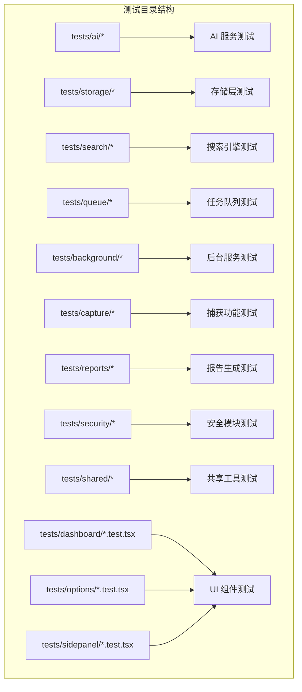
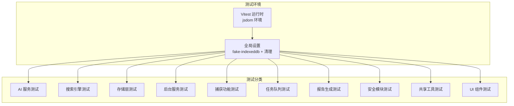
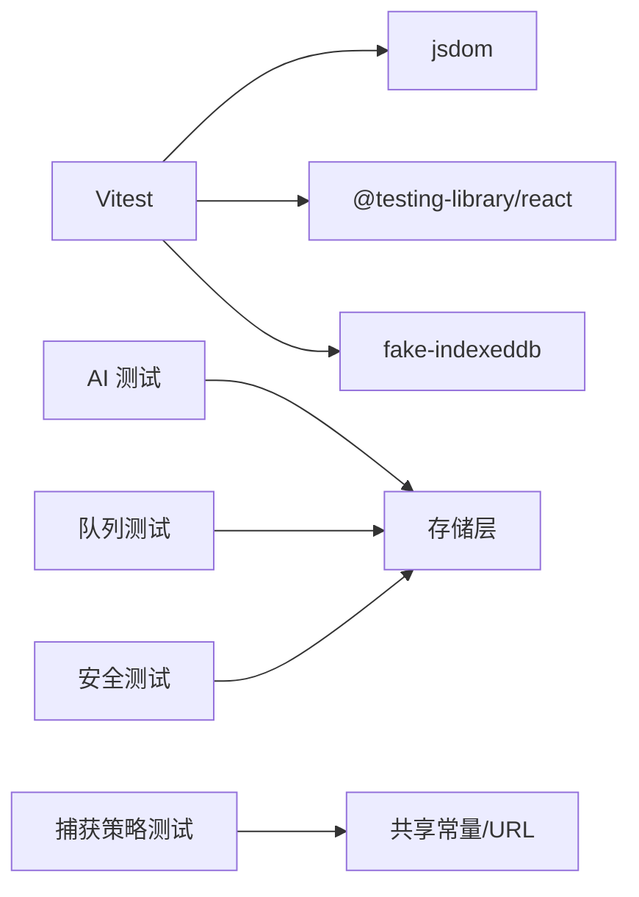
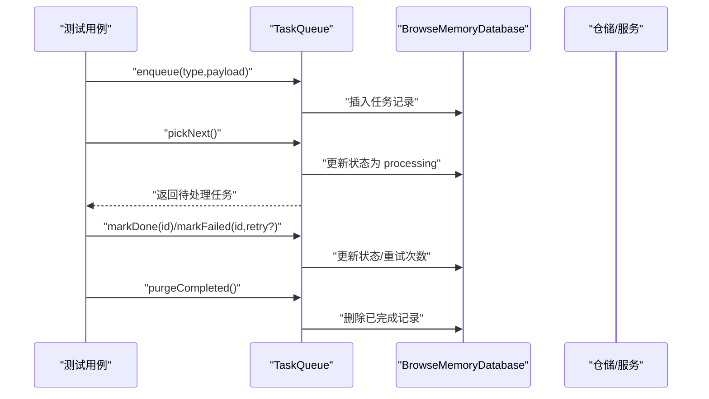

# 测试分类策略

<cite>
**本文引用的文件**
- [vitest.config.ts](file://vitest.config.ts)
- [tests/setup.ts](file://tests/setup.ts)
- [package.json](file://package.json)
- [src/shared/types.ts](file://src/shared/types.ts)
- [src/shared/constants.ts](file://src/shared/constants.ts)
- [tests/ai/citations.test.ts](file://tests/ai/citations.test.ts)
- [tests/storage/chat-repository.test.ts](file://tests/storage/chat-repository.test.ts)
- [tests/security/secret-store.test.ts](file://tests/security/secret-store.test.ts)
- [tests/capture/capture-policy.test.ts](file://tests/capture/capture-policy.test.ts)
- [tests/queue/task-queue.test.ts](file://tests/queue/task-queue.test.ts)
- [tests/shared/url-policy.test.ts](file://tests/shared/url-policy.test.ts)
</cite>

## 目录
1. [引言](#引言)
2. [项目结构](#项目结构)
3. [核心组件](#核心组件)
4. [架构总览](#架构总览)
5. [详细组件分析](#详细组件分析)
6. [依赖分析](#依赖分析)
7. [性能考虑](#性能考虑)
8. [故障排查指南](#故障排查指南)
9. [结论](#结论)
10. [附录](#附录)

## 引言
本文件系统化梳理 BrowseMemory 的测试分类策略与最佳实践，覆盖 AI 服务、搜索引擎、存储层、后台服务、捕获功能、任务队列、报告生成、安全模块、共享工具与 UI 组件等测试类别。文档解释各类测试的重点与验证目标，给出测试命名规范与组织结构建议，提供新增测试用例的指导原则以及跨模块测试的设计思路，确保测试分类能全面覆盖核心功能模块，支撑持续集成与质量保障。

## 项目结构
测试目录按功能域划分，采用“按模块分层”的组织方式，便于定位与扩展：
- tests/ai：AI 服务相关（提示词、检索增强、摘要、嵌入、重写器等）
- tests/storage：数据持久化与仓储（聊天、页面、嵌入、搜索、设置、报告）
- tests/search：全文检索与片段化处理
- tests/queue：任务队列与执行器
- tests/background：后台应用与消息处理
- tests/capture：页面捕获策略与状态机
- tests/reports：报告服务
- tests/security：密钥与加密存储
- tests/shared：共享工具（URL 策略、本地日期、常量、消息契约）
- tests/ui：各入口 UI 组件（dashboard/options/sidepanel）

**章节来源**
- [vitest.config.ts:1-15](file://vitest.config.ts#L1-L15)
- [tests/setup.ts:1-9](file://tests/setup.ts#L1-L9)

## 核心组件
- 测试运行时配置：Vitest 使用 jsdom 环境，启用别名 @ 指向 src，统一在 tests/setup.ts 中进行全局清理与 IndexedDB 模拟。
- 类型与常量：共享类型与默认配置定义了任务类型、报告类型、报警键、重试策略等，是多类测试（队列、后台、存储）的重要契约。

**章节来源**
- [vitest.config.ts:1-15](file://vitest.config.ts#L1-L15)
- [tests/setup.ts:1-9](file://tests/setup.ts#L1-L9)
- [src/shared/types.ts:107-139](file://src/shared/types.ts#L107-L139)
- [src/shared/constants.ts:26-33](file://src/shared/constants.ts#L26-L33)

## 架构总览
测试架构围绕“按模块分层 + 轻量集成”设计：
- 单元测试：聚焦函数/类的边界行为与错误路径
- 集成测试：跨模块协作（如队列与存储、后台与消息、UI 与仓库）
- 端到端式测试：通过真实 DOM 环境（jsdom）验证 UI 行为与交互

**图表来源**
- [vitest.config.ts:1-15](file://vitest.config.ts#L1-L15)
- [tests/setup.ts:1-9](file://tests/setup.ts#L1-L9)

## 详细组件分析

### AI 服务测试
- 测试重点
  - 提示词解析与引用解析：校验引用映射、忽略越界引用、无引用场景
  - 检索增强（RAG）：输入输出结构、离线/缺密钥标记
  - 嵌入客户端与模型选择：请求构造、响应解析
  - 查询重写：上下文感知的查询优化
  - 摘要服务：内容长度截断、摘要一致性
- 验证目标
  - 正确性：引用解析、RAG 输出字段、嵌入向量维度
  - 容错性：越界引用、空引用、网络异常
  - 性能：批量处理、缓存命中
- 典型用例参考
  - [citations 解析测试:1-36](file://tests/ai/citations.test.ts#L1-L36)

**章节来源**
- [tests/ai/citations.test.ts:1-36](file://tests/ai/citations.test.ts#L1-L36)

### 搜索引擎测试
- 测试重点
  - BM25 排序：关键词权重、文档匹配度
  - 分词与规范化：大小写、标点、停用词
  - 片段提取：高亮范围、上下文截取
  - 混合检索：BM25 与向量混合策略
- 验证目标
  - 结果稳定性：排序一致性、重复查询一致
  - 边界条件：空查询、特殊字符、长文本
- 组织结构
  - tests/search 下按功能拆分文件，便于独立演进

**章节来源**
- [tests/search/bm25.test.ts](file://tests/search/bm25.test.ts)
- [tests/search/tokenize.test.ts](file://tests/search/tokenize.test.ts)
- [tests/search/snippet.test.ts](file://tests/search/snippet.test.ts)
- [tests/search/hybrid-search.test.ts](file://tests/search/hybrid-search.test.ts)

### 存储层测试
- 测试重点
  - 仓储 CRUD：会话创建、消息增删、列表排序
  - 数据清理：基于保留天数的过期清理
  - 并发与事务：多操作一致性
- 验证目标
  - 数据完整性：主外键关系、索引约束
  - 可恢复性：删除后重建、数据不丢失
- 典型用例参考
  - [聊天仓储测试:1-100](file://tests/storage/chat-repository.test.ts#L1-L100)

**章节来源**
- [tests/storage/chat-repository.test.ts:1-100](file://tests/storage/chat-repository.test.ts#L1-L100)

### 后台服务测试
- 测试重点
  - 应用生命周期：启动、停止、状态切换
  - 消息处理：请求-响应协议、错误传播
  - 会话协调：跨标签页会话同步、超时回收
- 验证目标
  - 健壮性：异常消息不崩溃、幂等处理
  - 一致性：跨进程状态一致

**章节来源**
- [tests/background/application.test.ts](file://tests/background/application.test.ts)
- [tests/background/message-handler.test.ts](file://tests/background/message-handler.test.ts)
- [tests/background/session-coordinator.test.ts](file://tests/background/session-coordinator.test.ts)

### 捕获功能测试
- 测试重点
  - 捕获策略：最小阅读时长、黑名单域名、协议支持、隐身模式
- 验证目标
  - 正确拦截：黑名单命中、非网页协议、隐身页
  - 正确放行：阈值达标、白名单域名
- 典型用例参考
  - [捕获策略测试:1-49](file://tests/capture/capture-policy.test.ts#L1-L49)

**章节来源**
- [tests/capture/capture-policy.test.ts:1-49](file://tests/capture/capture-policy.test.ts#L1-L49)

### 任务队列测试
- 测试重点
  - 入队与去重：相同类型+负载去重、不同负载允许并发
  - 出队策略：最早优先、状态变更
  - 失败重试：重试次数、退避策略、最终失败
  - 清理：完成任务清理、过期清理
- 验证目标
  - 正确性：状态流转、计数准确
  - 可靠性：最大重试阈值保护
- 典型用例参考
  - [任务队列测试:1-93](file://tests/queue/task-queue.test.ts#L1-L93)

**章节来源**
- [tests/queue/task-queue.test.ts:1-93](file://tests/queue/task-queue.test.ts#L1-L93)
- [src/shared/constants.ts:31-33](file://src/shared/constants.ts#L31-L33)
- [src/shared/types.ts:107-124](file://src/shared/types.ts#L107-L124)

### 报告生成测试
- 测试重点
  - 报告类型：日/周/月维度
  - 内容聚合：页面数、阅读时长、主题抽取
  - 时间窗口：日期归一化、跨周期边界
- 验证目标
  - 结构一致性：标题、正文、主题列表
  - 边界处理：空数据、单页、跨月

**章节来源**
- [tests/reports/report-service.test.ts](file://tests/reports/report-service.test.ts)
- [src/shared/types.ts:127-139](file://src/shared/types.ts#L127-L139)

### 安全模块测试
- 测试重点
  - 密钥存储：非导出密钥、加密解密往返
  - 加密材料：随机初始化向量、密文不可逆推
- 验证目标
  - 机密性：明文不出库、密钥不可导出
  - 完整性：解密结果与原文一致

**章节来源**
- [tests/security/secret-store.test.ts:1-27](file://tests/security/secret-store.test.ts#L1-L27)

### 共享工具测试
- 测试重点
  - URL 策略：域名大小写、跟踪参数、哈希、尾斜杠规范化；通配黑名单匹配；协议支持判定
- 验证目标
  - 规范化一致性：多次规范化结果稳定
  - 匹配正确性：通配符仅匹配期望域名

**章节来源**
- [tests/shared/url-policy.test.ts:1-42](file://tests/shared/url-policy.test.ts#L1-L42)
- [src/shared/constants.ts:3-8](file://src/shared/constants.ts#L3-L8)

### UI 组件测试
- 测试重点
  - 页面渲染：入口组件挂载、样式加载
  - 用户交互：点击、输入、路由跳转
- 验证目标
  - DOM 结构：元素存在、属性正确
  - 行为一致性：与业务逻辑一致

**章节来源**
- [tests/dashboard/App.test.tsx](file://tests/dashboard/App.test.tsx)
- [tests/options/App.test.tsx](file://tests/options/App.test.tsx)
- [tests/sidepanel/App.test.tsx](file://tests/sidepanel/App.test.tsx)

## 依赖分析
- 测试运行时依赖
  - Vitest + jsdom：提供浏览器 DOM API 与事件循环
  - fake-indexeddb：模拟 IndexedDB，避免真实存储副作用
  - @testing-library/react：DOM 断言与用户事件
- 模块间耦合
  - 队列与存储：任务记录持久化与状态回放
  - 捕获策略与共享常量：黑名单、最小阅读时长
  - 安全与存储：加密密钥与会话数据同库管理

**图表来源**
- [package.json:25-46](file://package.json#L25-L46)
- [vitest.config.ts:1-15](file://vitest.config.ts#L1-L15)
- [tests/setup.ts:1-9](file://tests/setup.ts#L1-L9)

**章节来源**
- [package.json:25-46](file://package.json#L25-L46)
- [vitest.config.ts:1-15](file://vitest.config.ts#L1-L15)
- [tests/setup.ts:1-9](file://tests/setup.ts#L1-L9)

## 性能考虑
- 测试隔离与速度
  - 使用 fake-indexeddb 避免磁盘 IO
  - 每个测试使用独立数据库实例，减少锁竞争
- 并发与重试
  - 队列测试覆盖重试与退避，避免测试抖动
- 覆盖率
  - 通过 Vitest 覆盖率插件评估关键路径覆盖率，优先补齐 AI、搜索、存储与队列

## 故障排查指南
- 常见问题
  - IndexedDB 相关报错：确认 fake-indexeddb 已在 setup 中注册
  - DOM 断言失败：检查 jsdom 环境与组件是否正确挂载
  - 队列状态异常：核对重试上限与退避数组
- 排查步骤
  - 单测隔离：逐个文件运行定位问题模块
  - 日志与断言：增加明确断言信息，区分成功/失败分支
  - 回归用例：针对已知边界补充用例，防止回归

**章节来源**
- [tests/setup.ts:1-9](file://tests/setup.ts#L1-L9)
- [src/shared/constants.ts:31-33](file://src/shared/constants.ts#L31-L33)

## 结论
该测试分类策略以“模块化 + 轻量集成”为核心，结合 Vitest 的 jsdom 环境与 fake-indexeddb，覆盖从 AI 到 UI 的全链路功能。通过清晰的命名规范与组织结构，配合跨模块测试（队列-存储、后台-消息、UI-仓库），可为持续集成提供稳定可靠的测试基线。

## 附录

### 测试命名规范与组织结构
- 文件命名
  - 功能文件名.test.ts 或 .tsx，例如：xxx.test.ts、App.test.tsx
- 描述块（describe）
  - 使用“模块名 + 功能描述”，例如："ChatRepository CRUD"
- 用例命名（it）
  - 使用“条件 + 期望”，例如："当输入为空时返回空列表"
- 组织结构
  - tests/<模块>/<功能>.test.ts
  - UI 测试按入口划分：dashboard/options/sidepanel

### 新功能测试用例添加指导
- 明确测试边界：区分单元与集成
- 覆盖三类场景：正常、异常、边界
- 使用独立数据库实例，避免共享状态
- 对关键流程绘制序列图或流程图，辅助设计用例

### 跨模块测试设计思路
- 任务队列与存储：验证入队、出队、失败重试与清理
- 捕获策略与共享常量：验证黑名单、协议、隐身页
- 安全与存储：验证密钥不可导出与解密一致性

**图表来源**
- [tests/queue/task-queue.test.ts:1-93](file://tests/queue/task-queue.test.ts#L1-L93)
- [src/shared/types.ts:107-124](file://src/shared/types.ts#L107-L124)
- [src/shared/constants.ts:31-33](file://src/shared/constants.ts#L31-L33)