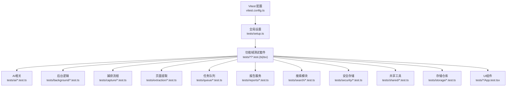
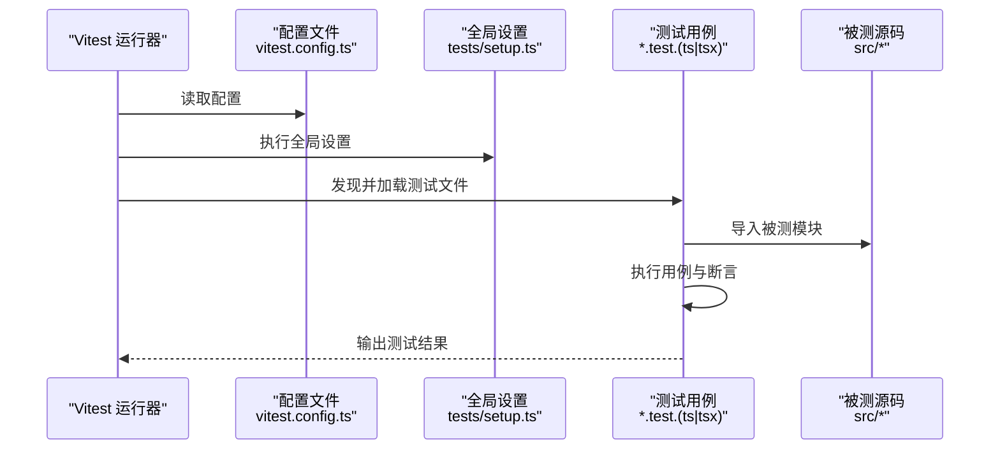
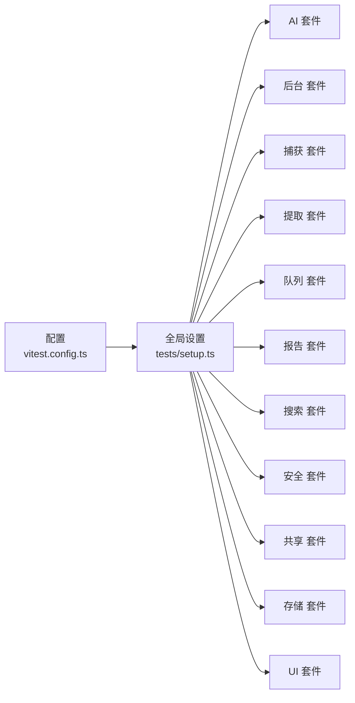

# 测试最佳实践

<cite>
**本文引用的文件**
- [vitest.config.ts](file://vitest.config.ts)
- [tests/setup.ts](file://tests/setup.ts)
- [tests/ai/embedding-client.test.ts](file://tests/ai/embedding-client.test.ts)
- [tests/storage/chat-repository.test.ts](file://tests/storage/chat-repository.test.ts)
- [tests/background/application.test.ts](file://tests/background/application.test.ts)
- [tests/ai/citations.test.ts](file://tests/ai/citations.test.ts)
- [tests/search/bm25.test.ts](file://tests/search/bm25.test.ts)
- [tests/queue/task-queue.test.ts](file://tests/queue/task-queue.test.ts)
- [tests/shared/local-date.test.ts](file://tests/shared/local-date.test.ts)
- [tests/security/secret-store.test.ts](file://tests/security/secret-store.test.ts)
- [tests/dashboard/App.test.tsx](file://tests/dashboard/App.test.tsx)
- [tests/options/App.test.tsx](file://tests/options/App.test.tsx)
- [tests/sidepanel/App.test.tsx](file://tests/sidepanel/App.test.tsx)
- [tests/extraction/extract-page.test.ts](file://tests/extraction/extract-page.test.ts)
</cite>

## 目录
1. 引言
2. 项目结构
3. 核心组件
4. 架构总览
5. 详细组件分析
6. 依赖分析
7. 性能考量
8. 故障排查指南
9. 结论
10. 附录

## 引言
本指南面向BrowseMemory项目的开发者，系统化总结单元测试的编写规范与最佳实践，覆盖命名约定、断言选择、测试数据准备、Mock与Stub使用、测试隔离与副作用控制、异步测试与Promise处理、性能优化、测试重构与维护、常见反模式规避以及调试与问题排查方法。目标是帮助团队编写高质量、可维护且高效的测试代码。

## 项目结构
测试目录采用按功能域分层组织的方式，与源码模块一一对应，便于定位与维护。核心配置集中在Vitest配置文件中，并通过统一的setup入口注入全局环境。

图表来源
- [vitest.config.ts](file://vitest.config.ts)
- [tests/setup.ts](file://tests/setup.ts)

章节来源
- [vitest.config.ts](file://vitest.config.ts)
- [tests/setup.ts](file://tests/setup.ts)

## 核心组件
- 测试运行器与配置：基于Vitest，集中于配置文件，定义了路径别名、覆盖率、快照策略、DOM环境等。
- 全局设置：在setup中初始化浏览器环境、注册自定义匹配器、挂载测试工具函数，保证各测试套件的一致性。
- 功能域测试：按模块划分，覆盖AI、后台、捕获、提取、队列、报告、搜索、安全、共享、存储与UI组件等。

章节来源
- [vitest.config.ts](file://vitest.config.ts)
- [tests/setup.ts](file://tests/setup.ts)

## 架构总览
下图展示了测试执行的总体流程：Vitest加载配置与全局设置，扫描各功能域测试文件，执行测试用例并输出结果。

图表来源
- [vitest.config.ts](file://vitest.config.ts)
- [tests/setup.ts](file://tests/setup.ts)

## 详细组件分析

### 命名约定与断言策略
- 命名约定
  - 文件命名：以被测模块名为前缀，后缀为.test.ts或.test.tsx，如[embedding-client.test.ts](file://tests/ai/embedding-client.test.ts)。
  - 用例命名：使用动词短语描述行为与期望，如“当输入满足条件时应返回预期结果”。
  - 子场景命名：对边界条件与异常分支使用子用例，如“正常路径”、“空输入”、“无效参数”等。
- 断言选择
  - 精准断言：优先使用具体值或结构断言，避免模糊匹配。
  - 类型断言：结合类型检查，确保返回值类型符合预期。
  - DOM断言（UI测试）：使用渲染后的元素选择器与可见性断言，避免依赖内部实现细节。
- 测试数据准备
  - 固定种子数据：为随机性或时间敏感逻辑提供可控输入。
  - 外部依赖数据：通过Mock或Stub提供稳定的数据源，避免真实网络或数据库访问。
  - 参数化测试：对多组输入进行批量验证，减少重复代码。

章节来源
- [tests/ai/embedding-client.test.ts](file://tests/ai/embedding-client.test.ts)
- [tests/dashboard/App.test.tsx](file://tests/dashboard/App.test.tsx)
- [tests/options/App.test.tsx](file://tests/options/App.test.tsx)
- [tests/sidepanel/App.test.tsx](file://tests/sidepanel/App.test.tsx)

### Mock与Stub使用原则
- 模拟外部依赖
  - 网络请求：对HTTP客户端进行模块级Mock，拦截请求并返回预设响应。
  - 数据库/存储：对仓储层进行Mock，避免真实持久化操作。
  - 时间与时序：对时间相关API进行Mock，确保测试确定性。
- 模拟API调用
  - 使用Vitest的Mock能力，替换导入模块中的函数或类，注入可控行为。
  - 对异步API，确保Mock返回Promise并支持超时与错误场景。
- 局限与注意
  - 仅Mock必要的接口，避免过度Mock导致测试脆弱。
  - 保持Mock行为与真实行为一致的最小差异，便于回归验证。

章节来源
- [tests/ai/embedding-client.test.ts](file://tests/ai/embedding-client.test.ts)
- [tests/storage/chat-repository.test.ts](file://tests/storage/chat-repository.test.ts)
- [tests/background/application.test.ts](file://tests/background/application.test.ts)

### 测试隔离与副作用控制
- 作用域隔离
  - 使用独立的测试上下文，避免全局状态污染。
  - 在beforeEach/afterEach中重置Mock与临时状态。
- 外部资源隔离
  - 使用内存数据库或本地存储镜像，避免跨测试影响。
  - 对文件系统与网络请求进行Mock，确保测试可重复。
- 并发与定时器
  - 对定时器进行推进或虚拟化，避免真实等待。
  - 避免在测试中使用全局计时器，改用可控的时间推进机制。

章节来源
- [tests/setup.ts](file://tests/setup.ts)
- [tests/shared/local-date.test.ts](file://tests/shared/local-date.test.ts)

### 异步测试与Promise处理
- Promise与async/await
  - 所有异步测试使用async/await，确保等待完成后再断言。
  - 对可能抛错的异步操作，使用try/catch或expect().rejects进行断言。
- 超时与竞态
  - 为长耗时操作设置合理超时，避免测试悬挂。
  - 对并发场景，明确竞态条件并使用同步点或Mock控制顺序。
- 定时器与微任务
  - 使用Vitest提供的定时器API推进时间，确保微任务与宏任务按序执行。

章节来源
- [tests/ai/openai-client.test.ts](file://tests/ai/openai-client.test.ts)
- [tests/queue/task-queue.test.ts](file://tests/queue/task-queue.test.ts)

### 性能优化与测试间干扰避免
- 快速反馈
  - 将慢依赖替换为Mock，减少I/O与网络请求。
  - 合理拆分测试，避免单个用例过长。
- 并行与串行
  - 在不共享状态的前提下，允许测试并行执行，缩短总时长。
  - 对共享资源（如端口、文件）使用串行或加锁策略。
- 缓存与复用
  - 对昂贵的计算或初始化过程进行缓存，但需注意失效策略。
- 覆盖率与噪声
  - 关注未覆盖的关键分支与异常路径，避免为覆盖而添加无意义代码。

章节来源
- [vitest.config.ts](file://vitest.config.ts)
- [tests/search/bm25.test.ts](file://tests/search/bm25.test.ts)

### 测试重构与维护最佳实践
- 重构策略
  - 将重复的断言与辅助逻辑抽取为工具函数或自定义匹配器。
  - 保持测试命名与业务语义一致，便于阅读与维护。
- 变更管理
  - 当被测模块变更时，优先更新相关测试；对破坏性变更，先修复测试再恢复功能。
- 文档与注释
  - 对复杂场景添加简要注释，说明前提条件与预期行为。
- 版本与兼容
  - 在CI中固定测试框架版本，避免升级引入的不兼容问题。

章节来源
- [tests/ai/citations.test.ts](file://tests/ai/citations.test.ts)
- [tests/security/secret-store.test.ts](file://tests/security/secret-store.test.ts)

### 常见测试反模式识别与避免
- 反模式
  - 过度依赖真实外部服务：应使用Mock替代。
  - 测试间共享状态：通过隔离与重置避免。
  - 使用隐式等待：改用显式的等待与断言。
  - 测试用例过长：拆分为多个小而清晰的用例。
  - 忽视边界与异常：补充空输入、非法参数、网络失败等场景。
- 避免方法
  - 明确职责：每个用例只验证一个行为或一条路径。
  - 使用稳定的输入与断言：避免随机性与脆弱断言。
  - 统一Mock策略：对同一外部依赖采用一致的Mock方式。

章节来源
- [tests/extraction/extract-page.test.ts](file://tests/extraction/extract-page.test.ts)

### 测试调试技巧与问题排查
- 调试方法
  - 使用Vitest的调试模式，逐步执行并观察中间状态。
  - 在关键位置打印或记录变量，确认数据流与控制流。
  - 分离关注点：先验证输入/输出，再逐步深入到内部逻辑。
- 常见问题
  - Mock未生效：检查导入路径与模块替换是否正确。
  - 异步未完成：确认await链路完整，断言位置正确。
  - DOM测试不稳定：避免依赖动态内容，使用稳定的选择器与属性。
- 排查步骤
  - 从最小可复现用例开始，逐步扩大范围。
  - 替换部分Mock为真实实现，定位问题来源。
  - 检查全局设置与配置，确保环境一致性。

章节来源
- [tests/dashboard/App.test.tsx](file://tests/dashboard/App.test.tsx)
- [tests/options/App.test.tsx](file://tests/options/App.test.tsx)
- [tests/sidepanel/App.test.tsx](file://tests/sidepanel/App.test.tsx)

## 依赖分析
测试依赖关系主要体现在配置、全局设置与各功能域测试之间，整体呈现“配置—设置—套件”的层次化依赖。

图表来源
- [vitest.config.ts](file://vitest.config.ts)
- [tests/setup.ts](file://tests/setup.ts)

章节来源
- [vitest.config.ts](file://vitest.config.ts)
- [tests/setup.ts](file://tests/setup.ts)

## 性能考量
- 加速策略
  - 使用Mock替代真实I/O与网络请求，减少端到端开销。
  - 合理拆分测试，避免单个用例包含过多逻辑。
  - 利用Vitest的并行执行能力，在无共享状态前提下提升吞吐。
- 资源管理
  - 对数据库与文件系统使用内存镜像或临时目录，避免磁盘竞争。
  - 控制定时器与并发，防止资源泄漏与死锁。
- 覆盖率与质量
  - 关注关键路径与异常分支，避免为覆盖率而牺牲可读性。
  - 定期审查未覆盖区域，补充缺失场景。

## 故障排查指南
- 环境问题
  - 确认Vitest配置与全局设置已正确加载。
  - 检查路径别名与模块解析，避免导入失败。
- 行为问题
  - 对Mock行为进行回归验证，确保与真实行为一致。
  - 对异步流程进行时序校验，避免竞态条件。
- 输出问题
  - 使用结构化断言与清晰的失败消息，快速定位失败原因。
  - 对UI测试，使用稳定的属性与选择器，避免样式变化导致的失败。

章节来源
- [vitest.config.ts](file://vitest.config.ts)
- [tests/setup.ts](file://tests/setup.ts)

## 结论
通过统一的配置与全局设置、清晰的命名与断言策略、严格的Mock与Stub使用、完善的隔离与副作用控制、正确的异步与Promise处理、持续的性能优化与重构，以及系统化的调试与排错流程，BrowseMemory的测试体系可以实现高覆盖率、高稳定性与高可维护性。建议在日常开发中遵循本文规范，持续改进测试质量与效率。

## 附录
- 快速检查清单
  - 是否为每个功能域提供了对应的测试文件？
  - 是否使用了稳定的Mock与可控的测试数据？
  - 是否对异步流程进行了充分的时序与错误场景验证？
  - 是否避免了测试间的共享状态与外部依赖？
  - 是否定期审查覆盖率与重构测试代码？