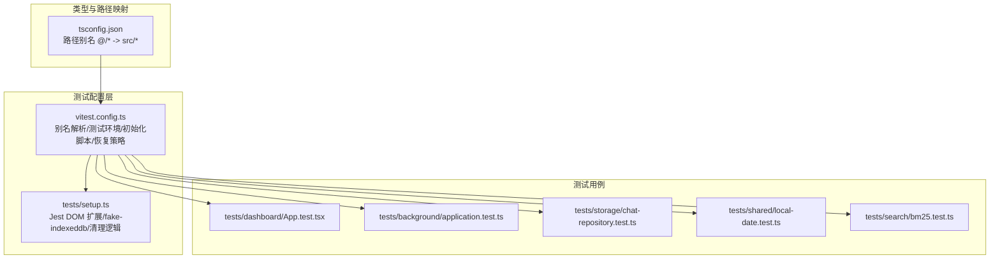
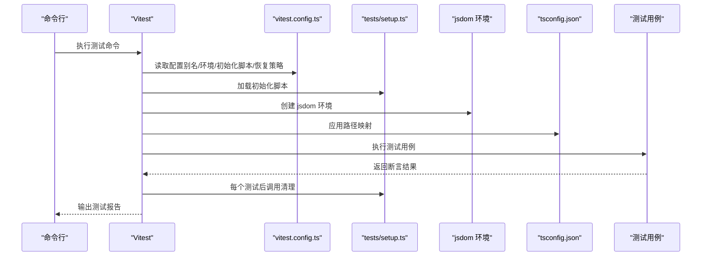
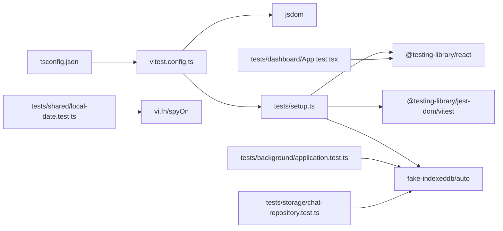

# 测试框架配置

<cite>
**本文档引用的文件**
- [vitest.config.ts](file://vitest.config.ts)
- [tests/setup.ts](file://tests/setup.ts)
- [package.json](file://package.json)
- [tsconfig.json](file://tsconfig.json)
- [tests/dashboard/App.test.tsx](file://tests/dashboard/App.test.tsx)
- [tests/background/application.test.ts](file://tests/background/application.test.ts)
- [tests/storage/chat-repository.test.ts](file://tests/storage/chat-repository.test.ts)
- [tests/shared/local-date.test.ts](file://tests/shared/local-date.test.ts)
- [tests/search/bm25.test.ts](file://tests/search/bm25.test.ts)
- [.github/workflows/release.yml](file://.github/workflows/release.yml)
</cite>

## 目录
1. [简介](#简介)
2. [项目结构](#项目结构)
3. [核心组件](#核心组件)
4. [架构总览](#架构总览)
5. [详细组件分析](#详细组件分析)
6. [依赖关系分析](#依赖关系分析)
7. [性能考虑](#性能考虑)
8. [故障排除指南](#故障排除指南)
9. [结论](#结论)
10. [附录](#附录)

## 简介
本文件面向BrowseMemory项目的测试框架配置，系统性解读Vitest配置文件的各项参数与设置，重点涵盖：
- 别名解析配置（@ 符号指向 src 目录）
- 测试环境（jsdom）的选择原因与配置
- setupFiles 的使用与初始化脚本的作用
- restoreMocks 选项的功能与影响
- 测试环境隔离机制与模拟对象的恢复策略
- 配置自定义与扩展方法
- 常见配置问题的解决方案与性能优化建议

目标是帮助开发者理解并灵活调整测试配置以满足不同模块与场景的需求。

## 项目结构
BrowseMemory采用基于功能域的组织方式，测试用例按功能模块分布在 tests 目录下，并通过 Vitest 进行统一管理。关键配置集中在根目录的 vitest.config.ts 与 tests/setup.ts 中，TypeScript 路径映射在 tsconfig.json 中完成。

图表来源
- [vitest.config.ts:1-15](file://vitest.config.ts#L1-L15)
- [tests/setup.ts:1-9](file://tests/setup.ts#L1-L9)
- [tsconfig.json:1-34](file://tsconfig.json#L1-L34)
- [tests/dashboard/App.test.tsx:1-116](file://tests/dashboard/App.test.tsx#L1-L116)
- [tests/background/application.test.ts:1-114](file://tests/background/application.test.ts#L1-L114)
- [tests/storage/chat-repository.test.ts:1-100](file://tests/storage/chat-repository.test.ts#L1-L100)
- [tests/shared/local-date.test.ts:1-15](file://tests/shared/local-date.test.ts#L1-L15)
- [tests/search/bm25.test.ts:1-56](file://tests/search/bm25.test.ts#L1-L56)

章节来源
- [vitest.config.ts:1-15](file://vitest.config.ts#L1-L15)
- [tests/setup.ts:1-9](file://tests/setup.ts#L1-L9)
- [tsconfig.json:1-34](file://tsconfig.json#L1-L34)

## 核心组件
- 别名解析配置（@ 指向 src）
  - 在 Vitest 中通过 resolve.alias 将 @ 映射到 src 目录，便于在测试中使用相对路径导入。
  - 同时在 tsconfig.json 中也配置了 baseUrl 与 paths，确保开发与构建时的一致性。
- 测试环境（jsdom）
  - 使用 jsdom 作为测试运行时环境，提供 DOM API 与浏览器相关全局对象，适合 UI 组件与浏览器 API 的测试。
- 初始化脚本（setupFiles）
  - 通过 setupFiles 引入 @testing-library/jest-dom 的 Vitest 扩展、fake-indexeddb 自动化以及每次测试后的清理逻辑。
- 模拟对象恢复（restoreMocks）
  - 开启后，Vitest 会在每个测试结束后自动恢复被模拟的对象与函数，避免跨测试污染。

章节来源
- [vitest.config.ts:3-14](file://vitest.config.ts#L3-L14)
- [tests/setup.ts:1-9](file://tests/setup.ts#L1-L9)
- [tsconfig.json:19-23](file://tsconfig.json#L19-L23)

## 架构总览
下图展示了测试配置与各模块之间的交互关系：Vitest 读取配置，加载 setupFiles，使用 jsdom 提供的 DOM 环境执行测试；TypeScript 路径映射保证模块导入一致性；测试用例覆盖 UI、业务逻辑与数据存储等多领域。

图表来源
- [vitest.config.ts:1-15](file://vitest.config.ts#L1-L15)
- [tests/setup.ts:1-9](file://tests/setup.ts#L1-L9)
- [tsconfig.json:1-34](file://tsconfig.json#L1-L34)

## 详细组件分析

### 别名解析配置（@ 符号指向 src）
- 目标与作用
  - 通过 resolve.alias 将 @ 映射到 src 目录，使测试代码可以使用 @/xxx 形式的导入路径，提升可读性与可维护性。
  - tsconfig.json 中的 baseUrl 与 paths 保持与 Vitest 配置一致，确保开发、构建与测试三者路径解析一致。
- 实现要点
  - Vitest 配置中使用 URL 构造器计算绝对路径，避免相对路径在不同工作目录下的差异。
  - tsconfig.json 中的 paths 与 baseUrl 与之对应，确保 IDE 与编译器行为一致。
- 使用示例（路径引用）
  - UI 组件测试中使用 @/i18n、@/ui 等路径进行导入。
  - 业务模块测试中使用 @/background、@/storage、@/search 等路径进行导入。

章节来源
- [vitest.config.ts:4-8](file://vitest.config.ts#L4-L8)
- [tsconfig.json:19-23](file://tsconfig.json#L19-L23)
- [tests/dashboard/App.test.tsx:4-6](file://tests/dashboard/App.test.tsx#L4-L6)
- [tests/background/application.test.ts:3-4](file://tests/background/application.test.ts#L3-L4)
- [tests/storage/chat-repository.test.ts:3-4](file://tests/storage/chat-repository.test.ts#L3-L4)

### 测试环境（jsdom）选择与配置
- 选择原因
  - jsdom 提供浏览器级别的 DOM API 与事件模型，适合测试 React 组件渲染、用户交互与浏览器 API（如 IndexedDB）。
  - 项目中使用 fake-indexeddb 自动化，无需手动启动 IndexedDB 环境即可进行数据库相关测试。
- 配置位置
  - 在 vitest.config.ts 的 test.environment 字段设置为 jsdom。
- 影响范围
  - 所有测试用例均在 jsdom 环境中运行，具备 window、document、navigator 等全局对象。
  - 与 @testing-library/react 结合使用，支持查询、事件触发与断言。

章节来源
- [vitest.config.ts:9-12](file://vitest.config.ts#L9-L12)
- [tests/setup.ts:1-2](file://tests/setup.ts#L1-L2)
- [tests/dashboard/App.test.tsx:1-2](file://tests/dashboard/App.test.tsx#L1-L2)

### 初始化脚本（setupFiles）与清理策略
- 初始化脚本内容
  - 引入 @testing-library/jest-dom/vitest，为测试提供丰富的断言扩展。
  - 引入 fake-indexeddb/auto，自动注入 IndexedDB 环境，简化数据库相关测试。
  - 导入 cleanup 并在 afterEach 中调用，确保每次测试后 DOM 与内部状态被清理。
- 清理策略
  - 每个测试结束后自动清理，避免测试间相互影响。
  - 对于 React 组件测试，cleanup 可移除挂载的节点，释放内存。
- 使用示例（路径引用）
  - 测试用例中通过 @testing-library/react 的 render、screen 等 API 进行断言。

章节来源
- [tests/setup.ts:1-9](file://tests/setup.ts#L1-L9)
- [tests/dashboard/App.test.tsx:1-2](file://tests/dashboard/App.test.tsx#L1-L2)

### restoreMocks 选项的功能与影响
- 功能概述
  - 开启 restoreMocks 后，Vitest 会在每个测试结束后自动恢复所有被模拟的对象与函数（如 vi.fn、spyOn 等），防止模拟状态泄漏到下一个测试。
- 影响范围
  - 对所有使用 vi.mock、vi.fn、spyOn 等 API 的测试有效。
  - 有助于提高测试稳定性与可重复性，减少“测试污染”风险。
- 典型用法（路径引用）
  - 单元测试中对时间函数进行 spy 或 mock，确保每次测试都从干净状态开始。
  - UI 组件测试中对外部依赖进行模拟，避免真实网络或数据库访问。

章节来源
- [vitest.config.ts:12](file://vitest.config.ts#L12)
- [tests/shared/local-date.test.ts:7-10](file://tests/shared/local-date.test.ts#L7-L10)

### 测试环境隔离机制与模拟对象恢复策略
- 隔离机制
  - 每个测试在独立的 jsdom 上下文中执行，拥有独立的全局对象与 DOM 状态。
  - setupFiles 中的 afterEach 清理确保 DOM 与内部状态被重置。
- 模拟对象恢复
  - restoreMocks 保障模拟函数与对象在测试结束时被还原，避免跨测试共享状态。
- 实践建议
  - 对于需要持久状态的测试，应显式管理状态并在 afterEach 中清理。
  - 对于异步操作，注意在测试结束前等待 Promise 完成，避免竞态条件。

章节来源
- [vitest.config.ts:9-13](file://vitest.config.ts#L9-L13)
- [tests/setup.ts:6-8](file://tests/setup.ts#L6-L8)

### 配置自定义与扩展方法
- 自定义别名
  - 在 vitest.config.ts 的 resolve.alias 中添加新的别名映射，例如将 #/ 前缀映射到特定目录。
  - 同步更新 tsconfig.json 的 paths，保持一致性。
- 扩展测试环境
  - 如需更多浏览器 API，可在 setupFiles 中引入额外 polyfill 或扩展库。
  - 对于需要真实浏览器行为的端到端测试，可考虑引入 Playwright 或 Cypress。
- 调整恢复策略
  - 若某些测试需要保留模拟状态，可在单个测试文件中禁用 restoreMocks，但需谨慎评估风险。
- CI/CD 集成
  - 在 GitHub Actions 中通过 pnpm test 执行测试，确保依赖安装与缓存策略正确。

章节来源
- [vitest.config.ts:3-14](file://vitest.config.ts#L3-L14)
- [tsconfig.json:19-23](file://tsconfig.json#L19-L23)
- [.github/workflows/release.yml:39-40](file://.github/workflows/release.yml#L39-L40)

## 依赖关系分析
- 配置依赖
  - vitest.config.ts 依赖 @testing-library/jest-dom、fake-indexeddb、jsdom 等依赖包。
  - tsconfig.json 的路径映射与 Vitest 别名保持一致，避免导入错误。
- 测试用例依赖
  - UI 组件测试依赖 @testing-library/react 与 jsdom。
  - 数据库相关测试依赖 fake-indexeddb。
  - 时间与日期相关测试可能依赖 vi.spyOn 等模拟能力。

图表来源
- [vitest.config.ts:1-15](file://vitest.config.ts#L1-L15)
- [tests/setup.ts:1-9](file://tests/setup.ts#L1-L9)
- [tsconfig.json:1-34](file://tsconfig.json#L1-L34)
- [tests/dashboard/App.test.tsx:1-2](file://tests/dashboard/App.test.tsx#L1-L2)
- [tests/background/application.test.ts:1-1](file://tests/background/application.test.ts#L1-L1)
- [tests/storage/chat-repository.test.ts:1-1](file://tests/storage/chat-repository.test.ts#L1-L1)
- [tests/shared/local-date.test.ts:1-1](file://tests/shared/local-date.test.ts#L1-L1)

章节来源
- [package.json:25-46](file://package.json#L25-L46)
- [vitest.config.ts:1-15](file://vitest.config.ts#L1-L15)
- [tests/setup.ts:1-9](file://tests/setup.ts#L1-L9)
- [tsconfig.json:1-34](file://tsconfig.json#L1-L34)

## 性能考虑
- 测试隔离与恢复
  - 使用 restoreMocks 与 afterEach 清理可减少测试间状态耦合，但频繁的清理与恢复也会带来开销。建议仅在必要时启用恢复策略。
- DOM 清理
  - 每次测试后调用 cleanup 可避免 DOM 泄漏，但在大量组件测试中仍需关注渲染与卸载成本。
- 并行与并发
  - Vitest 默认支持并发测试，合理拆分测试用例可提升整体执行效率。
- 缓存与依赖
  - 在 CI 环境中利用 pnpm 缓存与 Node 版本固定，减少安装与冷启动时间。

## 故障排除指南
- 别名导入失败
  - 症状：无法通过 @/xxx 导入模块。
  - 排查：确认 vitest.config.ts 与 tsconfig.json 的路径映射一致，且 baseUrl 与 paths 设置正确。
- jsdom 相关错误
  - 症状：缺少 window/document/navigator 等全局对象。
  - 排查：确认 test.environment 为 jsdom，且 setupFiles 正确加载。
- 模拟状态泄漏
  - 症状：后续测试继承前一个测试的模拟状态。
  - 排查：开启 restoreMocks，检查是否存在未恢复的模拟或未清理的状态。
- IndexedDB 访问异常
  - 症状：数据库相关测试失败或超时。
  - 排查：确认 fake-indexeddb/auto 已正确引入，且在测试前已初始化。
- CI 执行失败
  - 症状：本地可通过，CI 失败。
  - 排查：检查 Node 版本、pnpm 版本与缓存策略，确保依赖安装一致。

章节来源
- [vitest.config.ts:3-14](file://vitest.config.ts#L3-L14)
- [tests/setup.ts:1-9](file://tests/setup.ts#L1-L9)
- [tsconfig.json:19-23](file://tsconfig.json#L19-L23)
- [.github/workflows/release.yml:39-40](file://.github/workflows/release.yml#L39-L40)

## 结论
BrowseMemory 的测试配置以简洁高效为目标：通过 @ 符号别名提升导入一致性，借助 jsdom 提供浏览器级测试环境，配合 setupFiles 完成初始化与清理，再由 restoreMocks 保障模拟对象的恢复与测试隔离。该配置适用于 UI 组件、业务逻辑与数据存储等多类测试场景。开发者可根据具体需求进行自定义与扩展，同时遵循最佳实践以确保测试的稳定性与性能。

## 附录
- 常用测试用例参考
  - UI 组件测试：[tests/dashboard/App.test.tsx:1-116](file://tests/dashboard/App.test.tsx#L1-L116)
  - 业务应用测试：[tests/background/application.test.ts:1-114](file://tests/background/application.test.ts#L1-L114)
  - 存储仓库测试：[tests/storage/chat-repository.test.ts:1-100](file://tests/storage/chat-repository.test.ts#L1-L100)
  - 时间函数测试：[tests/shared/local-date.test.ts:1-15](file://tests/shared/local-date.test.ts#L1-L15)
  - 搜索算法测试：[tests/search/bm25.test.ts:1-56](file://tests/search/bm25.test.ts#L1-L56)
- CI/CD 测试流程
  - 在发布工作流中通过 pnpm test 执行测试，确保质量门禁。