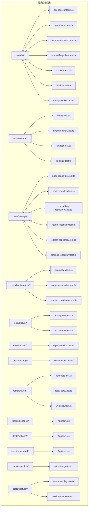
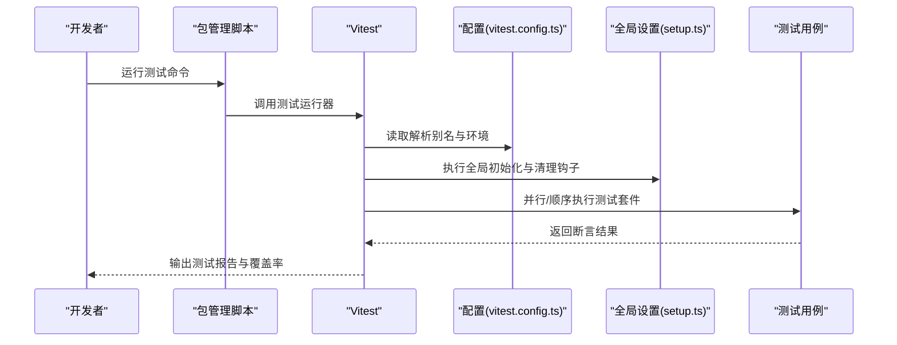
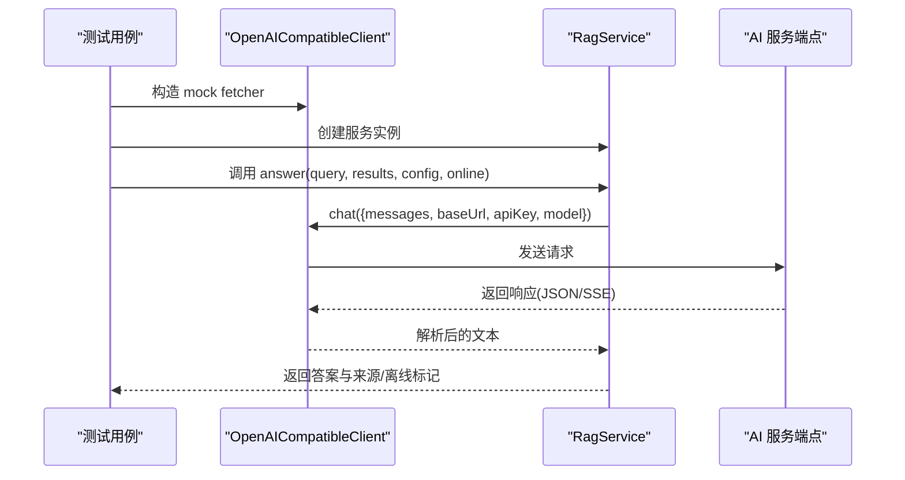
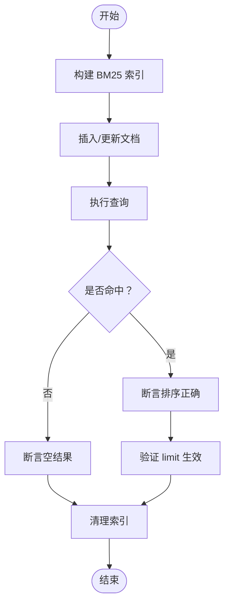
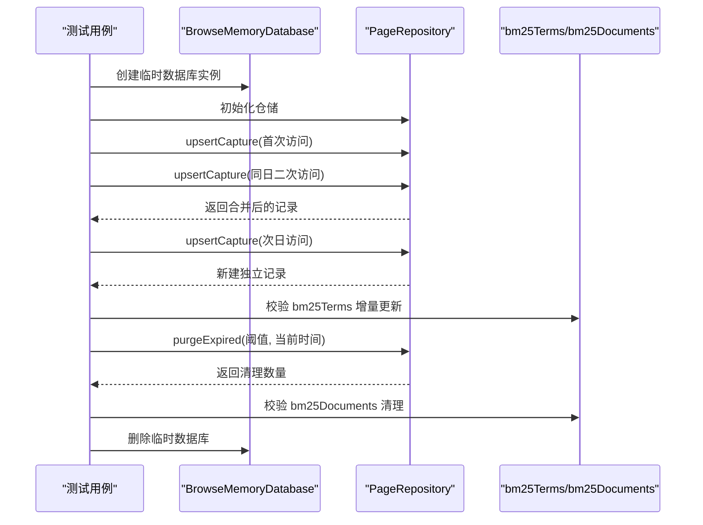
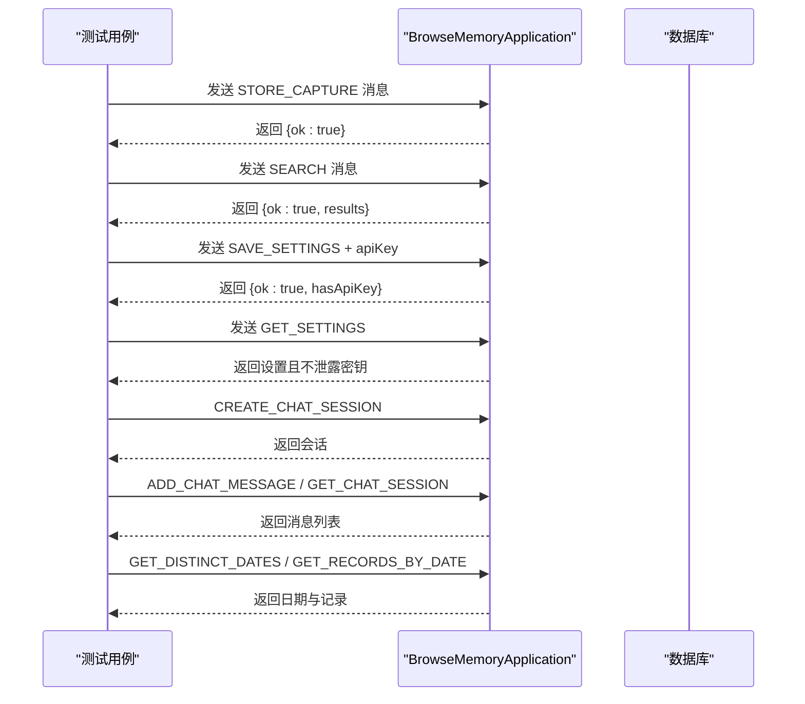
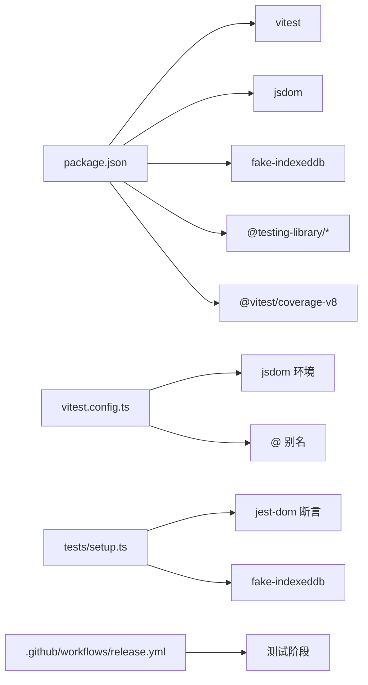

# 测试策略

<cite>
**本文引用的文件**
- [vitest.config.ts](file://vitest.config.ts)
- [tests/setup.ts](file://tests/setup.ts)
- [package.json](file://package.json)
- [README.md](file://README.md)
- [tests/ai/rag-service.test.ts](file://tests/ai/rag-service.test.ts)
- [tests/ai/openai-client.test.ts](file://tests/ai/openai-client.test.ts)
- [tests/storage/page-repository.test.ts](file://tests/storage/page-repository.test.ts)
- [tests/search/bm25.test.ts](file://tests/search/bm25.test.ts)
- [tests/search/hybrid-search.test.ts](file://tests/search/hybrid-search.test.ts)
- [tests/background/application.test.ts](file://tests/background/application.test.ts)
- [.github/workflows/release.yml](file://.github/workflows/release.yml)
</cite>

## 目录
1. [简介](#简介)
2. [项目结构](#项目结构)
3. [核心组件](#核心组件)
4. [架构总览](#架构总览)
5. [详细组件分析](#详细组件分析)
6. [依赖分析](#依赖分析)
7. [性能考虑](#性能考虑)
8. [故障排查指南](#故障排查指南)
9. [结论](#结论)
10. [附录](#附录)

## 简介
本文件面向测试工程师与开发团队，系统阐述 BrowseMemory 的测试策略与实施方法。内容涵盖 Vitest 测试框架配置与使用、测试环境与全局设置、单元测试组织结构（AI 服务、搜索功能、存储层等）、测试覆盖率现状与要求、集成测试策略、Mock 与测试数据准备、测试用例编写最佳实践、性能与压力测试方法、持续集成中的测试自动化流程，以及 TDD 指导与调试排障建议。

## 项目结构
测试目录采用按功能域分层组织，与源代码模块一一对应，便于定位与维护：
- tests/ai：AI 服务相关测试（客户端、RAG、摘要、重写等）
- tests/search：全文检索与混合检索测试（BM25、向量相似度、RRF 融合）
- tests/storage：数据库与仓储层测试（IndexedDB/Dexie）
- tests/background：后台应用边界与消息处理测试
- tests/queue、tests/reports、tests/security、tests/shared、tests/ui：分别对应任务队列、报告、安全、共享逻辑与 UI 组件
- tests/setup.ts：全局测试初始化与清理

图表来源
- [tests/ai/openai-client.test.ts:1-116](file://tests/ai/openai-client.test.ts#L1-L116)
- [tests/ai/rag-service.test.ts:1-103](file://tests/ai/rag-service.test.ts#L1-L103)
- [tests/search/bm25.test.ts:1-56](file://tests/search/bm25.test.ts#L1-L56)
- [tests/search/hybrid-search.test.ts:1-97](file://tests/search/hybrid-search.test.ts#L1-L97)
- [tests/storage/page-repository.test.ts:1-241](file://tests/storage/page-repository.test.ts#L1-L241)
- [tests/background/application.test.ts:1-114](file://tests/background/application.test.ts#L1-L114)

章节来源
- [README.md:46](file://README.md#L46)

## 核心组件
- 测试运行器与配置：基于 Vitest，使用 jsdom 环境、路径别名 @ 指向 src，并通过 setupFiles 注入全局初始化与清理。
- 全局设置：引入 jest-dom 断言扩展、fake-indexeddb 自动化以模拟 IndexedDB，每次测试后自动清理 React 测试工具的 DOM。
- 脚本与依赖：通过 package.json 提供 test 脚本；覆盖率由 @vitest/coverage-v8 提供；开发依赖包含 jsdom、fake-indexeddb、@testing-library 等。

章节来源
- [vitest.config.ts:1-15](file://vitest.config.ts#L1-L15)
- [tests/setup.ts:1-9](file://tests/setup.ts#L1-L9)
- [package.json:10-45](file://package.json#L10-L45)

## 架构总览
下图展示了测试运行的整体流程：命令行触发测试脚本 -> Vitest 初始化 -> 加载配置与全局设置 -> 执行测试用例 -> 输出结果与覆盖率（如启用）。

图表来源
- [package.json:10](file://package.json#L10)
- [vitest.config.ts:3-14](file://vitest.config.ts#L3-L14)
- [tests/setup.ts:1-9](file://tests/setup.ts#L1-L9)

## 详细组件分析

### AI 服务测试
- OpenAI 兼容客户端：验证 JSON 响应与 SSE 流式响应解析、HTTP 错误码归一化（认证、速率限制、网络、提供商、超时）。
- RAG 服务：验证在线回答与引用、离线回退、无配置回退、前缀缓存系统提示优先发送。

图表来源
- [tests/ai/openai-client.test.ts:1-116](file://tests/ai/openai-client.test.ts#L1-L116)
- [tests/ai/rag-service.test.ts:1-103](file://tests/ai/rag-service.test.ts#L1-L103)

章节来源
- [tests/ai/openai-client.test.ts:1-116](file://tests/ai/openai-client.test.ts#L1-L116)
- [tests/ai/rag-service.test.ts:1-103](file://tests/ai/rag-service.test.ts#L1-L103)

### 搜索功能测试
- BM25：验证标题匹配优于正文匹配、文档更新/删除无残留词项、空查询/空索引返回空结果、limit 参数生效。
- 混合检索：验证余弦相似度计算、向量检索排序、RRF 融合规则（交集项更高分、仅一种信号时的行为）。

图表来源
- [tests/search/bm25.test.ts:1-56](file://tests/search/bm25.test.ts#L1-L56)

章节来源
- [tests/search/bm25.test.ts:1-56](file://tests/search/bm25.test.ts#L1-L56)
- [tests/search/hybrid-search.test.ts:1-97](file://tests/search/hybrid-search.test.ts#L1-L97)

### 存储层测试
- PageRepository：验证同日多次访问合并、跨日新建访问、BM25 词项增量更新（新增/更新/保留共享词）、过期清理（仅清空内容保留元数据）、重复清理幂等性、bm25Documents 清理。
- 其他仓储：Chat/Embedding/Page/Report/Search/Settings 仓储均有对应测试，覆盖增删改查、一致性与边界条件。

图表来源
- [tests/storage/page-repository.test.ts:1-241](file://tests/storage/page-repository.test.ts#L1-L241)

章节来源
- [tests/storage/page-repository.test.ts:1-241](file://tests/storage/page-repository.test.ts#L1-L241)

### 后台应用边界测试
- 应用边界：通过统一的消息协议在后台应用层进行捕获存储与搜索、设置保存与加密、聊天会话创建与查询、按日期聚合记录等。
- 关键断言：返回结构 ok 标记、结果字段存在性、去重日期集合、会话消息长度等。

图表来源
- [tests/background/application.test.ts:1-114](file://tests/background/application.test.ts#L1-L114)

章节来源
- [tests/background/application.test.ts:1-114](file://tests/background/application.test.ts#L1-L114)

## 依赖分析
- 测试框架与环境：Vitest + jsdom；路径别名 @ 指向 src；全局 setup 注入 jest-dom 与 fake-indexeddb。
- 断言与辅助：@testing-library/jest-dom 用于 DOM 断言；@testing-library/react 提供 React 组件测试辅助；cleanup 在每次测试后自动清理。
- 覆盖率：通过 @vitest/coverage-v8 收集覆盖率数据。
- CI：release 工作流在构建前执行类型检查、代码检查、测试与打包。

图表来源
- [package.json:25-45](file://package.json#L25-L45)
- [vitest.config.ts:3-14](file://vitest.config.ts#L3-L14)
- [tests/setup.ts:1-9](file://tests/setup.ts#L1-L9)
- [.github/workflows/release.yml:39-40](file://.github/workflows/release.yml#L39-L40)

章节来源
- [package.json:25-45](file://package.json#L25-L45)
- [vitest.config.ts:3-14](file://vitest.config.ts#L3-L14)
- [tests/setup.ts:1-9](file://tests/setup.ts#L1-L9)
- [.github/workflows/release.yml:39-40](file://.github/workflows/release.yml#L39-L40)

## 性能考虑
- 单测并发：Vitest 默认并发执行测试套件，有助于缩短整体测试时间。
- Mock 策略：对网络与数据库操作进行 Mock，避免真实 IO 影响性能与稳定性。
- 覆盖率收集：开启覆盖率可帮助识别热点路径与未覆盖分支，指导针对性优化。
- 压力测试建议：可在 Vitest 外部引入基准测试工具或独立压力测试脚本，针对高频路径（如搜索、RAG、任务队列）进行吞吐与延迟评估。

## 故障排查指南
- 环境问题
  - jsdom 环境缺失：确认 vitest.config.ts 中 environment 设置为 jsdom。
  - 路径别名无效：确认 @ 指向 src，避免导入错误。
- IndexedDB 相关
  - 未模拟 IndexedDB：确保 fake-indexeddb 已安装并在 setup.ts 中启用。
  - 数据库未清理：确认每个测试后删除临时数据库实例。
- 断言失败
  - jest-dom 断言：确保已引入 @testing-library/jest-dom。
  - React 组件：使用 cleanup 清理 DOM，避免跨用例污染。
- Mock 与网络
  - fetch/SSE：在客户端测试中使用 vi.fn() 返回预期 Response 或流式数据。
  - 错误码：验证 HTTP 错误码到内部错误码的归一化逻辑。
- 覆盖率异常
  - 未生成覆盖率：确认 @vitest/coverage-v8 已安装并启用相应配置。
- CI 失败
  - 类型检查/代码检查/测试失败：在 release 工作流中逐一排查。

章节来源
- [vitest.config.ts:9-14](file://vitest.config.ts#L9-L14)
- [tests/setup.ts:1-9](file://tests/setup.ts#L1-L9)
- [package.json:34-45](file://package.json#L34-L45)
- [.github/workflows/release.yml:39-40](file://.github/workflows/release.yml#L39-L40)

## 结论
本项目采用 Vitest 作为核心测试框架，结合 jsdom 环境与 fake-indexeddb，实现了对 AI 服务、搜索、存储、后台应用等关键模块的系统化单元测试。通过合理的 Mock 策略与测试数据准备，保证了测试的稳定性与可重复性。CI 流程中集成了类型检查、代码检查与测试，确保质量门槛。建议在现有基础上进一步完善覆盖率目标与压力测试方案，持续提升测试深度与广度。

## 附录

### 测试覆盖率要求与现状
- 覆盖率工具：@vitest/coverage-v8
- 要求：建议关键模块（AI、搜索、存储）达到较高行/分支/函数/语句覆盖率；对错误路径与边界条件进行专项覆盖。
- 现状：README 显示测试套件覆盖 33 个文件、150 个用例，具体覆盖率数值需在本地或 CI 中查看。

章节来源
- [package.json:34](file://package.json#L34)
- [README.md:46](file://README.md#L46)

### 集成测试策略与关键场景
- 关键场景
  - 端到端消息流：从捕获到搜索再到 RAG 回答的完整链路。
  - 设置与加密：保存 API Key 后不可直接返回明文，且后续调用应正常工作。
  - 会话生命周期：创建、添加消息、查询与列出。
  - 过期清理：内容清空但元数据保留，bm25Documents 清理。
- 建议
  - 使用最小化外部依赖的 Mock，确保集成测试稳定。
  - 将 UI 层与业务层分离，UI 测试聚焦交互，业务逻辑放入单元测试。

章节来源
- [tests/background/application.test.ts:1-114](file://tests/background/application.test.ts#L1-L114)
- [tests/storage/page-repository.test.ts:1-241](file://tests/storage/page-repository.test.ts#L1-L241)

### Mock 策略与测试数据准备
- 网络层
  - 使用 vi.fn() 返回 Response 或 SSE 流，覆盖成功与失败路径。
  - 对超时、AbortError、网络错误进行专门断言。
- 存储层
  - 为每个测试创建独立的临时数据库实例，结束后删除。
  - 使用 upsertCapture 插入测试数据，覆盖合并、跨日、更新等场景。
- AI 服务
  - Mock OpenAI 兼容客户端，验证不同响应格式与错误码归一化。

章节来源
- [tests/ai/openai-client.test.ts:1-116](file://tests/ai/openai-client.test.ts#L1-L116)
- [tests/storage/page-repository.test.ts:1-241](file://tests/storage/page-repository.test.ts#L1-L241)

### 测试用例编写最佳实践
- 结构清晰：describe 分组、it 用例命名明确、前置/后置钩子组织好。
- 可重复：每个测试独立，避免共享状态；必要时使用临时数据库。
- 可维护：Mock 与断言集中，避免在用例中硬编码细节。
- 全面：覆盖正常路径、边界条件、异常路径与错误码归一化。

### 性能测试与压力测试方法
- 方法
  - 使用 Vitest 的计时能力或外部基准工具对热点函数进行基准测试。
  - 对搜索与 RAG 路径构造大规模数据集，测量吞吐与延迟。
- 关注点
  - 索引构建与查询性能、向量相似度计算、SSE 流式解析效率。

### 持续集成中的测试自动化
- 工作流
  - 类型检查、代码检查、测试、构建与打包串联。
- 建议
  - 在 PR 中强制执行测试与覆盖率阈值；对关键模块增加覆盖率门禁。

章节来源
- [.github/workflows/release.yml:33-43](file://.github/workflows/release.yml#L33-L43)

### 测试驱动开发（TDD）指导
- 步骤
  - 编写失败的测试用例（描述期望行为）→ 实现最小代码满足测试 → 重构与优化 → 增加更多用例覆盖边界与异常。
- 适用场景
  - 新增搜索算法、AI 客户端行为、仓储逻辑与后台消息协议扩展。