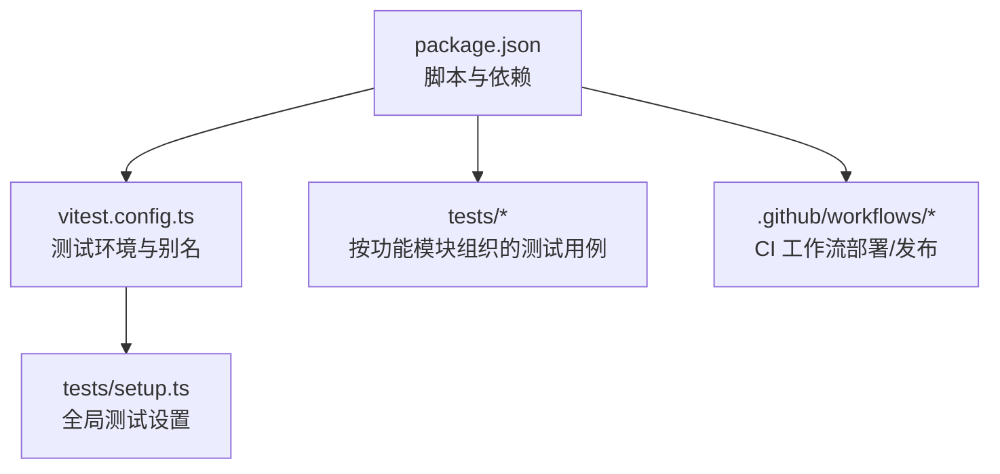
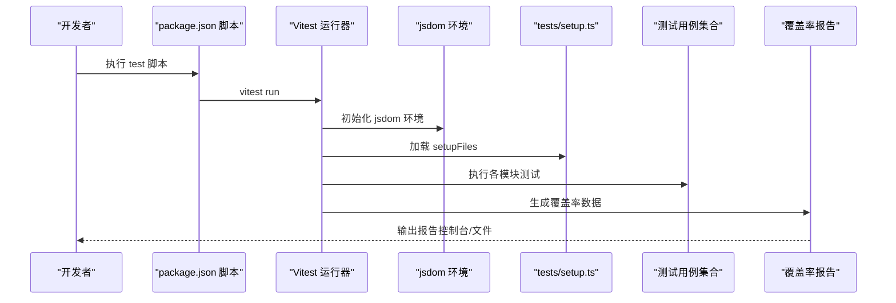
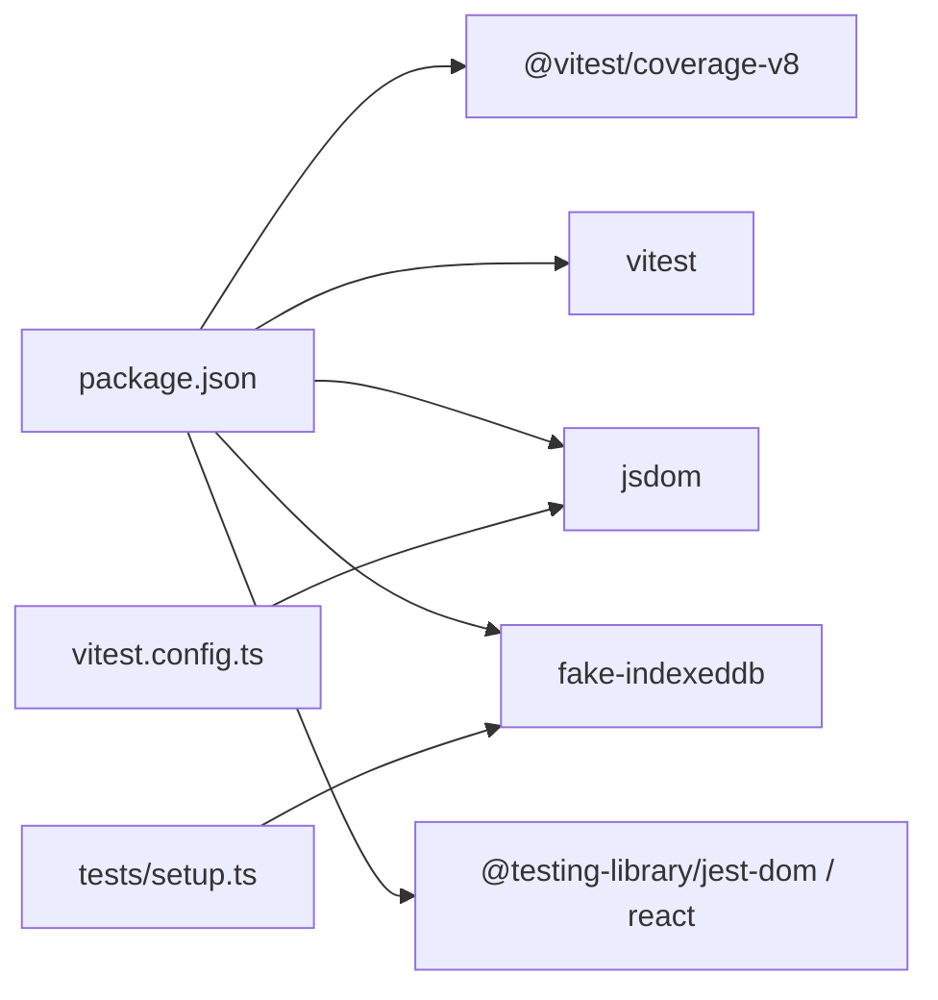

# 测试覆盖率管理

<cite>
**本文引用的文件**
- [vitest.config.ts](file://vitest.config.ts)
- [package.json](file://package.json)
- [tests/setup.ts](file://tests/setup.ts)
- [.github/workflows/pages.yml](file://.github/workflows/pages.yml)
- [.github/workflows/release.yml](file://.github/workflows/release.yml)
- [tests/ai/citations.test.ts](file://tests/ai/citations.test.ts)
- [tests/storage/chat-repository.test.ts](file://tests/storage/chat-repository.test.ts)
- [tests/shared/url-policy.test.ts](file://tests/shared/url-policy.test.ts)
</cite>

## 目录
1. [引言](#引言)
2. [项目结构](#项目结构)
3. [核心组件](#核心组件)
4. [架构总览](#架构总览)
5. [详细组件分析](#详细组件分析)
6. [依赖关系分析](#依赖关系分析)
7. [性能考量](#性能考量)
8. [故障排查指南](#故障排查指南)
9. [结论](#结论)
10. [附录](#附录)

## 引言
本文件面向 BrowseMemory 项目，系统化阐述测试覆盖率管理的理论与实践，涵盖概念定义（行/分支/函数/语句覆盖率）、在 Vitest 中的覆盖率配置与报告生成、覆盖率数据的解读与分析策略、提升覆盖率的方法与最佳实践、覆盖率报告的自动化与 CI/CD 集成方案，以及低覆盖率问题的识别与持续改进策略。目标是帮助团队建立可执行、可持续的测试覆盖率管理体系。

## 项目结构
BrowseMemory 使用 Vitest 进行单元测试，测试用例分布在 tests 目录下，按功能模块划分；Vitest 配置位于根目录的 vitest.config.ts；测试运行脚本在 package.json 的 scripts 字段中定义。整体结构清晰，便于覆盖率统计与报告生成。

图表来源
- [package.json:1-49](file://package.json#L1-L49)
- [vitest.config.ts:1-15](file://vitest.config.ts#L1-L15)
- [tests/setup.ts:1-9](file://tests/setup.ts#L1-L9)

章节来源
- [package.json:1-49](file://package.json#L1-L49)
- [vitest.config.ts:1-15](file://vitest.config.ts#L1-L15)
- [tests/setup.ts:1-9](file://tests/setup.ts#L1-L9)

## 核心组件
- 测试运行器与配置：Vitest 提供测试执行、断言与覆盖率收集能力。当前配置启用 jsdom 环境与 setupFiles，并开启 restoreMocks。
- 覆盖率后端：项目依赖 @vitest/coverage-v8，表明使用 V8 引擎进行覆盖率统计。
- 测试设置：tests/setup.ts 注入 jest-dom 断言与 fake-indexeddb 自动化，同时在每次测试后清理 DOM。
- 脚本与依赖：package.json 定义 test 脚本为 vitest run，并声明 Vitest、Vite、React 相关依赖及 @vitest/coverage-v8。

章节来源
- [vitest.config.ts:1-15](file://vitest.config.ts#L1-L15)
- [package.json:1-49](file://package.json#L1-L49)
- [tests/setup.ts:1-9](file://tests/setup.ts#L1-L9)

## 架构总览
下图展示从命令到覆盖率报告的端到端流程：开发者通过 npm/pnpm 调用 test 脚本，Vitest 启动 jsdom 环境，加载 setup 文件，执行测试用例，最终生成覆盖率报告。

图表来源
- [package.json:6-12](file://package.json#L6-L12)
- [vitest.config.ts:9-13](file://vitest.config.ts#L9-L13)
- [tests/setup.ts:1-9](file://tests/setup.ts#L1-L9)

## 详细组件分析

### 概念与指标
- 行覆盖率（Line Coverage）：代码中被执行的行数占总行数的比例。用于衡量“是否覆盖到每一行”。
- 分支覆盖率（Branch Coverage）：条件分支（如 if/else、三元运算符等）被执行的比例。用于发现逻辑路径未被覆盖的问题。
- 函数覆盖率（Function Coverage）：函数被调用的比例。用于确保关键逻辑单元被测试。
- 语句覆盖率（Statement Coverage）：基本语句被执行的比例。通常作为行覆盖率的补充视角。

这些指标共同构成对测试质量的多维评估，建议优先保证分支与函数覆盖率，再兼顾行与语句覆盖率。

### 在 Vitest 中配置覆盖率
- 启用覆盖率：项目已安装 @vitest/coverage-v8，可通过命令行参数或配置启用。当前仓库未在 vitest.config.ts 中显式配置覆盖率选项，建议在 test.coverage 下添加阈值与输出格式。
- 常见配置项（建议）：
  - provider: "v8"
  - reporter: ["text", "html", "json-summary"]
  - thresholds: 行/分支/函数/语句阈值
  - exclude: 排除测试文件、类型声明、构建产物等
- 报告生成：默认会在执行 vitest run 时输出文本报告；若需 HTML 报告，可在 reporter 中加入 "html"。

章节来源
- [package.json:34](file://package.json#L34)
- [vitest.config.ts:9-13](file://vitest.config.ts#L9-L13)

### 覆盖率数据的解读与分析策略
- 总体趋势：关注整体覆盖率随时间的变化，识别下降期与回归点。
- 组件维度：按模块（tests/ai、tests/storage 等）拆分统计，定位薄弱模块。
- 路径维度：结合分支覆盖率，聚焦未覆盖的 if/else、switch/default 等路径。
- 回归防护：对历史高风险区域设置阈值，防止回归。

示例参考（不展示具体代码内容）：
- [tests/ai/citations.test.ts](file://tests/ai/citations.test.ts)
- [tests/storage/chat-repository.test.ts](file://tests/storage/chat-repository.test.ts)
- [tests/shared/url-policy.test.ts](file://tests/shared/url-policy.test.ts)

### 提升覆盖率的方法与最佳实践
- 面向分支的测试设计：针对每个条件分支至少编写一条正反用例。
- 边界与异常场景：重点覆盖空输入、边界值、非法状态转换等。
- UI 组件测试：对 React 组件的关键交互与渲染分支进行覆盖。
- 数据层与业务层分离：优先保证存储与服务层的函数覆盖率，再扩展到 UI 层。
- 可重复与隔离：利用 setupFiles 与 jsdom 环境，确保测试可重复且互不干扰。

### 覆盖率报告的自动化与 CI/CD 集成
- GitHub Actions 集成：在现有 pages.yml 与 release.yml 中新增“测试与覆盖率”步骤，步骤顺序建议为：安装依赖 → 运行测试并生成覆盖率 → 上传覆盖率报告（HTML 或 JSON）。
- 触发策略：建议在 PR 与主分支推送时均执行，以保证合并质量。
- 结果处理：可将覆盖率报告上传至制品库或静态托管，便于审阅。

章节来源
- [.github/workflows/pages.yml](file://.github/workflows/pages.yml)
- [.github/workflows/release.yml](file://.github/workflows/release.yml)

### 低覆盖率问题的识别与解决
- 识别手段：
  - 查看分支未覆盖的条件表达式与返回路径。
  - 对照 HTML 报告中的源码高亮，定位未执行的行。
  - 检查是否存在仅在特定环境（如浏览器扩展上下文）才触发的分支。
- 解决方法：
  - 新增针对性用例，构造满足不同条件的输入。
  - 将跨环境差异抽象为可注入的依赖，便于在测试中切换。
  - 对复杂状态机（如会话协调器）补充状态转换用例。

### 覆盖率指标的监控与持续改进
- 设定阈值：为行、分支、函数、语句设定最小阈值，作为合并门禁。
- 指标看板：在 CI 日志或报告中展示关键指标，形成可视化看板。
- 改进闭环：定期回顾低覆盖率模块，制定专项改进计划，跟踪修复进度。

## 依赖关系分析
- Vitest 与覆盖率后端：@vitest/coverage-v8 提供覆盖率统计能力。
- 测试环境：jsdom 提供浏览器 DOM API，配合 fake-indexeddb 实现 IndexedDB 的模拟。
- 测试工具链：jest-dom 与 Testing Library 为断言与组件测试提供支持。

图表来源
- [package.json:25-45](file://package.json#L25-L45)
- [vitest.config.ts:10](file://vitest.config.ts#L10)
- [tests/setup.ts:1-2](file://tests/setup.ts#L1-L2)

章节来源
- [package.json:25-45](file://package.json#L25-L45)
- [vitest.config.ts:10](file://vitest.config.ts#L10)
- [tests/setup.ts:1-2](file://tests/setup.ts#L1-L2)

## 性能考量
- 覆盖率收集成本：开启覆盖率会增加执行时间，建议在本地开发使用轻量报告（如 text），在 CI 中使用更详细的报告（如 html/json-summary）。
- 并行与隔离：合理拆分测试文件，避免单文件过大导致执行时间过长；利用 jsdom 与 fake-indexeddb 保持测试隔离。
- 排除策略：排除测试文件、类型声明与构建产物，减少无关文件的统计开销。

## 故障排查指南
- 无法生成覆盖率报告：
  - 确认已安装 @vitest/coverage-v8。
  - 在 vitest.config.ts 的 test.coverage 中添加 provider 与 reporter。
- DOM 相关测试失败：
  - 检查 setup.ts 是否正确引入 jest-dom 与 fake-indexeddb。
  - 确保每次测试后执行 cleanup，避免 DOM 泄漏。
- CI 中覆盖率缺失：
  - 在 GitHub Actions 步骤中明确执行 vitest run 并输出报告。
  - 确保报告产物被上传或保存为 CI 制品。

章节来源
- [package.json:34](file://package.json#L34)
- [tests/setup.ts:1-9](file://tests/setup.ts#L1-L9)
- [.github/workflows/pages.yml](file://.github/workflows/pages.yml)
- [.github/workflows/release.yml](file://.github/workflows/release.yml)

## 结论
通过在 Vitest 中启用并配置覆盖率统计、在 CI/CD 中自动化生成与归档报告、基于阈值与指标看板进行持续监控，BrowseMemory 可以建立起稳定、可度量的测试覆盖率管理体系。建议优先补齐关键模块的分支与函数覆盖率，逐步提升整体质量，并将覆盖率纳入代码评审与发布流程的强制要求。

## 附录
- 建议的配置清单（示例字段，非仓库现有配置）：
  - provider: "v8"
  - reporter: ["text", "html", "json-summary"]
  - thresholds: 行/分支/函数/语句阈值
  - exclude: ["tests/", "*.test.ts", "node_modules/", "dist/"]
- 参考测试文件（用于理解测试结构与覆盖率分布）：
  - [tests/ai/citations.test.ts](file://tests/ai/citations.test.ts)
  - [tests/storage/chat-repository.test.ts](file://tests/storage/chat-repository.test.ts)
  - [tests/shared/url-policy.test.ts](file://tests/shared/url-policy.test.ts)