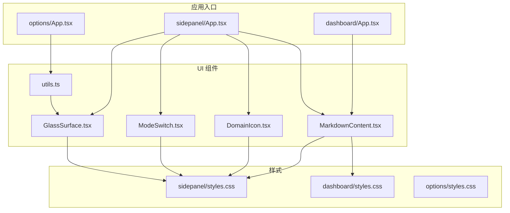
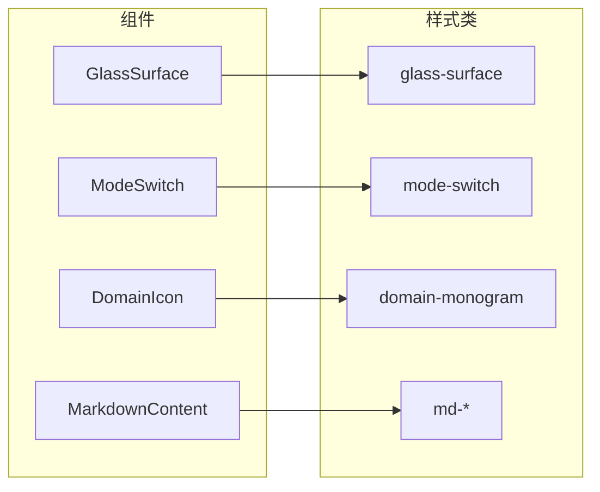
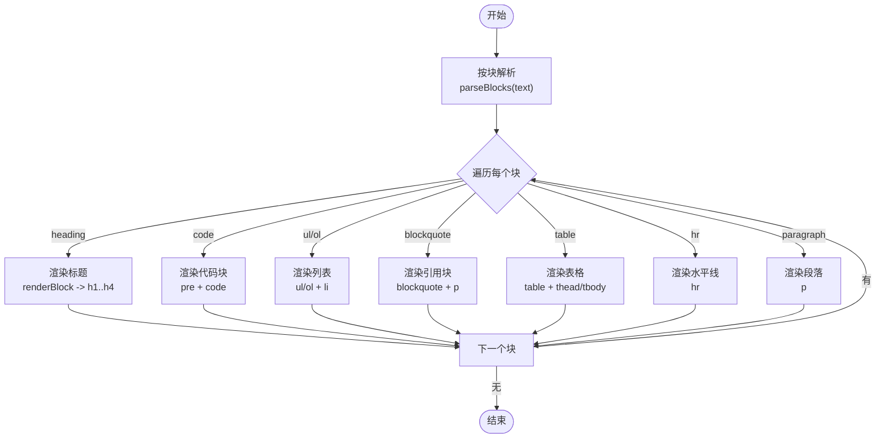
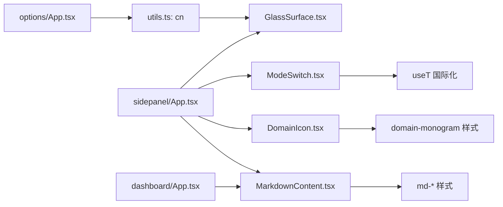

# UI组件库

<cite>
**本文引用的文件**
- [GlassSurface.tsx](file://src/ui/GlassSurface.tsx)
- [ModeSwitch.tsx](file://src/ui/ModeSwitch.tsx)
- [DomainIcon.tsx](file://src/ui/DomainIcon.tsx)
- [MarkdownContent.tsx](file://src/ui/MarkdownContent.tsx)
- [utils.ts](file://src/ui/utils.ts)
- [styles.css（侧边栏）](file://entrypoints/sidepanel/styles.css)
- [styles.css（仪表板）](file://entrypoints/dashboard/styles.css)
- [styles.css（设置页）](file://entrypoints/options/styles.css)
- [App.tsx（侧边栏）](file://entrypoints/sidepanel/App.tsx)
- [App.tsx（仪表板）](file://entrypoints/dashboard/App.tsx)
- [App.tsx（设置页）](file://entrypoints/options/App.tsx)
- [types.ts](file://src/shared/types.ts)
</cite>

## 目录
1. [简介](#简介)
2. [项目结构](#项目结构)
3. [核心组件](#核心组件)
4. [架构总览](#架构总览)
5. [详细组件分析](#详细组件分析)
6. [依赖关系分析](#依赖关系分析)
7. [性能考量](#性能考量)
8. [故障排查指南](#故障排查指南)
9. [结论](#结论)
10. [附录](#附录)

## 简介
本文件系统化梳理 BrowseMemory 的 UI 组件库，聚焦以下四个核心组件：GlassSurface 毛玻璃背景容器、ModeSwitch 主题/视图切换器、DomainIcon 域名标识图标、MarkdownContent 内容渲染器。文档从设计理念、实现细节、属性与事件接口、样式定制、组合与复用策略、使用示例与最佳实践、性能优化、响应式与无障碍支持、跨浏览器兼容性，以及 UI 工具函数与共享类型出发，帮助 UI 设计师与前端开发者高效理解与扩展组件体系。

## 项目结构
UI 组件位于 src/ui 下，配套样式集中在各入口页面的 styles.css 中；组件在多个入口应用中被复用，如侧边栏面板、仪表板与设置页。

图表来源
- [GlassSurface.tsx:1-11](file://src/ui/GlassSurface.tsx#L1-L11)
- [ModeSwitch.tsx:1-36](file://src/ui/ModeSwitch.tsx#L1-L36)
- [DomainIcon.tsx:1-21](file://src/ui/DomainIcon.tsx#L1-L21)
- [MarkdownContent.tsx:1-278](file://src/ui/MarkdownContent.tsx#L1-L278)
- [utils.ts:1-7](file://src/ui/utils.ts#L1-L7)
- [styles.css（侧边栏）:83-89](file://entrypoints/sidepanel/styles.css#L83-L89)
- [styles.css（仪表板）:266-329](file://entrypoints/dashboard/styles.css#L266-L329)
- [styles.css（设置页）:1-10](file://entrypoints/options/styles.css#L1-L10)
- [App.tsx（侧边栏）:385-628](file://entrypoints/sidepanel/App.tsx#L385-L628)
- [App.tsx（仪表板）:175-207](file://entrypoints/dashboard/App.tsx#L175-L207)
- [App.tsx（设置页）:1-529](file://entrypoints/options/App.tsx#L1-L529)

章节来源
- [GlassSurface.tsx:1-11](file://src/ui/GlassSurface.tsx#L1-L11)
- [ModeSwitch.tsx:1-36](file://src/ui/ModeSwitch.tsx#L1-L36)
- [DomainIcon.tsx:1-21](file://src/ui/DomainIcon.tsx#L1-L21)
- [MarkdownContent.tsx:1-278](file://src/ui/MarkdownContent.tsx#L1-L278)
- [utils.ts:1-7](file://src/ui/utils.ts#L1-L7)
- [styles.css（侧边栏）:83-89](file://entrypoints/sidepanel/styles.css#L83-L89)
- [styles.css（仪表板）:266-329](file://entrypoints/dashboard/styles.css#L266-L329)
- [styles.css（设置页）:1-10](file://entrypoints/options/styles.css#L1-L10)
- [App.tsx（侧边栏）:385-628](file://entrypoints/sidepanel/App.tsx#L385-L628)
- [App.tsx（仪表板）:175-207](file://entrypoints/dashboard/App.tsx#L175-L207)
- [App.tsx（设置页）:1-529](file://entrypoints/options/App.tsx#L1-L529)

## 核心组件
- GlassSurface：轻量包装器，通过类名组合实现毛玻璃视觉效果，便于在不同页面统一风格。
- ModeSwitch：双按钮切换器，用于在“记忆”和“对话”两种模式间切换，支持国际化标签与无障碍。
- DomainIcon：基于域名生成稳定色相的单字母徽标，提供一致的品牌化视觉识别。
- MarkdownContent：轻量级 Markdown 渲染器，支持标题、代码块、列表、引用、表格、水平线、段落及内联样式与引用链接点击回调。

章节来源
- [GlassSurface.tsx:1-11](file://src/ui/GlassSurface.tsx#L1-L11)
- [ModeSwitch.tsx:1-36](file://src/ui/ModeSwitch.tsx#L1-L36)
- [DomainIcon.tsx:1-21](file://src/ui/DomainIcon.tsx#L1-L21)
- [MarkdownContent.tsx:1-278](file://src/ui/MarkdownContent.tsx#L1-L278)

## 架构总览
组件与样式的映射关系如下：

图表来源
- [GlassSurface.tsx:8-9](file://src/ui/GlassSurface.tsx#L8-L9)
- [ModeSwitch.tsx:16-34](file://src/ui/ModeSwitch.tsx#L16-L34)
- [DomainIcon.tsx:12-19](file://src/ui/DomainIcon.tsx#L12-L19)
- [MarkdownContent.tsx:268-277](file://src/ui/MarkdownContent.tsx#L268-L277)
- [styles.css（侧边栏）:83-89](file://entrypoints/sidepanel/styles.css#L83-L89)
- [styles.css（侧边栏）:409-411](file://entrypoints/sidepanel/styles.css#L409-L411)
- [styles.css（侧边栏）](file://entrypoints/sidepanel/styles.css#L218)
- [styles.css（仪表板）:266-329](file://entrypoints/dashboard/styles.css#L266-L329)

## 详细组件分析

### GlassSurface 毛玻璃容器
- 设计理念
  - 以最小 API 提供一致的毛玻璃视觉与阴影，降低页面重复样式负担。
  - 通过 cn 合并工具函数安全合并类名，避免冲突。
- 属性接口
  - className: 字符串（可选），用于追加额外类名。
  - 其余继承 HTMLDivElement 的标准属性。
- 样式与定制
  - 使用 glass-surface 类名绑定变量化的边框、背景、阴影与 backdrop-filter。
  - 支持浅色/深色主题与减少动画偏好下的适配。
- 组合与复用
  - 在侧边栏面板中作为统计网格、会话列表、输入框容器等的基础背景层。
- 最佳实践
  - 仅在需要半透明与模糊背景的区域使用，避免过度滥用导致性能下降。
  - 与阴影、圆角等修饰类配合，形成统一的卡片/浮层风格。
- 性能
  - backdrop-filter 对低端设备有开销，建议在移动端谨慎使用或结合媒体查询降级。

章节来源
- [GlassSurface.tsx:1-11](file://src/ui/GlassSurface.tsx#L1-L11)
- [utils.ts:1-7](file://src/ui/utils.ts#L1-L7)
- [styles.css（侧边栏）:83-89](file://entrypoints/sidepanel/styles.css#L83-L89)
- [styles.css（侧边栏）:423-449](file://entrypoints/sidepanel/styles.css#L423-L449)
- [App.tsx（侧边栏）:418-423](file://entrypoints/sidepanel/App.tsx#L418-L423)
- [App.tsx（侧边栏）:500-529](file://entrypoints/sidepanel/App.tsx#L500-L529)
- [App.tsx（侧边栏）:550-576](file://entrypoints/sidepanel/App.tsx#L550-L576)

### ModeSwitch 主题/视图切换器
- 设计理念
  - 双按钮布局，明确当前模式状态，提供即时反馈与无障碍标签。
  - 使用国际化文案与图标增强可用性。
- 属性接口
  - mode: "memory" | "conversation"
  - onChange(mode: PanelMode): void
- 事件处理
  - 两个按钮分别触发 onChange("memory"/"conversation")。
- 样式与定制
  - 使用 mode-switch 容器与按钮 active 状态类控制外观。
  - 支持颜色方案与减少动画偏好。
- 组合与复用
  - 位于页面底部，作为全局模式切换入口，在侧边栏面板中广泛使用。
- 最佳实践
  - 将模式状态保存在上层组件状态中，并在切换时同步加载对应数据。
  - 为按钮提供 aria-label 与 role 语义，保证可访问性。

章节来源
- [ModeSwitch.tsx:1-36](file://src/ui/ModeSwitch.tsx#L1-L36)
- [styles.css（侧边栏）:409-411](file://entrypoints/sidepanel/styles.css#L409-L411)
- [styles.css（侧边栏）:451-453](file://entrypoints/sidepanel/styles.css#L451-L453)
- [App.tsx（侧边栏）](file://entrypoints/sidepanel/App.tsx#L624)

### DomainIcon 域名图标
- 设计理念
  - 基于域名字符串计算稳定色相，生成一致的单字母徽标，兼顾品牌识别与可读性。
- 属性接口
  - domain: string
- 样式与定制
  - 使用 domain-monogram 类与 CSS 变量 --domain-hue 实现色相与背景色。
  - 深浅主题下颜色对比度自动调整。
- 组合与复用
  - 在侧边栏结果列表、域分组头部等位置展示，与 chevron 图标配合展开/收起。
- 最佳实践
  - 域名预处理（去除 www.）提升首字母一致性。
  - 避免对空字符串传入，必要时提供默认占位符。

章节来源
- [DomainIcon.tsx:1-21](file://src/ui/DomainIcon.tsx#L1-L21)
- [styles.css（侧边栏）](file://entrypoints/sidepanel/styles.css#L218)
- [styles.css（侧边栏）](file://entrypoints/sidepanel/styles.css#L443)
- [App.tsx（侧边栏）:753-755](file://entrypoints/sidepanel/App.tsx#L753-L755)

### MarkdownContent 内容渲染器
- 设计理念
  - 轻量解析与渲染，覆盖常见块级与行内 Markdown 元素，同时保留可访问性与交互能力（如引用点击）。
- 支持元素
  - 块级：标题、代码块、无序/有序列表、引用块、表格、水平线、段落。
  - 行内：粗体、斜体、行内代码、链接、删除线、引用标记 [n]。
- 属性接口
  - text: string（待渲染的 Markdown 文本）
  - onCitation?: (index: number) => void（可选，引用标记点击回调）
- 解析与渲染流程
  - 先按块解析为 Block 结构，再逐块渲染为 React 节点。
  - 行内元素按优先级正则匹配，递归解析嵌套结构。
- 样式与定制
  - 使用 md-* 前缀类名，覆盖标题、列表、引用、表格、代码、链接、引用链接等样式。
  - 仪表板详情页对字体大小与行高进行局部放大。
- 组合与复用
  - 在仪表板报告详情中直接使用，作为报告正文渲染的核心组件。
- 最佳实践
  - 对外部链接使用 target="_blank" 与 rel="noopener noreferrer" 提升安全性。
  - 引用点击回调可用于打开参考文献或侧边弹窗，需在上层组件中实现。

图表来源
- [MarkdownContent.tsx:97-204](file://src/ui/MarkdownContent.tsx#L97-L204)
- [MarkdownContent.tsx:208-264](file://src/ui/MarkdownContent.tsx#L208-L264)
- [MarkdownContent.tsx:15-71](file://src/ui/MarkdownContent.tsx#L15-L71)
- [styles.css（仪表板）:266-329](file://entrypoints/dashboard/styles.css#L266-L329)

章节来源
- [MarkdownContent.tsx:1-278](file://src/ui/MarkdownContent.tsx#L1-L278)
- [styles.css（仪表板）:266-329](file://entrypoints/dashboard/styles.css#L266-L329)
- [App.tsx（仪表板）:202-204](file://entrypoints/dashboard/App.tsx#L202-L204)

## 依赖关系分析
- 组件依赖
  - GlassSurface 依赖 UI 工具函数 cn 进行类名合并。
  - ModeSwitch 依赖国际化钩子 useT 与图标库。
  - DomainIcon 依赖 CSS 变量与主题色系。
  - MarkdownContent 依赖自身内部解析器与样式类。
- 应用入口依赖
  - 侧边栏 App 多处组合使用上述组件，形成完整的记忆/对话工作流。
  - 仪表板 App 使用 MarkdownContent 渲染报告正文。
  - 设置页 App 未直接使用上述组件，但依赖 UI 工具函数 cn。

图表来源
- [utils.ts:1-7](file://src/ui/utils.ts#L1-L7)
- [GlassSurface.tsx](file://src/ui/GlassSurface.tsx#L3)
- [ModeSwitch.tsx](file://src/ui/ModeSwitch.tsx#L3)
- [DomainIcon.tsx:14-15](file://src/ui/DomainIcon.tsx#L14-L15)
- [MarkdownContent.tsx:268-277](file://src/ui/MarkdownContent.tsx#L268-L277)
- [App.tsx（侧边栏）:31-41](file://entrypoints/sidepanel/App.tsx#L31-L41)
- [App.tsx（仪表板）:6-8](file://entrypoints/dashboard/App.tsx#L6-L8)
- [App.tsx（设置页）:19-22](file://entrypoints/options/App.tsx#L19-L22)

章节来源
- [utils.ts:1-7](file://src/ui/utils.ts#L1-L7)
- [GlassSurface.tsx:1-11](file://src/ui/GlassSurface.tsx#L1-L11)
- [ModeSwitch.tsx:1-36](file://src/ui/ModeSwitch.tsx#L1-L36)
- [DomainIcon.tsx:1-21](file://src/ui/DomainIcon.tsx#L1-L21)
- [MarkdownContent.tsx:1-278](file://src/ui/MarkdownContent.tsx#L1-L278)
- [App.tsx（侧边栏）:31-41](file://entrypoints/sidepanel/App.tsx#L31-L41)
- [App.tsx（仪表板）:6-8](file://entrypoints/dashboard/App.tsx#L6-L8)
- [App.tsx（设置页）:19-22](file://entrypoints/options/App.tsx#L19-L22)

## 性能考量
- 毛玻璃效果
  - backdrop-filter 在低端设备/移动设备可能带来显著开销，建议：
    - 限制使用范围，仅在关键浮层使用。
    - 结合媒体查询在低性能设备上禁用或弱化模糊。
    - 控制模糊半径与饱和度参数，避免过度渲染。
- Markdown 渲染
  - 正则解析与递归渲染在长文本时可能产生性能压力：
    - 对超长报告采用分页/懒加载或服务端裁剪。
    - 缓存解析结果（若文本稳定），避免重复解析。
    - 将外部链接渲染为静态只读，减少交互节点数量。
- 列表与滚动
  - 侧边栏使用 IntersectionObserver 懒加载日期分组，减少初始渲染成本。
  - 建议对搜索结果与消息列表采用虚拟化（如需要）进一步优化。
- 动画与过渡
  - 减少动画偏好场景下，应将关键动画时长缩短至极短，保持交互流畅。

## 故障排查指南
- 毛玻璃不生效
  - 检查 glass-surface 类是否正确应用，以及主题变量是否在当前页面生效。
  - 确认浏览器对 backdrop-filter 的支持与启用状态。
- 切换模式无效
  - 确认 ModeSwitch 的 onChange 回调已正确绑定到上层状态管理。
  - 检查 aria-label 与按钮类型，确保可访问性测试通过。
- 域名图标颜色异常
  - 检查 domain-monogram 样式与 --domain-hue 变量是否注入。
  - 确保传入的 domain 字符串非空，必要时提供默认值。
- Markdown 引用点击无响应
  - 确认 onCitation 回调已传入且在上层组件中实现。
  - 检查按钮的点击事件是否被上层容器阻止冒泡。
- 仪表板报告空白
  - 确认 ReportRecord 的 content 字段非空，且 MarkdownContent 已正确渲染。
  - 检查 md-* 样式是否被目标页面样式覆盖。

章节来源
- [styles.css（侧边栏）:83-89](file://entrypoints/sidepanel/styles.css#L83-L89)
- [styles.css（侧边栏）:409-411](file://entrypoints/sidepanel/styles.css#L409-L411)
- [styles.css（侧边栏）](file://entrypoints/sidepanel/styles.css#L218)
- [styles.css（仪表板）:266-329](file://entrypoints/dashboard/styles.css#L266-L329)
- [MarkdownContent.tsx:34-37](file://src/ui/MarkdownContent.tsx#L34-L37)
- [App.tsx（仪表板）:202-204](file://entrypoints/dashboard/App.tsx#L202-L204)

## 结论
BrowseMemory 的 UI 组件库以简洁、可复用为核心，通过少量高内聚组件与统一的样式变量，实现了跨页面的一致体验。GlassSurface 提供统一的视觉基底，ModeSwitch 实现清晰的模式切换，DomainIcon 增强了域名识别，MarkdownContent 则满足了报告与提示信息的渲染需求。遵循本文的最佳实践与性能建议，可在保证可访问性与跨浏览器兼容的前提下，高效扩展与集成到更多界面。

## 附录

### 组件属性与事件速查
- GlassSurface
  - 属性：className（可选）
  - 用途：包裹需要毛玻璃背景的区域
- ModeSwitch
  - 属性：mode（"memory"|"conversation"）、onChange(mode)
  - 用途：全局模式切换
- DomainIcon
  - 属性：domain（string）
  - 用途：显示域名首字母徽标
- MarkdownContent
  - 属性：text（string）、onCitation?（index => void）
  - 用途：渲染报告正文与提示信息

章节来源
- [GlassSurface.tsx:5-10](file://src/ui/GlassSurface.tsx#L5-L10)
- [ModeSwitch.tsx:7-13](file://src/ui/ModeSwitch.tsx#L7-L13)
- [DomainIcon.tsx:9-10](file://src/ui/DomainIcon.tsx#L9-L10)
- [MarkdownContent.tsx:268-274](file://src/ui/MarkdownContent.tsx#L268-L274)

### 组合使用模式与复用策略
- 侧边栏面板
  - 使用 GlassSurface 包裹统计网格、会话列表与输入框容器。
  - 使用 ModeSwitch 切换记忆/对话视图。
  - 使用 DomainIcon 与 chevron 图标配合域分组展开/收起。
- 仪表板
  - 使用 MarkdownContent 渲染报告正文，结合 md-* 样式进行局部放大。
- 设置页
  - 通过 UI 工具函数 cn 合并类名，统一卡片与表单风格。

章节来源
- [App.tsx（侧边栏）:418-423](file://entrypoints/sidepanel/App.tsx#L418-L423)
- [App.tsx（侧边栏）](file://entrypoints/sidepanel/App.tsx#L624)
- [App.tsx（侧边栏）:692-703](file://entrypoints/sidepanel/App.tsx#L692-L703)
- [App.tsx（仪表板）:202-204](file://entrypoints/dashboard/App.tsx#L202-L204)
- [App.tsx（设置页）:19-22](file://entrypoints/options/App.tsx#L19-L22)

### 响应式设计与无障碍支持
- 响应式
  - 侧边栏与仪表板均提供断点与网格布局，确保小屏设备可用。
  - 减少动画偏好场景下，关键动画时长被缩短。
- 无障碍
  - ModeSwitch 提供 aria-label 与按钮角色。
  - 输入与按钮使用合适的语义标签与键盘可达性。
  - 外部链接使用安全属性，避免跳转风险。

章节来源
- [styles.css（侧边栏）:416-421](file://entrypoints/sidepanel/styles.css#L416-L421)
- [styles.css（侧边栏）:451-453](file://entrypoints/sidepanel/styles.css#L451-L453)
- [styles.css（仪表板）:362-379](file://entrypoints/dashboard/styles.css#L362-L379)
- [ModeSwitch.tsx](file://src/ui/ModeSwitch.tsx#L16)

### 跨浏览器兼容性
- backdrop-filter：在部分旧版浏览器可能不可用，建议提供降级方案（如纯色背景）。
- CSS 变量：确保在目标浏览器中可用，必要时提供回退值。
- SVG 图标：Lucide React 图标库具备良好兼容性，注意在无 JS 环境下的降级。

### UI 工具函数与共享类型
- UI 工具函数
  - cn(...inputs): 使用 clsx 与 tailwind-merge 合并类名，避免冲突。
- 共享类型
  - AppSettings、PageRecord、SearchResult、ReportRecord 等类型在组件与客户端之间传递数据契约，确保类型安全。

章节来源
- [utils.ts:1-7](file://src/ui/utils.ts#L1-L7)
- [types.ts:6-22](file://src/shared/types.ts#L6-L22)
- [types.ts:32-41](file://src/shared/types.ts#L32-L41)
- [types.ts:48-53](file://src/shared/types.ts#L48-L53)
- [types.ts:129-138](file://src/shared/types.ts#L129-L138)