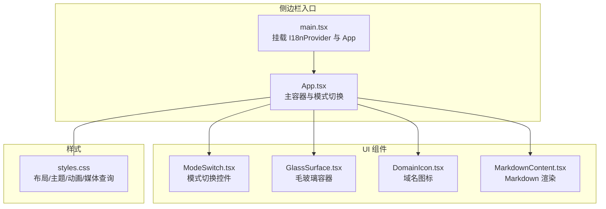
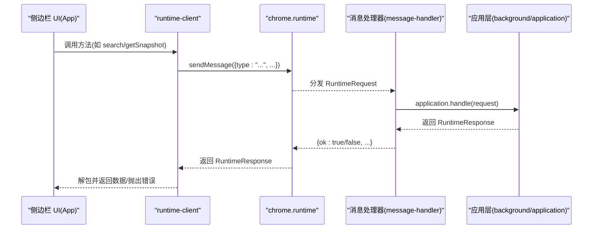
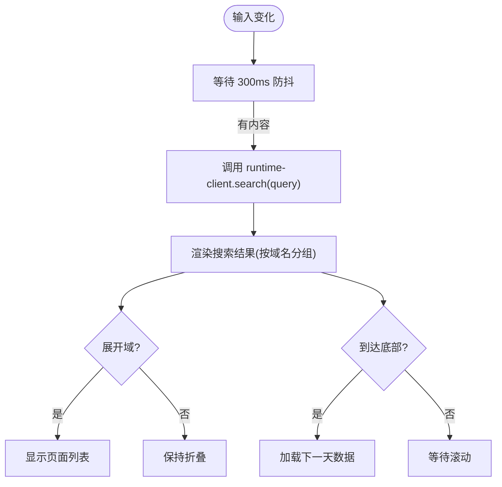
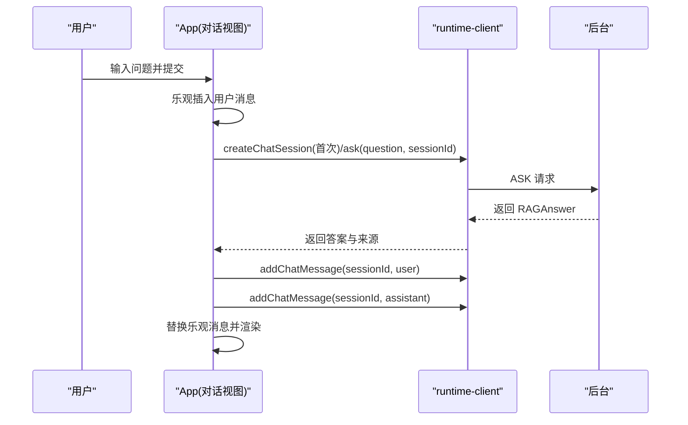
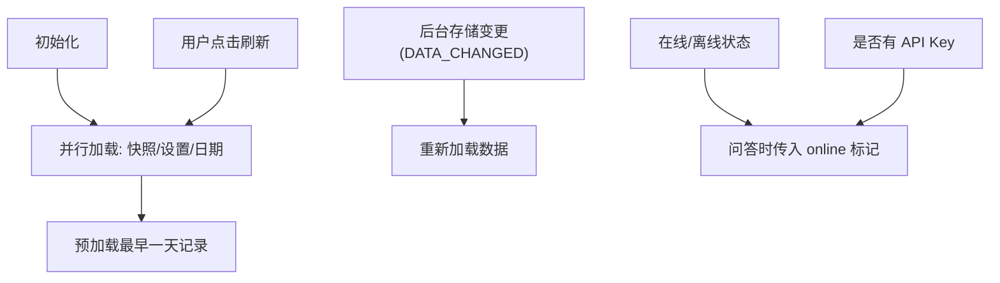
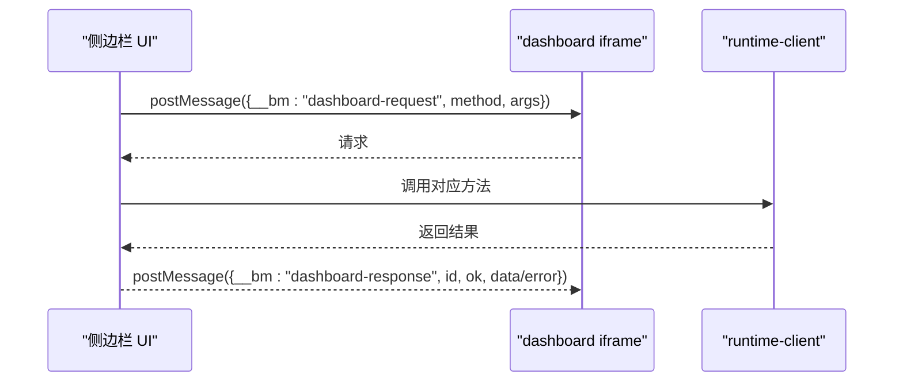
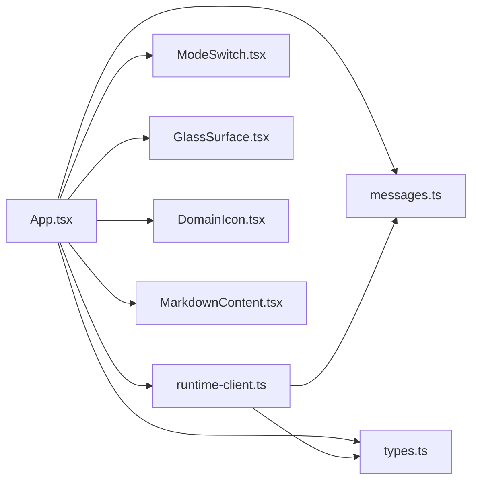

# 侧边栏面板

<cite>
**本文档引用的文件**
- [App.tsx](file://entrypoints/sidepanel/App.tsx)
- [main.tsx](file://entrypoints/sidepanel/main.tsx)
- [styles.css](file://entrypoints/sidepanel/styles.css)
- [runtime-client.ts](file://src/ui/runtime-client.ts)
- [types.ts](file://src/shared/types.ts)
- [messages.ts](file://src/shared/messages.ts)
- [ModeSwitch.tsx](file://src/ui/ModeSwitch.tsx)
- [GlassSurface.tsx](file://src/ui/GlassSurface.tsx)
- [DomainIcon.tsx](file://src/ui/DomainIcon.tsx)
- [MarkdownContent.tsx](file://src/ui/MarkdownContent.tsx)
- [message-handler.ts](file://src/background/message-handler.ts)
- [2026-06-09-phase-1-mvp-design.md](file://docs/superpowers/specs/2026-06-09-phase-1-mvp-design.md)
- [README.md](file://README.md)
- [App.test.tsx](file://tests/sidepanel/App.test.tsx)
</cite>

## 目录
1. [简介](#简介)
2. [项目结构](#项目结构)
3. [核心组件](#核心组件)
4. [架构总览](#架构总览)
5. [详细组件分析](#详细组件分析)
6. [依赖关系分析](#依赖关系分析)
7. [性能考量](#性能考量)
8. [故障排查指南](#故障排查指南)
9. [结论](#结论)
10. [附录](#附录)

## 简介
本文件为 BrowseMemory 侧边栏面板的详细 UI 文档，聚焦于作为主要用户交互界面的设计理念与实现架构。文档涵盖以下主题：
- 搜索界面、AI 问答界面与实时数据更新的组件结构
- 与后台服务的消息通信机制（runtime-client 的数据获取与状态同步）
- 侧边栏布局、响应式设计与用户体验优化
- 组件状态管理、事件处理与用户交互响应
- 如何扩展侧边栏功能与自定义界面元素
- 集成指南与最佳实践

## 项目结构
侧边栏入口由 React 应用驱动，采用“固定工具栏 + 内容区 + 固定底部模式切换”的三段式布局；样式采用“Quiet Glass”风格，强调半透明与毛玻璃效果，并针对 320–480px 宽度进行优化。

图表来源
- [main.tsx:1-18](file://entrypoints/sidepanel/main.tsx#L1-L18)
- [App.tsx:64-628](file://entrypoints/sidepanel/App.tsx#L64-L628)
- [ModeSwitch.tsx:1-36](file://src/ui/ModeSwitch.tsx#L1-L36)
- [GlassSurface.tsx:1-11](file://src/ui/GlassSurface.tsx#L1-L11)
- [DomainIcon.tsx:1-21](file://src/ui/DomainIcon.tsx#L1-L21)
- [MarkdownContent.tsx:1-278](file://src/ui/MarkdownContent.tsx#L1-L278)
- [styles.css:1-454](file://entrypoints/sidepanel/styles.css#L1-L454)

章节来源
- [main.tsx:1-18](file://entrypoints/sidepanel/main.tsx#L1-L18)
- [styles.css:1-454](file://entrypoints/sidepanel/styles.css#L1-L454)
- [2026-06-09-phase-1-mvp-design.md:72-99](file://docs/superpowers/specs/2026-06-09-phase-1-mvp-design.md#L72-L99)

## 核心组件
- App（主容器）
  - 状态：模式（记忆/对话）、快照、API Key 状态、搜索输入、搜索结果、忙碌/错误状态、日期分组与域展开状态、聊天视图与会话消息等
  - 生命周期：初始化加载、键盘快捷键聚焦搜索、滚动懒加载、监听后台数据变更事件
  - 交互：搜索防抖、域折叠/展开、打开链接、打开设置/仪表盘、发起问答、会话列表与消息管理
- ModeSwitch（模式切换）
  - 在“记忆”和“对话”之间切换，使用系统图标与文案
- GlassSurface（毛玻璃容器）
  - 通用的半透明卡片容器，统一视觉风格
- DomainIcon（域名图标）
  - 基于域名哈希计算色相，生成首字母徽标
- MarkdownContent（Markdown 渲染）
  - 支持标题、代码块、列表、引用、表格、水平线、段落及内联加粗/斜体/删除线/行内代码/链接/引用标记

章节来源
- [App.tsx:64-628](file://entrypoints/sidepanel/App.tsx#L64-L628)
- [ModeSwitch.tsx:1-36](file://src/ui/ModeSwitch.tsx#L1-L36)
- [GlassSurface.tsx:1-11](file://src/ui/GlassSurface.tsx#L1-L11)
- [DomainIcon.tsx:1-21](file://src/ui/DomainIcon.tsx#L1-L21)
- [MarkdownContent.tsx:1-278](file://src/ui/MarkdownContent.tsx#L1-L278)

## 架构总览
侧边栏通过 runtime-client 封装与后台服务的通信，使用 chrome.runtime.sendMessage 发送请求并接收响应；后台通过消息处理器将请求路由到应用层，返回标准化的 RuntimeResponse。

图表来源
- [runtime-client.ts:18-182](file://src/ui/runtime-client.ts#L18-L182)
- [messages.ts:13-71](file://src/shared/messages.ts#L13-L71)
- [message-handler.ts:6-22](file://src/background/message-handler.ts#L6-L22)

章节来源
- [runtime-client.ts:18-182](file://src/ui/runtime-client.ts#L18-L182)
- [messages.ts:13-71](file://src/shared/messages.ts#L13-L71)
- [message-handler.ts:6-22](file://src/background/message-handler.ts#L6-L22)

## 详细组件分析

### 搜索界面（记忆模式）
- 输入框与快捷键
  - 支持 ⌘K 快捷键聚焦并全选搜索框
  - 输入变化触发 300ms 防抖，调用 runtime-client.search 获取结果
- 结果展示
  - 按域名分组，支持折叠/展开
  - 每个域名下显示页面列表，含标题、时长、摘要片段
  - 通过 DomainIcon 与 DomainGroupItem 实现统一的视觉与交互
- 懒加载与分页
  - 使用 IntersectionObserver 观察哨兵元素，滚动到底部时加载下一天数据
  - 通过 getDistinctDates 与 getRecordsByDate 实现按天分页

图表来源
- [App.tsx:261-280](file://entrypoints/sidepanel/App.tsx#L261-L280)
- [App.tsx:234-259](file://entrypoints/sidepanel/App.tsx#L234-L259)
- [App.tsx:457-477](file://entrypoints/sidepanel/App.tsx#L457-L477)
- [App.tsx:653-714](file://entrypoints/sidepanel/App.tsx#L653-L714)

章节来源
- [App.tsx:164-183](file://entrypoints/sidepanel/App.tsx#L164-L183)
- [App.tsx:261-280](file://entrypoints/sidepanel/App.tsx#L261-L280)
- [App.tsx:234-259](file://entrypoints/sidepanel/App.tsx#L234-L259)
- [App.tsx:653-714](file://entrypoints/sidepanel/App.tsx#L653-L714)

### AI 问答界面（对话模式）
- 会话管理
  - 列表：展示会话标题与最后更新时间，支持删除
  - 新建：清空当前会话与消息，进入“新建”视图
  - 打开会话：拉取会话与消息，进入“详情”视图
- 问答流程
  - 用户输入问题，乐观更新（先插入一条用户消息）
  - 若无会话则先创建会话，再调用 runtime-client.ask 获取答案
  - 成功后持久化用户消息与助手消息，替换乐观占位
  - 失败时回滚乐观消息并提示错误
- Markdown 渲染与来源
  - 使用 MarkdownContent 渲染回答文本，支持引用标记点击
  - 显示来源列表，点击打开对应页面

图表来源
- [App.tsx:291-349](file://entrypoints/sidepanel/App.tsx#L291-L349)
- [App.tsx:351-383](file://entrypoints/sidepanel/App.tsx#L351-L383)
- [runtime-client.ts:93-132](file://src/ui/runtime-client.ts#L93-L132)
- [types.ts:75-97](file://src/shared/types.ts#L75-L97)

章节来源
- [App.tsx:291-349](file://entrypoints/sidepanel/App.tsx#L291-L349)
- [App.tsx:351-383](file://entrypoints/sidepanel/App.tsx#L351-L383)
- [runtime-client.ts:93-132](file://src/ui/runtime-client.ts#L93-L132)
- [types.ts:75-97](file://src/shared/types.ts#L75-L97)

### 实时数据更新与状态同步
- 初始化与刷新
  - 首次渲染时并行加载今日快照、设置与日期列表，并预加载最早一天的记录
  - 提供刷新按钮手动触发重新加载
- 后台变更通知
  - 监听 chrome.runtime.onMessage，收到 DATA_CHANGED 时自动刷新
- 在线/离线与 API Key 状态
  - 通过 getSettings 判断是否配置 API Key
  - 通过 navigator.onLine 判断网络状态，影响问答行为

图表来源
- [App.tsx:185-206](file://entrypoints/sidepanel/App.tsx#L185-L206)
- [App.tsx:213-225](file://entrypoints/sidepanel/App.tsx#L213-L225)
- [runtime-client.ts:58-64](file://src/ui/runtime-client.ts#L58-L64)
- [runtime-client.ts:93-99](file://src/ui/runtime-client.ts#L93-L99)

章节来源
- [App.tsx:185-206](file://entrypoints/sidepanel/App.tsx#L185-L206)
- [App.tsx:213-225](file://entrypoints/sidepanel/App.tsx#L213-L225)
- [runtime-client.ts:58-64](file://src/ui/runtime-client.ts#L58-L64)
- [runtime-client.ts:93-99](file://src/ui/runtime-client.ts#L93-L99)

### 仪表盘与设置弹窗
- 设置弹窗
  - 打开 options.html 的 iframe，支持关闭
- 仪表盘弹窗
  - 打开 dashboard.html 的 iframe，内置 postMessage 桥接
  - 代理来自 iframe 的请求（如 getReports/getReport/generateReport/openUrl/openOptions），通过 runtime-client 调用后台并回传结果或错误

图表来源
- [App.tsx:99-157](file://entrypoints/sidepanel/App.tsx#L99-L157)
- [runtime-client.ts:137-157](file://src/ui/runtime-client.ts#L137-L157)

章节来源
- [App.tsx:99-157](file://entrypoints/sidepanel/App.tsx#L99-L157)
- [runtime-client.ts:137-157](file://src/ui/runtime-client.ts#L137-L157)

### 响应式设计与用户体验
- 布局
  - 固定工具栏与底部模式切换，内容区自适应滚动
  - 记忆模式网格指标（桌面端 4 列，移动端 2 列）
- 主题与动画
  - 支持浅色/深色主题，使用 CSS 变量与暗色系变量
  - 加载动画（旋转指示器）、悬停反馈、平滑滚动至消息底部
- 可访问性
  - 为按钮与输入框提供 aria-label
  - 错误横幅与状态点提示

章节来源
- [styles.css:28-454](file://entrypoints/sidepanel/styles.css#L28-L454)
- [App.tsx:386-627](file://entrypoints/sidepanel/App.tsx#L386-L627)

## 依赖关系分析
- 组件耦合
  - App 依赖 runtime-client、i18n、UI 组合件（ModeSwitch、GlassSurface、DomainIcon、MarkdownContent）
  - 子组件（DayGroupedList/SearchResultList/DomainGroupItem/PageRow/ChatBubble）职责清晰，通过 props 传递数据与回调
- 外部依赖
  - chrome.runtime（消息通信）
  - lucide-react（图标）
  - react（组件模型）

图表来源
- [App.tsx:64-628](file://entrypoints/sidepanel/App.tsx#L64-L628)
- [runtime-client.ts:26-48](file://src/ui/runtime-client.ts#L26-L48)
- [types.ts:1-139](file://src/shared/types.ts#L1-L139)
- [messages.ts:13-71](file://src/shared/messages.ts#L13-L71)

章节来源
- [App.tsx:64-628](file://entrypoints/sidepanel/App.tsx#L64-L628)
- [runtime-client.ts:26-48](file://src/ui/runtime-client.ts#L26-L48)
- [types.ts:1-139](file://src/shared/types.ts#L1-L139)
- [messages.ts:13-71](file://src/shared/messages.ts#L13-L71)

## 性能考量
- 搜索防抖
  - 300ms 防抖减少频繁网络请求，提升交互流畅度
- 懒加载
  - 按天加载记录，避免一次性渲染大量 DOM
- 乐观 UI
  - 问答时先插入用户消息，降低感知延迟
- 资源与样式
  - 使用 CSS 变量与媒体查询，减少重复样式与重排
- 可访问性与无障碍
  - 提供键盘快捷键与 aria 属性，改善可访问性

章节来源
- [App.tsx:261-280](file://entrypoints/sidepanel/App.tsx#L261-L280)
- [App.tsx:234-259](file://entrypoints/sidepanel/App.tsx#L234-L259)
- [App.tsx:291-349](file://entrypoints/sidepanel/App.tsx#L291-L349)
- [styles.css:416-454](file://entrypoints/sidepanel/styles.css#L416-L454)

## 故障排查指南
- 常见错误类型
  - BrowseMemoryError：由 runtime-client 包装后台返回的错误，包含 code 与 message
  - 网络/权限/配置错误：通过错误横幅提示，必要时引导至设置页
- 排查步骤
  - 确认 API Key 是否配置（getSettings）
  - 检查网络状态（navigator.onLine）与在线/离线问答行为
  - 查看错误横幅与控制台日志
  - 通过刷新按钮或后台变更通知触发重载
- 相关实现
  - runtime-client 对后台响应进行校验与错误包装
  - 消息处理器捕获异常并返回标准化错误对象

章节来源
- [runtime-client.ts:12-24](file://src/ui/runtime-client.ts#L12-L24)
- [runtime-client.ts:58-64](file://src/ui/runtime-client.ts#L58-L64)
- [message-handler.ts:6-22](file://src/background/message-handler.ts#L6-L22)
- [App.tsx:203-205](file://entrypoints/sidepanel/App.tsx#L203-L205)

## 结论
侧边栏面板以“记忆模式 + 对话模式”的双模导航为核心，结合防抖搜索、懒加载、乐观 UI 与毛玻璃视觉风格，提供了高效、顺滑且可访问的本地优先体验。通过 runtime-client 与后台服务的标准化消息协议，实现了稳定的数据获取与状态同步。设计文档与测试用例共同保障了跨宽度与主题的一致性与可用性。

## 附录

### 集成指南与最佳实践
- 集成步骤
  - 在 main.tsx 中挂载 I18nProvider 与 App
  - 通过 runtime-client 注入客户端实例，或在预览模式下使用 preview-client
  - 在 styles.css 中引入侧边栏样式
- 最佳实践
  - 使用 GlassSurface 统一卡片风格
  - 为交互元素提供 aria-label 与键盘快捷键
  - 控制搜索防抖与懒加载阈值，平衡性能与体验
  - 通过错误横幅与状态点提示用户关键信息
- 扩展建议
  - 新增 UI 组件时遵循 cn 工具函数合并类名
  - 通过 messages.ts 与 message-handler.ts 扩展后台能力
  - 使用测试用例验证交互与状态流

章节来源
- [main.tsx:9-17](file://entrypoints/sidepanel/main.tsx#L9-L17)
- [styles.css:83-89](file://entrypoints/sidepanel/styles.css#L83-L89)
- [utils.ts:4-6](file://src/ui/utils.ts#L4-L6)
- [messages.ts:13-71](file://src/shared/messages.ts#L13-L71)
- [message-handler.ts:6-22](file://src/background/message-handler.ts#L6-L22)
- [App.test.tsx:108-262](file://tests/sidepanel/App.test.tsx#L108-L262)