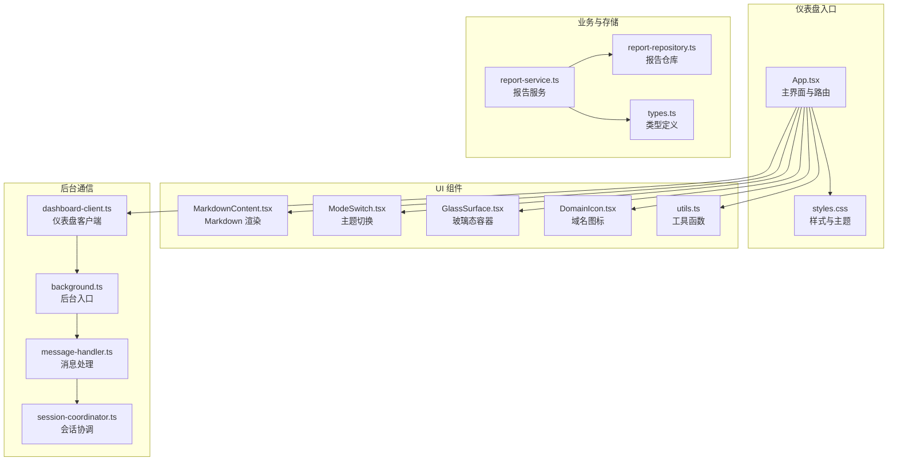
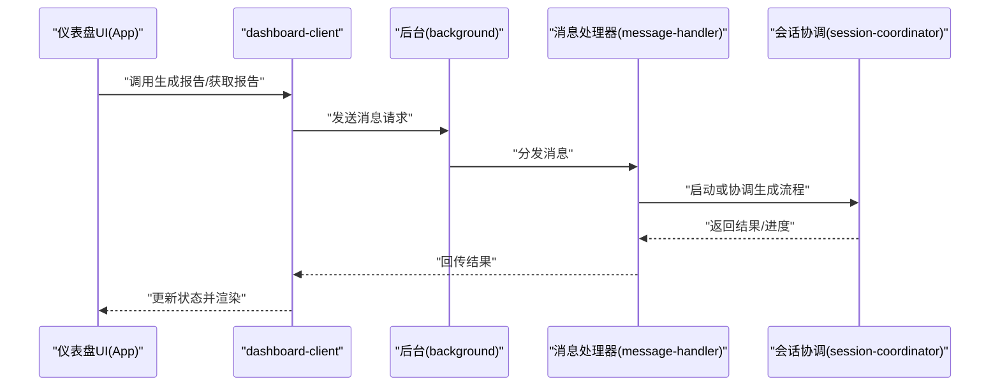
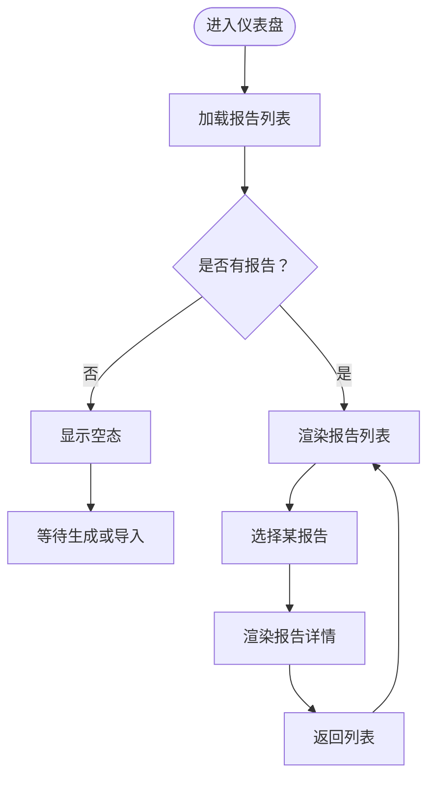
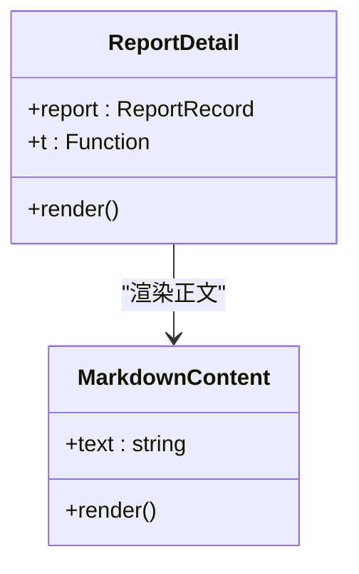
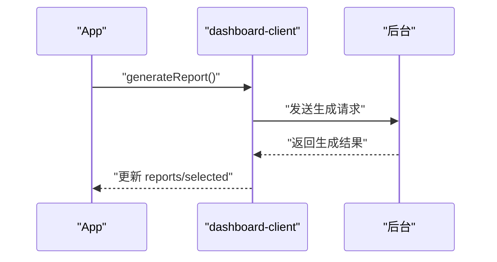
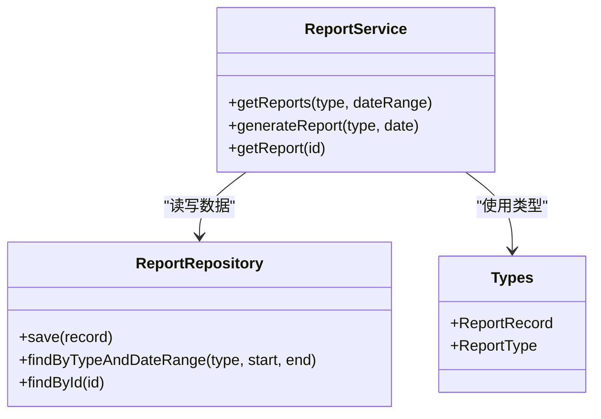
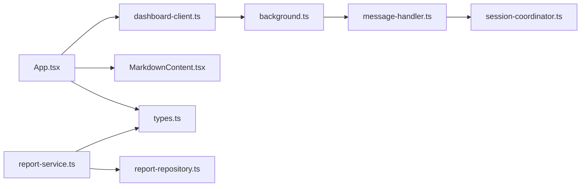

# 报告仪表盘

<cite>
**本文引用的文件**
- [App.tsx](file://entrypoints/dashboard/App.tsx)
- [dashboard-client.ts](file://src/ui/dashboard-client.ts)
- [MarkdownContent.tsx](file://src/ui/MarkdownContent.tsx)
- [report-service.ts](file://src/reports/report-service.ts)
- [report-repository.ts](file://src/storage/report-repository.ts)
- [types.ts](file://src/shared/types.ts)
- [styles.css](file://entrypoints/dashboard/styles.css)
- [runtime-client.ts](file://src/ui/runtime-client.ts)
- [ModeSwitch.tsx](file://src/ui/ModeSwitch.tsx)
- [GlassSurface.tsx](file://src/ui/GlassSurface.tsx)
- [DomainIcon.tsx](file://src/ui/DomainIcon.tsx)
- [utils.ts](file://src/ui/utils.ts)
- [settings-repository.ts](file://src/storage/settings-repository.ts)
- [background.ts](file://entrypoints/background.ts)
- [message-handler.ts](file://src/background/message-handler.ts)
- [session-coordinator.ts](file://src/background/session-coordinator.ts)
</cite>

## 目录
1. [简介](#简介)
2. [项目结构](#项目结构)
3. [核心组件](#核心组件)
4. [架构总览](#架构总览)
5. [详细组件分析](#详细组件分析)
6. [依赖关系分析](#依赖关系分析)
7. [性能考虑](#性能考虑)
8. [故障排查指南](#故障排查指南)
9. [结论](#结论)
10. [附录](#附录)

## 简介
本文件面向开发者与产品人员，系统性梳理 BrowseMemory 报告仪表盘的 UI 架构与数据可视化实现，覆盖日报、周报、月报的界面布局与交互设计；解释 Markdown 内容渲染、报告列表展示与导出能力；阐述与后台报告服务的数据通信机制与实时更新策略；并给出响应式设计、主题切换与个性化设置的实现要点，以及图表与统计信息的交互式分析思路。最后提供扩展新报告类型与定制化界面的方法。

## 项目结构
报告仪表盘位于入口应用“dashboard”中，采用 React 组件化组织，配合 UI 工具模块与后台通信层协同工作。核心目录与职责如下：
- 入口与样式：dashboard 的应用入口、HTML 模板与样式文件负责整体布局与主题适配。
- UI 组件：Markdown 渲染、模式切换、玻璃态背景等通用 UI 组件。
- 业务逻辑：报告服务封装生成与查询流程；存储层提供报告持久化接口。
- 后台通信：dashboard-client 提供与后台消息通道的统一客户端；后台通过消息处理器协调会话与任务。

**图示来源**
- [App.tsx:1-207](file://entrypoints/dashboard/App.tsx#L1-L207)
- [styles.css](file://entrypoints/dashboard/styles.css)
- [MarkdownContent.tsx](file://src/ui/MarkdownContent.tsx)
- [ModeSwitch.tsx](file://src/ui/ModeSwitch.tsx)
- [GlassSurface.tsx](file://src/ui/GlassSurface.tsx)
- [DomainIcon.tsx](file://src/ui/DomainIcon.tsx)
- [utils.ts](file://src/ui/utils.ts)
- [report-service.ts](file://src/reports/report-service.ts)
- [report-repository.ts](file://src/storage/report-repository.ts)
- [types.ts](file://src/shared/types.ts)
- [dashboard-client.ts](file://src/ui/dashboard-client.ts)
- [background.ts](file://entrypoints/background.ts)
- [message-handler.ts](file://src/background/message-handler.ts)
- [session-coordinator.ts](file://src/background/session-coordinator.ts)

**章节来源**
- [App.tsx:1-207](file://entrypoints/dashboard/App.tsx#L1-L207)
- [styles.css](file://entrypoints/dashboard/styles.css)

## 核心组件
- 主界面 App：维护活动标签页（日报/周报/月报）、报告列表与详情展示、加载与错误状态、生成按钮与设置跳转。
- 报告详情 ReportDetail：渲染标题、元信息、话题标签与 Markdown 正文。
- MarkdownContent：对报告正文进行安全渲染。
- dashboard-client：封装与后台通信的客户端接口，包括获取报告、获取单个报告、生成报告、打开设置与外部链接。
- 报告服务 report-service：封装报告生成与查询的业务逻辑，连接存储层与 AI 能力。
- 存储层 report-repository：提供报告的增删查改与聚合查询。
- 类型系统 types：统一定义 ReportRecord、ReportType 等核心数据模型。
- 错误与运行时：runtime-client 提供统一错误类型与提示。

**章节来源**
- [App.tsx:1-207](file://entrypoints/dashboard/App.tsx#L1-L207)
- [MarkdownContent.tsx](file://src/ui/MarkdownContent.tsx)
- [dashboard-client.ts](file://src/ui/dashboard-client.ts)
- [report-service.ts](file://src/reports/report-service.ts)
- [report-repository.ts](file://src/storage/report-repository.ts)
- [types.ts](file://src/shared/types.ts)
- [runtime-client.ts](file://src/ui/runtime-client.ts)

## 架构总览
仪表盘采用“前端视图 + 客户端桥接 + 后台消息”的分层架构：
- 视图层：React 组件负责 UI 呈现与用户交互。
- 客户端层：dashboard-client 封装消息发送与回调处理，屏蔽后台细节。
- 后台层：background.ts 注入全局消息处理器与会话协调器，执行具体任务（如触发报告生成）。
- 存储层：report-repository 与数据库交互，提供报告数据访问。

**图示来源**
- [App.tsx:1-207](file://entrypoints/dashboard/App.tsx#L1-L207)
- [dashboard-client.ts](file://src/ui/dashboard-client.ts)
- [background.ts](file://entrypoints/background.ts)
- [message-handler.ts](file://src/background/message-handler.ts)
- [session-coordinator.ts](file://src/background/session-coordinator.ts)

## 详细组件分析

### 主界面 App 与标签页导航
- 标签页枚举：支持 daily、weekly、monthly 三类报告类型。
- 状态管理：活动标签 activeTab、报告列表 reports、选中项 selected、加载 loading、生成 generating、错误 error、缺失密钥 missingApiKey。
- 列表渲染：侧边栏展示报告列表，点击项高亮；空态显示日历图标与文案。
- 详情渲染：主区域根据选中报告渲染 ReportDetail。
- 错误处理：当出现错误且缺失 API Key 时，显示前往设置按钮。

**图示来源**
- [App.tsx:1-207](file://entrypoints/dashboard/App.tsx#L1-L207)

**章节来源**
- [App.tsx:1-207](file://entrypoints/dashboard/App.tsx#L1-L207)

### 报告详情组件 ReportDetail
- 结构组成：标题、元信息（日期与页数）、话题标签区、Markdown 正文区。
- 话题标签：当存在话题时渲染标签集合。
- 正文渲染：使用 MarkdownContent 对 report.content 进行渲染。

**图示来源**
- [App.tsx:175-207](file://entrypoints/dashboard/App.tsx#L175-L207)
- [MarkdownContent.tsx](file://src/ui/MarkdownContent.tsx)

**章节来源**
- [App.tsx:175-207](file://entrypoints/dashboard/App.tsx#L175-L207)

### Markdown 内容渲染
- 组件职责：接收 report.content 并进行安全渲染，保证在仪表盘中的可读性与一致性。
- 集成位置：ReportDetail 中直接使用 MarkdownContent 渲染报告正文。

**章节来源**
- [MarkdownContent.tsx](file://src/ui/MarkdownContent.tsx)

### 后台通信与实时更新
- dashboard-client：封装与后台的消息通道，提供获取报告、获取单个报告、生成报告、打开设置与外部链接等方法。
- 实时更新：当生成流程完成或后台推送状态变更时，通过客户端回调刷新 UI 状态（loading/generating/error）。

**图示来源**
- [dashboard-client.ts](file://src/ui/dashboard-client.ts)
- [App.tsx:1-207](file://entrypoints/dashboard/App.tsx#L1-L207)

**章节来源**
- [dashboard-client.ts](file://src/ui/dashboard-client.ts)
- [App.tsx:1-207](file://entrypoints/dashboard/App.tsx#L1-L207)

### 报告服务与存储层
- 报告服务 report-service：封装生成与查询逻辑，协调存储层与 AI 能力。
- 存储层 report-repository：提供报告的持久化与检索，支持按类型与日期范围查询。
- 类型系统 types：统一 ReportRecord、ReportType 等数据模型，确保前后端一致。

**图示来源**
- [report-service.ts](file://src/reports/report-service.ts)
- [report-repository.ts](file://src/storage/report-repository.ts)
- [types.ts](file://src/shared/types.ts)

**章节来源**
- [report-service.ts](file://src/reports/report-service.ts)
- [report-repository.ts](file://src/storage/report-repository.ts)
- [types.ts](file://src/shared/types.ts)

### 响应式设计与主题切换
- 响应式布局：通过 styles.css 控制断点与网格/弹性布局，确保在不同窗口尺寸下保持良好可读性。
- 主题切换：ModeSwitch 提供明暗主题切换，结合 CSS 变量与媒体查询实现无缝切换。
- 个性化设置：settings-repository 提供用户偏好存储，仪表盘可读取并应用主题、语言等设置。

**章节来源**
- [styles.css](file://entrypoints/dashboard/styles.css)
- [ModeSwitch.tsx](file://src/ui/ModeSwitch.tsx)
- [settings-repository.ts](file://src/storage/settings-repository.ts)

### 图表与统计信息展示
- 当前实现：日报/周报/月报以列表与 Markdown 正文形式呈现，未内置专用图表组件。
- 扩展建议：可在 ReportDetail 下方增加统计区块，使用通用图表库渲染趋势、主题分布等；通过 report.topics 与页面计数等字段驱动数据源。
- 交互式分析：可加入筛选器（时间范围、主题标签）与排序控件，联动 UI 与存储层查询。

[本节为概念性建议，不直接对应具体代码文件]

### 导出功能
- 当前实现：未在仪表盘中发现显式的导出按钮或下载逻辑。
- 实现路径：可在 App 中新增导出菜单，调用 dashboard-client 的导出接口或通过 report.content 生成 Markdown 文件；也可在详情页提供“复制到剪贴板”快捷操作。

[本节为概念性建议，不直接对应具体代码文件]

## 依赖关系分析
- 组件耦合：App 依赖 dashboard-client、MarkdownContent、i18n 与本地状态；ReportDetail 依赖 MarkdownContent 与类型系统。
- 外部依赖：lucide-react 提供图标；i18n 提供多语言；测试框架用于验证交互与渲染。
- 数据流：UI 状态 → 客户端 → 后台 → 存储层；存储层 → 服务层 → 客户端 → UI 更新。

**图示来源**
- [App.tsx:1-207](file://entrypoints/dashboard/App.tsx#L1-L207)
- [dashboard-client.ts](file://src/ui/dashboard-client.ts)
- [MarkdownContent.tsx](file://src/ui/MarkdownContent.tsx)
- [types.ts](file://src/shared/types.ts)
- [background.ts](file://entrypoints/background.ts)
- [message-handler.ts](file://src/background/message-handler.ts)
- [session-coordinator.ts](file://src/background/session-coordinator.ts)
- [report-service.ts](file://src/reports/report-service.ts)
- [report-repository.ts](file://src/storage/report-repository.ts)

**章节来源**
- [App.tsx:1-207](file://entrypoints/dashboard/App.tsx#L1-L207)
- [dashboard-client.ts](file://src/ui/dashboard-client.ts)
- [report-service.ts](file://src/reports/report-service.ts)
- [report-repository.ts](file://src/storage/report-repository.ts)

## 性能考虑
- 列表渲染优化：对报告列表启用虚拟滚动（如 react-window），减少 DOM 节点数量。
- 渲染去抖：生成按钮防抖，避免重复触发；Markdown 渲染缓存已渲染片段。
- 网络请求：批量获取报告，合并多次请求；对失败重试与指数退避。
- 主题切换：CSS 变量切换优于重绘，避免强制同步布局。
- 存储访问：对高频查询建立索引（如按类型与日期范围），减少全表扫描。

[本节提供通用指导，不直接分析具体文件]

## 故障排查指南
- 缺失 API Key：当 error 显示且 missingApiKey 为真时，点击“前往设置”按钮跳转至设置页。
- 加载异常：检查 dashboard-client 的网络请求是否成功，确认后台消息通道是否可达。
- 渲染问题：若 Markdown 不显示或格式异常，检查 MarkdownContent 的输入与样式覆盖。
- 数据不更新：确认后台生成流程已完成并触发 UI 回调；查看 report-repository 的查询结果。

**章节来源**
- [App.tsx:1-207](file://entrypoints/dashboard/App.tsx#L1-L207)
- [runtime-client.ts](file://src/ui/runtime-client.ts)

## 结论
报告仪表盘以清晰的组件划分与稳定的前后端通信为基础，实现了日报、周报、月报的浏览与详情展示，并通过 Markdown 渲染保证内容可读性。后续可在统计图表、导出能力与交互分析方面进一步增强；同时完善主题与个性化设置，提升用户体验。

## 附录

### 新报告类型的添加指南
- 扩展类型枚举：在 types.ts 中新增 ReportType 成员，并在 App.tsx 的 TABS 与 tabLabel 中注册。
- 服务层适配：在 report-service.ts 中扩展生成与查询逻辑，适配新的类型参数。
- 存储层兼容：在 report-repository.ts 中补充按新类型查询的索引与 SQL。
- UI 展示：在 App.tsx 中确保列表与详情对新类型字段的正确渲染。
- 后台集成：在 dashboard-client.ts 中补充对应消息协议；在后台消息处理器与会话协调器中实现新类型生成流程。

**章节来源**
- [types.ts](file://src/shared/types.ts)
- [App.tsx:1-207](file://entrypoints/dashboard/App.tsx#L1-L207)
- [report-service.ts](file://src/reports/report-service.ts)
- [report-repository.ts](file://src/storage/report-repository.ts)
- [dashboard-client.ts](file://src/ui/dashboard-client.ts)
- [message-handler.ts](file://src/background/message-handler.ts)
- [session-coordinator.ts](file://src/background/session-coordinator.ts)