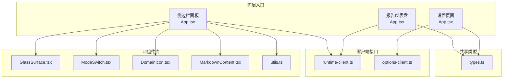
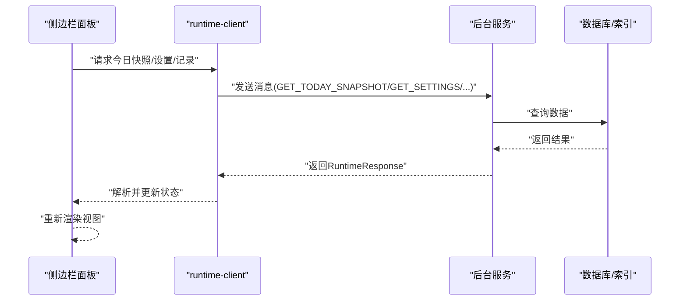
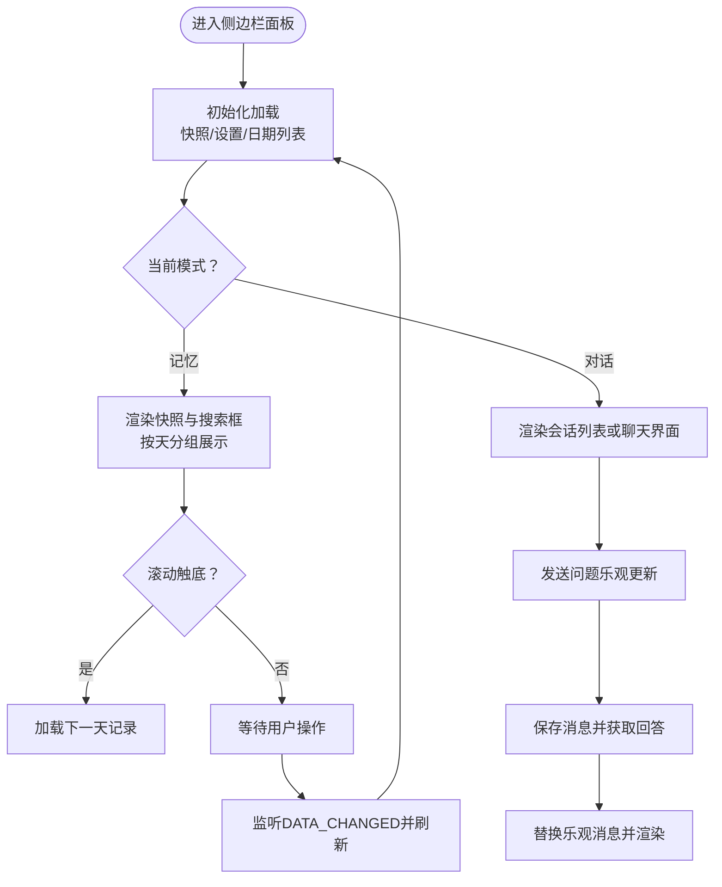
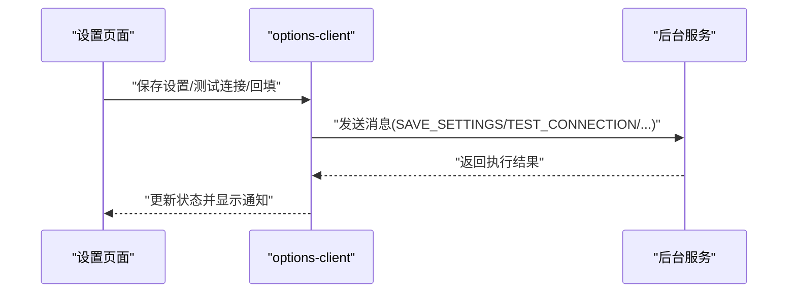
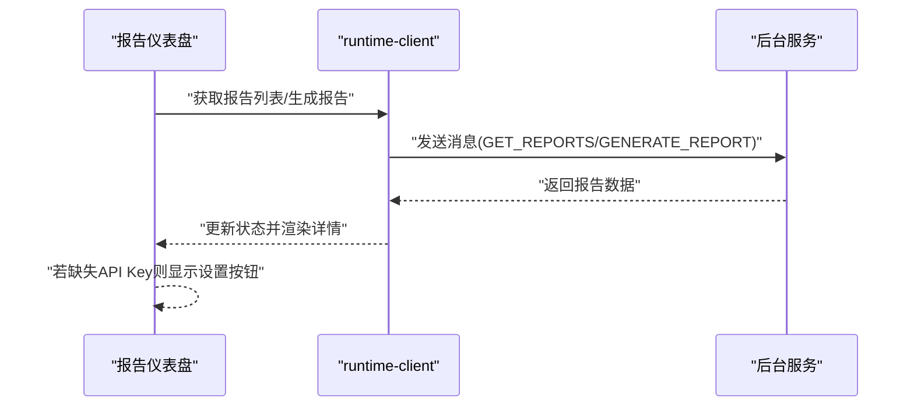
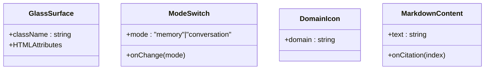
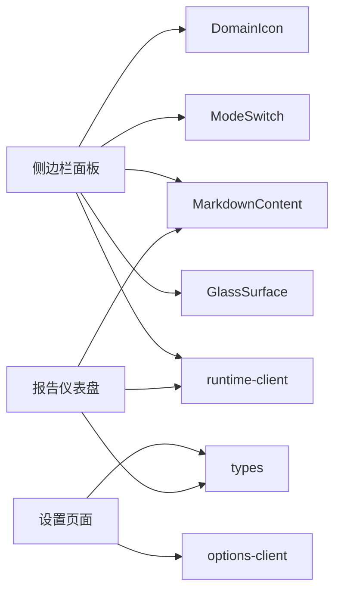

# 用户界面系统

<cite>
**本文引用的文件**
- [entrypoints/sidepanel/App.tsx](file://entrypoints/sidepanel/App.tsx)
- [entrypoints/options/App.tsx](file://entrypoints/options/App.tsx)
- [entrypoints/dashboard/App.tsx](file://entrypoints/dashboard/App.tsx)
- [entrypoints/sidepanel/styles.css](file://entrypoints/sidepanel/styles.css)
- [entrypoints/options/styles.css](file://entrypoints/options/styles.css)
- [entrypoints/dashboard/styles.css](file://entrypoints/dashboard/styles.css)
- [src/ui/GlassSurface.tsx](file://src/ui/GlassSurface.tsx)
- [src/ui/ModeSwitch.tsx](file://src/ui/ModeSwitch.tsx)
- [src/ui/DomainIcon.tsx](file://src/ui/DomainIcon.tsx)
- [src/ui/MarkdownContent.tsx](file://src/ui/MarkdownContent.tsx)
- [src/ui/runtime-client.ts](file://src/ui/runtime-client.ts)
- [src/ui/options-client.ts](file://src/ui/options-client.ts)
- [src/shared/types.ts](file://src/shared/types.ts)
- [src/i18n/index.tsx](file://src/i18n/index.tsx)
</cite>

## 目录
1. [简介](#简介)
2. [项目结构](#项目结构)
3. [核心组件](#核心组件)
4. [架构总览](#架构总览)
5. [详细组件分析](#详细组件分析)
6. [依赖关系分析](#依赖关系分析)
7. [性能考量](#性能考量)
8. [故障排查指南](#故障排查指南)
9. [结论](#结论)
10. [附录](#附录)

## 简介
本文件面向UI设计师与前端开发者，系统性梳理BrowseMemory的用户界面体系，覆盖四大扩展入口点（侧边栏面板、设置页面、报告仪表盘、选项配置）的UI设计与实现，解析React组件架构与状态管理策略，阐述GlassSurface等核心UI组件的设计理念，说明SPA页面检测与动态内容更新机制，详述实时数据更新、用户交互响应与视觉反馈的实现方式，并提供组件复用与样式定制的最佳实践。同时，文档涵盖响应式设计与无障碍支持现状，以及UI与后台服务的数据通信机制。

## 项目结构
UI系统由四个独立的SPA应用组成，分别运行在浏览器扩展的不同上下文中：
- 侧边栏面板：主界面，支持“记忆”与“对话”双模式，内嵌报告仪表盘与设置页面的iframe覆盖层。
- 设置页面：独立的选项页，提供AI服务、嵌入向量、报告、采集规则、存储等配置。
- 报告仪表盘：独立的报告查看与生成界面，支持日/周/月三类报表。
- 选项配置：通过runtime-client与options-client桥接到后台服务，实现设置持久化与测试连接。

**图表来源**
- [entrypoints/sidepanel/App.tsx:1-834](file://entrypoints/sidepanel/App.tsx#L1-L834)
- [entrypoints/options/App.tsx:1-529](file://entrypoints/options/App.tsx#L1-L529)
- [entrypoints/dashboard/App.tsx:1-208](file://entrypoints/dashboard/App.tsx#L1-L208)
- [src/ui/GlassSurface.tsx:1-11](file://src/ui/GlassSurface.tsx#L1-L11)
- [src/ui/ModeSwitch.tsx:1-36](file://src/ui/ModeSwitch.tsx#L1-L36)
- [src/ui/DomainIcon.tsx:1-21](file://src/ui/DomainIcon.tsx#L1-L21)
- [src/ui/MarkdownContent.tsx:1-278](file://src/ui/MarkdownContent.tsx#L1-L278)
- [src/ui/runtime-client.ts:1-182](file://src/ui/runtime-client.ts#L1-L182)
- [src/ui/options-client.ts:1-87](file://src/ui/options-client.ts#L1-L87)
- [src/shared/types.ts:1-139](file://src/shared/types.ts#L1-L139)

**章节来源**
- [entrypoints/sidepanel/App.tsx:1-834](file://entrypoints/sidepanel/App.tsx#L1-L834)
- [entrypoints/options/App.tsx:1-529](file://entrypoints/options/App.tsx#L1-L529)
- [entrypoints/dashboard/App.tsx:1-208](file://entrypoints/dashboard/App.tsx#L1-L208)

## 核心组件
- GlassSurface：用于包裹区域以实现毛玻璃背景与阴影，统一视觉层级与可读性。
- ModeSwitch：侧边栏底部的模式切换器，支持“记忆/对话”两种模式。
- DomainIcon：基于域名计算色相，生成一致的领域图标。
- MarkdownContent：轻量级Markdown渲染器，支持标题、代码块、列表、引用、表格、水平线、段落及内联加粗、斜体、行内代码、链接、删除线、引用标注等。
- 客户端接口：runtime-client.ts与options-client.ts封装与后台服务的消息通信，提供统一的异步API。

这些组件共同构成UI层的复用基础，保证跨入口的一致体验与可维护性。

**章节来源**
- [src/ui/GlassSurface.tsx:1-11](file://src/ui/GlassSurface.tsx#L1-L11)
- [src/ui/ModeSwitch.tsx:1-36](file://src/ui/ModeSwitch.tsx#L1-L36)
- [src/ui/DomainIcon.tsx:1-21](file://src/ui/DomainIcon.tsx#L1-L21)
- [src/ui/MarkdownContent.tsx:1-278](file://src/ui/MarkdownContent.tsx#L1-L278)
- [src/ui/runtime-client.ts:1-182](file://src/ui/runtime-client.ts#L1-L182)
- [src/ui/options-client.ts:1-87](file://src/ui/options-client.ts#L1-L87)

## 架构总览
UI采用“多SPA + 统一组件库 + 客户端桥接”的架构：
- 每个入口点是一个独立的React SPA，拥有自己的路由与状态管理。
- 共享组件库提供通用UI能力，避免重复实现。
- 客户端接口负责与后台服务通信，屏蔽消息协议细节。
- 国际化通过I18nProvider提供上下文，支持多语言与RTL布局。

**图表来源**
- [src/ui/runtime-client.ts:18-48](file://src/ui/runtime-client.ts#L18-L48)
- [src/ui/runtime-client.ts:50-182](file://src/ui/runtime-client.ts#L50-L182)

**章节来源**
- [src/ui/runtime-client.ts:1-182](file://src/ui/runtime-client.ts#L1-L182)
- [src/i18n/index.tsx:133-184](file://src/i18n/index.tsx#L133-L184)

## 详细组件分析

### 侧边栏面板（Side Panel）
- 设计目标：提供“浏览记忆”与“对话助手”的一体化入口，支持快速检索、按天分组展示、域展开、对话历史管理与实时刷新。
- 关键特性：
  - 双模式切换：记忆模式（快照、搜索、按天分组）、对话模式（会话列表、消息输入）。
  - 懒加载与无限滚动：按天加载记录，使用IntersectionObserver触发下一天加载。
  - 实时刷新：监听后台DATA_CHANGED消息，自动拉取最新数据。
  - 域图标与折叠：基于域名生成色相，支持展开/折叠域内页面。
  - 对话优化：乐观更新用户消息，失败回滚；支持删除会话、新建会话。
  - 覆盖层：通过iframe打开设置与报告仪表盘，保持主面板无刷新切换。
  - 快捷键：⌘K聚焦搜索框。
- 数据流：useEffect初始化加载 → runtime-client调用后台 → 更新本地状态 → 渲染组件树。

**图表来源**
- [entrypoints/sidepanel/App.tsx:208-225](file://entrypoints/sidepanel/App.tsx#L208-L225)
- [entrypoints/sidepanel/App.tsx:234-259](file://entrypoints/sidepanel/App.tsx#L234-L259)
- [entrypoints/sidepanel/App.tsx:291-349](file://entrypoints/sidepanel/App.tsx#L291-L349)

**章节来源**
- [entrypoints/sidepanel/App.tsx:1-834](file://entrypoints/sidepanel/App.tsx#L1-L834)
- [entrypoints/sidepanel/styles.css:1-454](file://entrypoints/sidepanel/styles.css#L1-L454)

### 设置页面（Options）
- 设计目标：集中管理AI服务、嵌入向量、报告、采集规则与存储配置，提供即时验证与测试连接。
- 关键特性：
  - 即时校验：URL协议、模型名称、最小阅读时长、保留天数等。
  - 自动保存：嵌入启用开关与部分字段变更立即持久化；密钥在失焦时保存。
  - 测试连接：分别测试大模型与嵌入服务连通性。
  - 回填任务：触发嵌入回填，统计排队数量。
  - 存储清理：一键清空所有数据并重置状态。
  - 多语言选择：按钮式切换语言，同步到IndexedDB供后台读取。
- 数据流：表单状态 → 验证 → options-client → 后台持久化/测试 → 成功/错误提示。

**图表来源**
- [entrypoints/options/App.tsx:127-225](file://entrypoints/options/App.tsx#L127-L225)
- [src/ui/options-client.ts:35-87](file://src/ui/options-client.ts#L35-L87)

**章节来源**
- [entrypoints/options/App.tsx:1-529](file://entrypoints/options/App.tsx#L1-L529)
- [entrypoints/options/styles.css:1-138](file://entrypoints/options/styles.css#L1-L138)
- [src/ui/options-client.ts:1-87](file://src/ui/options-client.ts#L1-L87)

### 报告仪表盘（Dashboard）
- 设计目标：提供日/周/月报告的生成、浏览与主题标签展示，支持一键生成与设置跳转。
- 关键特性：
  - 标签页切换：日/周/月三类报告。
  - 列表与详情：左侧列表展示报告标题与摘要，右侧渲染Markdown正文。
  - 错误处理：缺失API Key时高亮提示并引导前往设置。
  - 本地化：根据当前locale生成报告标题与内容。
- 数据流：切换标签 → 加载报告列表 → 选中报告 → 渲染Markdown内容。

**图表来源**
- [entrypoints/dashboard/App.tsx:33-78](file://entrypoints/dashboard/App.tsx#L33-L78)
- [src/ui/runtime-client.ts:137-157](file://src/ui/runtime-client.ts#L137-L157)

**章节来源**
- [entrypoints/dashboard/App.tsx:1-208](file://entrypoints/dashboard/App.tsx#L1-L208)
- [entrypoints/dashboard/styles.css:1-380](file://entrypoints/dashboard/styles.css#L1-L380)
- [src/ui/runtime-client.ts:1-182](file://src/ui/runtime-client.ts#L1-L182)

### 核心UI组件
- GlassSurface：为容器添加毛玻璃背景与阴影，提升层级感与可读性。
- ModeSwitch：底部导航，切换“记忆/对话”模式，支持无障碍标签。
- DomainIcon：基于域名哈希计算色相，生成首字母徽标，保证一致性。
- MarkdownContent：自研轻量渲染器，支持多种块级与行内元素，引用标注可点击。

**图表来源**
- [src/ui/GlassSurface.tsx:5-10](file://src/ui/GlassSurface.tsx#L5-L10)
- [src/ui/ModeSwitch.tsx:7-35](file://src/ui/ModeSwitch.tsx#L7-L35)
- [src/ui/DomainIcon.tsx:9-20](file://src/ui/DomainIcon.tsx#L9-L20)
- [src/ui/MarkdownContent.tsx:268-277](file://src/ui/MarkdownContent.tsx#L268-L277)

**章节来源**
- [src/ui/GlassSurface.tsx:1-11](file://src/ui/GlassSurface.tsx#L1-L11)
- [src/ui/ModeSwitch.tsx:1-36](file://src/ui/ModeSwitch.tsx#L1-L36)
- [src/ui/DomainIcon.tsx:1-21](file://src/ui/DomainIcon.tsx#L1-L21)
- [src/ui/MarkdownContent.tsx:1-278](file://src/ui/MarkdownContent.tsx#L1-L278)

## 依赖关系分析
- 组件耦合：
  - 侧边栏面板依赖runtime-client与多个UI组件（GlassSurface、ModeSwitch、DomainIcon、MarkdownContent）。
  - 设置页面依赖options-client与共享类型定义。
  - 报告仪表盘依赖runtime-client与MarkdownContent。
- 外部依赖：
  - 消息通信：chrome.runtime.sendMessage/OnMessage。
  - 国际化：I18nProvider提供翻译函数与语言切换。
  - 样式：Tailwind合并与CSS变量，支持深浅色与减少动画偏好。

**图表来源**
- [entrypoints/sidepanel/App.tsx:32-41](file://entrypoints/sidepanel/App.tsx#L32-L41)
- [entrypoints/options/App.tsx:19-22](file://entrypoints/options/App.tsx#L19-L22)
- [entrypoints/dashboard/App.tsx:6-8](file://entrypoints/dashboard/App.tsx#L6-L8)

**章节来源**
- [src/ui/runtime-client.ts:1-182](file://src/ui/runtime-client.ts#L1-L182)
- [src/ui/options-client.ts:1-87](file://src/ui/options-client.ts#L1-L87)
- [src/shared/types.ts:1-139](file://src/shared/types.ts#L1-L139)
- [src/i18n/index.tsx:133-184](file://src/i18n/index.tsx#L133-L184)

## 性能考量
- 懒加载与虚拟滚动：按天加载记录，减少初始渲染压力；滚动触底再加载下一天。
- 乐观UI：对话场景先插入用户消息，等待后端确认后再替换，提升感知速度。
- 缓存与去抖：搜索输入300ms去抖，避免频繁网络请求。
- 资源复用：共享组件库减少重复实现，降低包体积与维护成本。
- 动画与过渡：提供“减少动画”偏好适配，避免不必要的重绘。

[本节为通用指导，无需特定文件引用]

## 故障排查指南
- 常见错误与定位：
  - 运行时错误：runtime-client与options-client在收到非ok响应时抛出带code的错误对象，便于前端区分“缺少API Key”、“连接失败”等场景。
  - 数据未刷新：检查chrome.runtime.onMessage监听是否生效，确认后台确有DATA_CHANGED消息派发。
  - 语言不同步：确认localStorage中的语言键值已更新，且I18nProvider已监听storage事件。
- 建议排查步骤：
  - 在控制台查看错误堆栈与code字段。
  - 打开设置页面进行“测试连接”，确认网络与鉴权配置。
  - 清理缓存后重试，必要时触发嵌入回填或重新生成报告。

**章节来源**
- [src/ui/runtime-client.ts:12-24](file://src/ui/runtime-client.ts#L12-L24)
- [entrypoints/sidepanel/App.tsx:214-225](file://entrypoints/sidepanel/App.tsx#L214-L225)
- [src/i18n/index.tsx:154-163](file://src/i18n/index.tsx#L154-L163)

## 结论
BrowseMemory的UI系统以“多SPA + 组件库 + 客户端桥接”为核心，实现了清晰的职责分离与良好的可扩展性。通过GlassSurface、ModeSwitch、DomainIcon、MarkdownContent等组件，统一了视觉风格与交互体验；通过runtime-client与options-client，屏蔽了后台通信复杂度。侧边栏面板的懒加载、乐观更新与实时刷新机制，配合设置页面的即时校验与测试连接，提供了高效稳定的用户体验。建议在后续迭代中进一步完善无障碍属性与国际化覆盖，持续优化性能与可维护性。

[本节为总结，无需特定文件引用]

## 附录

### 使用指南与定制化方法
- 复用组件：
  - 将常用布局与装饰封装为更高层组件，如“卡片容器”“提示条”等，减少重复代码。
  - 通过GlassSurface统一毛玻璃效果，确保跨页面一致性。
- 样式定制：
  - 基于CSS变量调整主题色与透明度，避免硬编码颜色。
  - 使用Tailwind工具类与twMerge/cn组合，确保类名冲突最小化。
- 交互与反馈：
  - 为关键操作提供加载态与成功/错误提示，保持用户感知明确。
  - 为键盘快捷键与屏幕阅读器提供语义化标签与aria属性。

[本节为通用指导，无需特定文件引用]

### 响应式设计与无障碍支持现状
- 响应式：
  - 侧边栏面板与设置页面均提供移动端断点，优化网格布局与控件尺寸。
  - 报告仪表盘在窄屏下将侧边栏转为顶部抽屉式布局。
- 无障碍：
  - 提供aria-label与role属性，为按钮、对话框与导航提供语义。
  - 支持键盘操作（如⌘K聚焦搜索），并为交互元素提供焦点可见性。
  - 国际化提供RTL布局支持，确保阿拉伯语等从右至左语言正确显示。

**章节来源**
- [entrypoints/sidepanel/styles.css:416-454](file://entrypoints/sidepanel/styles.css#L416-L454)
- [entrypoints/options/styles.css:121-138](file://entrypoints/options/styles.css#L121-L138)
- [entrypoints/dashboard/styles.css:363-380](file://entrypoints/dashboard/styles.css#L363-L380)
- [src/i18n/index.tsx:48-49](file://src/i18n/index.tsx#L48-L49)

### UI与后台服务的数据通信机制
- 消息协议：
  - 前端通过chrome.runtime.sendMessage发送请求，后台返回包含ok与数据的响应对象。
  - 非ok响应会被客户端包装为带code的错误对象，便于前端分支处理。
- 接口抽象：
  - runtime-client：封装侧边栏面板所需的所有后台能力（快照、搜索、会话、报告、嵌入状态等）。
  - options-client：封装设置页面所需的配置读写、连接测试、存储用量与清理等能力。
- 类型安全：
  - 所有数据结构在shared/types中统一定义，前后端共享，避免类型漂移。

**章节来源**
- [src/ui/runtime-client.ts:18-48](file://src/ui/runtime-client.ts#L18-L48)
- [src/ui/options-client.ts:6-12](file://src/ui/options-client.ts#L6-L12)
- [src/shared/types.ts:1-139](file://src/shared/types.ts#L1-L139)