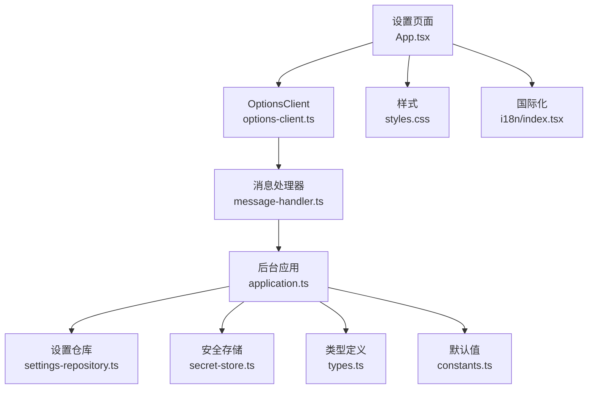
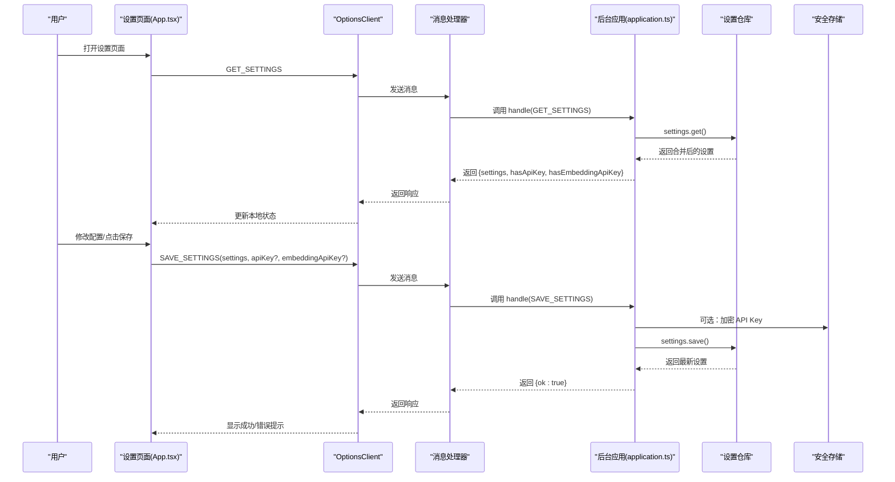
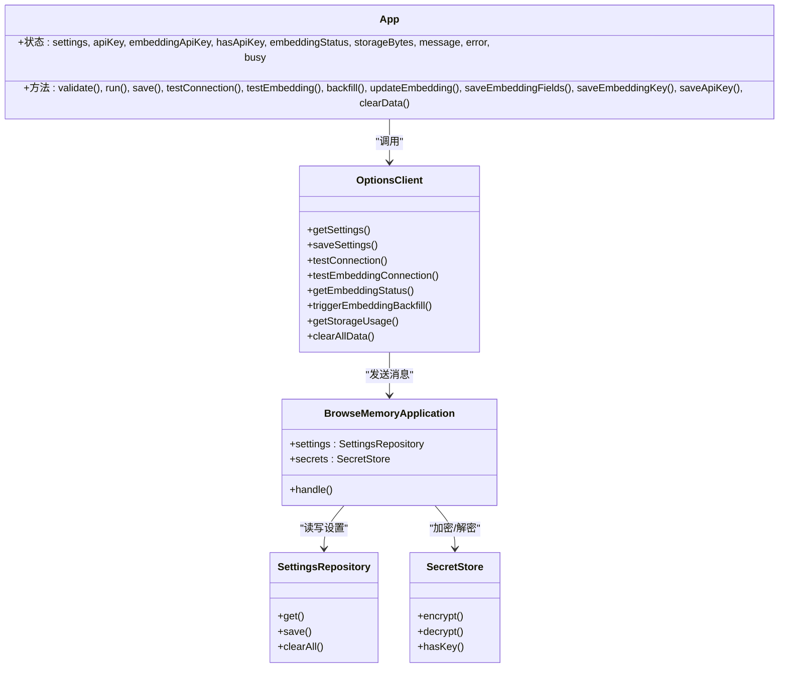

# 设置页面

<cite>
**本文引用的文件**
- [App.tsx](file://entrypoints/options/App.tsx)
- [styles.css](file://entrypoints/options/styles.css)
- [options-client.ts](file://src/ui/options-client.ts)
- [application.ts](file://src/background/application.ts)
- [settings-repository.ts](file://src/storage/settings-repository.ts)
- [secret-store.ts](file://src/security/secret-store.ts)
- [types.ts](file://src/shared/types.ts)
- [constants.ts](file://src/shared/constants.ts)
- [index.tsx](file://src/i18n/index.tsx)
- [message-handler.ts](file://src/background/message-handler.ts)
</cite>

## 目录
1. [简介](#简介)
2. [项目结构](#项目结构)
3. [核心组件](#核心组件)
4. [架构总览](#架构总览)
5. [详细组件分析](#详细组件分析)
6. [依赖关系分析](#依赖关系分析)
7. [性能考量](#性能考量)
8. [故障排查指南](#故障排查指南)
9. [结论](#结论)
10. [附录：扩展与自定义指南](#附录扩展与自定义指南)

## 简介
本文件为 BrowseMemory 的设置页面（Options）提供全面的 UI 文档，覆盖组件架构、配置管理、数据持久化、与后台服务的同步流程、布局与交互、表单校验与用户反馈、动态加载与实时预览、以及与安全存储模块的集成方式。同时给出扩展与自定义配置项的实践建议。

## 项目结构
设置页面由“前端 UI 组件 + 客户端桥接 + 后台应用处理器 + 存储层 + 安全存储”构成，采用“Options 页面（React）↔ OptionsClient（runtime 消息）↔ Application（后台应用）↔ 存储库（IndexedDB）↔ 安全存储（加密密钥）”的链路。

图表来源
- [App.tsx:1-529](file://entrypoints/options/App.tsx#L1-L529)
- [options-client.ts:1-87](file://src/ui/options-client.ts#L1-L87)
- [application.ts:1-388](file://src/background/application.ts#L1-L388)
- [settings-repository.ts:1-57](file://src/storage/settings-repository.ts#L1-L57)
- [secret-store.ts:1-70](file://src/security/secret-store.ts#L1-L70)
- [styles.css:1-138](file://entrypoints/options/styles.css#L1-L138)
- [index.tsx:1-196](file://src/i18n/index.tsx#L1-L196)
- [types.ts:1-139](file://src/shared/types.ts#L1-L139)
- [constants.ts:1-33](file://src/shared/constants.ts#L1-L33)
- [message-handler.ts:1-22](file://src/background/message-handler.ts#L1-L22)

章节来源
- [App.tsx:1-529](file://entrypoints/options/App.tsx#L1-L529)
- [options-client.ts:1-87](file://src/ui/options-client.ts#L1-L87)
- [application.ts:1-388](file://src/background/application.ts#L1-L388)
- [settings-repository.ts:1-57](file://src/storage/settings-repository.ts#L1-L57)
- [secret-store.ts:1-70](file://src/security/secret-store.ts#L1-L70)
- [styles.css:1-138](file://entrypoints/options/styles.css#L1-L138)
- [index.tsx:1-196](file://src/i18n/index.tsx#L1-L196)
- [types.ts:1-139](file://src/shared/types.ts#L1-L139)
- [constants.ts:1-33](file://src/shared/constants.ts#L1-L33)
- [message-handler.ts:1-22](file://src/background/message-handler.ts#L1-L22)

## 核心组件
- 设置页面主组件：负责加载初始设置、渲染各卡片区域、执行表单校验、触发保存/测试/回填等操作，并展示成功/错误通知与确认对话框。
- OptionsClient：封装与后台通信的消息接口，统一返回格式与错误处理。
- 后台应用（BrowseMemoryApplication）：实现具体业务逻辑，如设置读写、连接测试、嵌入状态查询、回填触发、存储用量统计、清理数据等。
- 设置仓库（SettingsRepository）：以键值形式持久化 AppSettings，合并默认值与已存值。
- 安全存储（SecretStore）：提供 AES-GCM 加密/解密能力，用于保存受保护的 API 密钥。
- 国际化（I18nProvider）：提供多语言切换与翻译函数，设置页语言选择会同步到存储并持久化。
- 样式（styles.css）：响应式网格布局、卡片样式、按钮与通知样式、暗色模式适配。

章节来源
- [App.tsx:40-295](file://entrypoints/options/App.tsx#L40-L295)
- [options-client.ts:14-33](file://src/ui/options-client.ts#L14-L33)
- [application.ts:106-129](file://src/background/application.ts#L106-L129)
- [settings-repository.ts:11-23](file://src/storage/settings-repository.ts#L11-L23)
- [secret-store.ts:25-70](file://src/security/secret-store.ts#L25-L70)
- [index.tsx:133-184](file://src/i18n/index.tsx#L133-L184)
- [styles.css:14-138](file://entrypoints/options/styles.css#L14-L138)

## 架构总览
设置页面通过 OptionsClient 发送消息到后台应用，后台应用根据请求类型调用对应服务（设置仓库、安全存储、任务队列等），并将结果返回给前端。前端负责 UI 呈现与用户交互。

图表来源
- [App.tsx:58-76](file://entrypoints/options/App.tsx#L58-L76)
- [options-client.ts:35-55](file://src/ui/options-client.ts#L35-L55)
- [application.ts:106-129](file://src/background/application.ts#L106-L129)
- [settings-repository.ts:11-23](file://src/storage/settings-repository.ts#L11-L23)
- [secret-store.ts:28-50](file://src/security/secret-store.ts#L28-L50)

## 详细组件分析

### 1) 页面布局与卡片组织
- 顶部标题区：品牌标识、标题、副标题与隐私标签。
- 主体网格：两列响应式布局，卡片占满整行。
- 卡片结构：统一的标题栏（图标+标题+描述）+ 表单网格 + 操作行。
- 语言选择卡：独立卡片，使用语言网格按钮组，点击即切换并持久化到设置中。
- 通知与对话框：成功/错误通知与清空数据确认对话框。

章节来源
- [App.tsx:227-492](file://entrypoints/options/App.tsx#L227-L492)
- [styles.css:20-70](file://entrypoints/options/styles.css#L20-L70)
- [styles.css:121-138](file://entrypoints/options/styles.css#L121-L138)

### 2) 配置项与表单控件
- 语言设置：LanguageSelector 使用国际化上下文，点击后更新本地语言并调用客户端保存当前设置（含 locale）。
- AI 服务设置：API 地址、模型名、API Key 输入；支持“测试连接”与“保存”。
- 嵌入设置：启用开关、嵌入地址、模型、是否复用聊天密钥；可单独输入嵌入密钥或复用聊天密钥；支持“测试连接”与“回填历史”。
- 报告设置：每日报告生成时间小时数。
- 捕获规则：最小阅读秒数、黑名单正则列表（按行输入）。
- 存储设置：保留天数；显示当前使用量；一键清空所有数据。

章节来源
- [App.tsx:249-470](file://entrypoints/options/App.tsx#L249-L470)
- [App.tsx:500-528](file://entrypoints/options/App.tsx#L500-L528)
- [types.ts:6-22](file://src/shared/types.ts#L6-L22)
- [constants.ts:12-24](file://src/shared/constants.ts#L12-L24)

### 3) 表单校验与用户反馈
- 校验规则：
  - API 地址必须为 https URL。
  - 模型名不能为空。
  - 最小阅读秒数与保留天数必须为有效正整数。
- 用户反馈：
  - 成功/错误通知条。
  - 保存/测试按钮禁用态与加载动画。
  - 已保存密钥的视觉提示。

章节来源
- [App.tsx:78-107](file://entrypoints/options/App.tsx#L78-L107)
- [App.tsx:109-125](file://entrypoints/options/App.tsx#L109-L125)
- [App.tsx:472-474](file://entrypoints/options/App.tsx#L472-L474)

### 4) 动态加载、实时预览与保存机制
- 初始化加载：首次挂载时并行获取设置、存储用量、嵌入状态。
- 实时预览：
  - 嵌入启用开关即时保存（updateEmbedding），减少用户等待。
  - 嵌入文本字段在失焦时保存（saveEmbeddingFields）。
  - API Key 在失焦时保存（saveApiKey/saveEmbeddingKey），并更新“已保存”状态。
- 手动保存：点击“保存设置”进行完整校验与保存。

章节来源
- [App.tsx:58-76](file://entrypoints/options/App.tsx#L58-L76)
- [App.tsx:187-215](file://entrypoints/options/App.tsx#L187-L215)
- [App.tsx:194-206](file://entrypoints/options/App.tsx#L194-L206)

### 5) 与后台服务的同步过程
- 获取设置：OptionsClient -> GET_SETTINGS -> Application.handle -> SettingsRepository.get -> 返回公开设置与密钥存在性。
- 保存设置：OptionsClient -> SAVE_SETTINGS -> Application.handle -> SecretStore.encrypt（如有密钥）-> SettingsRepository.save。
- 连接测试：分别测试聊天与嵌入服务连通性，必要时解密已有密钥或使用新密钥。
- 嵌入状态与回填：查询索引进度；触发回填任务队列。
- 存储用量与清空：估算使用量；清空所有数据（事务批量清理多个对象存储）。

章节来源
- [options-client.ts:35-86](file://src/ui/options-client.ts#L35-L86)
- [application.ts:106-129](file://src/background/application.ts#L106-L129)
- [application.ts:130-177](file://src/background/application.ts#L130-L177)
- [application.ts:317-342](file://src/background/application.ts#L317-L342)
- [application.ts:252-258](file://src/background/application.ts#L252-L258)
- [settings-repository.ts:25-55](file://src/storage/settings-repository.ts#L25-L55)

### 6) 数据持久化机制
- 设置持久化：SettingsRepository 以固定键保存合并后的 AppSettings，未提供的字段使用 DEFAULT_SETTINGS 默认值。
- 安全存储：SecretStore 使用浏览器 WebCrypto 生成/复用 AES-GCM 密钥，加密后的密钥以 EncryptedSecret 形式保存在数据库中。
- 默认值来源：constants.ts 提供全局默认设置，确保首次安装或缺失字段时有合理缺省。

章节来源
- [settings-repository.ts:11-23](file://src/storage/settings-repository.ts#L11-L23)
- [constants.ts:12-24](file://src/shared/constants.ts#L12-L24)
- [secret-store.ts:25-70](file://src/security/secret-store.ts#L25-L70)
- [types.ts:1-4](file://src/shared/types.ts#L1-L4)

### 7) 与安全存储模块的集成
- 写入流程：当用户输入 API Key 或嵌入密钥时，OptionsClient 将明文传给后台；后台使用 SecretStore.encrypt 加密后写入设置仓库。
- 读取流程：GET_SETTINGS 返回去除了敏感字段的公开设置；需要时在测试/问答等场景解密使用。
- 密钥复用：嵌入密钥可选择复用聊天密钥，减少用户重复输入。

章节来源
- [options-client.ts:56-58](file://src/ui/options-client.ts#L56-L58)
- [application.ts:115-129](file://src/background/application.ts#L115-L129)
- [application.ts:152-177](file://src/background/application.ts#L152-L177)
- [secret-store.ts:28-50](file://src/security/secret-store.ts#L28-L50)

### 8) 国际化与本地化
- 语言选择：LanguageSelector 展示可用语言，点击后更新本地语言并调用客户端保存设置（含 locale）。
- 同步机制：通过 localStorage 键同步语言变更，保证不同页面间一致。
- 翻译函数：useT/useLocale/useSetLocale 提供翻译与语言切换能力。

章节来源
- [App.tsx:500-528](file://entrypoints/options/App.tsx#L500-L528)
- [index.tsx:133-184](file://src/i18n/index.tsx#L133-L184)
- [index.tsx:186-196](file://src/i18n/index.tsx#L186-L196)

## 依赖关系分析

图表来源
- [App.tsx:40-215](file://entrypoints/options/App.tsx#L40-L215)
- [options-client.ts:14-33](file://src/ui/options-client.ts#L14-L33)
- [application.ts:29-63](file://src/background/application.ts#L29-L63)
- [settings-repository.ts:8-23](file://src/storage/settings-repository.ts#L8-L23)
- [secret-store.ts:25-70](file://src/security/secret-store.ts#L25-L70)

章节来源
- [App.tsx:40-215](file://entrypoints/options/App.tsx#L40-L215)
- [options-client.ts:14-33](file://src/ui/options-client.ts#L14-L33)
- [application.ts:29-63](file://src/background/application.ts#L29-L63)
- [settings-repository.ts:8-23](file://src/storage/settings-repository.ts#L8-L23)
- [secret-store.ts:25-70](file://src/security/secret-store.ts#L25-L70)

## 性能考量
- 并发初始化：页面挂载时并发获取设置、存储用量与嵌入状态，缩短首屏等待。
- 低频写入策略：嵌入开关即时保存，文本字段与密钥在失焦时保存，降低频繁写入带来的抖动与资源消耗。
- 仅在必要时测试连接：测试按钮提供显式触发，避免自动轮询造成网络压力。
- 响应式布局：移动端单列网格，减少重排成本，提升可读性。

## 故障排查指南
- 保存失败：检查表单校验提示；确认网络可达；查看错误通知条。
- 测试连接失败：确认 API 地址为 https；确保模型名正确；检查密钥是否已保存或在测试时临时输入。
- 嵌入回填无反应：确认已启用嵌入且有足够权限；查看嵌入状态中的索引进度；尝试重新触发回填。
- 清空数据无效：确认二次确认对话框已确认；刷新页面后确认数据归零。
- 语言切换不生效：确认已保存设置（含 locale）；检查 localStorage 是否被清理。

章节来源
- [App.tsx:78-107](file://entrypoints/options/App.tsx#L78-L107)
- [App.tsx:144-159](file://entrypoints/options/App.tsx#L144-L159)
- [App.tsx:161-185](file://entrypoints/options/App.tsx#L161-L185)
- [App.tsx:217-225](file://entrypoints/options/App.tsx#L217-L225)
- [options-client.ts:6-12](file://src/ui/options-client.ts#L6-L12)
- [message-handler.ts:6-21](file://src/background/message-handler.ts#L6-L21)

## 结论
设置页面以清晰的卡片化布局与完善的表单校验为基础，结合 OptionsClient 与后台应用的职责分离，实现了从 UI 到存储与安全的完整闭环。通过即时保存与延迟写入相结合的策略，在保证用户体验的同时兼顾了性能与可靠性。国际化与响应式设计进一步提升了跨设备与多语言环境下的可用性。

## 附录：扩展与自定义指南
- 新增配置项步骤
  1) 在类型定义中扩展 AppSettings 字段（含默认值与 UI 控件映射）。
     - 参考路径：[types.ts:6-22](file://src/shared/types.ts#L6-L22)，[constants.ts:12-24](file://src/shared/constants.ts#L12-L24)
  2) 在设置页面新增表单控件与校验逻辑。
     - 参考路径：[App.tsx:249-470](file://entrypoints/options/App.tsx#L249-L470)
  3) 在 OptionsClient 中声明新消息接口与参数。
     - 参考路径：[options-client.ts:14-33](file://src/ui/options-client.ts#L14-L33)
  4) 在后台应用 handle 分支中实现对应逻辑（读取/保存/测试等）。
     - 参考路径：[application.ts:74-352](file://src/background/application.ts#L74-L352)
  5) 在设置仓库中合并默认值与持久化逻辑。
     - 参考路径：[settings-repository.ts:11-23](file://src/storage/settings-repository.ts#L11-L23)
  6) 如涉及敏感信息，使用 SecretStore 进行加密存储。
     - 参考路径：[secret-store.ts:28-50](file://src/security/secret-store.ts#L28-L50)
  7) 在国际化文件中补充文案键值。
     - 参考路径：[index.tsx:54-65](file://src/i18n/index.tsx#L54-L65)
  8) 在样式中补充必要的 UI 样式或响应式规则。
     - 参考路径：[styles.css:14-138](file://entrypoints/options/styles.css#L14-L138)

- 最佳实践
  - 对于高频变更的开关类配置，优先采用“即时保存”策略。
  - 对于文本类输入，采用“失焦保存”，避免频繁写入。
  - 对于外部服务测试，提供明确的错误码与用户提示。
  - 对于敏感字段，始终通过 SecretStore 处理，不在 UI 中明文持久化。