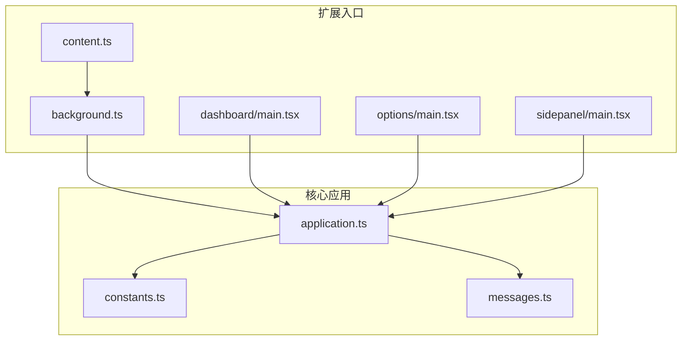
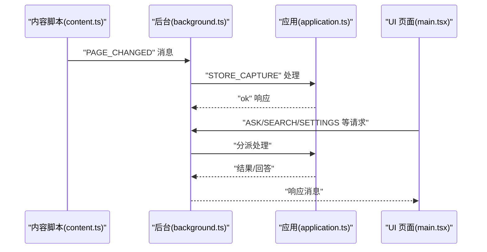
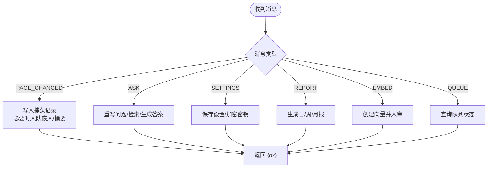
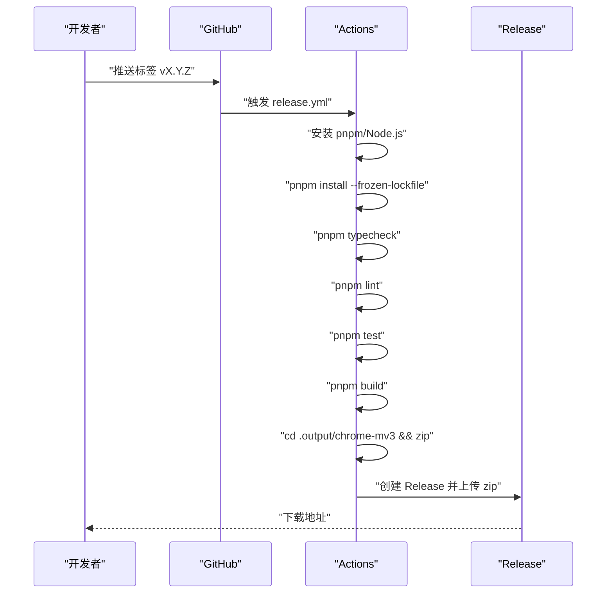
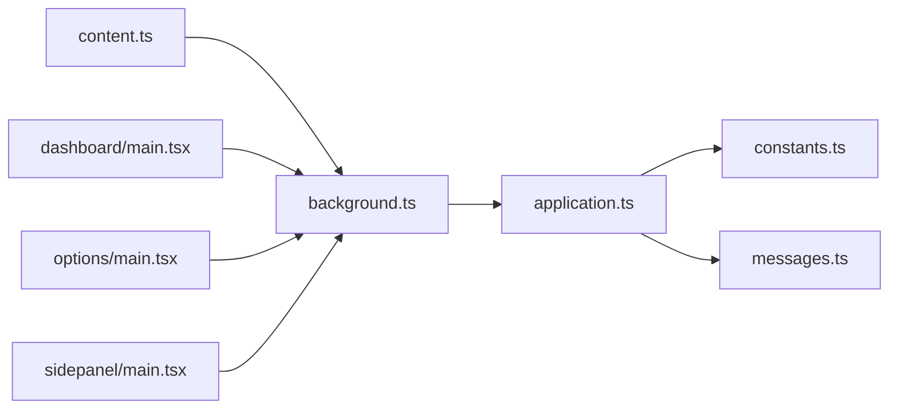

# 部署与发布

<cite>
**本文引用的文件**
- [package.json](file://package.json)
- [wxt.config.ts](file://wxt.config.ts)
- [vitest.config.ts](file://vitest.config.ts)
- [eslint.config.js](file://eslint.config.js)
- [tsconfig.json](file://tsconfig.json)
- [.github/workflows/release.yml](file://.github/workflows/release.yml)
- [.github/workflows/pages.yml](file://.github/workflows/pages.yml)
- [entrypoints/background.ts](file://entrypoints/background.ts)
- [entrypoints/content.ts](file://entrypoints/content.ts)
- [entrypoints/dashboard/main.tsx](file://entrypoints/dashboard/main.tsx)
- [entrypoints/options/main.tsx](file://entrypoints/options/main.tsx)
- [entrypoints/sidepanel/main.tsx](file://entrypoints/sidepanel/main.tsx)
- [src/background/application.ts](file://src/background/application.ts)
- [src/shared/constants.ts](file://src/shared/constants.ts)
- [src/shared/messages.ts](file://src/shared/messages.ts)
</cite>

## 目录
1. [简介](#简介)
2. [项目结构](#项目结构)
3. [核心组件](#核心组件)
4. [架构总览](#架构总览)
5. [详细组件分析](#详细组件分析)
6. [依赖关系分析](#依赖关系分析)
7. [性能考量](#性能考量)
8. [故障排查指南](#故障排查指南)
9. [结论](#结论)
10. [附录](#附录)

## 简介
本文件面向DevOps工程师与项目经理，系统化梳理 BrowseMemory 的部署与发布流程，覆盖从本地开发到生产构建、质量门禁、自动化流水线、版本与发布节奏、热修复与紧急发布、发布后监控与回滚等全链路实践。项目基于 WXT（Web Extension Toolkit）进行 Chrome MV3 扩展开发，使用 Vite 构建、Vitest 测试、ESLint/TypeScript 进行代码质量与类型检查，并通过 GitHub Actions 实现 CI/CD 自动化。

## 项目结构
- 根目录脚本与工具
  - 包管理与脚本：通过 package.json 统一定义 dev/build/test/typecheck/lint 等命令，配合 WXT 的 prepare/build。
  - 类型与别名：tsconfig.json 基于 WXT 提供的 tsconfig 并扩展路径别名与严格模式。
  - ESLint 规则：eslint.config.js 配置 TypeScript 与 React Hooks 规则，忽略输出目录与网站目录。
  - 测试配置：vitest.config.ts 指定别名、jsdom 环境与全局 setup 文件。
- 扩展入口与页面
  - background.ts：后台脚本，负责会话协调、任务队列、定时器、消息路由与与页面交互。
  - content.ts：内容脚本，监听页面变更并上报给后台。
  - dashboard/options/sidepanel：三个 UI 入口，分别对应仪表盘、选项页与侧边面板，均以 React 渲染。
- 核心业务逻辑
  - application.ts：应用主控制器，封装搜索、RAG、嵌入、摘要、报告、聊天会话等能力。
  - shared/types/constants/messages：共享类型、默认设置、常量与消息协议定义。

图表来源
- [entrypoints/background.ts:1-241](file://entrypoints/background.ts#L1-L241)
- [entrypoints/content.ts:1-44](file://entrypoints/content.ts#L1-L44)
- [entrypoints/dashboard/main.tsx:1-15](file://entrypoints/dashboard/main.tsx#L1-L15)
- [entrypoints/options/main.tsx:1-15](file://entrypoints/options/main.tsx#L1-L15)
- [entrypoints/sidepanel/main.tsx:1-18](file://entrypoints/sidepanel/main.tsx#L1-L18)
- [src/background/application.ts:1-388](file://src/background/application.ts#L1-L388)
- [src/shared/constants.ts:1-33](file://src/shared/constants.ts#L1-L33)
- [src/shared/messages.ts:1-71](file://src/shared/messages.ts#L1-L71)

章节来源
- [package.json:1-49](file://package.json#L1-L49)
- [tsconfig.json:1-34](file://tsconfig.json#L1-L34)
- [eslint.config.js:1-25](file://eslint.config.js#L1-L25)
- [vitest.config.ts:1-15](file://vitest.config.ts#L1-L15)

## 核心组件
- 构建与打包
  - 使用 WXT 进行扩展打包，目标平台为 Chrome MV3；产物位于 .output/chrome-mv3。
  - 构建命令：pnpm build。
- 质量门禁
  - 类型检查：pnpm typecheck。
  - 代码规范：pnpm lint。
  - 单元测试：pnpm test。
- 开发与调试
  - 开发模式：pnpm dev，自动准备 WXT 环境并启动开发服务器。
- 版本与发布
  - 版本号由 package.json 的 version 字段维护。
  - 发布流程通过 GitHub Actions 在打标签时触发，生成 zip 包并创建 GitHub Releases。

章节来源
- [package.json:6-12](file://package.json#L6-L12)
- [wxt.config.ts:1-19](file://wxt.config.ts#L1-L19)
- [.github/workflows/release.yml:1-58](file://.github/workflows/release.yml#L1-L58)

## 架构总览
下图展示扩展在浏览器中的运行时架构与数据流：内容脚本监听页面变化并上报；后台脚本协调会话、调度任务、调用 AI 服务与存储；UI 页面通过消息协议与后台交互。

图表来源
- [entrypoints/content.ts:1-44](file://entrypoints/content.ts#L1-L44)
- [entrypoints/background.ts:1-241](file://entrypoints/background.ts#L1-L241)
- [src/background/application.ts:74-352](file://src/background/application.ts#L74-L352)
- [src/shared/messages.ts:13-71](file://src/shared/messages.ts#L13-L71)

## 详细组件分析

### 构建与产物结构
- 构建工具链
  - WXT：负责扩展清单生成、多入口打包与平台适配。
  - Vite：作为打包与开发服务器基础。
- 产物位置与命名
  - 输出目录：.output/chrome-mv3。
  - 归档产物：BrowseMemory-<版本号>.zip（按标签名生成）。
- 代码分割与资源优化
  - 采用 WXT 默认打包策略，按入口拆分模块；未发现显式配置代码分割或资源压缩规则文件，建议在 wxt.config.ts 中根据需要扩展 rollup 插件以实现更细粒度的优化。
- 清单与权限
  - 权限：tabs、activeTab、storage、alarms、sidePanel。
  - 主机权限：<all_urls>。
  - 图标：16/32/48/128。
  - 动作图标与标题：action.default_title。

章节来源
- [.github/workflows/release.yml:45-48](file://.github/workflows/release.yml#L45-L48)
- [wxt.config.ts:3-18](file://wxt.config.ts#L3-L18)

### 质量门禁与测试
- 类型检查
  - 命令：pnpm typecheck；基于 tsconfig.json 的严格模式与路径别名。
- 代码规范
  - 命令：pnpm lint；规则覆盖 React Hooks 与刷新策略。
- 单元测试
  - 命令：pnpm test；环境为 jsdom，别名解析指向 src，支持 setup 文件注入。
- 测试覆盖率
  - 仓库包含 @vitest/coverage-v8 依赖，可按需启用覆盖率统计。

章节来源
- [package.json:11-12](file://package.json#L11-L12)
- [tsconfig.json:1-34](file://tsconfig.json#L1-L34)
- [eslint.config.js:1-25](file://eslint.config.js#L1-L25)
- [vitest.config.ts:1-15](file://vitest.config.ts#L1-L15)

### 后台与消息协议
- 后台职责
  - 会话协调：跟踪当前标签页、窗口焦点变化，维护会话状态。
  - 任务队列：异步执行嵌入、摘要、报告等任务。
  - 定时器：心跳、清理、嵌入回填、报告生成周期性触发。
  - 消息路由：接收来自 UI 与内容脚本的消息，委派至应用层处理。
- 消息协议
  - 请求类型：PAGE_CHANGED、STORE_CAPTURE、ASK、SEARCH、GET_SETTINGS、SAVE_SETTINGS、TEST_CONNECTION、TEST_EMBEDDING_CONNECTION、聊天与报告相关、嵌入与队列状态等。
  - 响应类型：统一返回 { ok } 结果或具体数据结构。

图表来源
- [entrypoints/background.ts:195-239](file://entrypoints/background.ts#L195-L239)
- [src/background/application.ts:74-352](file://src/background/application.ts#L74-L352)
- [src/shared/messages.ts:13-71](file://src/shared/messages.ts#L13-L71)

章节来源
- [entrypoints/background.ts:1-241](file://entrypoints/background.ts#L1-L241)
- [src/background/application.ts:1-388](file://src/background/application.ts#L1-L388)
- [src/shared/messages.ts:1-71](file://src/shared/messages.ts#L1-L71)

### UI 入口与国际化
- 三入口页面
  - 仪表盘、选项页、侧边面板均以 React 渲染，根节点挂载 I18nProvider，确保多语言支持贯穿 UI。
- 内容脚本
  - 对页面 URL、标题与历史 API 变更进行节流上报，避免频繁触发。

章节来源
- [entrypoints/dashboard/main.tsx:1-15](file://entrypoints/dashboard/main.tsx#L1-L15)
- [entrypoints/options/main.tsx:1-15](file://entrypoints/options/main.tsx#L1-L15)
- [entrypoints/sidepanel/main.tsx:1-18](file://entrypoints/sidepanel/main.tsx#L1-L18)
- [entrypoints/content.ts:1-44](file://entrypoints/content.ts#L1-L44)

### 发布流程（GitHub Actions）
- 触发条件
  - 推送标签（如 v2.3.0），自动触发 Release 工作流。
- 步骤概览
  - 检出代码 → 安装 pnpm → 设置 Node.js → 安装依赖（frozen lockfile）→ 类型检查 → Lint → 测试 → 构建 → 打包为 zip → 创建 GitHub Release（含自动生成发行说明，预发行依据标签名判断）。
- 站点发布
  - 网站（website/）仅在推送 main 分支且路径匹配时触发 GitHub Pages 部署。

图表来源
- [.github/workflows/release.yml:1-58](file://.github/workflows/release.yml#L1-L58)

章节来源
- [.github/workflows/release.yml:1-58](file://.github/workflows/release.yml#L1-L58)
- [.github/workflows/pages.yml:1-43](file://.github/workflows/pages.yml#L1-L43)

### 版本控制与发布节奏
- 版本号来源：package.json 的 version 字段。
- 标签驱动发布：以语义化版本标签（vX.Y.Z）作为发布触发器，便于追溯与回滚。
- 预发行：若标签名包含连字符（如 rc、beta），将标记为预发行版。

章节来源
- [package.json:3-3](file://package.json#L3-L3)
- [.github/workflows/release.yml:50-56](file://.github/workflows/release.yml#L50-L56)

### 热修复与紧急发布
- 快速修复流程
  - 在修复分支上提交补丁并打上小版本标签（如 v2.3.1），触发 Actions 自动发布。
  - 若涉及严重问题，可在发布后立即创建新标签并回滚至上一个稳定版本。
- 回滚策略
  - 通过 GitHub Releases 下载上一个稳定版本 zip 包进行手动回滚。
  - 如需撤销已发布版本，可删除对应标签并重新打回退标签，但需谨慎评估对用户的影响。

章节来源
- [.github/workflows/release.yml:50-56](file://.github/workflows/release.yml#L50-L56)

### 发布后监控与回滚
- 监控建议
  - 关注浏览器扩展商店的用户反馈与错误报告。
  - 利用应用内部的队列状态接口（GET_QUEUE_STATUS）观察任务积压与失败情况。
- 回滚步骤
  - 在 GitHub Releases 中定位上一个稳定版本，下载并手动安装。
  - 若需恢复旧版本，删除当前标签并重新打上上一个稳定标签，触发 Actions 重新发布。

章节来源
- [src/background/application.ts:343-350](file://src/background/application.ts#L343-L350)

## 依赖关系分析
- 组件耦合
  - content.ts 与 background.ts 通过消息协议解耦；background.ts 与 application.ts 通过方法调用解耦。
  - UI 三入口与 application.ts 通过消息协议交互，避免直接依赖底层存储与 AI 服务。
- 外部依赖
  - WXT：扩展打包与清单生成。
  - Vite：构建与开发服务器。
  - Vitest + jsdom：前端测试环境。
  - ESLint + TypeScript：静态检查与类型约束。

图表来源
- [entrypoints/content.ts:1-44](file://entrypoints/content.ts#L1-L44)
- [entrypoints/background.ts:1-241](file://entrypoints/background.ts#L1-L241)
- [entrypoints/dashboard/main.tsx:1-15](file://entrypoints/dashboard/main.tsx#L1-L15)
- [entrypoints/options/main.tsx:1-15](file://entrypoints/options/main.tsx#L1-L15)
- [entrypoints/sidepanel/main.tsx:1-18](file://entrypoints/sidepanel/main.tsx#L1-L18)
- [src/background/application.ts:1-388](file://src/background/application.ts#L1-L388)
- [src/shared/constants.ts:1-33](file://src/shared/constants.ts#L1-L33)
- [src/shared/messages.ts:1-71](file://src/shared/messages.ts#L1-L71)

章节来源
- [entrypoints/background.ts:1-241](file://entrypoints/background.ts#L1-L241)
- [src/background/application.ts:1-388](file://src/background/application.ts#L1-L388)

## 性能考量
- 构建优化
  - 当前未配置额外的 Rollup/压缩插件；建议在 wxt.config.ts 中引入压缩与代码分割策略，以减小扩展体积与加载时间。
- 运行时性能
  - content.ts 对页面变更采用节流上报，降低消息风暴风险。
  - background.ts 使用定时器与任务队列异步处理，避免阻塞主线程。
- 存储与检索
  - 应用层提供最近记录、日期筛选、混合检索等接口，建议在 UI 层做分页与缓存以提升交互体验。

章节来源
- [entrypoints/content.ts:9-22](file://entrypoints/content.ts#L9-L22)
- [entrypoints/background.ts:195-239](file://entrypoints/background.ts#L195-L239)
- [src/background/application.ts:88-105](file://src/background/application.ts#L88-L105)

## 故障排查指南
- 常见问题定位
  - 构建失败：检查 pnpm install 是否成功、lockfile 是否一致。
  - 类型错误：运行 pnpm typecheck，逐项修复类型问题。
  - 测试失败：查看测试输出与断言，确认 jsdom 环境与 setup 文件是否正确。
  - 权限不足：确认清单中权限与主机权限是否满足功能需求。
- 回滚与降级
  - 使用上一个稳定版本的 zip 包进行手动安装回滚。
  - 如需撤销发布，删除标签并重新打回退标签（需团队共识）。

章节来源
- [.github/workflows/release.yml:30-43](file://.github/workflows/release.yml#L30-L43)
- [wxt.config.ts:9-10](file://wxt.config.ts#L9-L10)

## 结论
本项目以 WXT 为核心，结合 Vite/Vitest/ESLint/TypeScript 构建了完整的扩展开发与发布体系。通过 GitHub Actions 实现标签驱动的自动化发布，配合严格的类型与规范检查，保障了质量与一致性。建议后续在打包阶段引入更精细的优化策略，并完善发布后的监控与灰度回滚机制，以进一步提升稳定性与可维护性。

## 附录

### 发布前质量保证检查清单
- 本地验证
  - pnpm install 成功
  - pnpm typecheck 无错误
  - pnpm lint 无新增违规
  - pnpm test 通过
  - pnpm build 产物存在且可加载
- 标签与版本
  - package.json 版本号更新
  - 推送符合语义化版本的标签
- 自动化
  - Actions 工作流执行成功，Release 附件包含 zip
  - 网站（如需）同步更新

章节来源
- [package.json:6-12](file://package.json#L6-L12)
- [.github/workflows/release.yml:30-58](file://.github/workflows/release.yml#L30-L58)