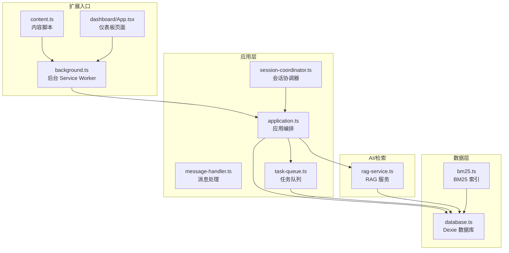
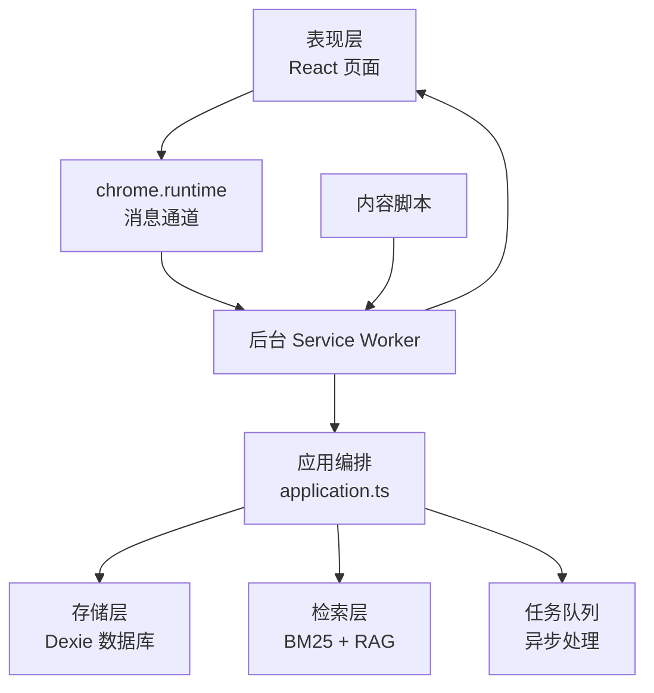
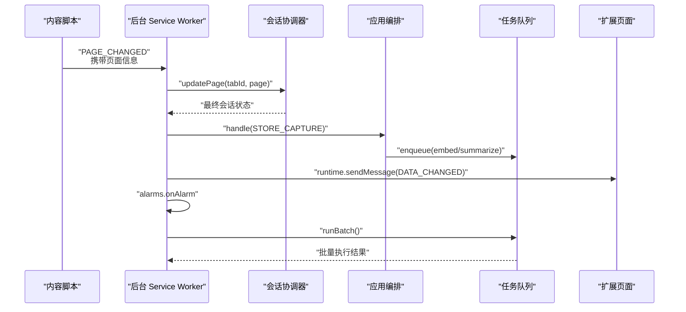
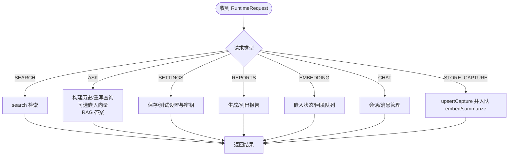
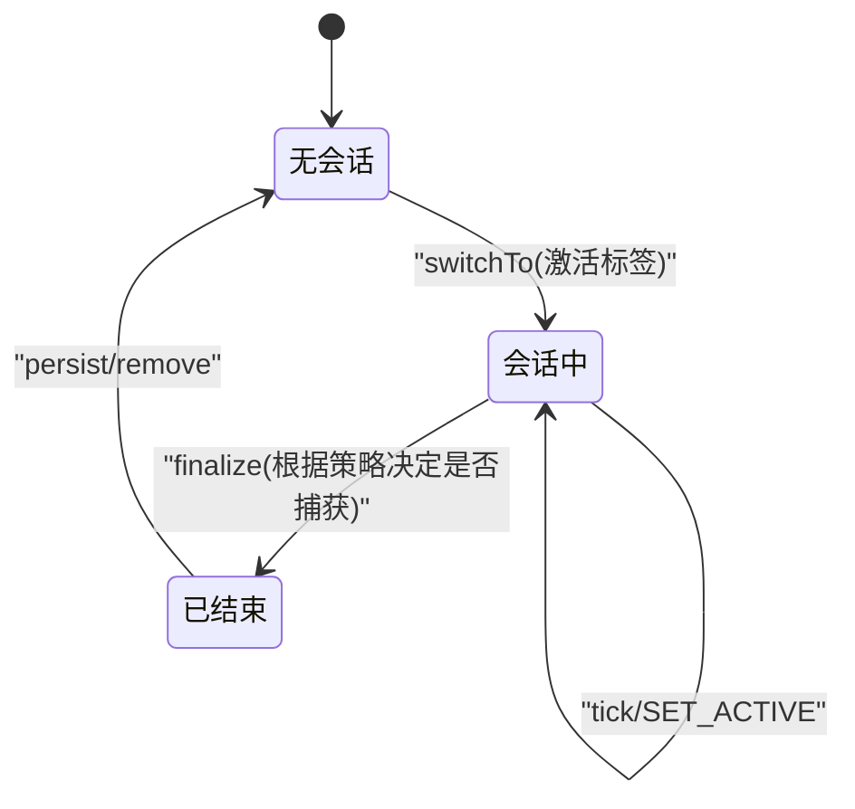
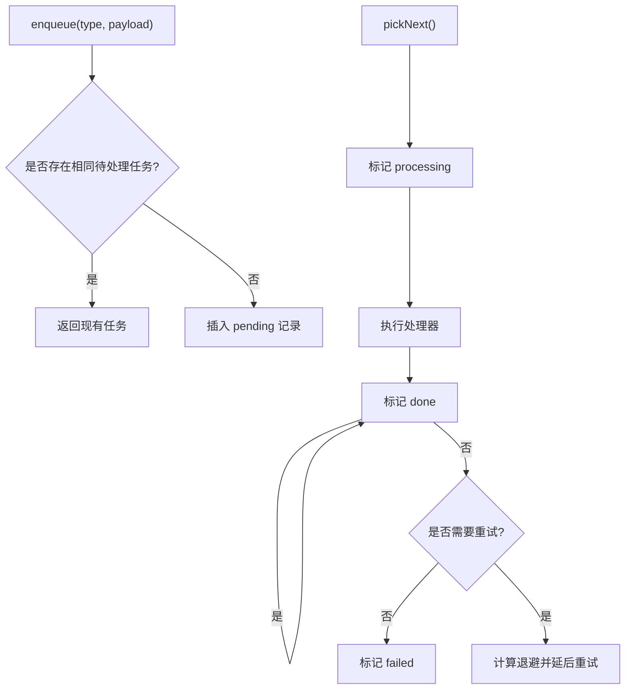
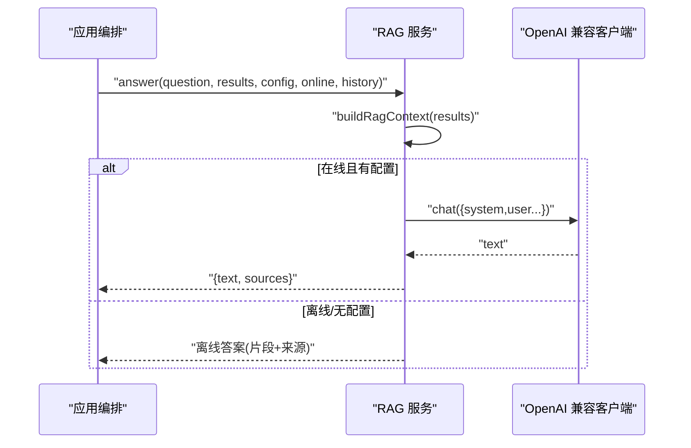
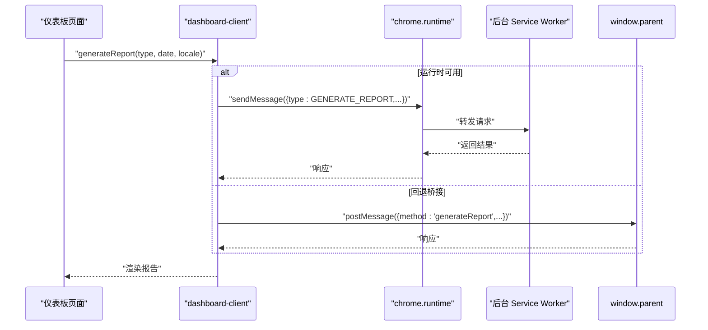
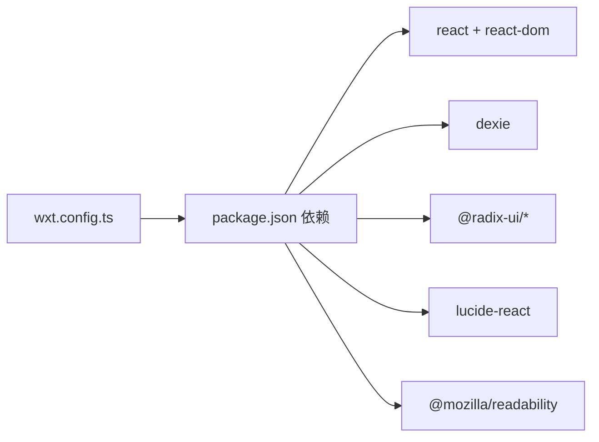

# 技术架构概览

<cite>
**本文档引用的文件**
- [wxt.config.ts](file://wxt.config.ts)
- [package.json](file://package.json)
- [entrypoints/background.ts](file://entrypoints/background.ts)
- [entrypoints/content.ts](file://entrypoints/content.ts)
- [src/background/application.ts](file://src/background/application.ts)
- [src/background/message-handler.ts](file://src/background/message-handler.ts)
- [src/background/session-coordinator.ts](file://src/background/session-coordinator.ts)
- [src/shared/messages.ts](file://src/shared/messages.ts)
- [src/shared/types.ts](file://src/shared/types.ts)
- [src/shared/constants.ts](file://src/shared/constants.ts)
- [src/storage/database.ts](file://src/storage/database.ts)
- [src/queue/task-queue.ts](file://src/queue/task-queue.ts)
- [src/capture/session-machine.ts](file://src/capture/session-machine.ts)
- [src/search/bm25.ts](file://src/search/bm25.ts)
- [src/ai/rag-service.ts](file://src/ai/rag-service.ts)
- [src/ui/dashboard-client.ts](file://src/ui/dashboard-client.ts)
- [entrypoints/dashboard/App.tsx](file://entrypoints/dashboard/App.tsx)
</cite>

## 目录
1. [简介](#简介)
2. [项目结构](#项目结构)
3. [核心组件](#核心组件)
4. [架构总览](#架构总览)
5. [详细组件分析](#详细组件分析)
6. [依赖分析](#依赖分析)
7. [性能考量](#性能考量)
8. [故障排查指南](#故障排查指南)
9. [结论](#结论)
10. [附录](#附录)

## 简介
BrowseMemory 是一个基于 Chrome MV3 的扩展，旨在对本地浏览记忆进行检索与问答。其核心目标是通过内容脚本捕获页面信息，由后台 Service Worker 协调会话与任务队列，并结合本地 IndexedDB 存储与可选的向量嵌入能力，提供搜索、摘要、报告与 RAG 能力。本文档从架构视角梳理表现层、应用层、数据层的职责与交互，解释事件驱动与消息传递机制，说明关键技术栈选择的原因与权衡。

## 项目结构
项目采用按“功能域+层次”混合组织方式：
- 扩展入口点：background（后台）、content（内容脚本）、多个前端页面（dashboard、options、sidepanel）
- 核心业务逻辑：src/background、src/capture、src/search、src/ai、src/reports、src/queue、src/storage、src/ui
- 共享契约：src/shared（类型、消息协议、常量）

图表来源
- [entrypoints/background.ts:1-241](file://entrypoints/background.ts#L1-L241)
- [entrypoints/content.ts:1-44](file://entrypoints/content.ts#L1-L44)
- [src/background/application.ts:1-388](file://src/background/application.ts#L1-L388)
- [src/background/session-coordinator.ts:1-157](file://src/background/session-coordinator.ts#L1-L157)
- [src/queue/task-queue.ts:1-126](file://src/queue/task-queue.ts#L1-L126)
- [src/storage/database.ts:1-80](file://src/storage/database.ts#L1-L80)
- [src/search/bm25.ts:1-166](file://src/search/bm25.ts#L1-L166)
- [src/ai/rag-service.ts:1-66](file://src/ai/rag-service.ts#L1-L66)

章节来源
- [wxt.config.ts:1-19](file://wxt.config.ts#L1-L19)
- [package.json:1-49](file://package.json#L1-L49)

## 核心组件
- 扩展入口
  - 后台 Service Worker：负责任务调度、定时器、消息监听、会话协调与持久化、通知扩展页面数据变更。
  - 内容脚本：监听页面 URL/标题变化与 DOM 变更，提取页面信息并通过消息发送给后台。
  - 前端页面：仪表板、选项页、侧边栏等 React 页面，通过 runtime 或 postMessage 与后台通信。
- 应用层
  - 应用编排：统一处理运行时请求，协调存储、检索、RAG、任务队列、报告等。
  - 消息处理：封装错误转换，屏蔽底层异常细节。
  - 会话协调器：维护当前阅读会话状态，决定是否捕获页面。
  - 任务队列：去重、优先级、重试退避、持久化。
- 数据层
  - Dexie 数据库：IndexedDB 封装，版本迁移，多表模型。
  - BM25 索引：构建与查询，支持标题权重与倒排统计。
- AI/检索
  - RAG 服务：构造上下文、调用大模型、解析引用与来源。

章节来源
- [entrypoints/background.ts:1-241](file://entrypoints/background.ts#L1-L241)
- [entrypoints/content.ts:1-44](file://entrypoints/content.ts#L1-L44)
- [src/background/application.ts:1-388](file://src/background/application.ts#L1-L388)
- [src/background/message-handler.ts:1-22](file://src/background/message-handler.ts#L1-L22)
- [src/background/session-coordinator.ts:1-157](file://src/background/session-coordinator.ts#L1-L157)
- [src/queue/task-queue.ts:1-126](file://src/queue/task-queue.ts#L1-L126)
- [src/storage/database.ts:1-80](file://src/storage/database.ts#L1-L80)
- [src/search/bm25.ts:1-166](file://src/search/bm25.ts#L1-L166)
- [src/ai/rag-service.ts:1-66](file://src/ai/rag-service.ts#L1-L66)

## 架构总览
BrowseMemory 采用分层架构：
- 表现层：React 页面（仪表板、选项、侧边栏），通过 runtime 或 postMessage 与后台交互。
- 应用层：后台 Service Worker 作为中枢，协调会话、消息、任务与业务逻辑。
- 数据层：Dexie 提供本地数据库访问，BM25 支持全文检索；任务队列异步化长耗时操作。

图表来源
- [entrypoints/background.ts:1-241](file://entrypoints/background.ts#L1-L241)
- [src/background/application.ts:1-388](file://src/background/application.ts#L1-L388)
- [src/storage/database.ts:1-80](file://src/storage/database.ts#L1-L80)
- [src/search/bm25.ts:1-166](file://src/search/bm25.ts#L1-L166)
- [src/queue/task-queue.ts:1-126](file://src/queue/task-queue.ts#L1-L126)

## 详细组件分析

### 组件A：后台 Service Worker（事件驱动与消息传递）
- 角色：扩展中枢，负责定时器、标签页事件、消息监听、会话切换与持久化、任务执行。
- 关键流程：内容脚本上报页面变更 → 会话协调器决定是否捕获 → 应用编排落库与入队 → 任务运行器批处理 → 通知扩展页面数据更新。
- 错误处理：消息处理器捕获 OpenAI 请求错误并返回标准化响应码。

图表来源
- [entrypoints/content.ts:1-44](file://entrypoints/content.ts#L1-L44)
- [entrypoints/background.ts:1-241](file://entrypoints/background.ts#L1-L241)
- [src/background/session-coordinator.ts:1-157](file://src/background/session-coordinator.ts#L1-L157)
- [src/background/application.ts:1-388](file://src/background/application.ts#L1-L388)
- [src/queue/task-queue.ts:1-126](file://src/queue/task-queue.ts#L1-L126)

章节来源
- [entrypoints/background.ts:1-241](file://entrypoints/background.ts#L1-L241)
- [src/background/message-handler.ts:1-22](file://src/background/message-handler.ts#L1-L22)

### 组件B：应用编排（请求分发与业务编排）
- 职责：根据运行时请求类型分派到对应仓储或服务，如搜索、问答、设置、报告、嵌入与摘要等。
- 特性：支持多轮对话历史、查询重写、可选嵌入向量化、离线回退、存储用量估算、清理过期数据等。
- 复杂度：请求类型丰富，分支较多，但通过消息协议与仓储解耦，保持清晰职责边界。

图表来源
- [src/background/application.ts:1-388](file://src/background/application.ts#L1-L388)
- [src/shared/messages.ts:1-71](file://src/shared/messages.ts#L1-L71)

章节来源
- [src/background/application.ts:1-388](file://src/background/application.ts#L1-L388)
- [src/shared/messages.ts:1-71](file://src/shared/messages.ts#L1-L71)

### 组件C：会话协调器（状态机与持久化）
- 职责：维护当前阅读会话，跟踪标签页焦点、导航与心跳，按策略决定是否捕获页面。
- 状态机：包含 TICK、SET_ACTIVE、NAVIGATE 等事件，累积时长与切换状态。
- 持久化：使用 session storage adapter 将会话状态序列化保存，支持恢复。

图表来源
- [src/background/session-coordinator.ts:1-157](file://src/background/session-coordinator.ts#L1-L157)
- [src/capture/session-machine.ts:1-69](file://src/capture/session-machine.ts#L1-L69)

章节来源
- [src/background/session-coordinator.ts:1-157](file://src/background/session-coordinator.ts#L1-L157)
- [src/capture/session-machine.ts:1-69](file://src/capture/session-machine.ts#L1-L69)

### 组件D：任务队列（异步与重试）
- 职责：去重入队、按创建时间出队、失败重试与退避、定期清理已完成任务。
- 设计：以 IndexedDB 持久化记录，配合后台定时器与手动触发批处理。

图表来源
- [src/queue/task-queue.ts:1-126](file://src/queue/task-queue.ts#L1-L126)
- [src/shared/constants.ts:1-33](file://src/shared/constants.ts#L1-L33)

章节来源
- [src/queue/task-queue.ts:1-126](file://src/queue/task-queue.ts#L1-L126)
- [src/shared/constants.ts:1-33](file://src/shared/constants.ts#L1-L33)

### 组件E：RAG 服务（上下文构建与答案生成）
- 职责：根据检索结果构建上下文，拼装提示词，调用兼容 OpenAI 的客户端生成答案，并解析引用来源。
- 离线回退：在缺少配置或离线模式下，返回基于检索片段的答案与来源。

图表来源
- [src/ai/rag-service.ts:1-66](file://src/ai/rag-service.ts#L1-L66)
- [src/background/application.ts:1-388](file://src/background/application.ts#L1-L388)

章节来源
- [src/ai/rag-service.ts:1-66](file://src/ai/rag-service.ts#L1-L66)

### 组件F：表现层（仪表板与消息桥接）
- 仪表板页面：展示日/周/月报告，支持一键生成与跳转设置。
- 桥接客户端：优先使用 chrome.runtime，若不可用则通过 postMessage 与宿主页面通信，支持超时与错误码映射。

图表来源
- [entrypoints/dashboard/App.tsx:1-208](file://entrypoints/dashboard/App.tsx#L1-L208)
- [src/ui/dashboard-client.ts:1-148](file://src/ui/dashboard-client.ts#L1-L148)
- [src/background/application.ts:1-388](file://src/background/application.ts#L1-L388)

章节来源
- [entrypoints/dashboard/App.tsx:1-208](file://entrypoints/dashboard/App.tsx#L1-L208)
- [src/ui/dashboard-client.ts:1-148](file://src/ui/dashboard-client.ts#L1-L148)

## 依赖分析
- WXT 框架：提供 MV3 扩展开发工具链、React 模块与清单配置。
- React 生态：UI 组件、图标库、样式合并等。
- Dexie：IndexedDB 封装，版本迁移与实体表定义。
- @mozilla/readability：页面内容抽取（用于后续增强）。
- 事件与消息：chrome.tabs、chrome.alarms、chrome.runtime、chrome.sidePanel。

图表来源
- [wxt.config.ts:1-19](file://wxt.config.ts#L1-L19)
- [package.json:1-49](file://package.json#L1-L49)

章节来源
- [wxt.config.ts:1-19](file://wxt.config.ts#L1-L19)
- [package.json:1-49](file://package.json#L1-L49)

## 性能考量
- 异步化与批处理：通过任务队列与定时器批处理嵌入与摘要，避免阻塞主线程。
- 去重与退避：减少重复任务与抖动，合理退避降低外部服务压力。
- 懒加载与离线回退：在缺少密钥或网络不佳时返回片段式答案，保证体验连续性。
- 存储清理：定期清理过期数据与已完成任务，控制数据库增长。

## 故障排查指南
- API 连通性测试：通过 TEST_CONNECTION/TEST_EMBEDDING_CONNECTION 返回标准化错误码，便于前端提示。
- 任务失败定位：检查任务记录状态与重试次数，关注退避阈值与清理周期。
- 会话未捕获：确认策略配置（最小阅读时长、黑名单、隐身模式）与会话状态。
- 数据库异常：核对版本迁移与索引一致性，必要时清理过期数据释放空间。

章节来源
- [src/background/application.ts:1-388](file://src/background/application.ts#L1-L388)
- [src/queue/task-queue.ts:1-126](file://src/queue/task-queue.ts#L1-L126)
- [src/background/session-coordinator.ts:1-157](file://src/background/session-coordinator.ts#L1-L157)

## 结论
BrowseMemory 以 Chrome MV3 为基础，采用后台 Service Worker 作为中枢，结合内容脚本、任务队列与本地数据库，实现了从页面捕获到检索问答再到报告生成的完整闭环。通过清晰的分层与消息协议，系统具备良好的可维护性与扩展性；同时在性能与可靠性方面做了多项权衡，满足本地化与隐私友好的需求。

## 附录
- 关键技术栈选择原因
  - WXT：提供开箱即用的 MV3 开发体验与 React 集成。
  - React：组件化 UI，便于构建仪表板与设置页。
  - Dexie：简化 IndexedDB 使用，支持版本迁移与事务。
  - @mozilla/readability：为未来内容抽取与摘要增强奠定基础。
- 权衡与约束
  - MV3 限制：后台常驻受限，依赖 alarms 与消息驱动。
  - 存储容量：通过保留天数与清理策略控制增长。
  - 外部服务：API 密钥与网络稳定性影响功能可用性，提供离线回退。